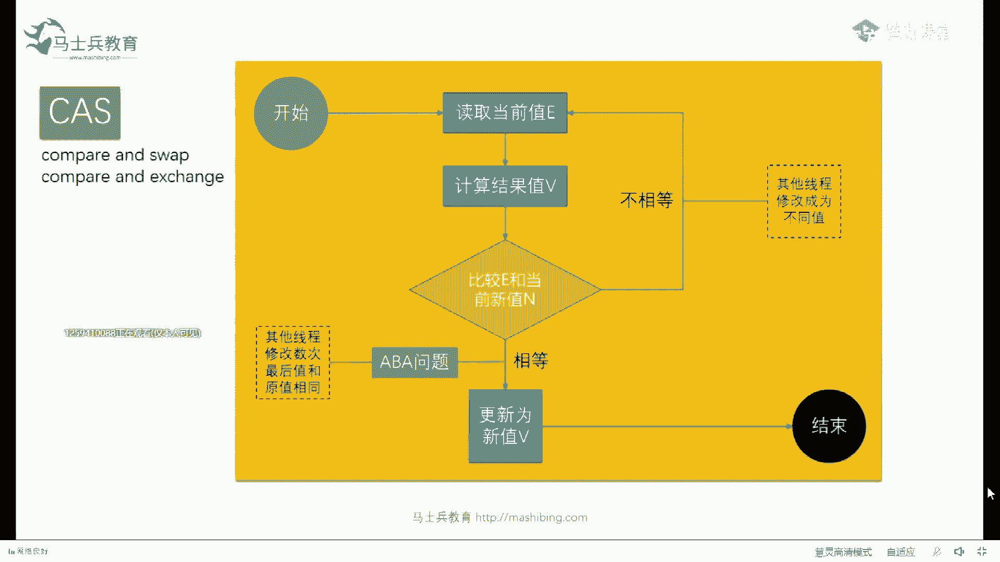
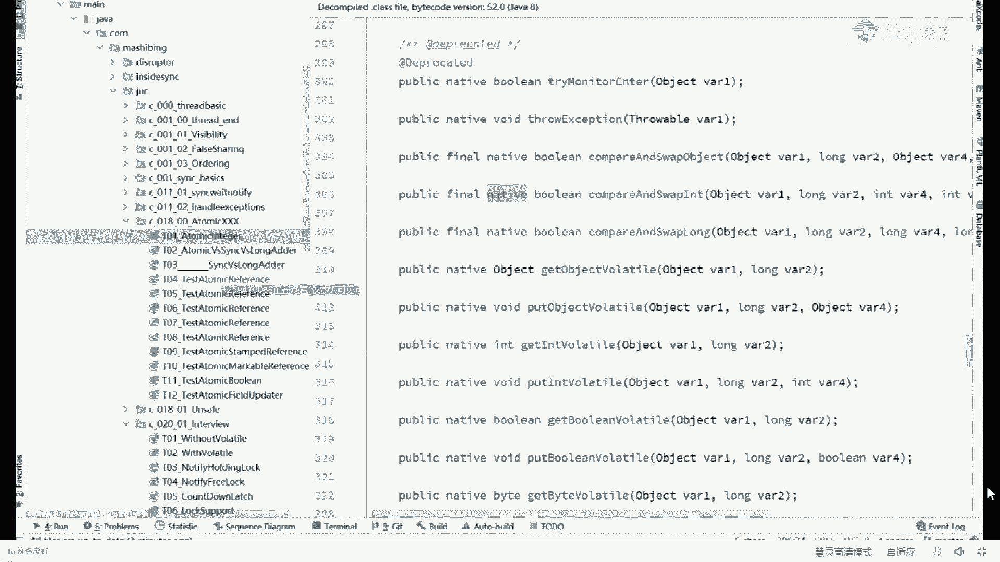
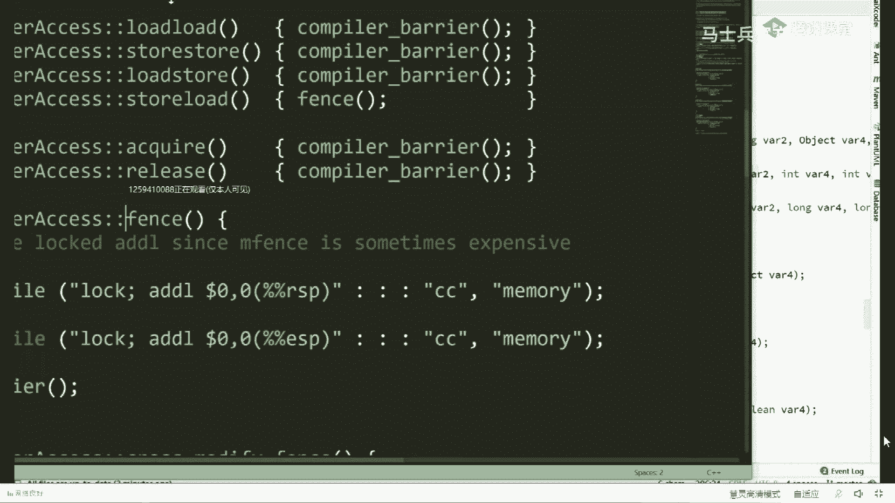
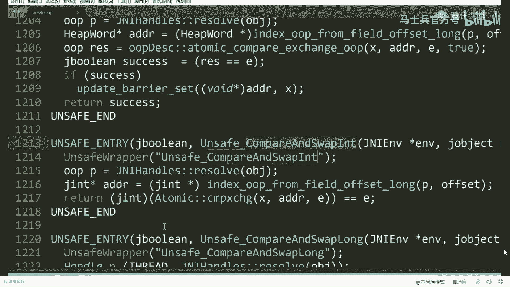
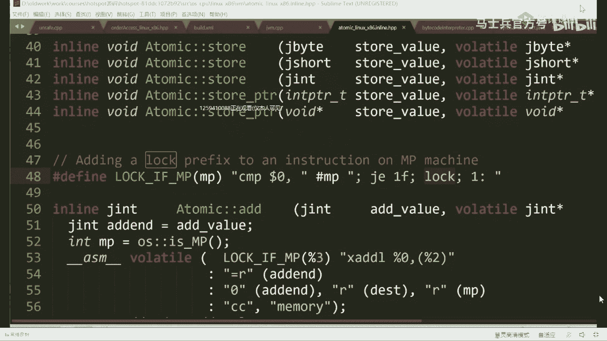
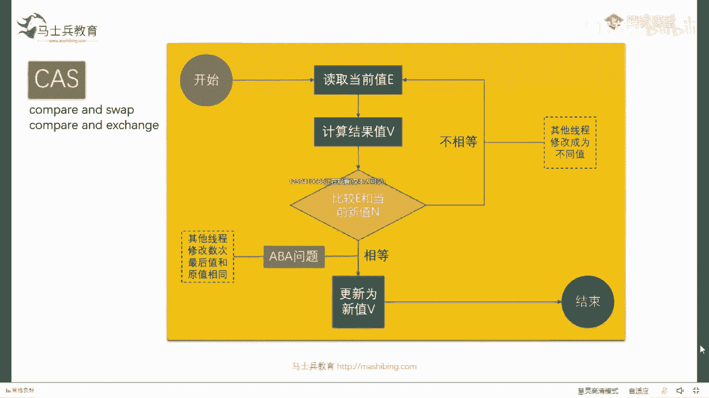
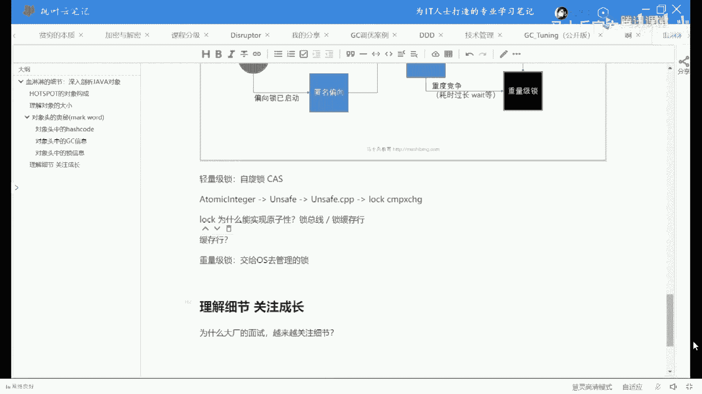

# 【马士兵教育】MCA架构师课程 主讲老师：马士兵 - P46：50w年薪面试题：5：所谓的锁升级其实就是对象头信息的变化你明白吗？ - 马士兵官方号 - BV1mu411r78p

但这个问题呢实际上是那个cs里面比较简单的问题，这个问题是cs里面比较简单的问题，我们说一个cs里面比较复杂的问题，我看看我看看这个难度能不能给讲给大家听，听我说，看这里啊。

这个cs里面比较复杂的问题是这个，那么这里是个八，我们把它读过来，读过来之后呢，呃呃读过来之后呢，我们我们把它改成九九，写回去的过程呢，实际上是我刚才写了一个维码，这个维码叫做if，你哥们儿。

你是不是依然等八对吧，如果你依然等八的话，我把你改成九，那我想问你的是，如果在这个这个过程之中，比方说我判断你确实依然为八，我刚判断完，我还没有来得及把你改成九，然后这个时候你用九把12给覆盖了。

你不又把别人的值给覆盖了吗，来能听懂这个问题的老师可以，对吧，所以cs如果你想解决问题的话呢，你你你起起码保证一点，就是说这个玩意儿一定是要是原子操作。

是不是你就是你这个最底层的这个操作必须得是原子操作，大家有的约会可能会说了，对，这个就是原子性吗，嗯就这两这两个必须中间不能被人打断，那他是怎么做到的呢，这个也是这是原来阿里阿里是面试的一个问题啊。

这个不跟不是说事事听啊，提阿里，这就是他面试的一个问题呃，为了解决问题呢，实际上整个过程比较复杂，我讲给你听啊，我一点点讲，你别着急，为了让你理解这个问题，我们可以考虑去读一下jdk的源码。

通过jdk的源码来解决，呃，你想读这个cs的源代码呢，我建议你，可以读这个类，这个类呢叫做atomic integer，atomic integer，呃，像我刚才讲的举的那个例子啊。

那个对于一个对于一个一个数字来说，我们好多线程呢都对它进行加加呃，我们要想保证数据的一致性，除了用锁之外，我们还可以考虑用用它用原子类叫原子的integer，atomic injure，什么叫它。

为什么叫atomic integer，就是在这个integer里面，它所有的方法都是可以保证原子性的这个意思，所有的方法都可以保证原子性，就是中间你不用上锁，也就是说你看这儿看这儿。

我最开始的时候有一个can呢，它的初始值为零，呃然后呢我这里呢有一，个方法m在这方法m里面呢，我给这个count加了1万次，叫increment and get，就是它的一个方法。

类似于count加加好吧，然后呢我起了100个县城，100个县城，100个线程，然后呢每一个县城的那个让他执行一遍啊，然后等他结束最后的结果呢，当然它一定是100万，为什么呢。

由于atomic integer内部全是原子性的，你不需要上锁，所有的结果一定是正确的，这小程序比较简单，呃，我我我我就我就不在这过多解释了，可以吧，还可以继续给老师扣一，我们主要探究的是什么。

主要探究的是tn地址，在没有上锁的情况下，没有用synchront的情况下，它到底是怎么实现的，对不对，好看这里，看你们问的这些问题啊，叫老师现在用的这个什么时候编程需要，第一你面试的时候必须需要。

第二，如果你想写那种高效率的，比方说抢票的这样的软件，他就需要买票，不可可以不使用分布式锁吗，如果你的票数很简单，当然可以不使用分布式嗯，分布式项目，分布式项目这种分布式的锁嘛，这个不难嗯。

atomic不就是用cs吗，呃这不是废话吗，我现在给你讲的不就是cs原理吗，老师现在用的是什么编程语言，这个编程语言不就是java吗，好看这里啊，我们aaa omic engineer。

然后呢我们我们看到的这个就是，这个atomic imager他在不上锁的情况下是怎么能做到原子性的，好不好，是马老师吗，可以试啊，咳咳咳，嗯，声音这么磁性，声音明显很雄性嘛，看这两个好。

我们继续count their increment，and get好，我们点进去，我们来看看这个背后的代码，它到底是怎么实现的，结果你会发现呢，哥们儿使用了一个类，这个类呢叫unsafe啊，叫不安全。

可能return on safe，点get and and it好，我们再点进去一点点看，当你我们点到这里的时候，你会发现它使用了我们unsafe里面的另外一个方法，这个方法叫什么。

叫compare and swap，and出现了我们熟悉的cs，看到了吧，好我们再点进去，结果很不幸的是，你会发现这里到了native，ok不是你们在聊啥，我的天，来来来来来来重，新来一遍啊，看这里。

为了探究atomic energy为什么可以不使用synchronized也能做到原子性，我们去看它的源码，count the increment and get，你会发现我们调用到了unsafe。

get at end，你会发现它调用了unsafe compared sweat，and也就是cs的方法，结果很不幸的是，当你读到这个方法的时候，它变成了native，native是什么意思啊。

native就是c和c加加的代码嘛，对不对，native是c语言或者c加加语言实现的，那好，那我们就看看c和c加加的代码好吗。

因为我们毕竟得追求。

高薪嘛，好如果你还记得的话，我们用到的那个，那个lay叫什么来着，java类叫unsafe，好对应的jvm源码里面就是这个unsafe，点ppt啊，sorry，点c p p p p t了，unsafe。

cpp c加加代码，那我在这个c加加代码里面，大家还记不记得他用的是哪个方法来着，叫compare and swap in，对不对，他们搜一下。

好看这里这里就找到了我们unsafe compare and swap inc，加加方法好，讲到这儿还能跟上的，给老师扣一，c plus plus这个什么软件。

我都不知道你们在关注啥，这什么软件很重要，不就读个c加加代码的软件吗，sublime嗯，然后呢我们要稍微读一下，就是它里面到底是怎么实现的，其实呢你其他的我全部给你略过，我们主要看最细节的代码就可以了。

代码在这，实际上它调用的是atomic这个类原子c加里面那个原子类，compare and exchange方法，那好那这个东西在哪呢，好我们点过去，我直接给你点过去，就在93号。

最终我们找找找找到了这个方法的最终实现，也就是我们atomic energy最终靠的就是这个实现好，这个实现是怎么实现的呢，你往这儿看，这里面有个简单的判断。

他说首先判断你os e m p这个呢我就不给你看源码了，mp这件事特别容易解释，它的全称呢叫做，multi，persons是吧嗯，多人运动哦，sorry错了，重新耕种啊，猫体，processors。

多处理器就是说如果你的机器上有好多个处理器，好多个盒，那么它最终的实现是怎么实现的呢，是叫lock if mp，这就不用我解释了吧，就if mp，如果你是多核，前面加一条lo，最后呢是有一个这个玩意儿。

这玩意儿是什么东东呢，这个玩意儿是一条汇编指令，compare and exchange，通过这儿你可以看到哦，原来在我们的cpu级别，在我们的汇编级别。

它就有一条汇编指令叫compare and exchange，如果这事你理解不了的话，画个图你就理解了，这是一颗cpu，这是一颗cpu，这是我们内存里面的某个数据里边写了个八，我的cpu有一条。

原始的指令可以用cs的方式，也就是compare and swap的方式来改，这个八cs方式怎么改呀，把八读到这个cpu里面来改成九，往回写的过程之中会比较八，你还在不在，如果你还是八，我就把你改成九。

如果不是我，我再重新读，能听懂吧，这就是这条指令的含义，这是一条汇编指令，这是从宏观层面，从微观层面都是一样的，来这块儿还能跟上这老师课印，那我当你对他就是底层的自选指令嘛，但现在的问题依然是一样的。

依然是一样的，就说这个问题啊，哥们儿，你是不是原子性的，如果你要是原子性的，我不用做任何操作，无所谓了，就是吧，你只要原子性的哦，我就明白了，原来是atomic。

到最后无非就是底层有一条原子性的语句给他支持了嘛，就这么简单嘛，对不对，好听，我说这个呢如果你去查英特尔的汇编手册，它会明明白白的告诉你，这个东西不具备原子性，原子性的，没有啊，不对没有。

那么到底怎么样才能让整个语句能够做成原子性的实现呢，它的奥秘就在于前面那种lock if mp，那好look if mp是个什么东东呢，我们点过去，其他的你不用管，你只要看这条指令就可以了。

lock if mp是当你有多条，当你有多个盒的时候，在后面的汇编语句的前面加一个lock语句，也就是说，也就是说最终的atomic的实现叫lo compare and exchange。

我给你写出来了。

这是轻量级锁的自旋，从我们从atomic integer啊，我们读到了unsafe啊，我们又读到了unsafe，点cp啊，我们读到了，lock compare and exchange，好了。

这是这条汇编指令，也就是说我们所有的自旋锁最终的实现全是它来这块能get到的，老师可以，当然一般来说面试题问到这个程度，这个深度就差不多了，呃不过呢有的面试官还会继续往下问，说为什么洛可能实现。

为什么lock能实现原则性，lock能实现原则性的原理，这个还要听吗，还要继续往下听吗，还要听到口音了嗯，好听我说，洛克为什么能实现原子性好听，我说呃。

一般来说最简单的是说当我们做后面这个汇编语操作的时候，lock会锁总线，这是最简单的实现，这也是一般cpu的实现，我再说一遍，这是一般cpu的时间，什么意思，这是一颗cpu，这是一颗cpu。

我们总是要通过这条总线，对不对，通过总线去访问内存这个吧，那么当我这个cpu做什么操作的时候呢，做这个操作的时候就改了个八的操作的时候把总线锁住，锁住的意思是说只有我能在上面传数据，其他人谁也传不了。

听懂了吧，那这就简单了吗，反正别人也传不了，那我先那个锁锁了之后，然后改改完之后再说好了，这是一种当然其实现在当然当然你可以想象一下啊，就是说如果说cpu锁总线的话，这是cpu，就是cpu。

你把总线给锁了，那等于其他cpu谁也用不了，能不能理解效率太低了好，那这时候怎么办呢，其实往往上往往这时候我们用的是什么呢，是锁，保存行，是锁这个缓存行，ok，什么叫损，不过这里要跟你解释缓存行。

又又又比较费劲了，大药停缓存行吗，就是我给你讲就就没边儿了啊，缓存行行吧，我一会儿讲讲讲给你们听，但是呢我这个河水喝的挺多的，那个哪位小姐姐来一下，踢我一小下，我去上个锁，不是嗓子不太好啊。

帮忙上个厕所对嗯，对，行行啊，求求求老师先跟大家聊一小会儿啊，我上我上个洗手间，hello，差点翻了，马老师去个洗手间哈，然后我给大家顶一会儿，我刚才都没有看到这个评论区，我一直自己在那说。

我现在终于看到了，上不上锁嗯，这个你说老板上厕所谁敢去偷看，是不是，反正m是不敢去排队，你们这个技术学得很好呀，生活中随时要用，刚好趁着这会儿人多哈，我再放一下这个码。

今天晚上的这个笔记资料是vip里边有的哈，没有加过小姐姐的，赶紧扫个码，马老师来了，这个码我就得撤走了，然后赶紧扫一个嗯，扫到下课之后，马老师把笔记发给我们，我们第一时间就发放给大家，然后录播的话。

你问一下你的小姐姐哈，所有的资料，所有的录播，所有你想要的东西，这个简历模板，大厂面试题，技术分享资料，职业规划的指导，你想要的一切，你直接扫码加小姐姐，有了就别扫了哈，专业一点，不要做渣男啊。

专业一点加一个就行，然后呃下课了之后直接跟他沟通，对好多程序员，你们都是海王，一个人扫n个，聊得过来吗，小九漂亮吗，小九特别漂亮，你咋的，你要分手吗，你可以考虑一下，可以换一个。

当你的女朋友不支持你干啥的时候，你就把它换掉，扫了啊，大家都记得，扫一会我把码撤走了，这些上面这五个点所有的资料都可以领啊，我把这个拿走，小壮壮好看吗，那就是天仙还好看嘛，你直接跟他聊就行。

马老师回来了，我撤了啊，拜拜，如此的迅速速去而赎回啊，好看这里啊就是这个我今天没打算讲缓存好的，但是大家想听的话，一并讲给大家听嗯，关于混子王这件事呢又比较复杂，我先把ppt打开，嗯嗯，好稍等啊。

嗯就是你，嗯看这里啊，就是关于缓存行呢。