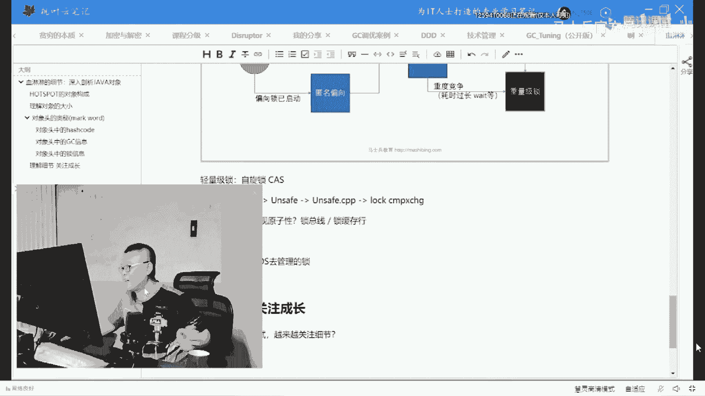
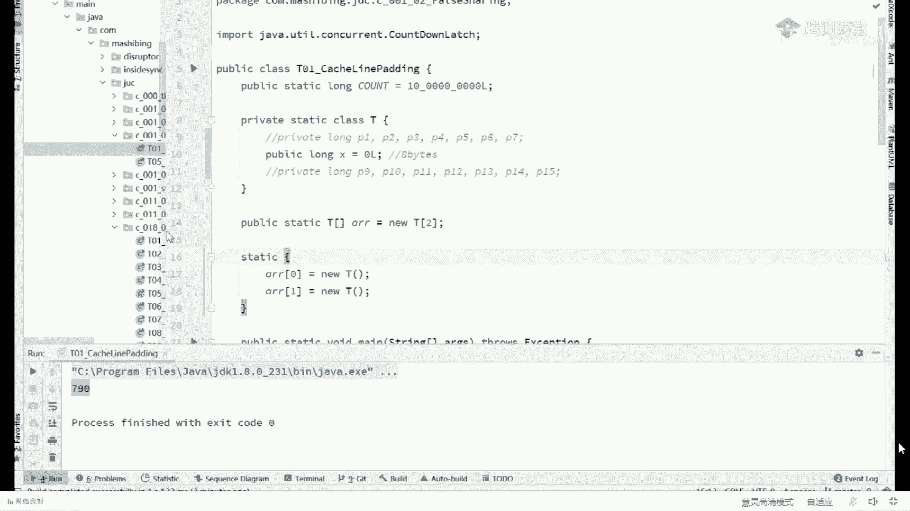

# 【马士兵教育】MCA架构师课程 主讲老师：马士兵 - P47：50w年薪面试题：6：一个Java对象到底有多大你衡量过吗？ - 马士兵官方号 - BV1mu411r78p

缓存啊，缓存呃指的是什么意思，那个缓存呢我先给你解释指的什么意思啊，就是这是这是cpu，这哥们儿速度特别快啊，他就是博尔特是吧，这个内存的内存速度超级慢啊，马老师啊，那博尔特比马老师快多少呢。

大概快100倍，快100倍，那这个事儿就比较麻烦了，那就意味着说我cpu如果发出一条指令，然后去内存里面取一个数据过来，我发出指令之后，我得等99个时间周期，这个数据才能取过来，这个能不能听懂。

所以呢我们想增加取数据的效率，我们怎么做呀，办法特别简单，就是在cpu和内存之间增加一些中间环节，这是北京，就是上海，我取数据取太慢了，怎么办，能不能把上海的数据先放到徐州，徐州的数据先放到济南。

然后北京取的时候先从从济南取，可不可以在中间加几层缓存啊，还有这是缓存最基本的概念了，那好那它中间有几层缓存呢，一般来讲呢从cpu到内存一共有三级缓存，但这里有一有一些简单的数据。

是近几年的测试cpu的计算单元到自己内部的寄存器，大概是小于一个纳秒cpu，内部的计算单元，如果想访问主内存，约需要80纳秒，什么情况，no不会吧，他不会把我刚才，稍等啊，我登录一下我。

我别把刚才记记了半天的笔记给弄丢了，你不要这样地看着我，我给你记了半天笔记，别到时候给弄丢了啊，我先登录一下，ok ok还健在啊，good这就是缓存的重要性，哈哈哈，你说的很对啊。

好听，我说刚才我们讲聊的是这个缓存的最基本的概念啊。

好我们继续聊呃，一般来说呢，从cpu到计算，从cpu到内存啊，中间经历了三级缓存，当我讲到这儿，很多人可能会说，老师这个中间几级缓存为什么不是四级，为什么不是二级，为什么不是一级。

这东西是一个折中的结果，是一个工业上的妥协的结果，集数越多，你要存的份数也就越多，虽然说他访问最近的访问比较比较快，但是你要存的分数就太多了，那么集数越少呢，你访问的速度会稍慢，但是存的分数也会变少。

所以有利有弊，中间是一个折中的结果，听懂了吧，spring 3级缓存啊，这跟这个关系不大啊，别往一起混，这是cpu到内存之间中间有三级缓存，那么这三级缓存呢，分别叫l one l two和three。

那好这个l one l two和three长什么样呢，我们现在的cpu呢多数都是一颗一颗的唉这是一颗唉，这也是一颗在一颗cpu内部往往有好多个盒，这是一个盒儿，这又是一个和好了。

一般来讲我们的l one位于核的内部，l two呢也位于核的内部，而l three我们位于一颗cpu，多核共享，然后多颗cpu共享内存好，这个图能看懂的，给老师扣个一，相对简单一看就能理解。

但是现在我向你提个问题啊，我们现在的运算单元现在要找一个数值i，那么根据缓存它的理论，他首先去哪里找呢，首先去l一里面找，那l一里面有i吗，去内存里面找这个i，假如它是八好，这个班呢往l3 放一份。

往l2 放一份，往l一放一份，放到寄存器开始做计算，那下次我再用到这个i的时候，我是不是直接l一里面就有了，比如说我for循环1万次，对于i加加我，用得着每次都去内存里面读一遍吗，没有这个必要。

我只要从l one里面最近的那个缓存里面找到就ok，那这样第一次骑上是不是更慢了，是的，有利有弊，是这样的啊，好了同学们来这块能听明白的，给老师扣个一，那现在又来第二个问题啊，就是说同学们你们琢磨一下。

我们取数据的时候，是我们用到一个数据取一个吗，比方说我用个布尔类型，就一个字节，我就把这一个字节弄进来，那我想用这一个字节旁边这个字节呢，那不好意思，又得来一遍，从121~23到，然后再返回去又来一遍。

那为了改进效率，我们可不可以这样做，就是当我读这个数据的时候，把它周围的周围的数据一块一块的放进来好实际当中也是这么做的，这样做的话呢会提升效率，比如说我们对一个数组的循环，如果你不能，理解的话。

这是一个数组，对一个数组循环，我们取到第一个，我们顺带着也把它周边的一块往上放进来，放到l3 里，放到l2 里，放到l一里，那我们当我们对这个数组进行循环的时候，我下次再找这个数组的第二个值。

我就不用去内存找了，我这就直接找过来了，对这个被称之为空间局部性原理啊，没错说的很对，来这块儿能听明白的，给老师口音对象都有锁上，你还讲吗，其实跟锁是这这个跟锁是息息相关的，我们一块穿过来的啊。

我们讲这个lock lock所缓存缓存行锁什么东西，就是锁这个，当然有有有同学可能会说，老师啊，那这个大小到底是多少呢，就是你你你你把这块数据读过来，这块数据到底是多大呢，是不是越大就越好呢，未必。

如果你的数据特别大，那么每一次读过来，虽然你命中率很高啊，你你访问多数情况下都在l one里呢，但是你往l one里装数据的这个过程就太费劲了，因为你数据量数据很大，另外呢如果里边没有的话。

你得用用别的一块数据把这块给替换掉，太费劲了，那如果太小呢，如果太小的话，你命中率不高，每次找都得从内存拿一遍，所以又是一个工业，折中的结果好，最终的这个数据是64个字节，好吧。

来这个呢被称之为一行数据，一行数据啊被称之为缓存行，好了，这就是缓存行最基本的概念，而one和out two有什么区别，一个慢，一个快，一个大一个小，就是中间在济南和徐州中间加了一层而已。

没有什么太大区别，嗯那这块能听明白了，我们就来琢磨一件事儿了，我们位于同一行，在一个行里面，当我一颗cpu要用x值的时候，我们会把这一行数据从这里读进来，从这里读到l3 ，l3 ，读到l2 ，l2 。

读到l1 ，这个没问题，对不对，那如果说我另外一颗cpu啊，这颗cpu它用到了这个缓存行里面的y数据，那他用到y的时候，同学们你们琢磨一下这个y的话，是不是也得把同样一行读过来，读过来读过来。

那现在问题就在于，当我把这个改了之后，我要不要通知另外一边说这个，x已经被我改了，来这块能听明白的，给老师扣个一，就这里面也会涉及到同步的问题，那要不要呢，要还是不要是要的，不用啊，有的时候不用。

有的是说要这东西呢是取决于编程，如果你程序上要求说你必须通知，那么他就会通知，如果你程序上不要求仔细听，仔细听，我说，如果你程序上不要求，那么这个时候是通过一种机制来自动化的完成同步。

这种机制被我们称之为叫缓存一致性协议，好这个词儿我觉得应该都听说过，对不对，缓存一致性协议应该都听说过吧，听说我给老师扣个一好吧，无所畏惧，说敲完msi错了，那个那个不是不是。

不是那个那个那个那个只是缓存一致性协议的一种协议啊，我们要精确一点，嗯，不严谨对啊，说的很对，我再说一遍，这里头呢跟那个我们自己写的程序里面的锁没有关系啊，就是cpu内部的自动化的机制就是这样的。

就是在它的这个机制里面呢，由于一个缓存行很可能在多颗cpu之间存在，或者多个盒之间存在，那么这个时候就意味着，我们有必要用一种机制来保持它们之间的数据一致性，好这个数据一致性用什么来保持。

呢我们把它称之为叫缓存一致性协议，这个缓存一致性协议，有同学说volatile，这跟volatile半毛钱关系都没有，你千万千万别在这上面犯糊涂，我再说一遍，wallet tel。

缓存一致性协议是196几年就出现的东西，所以缓存一致性协议跟volatile没有半毛钱关系，ok由于缓存行的存在，缓存行存在的时候，就意味着我们必须要用某一种机制，好了好了，你们别在这露怯了，我的天哪。

jeffrey carry，别说了，说的一点都不对啊，这个这个再说就丢人了，别说了啊，看这里呃，就意味着我们必须得采用一种机制，让不同的缓存行在不同的cpu核之间保持一定的数据一致性，好吧。

那好那这种机制叫什么呢，这种机制被我们称之为缓存一致性协议，但是这个缓存一致性协议在不同的cpu之间，不同的cpu采用的是不同协议，就是自己的cpu厂商自己定的，英特尔的cpu被我们称之为叫msi。

而像其他的arm的，mac的，其他的各种各样的cpu，他们都有自己的协议，有的是m o s i，有的是m s i，有的叫synapse，有的叫firefly，有的叫dragon好，他叫什么没有关系。

总而言之，大家一定不能把msi称之为缓存一致性，它只是说它是英特尔cpu的缓存一定性协议，那有同学可能会说，老师这东西跟我们编程，有什么关系吗，展示一个小小的例子，看这个小例子，你要能读懂这个小例子呢。

必须给我记着啊，这缓存一行是多少，一行是多少，64个字节记住了，把这数字先在脑子里过一遍，64个字节啊，那在64个字节里面看这里，在这儿呢我们有一个class t t里面呢只有一个long类型的数据。

这个数据是x，long类型是多少个字节，八个字节，对不对，那一行数据我们说假设一个缓存行能够装多少个浪呢，打个龙好，我们继续往下看，在这儿呢我有一个关于t的数组，这里呢有数组里面有两两个t两个t对象。

这是第一个t对象，这是第二个t对象，接下来我做了一件事儿，这个抗的值是10亿，我用两个线程，线程和cpu的和是一一对应的，我用两个线程，这是第一个线程，第一个线程我对第一个t的x改了10亿次。

第二个线程对第二个t的x改了11次，这是一个小t对象，t对象里面有个x，这是第二个小t对象，这个t对象里面有个x，有一个线程玩了命的改，他改了多少次10亿，另外一个线程玩了命的给他改了多少次呢，10亿。

这是这个小程序所完成的功能，很简单的啊。

那好剩下的这段呢，实际上就是我来计算这两个线程结束到底要花多长时间。

好这小程序能看懂的，给老师扣个一不难，来我们来看一下这个小程序到底花多长时间呢，走你呃，注意啊，这里花的时间是775个毫秒，也就是说我循环这21次，完完事儿之后，796个接近800ms。

但现在我干一件特别奇怪的事儿，你可能以前没有见过的，我把这个打开，我就在他前面放上p一到p77 个没有意义的long类型，在它后面放上七个没有意义的long类型，然后我再跑同一个程序走，你。

这个程序变成了240个毫秒走你240走你240，嘿你还回回都240，241，ok好了，这个就比较好玩了，来你们好好琢磨琢磨，为什么我把它怼上了，七个没有意义的东西，放到前后的时候。

对他的访问反而效率提升了，为什么大家再看一眼，我把这个注释掉，我把这些注释掉啊。

你放心，我把它注释掉，马上变成800个毫秒，看到了吗，原因是什么呀，一次多一行，同行要共享，其实这个程序呢很简单的证明了就是缓存一致性协议的存在，这不知道大家能不能理解啊，看这里，同学们你们想一下啊。

我们说222个t对象，这两个t对象呢在最开始的时候呢，它是前后没有任何数据的遮挡，所以呢这个t对象那个x可以位于这个位置，另外一个t对象的x可以位于这个位置，这两个大概率位于同一行。

那当我们读数据的时候呢，我的第一个线程会把这个缓存行读过来之后，玩了命的改它对不对，然后另外一个线程呢就玩了命的给他对不对，那根据我们刚才所讲的，由于他们两个为同一行，那我对任何这行数据的更改。

我得需要用一种机制通知另外的cpu也，就是说这时候我们的缓存一致性协议，由于我这个我这个是那个英特尔的cpu，所以呢m1 si协议是不是就被触发了，他被处罚的话，他要不要耗时间呀，他一定会耗时间的。

我可以告诉你啊，就是缓存一这个m e s i协议定义是，你往l r r two里面写这个东西的时候，就得做同步啊，当然这是这是cpu级别的细节了，我们先不去管它，就总而言之，由于有这个机制的存在。

我们一边改这个数据的时候，一边还要做缓存一致性，所以我们总的时间就变长了，那有同学可能会说，那老师，那你为什么，前后补上七个，这玩意儿他就不会触发了呢，这个事儿他很难理解吗，我们来看这个简单的说明。

来这是我们的x，我在他前面补了七个long，我在他后面补了七个long，由于我一行数据是多少，64个字节来，你告诉我有没有其他任何有意义的数据能跟我位于同一行，有没有，绝不可能，你想想看。

这是我那个t里面那个数据，这是一个t的t的对象，有另外的t的x能给我为同一行吗，那不可能啊，你这个x最多在这个位置吗，或者在这个位置吗，但是你怎么算也不可能跟我位于同一行的。

因为中间已经够了64个字节了，好了，这会儿能听明白的，给老师扣一，那大家明白这件事儿之后呢，有同学可能就会说说老师真的有人这么写程序是吗，哎不好意思，还真有啊，这个人叫道个理，不知道你听说过他没有。

此人名叫道格里，jdk的作者，linked blocking cue，linked blocking cue。

那个类里面就这么写的，如果你还不能理解的话。