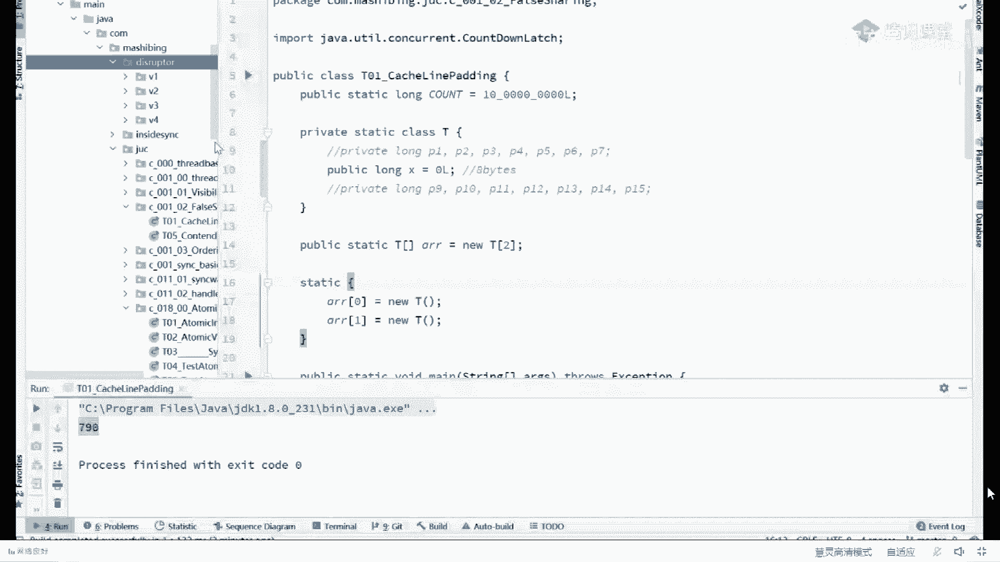
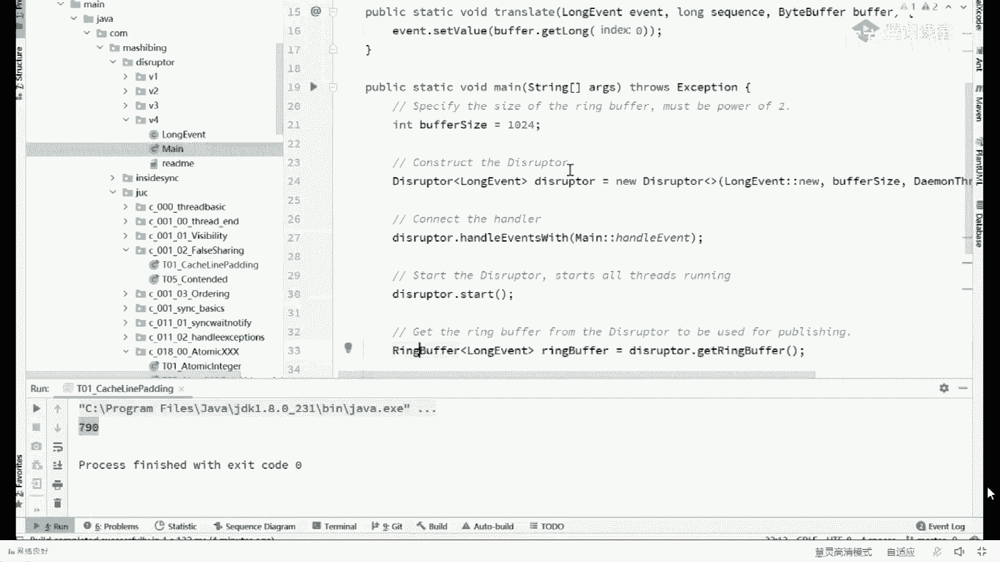
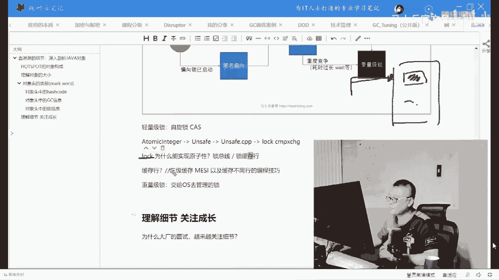

# 系列 1：P48：50w年薪面试题：7：一线大厂70~100万的年薪你拿的到吗？ - 马士兵官方号 - BV1mu411r78p

另外的一个中间件。

这个中间件的名字叫disrupt。

就是他。

它的名字叫做disruptor，你可以自己去查，它是英国一家做贸易做做交易的公司，就是做那个证证券交易的公司l max所开发的一款mq，一款消息处理器，单机版的，它的速度超级超级的快。

他曾经错过一个在开源领域比较有名的一个软件的奖项，叫杜克奖，号称全世界最快的单机版mq，为什么我们讲mq什么叫m q啊，叫message q叫消息队列，对不对，消息队列无非就是一个队列啊。

一个数组或者是一个链表，我们能往里头呢不断的往里头扔消息，还扔满了之后呢，等着消费者把它拿走，这叫生产者消费者问题，那，这哥们儿设计的是一个环形队列，有同学说了。

老师环形队列和这个单向的这个队列有什么区别吗，诶你突然间发现单向队列我永远是需要两个指针的，至少需要两个头，一个尾一个，但是环形队列我只需要一个指针，我只需要指在a下一个位置上就可以了。

下一个位置转满了，那就再指下一个位置，什么时候这个这个位置装满了，等着消费者把它取走，我就又指向下一个位置好了，来这块儿能大概能听明白的，给老师扣一，这叫环形队列，这设计非常的牛逼。

当时是他们刚设计出来的时，候那确实是震惊了开源节，所以杜克讲的也实至名归，当然在这个过程之中呢，他还使用了c，就是这个环形队列，说这个纸箱的这个地儿已经满了满了怎么办，转着圈的等待，知道吧。

他不会去找操作系统老大去等着他，在这儿等，转着圈的等等啊等等啊，等什么时候，你这又空了，我就把你放进去，效率很高，不需要惊动操作系统老大好了。

大家理解了这件事之后呢，我们来看看它的内部的一个实现。

我们刚刚讲的是环形队列，就是这个类的实现，ring buffer，ring环形的buffer缓冲区叫环状缓冲区。

点进去，看当你点进来之后，你会发现这里有一个指针，最开始只在-1这个位置上，下一个位置就是零吗，下一个就是一嘛，就开始转圈了吗，然后你突然间发现哦，原来这里还有特别好玩的p一到p7 。

当然我不跟你讲，你一定不理解这个东西干什么事了，因为这个缓冲缓冲区的指针由于是生产者消费者，所以生产者要用消费者要用多线程访问它是一定的，多线程访问它一定的时候，由于有缓存一致性的关系的存在。

如果它和别的数据位于同一行程的，效率一定就会低，所以我们在编程上阻止他和别人位于同一行，怎么阻止啊，就是在他后面给他怼上，七个long，这哥们儿是个long，八个字节，后面七个long。

56个字节加起来64个，其他人绝对不可能和和这哥们唯一统一好了，因为你是64个字节之外了，对不对，来这块能跟上一个老师，可以，大家会讲到这儿，有同学一定会问，前面呢，你万万万一有数据。

你是你是后面后面没有人根据位于同一行了，那前面呢万一有数据的wave放在这儿呢，这哥俩还是有可能位于同一行呀，对不对，别着急，我们看这个rain buffer。

它的父类是叫做rain buffer fields，对不对，走你remember fields，父类叫做remember padding zoning。

结果你符文发现在他爷爷里面又装了七个狼，那么根据java对于对象的排列规则，他爷爷的数据会排在前面，他会排中间，自己的数据排后面，ok这哥们儿永远不会跟别人位于同一行。

来请把牛逼两个字打在公屏上。

这就是为什么那个，缓存行的存在啊，我只是下去证明了缓存行的存在，三级缓存也s，以及，缓存不同行的，编程技巧，那有同学说了，老师你讲半天了，不是讲了个lock的吗，现在还能回得来吗。

讲着讲着公开课嘛，我们就分分分散，属于是那个很很很开放的这个思维。

就开始慢慢的往上往往上讲是吧，讲到哪儿算哪儿，我们讲logo logo是什么，logo是叫索缓存行，记得，发散性课程对发散性讲课。

log呢叫做索缓存行，也就是说呀原来锁总宪，你所把所有人的这个通道全给锁了，大哥这个太狠了，这个不合适，人家本来不想人家，你访问的是这个数据，结果你把录一录一读，人家去访问别的数据都访问不了了。

这个效率是不是不是太低了，他肯定低，我再说一遍啊，这是这是cpu，这是cpu，你们哥俩去访问内存里的同一个数据八，但是内存人家还有别的数据呢，您您您老人家在这个这个cpu在访问这八的时候。

把这路全给堵了，我这个cpu想去访问别的数据都访问不了，能不能听懂，所以我现在改成我只锁定这一行，就锁这行好吧，对我就锁我自己的数据。

我不占用别人的数据，好了。

所以我们效率是提高了lock，这是它的底层实现。

我们再往回，因为我们从脑袋开始讲锁，讲重量级所讲轻量级锁。

讲那个交给操作系统的重量级所讲给自己管理的cas自旋锁。

我们再往回还能回得来吗。

我们得回到这张图上了。

好我们再往回再往回的问题，现在我们讲了两种类型的锁，这种类型的锁呢叫cs，这种类型的锁叫重量级，注意这个重量级未必不是cs，这个重量级只是交给操作系统老大，本来这个里面全是jvm自己管理。

这是gm自己管的o然后呢，您老人家要是交给操作系统老大，那不好意思，这个就叫重量级，因为你需要经过中，间人他就一定会中，你自己管就要轻得多，那自己管这个过程和重量级锁，这个过程。

我们你仔细想一下阿里的一个问题，为什么我们有了轻量级锁，还需要重量级锁，能不能听懂，来我把这个问题写出来。

为什么轻量级锁可以解决同步问题，自选吗，但是也需要重量级所有的存在，y原因是什么，一直自寻，他也不是个事儿啊，唉这大家伙脑子都在线啊，不错对，这里面没有跟大家交代重量，你所有一个最重要的阶段。

这个重量你所的阶段是什么呢，重量你所有一个最重要的它的机制啊，叫做排队，注意轻量级锁自旋是不排队的，什么叫不排队的呀，这个，有一哥们儿在里边儿坐着，比如说是如地如底在这坐着，然后你像其他什么海啊，坑啊。

石头人啊，爱拼才爱赢才会拼呀，来了来了之后干嘛呢，转圈儿，拎着裤子赶紧转转转转转转转转转转转转，然后谁先发现rudy出来了，谁就赶紧进去，他是不排队的，不排队，ok那不排队不排队的意思是什么呢。

它就它就是一个while循环，它是要消耗cpu资源的，while循环也是一种语句啊，它是需要消耗cpu资源的，它是一种循环，那我们所谓的重量级所在操作系统的某一个阶段上。

它是要进行现成的排队指的是什么意思呢，就是这个县城在抢不着锁的时候来给它一个队列，你去里边给我等着，什么时候我叫你，你再出来，等着叫你再出来，等着叫你再出来，我想问你当一个县城在这里等待的时候。

也就是平时我们所调用o。weight的时候，不知道你现在能不能理解这个，weight的含义了，当我们进入这个这个这个里面等待的时候，它需要消耗cpu吗，它不需要，什么时候我cpu说来。

小伙子你出来走两步，你才出来消耗cpu好吧，曹玺总说，轮到你了，来来你出来走两步，ok他才出来消耗cpu，来这块能听懂的，给老师扣个一，我给你讲所的本质，同学问你们有没有印象。

我们写我们写写写写程序的时候，我们说synchronized，t然后我们往往有的时候会使用t。weight方法，有印象唉，所谓这个t。weight是什么概念呢，什么概念，t是一把锁，刚才我说过了。

他脑袋上的改变，就是那把锁和这把所关联的，有一个队列，所谓的t。weight指当前线程，进入队列，wait就直接去排队了，等待什么时候，我叫你t点，notify。

指的是我这把锁上的队列里面随机叫醒一个线程，这个队列是在哪里，这个队列是在jvm的c加加代码里，好刚才讲的这小段能听明白了。

给老师扣一那行，那现在你回答阿里这个问题，可以随机叫醒，也可以特定叫醒，就看你程序怎么写，来回答阿里这个问题，y我轻量级锁也可以解决这个问题啊，为什么需要重量级，在什么情况下用轻量级，用清。

好其实超级简单，你们想这个事儿就行了，现在如在里边儿干活儿，干得不亦乐乎，然后呢，肠胃有点不好，一进去就半小时，外面等了1万人，1万个县城拎着裤子在这里使劲转圈儿，cpu还要在线程之间来回切换。

你告诉我，这个时候我们用自旋锁合适不合适啊，他当然不合适，太消耗资源了，线程数量多，等待时间长，这个时候不适合用自旋锁好了，如果说我们这1万个县城，这时候我们怎么办，等的时间那么长。

1万个人去排队去放到队列里，没有关系啊，什么时候rudy完事了，来喊一个哥们儿出来来到你了，进去完事儿搞定，当然如果说如，这哥们儿呢他是快男啊，非常的快，好，进去之后呢，外面等了一圈儿啊。

俩人就俩人不多，这边呢一秒完事儿，这边发现完事儿了，转两圈就就进去了，ok good，自旋锁，好大家听明白这个问题的就可以了啊。

