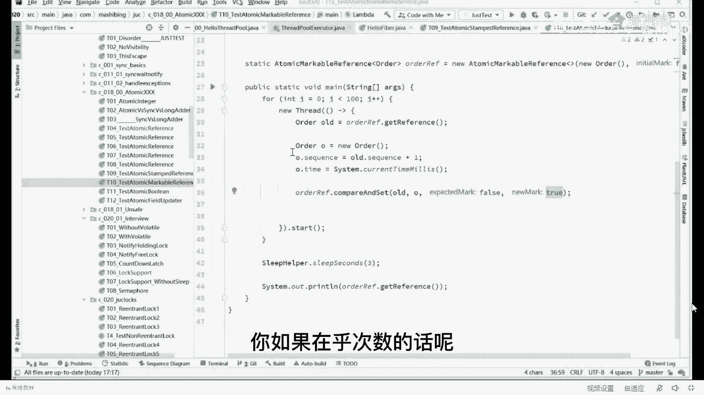
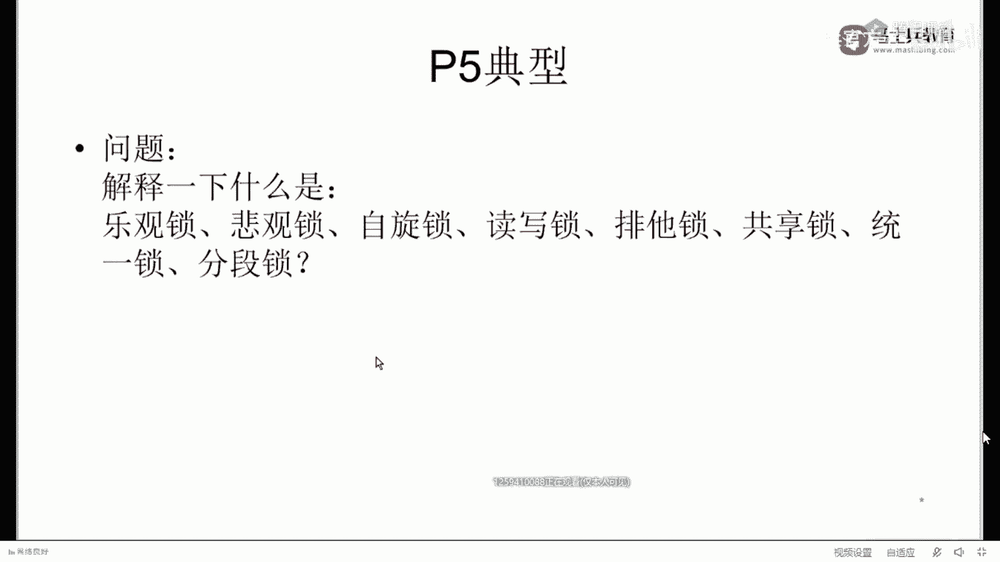
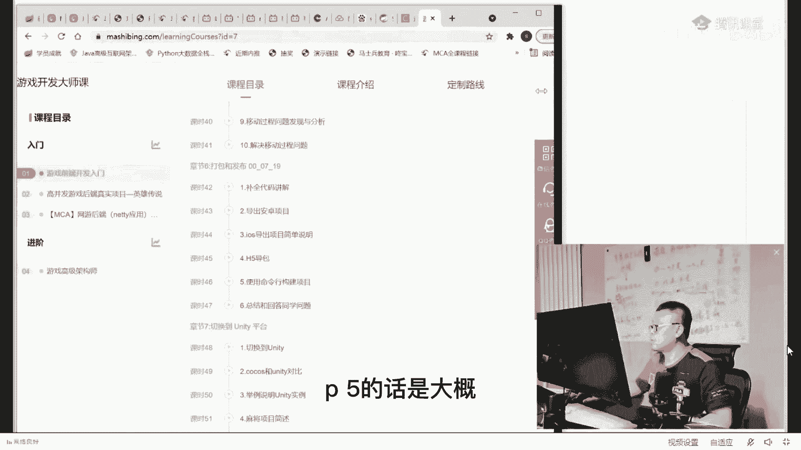
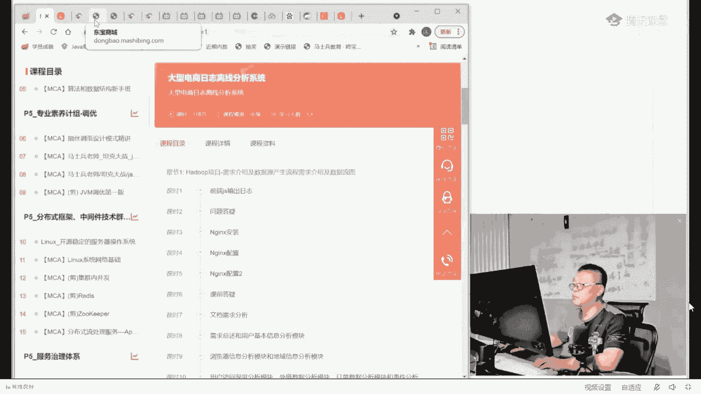
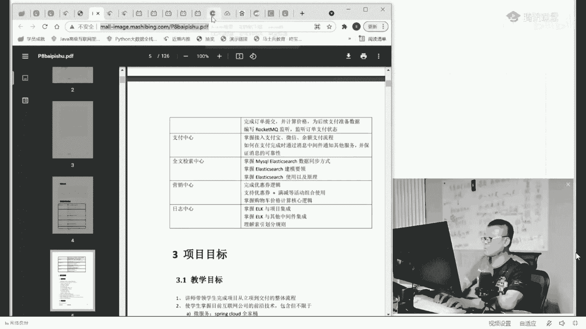
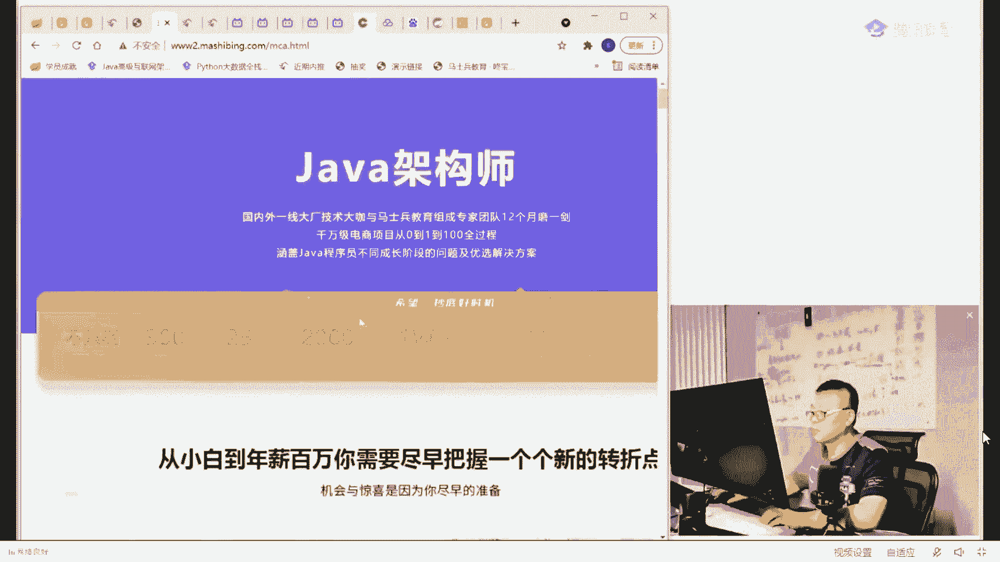
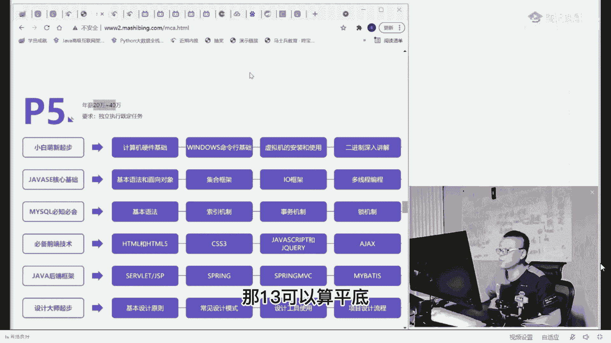

# 【马士兵教育】MCA架构师课程 主讲老师：马士兵 - P49：70w年薪面试题：1：一面关于P5的难题是什么？ - 马士兵官方号 - BV1mu411r78p

好不废话了，一点点来讲啊，我们嗯用我用最通俗的方式给大家快点讲，其实这里面每一个问题我要讲起来的话呢，都是比较费时力，费时费时间的，但是我用最通俗的方式讲给大家听，大家注意看就行好。

首先我们来解释一下什么叫乐观所好吧，看这里我先给大家解释什么叫乐观锁和悲观锁，我解释这三个概念，自旋锁，悲观锁，乐观锁，自旋锁，听我说，那什么叫悲观锁，悲观锁就是干一件事呢，先往坏处想。

比如说我说一句最简单的，这时候去上厕所，要去马桶上干点事儿，但是只要他一进去，看见马桶空着，当他开始干事的时候，他会会非常悲观的，预计会有人闯进来，能听懂吗，这就是悲观锁的概念，他非常的悲观。

会有人会认为一定有人闯进来，那当然还有另外一种人，另外一种人什么样的，另外一种人是哎，我先坐下，有人闯，进来我再说，有人闯进来，我在做处理，那这种叫乐观的人，你们是悲观的人还是乐观的人，哈哈，都老师了。

我是憋不住的人，好吧，算你狠好听，我说，所以悲观的人会怎么办，悲观的人会进去之后，有人没人都上把锁，能不能听懂，这是悲观的人干的事儿，乐观的人会怎么办，乐观的人是进去之后先干事儿。

如果有人过来之后再把他推走也行，哈哈或者说有如果有人过来啊，排了点出来再给他塞回去也行，就是总而言之，你有人过来之后，我们再做进一步的处理啊，这就是悲观锁，乐观锁的概念非常的简单，那我想问大家一句。

你们平时所接触的synchronized，他这种人我们称他称它为悲观还是乐观的，就如果我写一段话的话，我这样写synchronize，什么什么什么唉，这肯定是悲观嘛，是不是就是你siri这件事来说呢。

就是二话不说，您来了之后呢，上来先上锁，我先锁定，锁定之后才能干事，我不能不锁定的时候是不能干事的，好这种就是悲观锁好，这是被关锁，乐观锁的概念很简单吧，坏事一定会发生，所以先做预防，乐观锁呢。

坏事未必会发生，所以，事后，补偿啊或者适中补偿啊，总而言之呢就是嗯未必会发生自由，我不上锁，先做预防怎么办，上锁，a sorry，先上总，那么这种呢好，我们说一种最常见的乐观锁的具体实现。

它就称之为自旋锁，所以说自旋锁这个概念如果深究的话，它是一种乐观锁的实现，好自编组什么意思，我做最简单的解释，我觉得大家应该应该能听懂，自选锁的概念是说嗯这里举个最简单例子啊，这里这里有一个零。

然后呢我们好多县城都对它进行做加加的操作，那大家知道如果不上锁的话呢，这个零加起来没准儿啊，我加了1万次，没准只能得到个1000多，2000多，这都是有可能的，好听我说。

那么第一种方式是我在加加的操作里前后上锁，synchronize，这种叫悲观锁，还有另外一种方式是我们做一个乐观的处理，乐观处理什么样呢，最简单的方式是说我把这个零读过来做加。

加操作变成一一往回血的时候做一个检查操作，这个检查操作呢被他称被称之为cs操作，叫compare and swap，当然它为什么叫自旋呢，是因为呢如果中间有人改过它了。

那么compared to swap之后呢，读新直过来，这是什么意思，你认真听就行了啊，认真听就行，这是不需要上锁的，就是把这个零拿过来，我把它变成一以往回写的过程之中，如果有其他人已经上完锁了。

已经已经已经把这个值给它加过了，比如说变成八了，同学们，你们你们能够把这个一用用这个108覆盖吗，这个肯定不行，是同学们，这是这，是不行的，那这时候怎么办呢，如果说这个过程之中，你从零已经变成八了。

变成八之后，我把这八再读过来，九再往回写，写的过程之中，如果你这个八又不小心变成100了，我把这100读过来，变成100，一，再往回写，终于有一次往往会写的过程之中，你依然还是100，依然是100。

好那说明我在这次操作的过程之中，没有任何其他人改变过，我在这次操作的过程之中，没有任何其他人进来过，所以我就把你改成101搞定，来这块能get到的，给老师扣个一，那么这块的话呢就不用上锁了。

这种的呢被我们称之为叫自旋锁，那什么叫自旋呢，就是它那个一直循环一直循环循环到有一次成功为止，哎100的过程中，你看啊玩家说100过程中变成101又变了呢，简单呀，比方说变成200了，你就继续来。

什么时候成功一次，什么时候为止，好吧好了，这种人能被我们称之为自旋锁，也叫做cs所，好大家理解这件事之后呢，当然关于自然所面试题比较多呃，关于自检所的第一道面试题是aba问题，是著名的问题啊。

那么第二道面试题就是就是就是现在这种面试官他会追问你啊，你要是深入了解的话呢，这里边东西确实还蛮多的，刚才有同学说了，说这第一道题就得打两小时是有可能的，我快速给你过，因为后面题比较多呃。

第一个问题是aba问题，第二个问题是保障，cs操作的原子性问题啊，那这个问题比较简单，这个问题是一条lock指令，是底层的lock指令汇编级别的好吧，那么a b a问题是什么问题呢。

a b a问题是说唉还是这个零变成一往回写的过程之中呢，发现它依然是零，然后我往回写写，写成一看上去很简单，但是呢这个零啊很有可能是有的线程已经把它改成八了，然后另外一个线程又把它从把改回成零了。

所以它这个零呢虽然看上去还是零，但他中间经历了一个从0~8又到零的过程，好这种呢被我们称之为a b a问题，这个能不能get到，能get到于老师扣一，来就说你看上去还是那个零啊，女朋友例子是吧。

你们非要举那个女朋友例子吗，可以举一个呃，就是这是你的女朋友，这是你的女朋友，然后呢你出差了，等你回来的时候，发现还是你的女朋友，但是这个事情呢中间是不是经历了什么操作，这个就说不说不准了啊。

那这个时候呃当然a a b a a b a问题的解决方案呢就比较多啊，我跟大家简单说一下，a b a问题解决方案其实是有两种啊，就是加其实就是一种嘛，就是加版本呃，从java的时间来看的话呢。

这个jaa版本呢它有有有有这么几，个啊，就是第一个呢是加版本号啊，version，第二个呢是布尔类型啊，就是这两种方式呃，这个如果说不能理解的话呢，你看小例子吧，嗯老师讲的多线程的课，嗯看一眼啊，第一。

就这种啊，这个是那个呃我我们说这是呃呃atomic dereference，这个东西呢是在java里面呢它的一个常用的处理版本号的一种方式，那么在这个版本号里面呢，呃一般来说做任何的操作的时候。

你都有一个sequence，就是你你可以简单理解为你走的时候，给你女朋友脑袋上的写了个一好吧，然后呢如果经历一点什么事情之后呢，这个值就要加加啊，等你回等你出差回来之后。

你发现这里变成了9900 9999，那就说明中间经历了好多好多事情啊，这个大家能不能听懂啊，这能get到的老师可以好吧，这就是使用版本号的方式来解决哈，好那么除了版本号的方式之外呢。

实际上还有另外一种这种呢叫markable markable reference，那么这种方式呢其实它采用的方式是说用一个布尔类型啊，true和false来解释，比如说那么呃这是你的男朋友。

然后呢你你你你你出差之前你啊他脑袋上写了一个写了一个false，好，等你出差回来之后，他脑袋这个false变成true了，那就说明经历了一些事情好吧，当然这个就记记录不了次数了，就是你不在乎次数的话。

你用markable，你如果在乎次数的话呢。

用version好了，这块能get到的老师可以，那如果他版本版本号不对，会干什么，这个就看你自己处理了，你发现他版本号不对，那怎么办，说明中间有人改过，那你要不要检查一下，读一下日志，或者做一下回滚啊。

或者把它踹一边去，这个是你自己处理的事情，ok这是a b a问题啊，当然下面这个问题比较复杂，我在这儿就不想展开了，这个问题的话需要跟到呃，我们汇编指令里面去啊，我在这就不展开了好吧，离婚。

这是你的男朋友女朋友啊，她她并不这个男朋友女朋友并不是单例模式诶，他不是单利，人家可以有多利的，ok啊，single at the，mitan，好这三个概念可以应该清楚了，就悲观所乐观所自旋锁啊。

好我们再来再来继续看，好不好，我们再来看一个啊，再来看一个呢，这个这个东西叫什么呢，叫读写锁啊，排他锁，共享所好读写锁排他所共享所有同学说了，老师这个东西难道还能够这几个概念是是是类似的吗，有点类似。

听我说就行了啊，第一种叫排他锁，排它锁的概念非常的简单，只有一个县城，能访问代码，这是什么意思，最简单的理解，你到一个坑里去之后，只有你一个人，不会有更多的人进来啊，除非那种非常特殊的坑。

这里有面对面的，还有这种麻将似的哈，一边一个坑，这边一个坑，这边一个坑，这边有坑，这边坑中间一桌了啊，当然还有还有这种的啊，这个都可以好不好，但是如果里边只有一个坑的那种呢，啊，特被称之为叫排他所。

只有你一个人能进好，那如果这种人呢这种的啊，你把它看成一个完整的一个坑的概念，这种就可以称之为叫共享锁嗯，还有，上下坑了算你狠啊，有上下铺共享锁哈，共享所知是什么意思啊。

共享所的意思就是说可以允许有多个线程啊，装代码，好了，这是排查所，是共享锁，很简单吧，那synchronize是排他锁吗，来你说说看我刚我刚我刚刚才那个小伙子4834问了个问题啊。

说sychronize是排查所吗，大哥你synchronized的锁定的这段代码是不是只有一个线程能访问，访问完了之后，其他线程才能继续访问，这必须是排查锁好吧，当然有同学可能会问。

那什么东西是共享所呢，我跟你说java里面的共享锁呢，呃它默认的啊，它常见的有这两种，那么第一种是什么呢，第一种我们称之为叫sam for，叫信号量呃，信号量就是你你在这里面呢，你可以。

有两个线程进来permits啊，一共有两个，当然你可以写啊，二二百个也可以随你呃，还有一种啊，还有一种比较常见的呢实际上叫读写锁，我觉得这个读写锁呢实际上是要比sumer比信号量呢更加能说明问题。

所以这里呢我举了一个读写锁的概念，那读写锁是什么意思呢，读写锁的意思呢就是这把锁里面实际上它是一个锁的管理器，它管理着两种锁，就是这个读写锁里面有两种锁，一种叫毒索。

读所的意思是说当我一个人在里面读的时候，不允许写，但是允许，同时读，那写写锁的解锁的时候是写的时候不允许写，不允许，写也不允许，那么你你你读一下这两句话，这个读锁是一个什么锁呀，是不是共享锁呀。

就是允许其他人同时读吗，那解锁呢，解锁就是一个排他锁，这个怎么理解啊，我们举个小小的例子，他的名字叫那一天，你要很幸福好，新闻讲多久，错过了吗啊有一个人叫白虎吧，白虎进坑了，呼哧呼哧排了很多东西。

然后呢白虎呢就就就就就暂停了，这个是白虎是什么，他是写是吧，往里头写了很多很多数据好，当它暂停了之后呢，当他让出这个锁之后呢，围观好，这些人都是读读，有多少人在围观都没关，都都没有任何关系，听懂了吗。

好那那就那个那个那个白虎又要往里写了呢，其他人就不许围观了啊，等我写完你再围观，因为你如果说在我写的时候，你围观的话，你很可能会看到，读解锁的概念，能不能听清楚排查锁和悲观锁的区别是什么，没有什么区别。

排查所围观所区别就是概念上的分配不同，比如说圆的事物和方的事物，这两类事物两两种叫法嘛，好鸡蛋圆的是吧，砖头方的那能吃的和不能吃的也是鸡蛋和砖头的分别，它只不过是分类方法上的不同。

脏读不是数据库里面才有的概念吗，哎哟我的大哥，脏读是任何的中间状态，只要被别人读到就可以叫脏读灵活一点啊，同学们千万别把概念给学死了，脏读本身的概念叫做我读到了别人不允许我读的中间状态能不能听懂。

就是说我一定要穿，把衣服穿好了才能见人，在我穿衣服的，整个过程之中我是不见人的，那么我的衣服穿了一半，如果出来见人，读到了我的中间状态，有一个数字，我要对它加八次，我才能允许他往外见人。

我加了四次的时候被别人读到了，不好意思，好p5 的不太难吧，应该好多人叫统一所分段锁，其实这个统一锁这个概念呢，刚才有同学问说什么叫统一所分段所，统一所这个概念呢，就是不分多少所啊，这个可以叫统一所。

可以叫大化的锁，统一所一般解决什么问题呢，一般就会解决，有大力度的大力度，分段锁呢可以叫分成一段一段的小力度锁啊，小，什么叫统一所分段，这是什么意思啊，就是那个那个一个大锁，一个小锁的意思。

大颗粒和小颗粒的意思，有同学可能会说，老师这个这还有什么大的小的区分吗，这有区分，听我说，我给你举个最简单的例子啊，比如说如果锁定a等待b我有我有一个线程锁定a，等待b还有一个呢叫锁。

还有另外一个线程呢叫锁定b，等待，等待a同学们，你们想一下啊，如果说这两个线程如果同步做的不好的话，会产生什么效果，死锁能不能理解，是不是死锁就会死锁了啊，呃那那呃我们想解决这个思索的问题。

有一种常见的解决方案是什么，是什么，是什么样子，常见的解决方案是什么样子，把a和b统一起来，做成一把大锁，就完美的解决了死锁的问题，ok这种就叫统一所或者叫大颗粒的锁，大力度锁嗯。

他一般是用来解决那个死锁的问题，当然这东西分事儿啊，就是有的时候统一所能力度太大了啊，你比如说给你举个最简单的例子啊，我那个往数据库里插一个插一条记录，我把整个库全部锁定，力度是不是太大了。

那这时候你还要拆分呢，你可以到行几所是吧，可以到表自己所户籍所，这个就看你需要做什么样的一个具体的业务了，如果我我再给你举个例子啊，如果现在我们有两张两张表，我们举两张表的例子吧，我锁定这张表。

我要等待另外一张表的锁，假如说但这种操作很少啊，一般来说是数据库事务的话，呃，数据库内部的锁的话呢，我们就整个锁定我们整个的那个那个那个一个数据库事务就搞定了啊。

然后呢另外一个操作很可能是锁定这边等待列表，那这个东西会就会造成思索，那怎么办呀，好了朋友们，这个叫统一锁，那什么叫分段索呢，就是分成一段段小粒度锁，这个最常见的代码是什么。

听我说是jdk一点七的concurrent hashmap，这叫凉了啊，concurrent hashmap，这个这个是用来干什么的，是什么意思，我给你举个最简单的例子就行了，同学们，你们想一下。

如果说我有一个我们说我们说数据结构吧，我有我我有一个我们说链表吧，链表的例子最容易举清楚啊，好我们这有一个特别长的链表啊，几万个数据，几10万个数据，甚至上亿个数据，这样一个链表。

那假如说多线程对这个链表进行访问的时候，比方说往里头插入数据，多线程进行访问的时候，多线程往往往里插入数据，是不是我每插一个数据就要锁定整个列表啊，锁定整个链表能听懂，那我如果想提高效率的话。

我可以把链表分成一段一段的，我只锁定这一段，我并不锁定整体的，那么其他的段也能同时进行插入，这种就被我被咱们称之为叫分段锁好了，这个p5 的题我就解释完了，看大家伙是不是理解了。

好可以继续，同学老师扣个一，有问题你直接提好不好，上班，有没有测试用数据库表数据库，百万数据库，用测试机构语句嗯，你自己做实验不就行了吗，有代码示例吗，我刚才给你不得看，给你看了，看了好多好多代码吗。

电器所监狱所主要解决的是这个mysql的一个，呃是mysql mysql关于事物这方面的提升效率的一个问题，交易所解决幻读的问题，对这个跟咱们jdk的还稍有区别啊，好了奸细所嗯，屁股多少年薪是吧。

好建议组先你留一下啊，天系数a组稍微复杂一点点，它主要涉及到那个，数据库的行级锁和那个几行级别的这样一种锁，我得稍微准备一下，回头我再讲给你们听啊，三分所一边一般在。

sam ford所一般在什么情况下使用，呃，比如说我给你举个例子，假如你要模拟一个这样的一个状态，这是好多车，然后呢进入到我们的收费站，我们收费站有两个口开放，那你可以用允许两个线程同时运行吗。

不就是就是我们常见的那种什么排队啊，卖票啊，这些都可以理解为是summer的一个运用，限流yes，嗯，1年多开发经验能变阿里p v p6 吗，够了嗯，好那个刚才小伙说那个p5 多少钱是吧。

p5 的话是这么多钱，p5 的话是大概。

p5 大概的钱数，大概是这样的，20万~40万呃，p5 是20万~40万，一般来说呢他们面向的是应届生，应届啊，也就是说不管你是本科还是研究生，那么本科研究生的区别呢，就是本科的他的年薪稍微低一些。

研究生的年薪稍微高一些，另外呢本科生p6 稍微的慢一些，研究生升升p6 稍微快一些，就是给你安排一个任务啊，告诉你明天下午呢把呃订单处理的这段代码给我敲完好，你把它敲完就可以了，这个是p5 的一个要求。

好吧好，我们可以继续可以继续吗，那13可以算pd 13可以就是多少多少星啊。

你自己你自己定级吗。

