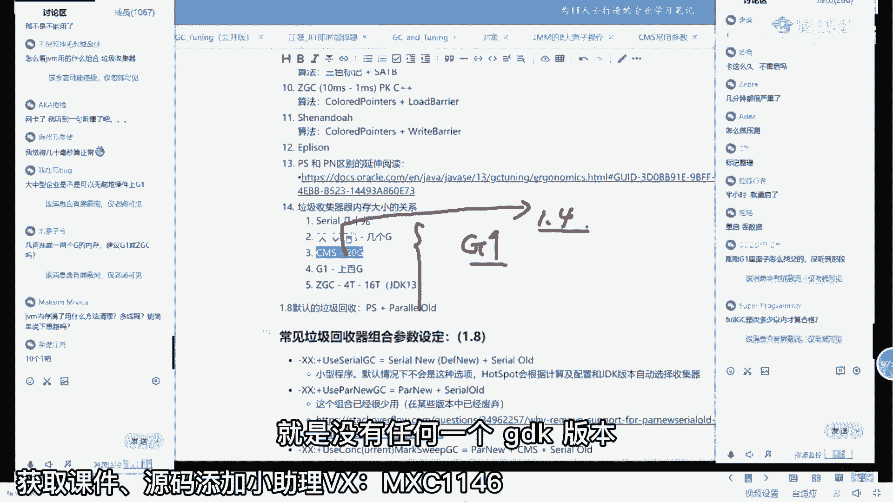

# 【马士兵教育】MCA架构师课程 主讲老师：马士兵 - P4：JVM瞬间涨薪3K的操作：4.G1对CMS的修正 - 马士兵官方号 - BV1mu411r78p

整个的标完了之后，由于呢它有很多颜色都已经确定了，所以它再从头再来一遍，当然这个从头再来一遍，不是说从那个哪儿再开始啊，同学们听我说，cm呢是说诶但我们找初步找到了这棵树。

由于这棵树里面呢有一些有可能被我们刚才那个特别隐蔽的东西，给漏掉的，所以呢把这棵树找完之后，cms从头再把这个数再捋一遍，当然由于我找到这棵树了啊，好多垃圾没有被我找出来。

所以这个数呢呃比我们原来从头开始找，那个在所有地方来去找这个数的时候，效率要稍微高了一些，但是，即便如此，它的效率也依然很低，这个大家都不知道大家能不能理解。

就是所以在cc我们cms的整个的整个的这个运行的过程之中啊，它是分成好几个阶段，我刚才没有给大家细聊，主要因为给大家细聊这个东西，你不理解这个算法的话是没有意义的，所以呢它是这样的。

整个cms的运行过程是是这样来运行的，首先初始标记指的是找到最根儿上对象，这是你，这是你女朋友，这是你男朋友，并发标记指的是从根儿上开始找，然后一边找业务线程，一边运行，一边找一边业务线程一边运行。

当我们把整个图捋清楚之后，他再从头再来一遍，重新标记，当然这次再来一遍的主要是哪颗有用的书，那个没用的就不管了，然后再清理，把那些没用的干掉好了，同学们不知道我说清楚没有。

所以cm啊它实际上本质在这里的时候，在这里它依然有很强的一种，很长很长很长的s t w，这是cm的巨大的一个毛病，它并不是像他想象中的那个s t w的时间很短，它的s t w时间依然很长呃。

当然会比那个单线程的多线程的纯粹的从头干到尾之后，然后所有人全停掉，那个的时间要稍微短一些，重新标记是s w的，怎么还会有漏标啊，大哥就是所有业务线程停止了。

只有我所有的业这个这个这个垃圾回收线程在干活，哪还会有漏标，不可能的，好嘞，这就是cms的大bug，cms还有其他bug，我在这就不展开了，来我讲完这个之后。

有没有哪个同学在你们生产环境之中用的是cms的，有没有，我能1年50个，大家都懂了，对有吗，有的扣个一来ocean d ok还有吗，没了呃，朱振文，我觉得应该是有的啊，那个据说现在主流是盘尼酱cm。

这是据谁说呀，余安你是听的，谁说是杨幂说吗，是高晓松说嘛，不会看用的啥，哎赵永光终于提出了个有价值的问题，一会儿教你，遇到丈母娘是吧，哈哈呃，呃所有的小伙伴听我说。

你是可以用cms的呃但是这个cm的调优啊，它特别复杂，cms的优化过程比较复杂，需要你精确地掌握cms的所有的参数，它大概有几十个参数，然后你才能对它进行精确的调优，所以一般我们现在都不太用cms。

如果你内存比较大了，我建议直接挤碗就越过cms，原来不是p吗，p s p o嘛对吧，分带直接干成分区的g one就可以了，好，我可以讲g one了吗，来可以讲g one的，给老师扣一，可以进去的啊。

ok good不错，说明今天小伙们跟的不错啊，内存多大算大，其实cms来说是不超过一个g的，当然它算法本身也是在不断的那种，就是算法算力它也是在不断的发展的。

呃所以有的时候呢你你你哪怕用现在的psp就是纯粹的分带模型的，没准看上去也还可以知道吧，呃实际所就实实际，你得看，那是就是具体问题具体具体解决好吧，我跟你简单聊几晚，然后我跟你聊呢。

g one注意他用的算法依然是三色标记，你不要认为g one有什么新用什么新鲜算法的，g one用的依然是三色，听懂了吧，但是呢呃g one本身呢它这个三色是采用的另外的解决方案。

那么这个解决方案呢叫s a t b，这我稍微要稍微的解释一下啊，呃，大家看这两个就是g one依然用的是三色，但是g one的解决方案呢叫s a t b，它并不是把a变成灰的，不是这样的，它是干嘛呢。

它是当，这个引用消失的时候就是b指向d的引用，消失的时候，它是在这个这个这个层面上解决问题，就是壁纸向d的引用消失的时候，把这个引用推到对战，这什么意思，这引用嘛就是有一个对象，另外一个对象。

然后呢他们之间有一个关联，这个关联一旦消失，发现这是灰的，这是白的，好这种这种引用一旦消失，把这种引用给它记录起来，说有一个灰对象是b，有一个白对象是d，现在呢有一个他们之行的引用消失了。

把这个引用记下来，能听懂吗，把这个引用记下来，把这引用记下来，就意味着，是不是就把这个白色的d就记录下来了，它指向的是哪个对象吗，好把这内容记下来之后呢，把这个d就做一个单独的处理，当我们做回来的时候。

发现有一个引用被记录下来了，也就意味着这个d我要单独处理，d单独处理就意味着看看有没有黑的引用指过来，如果有黑的引用指过来好了，我就不把它当垃圾，这过程不知道大家听懂没有，那要不你们想想看啊。

那个站在c m s角度的话呢，它解决的是这是把这个a给标成灰色，但是呢g one采用了另外的方案，我们整个问题的产生啊是两根引用，这个引用消失，这个引用指向所g one呢是采用的是解决这个引用。

是把这个a呢给变成黑色，但是呢呃sorry啊，就是cms用也用的是这这个引用解决问题的时候是打断这个过程，是把这个引用产生的时候，把这个a呢给它变成灰色，但是呢他有毛病有bug，那怎么办呢。

g one采用的方案就是我把这个引用我从这边下手给它记录下来，记录在一张表里，凡是这种引用消消失的时候，全给它记下来，那么当我下次垃圾回收就回来的时候，发现有好几个引用记下。

来了这边引用指的都是白白对象，白对象白对象，那我就查这个白对象，查这个白对象，看看在这个过程里头有没有黑对象指向它，如果有，不把它当垃圾，如果没有，就是垃圾好，这过程听懂了吗，能听明白，给老师扣一。

儿子找父亲，爸爸去哪儿，对他无非是两根引用嘛，整个问题的产生是两个引用同时作用的结果，那cms本身解决的是第一根g one，采用的就是第二个应用人呢，找人干嘛，what，那还是需要看黑对象吗。

他只是说有没有一个黑对象指向它就可以了，如果有指向就ok，好当然其实这里面呢这里面又有巨大的问题，但这个问题要要我要给你讲完的话呢，我估计十点半了嗯，这问题的主要原因啊，其实引用呢正着找比较方便。

就是你通过a点，你说你好好想想这件事儿啊，我给你，我给你举个例子，这个引用啊正着找比较方便，你说a。x等于d，你通过这个x找到d诶，那超级简单，但是你说d有没有其他引用指向d你怎么找思考一下。

我们平时写程序的时候，你会记录着说这个这个对象被哪些引用所指向吗，便利哎呦，我的妈呀，你便利一遍，那可费了老鼻子劲了，就是你通过儿子找爸爸这件事呢，不是很容易通过爸爸找儿子，他都记着呢啊，我有几个儿子。

老大老二老三我都记着，但是呢你通过儿子找爸爸这事儿就麻烦了，你不可能说所有指向它的全都给在这里面记录一遍，这个是不行的，当然这个东西的解决呢，为什么这个方案适合g one呢，主要因为是g one的。

它的本质对这个方案是非常的友好，那么这样的本质是什么样子的呢，我刚才说过，从g one开始就全是分区模型了，往这儿看，这个是g one的分区模型，内存里面它会分成一个一个的小格。

然后呢在这一个一个小格里面还记得吗，我们原来搞垃圾回收的时候啊，我们这个年代满了，整个年代全部干掉，但是内存特别大，个的时候干起来特别麻烦，我把它分而治之，分而治之的时候就意味着什么呢。

就意味着分而治之的时候，就意味着当我们发现诶这个分区里头诶，他比较比较那啥，这个就这个分区里头满了，我只回收这一个分区，我没有必要回收好多好多分区诶，这个分区满了，这个这两个分区满了，我只是回收这两个。

我把这两个分区的，内容给它复制过来，复制到别的地儿去，复制到有用这个其他的分区里头去，然后我只回收这两种，然后其他的分区还能正常运行，继续能听懂吗，就是我一次不回收那么多了，所以这个效率是不是提升了。

我可以一边回收部分分区，另外分区还可以继续运行，这个原理大家听明白了，刚才我讲的这小部分啊，听明白了，于老师扣一，大对象就跨越多个分区嘛，这不就大对象吗，这个无所谓啊，但是这里面也有一个复杂的问题。

今天讲复杂问题讲的有点多，你认真听，这里面有复杂问题在于什么呢，我们假设这是一个分区，当我们要回收这个对象的时候，我得知道这个对象是不是垃圾，知道这个对象是不是垃圾，就得知道有没有引用指向它。

那到底我要是记录下来说我我指向我这个引用是在这个分区里，这个分区里，这个分区里都指向了这一个引用，你说我怎么去去扫描，才能知道这些个都是有用的，我得从头扫吗，太，费劲了，所以在这个分区内部呢。

一般呢有一个专业的名词，在这个分区的脑袋上大概有10%到15%的一个空间，记录了什么东西呢，记录的是有哪些个分区里边有引用指向了这个分区，这个我们一般称之为叫r set，叫remember set。

叫记忆集，这是由于呃g one本身的设计所决定的，就是由于我扫描的时候呢，我得从这个回收这块的时候，我得知道有哪些指向我到底有没有用啊，我得去找这里面找，看看有没有有用的对象指向我有没有从根儿上过来。

对象指向我，包括从三色标记的解，决方案也是我得从儿子去推到爸爸，我去哪儿找他们呢，就从这个记忆集里面找，那这块大体上能听明白的，给老师扣一这个类似于分带的时候卡表的概念啊，但是它本质上不是卡表。

所以由于有这个记忆的存在，我们找的时候呢就没那么费劲了，另外呢我们三色标记，你们琢磨一下，他这种情形并不是很常发生的啊，很很有可能我找的事儿根本没找着，没有这白对象，没人指向他，这是大概率的情况。

所以g one它的效率高了很多，呃我讲到这里的时候呢，我觉得可以稍微给大家一点数据上的东西了，当然这个呢在我的笔记里面也给大家做了记录啊，嗯笔记里呢就给大家做了一系列的记录。

就是关于g one的日志就先不说了。

就比较复杂了。

那个，关于多大的那个内存啊。

到底你得找找啊。

关于多大内存到底应该使用什么样的解决方案啊。

垃圾回收器的内存跟内存大小啊。

呃一般来说呢serial大概能处理几十兆最大。

the palace scaveng，从集上百兆到几个g吧，差不多是这样的，c m s的号称可以处理20个g，但是我没有见过20个g用cm用的很爽的，g one号称用上百个g。

那么z d c的话号称四个t jdk，13呢把它扩展到了16个t啊，就这么牛叉啊，我说这个t啊，这是内存，不是硬盘，你不要把它当成硬盘嗯，但是呢这是一个理论数据，你实际当中得自己做测试好吧。

自己做压测必，须测测的合适再用在这个里面，我们说按停顿时间来说，这个呃cereal和p s我就不说了啊，这个我遇见过的。

我跟你说，我遇见过的，我遇见过的，做金融的，他当时买的服务器叫叫叫什么来着，我忘了，反正那个内存的话上t的，然后他们用的是ps，当时呢金融的服务器又不能随便停，当时一个有一个运算。

就是好长时间之后一个反问过来，他们那个s t w的时间，因为它内存满了，内存很大，满了听懂了吗，内存很大，但是满了，所以他开始清，他用多线程开始清，就你就想象一下天安门广场那么大。

个的一块空间，然后呢你爸爸妈妈，爷爷姥姥姥姥爷几个人就开始在那清多长时间呢，2000多，如果没记错，就是两两天多时间，大概也就意味着55 60个小时。

当然这个肯你们可你们可能没有没没有遇到过2000多。

就是这次卡顿的产生大概是2000多，约几分钟，几分钟算个啥，你你太天真了啊。

大概是2000多呃，然后cms的话遇到的超过几个小时的，也有的是听懂了吧，嗯g one啊，g one，他号称的，你可以设到多少呢，g one号称是200个毫秒，而z dc号称是十个毫秒。

这个200ms的原因呢，就是它分区嘛，它内存不是特别满的时候就马上开始回收，听懂了吧，呃cm s那么长的，主要是还有cm s，还有另外一个bug，它叫做浮动垃圾，然后上升的时候那个老年代不足。

老年代碎片化过于严重，那个bug那个bug才是致也是非常致命的，一个就是它会造成gms的卡顿。

空间的卡顿时间会更长，特别长，呃我们我我我在我在我在讲课的时候呃，有一个叫smile的同学，然后他们用的是那个gero，炙热服务器，然后去给全球做服务，当时用的时候就经常的天天的福利c就是内存不够。

内存不够回收，内存不够回收，内存不够回收，就就干这事儿呃，然后呢我记得他们那个服务器是十个g还是多少来着，我忘了呃，然后用的就是cms，说卡顿的时候卡几个小时，经常的事儿就一个月必卡一次。

一个月必卡一次。

所以由于cm的这个bug的存在啊。

我告诉你，首先第一点呢不建议大家用c m直接直接g one啊，后来我叫他调优的时候，后面我给大家讲讲讲调优就交调优的时候就建议他直接g one了，第一扩大内存，第二换g one。

g g one的那个那个那个那个垃圾回收器就搞定了啊，就这么简单呃，然后呢呃这个cms由于它这bug存在啊，虽然它1。4就产生了，就诞生了cm s诞生1。4，但是一直到后面都没有转正。

就是没有任何一个jdk版本。

它的默认垃圾回收是cms能听懂吧，就是他自己也也也也意识到这，个东西是有bug的，没有任何一个jdk的版本默认的垃圾回收器是cms，但是呢不意味着cms不重要。

因为从cms开始真正有了concurrent这个概念。

可以说他就是那个承前启后。

继往开来，就是淘宝之前的意趣。

就是被拍死在沙滩上的那个前浪，好嘞。

那你们还想听cdc吗，你们是想听z dc呢，还是想听我们我们来个实战呢。

我简单跟你们说说点cdc吧，好不好，cdc是个坑对，主要是呃主要是这个cdc啊，听说就是主要是这个z这些呢它目前要求版本比较高。

呃，11以上，而且11好像还不是特别完善哈哈基本到15吧，可能但是11就可以用了，你可以调cdc，到现在为止呢还不是用的不是特别多。

所以呢我就简单跟大家讲，cdc完完全全的是另外的思路了。

他和这个分它虽然也是分区啊。

但是呢他的这个呃标记这个对象啊。

它和和三次标记就完完全全就不是一个概念了，那么z dc呢它的概念是什么呢。

我简单给，大家解释啊，z d c，z d c全名叫zero pos dc，叫零零停顿dc，当然这属于吹牛逼，不可能零挺灵停顿，cdc号称号称是十个毫秒，如果真是到十个毫秒的话。

其实呢它就跟c和c加加是差不多了，就没有区别了，明白吗，呃但实际当中没有没有那么简单啊，那么cdc所采用的方案呢叫做颜色指针，叫coloured pointer，这过程呢本身比较复杂。

这个我给大家大体解释，这个能跟上就跟，跟不上就算了，我留点时间给大家做实战好不好，看这里啊，cdc叫颜色指针，大家都知道什么叫指针t小t等于6t是吧，我们说这是我们的内存唉，new出来一个t对象。

这是那个t对象。