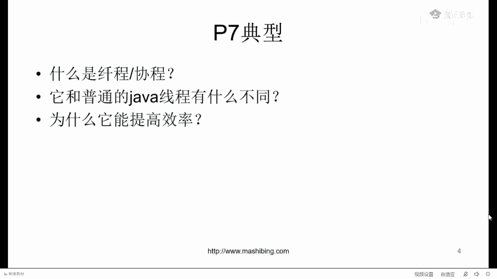
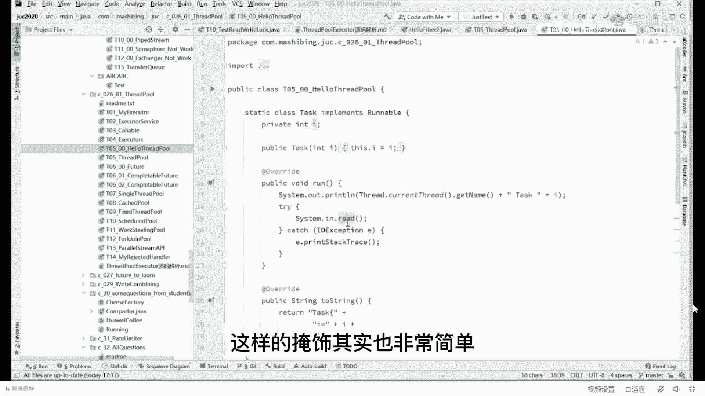
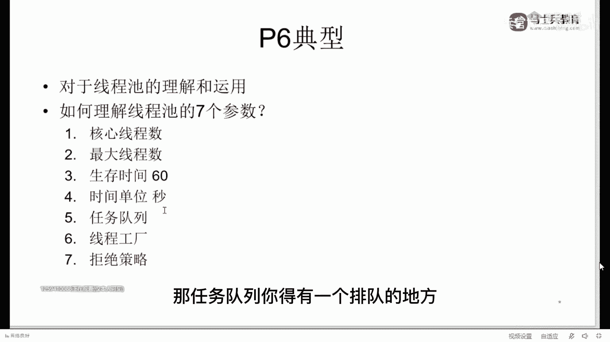

# 【马士兵教育】MCA架构师课程 主讲老师：马士兵 - P50：70w年薪面试题：2：二面关于P6的难题是什么？ - 马士兵官方号 - BV1mu411r78p

我们可以聊p6 的内容了吗，可以的话，老师扣个一好吧，阿里没有13k，阿里好像是没有13k的。

不记得有13k，我们来聊这个线程池的理解和运用。

首先我先问大家一句啊，呃有没有同学不理解什么叫线程池的，这需要我解释吗，需要我解释的，老师扣个六线程池这件事应该不需要啊，不理解是吗，有这么多不理解的吗，一直半解哦，好好好好好。

我知道了好停吧停吧停吧停吧停吧，停下来停下来，关于线程池这件事情呢其实非常的简单，同学们，你们想要我给你举个简单的例子啊，呃现成的费用对说的很对，比如说啊这是一个餐厅，那么作为餐厅来说呢。

你你你进来之后呢，你是要找座位去吃饭，呃每一个线程可以理解为我们一个后台的服务员啊，我们餐厅的服务员，同学们，你们想一下，如果有一个人过来的话啊，那最容易的一个一个方式是什么呢，我给它起一个线程。

也就是有一个服务员来为这个人服务，有一个服务员来为这个人服务，那如果有1万个客人进来，那我就需要有1万个线程来对它进行服务，而且呢每一次都要new这个线程出来，就是把这个服务员给new出来。

这效率实际上是比较低的，那有没有另外一种方式呢，这种方式就是说我现在呢有20个服务员儿，但是呢我一次性的把它弄出来，一次性把它雇佣进来，放到哪儿呢，放到一个比方说数组里面。

列表里面唉这个都可以随便就总而言之呢把这些服务员全丢出来，也就是说二话不说，先new 20个线程出来，把这个thread全部给new出来，用完之后放到哪里去，放到一个水结构里面去，数组链表完成。

所以所以你放进去啊，然后有一个哥们儿过来之后，派一个人出去给他服务，完了之后再回来，下一个哥们来的时候，这个人这个县城还闲着呢，因为他已经处理完第一个第一个哥们儿的事儿了，好再给他服务区。

第二个区第二个服务，然后再回来，那这样的时候我就不用每次都new线程县城的重复使用，这个东西被称之为叫县城池。

来线程池的最基本的概念能听懂的，老师可以没问题吧，嗯这算是用内存换时间吗，啊你是有这么点意思，你说的很对，嗯，简简单单的啊，这里面其实不能说电影的那复杂的事儿比较多，呃我们讲讲真正讲vip的话呢。

实际上不是要分析到这个线程池的源码级别，它这个呢就相当于你要到p6 plus啊，接近p7 就拿比较高的薪水啊，需要的111个内容，嗯从老师这儿来讲呢，我一般不建议大家就是在你刚开始的时候。

你就去研究源码级别的内容好吧，先去研究它怎么用的，这东西有什么有，什么有什么用，有什么意思啊，所以你第一步呢先去了解什么呢，就是关于线程池这件事情啊，我构建一个自己的线程池，构建一个z的线程池。

它到底是怎么构建出来的，每个参数到底什么意思，这个东西呢是面试经常会被问到的，就是线程池的七大参数呃，七个参数呢也不太容易完完全全的理解，但是我建议你呢你就给他背过就完事了好吧，应付面试也行好。

这七个参数是什么意思呢，一共有七个参数，大家注意看就行了啊，我我记得我画过一张图，我用一张图呢差不多给大家。

把这个七个参数呢都给大家列出来吧，找一下，这样读啊，看看这里啊，这个线程池一共有七大参数讲给你听，我们先过一遍，简单过一遍，现成吃鸡大参数哪七大参数好，第一个参数呢叫做core process呃。

核心线程数，核心核心池的大小，核心池大小，第二个呢叫maximum process，叫做最大值大小呃，叫生存时间，第四个呢叫生存时间的那个单位嗯，第五个呢叫这个是非常著名的一个这个东西呢叫做任务队列呃。

第六个呢叫做线程池产生的工厂，第七个呢叫拒绝策略，我一点一点讲给你听。

你认真听，这个不难回想一下啊，第一个参数叫什么，第一个参数叫，第一层叫什么，叫核心池大小是吧嗯核心应该叫核心线程数量吧，核心线程数好，最大线程数好，第三个加第四个，这应该叫3+4吧，叫做那个生存时间。

时间单位，这里面比较麻烦的是第五个。

第六个是什么呢，呃第六个是。

县城工厂好，第七个是什么呃，第七个是拒绝策略，ok这是七个参数。

我给大家先做简单解释，你注意看什么叫核心线程数，核心线程数的概念啊，就是你的池子刚开始的时候，你不是一堆服务员吗，你刚开始的时候雇佣了多少个服务员啊，我平时我这餐馆啊有俩服务员够使了。

只有人多的时候才忙不过来，所以呢我核心的服务员就有俩啊，这个被我们称之为核心线程数，就这俩叫corpus size呃，那这时候如果来来客人了啊，来自来客人要做任务了是吧，嗯t呢被我们称之为叫一个任务。

一个rable啊，一个task呃，一个任务要扔进来了，他要点餐啊，要过来了，来来来为我服务啊，捏捏脚，点，点个餐好，这时候我们首先呢肯定是交给我们的核心的，这样的一个一个服务员去去做。

但如果是俩服务员都被占住了，都被占用了怎么办，听我说，这个时候有一个东西呢叫任务队列啊，就是它叫work you，叫任务队列，任务队列指的就是你排队把你放到哪儿去，排队门口排队去，我核心数满了。

你就得门口排队去，所以如果这时候任务再来，他去哪了，去排队去，那我排我队伍排满了，比如说我排队的这个队列最大的数量就允许四个四个人在这排着队，我，就四把椅子在门口排队，那这时候怎么办，又排满了怎么办。

没关系，所以这两个一加就叫做最大线程数，好这两个这两个概念是不是听懂了，非常的简单吧，我一餐馆就俩服务员，有俩哥们儿过来把我俩服务员全站住了，怎么办，来排队去排队，排满了怎么办，又来人了，又来人了。

这七八过来直接插队，对这七八过来直接插队，是这样的嗯，当然这东西我我直接告诉你啊，就是直接插队，不直接插队呢，实际上是取决于你线程池的具体实现，那好那同学们，你们想一下，这两个人干完活了之后。

他会他会怎么做，注意他会从任务队列里把这些人，把这些排队的人拿过来继续运行啊，t5 t6 哎，这哥这哥俩呢干完了，他把t3 t4 拿过来，能不能听懂，那这时候呢我们忙完了。

等于是啊我们等于是任务队列也没人，也没人了，好在这种情况下，在这种情况下，如果这哥俩的等待时间超过什么呢，超过第三个参数和第四个参数的组合，比如说我们第三个参数定义的生存时间是60，时间单位是秒。

当然也可以定小时啊，随你也可以定天，那随你变时间单位是秒，这哥俩消失干掉，但是核心的线程永远存在，来这前面这四个参数能听懂的，给老师扣，一是很简单，我给你讲就比较简单啊，我不跟你讲。

你要自己读就稍微麻烦点，是的。

好在这就不演示了，这样的演示其实也非常简单。

你只要定好任务，给每个任务做一个编号，然后呢定好你的cos以及maximum maximusize。

定好之后呢，再来呃详细的去运行，你观察它的特点就可以了，知道吧，这非常的简单啊，不能嗯，好了，队列长度是怎么设置的，问得很好听，我说这里面一个难点呢是这个队列的选择，注意怎么样排队，这个队列怎么选。

这是一个难点，也是一个重点，但这个东西要展开的话呢，内容就比较多了，这个队列呢第一你可以自己定义，你可以用数组，也可以用列表，第二呢你可以用现成的java里面的容器，只要是和q这个接口相关的。

q接这个接口，队列这个接口呃，这个继承下来的好吧，实现了它的你都可以用，这里面东西比较多，我在这就不展开了，就没法展开，是这十几个十几种的啊，比如说你可以用什么用concur map，如果你要愿意的话。

你也可以用copy on write list，就是呃写实复制呃，也也可以用什么concurrent q，也可以用lb q l bq就是link link blocking cu，也可以用什么呢。

a a blocking cute，也可以用什么自带那种优先级的，你懂不懂，就是嗯堆priority q自带优先级的，就是那个优先级高的往上排，优先级低的往下来，delay you。

这个往后延迟多长时间的，还可以用那种容容容容量为零的叫synonk，那就必须得我这边必须得拿走了之后，我这个生产者才能走，还有一种是什么transfer cute，这个是容量为零的啊，这是现成的，别人。

已经提供给你了，那在这个基础之上，你也可以自己去实现，你想用什么样的就用什么样随你，比如说你做一个那种q里面说这个这个编号为单数的，你你就你就扔进去，编号为双数，你给它给它，给它在这个分叉上。

或者给它给它去掉，还有还有一种比较牛逼的q是什么呢，就是这个环形的队列啊，比方说disrupter所使用的那种，所以这是一个难点，但是你记住这个东西是一个容器就可以了，在这儿刚入门的时候。

你把它记作一个容器就ok，好哇这个l o p问了一个触及灵魂的问题啊，你这个问题确确实实很很多的那个面试官会问啊，说核心线程数最大线程是怎么设，这个事儿呢，是一个一般来说，一般来说你得估计你并发量嘛。

就相当于你核心线程说的话，你要对得起你最低的这种并发量啊，你比方说日常的情况下，我这个并发100个人，那我这时候我要算一下他时间是多少，等待时间是多少，计算时间是多少。

然后呢给他算我有多少个服务员能服务过来，但是我高峰的时候呢，我很可能达到1万个人，我要请多少个临，时工我要把这个射到多长啊，要做压测，当然当然听我说嗯，这种东西的话呢，它比较复杂。

我呢在这儿给你简单给你给你聊两句啊，你认真听，只有这个事儿，只有认真听才能听得懂，认真听，假如说我们想提高整个程序的效率，什么叫提高整个程序效率啊，什么叫提高效率啊，我们能把我们的cpu占满。

能不能听懂，占满占到百分百，我现在假设我们只有一颗cpu好，我现在有一个任务，这个任务他百分百的时间都在使用，cpu是一个纯计算的任务，我想问你，我们设多少个线程，设多少个线程能充分，利用cpu跟我说。

哎呀你们都是一知半解的，别搁那儿，别搁那儿，往往往往外瞎说观点了，全都不对，我说的说一说一的都是对的啊，就说你一个一个线程数来了，就把这个cpu给占了，那这个一是对的，那假如我问你，我问你。

如果这个线程它用作运算的时候只有50%，另外的50%是io的等待时间，那我告诉你，我问你用多少个线程能让cpu占满百分百，这个时候就是两个，那如果说它的计算任务只有20%，我们设多少个线程合适。

这个时候就是五个，这块大家能理解吗，所以你设多少的线程，是跟你的任务到底是io密集还是cpu密集息息相关的，来这块能get到的，老师可以，所以不要跟那瞎说说什么二乘以几的倍数胡扯，那属于啊。

有界队列和无界队列该怎么选择啊，这里头有同学们对那个线程比较了解的呃，首首先说什么叫有界队列，什么叫无界队列啊，听我说有界队列的话呢，指的是我这个队列呢是数量有限的啊，比方说它就能装五个好了。

这是数量有限，无界队列指的什么，最常见的是链表，我这反正只要在屁股后头加就可以了，它长度多少无所谓，听我说永远使用有界队列，不要使用无界队列，嗯这个事儿呢。

这样我给你们要不要要要不给你打开阿阿里的那个那个编程规范，阿里的编程规范，编程规约，你们你们有吗，自己读过吗，自己读过吗，没有是吧，应该有吧，呃你这临时要我给你找一下啊，我看我看我放在哪儿了，嗯嗯。

不找着看啊，work boos，这这个我这版呢应该是不是很新的一版啊，但是呢呃新的一版呢你们可以去网上搜就搜了啊。

这是阿里的那个叫华山版，新的是新的，是哪一版，新的叫泰山版，还是叫什么。

就是关于并发这块啊，关于并发的处理。

就并发处理的话呢，这是关于线程池的一个它的一些规约呃。

我建议你们有空的话去读一读这些规约，想想看这是为什么好不好。

看这里看这个呢县城是不允许用executed去创建，而是要用three two execute方式支持，就是我给你刚才给你看到的源码，就是使用这种方式。

你得是手工来取，这个原因是什么呢，原因是呢呃executors它默认的一些东西啊，比如说fixed和single threpo，他这个默认的队列是多少呢，是max value。

而这个呢catch the po也是max value。

这个数量是超级大的，是什么意思，就是它这个队列呢超级超级的大个儿，这个队列啊，它不能叫无界，它有它也是有界，但是呢它超级超级大，那index max value那是多大一个数字。

也就是说你很有可能你在这里边儿，假如，说我们的呃消费者线程死了，我这县城不动了，而且呢并发量超级的高，双11的这种并发量，很快里边的消息就堆满了，能不能听懂，这就满了堆满，那堆满的话呢。

会把我们的内存全部都给你占，光，是不是出问题太长了啊，所以不要用你说有界和无界，你首先要用有界，而且要用合理的长度啊，当然你可能会说老师我们业务无所谓啊，我就是一个给成员植发的店是吧啊。

200年不来一人是吧，那好那这个时候呢你可以把这个队列设的长长的，反正我总有时间去把他的队列里面的人给消，化掉这个无所谓的事情，所以具体问题具体分析，但是尽量不要使用无界队列，这个太狠了啊。

很有可能一出问题就全全装满了，来这块儿能听明白的，老师可以，呃我们再把打开啊。

既然又讲到这儿了呢，呃我们再来看啊，你看那个其实呢他在这里面呢还有很多很多的呃。

并发处理的一些个规约，那么在并发处理的里头呢，他说创建线程或者线程池的时候，指定有意义的名称，方便出错时回溯，这个是什么意思啊。

同学们认真听呃，你们想一下，这这个是第第六个参数的含义。

这个第六个参数啊指的什么东东呢。

创建县城的工厂，有同学说了，老师大哥这事儿有问题啊，我创建一个县城不就new一个thread不就搞定了吗，是不是啊，搞定了我我我我我搞什么，其他的搞什么其他幺蛾子好听，我说听我说。

其实呢你创建这个现场的时候，我给你举个最简单的例子啊，这个new thread new出来的这个线程的时候，它的名字叫做默认的名字，如果你装在线程池里呢。

它一般叫做叫做pro 1 thread 1 pr thread，二puls pr thread 3，就这里的名字，我想问你，如果当你看到这样一个名字的时候，就好像说，一旦出了异常，exception。

exception，一旦出了一个异常，那你看到这个名字的时候，你会你你能知道它到底是处理哪方面业务的线程出的异常吗，的意义是没有名称的，就好像你变量起了一名叫a a a b b b啊。

变量叫a1 b2 ，这样的变量能不能被允许吗，绝对不可以，尤其是像阿里拉京东了这样的大厂里面，他们一个机器上跑的线程数量可能非常的多，好多人都使用线程池，那这个这个人使用的线程池叫thread一杠一。

另外的人写写写写的限制是，thread 2杠一，你说这俩出了bug之后，出了之后到底是哪个业务组产生的，这块能不能理解，所以呢在这个里面实际上你可以手工指定一个自己产生现成的工厂。

但自己选择下面的工厂的话，你就自己起名字就好了，比方说我现在处理的是凉菜业务，那可以叫凉菜，凉菜张三儿啊，凉菜李四儿啊，出了问题之后，你能找着人好，这块能理解的，给老师扣一了，只有我的线程池才敢这么写。

ok你牛逼，好了同学们，我讲到这儿呢，其实1234566个参数我基本都给你解释过了，细节呢还会比较多，尤其是像中呃任务队列啊，在这儿就没法展开了，好呃那我们说我们说下一个啊，下场只能用用英文名。

用中文也会报错，那我也很少用中文，关键你用英文名就用英文名吗，这有什么关系吗，完全可以用英文呀，就总而言之，你就是把它起个有意义的名称就可以了，好吧好，我们看这里啊，我们最后一个参数。

最后一个参数呢实际上把我们把它称之为叫拒绝策略，拒绝策略是什么意思呢，就是你再牛叉的餐馆，你服务的能力再强，也隔不住n多的流量一块涌进来啊，海底捞啊，够牛叉了，对不对，这个像什么喜茶啊这一类的。

像什么胖哥俩等等，这个服务能力已经很强了，但是，你同时能够服务的人也是有限的，好了，同学们，这时候你就琢磨了，如果在我们同时服务的人全满了的时候，又来新人了，我该怎么处理。

大概就这个意思啊，看这里我们的任务队列也满了，我们的备用服务员也用完了，好这时候又来一个，这时候怎么处理这个赶走慌了，直接我滚蛋，下次不许再来了是吧，可以是个办法嗯，这是店大了欺客，刻到了气垫。

存起来持久化可以说的很对，比方说有一些我们不能够丢掉的消息，当他要来的时候，同学们，你们琢磨琢磨，我们能不能够把它丢掉吗，这个不可以啊，这时候怎么办呢，先把它持久化起来，把直角画起来啊。

当然这里面的策略呢非常的多，默认的策略有四个，默认的我说的是那个jdk自己自己帮你实现了，有四个啊，但是不展开了，但是还有，但他这四个呢其实实际当中用的并不多，我告诉你一个最常用的啊。

就是你在这个服务外面呢可以搭一个mq的集群，卡夫卡rocky mq都可以当这个任务来的，时候实在没地儿处理了，先扔到mq里再说，就是你你有一个持久化它的地方，刚才说了，持久化说的很对。

什么时候我这边空了好，从持久化的队列里面再拿出来再用呃，这块大家能听懂吗，那都有同学可能会说了，流量太大了，直接把这个持久化就给灌满了，怎么办，动态的弹性扩缩容，能够把它给扩容，说还不行怎么办，还不行。

就限流，再不求你熔断是吧，好这第七个参数啊，现在我们回顾一下这七个参数，看大家是不是理解了，嗯，好看这里，呃第一个叫核心线程数啊，我们核心呢你在脑子里想，我们核心俩服务员哎，最大线程数最多。

我们来四个服务员是吧。

唉然后呢生存时间说那个临时的服务员多长时间，你不理它，它就自动的死掉了，那任务队列你得有一个排队的地方。

那个排队的地方呢由于是多线程要对它进行访问，所以呢要做好同步，就是各种各样的同步队列，然后呢县城工厂啊，你需要指定一个有意义的名字，或者把这个建成呢指定成为后台类型啊，那第七个呢拒绝策略常见的有四个。

这四个呢第一种是扔掉，第二种是什么套异常啊，第三种是那谁谁谁调用的，谁用啊，第四个呢再起一个新的等等，但是呢这种不太用，实际当中用的不太多，一般来说我们不会扔掉它，这时候我们不会扔掉它，怎么办呢。

做日志扔到m q里就可以了，ok来能够现在有信心能够把p6 的题答出来的同学给老师扣一来，几点了，9。10分啊，正好正好我们讲p7 好不好，0。5是吧，嗯可以可以可以，好嘞好嘞好嘞好。

