# 【马士兵教育】MCA架构师课程 主讲老师：马士兵 - P51：70w年薪面试题：3：三面关于P7的难题是什么？ - 马士兵官方号 - BV1mu411r78p

好，到现在为止呢，我基本上粗浅的啊，为什么说是粗浅的，就是里面好多细节呢，我并没有完全展开，粗浅的给大家交代了，最近所面试到的p5 p6 p7 p8 的p5 p6 p7 的内容，这是关于线程方面的。

当然p5 p6 p7 的内容也会比较多的，不是说只有线程方面，我只是挑了县城这方面给大家讲而已，乐观锁，悲观锁，自旋锁，螺旋锁，排查锁，共享锁，通行所分段锁，这当你在看到这些概念的时候。

一定脑子里先把这个东西给他浮现出来好，那么第二个呢是关于线程池这方面的，这个就别说，了这个现关于线程池呢，这是问的，问的非常非常非常多的，你啥也别说，就给他背过就行了，线程池的七个参数啊。

核心线程想想看啊，最核心的那个服务员，最大线程最多有多少个服务员是吧，任务队列排门口排队，那哥们儿啊，那个那个那个那个队列，现在的工厂给每个县城起的时候呢，起一个自己特殊的名字，拒绝策略四种比较常见的。

但是很少用啊，也可以自定义地拒绝策略啊，呃当你理解了这件事之后呢，关于pg来说呢，我给大，家分析了什么叫线线程，它的另外一个名字叫携程，它有普通的债务线，就是不同，为什么能提高效率。

因为它节省了切换的时间，好了嗯，我在这儿给大家追问一个小问题，追问一个这样的小问题啊，是不是兼程，永远b就是可以这么说，是不是m bn模型永远优于，一比一模型啊，这我直接说答案啊，这肯定不是啊。

同学们听我说，如果你的线程数量其实等的挺多的，就等待情况特别多，嗯对不是没错，不是，你看到永远这个词儿它就肯定不对，是不是同学们，同学们听我说，同学们你们思考一下，我们说m bn模型有一个什么毛病呢。

就是它永远是消耗cpu的，能听懂这个站在操作系统的角度，这些这些个线程没有人是没有人是进入睡眠状态，或者没有人是进入等待状态的，就这些个玩意儿啊，他一定全是活着的，永远是消耗cpu的。

但是如果我们使用的是一比一模型的话，那么这些线程我是可以控制它进入等待状态的，weight它是可以释放cpu的，所以当我们有一些操作，比方说这些操作呢它的耗时非常的长，它的并发量也比较大，那这种情况下。

一比一模型实际上有可能要优于ba模型的，因为只有一个线程在工作就可以了，或者只有几个线程工作就可以了，其他线程进入等待队列，不要给我消耗cpu，来这块能听懂的，给老师扣一，当然要透彻理解这个先生的话。

阿里内部的县城是自己呃，他们是完全用过的，好吧，阿里内部的先生他们是完全用过的，但是呢呃平时可能大家伙用的少啊，不过老师这个课呢就是追求的比较全啊。

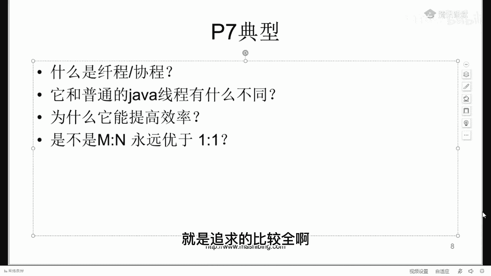

各方面的内容都都都都比较全，比较比较完整呃。

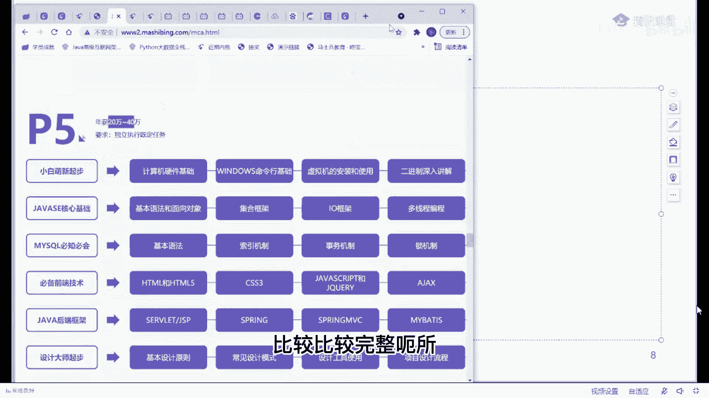

所以呢基本只能只要你能想到的啊，老师这课里头基本全都有，那我讲完p5 p5 p6 p7 ，你们想知道p5 p6 p7 拿多少钱吗，想知道的给老师扣个一好吧，好，哦sorry啊。

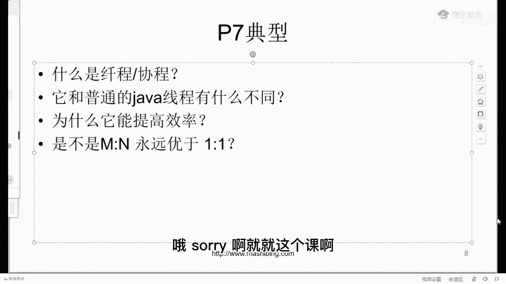

就就这个课啊，对不起，我这课这课名字叫携程啊。

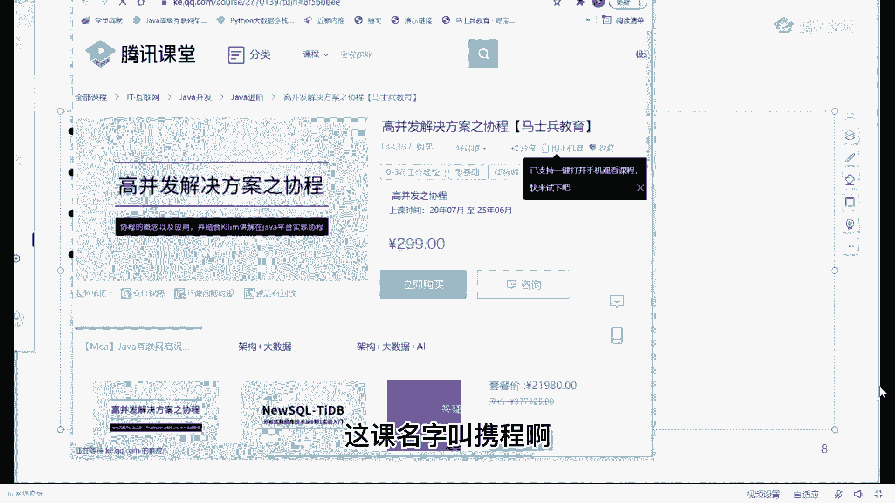

这个叫那个高并发解决方案，只写成了，对不起，我说怎么没搜到呢。

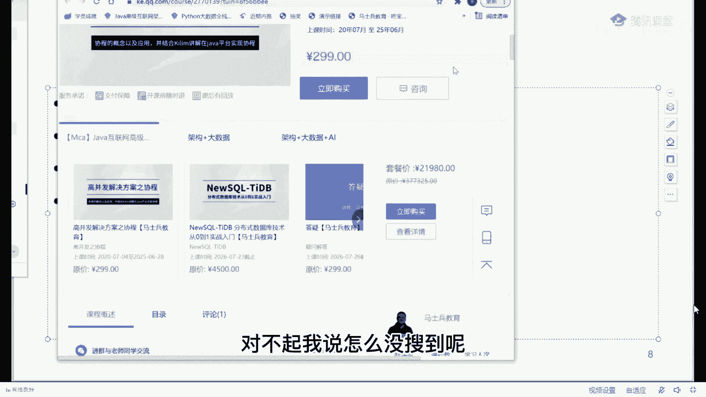

他是那个呃是是携程啊。

名字起的叫携程讨厌，所以啊记得是油滴，嗯嗯。

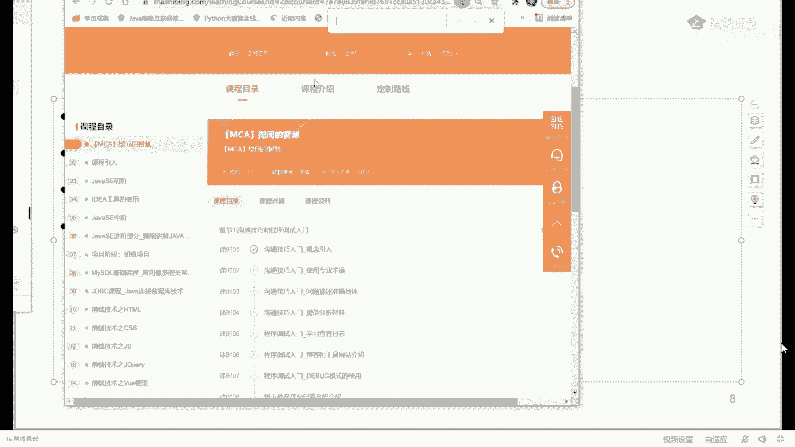

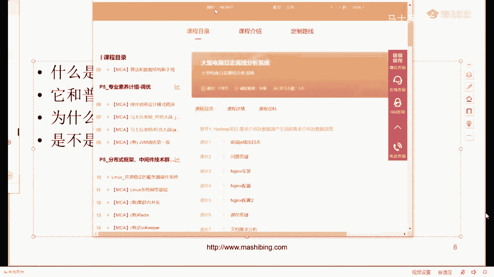

哦在这儿在这门课上嗯。

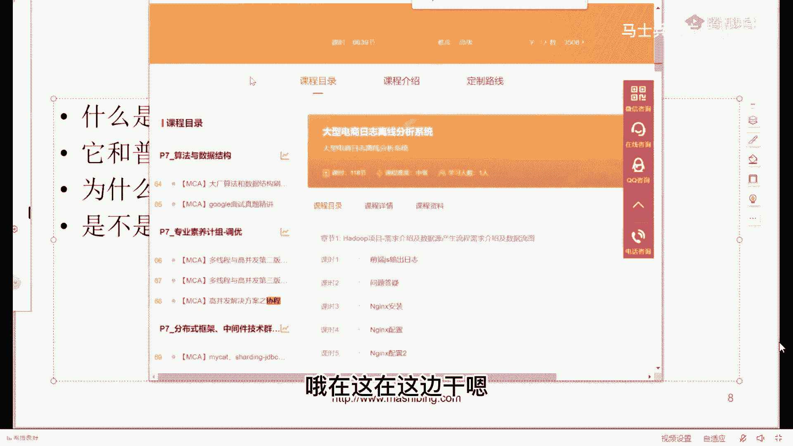

mc高并发的这携程这个是咱们阿里的一个p7 的老师。

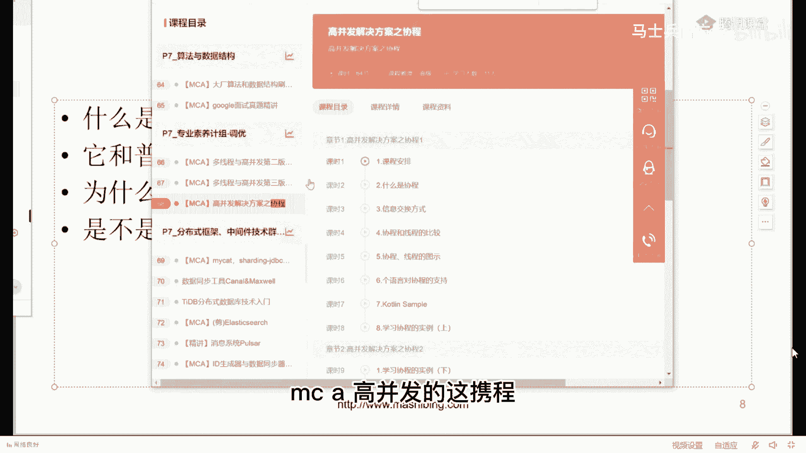

他们在实战之中呃，运用携程来解决这种高并发的问题，我觉得这个案例呢还是挺好的啊，嗯代码的场景啊，代码的解读啊，代码的答疑，io是怎么做的，并发模型是怎么做的啊，回顾一下写成killing到底是怎么做的。

呃讲解昨天的例子，阻塞的理解啊，最后是一个大一呃，当然这是我们整体课程中的一小部分了啊，我们基本上整整个的课呢是p5 p6 p7 p8 全有。

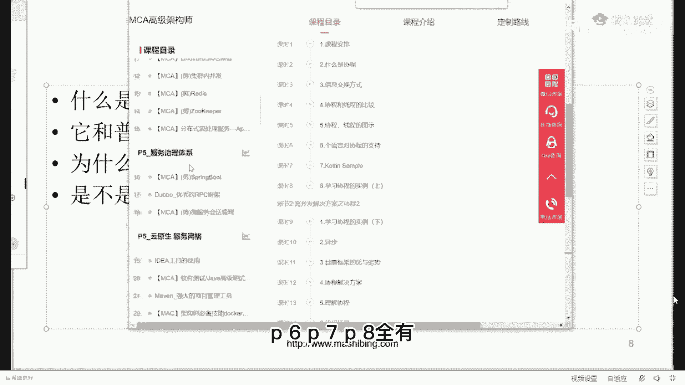

那我看有同学想了解那个p5 p6 p7 p8 到底是什么样的一个要求。

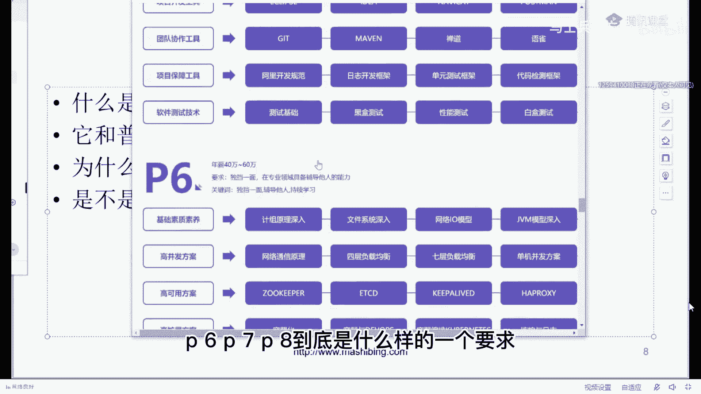

心率是多少呃，在这儿呢你们要想开这个网页的话。

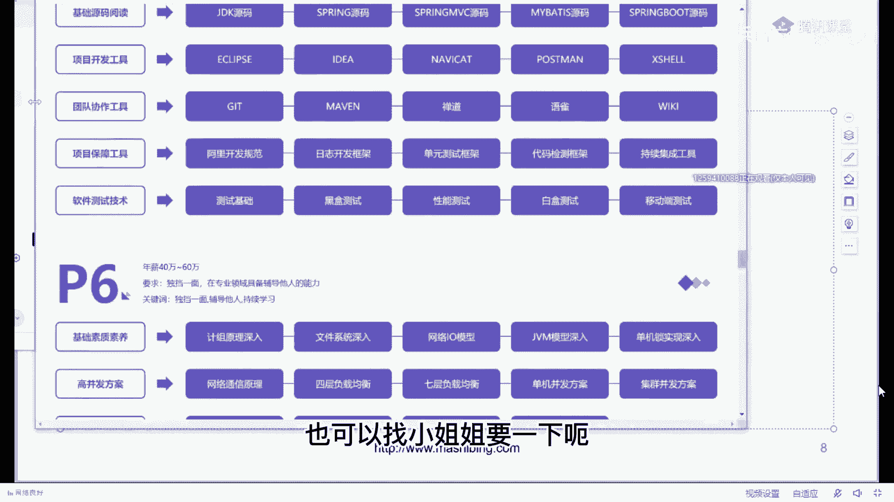

我在这儿写的其实非常的清楚，这是咱们阿里的曹老师把阿里那边完整的一个要求给大家呃。

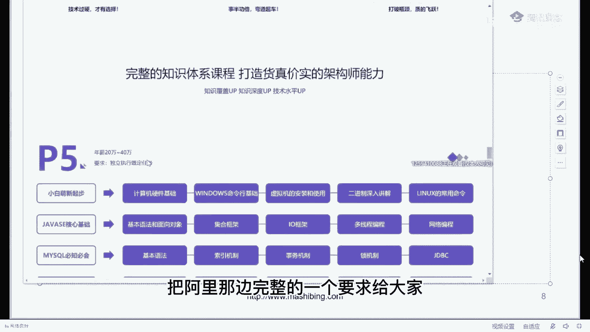

全部拿过来的，p5 的要求啊，它的年限一般是给到20万~40万。

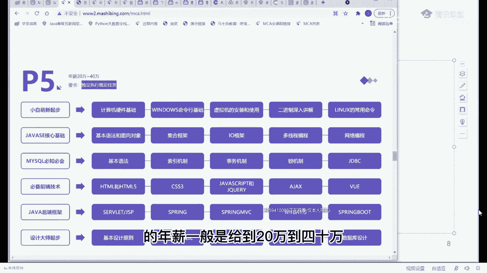

好吧，p6 的要求是什么，p6 年年薪是40万~60万啊，他的要求是一种独挡一面，在专业领域具备辅导他人的能力，那我问你啊，这个专业领域具备辅导他人，他辅导谁啊，独当一面辅导他人，辅导谁，辅导屁股吗。

对辅导p5 是这样的啊。

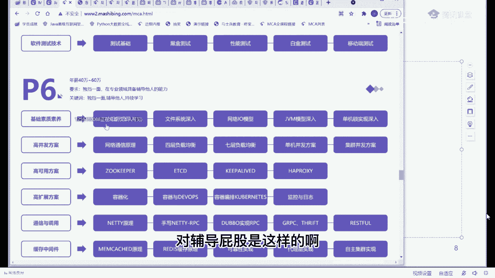

然后呢嗯在站在p6 的角度，然后p7 p7 是年薪50万~70万，他当然他时他就有股票了，是800~1200股呃，这时候它叫做领域专家，一杆到底系统性思考这个东西呢，就是他在p6 的基础之上呢。

它会变成一个领域专家，大家记住，当你看到领域专家这个词的时候，一定要有一个有有一个词儿要出现在你的眼帘里，出现在你的耳耳门里，出现在你的脑子里，这个词叫业务，好听我说当我们成为一个技术架构师。

成为一个技术的高手之后，请你一定要拥抱业务啊，我们说p7 到p8 ，它的一个跨越的点在哪。

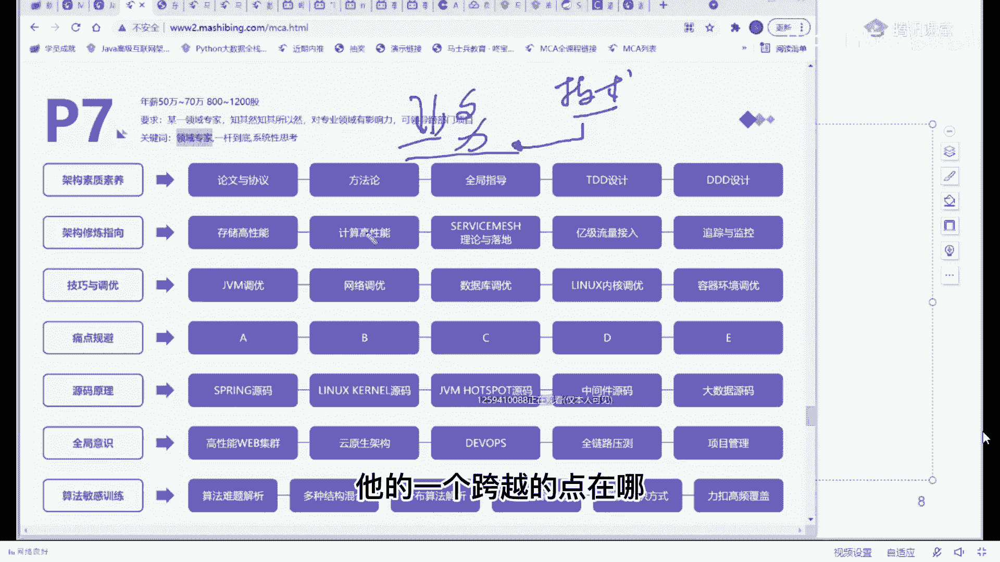

就是这俩字儿啥业务啊，好听我说我我简单给你们解释就是什么情况下你会到p5 。

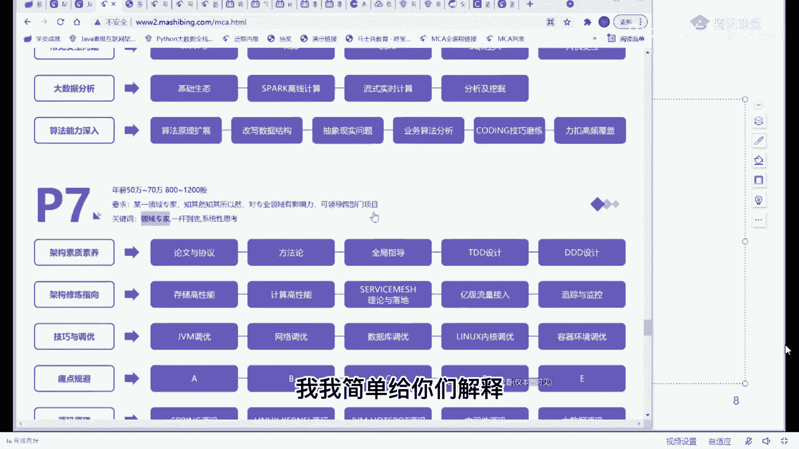

什么情况下你会回到p6 ，什么情况下能到p7 ，好认真听，一般情况下你是应届生，这个应届生呢还得是本科的应届生，然后本科也或者是研究生好，ok这个时候你的直接进你的级别，如果你能练过的话，p5 。

那么在这个基础之上，p6 是什么意思呢，p61 般情况下它和p5 的要求，所以我说p5 p6 p7 啊，实际上不分家，在我们整体课程里头呢，这三个东西呢也叫做一门课啊，就p5 p6 p7 是不分家的。

听我说，一般来说什么情况下你回到p6 呢，p6 是你一个模块的负责人，你把这个模块分解成任务之后，可以让p5 去做，你督促他去完成，就在别人的帮助之下，别人给你下达好任务之后，你能完成。

ok好你这什么叫做p6 呢，一般情况下是本科生毕业1年左右，专科生毕业3年左右，这个时候你去应聘的时候，你对应的叫p6 ，能理解吗，好这个能get到的老师扣个一来嗯，好的，那什么叫p7 呢。

p7 什么样子呢，如果你的项目组一共有20个人，他们一般会有几个p7 呢，三个两三个左右，这个p7 啊，它叫做四五个人的一个team leader，team leader。

这四个人里面很可能负责一个小模块群，一个子系统，在这个子系统里面最核心的这哥们p7 好多g，这次五个人谁要技术不懂了，找他要找他问，这个一般叫p7 ，这个一般的如果社招来说啊，基本上5年左右的。

那我在这个基础之上呢，什么叫p8 呢，还想继续听吗，阿里工作3年仍是p6 ，生脾气比较难，晋升这块是一个比较复杂的问题。

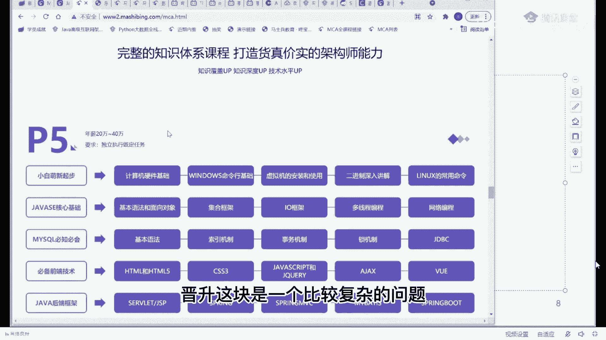

呃我我我原来曾经专门讲过晋升课啊，在我们整个体系里头，我也想把这个晋升这块给大家慢慢的讲起来，小公司管四个人特别多，你小公司的管四个人，他就成不了p7 呃，我想问你啊，就是我我就交给你。

我教你一个简单的怎么晋升的，在座的想听吗，有有没有有没有想听，想听听老哥一来就教你怎么去做晋升这件事，嗯大家听我说啊，就是说晋升这件事情呢，他第一个呢是要求你的是你的综合能力，他可能不单单要求是纯技术。

当然也有可能搞不正之风的，你跟说跟领导睡了，跟领导那个关系特别好，嗯那也也有可能，咱们除去这种情况，一般来说怎么晋升，我就想问你一句话，你好好想，现在呢有，五个p6 ，其中有一个人会升为p7 。

我们的指标就是这样的好，我问你谁会升为p7 ，同学们记着我一个答案，谁先去做p7 的事情，我再说一遍，谁先去做p7 的事情，谁升为p7 的可能性就越高，谁先站在p7 的角度考虑问题。

谁成为p7 的可能性就越高，不知道大家能不能听得懂，能不能听得进去，我是说一个人的真正的成熟，一个人真正的成熟是从他认真对待工作开始，你们可以每天都摸鱼，每天都划水，你可以不认真对待你自己的工作。

敷衍自己的工作，但是我告诉你，敷衍自己的工作等于敷衍自己的人生，敷衍工作没有关系，但是你的人生也是在同事在敷衍，这是你的时间，我希望你们能听进去，所以为什么有的职位叫p6 plus。

这个plus plus在哪，虽然他还是p6 ，但他已经开始逐步在做p7 的事情，为什么有的人叫p7 plus，虽然他还是在p7 ，但是他已经在做p8 的事情，好。

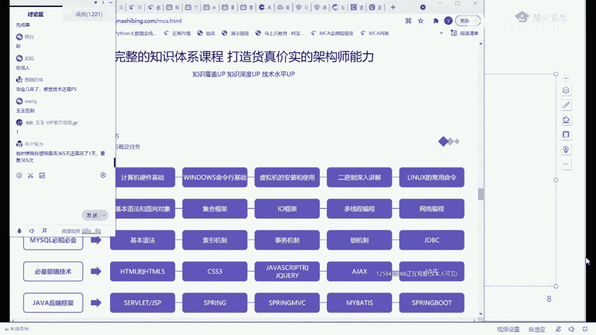

学生里有一个比较牛牛比较牛逼的脾气，你们想看看吗，来这会儿一定一定给老师听进去，好不好。

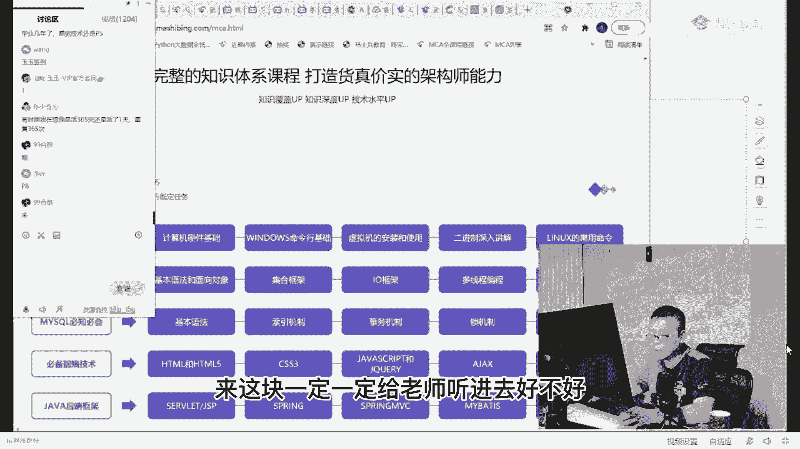

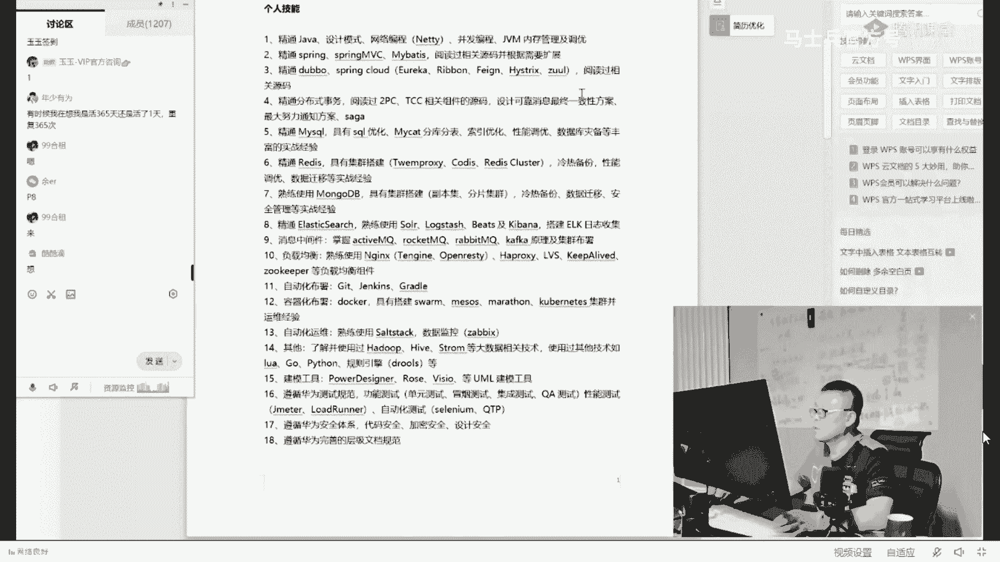

他这个这哥们儿是p7 的一个顶级薪水啊，就是他看这里，3年的大型系统架构的设计经验，团队管理经验，你就记住了，真正的团队管理其实是在p8 才有他p7 里面呢，一般这个团队呢你管理个四五个人比较简单的啊。

一般只有到p8 才有，然后分布式高并发高可用大数据量的系统架构设计经验和研发经验，对各种源码均深度阅读，和下面是一系列的关于个人技能的描述，呃我一会给你讲为什么叫p7 plus，不叫p8 。

120万年薪，大家慢慢做，大多数人现在是到不了这个年薪的，跟老师慢慢学，老师会逐步带你到这个年薪去啊，好多精通对这个课程里都有，不用不用不用担心啊，精通这个词也能用吗，嗯反正别人都在用，你可以不用。

当别人都在用精通，而你不在用的时候，你猜猜看站在面试官的角度，他会怎么看，拿大腿想想。

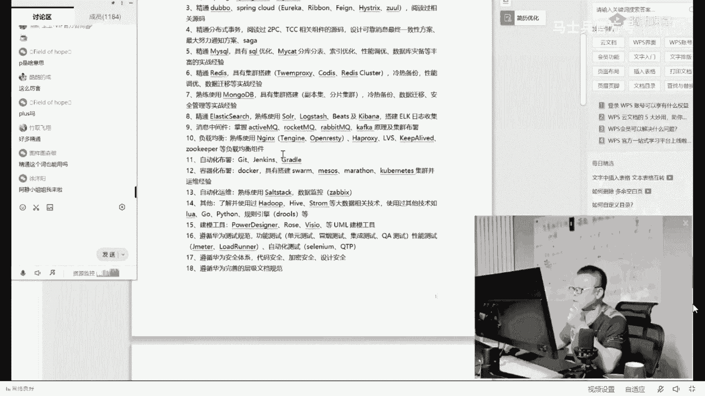

分布系统架构，海量数据架构，高并发的系统架构，高可用的架构，高性能的架构啊，到什么程度才算精通。

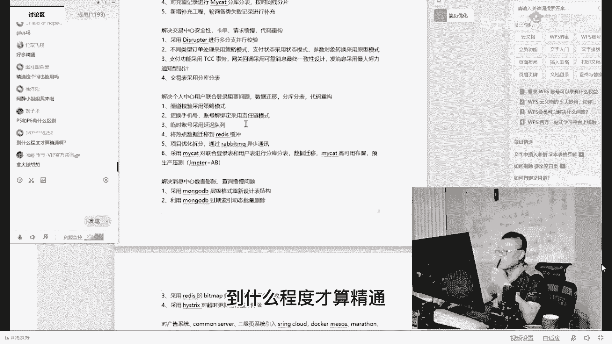

面试官问你，你能够答得出来，大老师给你今天给你讲课的程度就算精通了，能说出来怎么用，能说出来为什么这么用，你就可以叫精通了，你能能说来怎么用，能灵活使用，能说出来为什么。

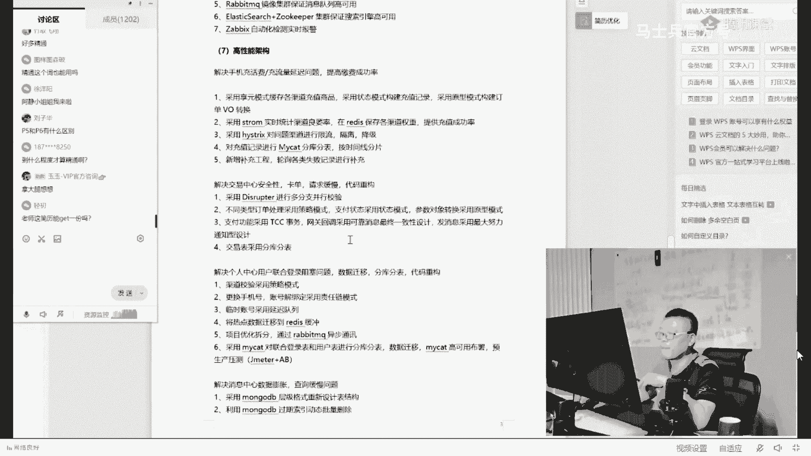

这个简历能get一份吗，这个简历不能get一份，这个简历是咱们小伙伴的简历，也是我们呃最近目前在用的一个简历的模板，把他的简历真实简历当成模板了，呃，这个小伙呢。

他现有的一个状况其实是比他当时的这个状况还要牛逼的啊。

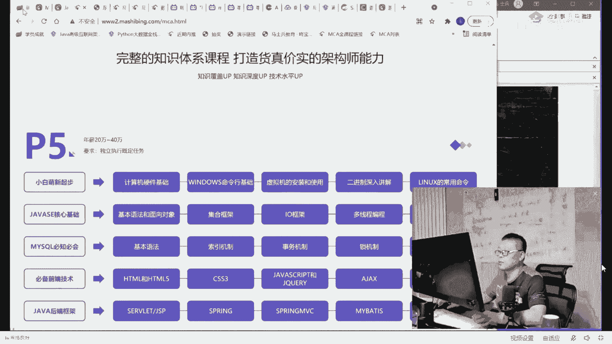

我我我给你找一下，这小伙目前是我教的最牛逼的一个学生了，跟他是一个亦亦师亦友的关系了，他大概在30岁还是31岁的时候嗯，退休了，公司给了5000万的股票，并且套现，套现5000万，退休了啊。

我的简历根本看不了，其实你简历靠不了的原因呢，这个应技能不足嘛，补上硬技能就可以了啊，呃如果大家感兴趣，也可以找个图去好好的读一读它关于p7 的，关于p6 的一个说法，呃那么能套现对，为什么不能。

如果给了5000万股票不能套现，小伙伴，这股票有屁用，虽然我在公司的最后一站了，有福之人，每次遇到不可控的过程，总有一个人站出来拉我一把，这个人谦虚嘛啊就是越牛逼的人呢会越谦虚，截个图可以截。

你不用截图，嗯老师这里都是公开的啊，这里面所有的大概1000份左右的那个就业信息，111 千份左右，没有一个是那个说给大家p过或者干嘛的，只是给大家引去了隐私的信息而已啊。

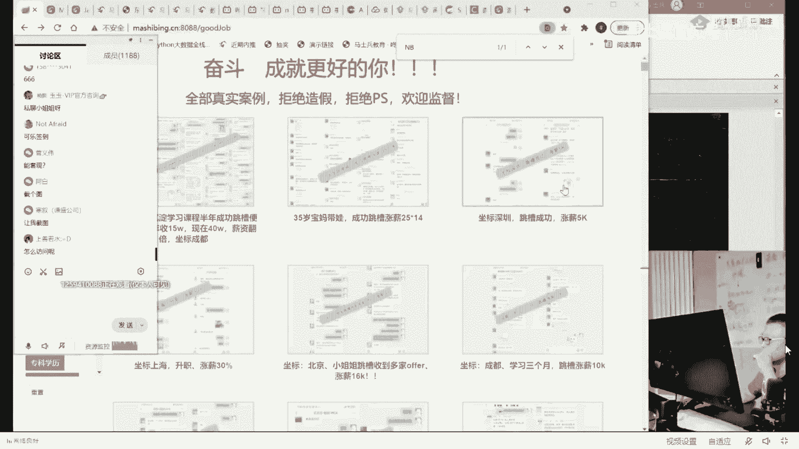