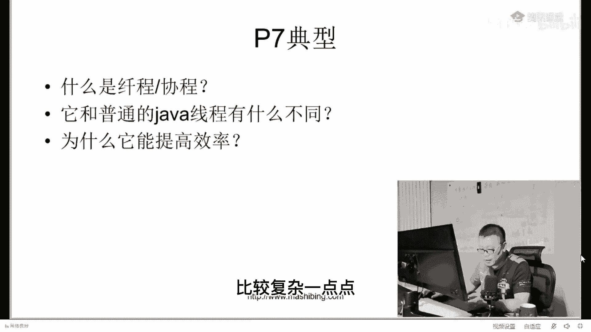
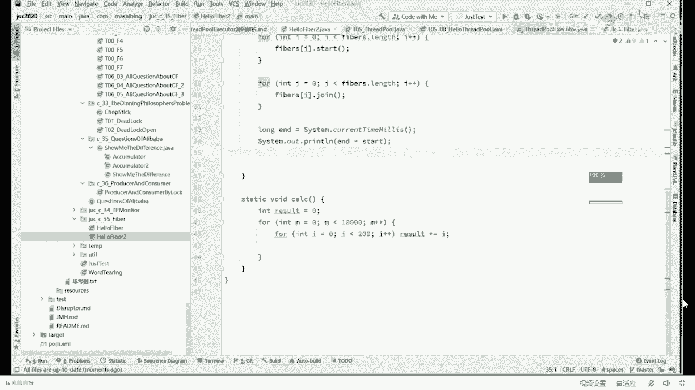

# 【马士兵教育】MCA架构师课程 主讲老师：马士兵 - P52：70w年薪面试题：4：跨越职级，P7和P8的巨大思维鸿沟在哪里？ - 马士兵官方号 - BV1mu411r78p

题会越来越难，这个俩学生，然后，成绩就提上去了，后来剩下的那个9998个学生，就不干了，说你俩他妈抢跑这9998个，怎么办，结果你猜猜什么题上去了，分数线，或者说题更难了哈哈能不能理解，就是说成员呢。

这个你像说一句最简单的，像那个几几年前你你你懂点什么s h哈，后来s s g就不行了，懂点什么s s m，后来又不行了，得懂点spring cloud，现在又不行了，还得懂点儿三高啊，现在又不行了。

还得懂点算法，现在又不行了，还得懂点底层知识，哎呀娘啊，ok，不断上进的人，所以其他的不不不上进的，呃，请大家伙，以动态发展的概念去看待一个问题啊，不要用静态的思维去看待问题，好吧呃。

这东西是好事也是坏事，好坏事呢是大家伙诶，就得好好花时间去努力了，逼着你去学，那么好事就在于我们会变得越来越强啊，他跟那个他跟那个什么还不太一样，好吧嗯好看这里啊，我们说什么叫线程，线程协程。

它和普通的jav线程有什么不同，为什么他能提高效率，那这个事儿呢比较复杂一点点。

解释一下啊，我要把这个图示给大家调出来，不掉图示呢比较难以解释，嗯，一sorry你多线程与高并发在另一个啊，啊嗯，这个呃，这个其实它本质上来源于腾讯的一轮面试，腾讯第一轮面试的时候，面了一个这个算法啊。

第二轮的面试面试一个release和mysql的一个内容，第三轮的时候就开始了一个，疯狂追问式的问，你先问你什么叫县城，什么叫进程，这是这这个这个这个题，一般是腾讯的开场白，什么叫线程，什么叫进程。

其实像这一类的东西呃，非计算机专业的一般都打不太好，同学们什么叫县城，什么叫进程啊，这个能能能能答得出来吗，什么叫线程，什么叫进程呃，同学们听我说啊，就是说那个一般来说我们举形，象一点的例子啊。

用用那个用那个，因为他这个不是大学里，和那种非常呃书本化的一个考试，所以呢我尽量给你举形象一点的例子嗯，大家听我说，我们我们一般说什么叫一个程序呢，这个程序呢就是你编译好的一个可执行，可执行的文件呃。

qq。e x e哈，这就是一个一个程序，一般我们称为一个程序，那同学们，你们想想这个程序平时都趴在什么地方呀，都趴在哪儿了，盘内存里胡胡说八道吗，你这个你你你一开机，你的qq。e s e是跑内存里了啊。

那是自动化的，弄进去才行啊，一般来说趴趴硬盘上说这个文件啊，一般放哪儿，注意是放硬盘上，对不对，放硬盘上，那如果说我们想执行这个程序的时候，是什么样子的呢，我们找到这个q。e x e，双击它好。

双击它操作系统就干了一件什么事呢，它会把这个程序，把整个程序从硬盘上给拎出来，拎出来之后放到哪里去，注意放到我们的内存里，放到我们的memory里面好，我们假设这是放好的那个qq。x，请大家记住。

这个东西就被我们称之为一个进程，同学们，你们想一下，我把这个程序放到内存之后，我要我要为他干一件什么事儿，我是不是得为它分配好对应的啊空间啊，我们一般把它称之为，分配好对应的进程空间。

感觉回到了基础归零，我主要其实人家想问你的是，这个携程县城其实不是归零，咱们直播间的小伙伴啊，我直接跟你们说，这个你可能听不太懂，所以我从根上给你稍微解释一下，是这个意思好吧。

来可以可以继续给老师扣个一啊，能理解的给老师扣个一，不是p7 ，又回到了那儿，是实际上人家问的是这个啊，县城县城人家问的是这个嗯好了，那同学们你们想一下，作为一个qq。e x，它是不是可以再双击一下。

再双击一下，是不是有几个呀，那也就是说，一个程序是不是可以对应多个进程，那两个进程有什么区别呢，资源对应不一样，什么意思呢，你看这个这个空间的地址，和这个空间的地址，它一定是不一样的，所以这个进程啊。

被称之为叫做分配资源的基本单位，注意它还没有运行起来，它只要放到内存里，它就可以称之为一个进程了，那这个进程要想跑起来的时候，是什么样子的呢，进程要想跑起来卡住了吗，其他人都卡吗，hello，没有是吧。

嗯，嗯我看一眼啊，是不是卡了，刷新一下啊，对卡的话，稍微刷新一下，头像卡了是吧，头像卡了无所谓了，o o那同学们，你们你们你们你们稍微思考一下，这时候是一个进程啊，那这个这个程序要想跑起来。

那真正的开始我要接受网络的一些操作了，我可以对外呃，跟其他人聊天了，那时候那时候呃是什么情况呢，怎么办呢，办法是，他会找到我们一个进程空间里面的，程序入口，什么叫程序入口，就是我们没函数开始的地方。

就找到我们的main函数开始的地方，然后呢这条指令拿过来运行，拿过来运行好了，只要他开始跑起来之后呢，唉这个程序呢就叫做开始运，行我们的主线程，我们的main函数是不是我们的主线程啊。

来这块能听懂的老师扣个一，所以呢，线程一般被我们称之为，程序运行的基本单元，也就是说进程啊是一个静态的概念，它是程序分配资源的基本单元，那程序要想运行起来呢，就是一个动态的概念，就是现成的概念。

好下面我要问你的是，一颗cpu里能跑几个线程，同时cpu能跑几个现场，一般情况下，只要不是说那个呃超线程的那种啊，线程撕裂者不是只要是那种的，就是一个一个cpu跑一个一盒啊，一个盒里就跑一个。

当然有一些超线程的一盒，你可以跑两跑三跑四个啊，跑不了三啊，一般不是三跑四个啊，这是有可能的，这个是县城，所以我们一般讲的县城和那个cpu啊，是一对应的超频，这跟超频有半毛钱关系吗，你琢磨啥呢。

需要给大家解释一下什么叫线程撕裂者，什么叫我们叫这个这个这个，现成的这种这种那什么吗，嗯，这个需要你大致理解cpu的基本构造，我们讲呃作为一颗cpu来说，它里面有一个东西呢叫做最重要的东西。

被我们称之为叫运算单元，简单认为它就是做计算的，但是除了运算单元之外呢，实际上呢它有别的用来存储数据的，存储数据的，被我们称之为叫寄存器，寄存器，好同学们听我说，一个现成的数据存到一组寄存器里。

还有一个专门的计算器，被称之为叫呃pc叫program counter，它就记录了这个线程执行到什么位置了，执行到哪哪哪条指令了，同学听我说这个事儿呢，其实超线程很简单啊，或者叫线程撕裂者，很简单。

就是一套寄存器，只能同时存一个线程的数据，那我问你，如果在我一个盒里面，我有两套寄存器，这是一套新的寄存器，我是不是就可以同时放两个线程的数据来，这块能听懂的给老师扣一，那我lu来说呢。

我算你一会儿算它，一会儿算你一会儿算它，一会儿我在盒的内部就直接切换了，那可远远比你从这个盒切到那个盒，或者从外面把这个数据再load进来，效率要高多了，所以这个东西呢就被称之为叫线程撕裂者，啥都不懂。

你们嗯，好了，我们可以继续给他，可以来，我没骂，我就觉得你们啥都不懂，好，我们回到我们，呃会嗯回到我们县城的概念啊，什么叫西城或者叫什么叫携程，这个概念呢本身比较简单，它我我呢在这儿呢给大家呢。

呃做一个对比的一个一个说明，你就你就理解了啊，好看这里啊，啊这是我们的这个，我们说这是我们的操作系统，呃操作系统的它管理的一系列的内存是吧，嗯听我说听我说，这是操作系统管理的内存啊。

那么同学们你们想一下啊，就是诶对，就是你们想一下，就是在我操作系统里面，跑着一个一个的小程序啊，这是我们的在操作系统里跑着的，一个一个的小程序，这小程序呢数量比较多了。

啊这个呢可以那么叫叫做or word啊，这个呢叫qq，后来有一个非常特殊的程序，这个程序比较特殊，这个程序叫什么啊，这个程序居然叫jvm，而这个jvm非常的奇怪，这个jvm啊。

实际上呢如果站在使用这vm的人看来，就是说使用这vm的人，也就是说往里头扔那些个class的人啊，我有一个class往里扔扔进去，站在class这个角度看，jvm他是看不到操作系统这层的。

他是看不到这里的啊，在在class看来，哎它被称之为叫做虚拟机，那这时候我就想问你了，既然它，是一台虚拟的机器，那这台机器上有没有它自己的一个线程，java的线程有没有，那肯定有嘛，这是必须有的。

你作为一台虚拟的机器，你做一个虚拟的操作系统，是不是你是不是得有自己的线程好啦，这个是你自己的线程，那现在问题就来了，当我的虚拟机里头起一个现状的时候，我们真正的操作系统会不会取一个线程，会吗。

自己琢磨一下，好就是我们jvm里面起一个线程的时候，我们操作系统里面会不会起一个线程，会的，这是我们操作系统里面的这个线程，好请大家记住，当我们的jvm里有一个线程的时候，我们操作系统有一个对应的线程。

当然有同学可能会说了，老师那我这vm起个线程，我能不能够上操作系统里面，不起那么多线程，这个可以吗，其实也可以，这个取决于你的j vm怎么实现呢，你jvm愿意怎么实现就怎么实现。

你完全可以在这里起好多个线程，起好多个jvm级别的线程，但是不起那么多操作系统对应对应的线程，这是可以实现的，这是没有问题的，好同学们听我说，现在的我们说呃，jvm的一些个实现呢。

经常我们用的最多的是oracle自，己的默认的实现，这个这个时间被我们称之为叫hot spot，不用我解释吧，你作为p7 的人，肯定是不需要我解释的啊，你要是p5 p4 的，你可能就需要我解释一下。

就是oracle自己，你下载的那个jdk那个dvm，它的名字叫hot spot，那么除了oracle的实现之外呢，其他有各种各样的实现，各种公司的实现，i b m的，淘宝的，阿里的都都有啊。

那当你理解了这件事情之后，他们听我说，在hobo里面，一个jvm的线程是对应一个操作系统线程，这个那么我称之为叫一比一模型，为什么jvm这么设计，为什么为什么这边这么设定，想想。

为什么这vm不设计自己一套，自己独有的那种那种那种现成模型啊，唉说得很对啊，懒，除了懒之外呢，还能省事，是不是还有一套通用的这种线程库，你都你都可以直接拿来拿来编写，可还可以。

其他其他系统上你编程编程也方便，唉就是懒就是懒啊，这是最简单的模型，但是这种模型呢也有它的不太好的地方，那假如说我们的同步也好啊，我们整个并发对于内容的处理也好，呃，那如果说我们每起一个这边的县城。

都要起一个操作系统线程，因为怎么说呢，你得去通过操作系统来帮你调度，说我这里申请了一把锁，操作系统对应的得有一把锁，说这个，这个这个锁上有等待队列，k操作系统上也得有一个等待队列，就是总而言之。

再给你反馈回来，你中间要经过别人的帮忙，你整个线程的这种操作，上下文的操作系统，这种切换，你是不是得经过操作系统来帮你做，所以这种模型呢比较简单，但是他呢唉严格来讲它的效率并不高偏低。

来这块能听懂的老师扣一，那我们是不是能够做一种什么样的方式，就说我这辈m里面，我干脆自己管一套行不行啊，我能不能在jvm的线程里，我模拟一个操作系，统模拟一个什么呢，模拟一个叫做线程调度器的东西。

线程调度器，就说我在我自己的jvm内部，管理自己的线程模型，但是注意这些个线程，它并不对应操作系统的线程，他只是说在我jvm内部，又设计了一套操作系统的调度算法，在这些调度算法里面呢，它所有的同步也好。

它所有的并发也好，都这类m自己来完成好，这个东西被我们称之为贤成，最早开始是谁谁做的呢，勾引罗恩语言，他们用的都是这个嗯，就是他们自己的高原的虚拟机呢，它的线程模型都被我们称之为叫gpm型啊。

就是类似于跟我这是一样的，就是在它的内部的内部的go语言，建立的这种，好多问先程或者叫携程啊，和操作系统的这种并不是完全对应的，那么这种对应关系呢，被我们称之为叫m比n模型，就是在我们这里起m个线程。

m它的内部线程，但是对我的操作系统来说，只起n个操作系统模型，一般来说m要远远大于n，比方说这里有1万个县城，但是这里头有可能只有十个线程，就帮你搞定了，这十个县城呢，来帮你负责他们之间的这一问。

线程之间的同步和并发呃，这就是现成的最基本的概念，也就是我操作系统里面，jvm这版本里面呢本来有自己的县城站，线城站，但是呢在自己的现状战基础之上，我又建立了另外的一套的现成的调度。

好这个被我们称之为fiber，java叫fiber，那么，go语言呢叫coo routine，叫携程啊，好这个概念大家能听懂的，给老师可以，好看，有同学说，那go就要优于java。

go在并发这个方面它是优于java的，因为go语言天生是为了并发而生，所以呢它是由于java的，这个概念大家能理解了是吧，那这个东西呢，所以他的第二问，我觉得你就你就应该能答得出来了，大家听我说啊。

p7 的很多时候的要求，我们说它虽然划分为p6 ，p7 ，p7 很多时候的要求对于技术来说，它实际上跟p6 呢要求的，也并不是说区别那么大，但这个时候pg更考察你的，其实是两大两个大东西。

第一个是关于项目类的，第二个是什么呢，是不是您这个人是一个好学的人，你平时都用来干嘛，你虽然是能写程序，能写程序的人多了，但是问你一些新鲜的事物，你是不能懂，所以呢他问的是这方面的一个东西。

当然它会往细节里头一遍一遍的追问，为什么呢，它和普通限流有什么区别，不是一比一的关系吗，那他为什么比他强啊，因为这个同步是轻量级的，因为这个同步，它是不需要经过操作系统的内核的，它是不它是。

它是不需要经过操作系统的这种，一对一的线程的调度的啊，那我在这儿呢给大家举简单例子，拿代码来说明问题，这个代码呢你们能看懂就看，看不懂就算了，好不好，能听懂就听，听不懂就算了啊。

把它当成一个新的事物来对待，就可以，同学们，听我说呃，在jvm来说，hosp来说，这个jvm hosport来说，对他来说他是天生不支持fiber的，如果你想利用fiber，不好意思。

这个时候呢得用java的drumentation技术啊，这我不给你不理解，是java的技术啊，instrumentation的技术，a的技术，java代理技术在这个程序运行之前呢。

前面有一个代理人通过它再再进入这个m，那么通过它的时候呢，它会把对应的线程代码给你，折算成为对应的线程代码，然后ok这个时候才可以应用线程这个东西，那么先生这个东西呢最常见的java类库。

其中有个著名的类库呢，它被称之为叫馈赠馈赠，这个类库呢，我看看啊，我们课程体系里头，我记得是有专门的一门课讲这个的，我要找一下看，嗯，边点com，你这个搜索稍微有点问题啊，只能调十连刻，规则，先从。

嗯找大哥要一下，新城那天我也看到了，一会儿找找看啊，那个是阿里的一个p7 的老师啊，他们在阿里内部使用的现成的内容，他们用的这个类库呢就是他就是quiz呃，我给大家简单解释这个馈赠啊。

因为他那个讲了很长时间的一个课，我不可能在这里给大家那个从头到尾讲完，呃，我们来做一个小小的对比就知道了，我们在这里呢有一个简单的小任务啊，这个任务呢就是一个计算任务啊，calculation。

这计算距离怎么计算的，你不用去管它，这无所谓，就是模拟了一个简单的任务而已，那么在这个任务里面呢，我们，做好多次的计算，第一种方式我们使用了什么呢，我们使用了1万个线程，是1万个线程买多计算啊，好吧。

1万个线程来做计算，ok然后这是这是第一种，你们记住，我们看一下它运行的时间就行了，跑一下好，注意看它运营的时间是965个毫秒，就是用1万个线程来做计算的话，那么它运营的时间是965个毫秒。

这个时候如果我们引用引用这个quer，这个类库就是coo parallel，universe fiers，defier，quent类库里面用到的好，我们用这个类库的话，听我说听说好。

在这个时候我们也用了fiber这个概念，你可，以认为它叫线程中的县城，就是县城的概念啊，它也是run方法啊，也是调用了calculation，他也是来了1万次的循环啊。

不是不是要要求就是1万 1万次的任务好，那这时候他的效率是什么样子的呢，看到了吗，509，亏损基本上两个在这个小案例里面，它会相差一倍，来这块能感觉到的，给老师扣一，再执行一次。

你再执行100次也是一样的，577嗯，再执行522，基本上提速能提到提到一倍左右啊，啊这但是这个例子啊，注意啊，它这个东西呢不是说适用于所有的情况，我一会儿给你慢慢解释，就说人家问p7 的时候。

一定是问到你为什么这件事，你你得要解释解释，解释透到这个这个程度，你看这个时候就是一秒多嘛，就是如果你用线程的话，就基本上在一秒左右，一秒多，一秒多，但是你同样的案例，如果是用那个线程的话。

哎他就是哎这600多，这个算时间比较长了，跑一下就400多啊，基本上我500上下就500个毫秒上下呃，能感觉到吧，那么为什么他会这样呢，大家听我说，这个里面呢有一个1万个线程，1万个线程会涉及到。

是不是会让我们操作系统不断的在这里头，做同步啊，你们想想看。

我刚才画的这个图，在这里起1万个这玩意儿，是不是操作系统对，但它们之间不断的不断的做同步，然后做切换，是不是它这个线程的切换是很呃，耗费时间呢，那如果我们把这个计算任务放在这里呢，省了切换的时间。

因为它底层很可能只有，比方说就只有两三个县城就搞定了啊，呃你像go语言里面，它有一个调优的参数，就是你可以调a操作系统级别的，这个线程起多少个，知道吧，省了切换的时间，嗯好这块儿大家大家能听懂的。

