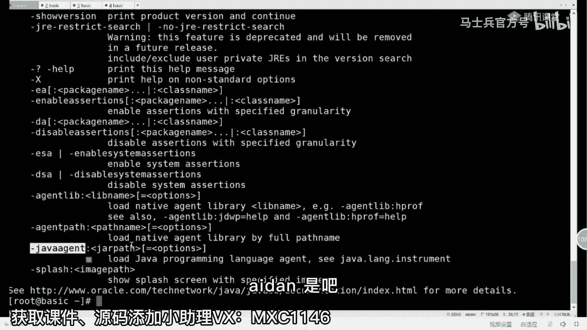
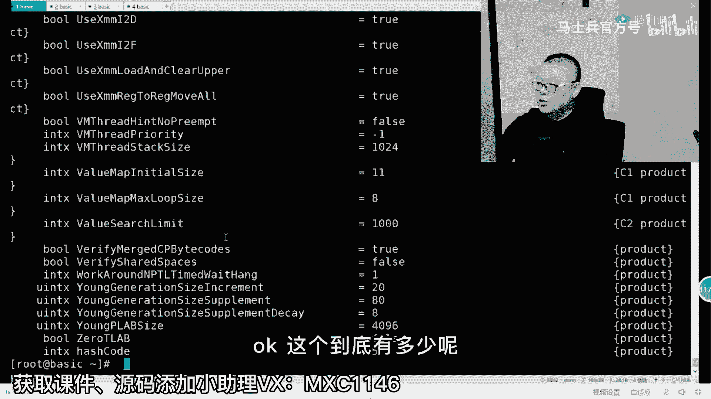

# 【马士兵教育】MCA架构师课程 主讲老师：马士兵 - P5：JVM瞬间涨薪3K的操作：5.ZGC的颜色指针算法为什么可以比G1更好？ - 马士兵官方号 - BV1mu411r78p

指针这个指针呢它里面存的是个地址，这个地址a指向这个t，这是最简单的java的语句啊，以及它的内存布局是最简单的，对不对，原来我们所谓的垃圾回收啊，都是在这里头，堆内存里头做各种各样的解决方案。

都是在这里头想办法，cdc采用了另外的思路，cdc是在这个小t上想办法，是在这儿想办法来，所以我们下面要关注的是这个指针本身，这个地址本身来，我刚才讲的这一小段能跟上的，给老师扣一。

ok那这个地址首先第一点，cdc是不支持32位的，所以cdc的指针最少是64位的指针，好吧，大家都知道这个64位的指针呢，最长的寻址空间啊是二的64次方，二的64次方，没有这么大的内存。

用不着这么大的寻址空间，只用其中的这部分就可以了，这部分是42位就够了，那么42位能寻址的空间是多少呢，二的42次方大概是四个t，后来呢cdc又加了两位，一共有44位jdk，13的时候。

大概现在寻址是16个t嗯，现在很少有这个大家见过16个t内存的，机器吗，我是没见过，我见的最多的是1。6t，我记得是1。5t左右吧，你们见过有谁见过16个t内存的机器，有没有有有有有，应该没有啊。

有结果，那就见了鬼了好吧，所以呢我们说指针长度用不了这么多，用44位就可以了，所以后面有一堆呢没有用的那个位位，怎么办呢，就在这里给做出几个标记位来，那么这几个标记位用来干什么。

用来标记我们这个指针的状态，比如说我们这个指针在所有的分区里，最开始的时候是一种状态，当然这种状态呢叫rema，然后呢当我们开始标记，的时候，我们主要解决的不就是并发标记的问题吗。

我们开始标记的时候就给它标成mark 0，m0 ，标成m0 啊，每个对象都给它标成m0 的状态，表示我我标记开始了啊，我标记开始了，然后对于这个m0 的处理，这个过程嗯比较复杂。

我只能说我今天呢就给你简单讲讲，讲原理就完了，好不好，后面我找时间，我专门给大家把这个过程给大家做成动画，你就更容易理解了，就是当我找到这个m0 对象的时候，我只要从根上开始找啊。

我垃圾回收器从根上开始找，我只要找到任何一个对象，我就，把它标成m0 ，好，我再说一遍，稍微的多说一点点，最开始的时候我们有一个对象的状态，整个整个内存里头啊，分了好多区域，首先这是第一点。

分了好多区域，好在这个区里面所有的对象都是一种状态，这种对象的叫remap，它具体是什么意思，我们不管，然后呢，我垃圾回收器十点钟开始找，我从根儿上的对象开始找你女朋友，你男朋友找到一个对象。

我就把它标成m0 ，找到一个对象，我就把它标成m0 ，所以最后就会变成什么呢，我们整个内存空间里都会变成有m0 存在，有remap的存在，凡是m，零就是活着的，凡是remap就是垃圾。

这个不知道大家能不能理解啊，然后比如说它它它在这个指针上，它只动指针，它不动内存能听懂吗，这块就简单多了，当然它中间呢把这个m0 找出来之后，如果我们决定要回收这两块空间，那这个过程也比较复杂。

他需要把这两块空间的对象，给挪到另外的一块空间里面去，那就意味着这个指针这个值是不是得变呀，所以它后面再加一个屏障，就jvm级别的屏障，只要是m0 级别正在挪动的时候，就把这个指针给它变过来。

所有的业务线程访问这个m0 的内容的时，候，就把这个指针的内容给他变过来，好不知道我说清楚没有，大概的啊，16t的硬盘都没见过，这个过程本身比较复杂啊，有m0 m1 ，cdc没有完全听明白了呢。

就先放过他，关系不太大，目前主要是目前的关系不太大，嗯现在是09：50，我从现在开始啊，来给大家讲解一点关于实战的内容，可以吗，来准备好的同学，你们还活着，还能跟上吗，还在吗，老师扣个一啊，这么恐怖。

内存地址都变了，不是杨树啊，这个杨树居然问了个，这么这么这么土的问题，大哥来，各位同学，到目前为止，你们好好思索，我们所讲过的任何的所有的垃圾回收器，有没有一个不用变内存地址的，有没有，琢磨琢磨。

我说的是所有的垃圾回收器，1+7怎么了，看见你了，有没有一个不用变内存地址呢，一个都没有，我告诉你，因为我们说年轻代的，你们想啊，就是年轻代的这个这个这个算法的时候，是需要把对象拷贝的。

对象拷贝什么意思啊，不就是把这个对象的，从这个地方拷贝到了另外一个地儿，那我想问你指向这个对象的指针，你你你你这个值不变吗，不然的话你通过原指针还能找得着吗，所有涉及到复制的地址是一定要变的。

所以这个东西跟恐怖不恐怖，有半毛钱关系吗，都要，变啊，还能跟上吗，好我讲点实战，讲点轻松的啊，理论的内容啊，确实它非常的复杂，告诉你嗯。

讲点稍微轻松的，讲点实战实战就是就就轻松多了呃。

教大家一点。

小小的实战的内容啊。

呃首先教大家第一个命令就是java conversion，我同学说这个不用交，这个都会是吧，呃大家听我说，这是检查java到底属于那个版本呃，同时呢直接就敲诈吧，什么都不敲回车。

你会看到这是jvm的所有的参数，凡是以横杠开头的参数。

这些都要标准参数，我们所谓的jvm调优。

我们调的什么东西呢，参数的值就这个意思。

凡是以横杠开头的，全部都是叫做标准参数，这里面呢我们应该也有的人是用过不少的，比如杠version，我刚才给你用了对吧。

指定class path路径等等，呃当然还有同学可能如果听我讲课，有可能用用过这个叫杠java是吧。

这是那个java编程接口啊，呃当然还有其他各种各样的杠，第323 12位的杠，第646 14位的呃，server server模式。

client client模式是吧，这都比较简单呃，有同学可能会说，我我我我去了解这种参数的时候，也太简单了。

就这么二三十个，我想调的时候非非常容易调啊，呃没那么简单，因为真正调参数的时候呢，往往有第二种参数，那么这种参数呢叫做nonstandard options。

print help on nonstandard options。

以杠s开头来瞅一眼clear。

这样的杠x回车好，那我们回车之后呢。

我们会看到以杠x开头的参数，这些参数。

那么我估计有同学应该会用过这个杠，xm堆内存的最小大小啊，你可以设我这个java程序要用多少内存，最小用多少杠x m x，最大有多少杠x s s是吧，这个是占的大小。

哎咱们小姐姐有人带吗，跟同学们聊会小天，我得喝点水，嗓子快疼死了啊，大家稍微等我一下，我我我喝点水，上个上个上个厕所好不好。

老师用的什么环境，win还是mac诶，我想问你，jvm在生产环境里头，一般运行在什么环境上，对呀，老师用的当然是linux了，我在win下面给你演示，没有意义的，听懂了吗，我在mac下面给你演示。

稍微有点意义，因为它叫做类类类unix系统啊，ok让我们九妹跟大家聊一小会儿啊。

我上省会。

ok我我我我们继续上课，呃vip课呢肯定讲的比这个要细致的多，呃，比方说每个参数什么意思都会讲给大家听，呃同时呢也跟大家说一声，今晚呃如果对课程有兴趣的，呃我们今天晚上的报名的话呢，也是双11的优惠。

那么1年之中呢最大的一次优惠了，双11呢我们今晚报名的呢，也是有那个抽奖的权利，然后的话呢报的越早的话，抽奖的概率就越高啊，就是这么设计的，ok嗯刚才呢我讲到说呃，我们进行一个jvm调优的时候啊。

没有两种参数啊，第一种呢是横杠开头的，那么这种呢是标准，参数第二种呢叫非比非标参数啊，杠x开头呃，其实我们读一下的话也就几十个，看上去也没那么复杂，但是呢实际上这里头是没有显示出来的，是另外一种呃。

另外一种参数就是以两个x开头的，是这种的java杠x这个开头的，那么这个参数呢，不知道大家同同学有没有用过呃，有用过的同学老师扣个一来有没有，有有吗，嗯不对啊，呃哼呃，戴尔好像加我微信了，还是吧。

ok笑傲江湖，ok gus开头的这个参数到底有多少呢，呃由于它没有显示出来，所以我们必须用一个命令来告诉大家，这个参数到底有多少，我们这个命令是什么呢，有两个命令啊，用其中一个就行了，print。

flex final，那这句话的意思是说，我们把java虚拟机的所有的flag，就是所有的参数，它最终的那个值全给你打印出来，由于这个数值特别多，所以我让他分个页，加一个more。

回车好，这是第一瓶从a开头的参数。

b开头的，这里我们会看到我以前讲过的偏向锁c。

ok这个到到底有多少呢。

wc杠没事嗯。

恭喜你，一共有728行啊，大概有700个参数左右吧，扣了扣了这些个。

大家都在那干嘛呢，在跟着克总吗，出来了是吧，来你们你们试过了是吧，哈哈哈，呃你的这个mv需要调优的话，大概有700个参数左右，所以当我们看到。

ppt里面，这句话的时候，来同学们看一眼，你说当我们把这句话写在我们简历上的时，候，我们是不是得多值个两三千块钱呀，熟悉常见的蓝鲸回收器，具有实际gm调优的实战经验，是不是得多值个2000块钱啊。

没问题吧，当然我们话说回来啊，这个呃如果700个参数你都需要了解，都需要调的话，这个难度也太高了是吧，没关系，老师给你记录得非常的清楚啊，我告诉你呃，大概常用的就这么几十个，我呢已经给你记录下来了。

最常用的就这么多，不需要记其他的好吧，我们ps加po常用的就这么多，所以ps加po的话，其实配合上上面参数没多少，但是cms本身比较多，而且比较复杂，所以cms一般我们不太建议用g one的。

常用参数的话呢，其实就少了很多，而且相对比较简单，关于z dc的话呢，基本上就三个参数，所以呃，这个呢就就就呃我我给你总结下来呢，大概有四五十个吧，四五十个参数，而且呢不同的垃圾回收计算下来的话呢。

20个左右就够了，是不是感觉世界又美好了一些，来有信心往这上面写这句话的同学，给老师扣个一，调调坏了，到了重装就是了，说的很对，就是你要大胆，当你把这个这句话写上去的时候，必须把该学的东西都给我学了。

要不然的话人家面试官可能会怼你啊，当然呢呃从实战的角度讲呢，其实有一个很重要的内容，就是日志这方面我没有讲，日志的格式本身也很重要，呃时间关系呢我就讲不完这个了，我给大家讲一个调优这件事情。

最常见的就是我们去找出来，是有哪些对象产生了o o m，这个呢在你简历上写调优的时候，是最容易cover得住的，而且呃讲的时候呢，你也能够讲得比较到位的啊，o o m那么关于o本身啊，内存溢出。

关于内存溢出本身呢，这个呃比较简单的方式是什么，你们你们自己能写一个，那让它内存产生溢出的程序吗，如果是你们要自己写的话，你们自己写一个最简单的，让内存溢出的程序怎么写，死循环死循环。

你能你能写得出来吗，猫那不可能啊，死锁死锁，你跟那个内存溢出没有半毛钱关系的，无限递归叫做战役出，它不叫堆一出，不叫out of memory，它叫做stack overflow，大哥，我要出括号。

你要这样能内存一出来，我就佩服你，你试试去，设一个固定的内存，一直new对象，疯狂扭list里面放list，对各位同学，你们实际写写，你们未必能把内存给弄崩了，我告诉你不是也不是那么容易的。

当然最简单的方式是什么，你你要搞一个list的，首先这是在你的main方法里面搞个list，我们看给大家写的最简单的案例吧，日志就略过不讲了啊，嗯这个案例，呃这张里面最简单的案例是是什么呢。

就是你弄你搞个list list list等于new一个link list，然后呢不停的往里头list里面加啊，这块很重要啊。

我觉得有同学可能不知道在哪，存在着一些误解。

