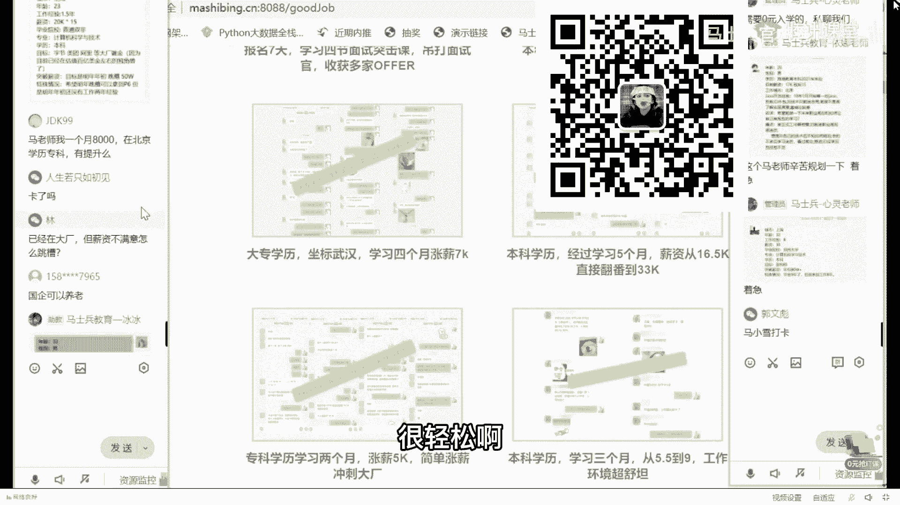
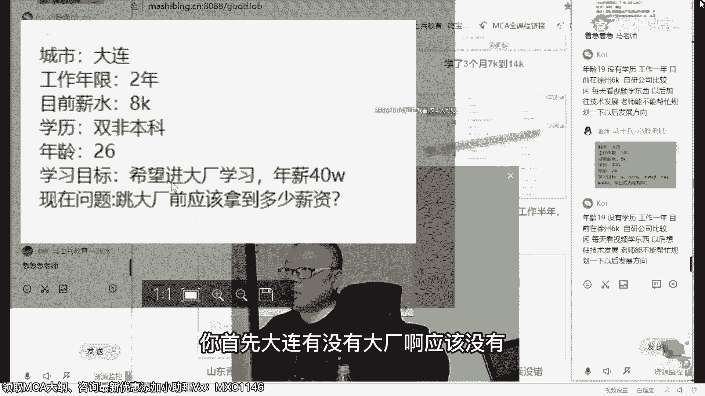
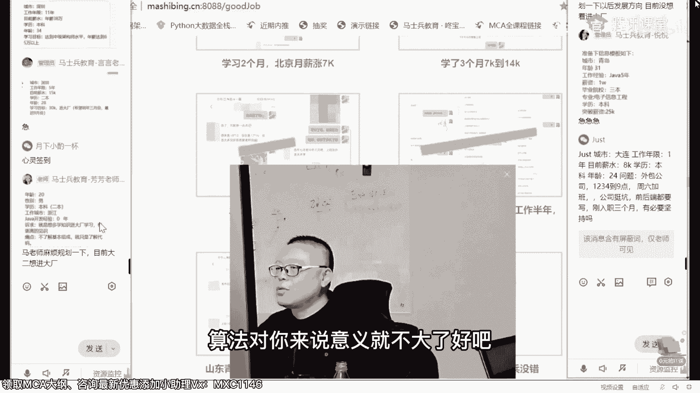

# 【马士兵教育】MCA架构师课程 主讲老师：马士兵 - P7：课堂答疑——不同学员的不同路线(1) - 马士兵官方号 - BV1mu411r78p

在这就不多说废话了。

我们聊会儿小天儿啊，准备结束，今天啰里八嗦的聊的东西比较多，讲的有点啰嗦，主要脑子里东西太多，一讲的时候吧就容易发散，讲到一个点呢，唉想到一个案例，就想给大家说说，讲到一个点。

像这个案例跟大家说说就就会比较多啊，这个东西呢叫知识的诅咒，就脑子东西太多了，明白吗，所以讲东西反而讲不清楚了，脑子里的东西就一个1+11说就清楚啊，当然跨越这个知识的诅咒，也是需要慢慢来的。

老师一定能跨越，老师咱们网站的自测的题，麻烦赶紧添加哈哈，呃需要人力一步一步来啊，你看有有几个小同学看看他的一个情况呃，28岁的男生，硕士，上海4年，国企4年300080技术20km，竞争较慢，想涨停。

纠结确定不了下一步的发展方向，那个首先第一点要判断一下，你在你们原来的这个企业里头，有没有下一步的成长空间，那如果没有了，要就要考虑跳，那跳的时候呢，呃由于你已经在国企4年了啊。

这个呢你你要想像你这种的啊，如果想进那个一线的互联网大厂，这个基本上属于板上，钉钉的事情啊，就是百分接近百分百啊，无限接近百分百，假如说你现在这个30万，你想拿到60万嗯，大概给老师的话。

也就也就需要半年左右时间，不会超过这个这个这个年限啊，明年34月份左右就让你进去了，呃但是呢你得自己呢做出决策，有老师能提供建议啊，就国企是比较清闲的，呃，你拿这个年薪，能不能去接受一线大厂的苦啊。

一线大厂的卷，那个，或者你就甘愿在国企里面，拿一个比较低的年薪，比较清闲，这个是你自己的选择，能理解吧，嗯而且你需要你就是你需要很多细节，我就在这没法没法说太多了，就是基本上把你送进。

送你进一线互联网大厂的，应该是玩似的，很轻松啊。

32岁的男生，本科大连205000年，其他语言3年，对日呃，对日向啥要懂一些，但是不精，那个是这样的啊，那个如果你想提薪水，其实我觉得你这个年薪啊，好像在大连还是不错的呃，提醒率的空间有没有，当然是有。

这个是需要看机会了，骑驴找马，慢慢找着把技术提上来，你的机会就多了，就是这个意思呃，但是你你你你你你说你这个满足一堆日，我觉得就有点不求上进了啊，就是对日的话，那你应该知道他好多技术用的非常的古老。

而且特别的死板，他跟好多那个技术的主流都格格不，入的啊。

你这个的话你不追求技术上进，那就啥也不说，你要追求技术上进的话，那必须得搞点新东西啊，呃对日的这块，我找找我们有没有对日的小同学，这是一个自考的大专生啊，对日项目12k到23k，继续30k的文化路。

他是是不是是不是也在大连，我忘了，因为大连对日是最多的，就是你提的目标不太明确，你如果能提出明确的目标来，比方说我给你举个最简单例子啊，就是大连嘛全国的城市里头啊，呃说这个又又又想多说了。

你们想知不知道，就是说全国的按照it薪水的排名，全国城市的排名是什么样子的，你了解吗，如果想了解的，扣个一好吧，我告诉你啊，这个跟很多人想象的可能不太一样啊，他们听我说排在第一的薪水。

排在前面的叫北上深航啊，北上深航，而且这四个的排名基本上就是1234，没广州什么事儿，没有广州什么事儿啊，呃第二个呢第二类的城市就是二线的城市，所谓的二线啊，就是基本上可以算上广州了，广州南京。

然后据我所知的话呢，厦门应该这个薪水也是蛮高的啊，珠海这几个薪资都都是蛮高的，都可以给到比较不错的薪水啊，珠海那个这算是二线吧，然后你像呃武汉成都，这个武汉成都那个像什么无锡啦，苏州啦。

呃然后这一类的吧，呃基本上再往下排一节，然后你像大连大连郑州，济南青岛，然后石家庄呃，西安呃，就这一类的，ok再往下排一级，不知道大家能不能理解，所以大连呢他是这样的啊，就是凡是处在这个层面的。

就是三四线往后的，我可以这么说，不吹牛逼的说，就是老师这课，你只需要理解个50%到60%，那么在这个城市里面，排名在前5%左右的这个岗位，所需要的技术，你就基本上全部涵盖了啊，比较简单。

所以你要想提薪就简单，就看大连那边有没有机会啊，有机会的话呢，你就去去去拿这个机会就ok了，呃我记得我们在成都就业的挺多的，这个啊，这是成都的海康威视，30万年薪左右，成都好像最近的薪水还可以啊。

有一些大厂的嗯，跑跑过去了啊，呃这个成都年薪涨了20万，很牛逼吧，就是他本身年薪涨了20万，他不是说年薪是20万啊，成都翻了倍了，5k到10k，这太简单了，这是比较老的一个学员。

就学了spring cloud，成都18k的offer，当然还有一些我记得武汉武汉也不少，武汉的小同学，武汉的薪资的话也好像也也还是不错，这是涨了4k，从12k干到了20个，在武汉。

那个30万年薪在武汉呢啊，呃四涨了7k的，大连的话，我忘了有没有有没有啊，大连没有，sorry，没有案例，但基本上像什么沈阳是不是有啊，沈阳这个应该那个跟大连差不多吧，呃涨薪涨了4。5。

坐标沈阳那个这是6。5~14啊，就是怎么说呢，东北这一带呢薪资偏低，所以你32岁拿了20万年薪，他差不多每个月18k多点啊，其实还算是可以的，你明白吗，所以你要想追求更好的薪资，首先去找你们城市里面。

有没有这样的工作机会，如果有老师，就一定让你把技术达到听懂了吧。

还有2年半，大专23，学历低，但是想进大厂，刚才我已经说过，专门讲过大专怎么进了，嗯，你能应该第一步提学历，就你提上来呃，但是我觉得你薪资还可以，还是很不错的，不要轻易跳槽补技术，然后大概半年到1年。

我感觉啊我直觉上，因为你中间很可能是跳过槽，我要看你跳槽的情况，如果跳槽跳的不是很频繁，补学历补技术，你就有机会了，但是这个机会我绝对不能说百分百的保障，听懂了吧，但是你这个年龄还是很给力，比较给力啊。

你行就是路线也很简单，补学历不，计术你就有机会了。

就这么简单，二期最贵啊，2。5年有接触过，最近面试都为微服务，那你就扎实学就行了，像在贵阳来说，就是贵阳那边提供什么样的薪资，像啊你还是本科，贵阳那边最高提供什么样的分支啊，这个这个这个呃薪资。

老师就一定让你把技术站给你涵盖到。

当然贵阳薪资肯定低低好多啊，这个没什么可说的，没有办法，年薪40万，年年年跳大厂钱应该拿多少薪资，你首先大连有没有大厂啊。

应该没有，所以你应该是要从大连出来呃，你从大连出来，8k的话呢，在你跳大赏之前，我希望你能拿到18，至少是18，是我们本科没问题的，学历够拿18工作个1~2年，然后跳大厂，然后到40万不成问题。

听懂了吧。

因为我前面讲的比较多了啊，我就讲的直直直接一点好吧，行就行不行就不行就算了，37岁401000年10年不提了，大专70万保险中介呃，这个呢应该是有点儿嗯，因为这个大量的小同，大量的大量的小同学。

就大量的同学呢，我我得透彻理解了解你原来的一个背景啊，然后你跳槽的一个情况呃，如果说你原来还算是比较稳定，我就觉得特别奇怪，你37岁了，没想着把这个学历给提上来嘛，就说你这个原来原来的规划就是有问题嘛。

对不对，嗯刚才说过啊，你要想在整个的你的大龄的人，要想突破的话，尤其是这个大专的背景的话，要么就是你的技术非常的过硬，一定是架构师的级别，到不了这个级别，你就不要提，汽车，1年肯定突破不了。

那么要么呢就是你走管理岗，但是你管理岗的经验怎么样，这个不好说啊，所以怎么说呢，嗯作为你来说，提架构，然后提学历，然后提管理，恐怕你都是要面临的问题，听懂了吧，嗯，当然啊你只提架构。

其实呢从你现在的薪资也能涨上来，这个是没问题不大的，因为现在架构是给的薪资还是蛮高的，但是我说的是你长远发展这三个层面，你恐怕一个都避不过去，不要认为我37岁了，我就可以放弃了，我我我这这辈子就这样了。

不要这样啊，有的是机会。

嗯提学历，提技术就是提架构，架构层面啊，我现在不给你提算法了，算法对你来说意义就不大了好吧。

具体问题具体分析一下，大龄的小伙伴呢，我得看你非常具体的背景，青岛31岁，1万块钱，三本本科突破25嗯，青岛到25就是顶薪了，所以你要准备技术就行了，这个倒不太难，那个我们原来张洪刚老师，他就是青。

他就是青岛的，他离开青岛之前就是25k呃，在青岛那边的惠普呃，但是青岛的25k好像就是更新，你可能得去什么，像海尔海信哪，像这一类的可能都得是很，好的一个薪资才行，嗯所以呢你技术过硬才有这个机会。

技术不过硬，把把架构补上啊，你到你到青岛现在这个程度就是不架构，补什么架构呢。

我告诉你啊，说到架构呢，我也跟大家多聊两句呃，就是在整个课程体系里面嗯，在资深架构师应该掌握的技术体系啊，这里就这部分是我们下一步的一个重点，也是你将来的重中之重，我虽然把它放到了新增里面。

但是我认为这部分呢，是所有人都应该掌握的东西，这是你将来做架构的基础，这个东西就叫做云原生，当，然云原生的内容相对来说比较多，我们自己像我们自己的这个平台，就是搭载原原生的基础之上，是华为云。

华为云上相对便宜一些，呃然后呢有一部分是搭载了阿里云，阿里云比较成熟一些，你一定要理解整个云原生的架构，这是未来的架构，可以说将来你所有的架构师都避不过去的，东西是必须要理解的，听懂了吧。

那么你在青岛的话呢，嗯要理解这些个，对青岛当地的i i it人来说，可能相对观念稍微超前一点东西，那么你就能领引领整个你，你你你的整个薪资啊。

长春211 28，日本读研躲疫情，回来找到工作，10k以上大哥，如果你给老师个三个月左右搞不定，做了三个月又三个月，刚好过年过完就过完，春节，你给老师点时间，如果让你搞不定这个薪资，老师一分钱不收你的。

ok你扎实来啊，你这个一定搞定的，如果你愿意走出长春，老师90%以上送你进大厂。

你这个太简单了啊，学历又好，背景还不错，就算你以前的底子再弱。

你只要听话，老师都有办法让你提上来啊。

27男生本科16，深圳4年涨薪，写的越多，老师文化越详细，你没什么可说的了，你这你这27岁的正常的薪资是多少，最少25k以上吧，所以第一目标拿到25，这简单啊，就几个几条线就让你到了第一条线。

项目线spring cloud，现在比较流行的项目，可能网约车项目，就一个网约车项目，就让你干到这个这个这个薪资了。

这个不吹牛逼啊，就是你把这一个项目搞定，很可能就就到了，网约车，这是应届生平，网约车项目给干到了21k的offer，这哥们还是一大专，我印象比较深刻呃，这是小白。

拿网约车面试了15k的，你才16k，这是网约车，涨到了那个涨薪资涨了5k，原来是25，现在30，学了几个技术点，薪资翻倍的，所以你这个真心不难啊，这把几个点拿下可能就够了。

二本二本浙江明年这样有更高的见识，不了解，基本上只了解代码呃，你现在还在还在读书吧，读书的话，我刚才认认真真给你分析过，在读书的话，怎么杀进大厂，技术底层，外加算法是你避不过去的。

这两个是必须的重中之重的，然后项目大数据都是你的加分项，嗯细节比较多，我刚才已经透彻分析过，就不再多说了啊，如果你忘了你，好不好，lavender，那些13万，其他职业1。5年培训一下，正好开发1年。

河南科技一本，有经济大厂，你下一步的目标不就要进华为吗，当然有机会进战场了，你华为不是是不是德科呀，如果是德科的话呢，呃我就直接告诉你啊，123456，所以扎实练技术练算法，然后呢目标进进华为就ok了。

因为西安的话大长环也不多好，有阿里华为，就你就这两家吧，啊所以目标就这华为就ok了。

24岁3年11哎呀，这个新姿态在中大厂呃，几科本科二本，你听我说啊，半年涨到22，如果到不了，老师退你钱必道，你觉得你这太简单了，我都我都我都不知道该说什么了，有好多人呢可能对我说这话，他老不相信。

他说那个老师你凭什么一拍板，你就能知道我就一定能突破这个数没什么，因为我们对可能太自信了，像这种的太多了，你明白吗，你这个毕业12，刚毕业12k了，像你这种涨幅的薪资呀就太多了啊。

十几k涨到20几k的啊，我就直接告诉你啊，这个就是贼多贼多的，以前12x12，北京这很普遍的啊。

这不是不是说一星半点的那种案例，就是拿5000万的那种案例，不是这样的呃，9x12跳槽24x14上海，所以像你这种薪资涨起来，那真的是太简单了啊，你而且你学历还够二本，我都准你运气好，送你进大厂了。

都长这点心思跟玩儿似的，你这是来就是了。

北京物理本科毕业，刚毕业，43，年薪31万，30~40个电信计费核心经理，开发技术没有提升，不够系统，中国主要了解呃，你现在要想清楚呢，是你应该是走向技术管理岗，这个不用说。

如果你现在还在跟年轻人拼一线，你也拼不过，你也没前途，所以在这个年龄，你这个年薪相对比较可怜我，我有什么讲什么，所以你下面的冲的东西一定是技术管理岗，听懂了吧，技术管理岗，那么技术管理岗呢。

这里面有两个大的层面了，于是你需要了解，整个比较新鲜的架构的知识，你如果不了解的，话你根本也管理不了，然后第二个呢就是基本的管理的内容，这两块加起来就是技术加管理，就是以前你你不要认为技术管理考试。

技术转管理是技术加管理，这两个层面搞上来，我觉得你是有机会能够翻翻的，到60万年薪是问题不太大，因为你刚刚m ba也有了，你技术上再补上来，等于技术加管理就有了好，这个时候你的空间就打开了。

你其实最最吃亏的是，你43的才拿31万，就是你以前肯定是我不知道你在干嘛，或者没有从来没有抬头看过路，世界已经，在发生变化了，31万的年薪，很多刚毕业的小孩儿就直接到了啊，你赶紧突破吧。

30万年薪1年半，唉这才比较正常嘛，本科估值，因为目前已经在估值，百亿美金左右的独角兽了，明年年初50万，那p6 还没有2年经验，这个问题也不大，你这个问题也不大，第一背景很好，然后第二薪资到位。

你所缺的你所欠缺的无非就是技术了，那不基数这件事交给老师就完了，让你补啥，你补啥就完了，呃，你不到2年稍微吃点亏，最最晚最晚明年90月份，也也就让你进去了啊，你下一步就是这些个超级大厂了嘛。

很简单很简单啊，这个已经看过了，这个真的真的很简单啊，这个都可以给你签对赌协议，你到不了就一分钱不收你的，到了就多付点钱，呃29岁，安徽目标是40万，3万多吧，在上海半年，公司2年打酱油。

也就是3年没有跳过槽是吧，这是你的亮点，恭喜你。

你已经具备了杀进那个，我刚才所列的一线大厂的机会，呃，如果让我挑一个进一进一线大厂的人。

一个人呢是他技术特别好，但是跳槽特频繁，另外一个人呢是呃他的技术呢相对一般，但是35年没跳过槽，我一定挑那个没跳过槽的，那个没跳过槽的人，想送你进大厂，要相对容易得多，补技术相对容易补，你的职业规划。

我告诉你没有几年调不过来，不技术，这个从我们以前的经验角度讲啊。

就基本上就是3~6月左右，像这种是四个月了。

这是学三个月的呃，不需要你把所有东西学完啊，这是学四个月的，哎哟我去11点了，我们还聊吗，明天要不明天聊，跟我说没有聊到的呢，你要愿意也可以跟老师单独交流啊，这关系不大，老师的微信号，嗯，累了。

一老师40多岁的年龄。

讲这么长时间课，实际上是有点累的，老师的微信号就一一。

呃这是第二个微信啊，因为第一个微信已经满了，所以就第一个微信就不再加了啊，嗯有机会加，应该是有点频繁，通过一下，对但是我回聊天回的比较慢啊，那个有啥想聊的，你也不用客气，就直接留言就行，敲文字。

微信的最基本的礼仪，敲文字，你敲文字，我可以说语音，这个都懂吧，微信的最基本的礼仪，不要问老师在吗，这个应该都懂，对不对，我可以在可以不在，这个取决于你到底搁那聊啥，哈哈哈，问什么，有点频繁啊。

明明天加吧，没有关系。

5年15k太可怜了，二本28 30个音弹厂，3月份最迟9月份呃，问问问问题不大小小意思。

但是深圳的大厂啊，没有北京和杭州上海这么多，嗯我希望你能定出一个明确的来啊，就是深圳那边你能接受的大厂有哪些，据我所知呢你应该接受这几个呃，第一个呢就是腾讯，第二个呢是深圳有阿里吗，好像也有吧。

然后呃虾皮lazada啊，这东南亚的这几个电商给的薪资非常的高，好多时候比那个列的这几个，一线大厂给的薪资还高，像目前为止我们进大厂的这些小伙伴啊，薪资拿的最高的，实际上是虾皮和拼多多。

不是你想象中的阿里美团，是虾皮和拼多多，老师有技术，我就不明白。

你直接发这最基本的礼仪，跟这老师我有问题不明白，然后啥也不说，等着我问你是吗，我就不理你，南京35年经验17k还可以呃，专科生的本科不错，专业是汽车不错，专升本项目不大，提升技术涨薪资，现金大涨嗯。

我看见你们想进大厂这几个字，其实有点头疼，你是涨薪资这几个字比较简单呃，作为南京来说，找到你南京的大厂。

主要是南京呢没什么大厂，这是头疼的点，我还是那句话啊，像南京这类城市呢，基本基本上前10%吧，老师能够让你把这些技术全涵盖掉，但是呢你说他没有机会，老师也是真没有办法啊，就没有办法，巧妇难为无米之炊。

南京的话提薪资不是问题，好吧，这是涨4k的，原公司涨了3k啊，坐标南京，北京到南京14k涨到24k，这个还比较牛逼吧，原来在北京拿14，跑南京拿一二十四，年薪30万，哈哈，南京专科生了嗯。

三个月南京18~30，年薪40万还可以吧。

啊，呃南京上海啊，听我说南京上海，然后苏州呃，这几个城市呢，什么样的东西相对于可以拿比较高的薪资，架构师的体系里面一定要加入大数据，对于大数据的处理，这个是你在南京上海苏州拿高薪的。

