# 【马士兵教育】MCA架构师课程 主讲老师：马士兵 - P8：课堂答疑——不同学员的不同路线（2） - 马士兵官方号 - BV1mu411r78p

特殊情况只想在合肥合肥30万年薪有点难呀，大哥正经4年，我只能说让你拿到合肥顶薪，二本本科现在已经18k了，我只能说老师能想办法帮助你的合肥拿到顶薪，但是合肥顶薪是多少，这件事就不好说了，29岁在合肥。

你应该不下面这几个技术点呃，面试常问的这个啥也不，啥也别说这必须的，必须得得得掌握的大概有十项左右，然后呢合肥这边呃，你要稍微领先一点，基于云原生的分布式微服务，听懂了吧。

因为我知道那个呃合肥应该是有大数据中心吧，也是云的一个基地，这块的机会应该就会你只要把这块搞定了之后呃，应该你会机会多好多好多，怎么说呢，就是前沿技术吧，跟上前沿的技术，跟上流行的技术。

行了通过差不多了啊，嗯嗯。

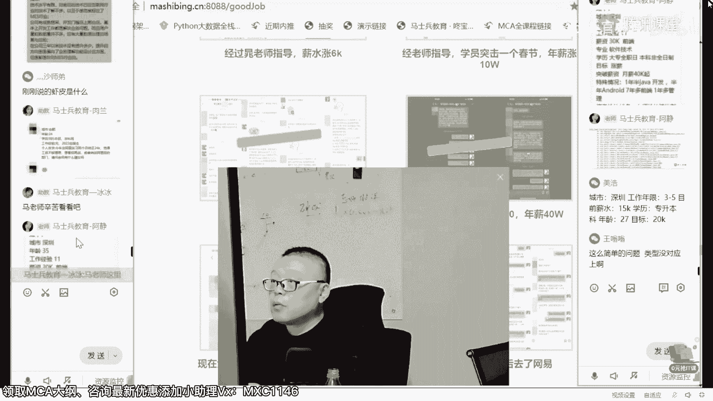

25岁的男生，大专生10k武汉这个挺典型的呃，3年提高薪资，提薪的话呢比较简单啊，嗯像你这种的保守说最保守最保守的，明年34月份16k以上，不知道能不能接受啊，嗯我看啊技术水平有限，前沿技术了解不多。

被框在了max行业m e s什么什么行业成熟框架哦，我知道了3年以来就是没提成的，偏业务，针对mx听我说啊，呃首先我给你做一个短期规划，呃，短期来说就是提技术，就你只要提技术就提薪了，这个肯定可以。

完全没问题，那提技术主要提哪些个呢，你自己呢也说得非，常的明确了第一个叫做流行的东西，你现在不太了解，spring cloud这条线，spring cloud这条线到网约车项目。

这个就是从传统的c r u d转向互联网的关键的点，这个好多人已经证明了的，然后第二个你用的全是成熟框架，你从来没了解过框架的底层，所以第二个读框架的源码，第三个从长远来看提学历，您把这学历给我提上来。

第四个从长远来看，对你将来的职业发展巨大的好处，然后至于架构的话，慢慢聊不着急，所以很简单很，简单你就可以把薪水提上来啊，猪小屁。

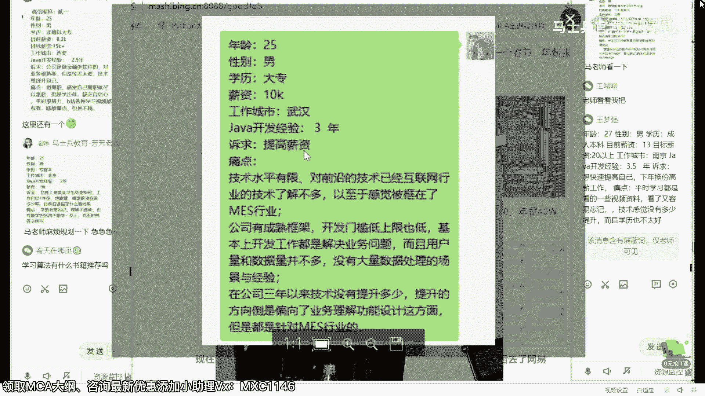

呃你要看书的话，我是真心推荐你看咱们左老师的课程，他讲的可比书讲的好听多了，你自己啃啃算法你就知道了啊，如果说你非要看书啊，第一本书叫java数据结构与算法，这本书相对比较入门级相对浅一些。

但这本书已经停，已经那个呃停板了，所以你可以找到电子书，java数据结构与算法啊，我不写了，这个第二本书就不推荐了，因为第二第二本书太难了，算法导论那本书太难了啊，对于很多专业搞算法的比较难。

所以就放过他，嗯你把这本书搞定呢，像国内的这些个普通的厂子，这个携程了什么马蜂窝了，五八了这一类的搞定没问题啊。

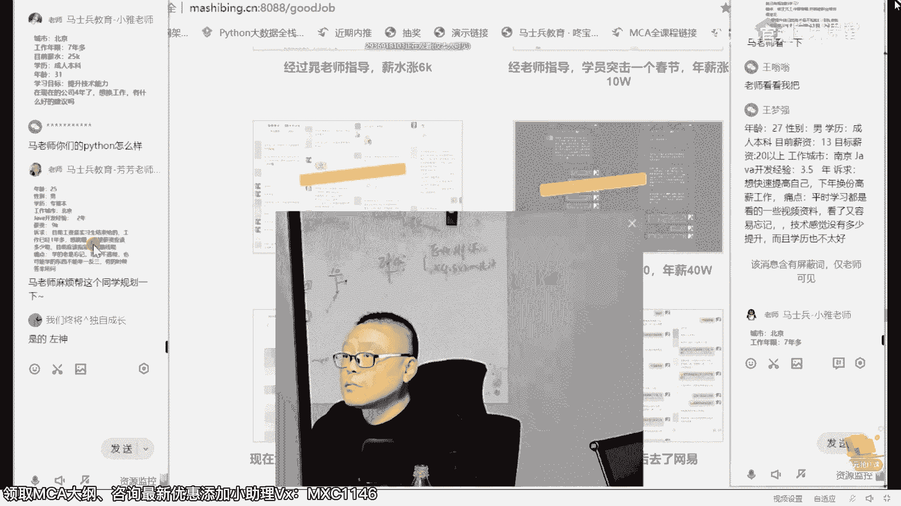

7年都25k成本31 4年想换工作，有什么好的建议，慎重建议很多，首先第一个不许轻易跳，你这一跳呢应该是非常关键的一跳，因为你已经在这个公司4年了，在这公司4年就意味着你对这个公司很坚定的忠贞。

就这个不不频繁跳槽，就算你学历稍微差一些，也会有进大厂的机会，所以你这一跳一定一定要跳好，做好准备，骑驴找马，找到马之后再跳，不要轻易跳，千万不要说别人给你个什么30 35你就跳了，那你就亏死了。

这一跳目标40k以上，补40k以上应该具备的技术，然后目标就是40k以上，概率很高，上次有同学跳槽，原来拿12k，别人给了15k就跳了，我也是快疯了，我基本上直接建议涨幅不超过50%的就不要跳了。

意义不大，对你职业生涯是个伤害。

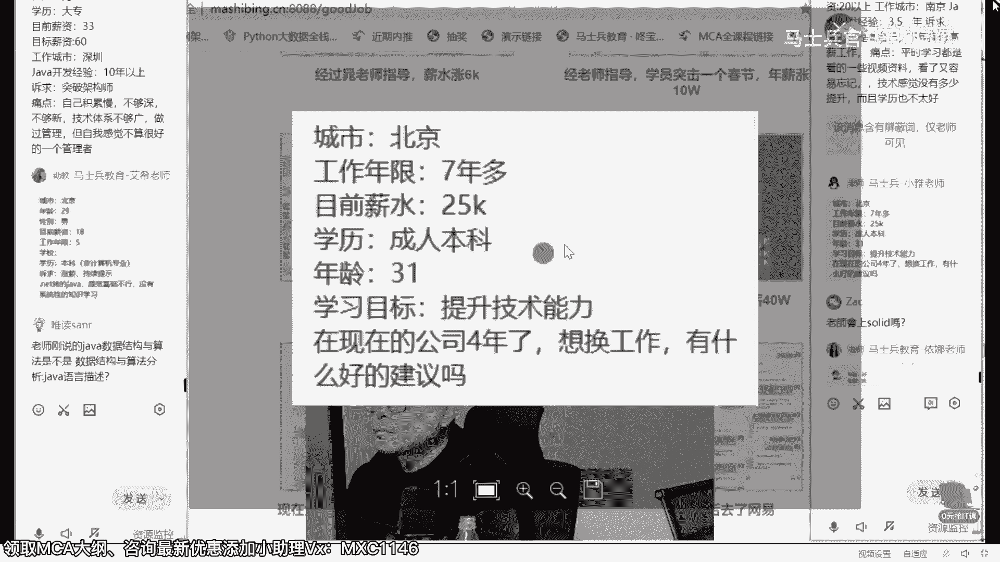

java数据结构与算法是不是数据结构与算法分析，java描述不是就是java数据结构与算法就叫这名。

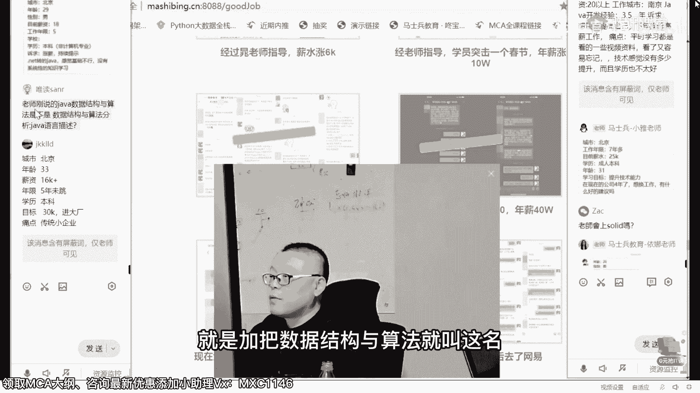

但是那本书比较老，但是它比较浅显容易懂呃，只有只有电子版的，你搜一下应该能找着啊，这个意思，网校202 17k税后15，只是会用底层，那就补底层，这个没什么可说的，哎哟这么正式工冷眼相看，哈哈大哥。

你这个别太脆弱。

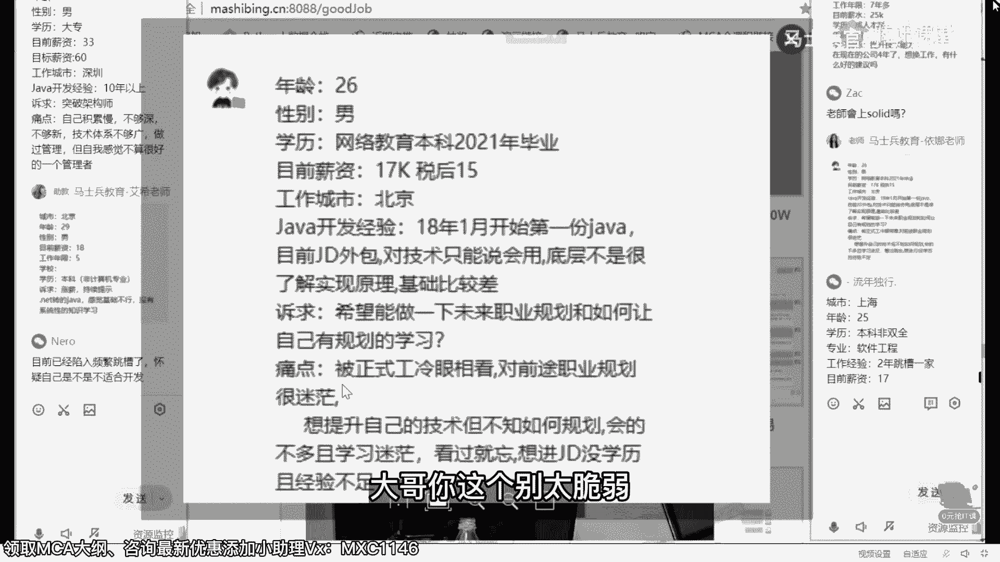

然后呢也不要太敏感，别人看你的这种眼眼神也好。

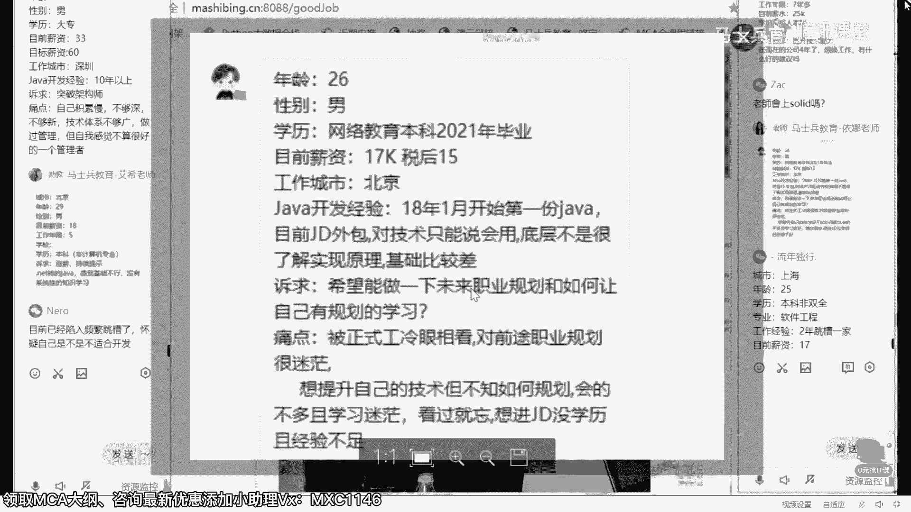

你不要太往心里去，首先建立起来强大的心理，我已经说过这个问题了，不要那个什么，再一个呢，我认为啊你作为这个学历来说，17k的话也还凑合，也还可以，所以你下一步的该怎么办呢。

呃我斗胆在你不了解你特别细节的情况下稍作规划好不好。

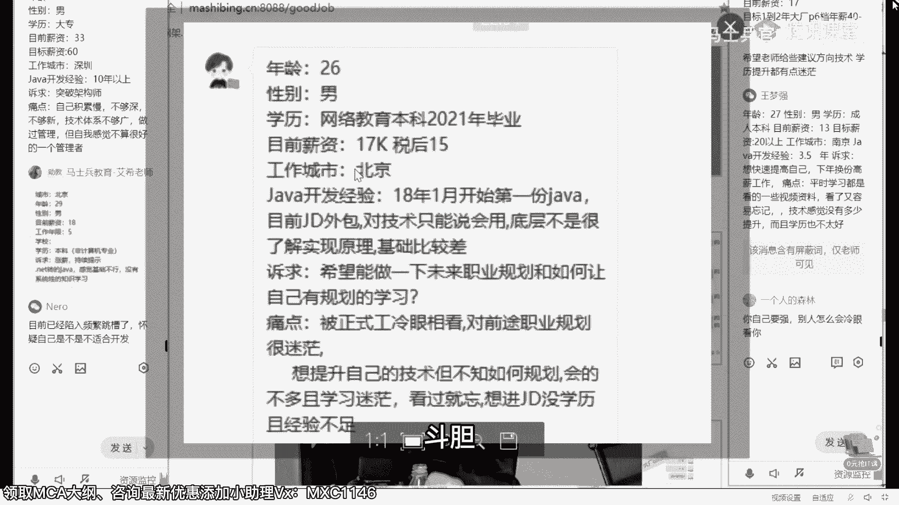

你认真听啊。

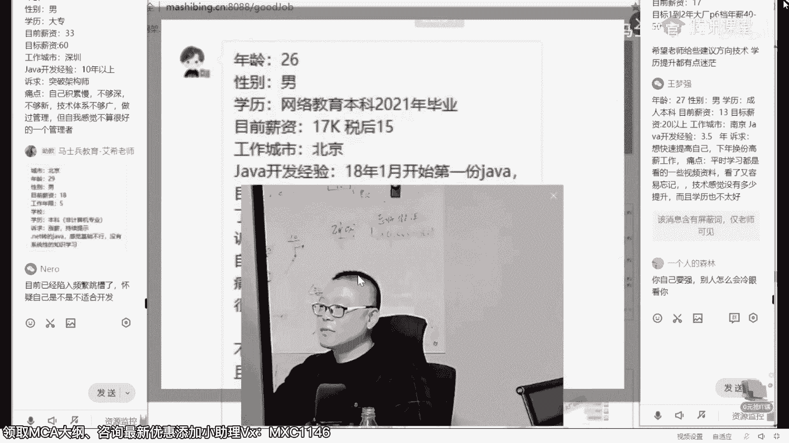

我建，议你的是呃，第一个你拿下这个本科了，为什么每次都会把这个给弄出来，好第一个呢你已经拿下这个本科了，这说明你有本有本科学历了，这是你的第一步，这件事情很容易达到不难，至少涨到25k，这是至少的啊。

呃但这个事情也不难，就是这一步呢本身不是特别难补对应的技术，然后修改好简历，老师帮你做，做好准备，这不是很容易达到的呃，但是比较难达到的是，下一步就是你让自己尽量拿一个高薪水，25k是，起步价啊。

28k30 ，这是你的目标价，然后呢，在你下一步里边儿一定要待一段足够长的时间啊，大概要2~3年左右，认认真真地让自己的技术变得硬硬气起来，绝对不能够比那个本科生差，而且还要比本科生更强。

好在这种前提之下，你大概在29岁30左右的时候进到大厂呃，我跟大家说，我们陈老师进进到阿里的时候，大概是28岁，29岁来着，就是在这个年龄进去的呃，时间稍微长一点，你想直接进这件事情，概率比。

较低不是很容易，薪资还不算太高的情况下，应该有机会进到京东的那个那个本本部的吧。

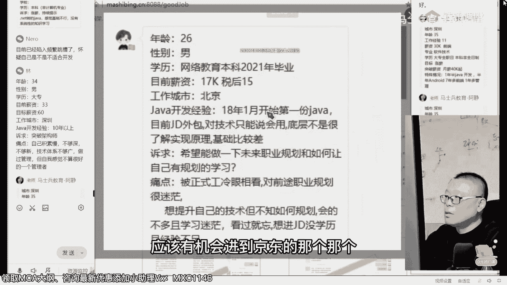

就看你能不能表现了吗，你技术表现的比较牛逼，然后呃为人处事嗯又又会来事儿啊，这个晋升嘛就相对来说容易很多，其实我说到这儿啊，各位想做晋升的小伙伴呃，嗯同学们一定不要放弃对于非技术的非技术的这个追求啊。

什么意思呢，就是有好多人我们俗称叫会来事儿好，那这个时候呢他所他所面临的机会要比你这种不会来事儿的，到处都，是棱角的，升了吧唧的，这样的人，他的机会要多得多，这点大家大家同意吗，同意同学给老师扣个一。

还还有吗，还活着呢吗，没问题吧，你们想老师推荐你们几本那个教大家怎么为人处事的书，比较初级的那种好不好，第一呃，叫我不是教你炸，就是不要把自己看得特别低，也不要把自己看得特别高，不要把别人砍成敌人。

但是也不要把它当成那种完完全全的掏心窝子的嗯，所有人都可以掏心窝子的那种啊，那种傻傻的空也不行，但它是一种感觉，最关键的要去实践，你要认识到和别人打交道这件事情和技术同等重要，当你认识到这一点的时候。

你的晋升之路就打开了，说这个说的有点那什么了啊，嗯，对这个会来事儿怎么定义呢，这个确实不太好定义，你也不要刻意的去追求，说那个我就得让所有人都喜欢，我也不是这样的，他有些这方面也是有天赋的。

有些人是有这方面天赋的啊，有些人呢他天生就不太适合去搞和人际关系相关的工作，但是我认为呢你至少应该和人能够和谐相处，所谓的会来事儿，在私企里面就是我能够专注自己，做好自己的事情。

同时不跟其他不给其他人带来呃负面的这种这种这种印象好吧，积极合作不带来负面印象嗯，普通985在读非计算机专业，想转码可能性大吗，呃你需要我预计啊，你如果想转一份普通的工作，就是只是想在计算机系。

计算机这个行业里面转过来之后，拿一个普通的工作半年足矣，老师一定能让你转过来呃但是呢你如果想起点要比较高，你要给老师1年的时间，这个才才够听懂了吧，首先要补计算机的基础。

然后还要补相关的呃各种的项目点啊，然后再做好简历，这样才可以。

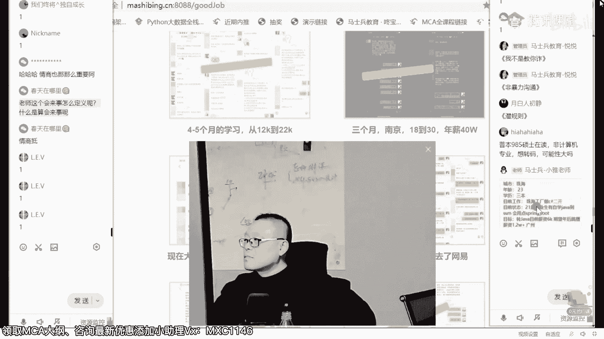

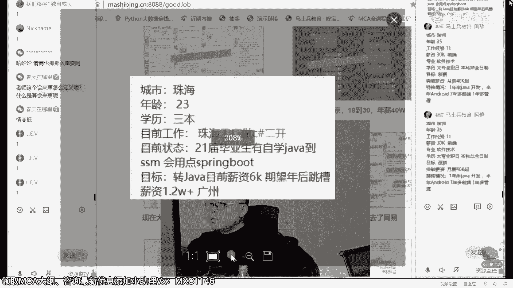

珠海西山马尔开二一届转闸了，目前薪资6k一点2万，广州呃小case啊，如果这个这个到不了，老师也是可以退钱的，呃你这个比较简单，而且也比较到位，你赶紧转c sharp这玩意儿没前途的。

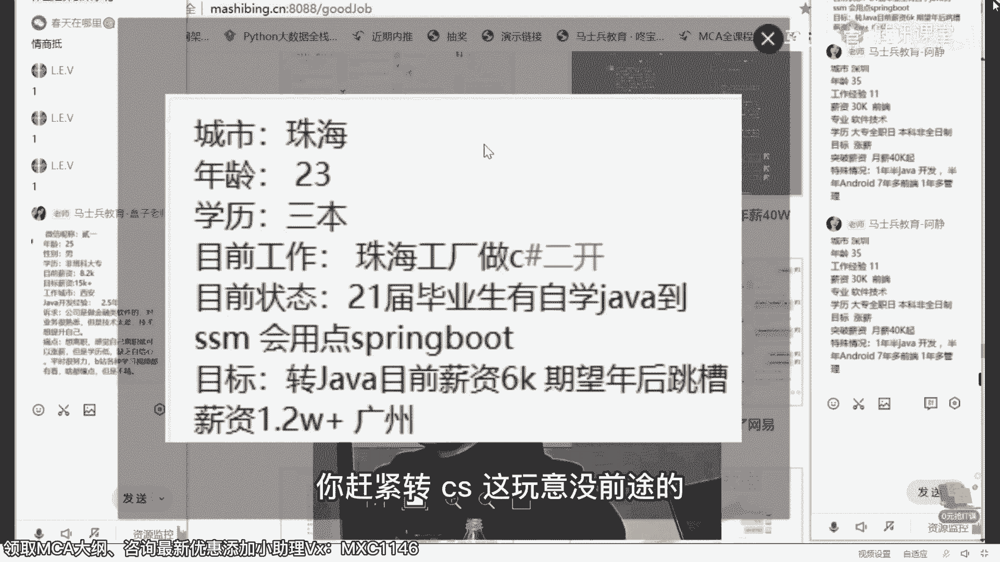

为什么说他没前途，我不知道大家了不了解，我说了，c shop这玩意儿没前途，原因是什么呃。

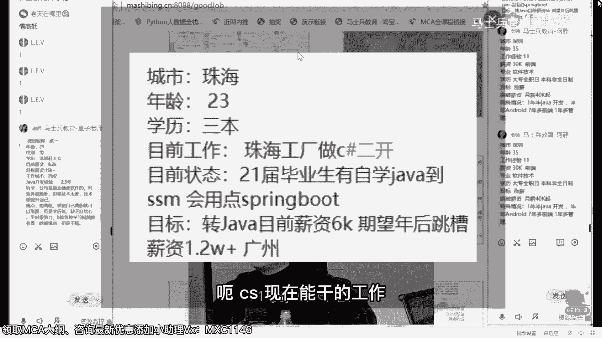

c s p现在能干的工作，我给大家分析一下，第一个呢是做点net，点net本身是工作在微软平台，微软平台目前在服务器领域1%都不到，很小众，c shop能干什么，c shop能干游戏的脚本语言。

比如说你做unity 3 d的，你做，cocs的，你可以考虑用c sharp做脚本，但是你说做游戏做脚本的，你能拿多少钱，很低好，这是第二个，第三个，c上牌能干嘛，工控的上位机，公共的上位机。

但这个领域想拿很好的薪资，也很也很少换，所以我跟你说。

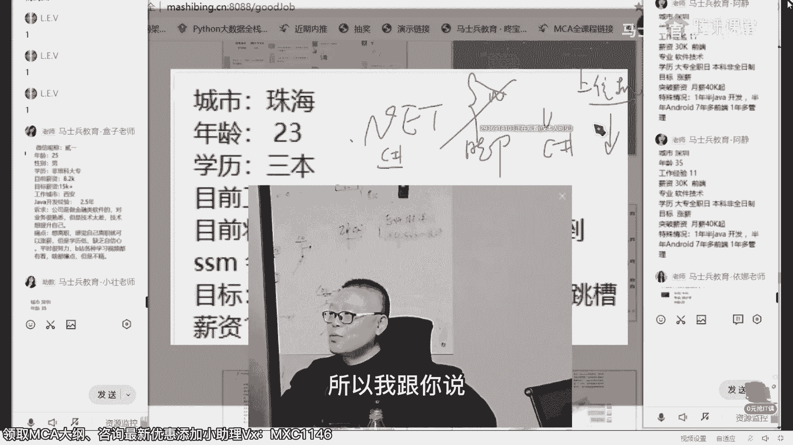

转过来是美是是是正正确的啊，而且必须赶紧转，你还年轻啊，你要是年龄大的，搞cp的，想转的话都费劲了。

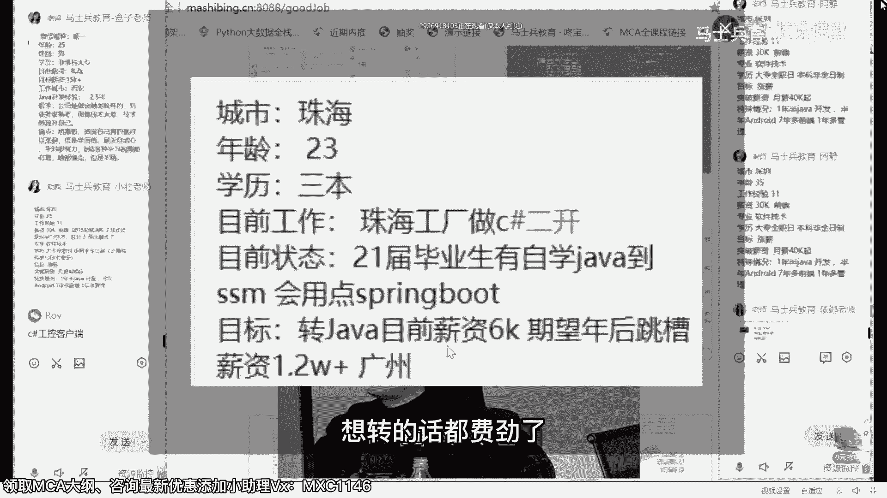

12000，在广州的话问题不太大啊，c sharp攻控上位机，对公共客户端没错，合肥九八。

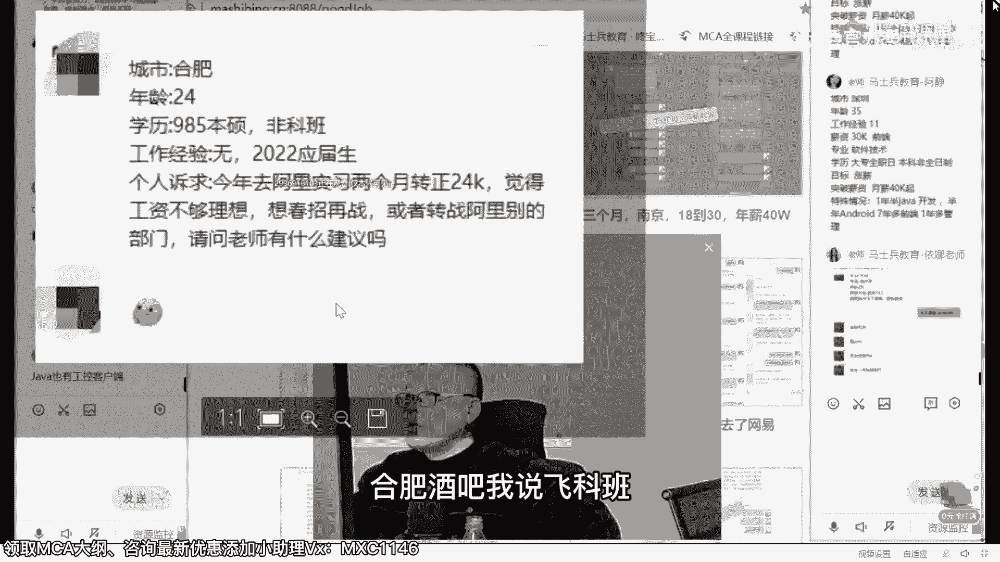

我说非科班，2022，春招再战转账，阿里别的部门和老师这么建议，诶，你这个有点意思啊哈哈那个。

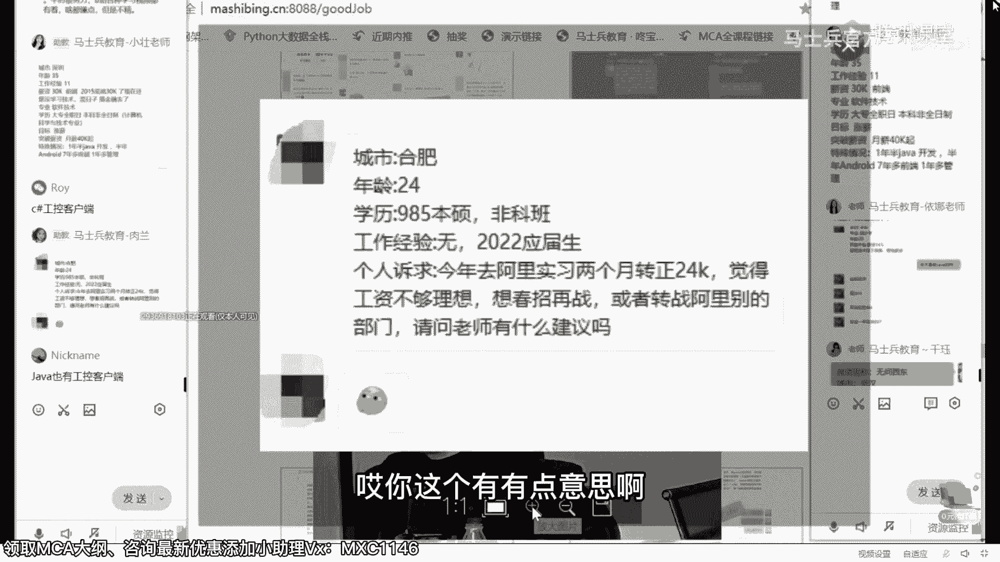

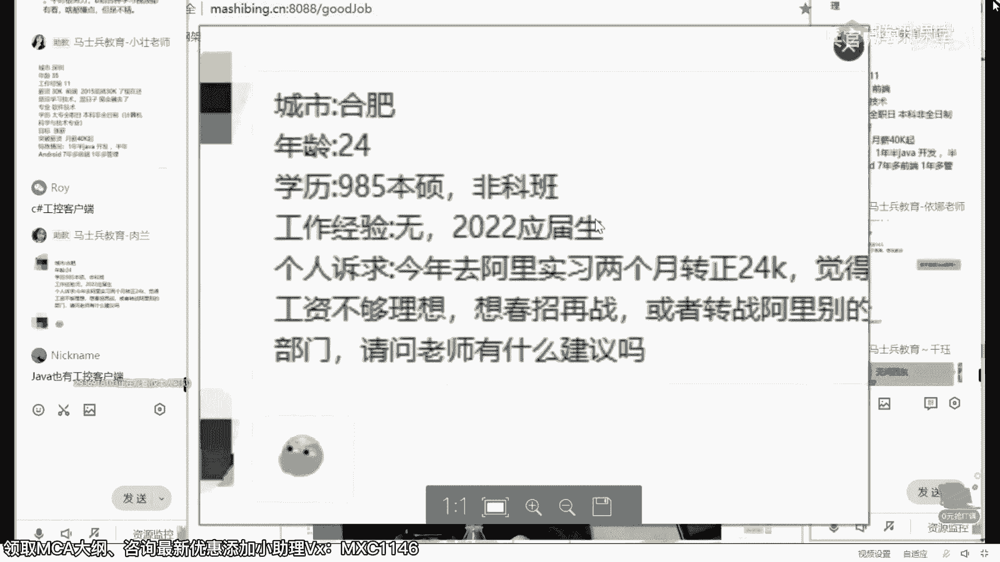

呃你这属于呃别人使劲儿进不去是吧。

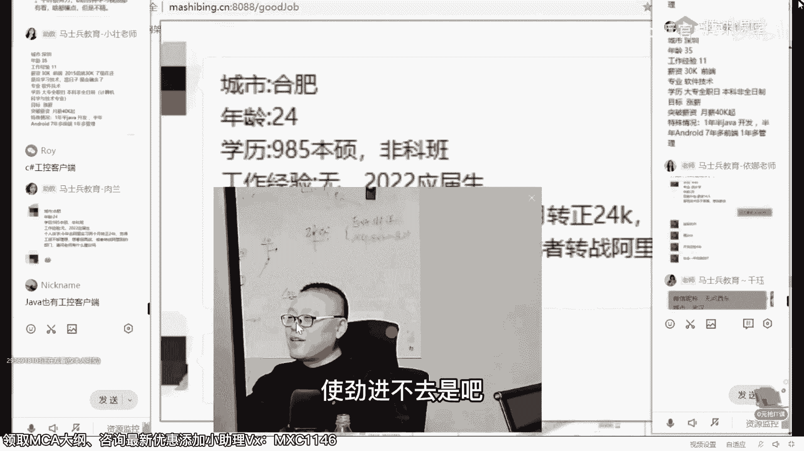

你这在这凡尔凡尔赛啊，觉得薪资还稍微低一点，呃其实作为2022届的应届生，明年才毕业，然后今年就已经拿到24，在合肥大哥，我认为可以了哈哈。

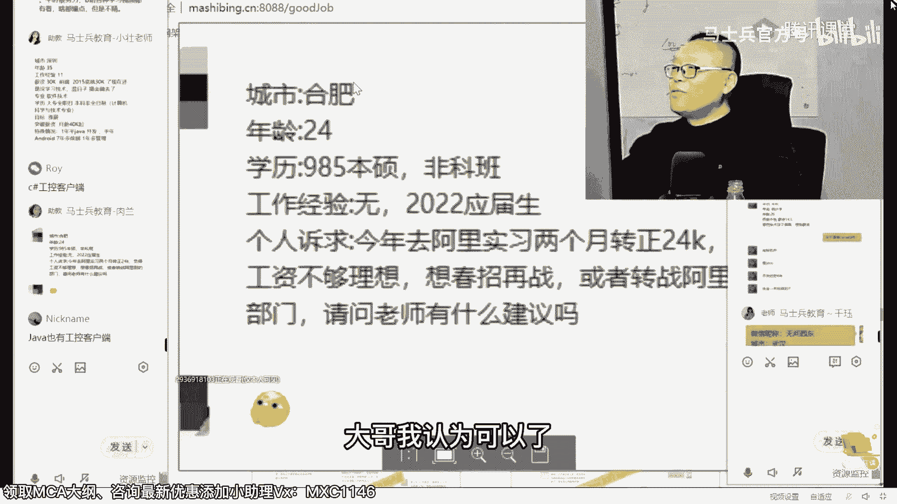

呃你是想秀一秀。

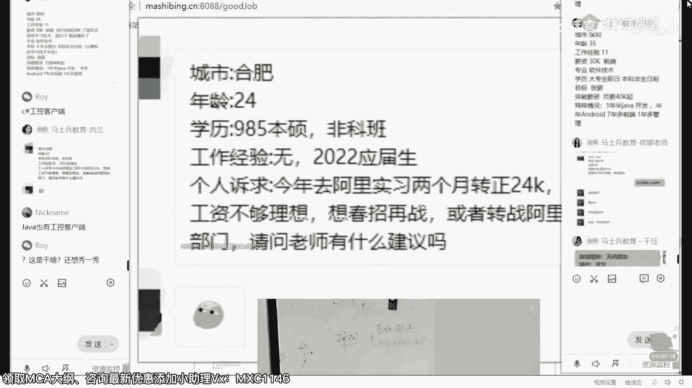

是不是哈哈听我说啊，如果你想寻求更好的薪资，寻求大厂里面的ssp，首先第一点呢你已经转正了，你如果再跳到别的地方就叫跳槽。

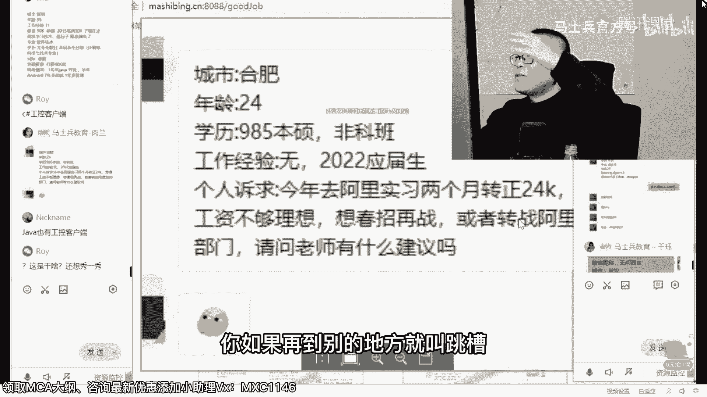

当然你想在内部阿里就想转岗，我个人认为你别动了。

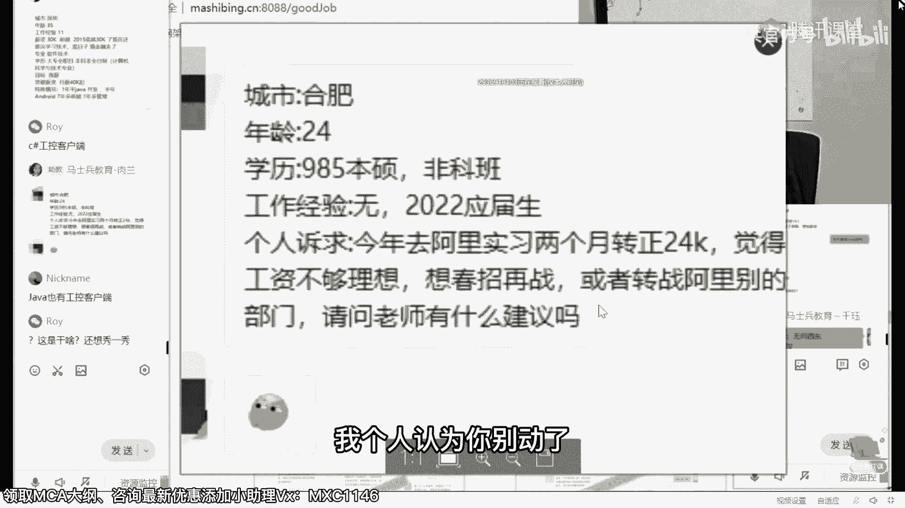

因为什么呢，你就给人一种特别不踏实的感觉，娘的我，我这个部门刚收，把你收进来，然后呢还屁股还没捂热呢，你现在就想走，你别这样呃，同时呢我也告诉你薪资这件事情，你的第一份薪资绝对不是你致富的根本。

我再说一遍，无论你毕业拿多少薪资，你毕业就算拿5万，这个你这辈子也不可不可能靠你第一份薪资来支付，能听进去吗，呃我我跟你说，他也是24岁毕的业，也是念完的呃，他是念完的本科啊，也是念他念完的本科。

你说他第一份薪资有多高，估计也就跟你差不了太多，但是不阻挡他几年之后拿到上百万，这样的年薪不足，等他几年之后在一个不错的企业里头拿到这种股票的期权，所以不要太看重这一点。

不要太看重这种这么短期的几千块钱的涨幅啊，给你涨到3万，你又能多多少钱，你应该真正看重的是你这种感觉是你给人家扎扎实实的，感觉你不知道我给你看的那个简历的那个那个小伙有多扎实。

他给人的感觉就是踏实交给他，你就特别放心，你给别人这种感觉的时候，但是你给别人很机灵，很精明啊，一有好的机会我就要跳这样的感觉，你就错失了更大的人生机会。

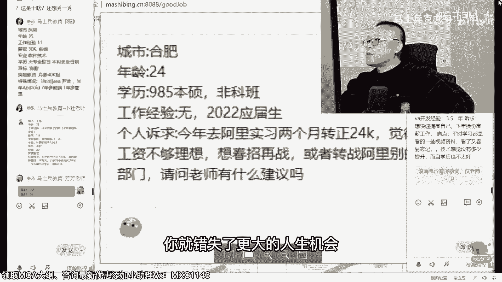

所以我建议你别动了好不好，不知道这种年轻人能不能听得进去。

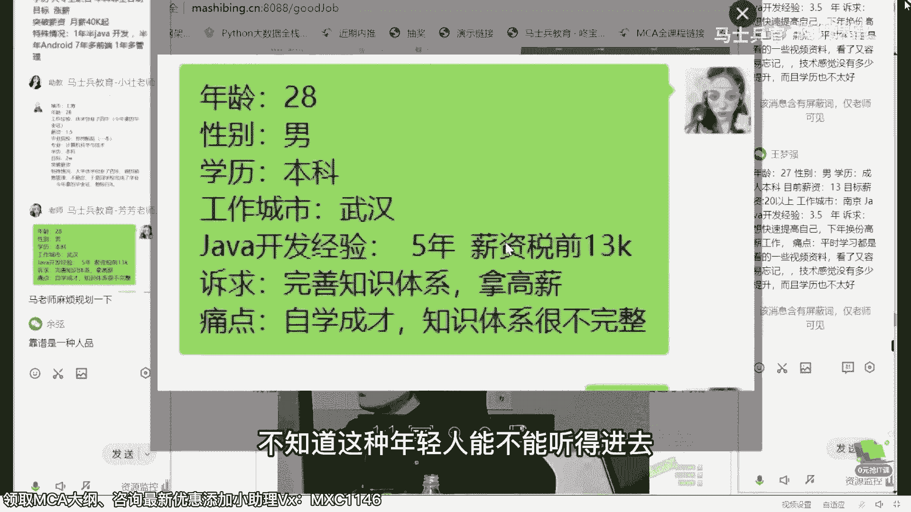

这个其实这种话吧，有时候我想我要是这么年轻，我可能连听都听听，听不太进去，你们能听进去吗，能听进去的，扣波一我也没白说。

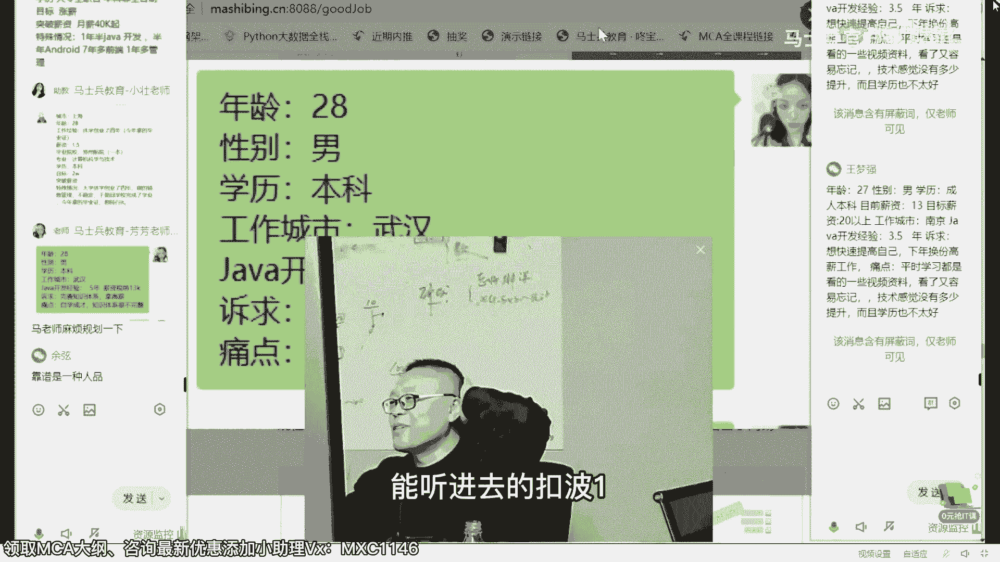

滚雪球我能听进去，滚雪球你多大了就好多小年轻是听不进去的，知道吧，男的本科武汉5年13拿高薪，你这个简单啊，那个在武汉来说非常保守的，明年34月份拿到18吧，好不好，这就是特别保守的了。

就是可以达不到给你退钱的那种保守了好不好，嗯就是你的不成体系嘛，呃跟老师这是最容易的，就是行政体系知识体系。

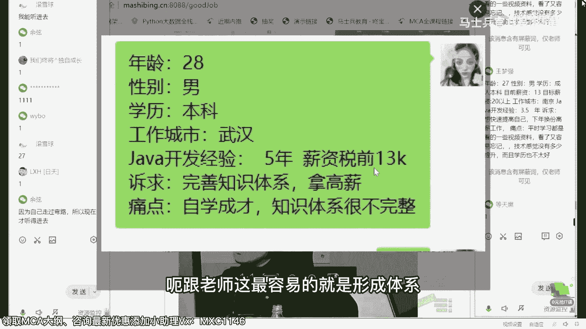

这也是我们教课的一个目标啊，只要你形成体系，剩下的细节不就是钻的事儿吗，是因为他先形成了体系，为什么有人效率低。

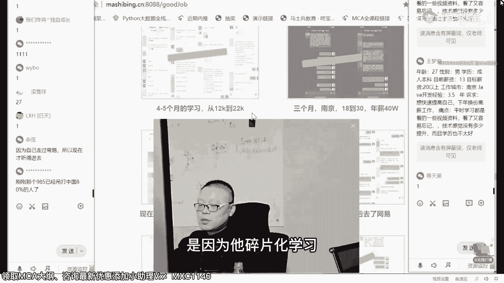

哎呀不聊了。

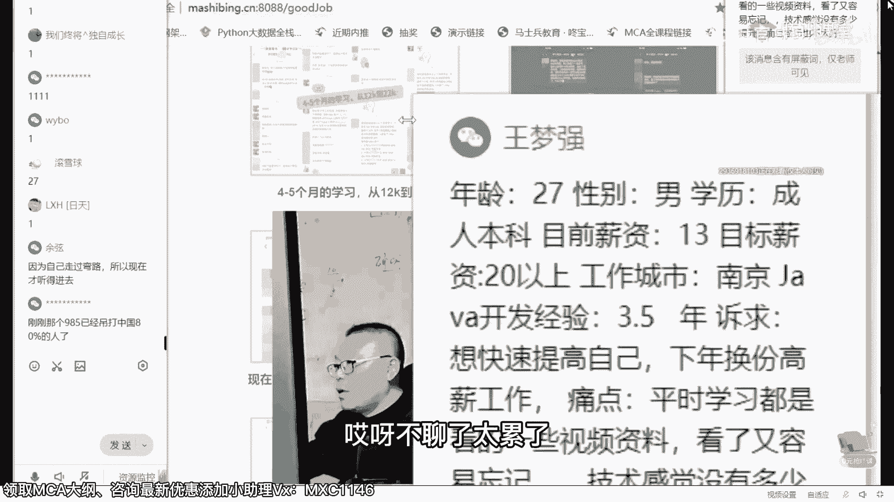

太累了，明天再聊吧，明年双11，那老师也是要参加活动的，没料到的可以明天聊好不好，当然想跟细节都聊的话呢，报个名改变你的这辈子的机会啊，就在老师这儿，薪资13目标薪资20java嗯，南京4。

5成本高新视频资料容易忘嗯。

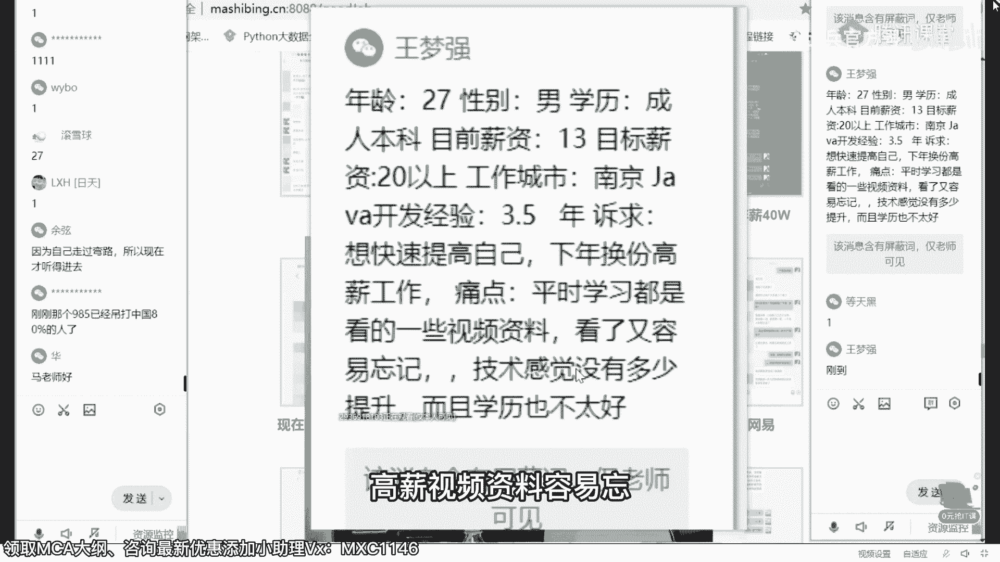

这不难啊，但是你能不能到20，把握性不太高，18如果你要接受18，这个把握基本上90%以上，因为你南京的话，上二师好像是个坎儿，我要没记错的话，18的话，那就基本给你补补技术，你就到了都不用太费劲。

好了，同学们咱们就到这里吧，好不好，今儿聊得也够多了，也够累了，有同学教我啊，嗯咱们see you tomorrow，咱们直播间的话每天都有直播，明天的双11的活动，我也在直播间嗯，但是还是那句话啊。

今天晚上的11个名额嗯，直接参与我们双11的活动，另外呢双11的抽奖，双11过后呢，像这种一块钱1年的这种这种活动，我们就不打算再提供了，好吧嗯，请大家抓住1年之中最好的活动的机会。

而且这个活动保价一整年，放心啊，在你今年双11到明年双11之前，你觉得你买贵了贵多少，十倍赔付，参与抽奖啊，南京去年毕业14000还可以吧，可，以我觉得可以，刚刚毕业14000吗，14k没问题。

然后听累了对啊，我说的也都已经很累了，听都听累了，说的就更累了，明天见，see you tomorrow。

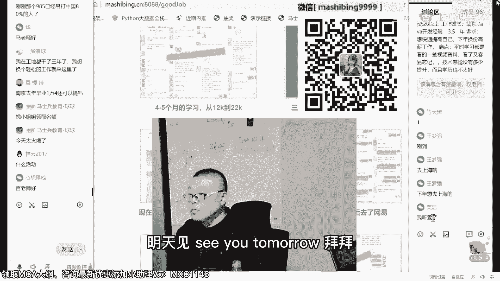

拜拜拜拜，这个我建议你听听曹老师的建议，因为他本身是在大厂工作过好长时间呢，嗯你这个的话呢其实短板就在学历上，关于这个学历怎么样杀进大厂，我在直播间讲的非常清楚，呃恐怕呢，你现在还相当于小白。

这个目标的话，我个人认为啊，你定的呢实际上是有挑战，这个难度是相对来说有挑战的，那么前3年的道路，我在直播间已经讲得非常清楚了，那个尽量优先找一份薪资更好的一份薪水，这是第一步，然后呢待1年左右。

第二步呢提到我们进大厂之前的一个薪资，这个时候呢需要你可能要待个22~3年，这个阶段比较难熬，它是需要你长时间的一个毅力，然后进大厂的概率就高很多了呃，杀进大厂之后是另外的规划呃。

那个的时候你的这个目标，百万年薪的目标，才能够开展，所以一步一步来，先不要考虑那么远，你的详细简历，哪个学校的什么背景，s sm框架肯定是不够的。

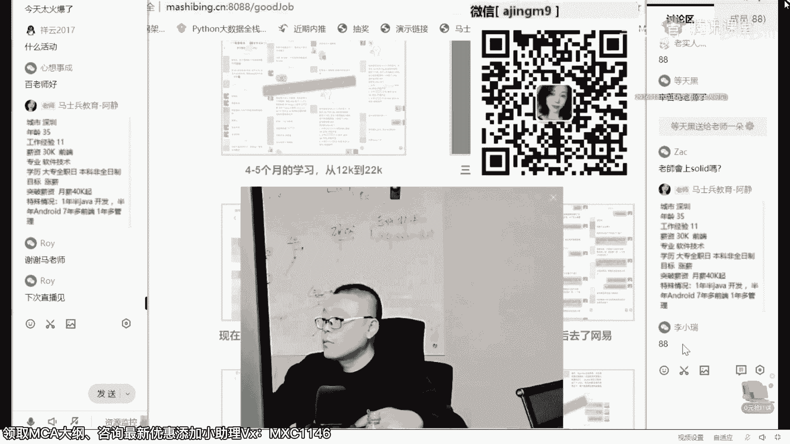

大连腾讯子公司世纪鲲鹏，这算大厂吗，我觉得在大连可能可以算啊，大厂嘛就是薪资比较高嘛。

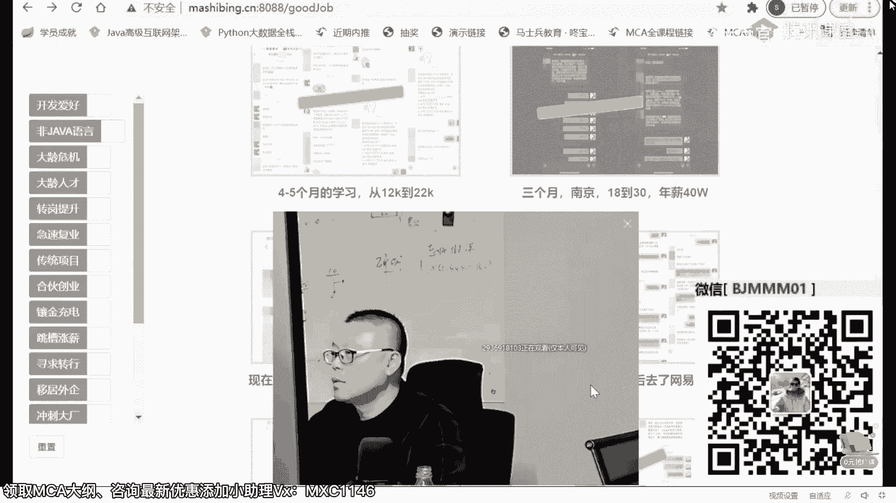

得给到很好的薪资才算大厂啊。

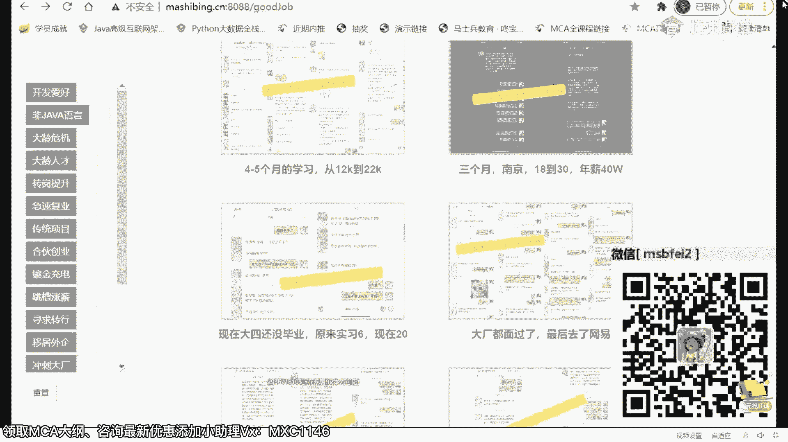