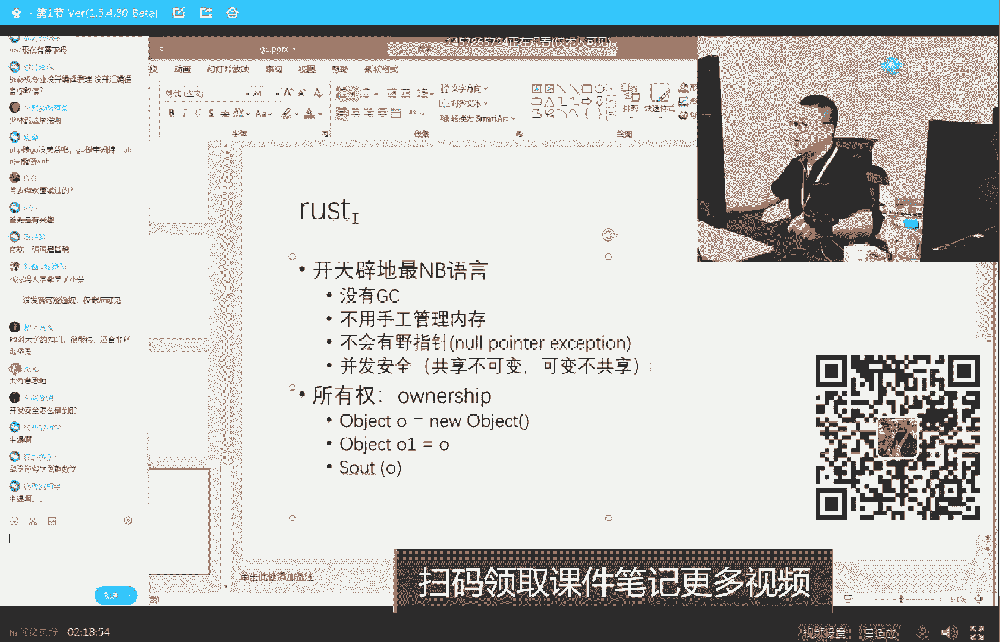

# 白嫖到马士兵教育价值23980的MCA架构师课程一次让你学够！ - P12：马士兵老师JVM调优：12.用jps定位虚拟机进程 - Java视频学堂 - BV1Hy4y1t7Bo

那怎么办啊，我们的真实内存物理内存这时候怎么办呢，它会把这个虚拟空间分成一页一页的，就是一个小单元，一个小单元，一个小单元的好，我需要用到这块儿，这个虚拟空间或者这个进程的哪一块儿。

我就把它放到我的物理内存里，我不需要的时候我就不放，所以在他真真正正的执行的过程之中，是有好多好多的小块儿装到我们物理内存中的地址，可以同时装好多不同的程序的小块儿。

这个叫做虚拟空间到真实物理空间的映射，雪儿走了好多是吧，慢走不送，是我讲太难了吗，这不只能讲女的了，虚拟内存谁来充当，虚拟内存是虚的，所以没有谁来充当，操作系统的基本课，因为我不知道有多少人啊。

你们是非计算机专业的有吗，就非专业的有吗，现在找工作要求越来越专业了，设计等级专业考到基础理论的时候，你基本全完蛋，所以我们为什么说要给大家讲这些内容呢，就是我们大概总结出来。

如果你想短时间内跟计算机专业一模一样，好，在这个时候是怎么办呢，只要你学两门课就可以，周老师讲的还有两个就可以搞定了，你就跟计算机系的理论方面没有半毛钱区别，这是呃如果你你想跟全面性的没有任何区别。

加一个算法全部搞定，其他的像什么微机原理啊，逻辑电路，数字电路这些你全部用学，就这是老师存在的价值，你知道吧，我就是你你你你你不需要去操心，我该学啥学啥，我我我这个这个程度应该学什么。

我怎么分辨这个东西该学不该学，投入多少精力，这东西交给老师，老师告诉你学这个你就学这个，告诉你学那个学那个搞定啊，好不说了啊，来看这里，其实总而言之，go语言里面的这个内存模型完全模拟了这种算法。

这种算法特别好玩，就是go语言呢也是一个大的非常大块的一个虚拟空间，在这个虚拟空间里面，把自己的每个对象，或者说每个数据结构分成一个一个一个一个的小块儿，然后注意还这就还是那句话，这是虚拟的，虚拟的。

自然而然的操作系统管理的时候，就会把它一小块一小块一小块放到真实内存里面，你都不用去管那个真实内存的那个那个那个怎么怎么分配，这个过程你不用管，这里面会产生一些小小的浪费，你比如说这个对象只占了3/4。

但我并没有把两块全占全，没有关系，稍微有一点点浪费，很正常，但是像这种东西，有同学可能就会说了，说老师我怎么去回收它，回收它呢，只需要单单独做一个，你可以认为是一张表，这张表里面记录着哪块。

哪块已经是被扫描过，被回收了，大体的算法就是这样的，细节里面有特别多，因为这里面呢是一个big map，这样讲的话就真没完了，所以它的算法和共和那个java语言的算法叫做完全不同不一样。

同样的物理空间怎么可以写不同东西，不是我，我哪句话告诉你，不同的块会装在同一个物理空间啊，大哥就一个马桶，你坐俩人是吗，我什么时候会告诉你，这个我没有啊，我没告诉你这一点啊，虚拟的装到物理的时候。

他在做这个马桶，你你再来一块儿的时候，你做另外一个马桶就行了，听懂了吧，好所以go语言里面它的这个内存模型的参考是参考了os的虚拟内存，然后有同学会说，老师他这种算法比比单位语言算法好吗。

其实到目前为止，他的表现并不比java的强多少，它的算法上的优点在于不用挪对象，这点是和java完全不同的，java，大家知道吗，一个对象会挪来挪去，你发现没有一个对象年轻代ok不行了。

会复制到老年代复制过来，它会挪过来，但是如果是虚拟空间，你只用在虚拟空间标，他说不行了，这个没有了，我们不用去管它了，好那么在真正映射到物理内存的时候，他发现这块空间不需要往里放了，那就直接废了。

直接就废掉了，我甚至不需要动，你知道吗，装到物理空间之后，我我我我不需要动，所以它不需要挪动对象，这是它的优点，这块要是你没听懂，我只能说明你基础不够，没听懂就没听懂啊，java虚拟机不是虚拟空间吗。

不是老婆饼，不是老婆，这个虚拟机也不是虚拟空间，嗯，又是马桶，因为我姓马，马桶也姓马，啊你就是想聊会儿小晴天吗，可以聊一小会儿，没关系啊，聊个一分钟，两分钟，我们继续好吧，这块还能还能跟上吗。

能跟上给老师扣，一来直接跳跳和华为哪个前景好，诶你说到这儿特别好玩啊，我刚才有同学问我，字节跳动和华为哪个哪个前景好，我今天刚刚收到我们美国的同学，他们截的一个图，特别好玩啊，我我我给你看一眼。

我看能不能找出找出来啊。

稍等，嗯，啊拖不动。

我得用手机发过来，你们想看吗。

就是那个字节字节跳动，在美国给给美国员工的薪水，你们想看吗，想看是吧。

好稍等啊，这个你得耐心等一下，我先把那个图传过来，然后传到电脑上，然后再再给大家看呃，ok我已经传过来了啊。

来看这图，这今天我刚刚在群里看到的啊。

差距好玩儿，反正讲讲讲东西，我们讲点讲点那个那个技术内容是吧。

来聊点八卦。

看一下。

company是那个by dance呃，level是那个三杠二呃，工作年限是工作1年，在在公司里工作1年了，它的整个工作年限应该是7年了，然后他的薪水来自自己看一下，哈哈哈哈，没事。

这仅仅是84万~21年，没没没看这个呢，这个是啥，嗯嗯。

好了好了好了，大家羡慕羡慕就行了啊，年薪当然是年薪啊，人日日薪和时薪有点太过分了啊，技术人员技术人员啊呃，这个呢有一会儿有机会我们聊聊一聊好不好，嗯，呃就是我个人觉得呢你可能达不到不是这种水平。

但是我告诉你，其实自己给的蛮高的，那华为是多高呢，华为其实我也有截图哈哈我得我得我得那个一会儿给你找出来看看，这两个如果说比薪水的话，普通普通人的薪水，因为这个比较特殊，我今天觉得比较好玩，留下来了。

但是这个不代表普通人，作为普通人来说，这两个公司的薪水，我个人认为是华为更早听懂了吗，所以说如果你想你想多挣钱，我个人觉得呢华为应该比那个头条要高，华为的工资，比方说平时给你签签签协议的时候。

给你的工资拿出30万，基本上就是占你总收入的1/3~1/4，有在乘以3x4，基本上是华为的收入啊，不是说头条高吗，嗯了解到的还是华为高，当然他是加班啊，以及你到一定的级别啊，呃分红啊啊等等。

全算上这个就会就会华为更高一些好吧。

呃其实目前国内给新水给的给的比较高的有这么几家，我跟你说一下呃，第一个呢是拼拼夕夕，拼多多，上海应该是给的最高的大厂，然后是头条北京，然后接下来是华为给的比较高呃，然后剩下剩余的是其他的大厂。

阿里那个嗯什么什么什么什么腾讯啊，百度给的相对不是特别高啊，京东给的是最低的，然后再是什么美团呃，每条给的应该比京东还要高一些啊，快手啊等等，这这这这些吧，网易应该排不太上，网应该排不太上啊。

进不了大厂怎么办，没关系啊，好多中小厂给的也并不低，你知道吗，嗯，好了好了好了好了好了，我们还讲讲技术吗，不讲技术我就不讲了，那咱就先瞎聊天一聊这玩意了，你看瓜牛都说了，老师聊聊rust吧。

可以没问题啊。

我们来聊一聊rust，对八八十4万美刀的年薪是吧，哈哈太香了嗯，好聊一聊rust，rust这种牛逼的语言，为什么微软会放弃csf，拥抱rest，为什么呢，你们好好想想看，为什么呢，因为它确实太牛逼了。

开天辟地，吹牛逼逼好吧，牛逼在什么地方，看这里，没有dc，不用，手工管理内存，不会有野指针，就是我们著名的这种now pointer exception，这种特别难以调试的错误，放心不会有这玩意儿。

并发安全，因为它的核心思想叫做共享不可变可变的东西啊，好玩吗，悬垂指针对野指针或者悬垂指针的说的都是一回事儿啊，嗯巴斯美刀在美国也很高，那不废话吗，嗯java会被rush干掉，毛不会嗯。

学rust需要有go基础吗，不用rust学习学比较高，但是今天我们聊dc，我们就聊dc好吧，我想跟大家聊一聊呢，居然有一种语言，它没有dc。

还不用手工管理内存，也就是说我没有来进回收器，你懂吗。

我不用你来进回收器啊，爸爸妈妈，爷爷奶奶，你们不用进来，但而且我只管扔，understand我，我不管回收，就这么牛逼，就是这么的牛逼好，他是怎么做到的，你们想知道吗，想知道给老师扣一一分钟。

给你解释清楚，好听我说这里面最核心的概念，最核心最核心的叫做所有权，都有哪些。

如果你要自己看书这块你没有个三五天，你应该是拿不下来，所有权概念什么概念，给你举个最简单例子，大家看这里，他说object o等于new一个object，我们说它指向一个对象，内存中是什么概念。

就是一个小o指向一个大o的对象，假如说我们有o一等于o，那也就是说o一也指向这个对象，看到了吗，对不对啊，两句话我呃还是敲一下吧。

我觉得有时候我觉得简单，你们未必觉得简单，我给你敲一下啊，然后我们这么写，object o等于new object，接下来呃，public o一等于o，然后sm把这个o打印出来。

这三句话能看懂吗，我们是用java语言来模拟的。

就是另外一个能看懂对吧，呃可以继续的给老师扣个一，不要告诉我这三句话不懂，我在反馈，好听我说我们我们分析内存，内存是什么情况，内存中一定是这种情况，我new了一个对象，有一个小o指向它。

同时我o一等于o，那我o一也指向它，所以现在有两个对象，这两个这两个引用指向它，好听，我说下面这句话打印，偶记住这玩意儿在rust里面报错，这是它最核心的点报错，老师能赶紧讲dc吗，不能我想讲啥讲啥。

这也是gc，你知道吗，你好好想想这件事，一个牛逼的语言，没有jc都能干到gc能干的事儿，你还不觉得他牛逼吗，注意这地儿报错，这地儿为什么会报错，因为这里会发生一个所有权转移，什么意思呢。

就是刚刚开始这个小o拥有这个对象的所有权，说这哥们儿是我的这个风筝，我牵了根线，当有另外一根线指向这个对象的时候，前面那根线没了，就没了，只有同在同一时刻，只有一个一根线指向这个对象。

那有同学可能会说了，老师跟jc有关系吗，那这根线没了之后，他就应该回收啊，没错，那么大家你想想看，作为这种这种变量来说，如果你熟悉电源里哈哈熟悉程序的运行机制，它在运行的期间一定是放在某个战争里。

放在某个方法的局部变量里，那这个变量这个方法只要一结束，这哥们儿一定就是垃圾，10000%是垃圾，能体会到了吗，当然这里面有我刚才又说了两个名词，一个是编译原理，一个是这个这个程序运行的机制，嗯好的。

在这种时候，只要是我能够决定唯一唯一的时刻只有一个，那这哥们儿，我这个局变量一旦没了，这哥们儿一定变成垃圾了，那现在问题是我怎么释放它呢。

这个释放的就在于你们想想看，来告诉我在一个方法内部，什么时候这个局部变量会消失，告诉我，随县城跟县城有半毛钱关系吗，跟县城没关系，这是方法，对方法执行完就消失了，那我作为编译器来说。

作为compiler来说，我是不是可以干这样一件事，我这方法一旦执行结束，我这里的局部变量指向的所有的对象全给他回收掉，我加代码在里面就可以了，delete掉搞定。

所以rac语言牛逼最牛逼的点在于它的编译器比较牛逼，compiler知道我们为什么要讲编译原理了吧，我们编译原理课是能够让你自己写一个编译器来编译java的语言，编译成class文件。

delete牛逼分配是不是被催了，为什么被催，有什么悲催的，有同学刚才不是问我吗，说rust会不会干掉闸了，会不会干掉go，你放心，这哥们儿干不掉他俩，但是他会干掉c c加加，所以以后这个语言记住了。

是目前为止最悲催的语言，悲催之一是c加加，悲催之二叫p h p p h p被够干掉了，不少c加加被好多语言都在干掉他t8 讲边原理对谁来讲，编译原理，我们著名的江畔江老师，编译原理呢是一个超级难的课程。

我个人认为呢一般面试都很少，都很少玩，只是作为兴趣好吧，作为兴趣就可以了啊，反正老师这儿的课你放心，别的人不讲的东西，这全有了，枯燥无味，对是挺枯燥的，但是真正也挺好玩儿的，微软好像回文是吧，哈哈哈。

ok，他还在直回头我再介绍他好吗，我觉得很有意思，对其实真正对技术感兴趣的人，都会觉得这个东西有意思，好了我大概这个月开始讲rust。

我讲我会把rust的最主要的特点讲给大家听。

就是为什么不用这个为什么是什么叫共共享不可变，什么叫可变不共享，什么叫它的treat，它是怎么来达到高并发的，就天然支持那个高并发，他的他的注意啊。

rise的语言的运行效率牛逼死了，他是大概跟c跟c加加跟汇编，注意它的运行效率跟cc加加跟汇编是一个层级，听懂了吗，这玩意儿记住了，这哥们儿能写嵌入式好吧。

嗯实时的你像你go语言也好。

呃java语言也好，你不可能写实时系统，你说我一导弹控制系统，我不可能用那个java来写，那是绝对不行的，你延十个，别说你s w那个那个十个毫秒延迟一个毫秒，那都不能接受，但rust没关系。

rust的运行效率跟最底层，所以它优先干掉的是那些原来写系统的语言，rose现在好找工作吗，rose工作还没有开展，这个有点超前，这其实是有点超前，rust学习曲线比较高，有点超前啊，我跟你说。

现在的需求可能并不是特别高，但我个人觉得作为我的学校来说，我愿意你们站在整个技术的最前沿啊，阿里开始对大厂早就开始做研究了，好吧。

有的时候呢也许我们能够站在风口等风来，那是最好的事情，呃自己的腾讯有的叫rust，需要cc加加基础啊，这是他们一个想象吧，对其实你了解了c和c加加之后呢，你你学rust呢，那就相对简单很多了啊。

听老师讲，感觉russ必火，我也觉得是，但rush语法有点别扭，它和我们平时接触的语法完完全全的不太一样，但这东西呢你不用着急，因为语法这东西它再复杂，豆芽子长一梵高，他也是个菜，你吃熟了它该从哪头吃。

从哪头吃。

嗯这没有关系啊。

好了不说了，今天讲dc呢讲了很多那个理论性的东西啊，我我现在我现在已经是快十点钟了，你们听再听个理论还能还能听得懂吗，在听的歌难一点的理论还能听得懂吗，老师有没russ demo，看一下。

我刚刚装了新机器，我那另外一台机器还真有russ demo，因为我要讲这个肯定是有russ demo的。

再来一个是吗，再来一个再来最后一个好吧，我再来一个啊，我还回到刚才的这个的内容上来，就是我们刚才分析过说呃，在我们并发的执行垃圾回收的过程之中，并发的并发回收还是有并发回收。

什么样子并发回收执行的过程之中就是非常麻烦的，有一点会坐标坐标的意思是在我标注的过程之中，有一个原本是垃圾的对象，又变成不是垃圾了，好这个时候会产生有可能会被被我错误的干掉，大家听我说。

在java的cms和g one语言里面，和g one的这个垃圾回收器里面都是一样的，就是著名的你们应该见到过的叫三色标记，只不过cms解决三次标题问题，用的是叫做incremental update。

而g one呢用的叫s a t b叫snapshot at the beginning，好了，同学们，go语言里面就是普通的三个标记，那cdc叫颜色指针，叫color the pointer。

ok这里面也用到了操作系统的虚拟空间的概念，所以z dc和go语言里面的它的这个内存管理上还有有些许的类似，嗯讲完肯定是不可能的，我们来看cm，我刚才说了一个特别重要的话，其实你们可能没注意。

我说cm虽然有巨大的bug，但是它依然是承上启下的这么一个垃圾回收器，你们还记得吗，cms有巨大的bug，是因为它是第一款这种并发回收的这种算法，所以呢它确实是有巨大的bug，它bug在哪里。

我一会慢慢讲给你听，最大的bug超级大，实际上在号称cms能够解决sw问题，但在实际工程之中，最长时间的sw就是由它来产生的，好看这里，这玩意儿还是得给你来来动画啊，实战咱们明天讲吧，好吧。

今天我给你给你开个头，明天我们来讲实战诶，我抽奖了吗，没抽呢，别着急，一会儿抽，来我们来看这个三色标记算法，设计，还能还能坚持住吗，我看小伙伴走了不少，有时候讲男的也不是讲女的也不是太烦人了。

嗯然后来看那个三色标记算法啊，大家看这里三色标记算法里面呢第一种三种颜色这个事情很很重要，先理解什么叫三种颜色，三种颜色就是我现在要追对象嘛，从根儿上的对象开始一个一个的追，说我标记了。

这个是我们有用的标记了，这个是我们有用的，没标记到的是没用，是没用的，是垃圾，好一遍遍追，注意这个，那么假如这个对象已经标完了，知道它不是垃圾了，另外呢这个对象的成员变量知道吧，也标完了好。

这个对象叫黑，对象叫黑色，还有一个对象呢是它本身已经标完了，我知道他不是垃圾，但是呢这哥们儿的指向的对象我还没有开始找到，我还没有顺着这根线还没捋到哈，这个叫灰色，还没有捋到的白色。

首先这三色的概念先理解，注意三色是一个逻辑概念，上次有同学问我是真的拿一个东西在上面染染色吗，别搞笑了，太搞笑了，别这样好听，我说呃这三个是三个色，你才能脑子有点印象好吧，大家看这里。

在我们进行并发标记的时候，我讲过第一种情况有可能是什么呢，我标着标着呢，b指向d的引用消失了，那这说明什么呢，就是本来他应该被我顺着给我找到，所以他不不是垃圾的结果它变成垃圾了，这种的无所谓。

我还是那句话，就下一次再再来的时候，它就是个浮动垃圾的问题，比较简单好，比较难的点，注意看产生错标的点在哪里，在这儿仔细看，就是当我垃圾回收器正在工作的时候，我的业务逻辑线程与此同时正在工作好。

垃圾回收器已经标到现在这个图的时候，b指向d的引用消失了，那么大家你可以想一下垃圾回收器再回过头来再想进行标记的时候，他已经找不到d了对吧，刚才我说只是消失了，没有关系，与此同时又产生了一件事情。

就是黑色对象产生了一个引用，指向了白色对象，那玩大了，同学们，咱们分析一下，本来正常的情况下，我通过b是可以找到d，我就对它进行标记，你是有用的，但是呢正好在我标的过程中，这个引用没了，那我找不着它了。

这是肯定的，这是第一点，只是这样只是产生浮动垃圾。