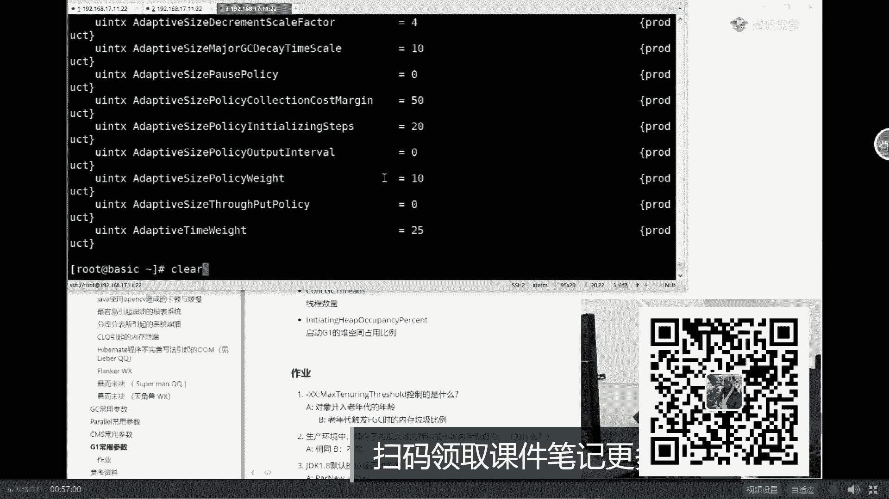
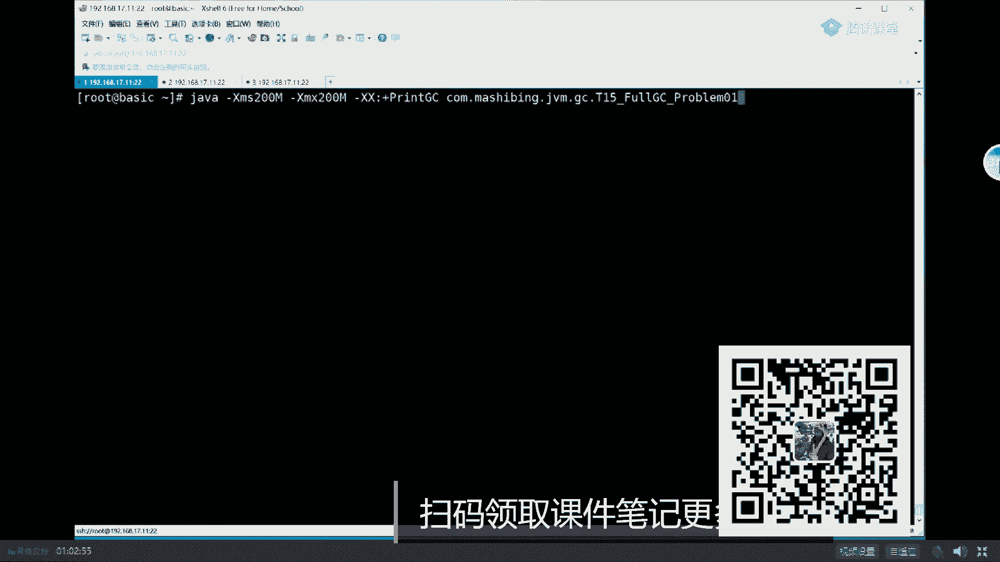

# 白嫖到马士兵教育价值23980的MCA架构师课程一次让你学够！ - P13：马士兵老师JVM调优：13.用jmap导出内存转储文件 - Java视频学堂 - BV1Hy4y1t7Bo

年轻代一部分叫老年代，年轻代回收的时候多线程进行垃圾回收，老年代的时候多线程进行垃圾回收，好吧，这个就叫做p这个就叫做p o全称呢叫parallel scavenge，叫并行回收，并行覆盖。

parallel old并行的，在老年代回收就这么就就这个意思，就多线程回收默认就是这样，孙雷文不是cms吗，然而并不是好。

有一点点小小的呃，有一点点小小的这种这种背景知识之后呢，我们今天呢主要来看实战。

讲究实战之前呢我告诉你啊，呃我先告诉你以后你你你遇到实战问题怎么解决，你应该第一尝试自己解决，第二找百度，第三尝试用马老师教的方法解决，第四还搞不定，用得慢，问我找我问。

我呢最近呢我们每每每一次都会有一些新的这种案例出来呃，说到这儿，我稍微多说两句，一般来讲呢，当你在简历上写，说也我有过jvm调优经验，此处不留爷，自有留爷处啊，我会jvm调优。

我期望值在我原来的期望值身上加3000好，我要是面试官，我一定怼你，你实际当中遇到了什么情况，你是怎么调优的，它的现象是什么，过程是什么，当然我相信啊，那个不少同学应该是答不出来的，大家听我说。

呃为了解决这种问题啊，你不能说老在那背来背去，背来背去，那肯定不行，为了解决这种问题呢，我一般呢都在给大家总结各种各样的实战案例，到现在为止已经20多个了，最近的啊挺好玩的，有一个比较好玩的案例。

就是这个heaviness的程序不完善写法引起的om呃，关于这块呢是我们最近的一刚刚刚刚跟跟我们学员讨论出来的，一个也是他们的这种实际的场景之中运行到的啊，因为它这里面呢有一点小小的这种这种隐私信息。

所以呢我把那个隐私先给大家拉掉，在实际当中什么样呢，呃呃发我了一个整个hipdp的文件呃，他们实际上是由于什么原因引起的，最后怎么查的，就是用我教的方式查完了之后，最后的结果是这样的。

实际上他们是一个harness的问题，他在hardt这里这个呃一个query里面，一个q里面发现了28万个对象，哈哈今天还有小伙伴发现了300万个user对象的啊，挺好玩的。

嗯实际当中呢就是把这个积压过多，由于事物没有及时提交，积压过多，然后引起的om，像这样的案例呢是比较有说服力的，也就是说在你简历里写的时候，注意不要想那种不要写那种书上啊，有的这种案例你知道吗。

因为我知道各种各样的书上啊，都有都有一个一个一个一个一个的案例给到，你说最土的就是不断的往里头丢对象，我扔到list里面不回收，你要写说这种案例太土了好吧，面试官一个大嘴巴子直接抽过来，啪该干嘛干嘛去。

你逗我玩儿呢啊成员写成这样，对不对，嗯当然我们现在也有一些悬而未决的案例，比如说我再给你看一个，这个玄幻悬而未决的案例呢，哎我出去，好，哇这消息在我手机上没有同步到我们的那个电脑上来算了。

就先不要看这个了，学生会觉得案例他他现在这个案例是怎么回事呢，呃cpu总是隔一段时间就会暴增一次，隔一段时间暴增一次，然后卡了很长时间之后呢，他就下来了，最后呢我教了他方法，他现在还没有查出原因了。

因为这是一个生产环境，生产环境里查东西比较难，他不能随随便便的停止，也不能随随便便的产生卡顿，所以这个慢慢慢慢来，那个当然还有一些其他学校位，觉得啊呃我讲到这儿有可能讲的有点提前。

很多同学可能看不懂，没有关系，总而言之，言而总之，今天我教大家最简单的能在你简历上写出来。

我有jvm调优经验的这么一堂课，不知道大家听懂了没有，我们是不是可以继续了，可以继续，同学老师扣个一，好嘞，课堂豪门就不心疼钱啊，上干货，其实我跟你讲的这个真的是已经非常非常干了，没意识到而已。

看这里作为我来说呢，先教大家一些实战所必须具备的一些基本的内容，以避免的同学们不知道，首先第一点啊。

所谓的jvm调优实战是调什么东西，大家看这里，克莱尔应该能看到我的屏幕对吧，看到看到我这里敲的东西啊，呃首先第一点呢就是所谓的jvm调优的实战啊，这种调的是什么东西，调的是java的参数。

java option参数，先跟大家说第一点，java参数分三类，哪三类呢，我给你们演示就行了，第一类叫做以横杠开头的，比方说杠cp指定class path。

比方说杠server指定运行模式更d64 指指定64位还是32位等等，好这一类的叫做标准参数，所有的jvm的版本全支持，第二类参数叫什么呢，非标参数，这个nonstandard options。

杠x开头，java杠x回车，当你看到这些参数的时候，注意这些参数指的是非标准参数。

那么非标准参数里面呢没多少很少，我在vip课上讲了mixed interpreter啊。

就是那个解释还是混合混合模式啊。

讲了什么xm x s x xs等等这些比较常见的这样的一个参数的，怎么调优，讲了x log d c应该是怎么怎么怎么指定，这种我们的日志该怎么进行工业化的指定，平常你们所玩的demo级的指令它不行啊。

必须要进行工业化的指令，那么还有一个除了java横杠开头和横杠x开头的参数之外，其实java更多的调料来源于这里，java杠x x，当然这个参数的内容非常的多，如果你想了解的参数有多少的话。

flags final，就是当我启动这个java虚拟机之后呢，所有的参数都给我列出来，最终的值是多少，全给列出来，那么它到底是有多少呢，我们计算一下它的行数就知道了，它一共是有728行。

所以说如果你想看这个参数的话。

那你可以一个一个看啊，你就一页一页看就可以，我敲了很多之后，刚到b吧，布尔类型的log刚到l，好了。

不知道大家意识到没有，其实真正的调优是调哪些参数，杠xx开头的参数，而这些参数700个左右，所以为什么调油值钱，你们意识到了吗，是因为你在这700多个参数里头挑出某些具体参数，来让你的系统达到最优化。

ok中间这是最终值，如果你想知道默认值是另外一个参数，是这个print flags，the initial，好，所有同学都不需要记。

为什么，因为你老师这么体贴的人，你放心，早就给你准备好了，这篇文档里，老师已经帮你准备好了，常用的参数，p parallel，就ps加po常用的参数cm常用参数g one的常用参数。

cdc是在我下一个版本里头就直接给大家总结出来了。

怎么样还算给力吧，暖暖对，ok同学们，我们可以继续了吗。

可以分享吗，当然可以了，k问小k k问那个可以分享啊，当然可以分享，你的是对外公开的版本啊，vip版本会更加详细一些，比如说每一个具体的案例。

到现在为止，我们大概总结接近30个案例都可以写在你的简历里，随便玩。

面试官想拦住你不可能。

好了，同学们，下面呢我们来聊jvm调优这个这件事情，我们首先第一步来聊的是到底什么叫jvm调优啊，其实调优这个定义非常的宽泛，如果非要说的话，你应该是把系统调到最优环境，但是你相信这一点。

没有人能把系统调到最优那个值，就是你你你相当于你扔一个小球，你扔到山坡上去，扔到最顶点上，它固定在这，那不太可能的，你只要调到某一个范围就可以了，当然调优如果非得加个定义，它应该包括三个方向的内容。

这三个方向内容是哪些呢，看这里，作为调优来说，我告诉你，一般来讲包括三个方面的内容，第一个呢是根据需求进行jvm规划和预调，有这是什么意思，你的需求我要支撑千万级并发，那么我需要多少台机器。

每台机器内存是多少，cpu是多少，这个就叫做预先规划预调优好，第二个，假如你的机器现在产生了一些小毛病，比如说它运行的时候呢，他并不死，但是他比较慢，另外呢比较卡顿好，这个怎么优化这个环境。

比方说刚才那小伙呢cpu隔一段时间满一次，给一段时间满一次，到底哪出了问题呢，怎么去进行对它进行优化呢，好这部分叫做优化jm运行环境，第三部分呢是我们这工程环境之中经常出的这样的一个问题。

就是著名的oom问题，o o m的全称叫out of memory，out of memory，简单的说内存爆了，内存爆了是什么情况，你们想象一下，内存爆了会有各种各样的情形。

内存爆了是说明对象不断在这里产生，我的垃圾回收器回收不过来了，直接内存就爆了，叫out of memory，我的垃圾回收，你能回收过来，但是有一些对象特别顽固，就是回收不掉，这叫内存泄漏。

内存泄漏越来越多，依然会产生out of memory，今天我们挑第三类问题中的一个小问题来给大家讲好吧，不太可能会所有的全讲到啊，面面俱到是不太可能的，我挑第三类问题中一个小问题啊。

看这里这个小问题呢模拟的是一个在银行银行系统里面，从数据库里面取数据，然后进行那种风险分析，进行模型的风险分析，这么一个小程序好吧，模拟了模拟这么一个东西，ok呃具体说这个程序的问题到底在哪儿。

我们先不管，总而言之呢，我们先看看这个问题，这个这个这个系统呢，就这个小程序呢它会产生哪些不对的这种现象，好看，这里我把这小程序简单运行一下。

同时教大家几个简单的小参数，好吧，一个一个来啊。

好java一般呢我们来敲完，直接就后面跟我们的程序的名字呃，扣码是0g v m g c t l复制一些problem，零一这个小程序好，大家看这里，我呢直接带了几个参数，虽然我没有提前教过你。

但这个参数呢非常的简单，我们来读一下，看能不能读懂第一个参数叫什么呢，叫杠xm 200，杠x mx 200，这两个参数代表的是最小堆的内容和最大堆内容，什么意思，大家知道当我一个g m启动的时候。

它会要占一部分内存，这个内存叫最小占多大，最大占多大，正常的情况下呢，你开始启动的时候可以占一个比较小的内存，然后随着程序的整个运行，你可以占到最大能占到多少，他要是这么一个参数，最小200兆。

最大200兆，大家有同学可能就会说，老师你为什么把最小和最大射程一样呢，听不懂，打扰了嗯拜拜，最小和最大射程一样的，同学们，为什么呢，自旋，然后就要写成词，你在这聊天聊啥呢，防止卡顿。

不是叫做防止内存的抖动，同学们，你们拿大腿想想，他如果一个小程序刚刚起来，占这么大地儿不够，使了之后，他肯定是逐步扩大，逐步又扩大，一直扩到能够扩到最大为止，然后他又够使了之后怎么办呢。

它又减小逐步减小，注意这个逐步减小，逐步扩大，这个过程本身也要消耗资源，假如你这个java程序我已经知道我独占这事儿，就这个这个这个机器归我了，我已经知道我一定我会我会占比这么这么大的一个内存。

我就直接给你设到最大，你不要给我弹来弹去的浪费资源，所以一般在工业环境里头，直接把最小值和最大最大值设成一样好，第二个问题，第二个呢叫print g c，prinjc的意思是什么。

print g c的意思就是你把垃圾回收的日志给我打印出来，是这个意思，一般来讲呢在工业生产环境里头不会是这样的参数，工业生产环境里头什么样的参数呢。

是另外一种，生产环境里头正常的情况，日志，你要把这些个日志从日志文件里面读出来好吧，然后来分析这些日志的内容，当然呃，正常的一个情况呢，我我我要给你讲这个日志的格式的话，咱就没完了。

今天我们主要讲实战的调优。

所以呢我给你打印的这个日志呢其实是比较简单的日志，就是一个简简单单的小日志，但是通过这个小日志，我们也能读出很多问题来，好吧，好大家看这里，我们先把这些小东西执行起来，为了让大家更快的看到问题。

我先把内存的值设成20兆，那好讲到现在呢，由于有同学基础不太好，但是我也不太可能完全给你讲基础了，所以能跟上的来给老师扣个一好吗，我们开始定位这个程序的问题，我们先来看这个问题，它会产生一种什么现象。

大家永远记得啊，你你分析问题的时候，不要想当然，就是刚才有一个悬而未决的问题，我们我们的小小学员给我的，我问他什么现象，他反而没说，他只上来就说，我觉得应该是这个问题。

注意千万不要你觉得我要我觉得开玩笑一定是通过现象来定位，而不是想象来来做好看，这里回车，好这是第一次gc产生了，然后这是他的信息，这就是我们这句话，这个参数所得到的g c a产生了一次gc。

产生的原因是allocation failure，分配失败，那意思就是没空间了，然后进行了一次回收，这个回收的过程是从五兆回收完了之后，一兆总共的内存19兆，其实是接近一个值，就是20兆嘛。

然后回收的时间是多少秒场，关于这个日志我再解释一遍，首先是产生了dc，为什么产生dc分配空间不够了，回收之前是多少，回收之后是多少，总共内存是多少，好我现在就想问你，同学们，为什么我回收之前是五兆。

而不是20兆，原因是什么呢，对这里是年轻代的回收，嗯，你说的很对，嗯，年轻代的回收马上就回收了啊，好凡是你看到这样的回收的方式告诉你，这都是年轻代回收，我们来看看这个回收，这个回收内容是叫做负离子。

负离子的意思就是整体性的全部的回收，他仍然也是啊分配不下了，然后他的回收呢是从16兆回收到了13兆。

下一次18兆回收到15兆好了，我知道大家观察到没有，现在开始频繁的fdc好，我这个小程序牛逼，你就牛逼，在他可以频繁f d c，但是他就是不崩，然后呢注意看啊。

你看最后产生的信息是19839k回收到19838k，发现没有啥意思，就是我每次还能回收1k好玩吧，每次还能回收1k，但是我回收不了更多，如果回收不了更多，那么新产生的对象就找不着空间。

那么他就正常的情况下就一定会产生o o m，当然咱们的小程序比较恶心，是有的时候会产生o o m，有的时候不会好，我相信有同学现在开始奇怪了，说老师为什么会这样，它的源码是啥样，大家听我说。

很多人讲这种东西的时候，都是用那种demo级的小程序，明显你一看就知道问题出在哪的那种，拿一个类似的使劲往里装上来，你有一个list，然后不停的往里装对象，很快把内存占满了，这不是废话吗，像这种的内容。

我不想讲太简单，这个源码就算你看了，你也找不出问题之所在来，如果你感兴趣，需要我解释一下源码吗，需要吗，看看好可以，我们先把它停掉，我告诉你，这里面绝大多数人就算你看了这个源码，你也不知道问题出在哪儿。

来，我们来看这个源码。

呃这里这个源码是我们从小伙伴的生产的环境里头真实的模拟出来的，当然我不可能说把模拟它，它是它的实际生产环境之中呢，是大概一个一个周左右就会内存爆了，一个周左右内存又爆了，他们怎么办，重启好看。

这里我把这个只不过我把这个结果和它的内容呢进行了一些压缩而已，这个程序呢是从数据库中读取信用数据，然后套用模型并把结果进行记录和传输，什么意思呢，大家知道现在有一些信用卡的发货中心或者是那种p的金融。

说我要给这个人放贷，那么他的贷款额度应该定多少，他的贷款级别，信用级别应该是多少，那么这个时候呢我有一个这种叫什么呢，叫做风险的模型，套用这个模型，如果你符合这个模型，那么你的级别应该是定a。

那么你符合那个模型应该令b等等，简单来说，这个程序就是从数据库里面不断的把这个人的相关信息取出来，取完了之后呢，形成一个对象，然后把这个对象呢不断看看是不是符合这个模型，model fit。

它是一个定时任务，所以我们用了一个定时任务，线程池叫scheduled thread pool executor，好在这个线程池里面呢，每每每每三秒钟，然后就执行一次with fixed delay啊。

定时的啊，每三秒钟我们就执行一次model fit的这个方法，大概是这样的一个小程序，不知道我解释清楚没有，总而言之再解释一遍，每次从数据库里面取出100条数据装到lily。

然后把这个list扔给线程池，这个线程池每三秒钟执行一次，去这个list里面拿数据，拿数据不断的进行modifate，看看是不是符合这个风险模型，好，我就解释到这里，零基础的小白看懂代码别想了。

不太可能啊，那好了，这就是这个小程序，你试试看，你能看出来问题之所在吗，再用fix，第一个呢你要看不懂线程池，你完蛋，线程值你要不理解，你一定是看不出来，第二个就算你理解了，你能看出来问题在哪儿。

不一定的啊，好我们先不解释这个问题，我们先通先看现象，总而言之，言而总之，我会把这个人的信息放到cat info这个对象里，这个人的信息包括什么，包括呃这这这是我下定的，比方说他买过哪些个价格的。

买买过哪些价格的东西，名字是什么，年龄是什么。

什么是哪，是哪年生的啊等等好了，这小程序一旦运行就会产生这样的问题，那有同学可能会说老师呃，这样的程序，我看你写了一个死循环，真正运行程序有死循环吗，当然有，当然有啊，这个很正常。

你的服务器程序7x24小时，365天不间断运行，我今天就直接告诉你，其实jvm的问题的定位相对简单的多，它的步骤也比较死，但是你真正就算定位出来，就像就像这样啊。

我一会儿就带你定位出来这个问题到底出在哪，但是你查这个源码怎么改这个问题，这是巨大的，你的挑战定位非常简单，真正想纠正过来特别难，所以在生产环境里面最重要的一个调优的方式，你猜是是个啥，reboot。

有同学说我特我告诉你，我们以前有小伙伴找到了一个gr的bug，但是他们没办法，没有新版本怎么玩啊，哎每次重启一次，每次重启一次重启嗯，不是说所有的程序都能这么干，有一些是关关关系到金融的。

关系到那种呃交易的，你不能随便重启，但是大多数的情况下，我告诉你啊，这个这个方法叫万能方法，你实在搞不定的时候，没有人说说任何一个生产环境里头，没有人说一秒钟你服务器就完蛋了，那不可能多数都是缓慢的。

很缓慢的战争，只要是不行的时候，你就只能重启呃，最好玩的事呢是我不知道大家有没有印象，12306每个晚上的11点半到第二天晚上的七点，应该是买不了票的，为啥维护，还有一种现象。

以前有小伙伴2年没有查出他们家bug来怎么办，这2年就嗯隔一段时间重启一次，隔一段时间重启一次，比方说呃对性对性能调优比较要求比较高的，有一个叫游戏服务器游戏，不知道大家有没有遇到过这样的情况。

真的你你正在打游戏的时候，然后给你弹一条消息，说那个各位指战员，我们的游戏服务器大概在15分钟之后进行维护，在这段期间之内不能互相打，有遇到过吧，我告诉你这是这是。

所以我今天教了大家第一个实战的调优的方式，reboot，当然你不能这么回答面试官啊，那面试官直接问你，你是怎么调高的呀，我直接把机器给重启，拔了电源，面试官一个大嘴巴子直接抽上来，出门右转好看。

这里我们来定位这个小程序，在定位这个小程序的时候，我要先教大家一些常用的命令，这个时候我必须让他死的稍微慢点，把内存加大，它就会死的稍微慢一些，回车好。

教大家开始开始教大家命令。

我在一个呃shell里面来运行这个小程序，我在第二个shell里面呢来教大家定位bug。

调jvm调优常见的命令好，第一个命令呢叫gp，gps的命令叫java process，就是这个很简单，在你的系统里面列出来有哪些个java的进程能看懂吧，他的技能编号是什么，它的主类是什么。

这个比较简单，我们主要要到他的进程编号好，第二个命令看这里叫j infer，这infer这infer是什么意思，就是java的进程的它的一个信息，这infer后面要跟技能编号1958回车。

这样的话呢它就会把我们刚刚运行的那个小程序对应哪个java虚拟机。

这个java虚拟机的一些详细的信息全给你列出来了。

咱们大概看一眼，看上去很复杂，但是呢这里面信息相对简单。

一般来说作用不大，他会告诉你这个java进程的version是那个version，以及呢它常见的这个系统的属性是哪些，它的模式是什么啊，常见的系统属性我就不说了，就比较简单。

就是这种行的分隔符是什么等等。

java的class version是哪个啊，user home是哪个等等等等等。

这里面还有很重要的一项，看这里就是它会把整个java运行的时候带的那个参数值全部给你列出来，看这里实际上它默认的带了很多参数，这些参数值全给你列出来了，比如说initial hipsize，20兆。

max heaps size 26，这就是杠x mx和杠x mx对吧，friendc是我们设的old size是多少，new size是多少，这个如果要解释起来就没边了，这个牵扯到另外的内容。

也是一道巨难的面试题，不说了，use fencorcortestes使用什么样的日期格式啊等等。

这就是java进程的一些简单的信息，通过jinfer这个命令完全可以拿到两个命令了，到现在为止，一个叫什么，一个叫gp，一个叫j inf，好。

