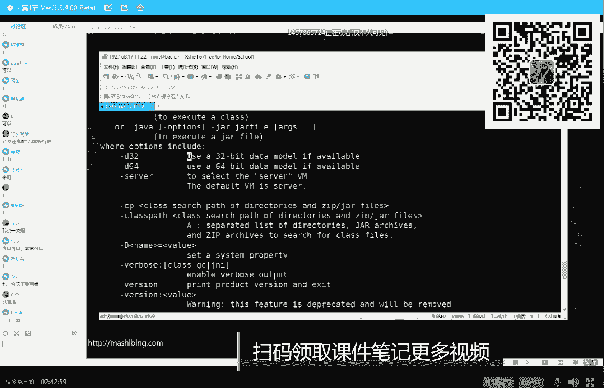
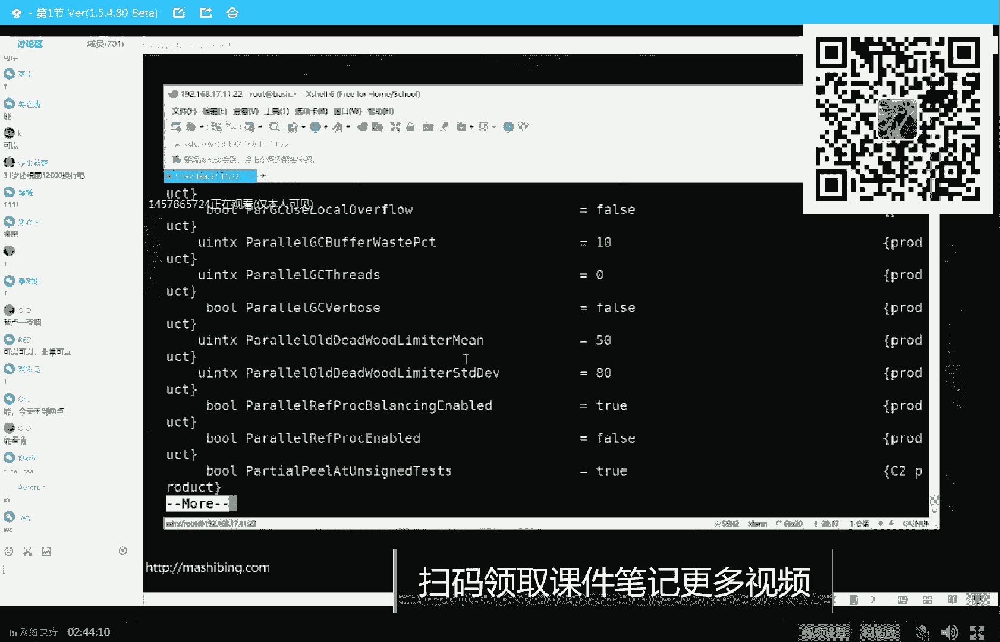
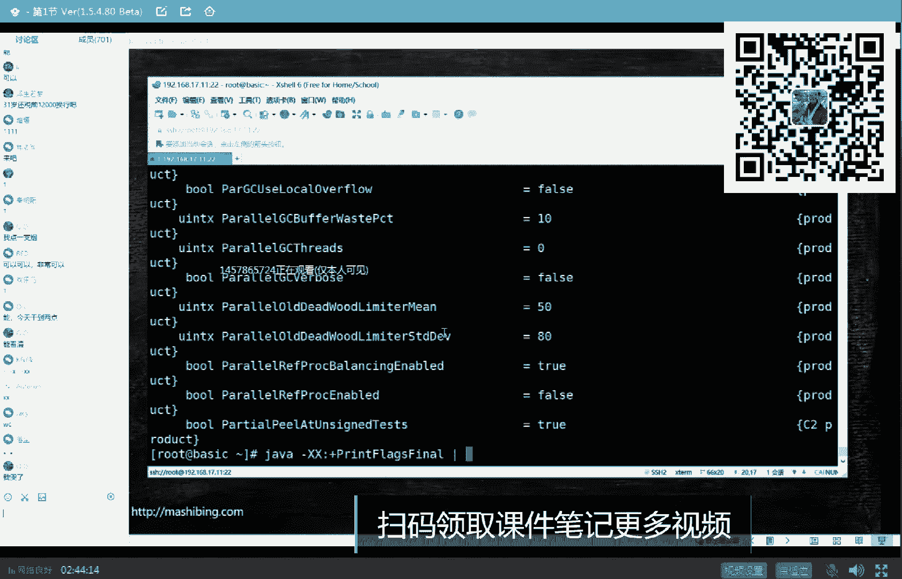
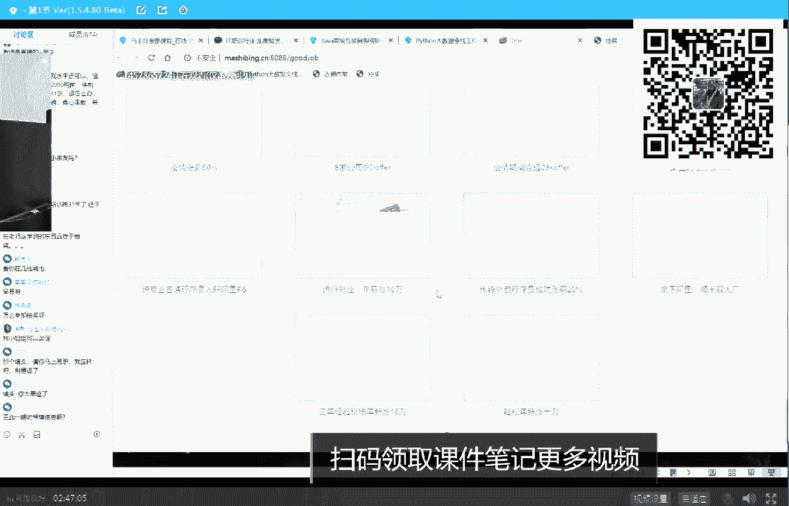
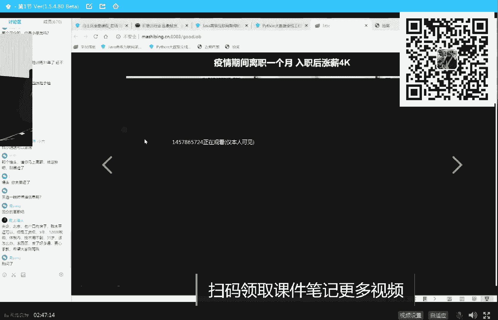
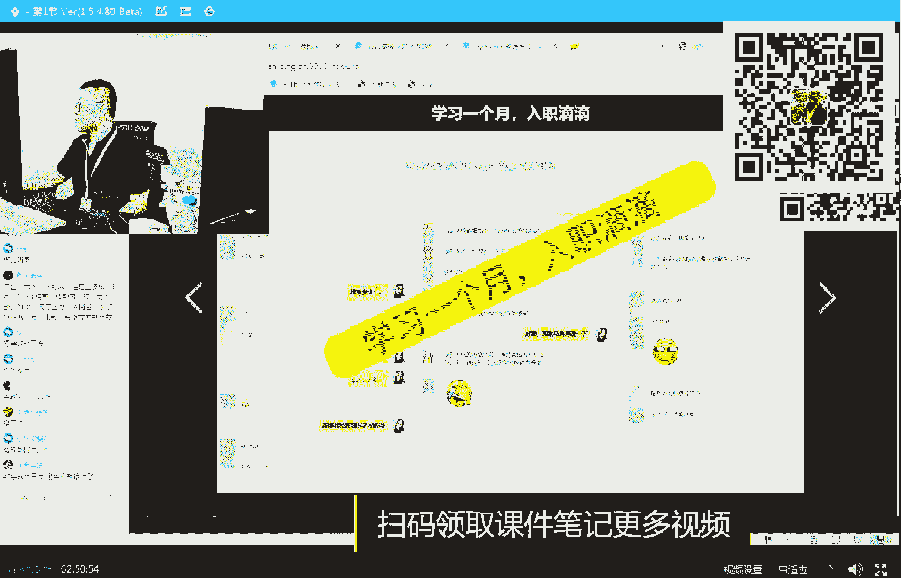
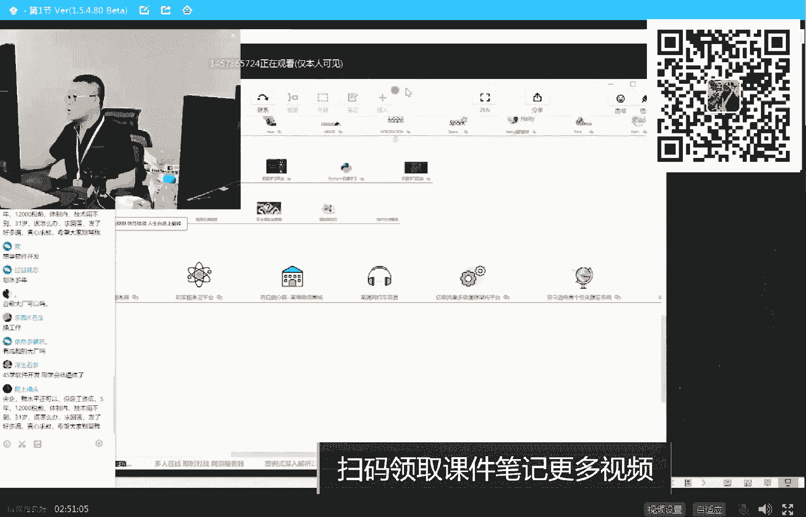

# 系列 2：P14：马士兵老师JVM调优：14.用jstat定位JVM问题 - Java视频学堂 - BV1Hy4y1t7Bo

这是第一点，只是这样，只是产生浮动垃圾，跟他们分析过，这无所谓，但是与此同时，我们黑色的标记里头增加了一个引用，又指向它了，那么这时候你想象一下，由于这哥们儿是黑色的，表示已经标记完。

而且成员变量都标记完了，我垃圾回收器县城回来继续运行的时候，也不会再重新标记他的孩子，所以这个d就被我们漏掉了，被我们漏掉，被垃圾回收器漏掉，有一个严重后果，垃圾归宿就会认为这哥们儿不是垃圾。

这哥们是垃圾，这不是垃圾，但是这哥们儿是垃圾，就会被他干掉，就会产生严重的问题，看你们跟他讨论是央企国企的问题呢，啊这块还能跟得上吗，就是总而言之就是灰色的引用消失了，黑色的引用诞生了，good。

懵了对，一般情况下这种可能会被蒙掉，这不出大问题了，对没错，这里就出大问题啊，我们稍微再捋一下，由于算法确实比较难，但是我觉得算法这东西呢你只要捋捋明白一遍啊，你这辈子就捋明白一遍，你放心，他不变。

好大家看这个我们再看一遍，本来正常的情况下，作为一个那个呃正在内存里头运行的对象数来说，a的成员变量指向b，b的成员变量指向d，这个能不能理解，没问题吧，就是a是什么呢，这个是一个黑色对象。

黑色对象的意思是我自己标完了，而且我的孩子们也标完了，我的孩子只有一个是b，我已经标完了，这哥们儿是一个不不是垃圾啊，接下来，运行过程之中，如果壁纸向d的已经消失了，那这个时候d就捋不到了。

捋不到没有关系，捋你做站在垃圾回收器的角度啊，站在垃圾回收器的角度，本来呢我是能够捋到这个地，把它当成不是垃圾，ok正常正常的往这儿走，正在正在正在呃标的过程之中，然后呢它消失了，它消失了，没有关系。

就是产生了一个浮动垃圾而已，下次我在旅的过程之中，我就会把它给清掉了，因为我从a指向b，我发现b没有了，那剩下的这个d肯定会被我干掉，这个完全没问题，但是呢由于b指向d消失之后，与此同时发生了一件事儿。

发生一件什么事呢，就是a指向d的引用增加了一个，那么这时候你想一下，站在垃圾回收期的角度，站在垃圾回收器的角度，同学们老师讲一下，在垃圾回收器的角度，b指向地影消失，我肯定是找不着这d了，这是肯定的。

虽然a能够捋着找到d，可是a已经被我标成黑的了，大哥黑的啥意思，就是这哥们儿的孩子们，我都已经标完了，我为什么要重新标一遍，我不会重新标一遍呢，所以这个d我我我找不着他了，我找不着他，就会把它当成垃圾。

这会儿大家能能理解了吧，啊对吧，所以这个是并发标记的时候一定会产生的问题，那后面会有一大堆的问题，是怎么解决这个问题的呢，怎么解决这个问题呢，解决这个问题呢有两大方式，第一种就是cms的解决方案。

它叫做incremental update，第二种g one的解决方案叫sa tb，叫snapchat，the beginning，好cbs解决方案叫incremental update，还讲了。

要不然算法就讲到这儿，我们我们聊点实战吧，我给你讲完这个算法，主要cms了超级复杂，什么场景会出现这种我比大哥嗯，所有的并发的垃圾回收器都会产生这种漏标啊，包括go语言的，包括java语言。

最新的这些垃圾回收器都会产生，ok把这个把这个讲完啊，把这个讲完好吧，我们我们讲完这个cm解决方叫increment update，input meal update呢，那个这个解决方案呢其实非常简单。

他就是把这个a给你变成灰色就行了，就这么简单，当有一个新的引用，你的成员变量指向一个新引用的时候，他二话不说就把你直接把你这个a给你变成灰色，让你来了之后重新再扫一遍，能听懂吧。

唉就是简直就就就这么简单，但是这里面隐藏着巨大的bug，o有同学我看有同学说了，说什么那个rberry啊，那个还有什么那个读屏障，写屏障呃，那是具体时间的手段的问题，这种呢一般是写屏障，但这个就算了啊。

先不给你扩展这些概念了，概念太多，小白就直接蒙了，先不扩展，这个我们先用图来理解好吧，所以你只要把这个颜色给它换成灰色，那么你垃圾回收器再回来的时候发现诶这哥们儿是个灰色的。

那我当然要扫描一下他的孩子们，所以这个d又被我们重新标记到了，very good，解决，这块儿还能跟上，能跟上的扣，一不能跟上扣二，啊不能跟上那么多，好，没有听懂这块儿呢，不着急不急啊。

这里面隐藏着巨大的bug，注意看我靠，这个要解释起来真的是太累了，来呃由于我们是多线程的垃圾回收c m s解决方案，有非常隐蔽的问题，叫做并发标记，产生漏标，啥意思啊，你注意看啊。

我们有一个垃圾回收线程，在标a是黑色的，正在正在标a标完属性一了，已经标完了第一个属性了，大家还记得吗，我只要标完它有两个属性，我只要标完这俩属性，这哥们就变成黑的了，这哥们儿就变黑。

我们有一个垃圾回收线程，你妈妈标完了一个属性了，好暂停垃圾回收线程，县城嘛暂停另外一个垃圾回收线程，然后那个，另外一个垃圾回收线程啊，我们哦sorry。

就是呃呃第第二个右右轮进程把属性一指向一个白色对象，就这个属性一样指向一个白白色的对象，ok注意这是业务逻辑线程，刚才我们说了b指向d的引用，消失属性一指向白色引用，所以指向白色引用。

按照我们刚才的解决方案，是不是得把这个a变成灰色呀，大哥再来说一遍啊，这里面隐含的问题超级恶心，面试其实还没有遇到过，面试其实还没有遇到过，好吧，这遇到只能说明你走狗屎运，你要把这个问题跟面试官讲清楚。

面试官说50万，你来一定一定一定不会有问题啊，听我说再看一遍，有一个垃圾回收线程，大家知道我们现在正在标记，标到a只标了一半的时候，注意他这个时候是个灰色灰色对象，因为还没有标完，然后呢我只标完一了。

我还没有标完二呢，那这时候正好一指向了d了，一指向d之后，根据我们刚才的那个分析，就说这个对象一定是个灰色对象，应该下一次标记了，回来的时候他应该依然是个灰色才对。

可是m一线程就是我们的垃圾回收线程继续运行，注意站在m一的角度，一五已经被它给标完了，就剩二没标了，然后他把二标完了之后，直接就把它干成黑的了，那么你想想看，本来正常情况下你应该是个灰的呀，为什么呀。

因为你的e已经指向一个白色对象了，你应该是个灰的，正好打个时间差，你又变成黑的了，这块儿能能理解吗，还能跟上啊，枷锁就不行了，每个对象加锁，你不累死了，大哥，结果就会发生什么结果就会发生。

当我们垃圾回收线程再来回来的时候，完蛋这个对象已经是黑的，它就不重新扫描，你一指向的这个d依然找不着，白黑灰加黑，所以你们知道来看一遍动画吧，来看一遍b指向敌的已经消失了，还是原来那个问题。

a的1a一指向d，然后m一的垃圾回收线程正在标记指标完一，然后a一指向d，按照我们刚才的说法，a应该变成灰色，m一线程继续运行，把二标完了之后，直接把它变成黑的了，注意一已经变了，二没变，完蛋还是错表。

所以你知道cms模玩的cm叫做remark阶段，从头扫描一遍，very good，哈哈，这个sw时间超级长，当然cms还有其他的问题，cms一旦产生碎片化，1。7。4之前。

单线程把所有的old区全干一遍，之后，多线程把所有old的区全干一遍，你就想一个天安门广场那么大的地方产生了碎片化，有一个风烛残年的老太太拿着小扫帚慢慢一个格一个格的慢慢扫，那种是一种什么感觉。

死菜死的心都有了，所以在我们真正的生产历史上，产生s t w时间最长的反而不是p s p o，反而不是cereal，居然是号称能够解决sw的cms，由于cms的巨大的bug的存在。

所以cms不是任何一个垃圾回收器的默认，那就会入侵，sorry，不是任何一个jdk版本都默认了，就会入侵，1。8，默认p s p o一点九，默认直接g one，没有cs cms什么事。

我个人永远建议在你们生产环境之中，如果掌握住g one，尽量用g one，g one调有简单，参数少，不容易出错，虽然它的整体的运行效率略偏低一点点，因为它里面用到了读屏障，写屏障。

但是这点损失跟你得到的收益相比要高得多，老师今天讲这段了，1。8，g one已经比较稳定了，完全没问题，很多人已经在用，放心你放心用就是了，好吧，你这dc你还用不上呢，好听我说呃。

今儿我们就技术就聊到这儿吧，行吧，我明天啊就给大家讲什么呢，给大家讲实战实战，就这vm调优实战到底啥样，我大概每天都会收到一些在实际工作场景之中遇到了什么样的，什么样什么样的问题发给。

然后大多数呢其实都太简单了，都都不好给大家拿出来，在你们的简历上，只要你写上我有过jvm调优的实战经验，大哥知道这东西值多少钱吗，少说3000，每个月，明天跟着老师走，让你搞定。

实战经验呢也不太容易能够说完完全全的罩得住，因为你实战经验的时候，面试官一定会问你，你实战能遇到什么情况啊，到底是怎么样子的呢，我呢大概在我们的给vip里头呢，其实是大概干了十几个20个左右的实战场景。

你挑一个用就行了好吧，就实战场景大概有20个，明天我们讲吧，嗯案例的汇总大概有20个左右的，你挑挑着用啊，然后像呃各种参数怎么调啊，就是jvm呢一共有我我我我今天开一开一点点时间可以吗。

今天开一点点时间，你们你们你们还能听吗，对这个上完课再发，是的嗯，好看一点点时间，好大家听我说啊，作为java来说，克里对java来说，当我们敲java的时候，就已经出现一java虚拟机了。

只要你敲一个java放心，java虚拟机一定已经启动了，而且结束了，java虚拟机调优叫做调参数，参数有好多好多好多种，在呃正常的情况下呢，大家看这里啊，就这种参数，凡是以横杠开头的字体有点小。

能看清吗，这个字体是怎么调的，稍微稍微稍微调大一些，16，a2 ，这样吧，我什么都不管啊，你看啊，它默认的情况下会以横杠开头的这些个参数，这些参数是什么东西，这些参数呢叫做标准参数。

注意在java里面除了标准参数之外，还有一个著名的非标准参数，在这叫杠x nonstandard options，叫非标参数，也就是说只要你这么敲的时候加了杠x在这好，这里显示的就叫非标准参数。

有同学可能会说，老师看上去没多少标准参数，加非标准参数几十个而已，但是完蛋我要告诉你，真正的需要你调优设置的参数是以java杠x x开头的，而且还没有成熟的文档，而这时候咋办呢。

一般我们用这个参数来把它全部打印出来，叫print flags final，好，这个到底有多少呢，你加一个more吧，让它分页来给大家看一眼到底有多少回城，一页两页，三页，四页，五页，六页，几页，八页。

五页，十页，11 12 13 14 15 16 17 18 19 20。

好了不玩了，那天来没头了，如果要计算一下的话。

那是wc杠l728 行，大概730左右吧，b m为什么调优为什么值钱，为什么之前想明白了吗，700个参数慢慢调嘛，不过作为老师这么体贴的男人，你就想了，常用的全给你列完，放心。

老师给你列的这个你已经够了，g one加上常用的十几个不到22222 20个左右够了，放心好吧，cm 20个左右够了，cao那就更少了，日志怎么设，日志怎么读，咱们明天说，一到这个时候就感觉到放落锅嗯。

我看有人问问vip啊，本来我是想明天讲给大家听的，但是腾讯今天刚给我们通知，我就我就我就直接告诉你，腾讯刚给我们通知，就我们课呢，我们课啊现在是腾讯课堂排名number one的课程。

然后呢已经遭遭忌受度很长时间，现在要拆分，我们可有课程内容太多了，我们大概每个课时是五块钱到七块钱，这么这么这么一个这么一个水平，知道吧，呃人家大多数的课程呢是20块钱到30块钱，每个课时每个小时。

所以我们课呢太便宜，同学说你们不能这么玩，你还这么玩吧，别人还干不干，比我们涨价就这么回事儿，呃课程比较复杂啊，我就算给大家聊点广告，我告诉你也是干活，你这人你这人听就是了，作为我们来说呢。

嗯一会大概要抽奖啊，其实跟技术相比，抽奖的小case啊，作为我们来说呢，我觉得啊就是这个课我在我给你介绍之前，第一个呢你可以去问小姐姐，随便哪个小姐姐问我们今天有优惠，如果今天有异象，别犹豫。

明天就涨价，就是这么回事儿，没办法啊，腾讯已经比我们好长时间，实在扛不住了，捡便宜，就今天如果说不着急，那你就等明天稍微贵点，就贵点好看，这里我就因为氪牛逼不牛逼，看效果有一个药好不好使，看效果。

这是我们大概呃总结出来的比较典型的这种这种就业。

就是学我们课之后的一个一个一个一个达到的效果吧。

嗯你们你们呢也可以找到这个网址，慢慢自己自己看去啊，这里面所有的案例呢全是支持被调，他们也在也也也在那个那个那个那个呃群里啊，支持被调，这哥们就是疫情期间离职一个月，是不是目前离职一个月了。

然后呢回来之后入一个月，一个月涨了4000块钱，有同学说老师不高啊，看时间一个月而已，这个是23岁的一小会儿，三个月学习涨了11k他原来14滴滴给offer 25，可以吧。

3月我就觉得一个牛逼的学习应该是效率要高，掌心要快，这才是牛逼的，因为我会用最关键最关键的就是老师能够告诉你们一点，你呀就带着人来，傻瓜式的老师，让你学个啥，你给我学个啥，老师让你背过啥。

你给我背过啥就行了，其他你什么都不用管，所有剩余的一切交给了，看这里文凭文凭不是个事儿，我要看一个，我要给你看看那个专科的那个那个那个那个那个那个拿的薪水，吓死你，这是没好好学啊，这哥们儿是没好好学。

三个月涨涨了8k，每每每每个月涨8k，今天跟人如果聊聊，同时被辞退，拿了6k，我这个拿20k不过分吧，凭什么涨了8k啊，正好把那8k给盖了，肯定好好学才行啊，我都没好好学，重点来这。

就是你躺着听就完了啊，辞职一天面试之后，offer形式上800，这哥们就辞了一天，上周辞职，昨天面试，今天收到一个offer，可以，收获两个offer，不知道怎么选，阿里p7 ，民营专科两周拿了五个月。

分民营专科啊，他这个专科还特别烂，我不知道大家有没有发现，就是在我们的在我们的呃截图里头呢，会有大量的老师的指导，就这也是我们服务的核心之一，就是一对一的辅导，这会儿是绝对给你送进去。

有些同学想进大厂保进的，有感兴趣的吗，保进，今天报名，但是价格上了，如果是按咱们现在的这个价格，就是还不能保你，但是你想保金呢，多交点钱，为什么，因为有一大厂的哥们儿跟我说了，说你能不能让我带几个徒弟。

我保他进大厂，就是大厂的，大概是阿里p7 到p8 的水平的，如果你没到这个水平，推荐一两个，当然要经过他面试，他觉得可以能带得动就可以，然后这个是入学半个月，年薪涨了5万，咱们这全部支持废掉假一罚十。

就说我们科为什么牛逼，时间短，见效快好吧，感冒了吗，吃个药让你搞定，没人跟钱有仇吧，好但是容能容能容许我简单介绍介绍我们课程为什么这么牛逼吗。

好简单说一下好吧，第一，课程内容好好听。

但是我希望要想报名，抓紧今天晚上的机会，12点过，腾讯就要求我们涨价，我们的整个课程我简单先给你介绍一下，叫做m个知识点加n个项目，我相信一点就是一定是知识点加项目，知识点加项目才能把整个全拿到。

有好多课就讲知识点，那不行，我今天给大家讲的内容，只是我jvm优化案例时，就是这位m按案例实战化指导中的一小部分，只是这其中的，就是第六节的理论化的内容，我们还没有聊实战。

实际上明天呢我简单跟你们聊实战的内容哈，就是案例中的一小组，整个整个这整个支点中一小个，除了这之外啊，就是我们还有n个项目，别的项目也是非常的给力，我们有两大王牌项目，第一档呢就叫做网约车的项目。

这个是什么呢，这个是一个原来你天天写c r u d国企啊，传统企天天玩c r u d，我怎么能跳到互联网呢，一个项目让你进来就是效率高，这里面主要的落地的东西叫spring cloud。

分布式微服务的设计与实现，而且这个讲法和其他的完全不一样，这讲法的这这这这这课程的讲法是这么来讲的，这大家可以去拿白皮书吧，拿白皮书会更好一些，看我的白皮书有没有啊，给大家打开一下，白皮书白皮书。

稍等我我我我我我来打开我的，白皮书啊，嗯嗯，呃这里面对面先说啊，就是说每一个每一个项目都有都有对应的白皮书，你们都可以去要嗯，作为我们飞机出行这个项目来说，我们先说讲讲课是谁，阿里的曹曹老师。

原来阿里的p6 ，其实他在升p7 的时候被我被我给拉过来了啊，你就你就你就别升p7 了，踏踏实实给给咱们同学们讲课吧，好这项目呢实际当中运行的运行了很长时间在线上，然后那个，就是非常真实的。

就不是那种demo级的，千万不要认为是demo级项目，再一个呢就像我们讲法也不太一样，想法完全就是采用了面向市场的讲法，面向市场讲法什么样的呃，原来只讲技术实现，现在是从整个项目立项开始。

从立项开始到人员配置到开发模式，到如何去开项目启动会到需求怎么评审，到设计到下架构的设计，详细的设计工程的设计，db的设计，然后才将编码，而编码所有代码都会给到大家。

还有一个每一个讲到的用到的这种分布式的模块，基本上原理源码全讲到位，呃我讲课的深度你们应该也见过，我还没给没给你讲到那个hosport源码呢，其实这么说，整个所有的培训节讲我们这么深的，没有1万测试。

怎么测试部署怎么部署，最后面试不知道怎么说怎么办，曹老师自己去面试，把场景录下来发给你，所以我们说啊，你不用其他什么都不用，带过来之后老师告诉你学学什么，学这个，你学这个学那个学那个，学完之后。

所有剩余的全交给我们，刚才有同学不是担心说那个大专行不行吗，莫急，这是我们一个原来学生的，他的简历，大专年龄还比较大了，唉这哥们儿32岁了，大专生，27岁，从运维转过来的，学完我们课程之后。

五条注意简历都是经过我们严格批改的，就是一对一的服务，帮你来批这个简历照，你该怎么写，这个年龄的该怎么玩，那个年龄的该怎么玩，你这种经历的该怎么写，那种经历的该怎么写，有一些能够把demo项目写进去的。

有一些不能把demo项目写进去的，还有这些东西全部全部教你，就五条，你自己看一眼，这就是牛逼的写法，跟你的项目跟你的那种那种那种简历一定不一样啊，这哥们儿是阿里四次面试就大专生，当然他没通过阿里。

但是他结结果并不差，他是在融3600360 60~70万年薪，我同学说我为什么不确定，因为它是15x35+9000股股票，知道吧，所以有这个股票的在最后算的结果大概是60~70万年薪，30岁数不大。

比好多20多岁的大，比40多岁的小，但是这么一个东西，这项目学完可以写简历吗，中小厂随便写，大厂用学到的技术包装原来简历，莫及这方面，还是那句话，交给老师就行了，你不用考虑这些事儿，你唯一要干的事儿。

我让你学的东西。

