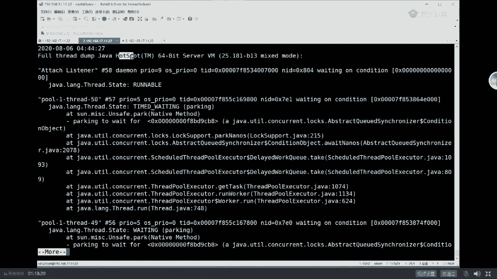
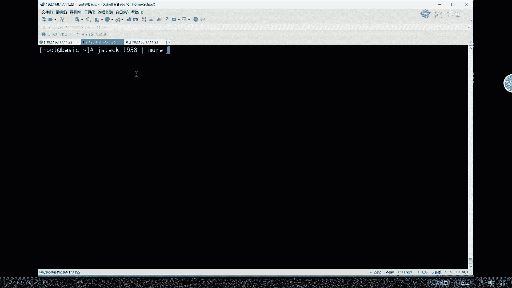
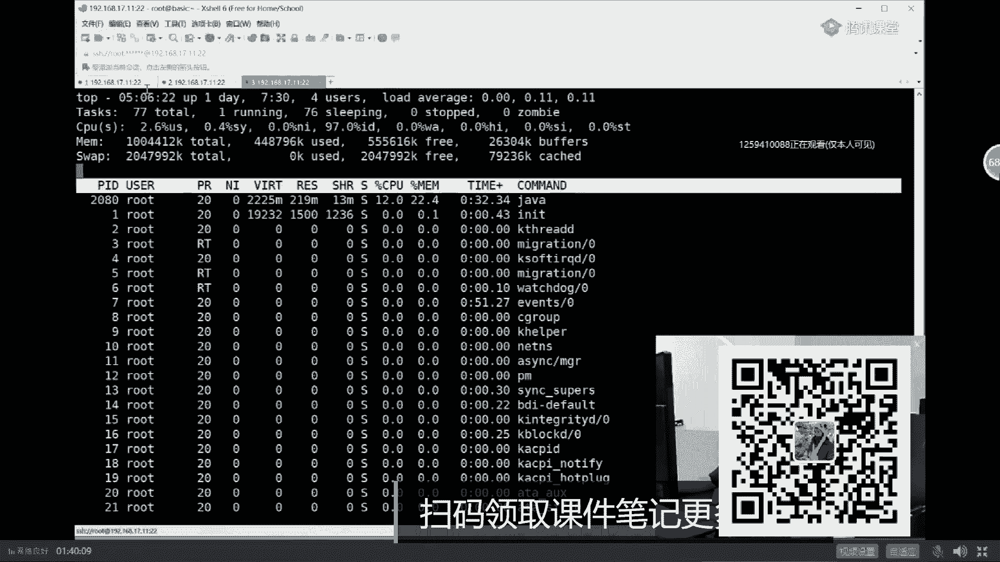
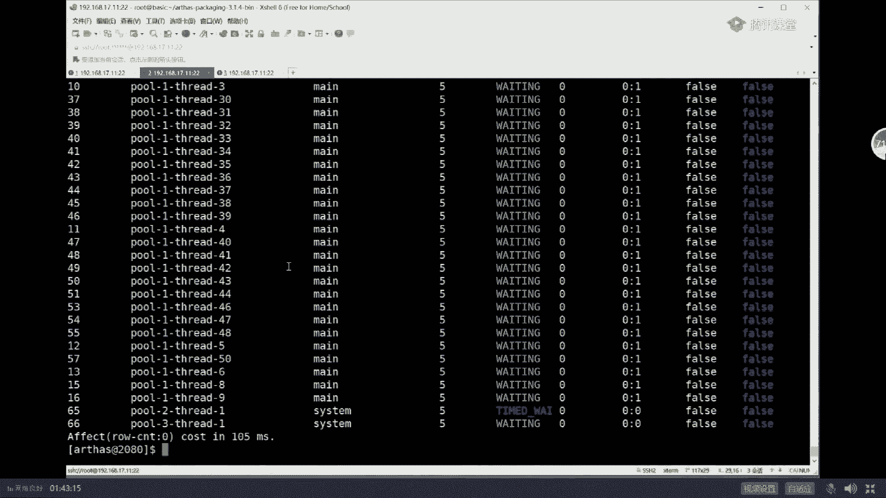

# 白嫖到马士兵教育价值23980的MCA架构师课程一次让你学够！ - P15：马士兵老师JVM调优：15.用jmap导出内存转储文件 - Java视频学堂 - BV1Hy4y1t7Bo

教大家在工业环境里头用比较先进的工具，好吧。杀戮苍重啥意思？呃，现在还没听懂啥意思是吧？好，我们可以继续了吗？来可以继续的给老师扣个一嗯。😊，嗯。

好，看这里我们来聊下面的命令。一般来说，像这种东西呢，我肯定会给大家总结出来啊。嗯。Yeah。嗯。来看这里，我们来聊下一个命令，这个命令叫什么呢？这个命令叫Jt。

嗯。😊，Yeah。推边去。呃。这个命令呢叫jat，这个命令是非常有用的一个命令。Jtjava的对战，把java对战的信息全列出来。1958飞如说。

好。由于他的命令非常的长。clere，我重新来一遍。Jt1958。more非常长，我一点点裂给你看。

回说。

他这里面列的是什么呢？列出来的是当前我这个进程里头到底有哪些个县城。

每个县城的名字是什么？它的编号是什么？它的优先级是什么？它的状态是什么？看这是attach listener，这是是那个我们整个这个程序自带的那个attach的那个现程。

第二个呢是tol1杠thread50，这明显是现成池里面的名字是吧？编号是多少？那么它的状态是什么呢？它的状态叫time waiting，这什么意思？它正在等待某把锁。

pu one thread49又是一个。如果你往后读，一定还会有p one thread48、47、46、45。总而言之，一大堆的线程。它会把每个县城里面线成名字线成状态，线程优先级。

以及这个现城的调用的里边的tack stack trace。

县城调用的这个级别全都给你列出来。就是这个这个线城里面正在运行的是哪个方法，哪个。然后这个方法调用了哪个方法，这个方法又调用了哪个方法，A调了B，B调了CC调了D啊，最后是哪个方法在最头上。

th run调用了这个调用了这个调用了这个调用了这个一直调到un save park方法。而这个pa大家都知道。它是一个阻塞线程停止了，它为什么停止？是因为它wa了一个。

锁here这个锁的编号0X什么什么9999CB8。这块还能跟上吗？同学们。能跟上的给老师扣1。嗯，可以是吧，good嗯，小左右你还能跟上吗？双井军嗯，不错。那么大家你想一下。

这个命令既然能够把每个县城的名字，每个县城的这种。状态每个县城是不是正在所等待等等成以列出来。那这个命令有什么用呢？听我说。

对，这命令的作用呢。第一个查死索。

但是我们程序现在没有思索啊。第一个查死锁。第二个，这个命令还能查什么呢？其实能查哪个县城占的CPU比较高，我一会儿给你演示，不着急。所以这是一个非常有用的命令。

在面试中经常会问到有一个问题叫假如你们家系统CPU突然飙高，你该怎么排查，这是经常面试官会问的。排查方法是什么？这 stack命令是你第一个要考虑到的。好，大家看这里讲到这儿呢。

我我想稍微扩展一点点小小的知识。同学们啊，我不知道大家有没有读过。阿里的它的命名规范，我不知道大家有没有读过，我把它调出来，让大家看看。

阿里的命名规范。

S out the books。这个里面。嗯。呃。阿里的命名规范。Here。

哇。

好，看这里。哎，你倒是拖过来啊。嗯，这个是阿里的阿里的代码的规范的第三版呃，sorry sorry，不是第三版，11。1。5版，除了出了几册了，这个叫华山版，它每次就一名的最新的好像泰山版。

我们不管它叫什么，我们来看一眼它的第六部分的要求，并发处理。在并发处理里面呢，它说创建县城或者县城池的时候，请指定具有意义的线程名称。

所以同学们，你们想想看，小伙伴们，刚才我写的J stack里面，你看像这种现成的名称，这合适吗？

考虑一下为什么阿里要求必须得具备有意义的签程名称。

松山版出来了是吧嗯。为什么？就是你一看这个名称，你应该知道你这个线程主要的工作是什么。假如你定位是这个线程出了问题，它主要在消耗CPU那么它的业务逻辑是什么？你看这种名字你能看得出来吗？你看不出来。

所以你应该。在你起线程值的时候，定义线程池里面的每一个线程的名称。那现在问题又来了，你们知道现程池的名称，现成的名称怎么定义吗？必须自定义threread factory，这个有点远了。

这再说吧，我们今天毕竟。对，因因为你们什么都不知道。算了，我们我们还是聚焦我们的主页。我们今天主要是干嘛？主要是定位问题的啊。😊，呃，我刚刚交了交了这么几个命令了。第一个呢叫JPS，第二个叫JNfer。

😊，第三个呢叫J stack。好，还有一个很重要的命令叫jam。关于Jm，我一会儿讲给大家听。这个命令呢是呃其他的自自自自动化的自动化的这种这种程序，不能够完全替代这个命令比较重要。我一会儿讲给大家听。

那么还有一个命令呢叫jastate，我不想讲了。因为这东西呢很少用，他给的数据非常的难看，不想用。好，到现在为止，我呢想教大家呢在我们实战环境实战之中，也是我们的小伙伴，也是很多人在生产环境中用到的。

自动化的工具叫asses。在在这儿啊在介绍阿之前，我想先介绍几个大家喜闻乐见的，大家更愿意看到的这种工具。大家看这里啊。

呃，你呢？

如果你安装了java。你应该在你的java的安装目录目录下面，我这是C program filesjava JDK的1。8。0BIN目录，你会找到JDK自带的一堆命令。比方说app viewer等等啊。

JAB啊，java点EXE也在这儿。我们刚刚执行的像是像像像像像是什么Jinfer啊，Jm呀，好，全在这儿。这里面有一个大家喜闻乐见的，有两个工具啊，这里是jat，对吧？其实我们执行的就是这个命令。

这些全是java自带的。😊，大家喜欢乐见的有两个工具，第一个呢叫J console，就是这个。G console。当我们双击它可以运行，它运行起来之后，你发现它是一个图形界面，哇，太帅了，对吧？

谁不喜欢图形界面呢？命令行还得记多难呀？好，这是第一个。第二个呢，比Jconl更进一步的是另外一个图形界面的工具。这个图形界面工具叫J V VM双击运行单。好，大家看这里，这里呢也是一个图形界面。

但这个图形界面呢实际上比Jcon呃用起来更方便，更好使。而且这个图形界面一旦启动之后，你会发现它会自动的找到你当前系统里面有哪些个运行的java进程。我这里有goland，有idea，有那个vi VM。

它自己它自身。然后呢，你随便比方说我点开一个呃java的进程，然后你就可以观察它里面的内容。嗯，哪些参数给你列出来，对吧？系统属性哪些全给你列出来，就是这infr的命令用到的东西嘛？

然后你可以对进行动态监视，嗯，用了哪些内存了，内存的多少用了哪些CPU了。😊，你还可以观察它到底有哪些个县城，每个县城现在现在正在消耗的这种呃呃呃呃时时间量啊，哪个那哪个最多。

我们还可以进行各种各样的抽样。好，听我说。😊。

我相信绝大多数人都喜欢用这样的工具，没有人喜欢用命令行，对吧？没错，这是免费的嗯。

不我讲到这还能跟上吗？还能跟上吗？嗯，我刚才又讲了两个，其实我有讲了两个工具。第一工具叫jacon。我看刚才有同学就敲了啊，第二个呢叫做J呃vibM。😊，有东西肉老师，那你为什么不讲他？

听我说比这更好用的，还有，比如说japrofilr，这个是收费的，我不想讲的。你们家呃你你你你直收费还挺贵的。呃，你们公司如果说有钱土豪，那你可以去用它，没关系。好，听我说。

我下面要讲的这个呢叫做命令行界面，而不是图形界面。现在的问题就出来了，就是说一般的情况下，我们定位1个GVM的时候，可以用图形界面，可以用非常土的命令行界面。那么生产环境用哪个呢？我告诉你。

你跟面试官说说，我是用图形界面的某种工具把问题给定位出来的。面试官基本上就一种反应，一个大嘴巴子抽上来。该干嘛干嘛去嗯。ok。为什么为什么会这样？同学们，你们好好看，好好听。Yeah。嗯。

我知道网上有很多讲那个图形界面的，讲MAT的，讲Jhap的啊，讲各种各样图形界面的工具怎么进行分析的。我告诉你，你在面试的时候这么说，基本全完蛋。所以你不要不要不要不要这么说，我教你怎么说，同学们。

你们想想看一个有生产环境里面有多少人的生产环境。linux的程序，它还自带图形界面的，有吗？😊，自带图形的有吗？没有。服务器程序谁没事，还装一个图形的东西，图形的内裤没有有同学说老师。

我们不是不是可远程连它吗？没错，你说的非常对，而且我文档里还给你总结了，我告诉你各种各样的工具都可以进行远程连接。😊，但是有没有人允许？在你的服务器端开好多端口。给某个用户开权限，让你进行远程连接。

如果说你可以，那咱就咱就别说了啊，你你做的东西就是一个小屁项目，没见过大玩意儿，属于没见过世面的。对，小公司随便玩。当然我讲到这儿。你应该就明白了。正常的情况下呢，我们尽量的在服务端直接使用命令号。

我刚才讲的这几个命令行是咱们的最终的。如果说你连个其他的命令行工具都不让安装，那也没关系，就是我刚才给你讲的这几个命令GPSJ stackJJinferJ map就够使了，已经够使了。我告诉你。好。

听我说。如果你跟面试官说说，我用的图形界面，你一定能要圆的过去。同学们在什么情况下可以用图形界面呀？我告诉你一个比较牛逼的说法，就是哎你可以这么说。😊，我们公司是集群化环境，知道吧？

我可以对某一台机器进行熔断，熔断完了之后，专门对这台机器进行分析。我们是高可用的。大家伙环境都一样的。好，我对这台机器进行分析，先对它进行熔断。熔断完了之后，OK对它进行分析。分析完了之后定位出来。

大家伙再进行修改。😊，曜びは。你既然已经说出来，你是干过分布式微服务的环境的。第二个呢，你了解熔断的概念。第31个呢，你知道啊不能在服务器上装图形图形界面，你一句话就带出来了，你水平。

立立马把你的格调给拔高了，停掉这台服务器对其他服务器不产生影响。好。我告诉你，还有一种更牛逼的说法。更牛逼的说法是。资深点的面容官会问你，那我的大流量过来了才会产生问题。我大流量没过来的时候。

它不产生问题。好，你这个时候怎么玩？😡，还有一种叫TCBd。直接把每个流量都复制一份，复制到我的备用调试服务器上，我就分析这台。这块你能听懂就听懂，听不懂就算了。呃，spring说。

然后问你熔断这台机器怎么怎么熔断？😡，我们另外的课程是的，微分布式微服务，怎么熔断？很简单。这就一下就把你逼格带高了。呃，如果搞不定，采用另外的方式，你说我是在还有一种说法认真听。还有一种说法认定。

就是我是在我们上线之前，我机器还没有上线，我上线之前进行压测的时候。用的图形界面，这个完全可以。呃，这几种说法大家记下来了吗？嗯。好，我们可以继续吗？根据这位老师扣一嗯。哦。好，我们继续啊。呃。

下面我们来聊，估计他已经死了，我得重新起一遍。我们来聊呢优秀的阿里的开源的工具，一个基于命令行的，它叫做asses。再家看这里，我先把这个小程序给起来，然后我教大家呢下一个命令。

这个命令呢实际上你需要下载和安装一个工具。这个工具呢就是著名的ass叫阿尔萨斯。下载解压解压完了之后呢，大概是这样子的，最新的版本就3。1。7，比我这个新没关系，你用最新的版本就可以。CDA点。

在这儿我不太想讲说去哪儿下载，怎么下载，怎么解压这件事不想讲。

没问题吧。你说连这个都。需要老师讲给你听的话，你有点low。好，我不想讲，我就直接起。😊，java杠站它有好几种启动方式，我启动最最最常见的，然后那个。

保险的一种直接执行ja文件java杠站afs put点站回车。注意看这个时候offs已经启动了，它一旦启入之后，它就会发现在我们的系统里头运行着一个站外的进程，就是我们那个程序。

有毛病的那个它内部的编号是一在阿s内部的编号是一，它的进程号呢是2080。现在呢你要把ass attach上去，attach的意思就是挂上去，你现在这有一个程序，我直接把它挂上去，挂机挂上去。

然后观察它执行的过程，把asses挂上去，asses挂上去怎么挂敲个一就可以了，回车。好，当你看到这个界面的时候，达斯就已经进来了。关于asus怎么用asseus这件事儿，我教大家几个常见的命令。

好听我说。阿瑟斯命令有非常完善的文档，还是中文的。所以。以后大家在生产环境里头可以要求网管装这么一个简单的命令就可以，下载下来解压就就够了。嗯，看这里hel。

阿瑟斯最常见的命令有这么多。

命令非常多，功能极其强大。到现在为止，很多很多公司用的都是这个。

国外的那些开源的软件没人用，用的都是这个。

那好，我教大家几个常见的。

看这里第一个命令叫dashboard。但是不是仪表盘嘛？就是你你在那开车的时候，然后显示跟出来的仪表盘。

不是。注意它是模拟图形界面的。

咱们在我的呃微信里面跟刚才的同学交流的时候，他定位的时候用的就是这个。啊，Dashboard。dashboard会显示哪些信息，我相信大家一看一看就明白，拿拿大腿都能看明白。嗯，现城的ID号。

现城的名称属于哪个线程组，现成的状态，消耗CPU哪个县城正在消耗CPU。所以这里呢。那个面试题你就可以答了。一旦CPU开始飙高的时候，你怎么去定位它？一定有某个县城在狂战CPU某个或者某几个。

这道题我需要完善讲给大家听吗？想听完整的给老师扣个一，主要需要很多的基础知识，我怕讲我怕给你们讲了，你听不懂。好，听我说。好吧，能听懂就听，没有听懂的话呢。😊，很简单，就是你基础知识基础知识不够。

能听懂多少是多少，认真听定位一个。系统里面P这个CPU突然飙高。怎么定位？阿斯斯一把就能搞明白，就是哪个县城占的比较比较比较高，这是第一点。第二1点呢，听我说这个县城占的比较高。

一定开始分辨您老人家是业务县城。还是系统现成。当你看到这个线程是系统线程的时候，说明什么？你们想想。说明垃圾回收器在那忙忙碌碌干不了事儿，它占比比较高。好，如果是说业务线程，那啥也别说。

你看你业务现成的名字，赶紧查你业务现程里面有没有什么死循环呀这一类的问题，他在那里玩命的占CPU。不知道我说清楚没有。当然这里面有很多很多的细小的问题，比如它是GC的线程引起的CPU标高。

那它又分好多种情况。你老人家用的是哪种垃圾回收器？如果是PSPO是不是正常的产生的非常多，他已经忙不过来了。如果您用的是CMS是不是说我已经回收超了98，我都回收不过来了，整个呢基本上就全当掉了。

就开始报那种。非常特殊的一种错误。总而言之，言而总之，定位很容易找困难，就是找问题比较麻烦。好，看这里，这是dashboard的，你能观察到信息。当然下面还有很多的信息。你比如说整个堆大小是多少。

用了多少，总共多少，最大多少？现在的U戏值我们占到了多少呢？54。68%。一点区占了多少？sliver占了多少？tenure generation就是我们的old区又占多少？n非堆内存。

我的直接内存占了多少，codec占多少ok它全都给你列出来。如果你观察我们现在这个小程序，你会明显的发现，注意看就这里的usage，我们的堆内存它是在不断的再往上再往上增，知道吧？就是你观察时间长一点。

你就会发现它在不断往上增。好，这时候你基本上就能够定位出来说有东西在吃内存。这一点上基本就能确定啊。嗯。当然还有一些其他的信息了，比如说我操系统名字，操系统versionionjava的名字等等等等。

这些就比较简单了，这是我的第一个命令叫dashboard。😊。

对，有同学说top是不是可以对，top也可以啊，top命令也可以。top命令是系统的命令，并不是阿瑟斯命令。呃，linux本身呢就带了很多很多的命令，比方说top杠AP。

They are going be missing。

Up garbage。先行先先调透了。呃，你也在这个命令里面，你也能呃深切的观察到，就是它的内存都在不断增长。我们我们稍微等一点点小小的时间，我们观察它一下。这是系统的命令。

这是lininux系统的命令，CPU占多少？然后呢，我的内存占多少？刚才是2%多，现在已经是22%了。😊，继续观察。我们稍微等一下小会儿。还那一点点。时间一长，你会慢慢的观察到呢，它会粘得越来越多。

22。啊，不动了。

我这应该已经到头了，我觉得好像是已经到头了啊，没有。来再来一下。

22。4哎。

不长了。

别着急啊，一会儿就找你。

因为这个内存设的稍微大了一些，所以它动作稍微慢一些。嗯。

windows环境。大哥，你从哪你你哪只眼睛看出来这是windows环境啊？嗯。22。5，它在缓慢增长呗，我就不等他了。因为等他的话呢，时间耗的比较长。呃，总而言之，言而总之。

你用这些命令去观察它的时候，你就会定位到内存在不断的吃不断被吃掉。

嗯。我不会lininux啊，嗯不会lininux的话，那不会特别爽吗？

不会就学呗，怎么着，你还说出来很骄傲的样子，不会lininux，你想说明啥？现在呢你看已经是58点多了，刚才是44440多啊，总而言之言而总之，我们是可以通过命令不断的能够。

呃，知道他在不断的吃吃内存。好，看这里。

再看这里我刚才交了第一个命令，叫做dashboard。呃，现在呢我再教一点其他的命令。

嗯，比如说我们来看这个这个命令叫JVM。

这边。这个命令会显示什么内容呢？重新再执行一遍啊。敲的比较快，GVM回收。等同于Jinfer那个命令，他会把整个的我们这个进程的所有的详细的信息全都给你列出来。同样的啊，也是说你你你你的参数是什么？

the class pass是什么？librry pass是什么？最重要的是呢，它能给你列这个玩意儿叫garbage collectors。不是有同学一直不不知道我自己的系统上线运行了。

那么他用的哪种垃圾回收器呢？你不是不知道吗？阿s装上一个命令，搞定他的命，他的垃圾回收器，像我们这个的垃圾回收器是什么呀？gbyic letterss年轻的co比。老年代算法这里说的是算法。

算法是什么呢？叫mark swift compact。下面是memory呃manager，下面是memory是是是是是多少，然后下面一堆的呃呃不太不太重要的一些信息。总而言之，言而总之。

这个东西呢就相当于J infer那个命令。这些命令相对用起来还相对呃比较简单一些。下面我我还我还教过大家一个命令叫jat，你还记得吗？那么如果你要用ass的话，它会达到比Jt更好的一个效果。

我们来看一眼。

这个命令是哪个呢？这命令叫做thread。threadread好，O就是就是他。

好的，看这里。thread回车。

thread围着之后呢，它会把这里面所有的线程全都给你列出来啊，然后包括CPU的使用，包括线程的名称，这个跟thisthis deck差不多。那有同学说老师他没有那个调用站的信息啊，没关系。

你如果怀疑这个线程，它的线程ID号是31，有问题怎么办？

Thread。跟线成号。

31。他会把这个31号线程。名称状态。

调用站。调用的站信息全部都给你列出来。所以这个是比Jt更好用更直观。除此之外，刚才我说，如果你要用Jt定位有没有死锁的话，你得去观察它现在正在等待哪个哪把锁有多少个线程，正在等待哪把锁，等待了多长时间。

然后你怀疑这里没有思索，再去找代码。但是如果你要用。阿瑟斯一个命令搞定，注意看。

Thread。help注意看，在thread后面可以跟参数，参数是什么呢？其中有一个参数叫杠B。刚B的意思叫fin the thread who is holding a lock that blocks the most number of threads来读一下。

看能不能看得懂。他说找到这个县城。他正在那持有一把锁。阻塞着大多数的线程，抢不到这把锁。而 find thread who is holding a lock that blocks the most number of threads。

Mmhmm。所以你在这里面找哪个县城，就是有没有死锁，一个命令搞定the red钢逼。当然我这没有啊，再跟你说一遍，这这个我们我们这儿我们这程序没有死锁。你要自己写一个思索程序，拿这个命令一把就试出来。

这比你拿肉眼找哪个刚才那个号是吧，0X什么什么要爽的多。不知道大家是不是感觉生活又美好了一些，有了阿之后，来能感觉到的给老师扣个一，感觉不到的给老师扣个。3。1415926开根号再开根号的值。

开个玩笑啊。五。😊，Ha。😊，好，我们继续。大听我说。下面我回过头来教另外的命令。另外的命令是什么呢？有一个著名的命令he尔。大家看这里。刚才我们我们我我们分析过啊，就是现在不断的吃内存。

刚才是22点多，现在是26点多了。

我已经知道问题之所在了。它在不断的吃内存，导致FGC。

永远回收不掉我想要回收不到我想要的那个空间。

那这时候怎么办呢？它就会不断的频繁的FGC频繁的FGC频繁的FDC那我一定得揪出来到底是谁在那里不停的占用我们的内存。

我再说一遍，由于我们的内存不断增长，并且回收不掉，所以才会频繁FGC。

听懂了吗？再强调一遍，再说一遍，因为这里面也是一道面试题，就是你遇到你的系统频繁FDC的时候，你该怎么定位？😊。

好。由于我们系统里头有人不断的吃内存，看到了吧？内存不断增长，并且我回收不掉，你会发现每一次回收回收掉的那点东西非常的少，几兆几十兆。我们是200兆的，回收就是回收到到现在为止的，一个回收个几兆的问题。

好，所以一定有东西在不断的赤我们的内存。

。