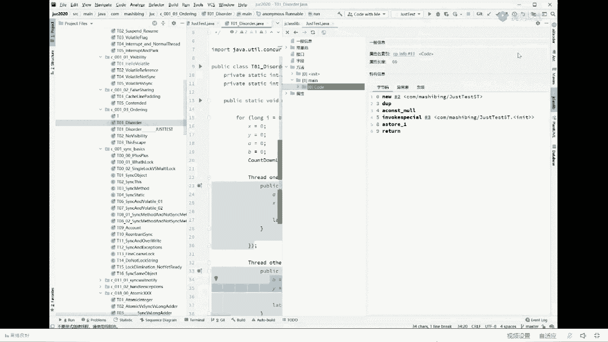

# 白嫖到马士兵教育价值23980的MCA架构师课程一次让你学够！ - P16：马士兵老师面试题：1.请解释一下对象创建过程？ - Java视频学堂 - BV1Hy4y1t7Bo

先说结论，当我们new一个对象的时候，分成两部分，第一部分呢叫new这个对象的时候，先申请空间，由于这个对象内部有一个成员变量小m当我申请完这个空间之后，这个小m的值是几，这小m的值是几。

记住虽然你看上去它的这个值啊是八，但是不好意思，当你刚刚弄出这个空间来的时候，这个值并不是八，这个值是一个默认值是零，这是在java里面为了安全这件事来，考虑到有同学指令重排，导致跟他说啥呢。

有同学可能会说了，老师这跟安全有关系，我给你解释一下背后深层的意思，好玩过c加加的小伙伴告诉我，当我在c加加里面new出一个对象来的时候，这个对象里面的成员变量，这个值是几。

比如说它有一个x这个x值是几，这是几十几啊，是空里扯淡呢，c加加对象，我说的是c加对象，记住这个x的值是一个遗留值，天尊霹雳人已死，是被人遗留下来的，好吧，这是一个遗留纸，什么叫遗留纸呢。

就是上一个程序也用过这块空间，它在这里面留下了一个纸，所以这个值呢是不知道的，是不了解的，是不清楚的，当你有了这个值之后，如果说呃你忘了给这个值-1个初始值，你比方说你本来想把这只变成零。

但是呢你忘了给它-0，这个值这个x值就说不定会是几，如果这正好是个指针的话，也就是说你说不定会返回到内存里面的那块空间，这叫不安全程序，很容易崩溃，本来那块空间不让你访问，结果你关机一下一访问。

不好意思，内存一出，内存访问不了内存指针类型错误攻击，你的程序就崩溃了，就蓝屏了，来这块儿能听明白的，老师扣个一，所以这就很危险，回忆刀了是吧嗯，想起来了对不对，所以java设计就不一样了。

java设计是这样的，当我们又出来个对象的时候，java给每种不同的类型都设了一个默认值，就是你先用默认值把原来那个遗留值给它覆盖了啊，印度类型是零，所有的数值类型都是零或者零点，所有的引用类型都是空。

所有的布尔类型都是false，总而言之，言而总之，在java里面都给他附了一个默认值，有这个默认值的存在，你就不会乱用你的值了，你就不可能访问到你不想访问的地方来，可以继续的给老师扣个一。

所以所以当我们列出来一个对象的时候，这个对象里面的成员变量它有一个默认值的存在，叫做零，那什么时候它才会变成八呢，只有在调用了构造方法之后，也就是说new对象首先给它来个默认值。

然后呢调用这个对象的构造方法，还记得我们另外一个对象会自动默认调用它的构造方法，对不对，good，只有调用完构造方法，他才会把这个值变成大，ok当我变成八之后，还需要做一件事。

t小t等于6t我这个小t是要是一个指针啊，我这个指针得找找着这对象啊，所以还需要干这么一件事儿，他需要建立关联，回想一下三步构成，第一步，申请空间，默认值怼上去，第二步构造方法调上去，第三步建立关联。

这块能get到的，老师扣一三步构成，有同学说导致这三部我们能看到吗，其实也是可以的，讨厌第三步，你想看到怎么看，这样来看t小t等于6t，跑一下run，拔掉之后呢，观察它生成的字节码。

view so bad code with declass library，呃，这个插件呢你可以自己去下载，你也可以用手by code，那个比较难看一些啊，你可以用这个插件来做这个插件。

叫j class library，走，你，他会帮我们观察到你的这个main方法会生成了哪些个，java所调用的这些个指令，指令集，这个东西呢相当于，这东西相当于什么呢。

呃这东西就相当于那个我们的汇编语言，java的汇编语言，同学们，你们看到这个a const，a a connow呢，这是由于内部类的存在才会有的，我先不管它，你会看到它有这么几步构成，第一步叫new。

第二步叫duplicate，第三步呢叫inbox special，第四步叫a store。

第五叫return，这个过程呢我在这里头都给大家画出来，汇编码是这样的，首先是new new是什么意思，申请空间new的意思就是申请空间，申请好空间之后，给它附一个默认值，只有调用这个的时候。

这条指令的时候，这条指令叫invoke调用special叫特殊调用，特殊调用的是哪个方法呢，是t的initialize方法，也就是构造方法，只有执行到这一步的时候，它才会变成八。

然后呢到期啊才会a store，a store的意思是建立关联，就是t和整个对象建立关联，再看一遍，当我们执行到这条汇编码new的时候，申请一块空间，但这个时候它的值是默认值是零，调用构造方法完成之后。

复制为八，a store建立关联，记住了吧，脑子给我记住，记不住的话，你第二题是答不出来的，就不给他干啥呢，我不想跟你解释那么多，我们抓主线吧，dug是在整个运行的占空间上，刚刚弄出来这个东西。

在上面复制一份，为什么，因为in vox special需要把这个东西弹出去，不费电话了啊，公开课不给你讲这么细了，太跟你讲这么细的话，很多人是跟不上，听我说听我说。

但是呢java对象有一个很好玩的东西，sorry，java的程序有一个很好玩的东西，呃解释这件事情好困难呐，莫急，我们给你解释，我就给你纵横捭阖的。

想起想起哪儿讲到哪儿好吧，我还得再打开一个ppt。

并不是高并发的啊。

稍等片刻啊，找一下，嗯，我那个我那个给你放在了哪个ppt上，主要是不给你打印的ppt吧，给你解释起来比较困难，讲一堂公开课，我容易吗，我。

是已经打开了吗，哈哈，是已经打开了吗，多线程与高并发。

你好好听，认真听啊，那个，这里面有个小小的问题，就是并发编程呢有就有这么几个特性，一个叫可见性，一个叫有序性，嗯因为美团的这个问题啊，它主要就是牵扯到了有序性的概念，这个有序呢相对来说比较恶心。

尝试讲啊，看你能不能理解，有序，我们尝试讲这个问题啊。

看看大家是不是能理解，好听好听，我说啊，呃我先问你问你这么一个问题，这个问题是说程序真的是按照顺序执行的吗，什么意思，比方说我写了两句话，呃，我们自己写程序的时候说x等于x加加。

这两个一定是按照顺序执行的吗，然而并不是啊，这两个是这两个式啊，好这两个呢x等于一，y等于一定是按照顺序的吗，我告诉你为b仔细听我说，你看到的程序未必是按照顺序执行的，仔细听我讲啊，我再说一遍。

你看到的两个程序，虽然说这句话写在了上面，这句话写在下面，但是他未必先执行上面那句再执行下面这句，有同学说，老师啊，还有这件事情吗，是的，我给你开一个程序。

就这个小程序，看这里这小程序呢是一个很小很小的小程序，这个小程序一共有四个值，这块儿先说结论，绝对不是按顺序执行好，我们读完这个小程序，我们来运行一下，你就知道他为什么不是按照顺序顺序就行。

我先让他跑起来，避免一会儿出不了结果啊，看这里这小程序又干了一件事啊，干了一件什么事呢，我有四个值存在，这四个值分别叫做xy ab，最初始值全是零，所有的全是零四个零，然后我用一个for循环。

这for循环呢每一次循环我都起两个线程，这是第一个线程，这是第二个线程，第一个线程干这两句话，a等于一，x等于b，第二个线程干这两句话叫b等于一，y等于a，我们现在假设所有的程序全是按照顺序执行。

首先执行a等于一再执行x等b，这边呢一定是先执行b等于一再执行y等a好两个小程序，我讲到这儿，大体的语义大家看懂了吗，看明白的同学，老师扣个一，起码这块你应该看明白了，同学们你们琢磨一下啊。

我们如果说永远按照顺序执行的话，由于是两个线程互相之间有可能穿插交替执行，所以我们最终的执行的结果，他这四句话的执行顺序有各种各样的排列组合，什么样的排列组合呢，比如说啊一个程序先执行完a等于一。

x等于一，然后再执行b等于1y等a这是一种执行顺序，这种执行顺序我们来看一下a等于一，后面y等于a那y的值最后的结果一定是1x等于b，因为刚开始b等于零，所以x等于零，好这个推导过程很简单。

当然除了这种可能性之外，它还有一堆的可能性，我在ppt上呢给大家画出来了各种可能性，这种可能性啊，第一个可能性就是这种执行顺序，那么最后的结果是x等于零，y等于一，如果是下面这种顺序。

最后的结果是x等于一，y等于零，如果是这种顺序是x等于一，y等于一，如果是这种顺序都是x等于一，y等于一啊，这种的也是这种的，也是听我说你所有的排列组合排列完成之后，你绝对不会发现x等于零。

y等于零的情况啊，这个推导过程大家是不是能理解了，就是总而言之，我们首先假设反证法，反正法我们是按顺序执行的，按顺序执行来说，它最后的结果绝对不可能出现的结果是什么呢，就是这种情形，i等x等于零。

y等于零，好这块能get到的，给老师扣一，因为这会牵扯的知识非常的多啊，所以你集中精力认真真的听，至少我打开你的整个知识的这种这种这种这种呃，面宽好吧，嗯把你的知识面给你打开，那好当你理解了这件事之后。

我们再来看这个执行的结果，刚才呢他就一直开始运行了，我们最后执行的结果，看看到了吗，a在我们循环到第669232次的时候，出现了x等于零，y等于零的情况，那是什么情况下才出现x等于零，y等于零啊。

什么情况下你会发现啊，根据排列组合，你会发现只有这一种情形，只有这种情形，什么情形呢，就是第一个线程先执行了x等于以后执行y等于，同时呢第二个线程先执行y等a后执行b等于一。

只有说这俩这俩哥们儿排在这俩哥们前面，知道吧，才会出现x等于零，y等于零，所以你会发现如果是这么来执行的话，这两个换顺序了吗，你看人家原来写的顺序是什么，a等于x等于b吗，这个明显跑前行了。

不仅这个跑前面去，与此同时，另外一个也得同时跑前面去，才会出现这种情况，所以我们从程序上就能够证明一点，cpu内部执行的指令也好啊，语句也好，他绝对有可能是换了顺序，我通常我们称之为叫乱序执行。

来这是结论，我擦这一段没听明白，大哥你还没听明白，没听明白就记结果吧，听明白的给我扣个一，没听明白再给我扣个二，我看看，一多二少，给那个二呢，我给一分钟解释时间，这个小程序很简单。

就是我们通过一小段证明，我们首先假设两两条语句是按照顺序执行，那么最终的结果一定不可能出现x等于零，y等于零，根据反证法最后的结果，我们出现了x等于y等于零，那么只能说明一点，x等于b跑a等于前面去。

y等于a跑b等于前面去，至于刚才的排列组合是一种数学上的东西，你听不懂就算了，大体的推导过程就行了，总而言之，言而总之，当你理解了这件事之后，先记得结论好吧，这里面细节很多，但是我想让你先记住结论。

总之一点，两条指令在cpu内部执行，可以换顺序，也就是说cpu内部是乱序执行，当然它有规则啊，叫乱序执行，一会儿我们聊规则，有时间的话我们聊规则，好嘞好，当我们理解了这件事情之后。

我们再来看第二道题。

看第二题。