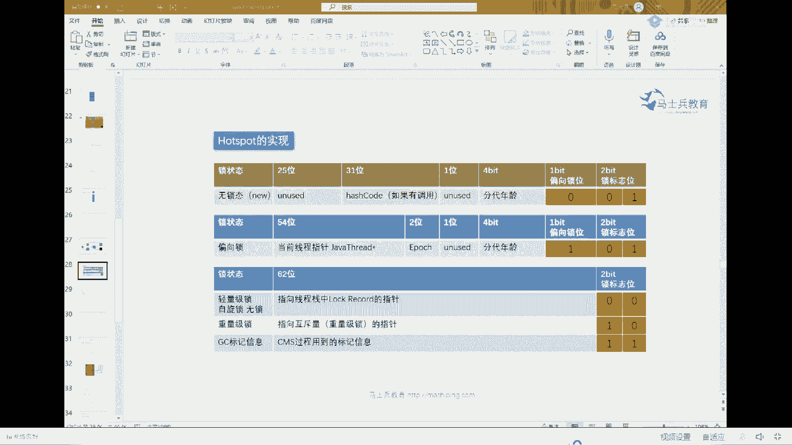
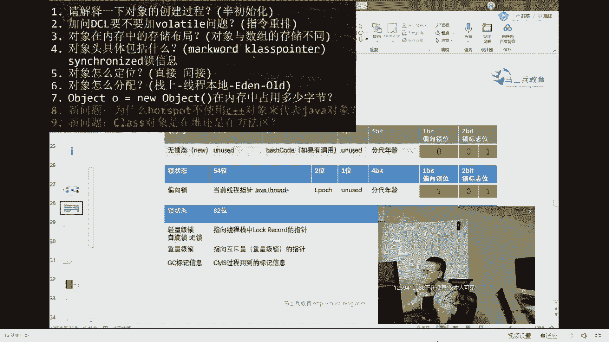
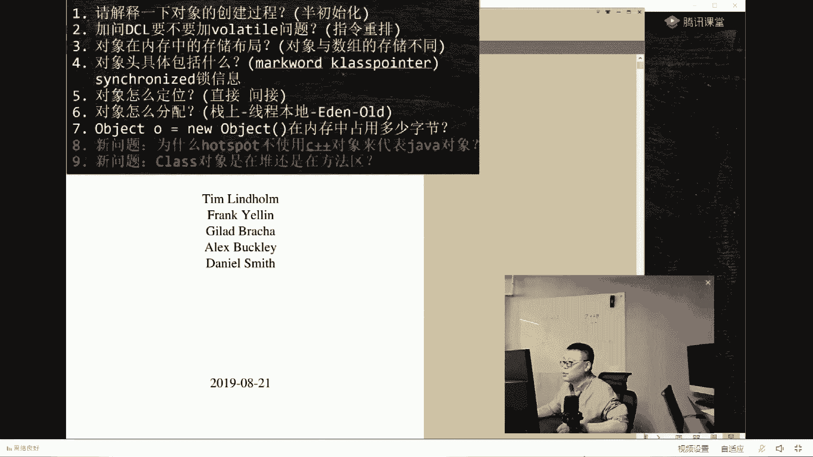
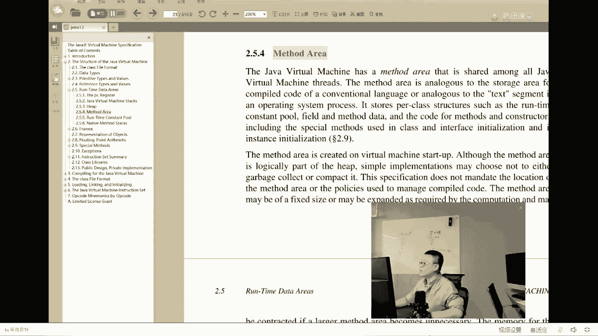

# 白嫖到马士兵教育价值23980的MCA架构师课程一次让你学够！ - P17：马士兵老师面试题：2.加问DCL要不要加volatile问题？(指令重排) - Java视频学堂 - BV1Hy4y1t7Bo

整个的他的一个流转过程。S1S2为啥要来回倒腾？如果你不倒腾，你不就直接进老年代了。嗯。好。我讲到这之后呢，我们再翻回头来看这个mark word。注意这mic word里面我说了，记录了GC的信息。

DC信息呢实际上本质它记了两种。GC信息里面它记了两种GC信息，一种是正在回收过程之中，您老人家是哪个颜色的哈，记录了三色标记的信息，还记录了哪个信息啊，文带年龄。在这。三代年代的意思是说，回收一次。

这里原来是0000，回收一次加个一，回收一次0010，再回收一次0100。好，总而言之呃，sorry0011啊，再回收一次。总而言之呢，每经过一次的回收，它这里就加个一什么时候变成1111了。

再经过回收。不好意思，进入老年代。也就是说你看这个分散年龄的时候，这个分担年龄最大是多少？回大是多少？最大是。111等于15吧是吧，这是最大。好，默认值。在垃圾回收器是，PS加PO的情况下就是失5。

在垃圾回收器是CMS情况下，这个值是6。这是默认值。OK。好了。gar it嗯，有同学已经ga it了，那么其他同学有没有ga it的？😡，来。收到了给老师你嘎来的。嗯。呃，现在为止人能跟上是吧？嗯。

对，不错。

呃，我们再来看这个题，我们回答了几个了。三四标记干嘛呢？三次标记是用来做并发回收用的。解决并发回收中间的错标和漏标的问题。另外的问题啊。那个。啊，我们现在明白了第五个问题和第六个问题了。

对象的门分为两种直接和间接。第六个问题叫呃。战上和现成本地的这样的一个分配过程啊。OK我们现在还遗留的呢，实际上是第一个和第二个问题，以及第8个和第九个问题。

那么我们来来看这个我们先来看这个第八个问题吧。这个问题啊大家听我说啊，这问题呢。呃，我讲一遍。能理解就理解，理解不了也没有关系。😡，好像除了但某些特别变态大厂问这个问题之外，其他的一般不问。😊。

C加加这玩意儿，因为很同学不了解C加加。C加加的对象有一特殊的东西。C加加的对象有一个特殊的东西，这个东西叫vetutable。Where word word word。T table。叫虚表。

这个对象这个东西呢是装在对象内部，用来实现呃多态的啊叫vertable。由于有这个虚函数表的存在，所以每个CI加对象如果用它来代表java对象的话，它会个特别大个。虚函数表对远古的回忆。没错啊。

你要是上学的时候学过C讲，你就应该能想得起来。

所以这个东西呢，你知道有什么回事儿就成，好吧。😊，一般来讲啊。就是由由于有虚函数表的存在，所以C加加对象的大小要大于java的对象，能听懂吗？就是同样的东西，你用C加加来做的话。

这个对象大小要比java对象要大。所以呢。不用他。真正的里边呢是把那个虚函数表在java内部呢，是把它呃是是是放到了整个机制里面，并不是放到对象里面啊。OK所以呢一般我们不用CIA对象，而用什么呢？

叫OOPclass2元指针就什么意思？就是专门有一个数据结构，用代表我们的摘va对象。然后呢，把这个java对象所属的那个class对象单独给它拎出来。我们要找对应的虚函数的时候。

去哪儿找去这个class对象里面找，而不是记录在自己的内。嗯。OK这块呢能听懂就听，听不懂就不让他过。因为有些问题不是说我们所有问题全都答出来啊，也没有也没有这个必要嗯好。我们来看最后一个问题啊。

就这个要命的问题，这个问题是这样的，叫class实力，究竟是放在met area，还是黑，是放在方法区还是在堆？如果说我不跟你讲之前。你所有的回答应该都是这个叫方法区。class对象嘛。

我们说方法区里面装什么呀？方法区里面装的方法区嘛。装的不就是col的信息吗？以前是不是是不是这么认知的，没有题吧。😊，来，这块儿有没有问题？稍微有点基础的小伙伴们给我回答一下。

以前你们认知的就说class class的信息类的信息不就装在方法区吗？有时候方法区还会溢出，对不对？方法机不是放方法的吗？子龙，你那个你你已经我连续问了两个问题，我都注意到了。

但你你问的两个问题都是特别特别特别弱的问题。我希望你慢慢先补基础，补好基础之后再来问问题，否则你问的问题都不在点子上。😡，OK听我说。这里面有几个概念，我稍微给你们纠正一下。第一个概念呢叫做。永久区。

叫永久带啊，原来的原来的称呼。它叫做perman area。Permanent。Area。第二个呢叫原数据区叫matspace。哦，这两个东东。是同一个东西，这两个东西统称叫方法局。

方法区可以认为它是个接口，这是1。7的实现，叫永久带，这是1。8以后的实现，叫原数据区。再说一遍，这两个东西都叫方法区域，1。7之前叫永久带，1。8之后叫原数据区。好，这个概念听听懂了吗？把它记住。

所以以后我说方法区指的就是永久贷或者是原数据区。嗯。啊，大家理解这件事之后。自己听。拉s水力到底放在哪？g实力实际上是这么放的。由于在ht store里面使用了OOP class的2元模型。

所以你就会发现。啊。C加加的用来代表java的那个对象。他呢实际上是放在了方法区，是放在这儿的。而这里面有个指针。通过这个指针，才会找到我们的class对象。

而这个class真正的class对象放哪了呢？放在了我们队里面。为什么放在堆里面？因为我要用到反射。我反射的时候，如果还要去找C加加对象，太麻烦，我直接在我的堆里面就能找到我们的class对象。

再是再看一遍，我们扭出来的任何一个对象大O，这是大O对象。真正我们以前啊说你指向你的class在哪呢？你直接一个指针指过去。但是本质上的指针是这样的。首先指向一个C加加对象。CI对象里面又有个指针。

指向我们的java对象。C加加对象放在方法区java对象放在堆里面。这个能听懂就听。听不懂就算了，这两个呢稍微麻烦一些。好你。讲到这里为止。除了前面两个问题。第一个问题跟第二个问题，后面3456789。

我就全讲完了。原来编程的本质是指针，哎，懵了就蒙了啊。没关系啊，八九两个问题蒙就蒙，没有关系，放过嗯。1。8还有方法去吗？你怎么这么这么轴呢？我刚才说了半天，方法区是一个统称，1。8之前。

它的名字叫permanent area。1。8之后叫met space。你说一。8有没有方法区？方宝军是个逻辑上的概念。怎么这么这块还还有谁有问题了？有问题，我就给你打开原来的最早的。

最早的我们最最最原始最原始的。

他的出处在哪里？如果你想透彻理解Java虚拟机这件事。这个东西呢。当然你就不用读了，老师帮你读过了。这本这本书叫java in thespecation。完全需要设计虚拟机的人才会读这本书。

因为这本书叫做java虚拟机的实现规范。做java虚拟机的人，必须按照这个规范来。在这个规范里边。他详细的定义了说the structure of the Java machine。

你的ja machine呢。结构到底什么样？这其中呢。有几项。叫runtime的。d area其中有一项叫ve area。好。据我说没有什么permanent data，也没有什么met space。

只有一个叫法叫met area，叫方法区。好，方法区在1。7的时间叫permanent data，叫永久的啊，permanent。permanent generation叫永久带。那么在1。

8之后叫macspace叫原原数据区。能理解了，你看看这里面它的结构里面根本就没有任何的说什么。你这个这个永永久的原数据区的概念，因为这两个概念都是一个概念，叫ma areaia。

OK。嗯。好嘞好嘞嗯。呃，记住啊，别人没有人问你这个问题的时候。你就按照我们原来的回答，一个指针指过去就行了。只有有人问你这个问题，你才把这个图画给他。好，我们来聊最难的两个问题。讲到这儿来还能跟上。

那老师扣个一。