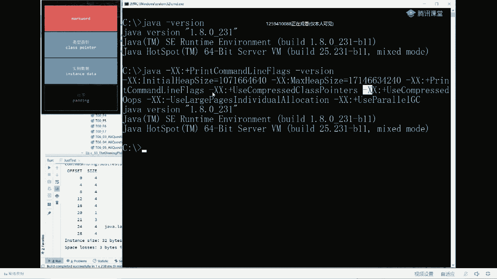

# 系列 2：P18：马士兵老师面试题：3.对象在内存中的储存布局 - Java视频学堂 - BV1Hy4y1t7Bo

你就挂在挂钩了，它是什么样的呢，分成两种情况，第一种情况是普通的对象，很简单的普通对象，第二种是数组，我们先看普通对象，大家听我说普通对象你就记住，背过就完了，这是面试的高频题，大厂很多都闻好。

普通对象呢分成四部分，记住背过，第一部分叫mark word，不好翻译，你就记住他叫mark word就行了，这部分呢是八个字节，第二部分叫class pointer，这部分是四个或者八个字节啊。

一般说开启压缩之后呢，它就是四个就行了，好吧，你就记住是四字节，这部分主要是什么呢，这部分主要是class pointer，是说我弄出来这个对象到底它指向是什么样的，class。

是属于哪个class的对象，比如说我们new的是xx，那么它指向的就是xx。class好，如果我用的是t，那么它指向的就是t一点class好，如果我指向的是object，如果我用的是object。

那么它指向的就是object的点class，然后叫实例数据，实例数据叫instant，这是什么意思，比如说我new了个t，它里边有个成员变量int age，好，这个age这个对象放哪，放这里。

instant data一个对象内部的数据成员变量，最后一个叫对齐，为了让我们的数据对的比较齐，装卸起来比较方便，比如说我们装货的时候用集装箱大小一样，我们装卸作为装货单元，卸货单元装起来就比较方便。

所以让他们对齐，把数据对齐，数据怎么对齐的，如果整个的对象的大小按字节数来说不能被八整除，比方说前面三个加起来12个字节能被八整除吗，不可以，那怎么办，后面补上补多少，补偿能被八整除为止，加个四。

从12放到16÷8÷2，ok先背过同学说，有同学可能会说，老师这东西我能看得到吗，你可以的，我先把这个图放你抓下来，然后我们对比着看，我们有一个普通对象的时候啊，它就是有这么几个好，大家看这里。

呃直接敲代码做实验好吧，我们定义一个自己的class private，std class，我们就叫t，小t小t等于，ut，然后我们六个这个t来之后，我们先看一眼这个t呢在内部到底是怎么布局的，怎么做呢。

通过这样的一个插件来做这样一个类库，这个类库的全称j o l，它全称叫做java object layout，java对象布局，那么这个类库是来源于哪，你百度1下，随便百度1下就知道。

我就在这里不展开了啊，不展开就是怎么把这类库给引入进来呃，怎么装到main里啊，就不展开这个这个这个玩意儿了，那么大家听我说啊，就这个类库呢是著名的open jdk旗下的一个类库，ok我们怎么用它。

用它这个类class layout，点二class instance class liu class的布局是吧，然后pass pass是解析的意思，instance是对象的意思，解析某个对象。

解析哪个对象呢，解析小t这个对象解细胞的结果呢，把它转成to principle，叫做转成可以打印的格式，然后把它打印出，到现在为止能跟上的，给老师扣一没问题吧，比较简单，好好看这里啊，ok ok。

我插播一个小问题，主要因为呢daydream白日梦，这哥们问的问题比较典型，他说为什么是八字节对齐啊，而不是什么64字节对齐，因为八字节是多少呢，是64位，我们的虚拟机来说啊，八字节是64个比特。

那我们虚拟机所说的64位，64位虚拟机是不是就是64位啊，一次性存取64位，对他来说是最方便的好吧，所以呢它是八字节，也就是64位对齐，而不是64个字节对齐，听明白这件事之后呢，我们来继续看这个问题。

t小d等于new tm把它打印出来，对照这个来看，跑下看我走，你，好了你仔细看他把这个t这个对象给你分析了出来，前面第零个数，后面四个从0~4，这四个字节是我们的对象，头叫object header。

从第四个字节往后又数四个字节，还是我们，ohater，刚才我说过mark word这部分一共有八个字节，所以这里代表的这里，这里就是mark word，这八个字节就是mark word，一个字节。

两个字节，三个字节，四个字节，这就是具体的那个零一的表示这些个唉，这里表示的就是mad，那么第二个部分就还记得吗，后面四个字节是class pointer是吧。

class pointer指向的是到底哪个类的对象，是那个那个那个那个类的指针好，就是它，所以这四个字节通过他这内部可以找到谁呢，找到t。class，好最后四个是什么，最后四个是lows。

就to the next of the loyment，下一个对象由于对齐的关系，所以这里头是丢失的，也就是补齐用的，所以来看一眼mark word，你看到了类型指针来pointer。

你也看到了实例数据呢，由于我们这个t没有a，所以呢你是那他看不到他的啊，然后对齐你也看到了好，当我讲完这小段之后呢，再来看美团问题里头的这个问题，看看大家是不是能答得出来了啊，好看这里我们对照这个。

我们把美团的问题贴在这儿，来告诉我美团问题，解到这个问题说object o等于new object，内存之中占多少个字节，这件事能答出来了吗，告诉我一下缓存行64g，那是缓存行，又不是对象。

缓存行跟跟java对象有什么关系吗，本身它是硬件级别的，想多了啊，ok ok好嘞，16 16啊，可以可以可以来我们试验一下吧，到底是不是16呢，其实确实是16，你拿大腿想一想也应该知道，不做这实验。

你们自己下去做，你想啊，我说过了，前面八个字节mark word是必须的，后面四个字节8+4，这四个字节class pointer是必须的，但是of vide内部有成员变量吗，没有，所以第三部分加零好。

最后一部分前面12不能被八整，不能被八整除怎么办，再补四个，所以一共是16个字节，那好了，讲到这儿，我再问大家一个问题，如果我在这里写int来告诉我这个对象多少个字节，哈哈好一下，看怎么还有说八字节的。

这怎么可能多少个字节啊，记住这个a是多少多少个字节啊，int类型四个字节，对不对，看这里前面八个字节mark word少不了，后面四个字节，class pointer少不了，所以前面12个字节是不变的。

下面呢是我们的instant data，也就是这部分实例数据，现在我们这个类里面有成员变量了，所以呢它的这个成员变量就装在我们对象里了，t。a对象默认值是零，ok所以这里头呢是实例数据就出来了。

整个加起来是六个，来再来一个，我在这里写in the b告诉我多少个字节，怎么还有说32的那大腿，琢磨琢磨前面12个必须的，a占四个，已经16个了，b又占四个，已经20个了，20个能被八整除吗，不能。

所以呢再补四个，看一下看一下，a占四个，b占四个，前面是20个，不能被八整除，再补四个，不累flag，老汉告诉我这个这个占多少个资金，这就有点难了，一个真的别聊啊，别瞎聊，看这里。

首先你要理解布尔类型占多少个字节，布尔类型在java内部只占一个字节，所以前面几个加起来八个，mark word，四个class pointer，12个，a a占四个，b站四个，所以加起来是20个。

布尔类型占一个字节记住，所以是21个，补三个，24个，再来一男的，这个就真的有点难了，string，等于hello来同学们这个对象占多少个字节，好好想认真想，有时候24有说32的美团p 10有你。

看结果，好一共占32个，想想为什么我们来分析一下，刚才说过前面12个不变，这是我们的对象头叫object header，接下来a占四个，b站四个int类型，布尔类型占一个，但是呢我给他补三个。

所以它也占四个，一般来说我们所谓的布尔类型，bt类型，short类型都要转成int类型，还记得吗，怎么转的呢，就是给他补三个字节，这么转，这叫内部对齐，然后它也是一种alignment。

它也是一种ping，但是呢它叫内部对齐好，接下来关键是占占这个string是占多少个字节，大家跟我说，大家听我说这个离这个概念的理解呢，呃不太不太不太容易，尤其是对那些基础比较差的。

呃我我呢先我们先看结论啊，先看这里这个string呢它是个引用，有同学说老师他是个hello啊，这个字符串不应该放在这里吗，不是string，是这个类的成员变量，这个hello是另外一个对象，还记得吗。

它应该是放在常量区的，对不对，他应该是放在另外一个地儿的，所以说根据这里的这四个字节可以找到那个hello，它是另外一个对象，它是一个字符串对象，所以说它跟它这个字符串对象。

跟我们自己的这个t对象没有半毛线关系，这里存的只是一个指针，这个指针的长度是多少，四个字节，四个四个四个四个四个四个462 14，再加四个30能被八整除吗，24 28啊，再加四个28能被八整除吗。

不可以，所以呢再补四个32个字节，当然这里头有一道触及灵魂的问题，这个问题呢其实我要今天要想把九个问题讲完，这个问题我不应该讲给大家听，尝试讲仔细听，认真听，讲到哪儿算哪儿。

大家看这里一个一个机器的指针长度是多少，一台机器的指针长度是多少，java虚拟机也是一种虚拟机吗，指针长度是多少，由什么来决定呢，就看你这个机器，通常我们俗称的你的寻址能力是多强。

你的唉多多是多少位的机器，我们一般接触过的，你们可能没接过八位机，没接触过16位的机器，但是你们应该接触过32位的机器，现在目前用的最多的是64位的机器，所谓的多少位指的是什么意思啊。

小伙伴们指的什么意思，指的是寻址的能力，所谓寻址能力指的是什么呢，就是我64位能代表多少个地址，比方说我如果用一位的能代表几个地址啊，只能被代表零和一两个地址，两位呢011位要么是零，要么就是一对吧。

两位呢01100011这四个地址对不对，那三位呢二的三次方就八个地址，如果是64位，就代表着我们有20 64 2x64个64次方个地址，我们可以找到，如果每个地址代表一个比特的话。

记住这就是您在内存之中能够寻址的空间到底是多大，好所谓的64位的虚拟机，它的寻址空间指的是我64位虚拟机，能够支撑二的64次方个地址，从内存里头找二的64次方个小空格，每个小空格里面代表一位，要么是零。

要么是一呃，这个大体的概念我是不是应该说清楚了，这个主要是讲给那些个没有计算机基础的小伙伴们听的啊，来这块能听明白的老师扣一，我们继续，好当我们决定了你是多少位的机器之后，实际上你的内存是最大能到多大。

唉这件事呢就已经确定了呃，你比如说最简单的我们是32位机，大家应该知道我们内存是不超过四个g的，如果你原来32位机器，你内存装超过四个g之后，你就找不着了，你装不了这么大个，为什么。

因为二的32次方正好等于四个b不能比这再大了，寻址空间已经找不着了，你再大他已经找不着了，它代表不了那么那么大的地址了，32位就是64个g啊，就是就是32位就是四个g，然后64位的话呢。

当然它不是不是不是不是八个g啊，你你这个自己算的啊，33位就是八个g是吧，哎34位呢就是16个g，你自己你自己算计非常非常非常的大，当你理解了这件事之后，这就代表了它的寻址空间，那有同学说了。

老师正常的情况下，我们用的机器这v m虚拟机，我们现在用的不都是64位版吗，按理说你的一个指针记住在一个多少位的机器里面，一个指针的大小就代表着地址的大小，它就应该是64位，这里为什么只有四个字节。

4x8=32位呢，为什么呢，这是为什么呢，好听我说这里头呢代表了它的压缩存在呃，因为大多数的机器用32位的地址就已经寻址空间就已经够了，所以呢这里它进行了一个压缩压缩，为什么压缩呢。

压缩就是为了省空间嘛，有同学说老师你讲这块我还是不太理解，来我们来看虚拟机的一个参数的配置，可能稍微有点细，不过听听看吧。

呃这块有没有说跟不上的，有没有跟不上的，你给老师扣扣扣个二出来，然后呢你把你的问题啊。

你你敲出来啊，我才能知道你到底是不是跟得上啊，问题到底出在哪，好不好，应该比较清楚对，听懂了，但是记不住是吧，好在看这里，一般来讲呢我们敲一个java的时候，它会启动一个jva虚拟机，这个java基金。

这个java虚拟机启动的时候，它实际上带了一些默认的参数，同学可能在了解这一点，来，我们把这个默认参数给你打印出来，看看怎么打印xx，print，come on line in flags。

呃这个意思呢就是print打印，come on line in flags，打印命令行的各种参数出来，conversion回车来看这里啊，呃在这儿呢有一大堆的，它自带的命令行参数就带出来了。

第一个参数叫initial，his size，叫做起始堆大小，第二个叫max size，叫最大堆大小，就是刚开始占多少内存，最大我能占多少内存这个意思，然后后面是这个大家大家大家往这看。

这句话的意思是说什么呢，诶使用压缩类指针，类指针在哪呢，还记得吗，类指针是不是在这儿呢，类型指针，所以你看到没有，这个指针，正常的也应该是64位，也就是八个字节啊，这个这个指针。

这里这个指针这里这个指针正常也是八字节，但是由于它默认参数存在，所以呢这里就变成了四个字节，叫ordinary，ordinary普通，第二个o是object，普通对象，第三个p是pointer。

叫普通对象指针，这个普通对象指针指的是什么呢，就是在我们实例数据里面，我们有一个指向字符串的指针，还记得吗，就这个这个小写的string，这就是一个指向普通对象的指针，像这种指针它也进行了压缩。

好讲到这里，大家是不是看明白了，也就是说我们的这个虚拟机默认的情况下，它是对它进行了压缩的，好这块你听明白了之后呢，有同学说老师你把这个压缩能不能打开，可以的，没问题，我把这压缩给你。

打开之后你就会看到它就不一样了，大小就不一样了啊。

我把这个压缩类指针，给你关了啊，不是不是打开，而是给你关了嗯，run run edit conformation，run run run，edit我们加一个参数，这个参数呢前面是加号。

表示打开压缩类指针，换成减号，我就让它不打开，就是不压缩的意思，跑一下看，你注意需要你注意观察的就是前面的object header，大家还记得原来我们看这个object header的时候是四个字节。

四个字节，这是mark word，但是后面你发现没有从四个字节变成了八个字节，为什么，因为我把它压缩打开，它现在呢把这个给你补齐了，补成八个字节了，好到现在为止能跟上雷老师扣一。

ok ok那有同学说老师你看这个string类型现在占的是四个字节，你要把它打开的时候占多少个字节呢，看一眼就知道了吗，呃我们再加一个，再加一个参数叫杠xx，用减号叫use。

compressed o o p s，我们把这个给它关掉，普通对象，普通对象指针，你也别给我压缩了走你，好看这里我们这个ing类型它是现在是多少个字节，八个字节，ok现在呢整个对象已经变成40个字节了。

呃所以默认是压缩的，因此呢比较省空间呃，如果不进行压缩的话，空间就会膨胀的比较大，正常情况下我们一个小程序很难用到四个g的空间的，用不到的，所以呢压缩情况能够满足多大绝大多数的情况好了。

理解了这件事情之后，我们现在再来看张图，现在你是不是有一点深刻理解了啊，前面八个mark word，后面是四个或者八个，看压不压，class pointer，实际数据呢就看你压不压，如果压的话。

我们普通对象指针四个不压的话，八哥后面对齐，看看能不能被八对齐整除就行了，ok这道题我就讲到这儿，可以继续了吗，来可以继续，老师扣一。

好我们再来看别的题，继续看啊。

