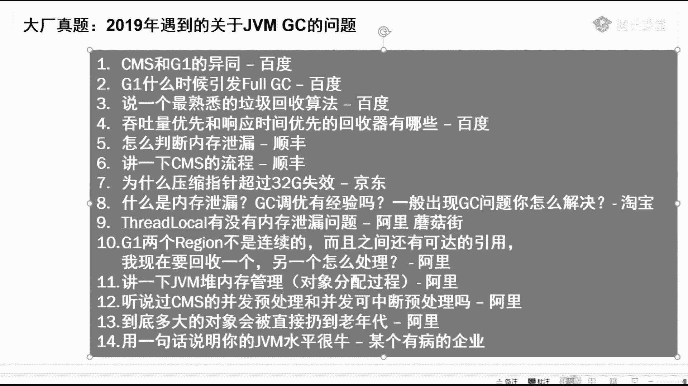
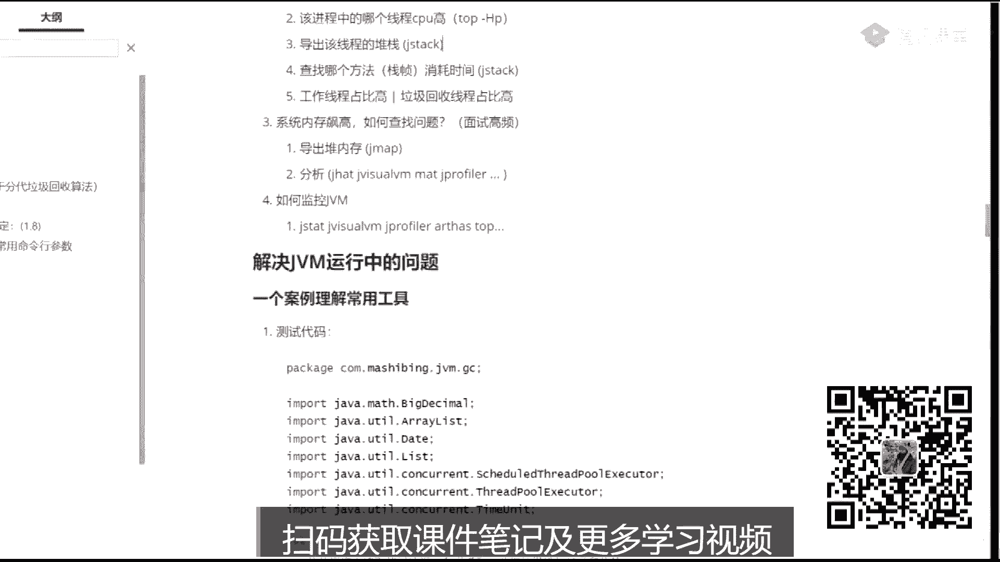
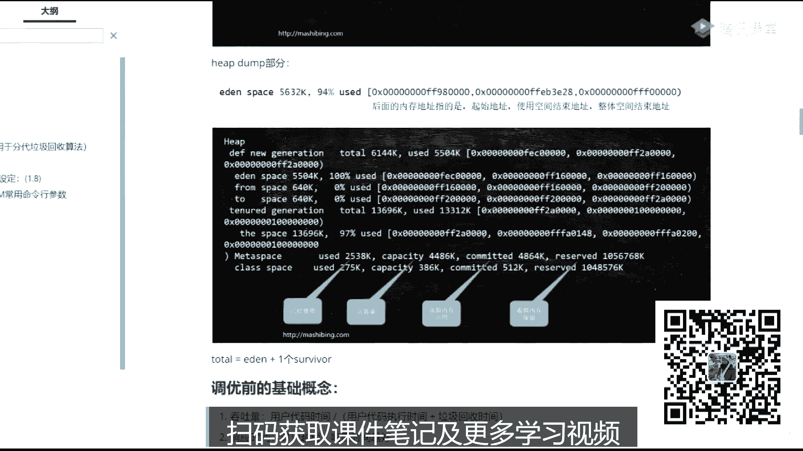
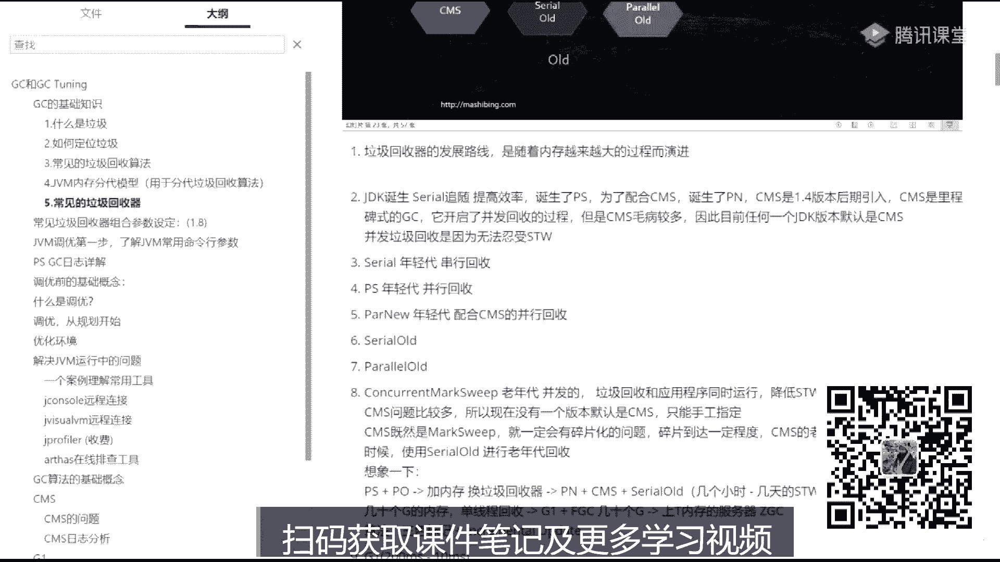
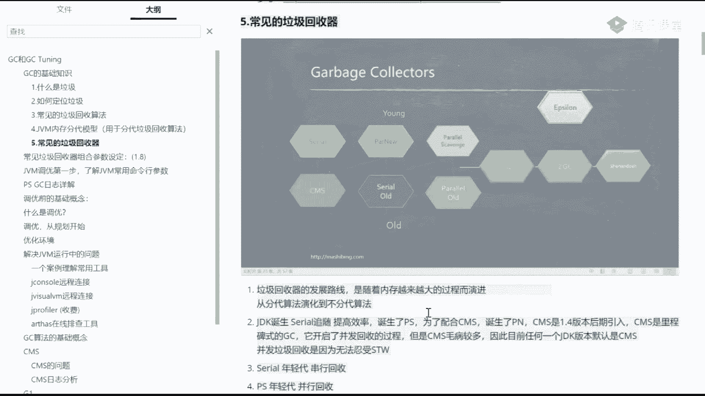

# 系列 2：P1：马士兵老师JVM调优：1.什么是垃圾？ - Java视频学堂 - BV1Hy4y1t7Bo

就是我们不是聊人生怎么聊技术的，就是我们聊jvm呃，为避免有些同学对gm一丁丁丁点都不了解，所以呢我还是首先得稍微大家讲点基础的知识啊，当然我基础知识会讲的比较快，如果你听着比较费劲的话。

那你可以撤两分钱，你你就你可以去找腾讯退掉吗，开玩笑开玩笑嗯，每个人的因为他技术水平不一样，所以呢我给大家复习一下这些的基础知识，有多少人看过，要求大家看的这这咱们咱们的预习资料了，有没有。

啊有看过是吧，不错啊，有没有没看过的，没看过的，给老师扣二，看了一半儿，好好这样啊，下面这段呢就是也我我最快速的讲解，也没看过人没看过人听嗯，你就算没看过，我觉得至少也应该听说过啊。

dc这件事呢为什么现在变得比较重要，其实呢我觉得你实际当中的多数人是没有过调优经验的，可以这么说，我估计今天听课的这人数里头，十个人里头估计至少有八九个，应该没有过自己亲手在线上调优的经验。

但是呢现在一些大厂呢就玩了命的问，特别讨厌，非常的讨厌，我给你看一眼这个。

这是从2019年咱们面大厂的小伙们呃，我遇到的我摘出来的一部分呃，十秒钟你先读一下，这是大厂们问的一些关于gc的问题，他没聊别的，就聊dc好吧，扩大堆内存，你以为就这么简单吗，啊银行技术岗招聘到位了。

问了是吧，解说只会一个嗯嗯我就不一一念了好吧，你们自己看这里比较难的是哪个呢，其实这个比较难，就阿里问的问题相对都比较难呃，你比方说阿里问的这个是sro有没有内存泄漏的问题，这个呢是一个专题啊。

原来我讲过，你听过的话可能会了解，没有听过的话，应该这个地儿你是答不出来的，slogo里面主要是由，弱指针主要是弱指针的存在啊，才解决了它内存泄漏的问题，不然的话还真有，那么阿里问的这几个问题。

第二个呢是g12 个region不是连续的，而且两个之间可查的引用想回收一个，另一个怎么处理，这里头呢主要考你的是写屏障，jim的对内存的管理啊，对象分配过程，这个过程比较复杂，一会儿如果讲到的话。

我可以给你稍微说一下cm 4并发预处理和并发可中断预处理，这个是cm的非常细节的地方，特别细啊，我第一版的时候甚至没有讲到这呃，c m s呢如果简单讲它有四个阶段，如果复杂点，它有六个阶段。

讲到六个阶段就讲到这些并发预处理，并发可中断预处理，讲到这些了，到底多大对象会被直接扔到老年代，这个呢也是这个这个问题就相对容易一些呃，呃装不下的，那么它有的时候呢是不会触发呃minor gc的。

会直接给你扔到老年代，还有呢直接超过那个一点区的，那二话不说，肯定是跟金融到老年代，还有一种情况，三种情况呃，背就行了，还有一个呢啊，当然这这是真真的是有个有病的企业的，有病的面试官啊。

不知道为什么突然间就问了这么一个问题来说，用一句话证明你的gm是很牛，来来来哎，同学们，用一句话证明你，你的jvm水平很牛，哈哈哈。

你写的你咱吹牛也不能吹没边儿了，好不好，听你说完，我就感觉牛在天上飞啊，后来我后来我教了你同学一句话啊，那个我教他，我说那个呃十种gc的算法全部了解，怎么样可以吧，十种gc算法全部进攻，一句话。

想想啊嗯，jpm呢现在变得越来越重要的一个原因就是因为大厂总是考总是考，总是考，而且越考越细，越考越深，所以如果你的简历上能够把这句话写下来，嗯，写到你的简历上，熟悉jc的常用算法。

熟悉常见的垃圾收集器，具有实际gm调整调优的实战经验，原来你的简历如果值2万，就是超过2万了，之后往两两万以上，25000这个位置走的时候，你需要加很多东西，你从15000~2万啊。

你只要能干活干得比较熟，就到了，从2万~25000，这个我这个5000块钱有好多好多东西你都需要加上啊，包括dc直接就到25000了，好吧，这一句话写上去就可以了。

呃我们有我们原来有一份简历是写了五句话，拿到阿里的好多的面试通知啊，其中有一句话就是这个哈，我看这里啊，不废话，我们先说今呃今天呢如果两个小时不够，我们就多讲点啊，没关系，呃先说今天我主要讲gc啊。

gc gc是什么意思，叫垃圾回收，所以呢我并不是说在这儿给大家呢把jvm的从头到尾的概念，那个太太宽太大了，嗯不是那么讲的，没有意义，我主要讲gc，而gc到底是个什么东东。

jc叫做找到垃圾并且回收回收的意思，让这块内存重新可用好，你说比如说我们占领有个引用object o等于new object，new出来一个object。

这个object里面有个成员变量又指向了另外一个，什么时候这个引用消失了，这块就是垃圾啊，就是garbage，没有引用指向的对象就是垃圾，有过c和c加加代码经验呢。

一说你就了解c和c加加需要手动回收垃圾，c呢要手动分配内存，要手动回收内存，下家呢需要自己new出来，自己在delete掉，java呢没有这个概念，java就直接new就完了，new完了就不管了。

那谁来帮他回收垃圾回收器，咱们讲的就是这个垃圾回收器的过程，好，我这个速度应该没问题吧，来没问题，同学给老师扣一，现在很多新式的语言呢也都在引入自己的垃圾回收器啊，这个，因为c和c加加写指针的时候。

写的会非常非常的烦，呃所以当你不需要自己去手动手工管理内存的时候，你这个代码写起来效率会非常高，不是运行效率高，而是开发效率高，好吧好看，这里，是在这里呢，第一步呢你怎么样。

你你首先得定位这个垃圾怎么样找到一个垃圾，就这个对象到底他算垃圾，什么情况要算垃圾啊，你怎么把它找出来啊，第一种方式呢叫做有两种啊，第一种方式叫reference count，叫引用基数。

这事也很简单啊，你比如说现在有三个引用之前这个对象了，运行的过程中，这个已经没有了，这个已经没有了，这个已经没有了，好这个专门肯定就是垃圾了，从三把这个三变成零的时候，这个就是垃圾。

当然这种方式呢有一个显而易见的缺点，就是如果有三个对象，他们之间互相持有引用，但是又没有另外的引用指向他们任何其中一个a指向b b指向c，c指向a这三个呢叫做一组垃圾，一堆垃圾，一圈垃圾。

一家子全是垃圾，a b c好，那这个怎么办，每个引用的基数都是111，所以呢如果你通过引用计数方式，你是找不着哪些是垃圾的，所以这个在这儿用不了，那怎么办呢。

jdk里面就hot sport里面用的是什么，用这个算法叫root searching，叫跟搜索算法，跟搜索算法是什么概念，跟搜索算法的概念就是哎我们写一个main方法，在方法里面有一些成员变量啊。

sorry，有一些那个局部变量我new出一个对象来，这就是我们的根对象，这个对象呢会产生一些引用，指向新的对象，新的对象也可能会产生一些引用，又指向新的对象，那么在运行的过程之中。

我只要找到main方法，找到这些根对象，顺着这些引用找，要从根儿上开始，顺着着顺藤摸瓜摸摸摸，凡是能摸到的这些全不是垃圾，凡是摸不着的那些全都是垃圾，这个叫做根可达算法，叫root searching。

这概念也很简单，是不是，那当然大厂面试不会给你面试这么简单的，大厂面试都是说哪些是根多讨厌你说他，但这里面牵扯的东西比较多，只要讲得非常透彻的话，得需要把前面的所有的那个预备性的知识全都掌握住才行，呃。

听一个大概就可以了，这段话呢是来源于gbm，就是java java的virtual machine specification，就是java虚拟机的规范里头，他自己说的啊，到底到底哪些是根儿呢。

哪些对象是根呢，有这么几个，第一个呢是jm stack jvm站里面的站里面还存活着的，那肯定就是根native methods stack本地方法栈，如果调用了本地方法的话。

run time constant pool，放在你的运行时常量池里头的，你那个class运行时常量池的那部分的那些个引用指向的东西。

那是根static static reference in method area和class，就是class，这就别说了，你漏的漏的就内存那些class哦，那些是歌steady reference。

静态的那些引用，ok这些都是根，所以当然呃如果这块不熟的话，你就略过它好吧，因为今天的重点呢也不是讲这些东西，我们主要是讲这个jc的一个实战调优，能让你的简历上把我刚才那句话给你写上。

两天能让你的简历粗糙的涨个两三千块钱吧，细细的能能让你涨5000好吧，绝不夸张，以前有学生验证过啊，二人真听嗯，当我们找着这个垃圾之后，我们要对它进行回收，回收的时候有几种方式呢，回收的算法三种背过。

别废话，直接背过就完了好吧，因为为什么大厂直接面认为你这东西就是应该你掌握了，没掌握，你跟大厂无缘，第一个mark sweep，第二个copy，第三个呢叫mark compact，什么意思，一看就明白。

标记清除，给这块标出来，标出来垃圾垃圾垃圾这些全是垃圾，直接把它清掉，清成可用的，就这么简单，这就叫mark sweep，这maswift呢我我我我，我相信多数同学一看就能理解他有些毛病，什么毛病啊。

会产生碎片吗，产生了这些个中间，这个中间也不连着，然后你要分配那个一个大对象的时候，你发现有可能也找不着空间了，所以这就产生碎片，这个意思叫mark sweep，好看这里。

但是mark wift算法比较简单啊，所以呢也并不是说不能用的，这三种算法没有优劣之分，记住这三种算法没有优劣，只有你选择哪种算法，具体的选择看情形好，第二种叫copy，copy很简单，把内存一分为二。

只用一半，你们家俩房子，两个房间，一个房间你在里边玩，你妈妈进来给你回收垃圾的时候，咔叽把房间给你一分为二，你这个死孩子只能在这半边玩，等什么时候玩玩了诶，你跑到这边边玩来玩了，我把这半边一下给清理了。

有用的，凡是你产生的那些有用的，比方说你在那扔线团，把那些线条复制过来就可以了啊，然后这边就可以全部的从头到尾的一下子清掉，这叫copy copy，我想一眼就能看出他的缺点，缺点就是内存浪费了好看。

这里第三种呢叫mark compact，mk compact呢也是相当简单的一个算法，就是我标记完了之后再对它进行一个压缩，这个是这个是什么意思啊，你注意看我们找到这是一个垃圾，但是呢我们我们不管垃圾。

我们干嘛呢，我们其实呢是找这个后面的一些个有用的对象好，这是有用的对象，把这个有用的对象呢直接给这个垃圾覆盖掉，都挪到前面去，反正找到的都往前挪，你知道吧，把这些这有一个空档，哎我也把我把这个挪过来。

把这个挪过来，就是挪来挪去，挪到挪到最后就形成了这样的一种感觉，一边标记清完了之后，还进行了一顺带的顺手进行了一个压缩，这是最好的一种内存状态，这种内存状态特别利于新对象的分配，新对象来了之后。

也只用往往后往后一挪，哎我就产生了产生新对象了，再往回印度a又产生新对象了，这是最好的一种内存状态，当然这个算法一眼看上去也很简单，因为它和标记清除相比，和copy相比，它的效率肯定会偏低，为什么。

因为你得挪对象，你得对对象产生移动，对象产生移动是一个特别复杂的过程，后面讲那种特别复杂的那种dc算法的时候，都是在这块下功夫，啊这是标记清楚啊，三种算法相当简单，我在这里就不跟大家多废话了，可以吧。

能接受同学给老师扣一来，大家先跟我的思路走，你们有一些眼前的问题先扔一边，有的问题你可能听着听着就明白了，所以先扔一遍，好吧好，我们先不讲这个对象的什么产生到消亡这个过程啊，也不讲这个对象的分配过程。

我们先来看什么呢，先来看这个这张图，请把这张图背过，我前面讲的东西都是让你背过的，为什么，因为面试官就直接认为这东西你应该掌握啊，当然这张图呢很多面试官可能也掌握不了，你掌握住啊。

你就可以直接第四面试官了，就前面讲的概念都特别需要特别基本啊，你必须得掌握，那么这张图是整个我们到目前为止，jdk至少到jdk 14为止，从jdk一点零到目前的14为止，所有的垃圾回收就这么多。

垃圾回收器好，垃圾回收器是什么概念，垃圾回收器就是这是房间，你在里边玩，你跟你的朋友在里边玩，扔一些小线团，这些小箭头呢有的人慢慢的中间线断了就变成垃圾了，你自己不回收，谁来回收你的妈妈，你的爷爷。

你的奶奶，你的姥姥和他们来回收，他们来帮你回收这东西，他们就垃圾回收器帮你清理房间的，在c和c加加语言里面，你得自己清理，扔了这个线团什么时候不用了，得自己把它清理掉好，现在不用了。

因为有人帮专门帮你清理，谁来帮你清理他们，他们的名字叫做garbage collectors，扫地机器人，垃圾回收器简称gc啊，gc就是这个概念，当然他有时候也做动词。

简称的时候做动词叫garbage collect，嗯，垃圾回收，垃圾回收呢整个从gdp一点零开始到现在发展了很多很多年，然后也诞生了各种各样的垃圾回收期，它的一个发展的路线是什么路线呢。

请大家记住这个路线，给大家写写两笔笔记。

来你回收机的路线啊，发展路线是沿着什么发展呢，是沿着，随着内存数量内存越来越大，越大的过程啊和演进，好在这呢我先给大家做一个总纲性的胶带，我们说学任何东西都是要按照先脉络后细节来学，一定记得这一点。

小伙伴们，就学任何东西一定是先脉络后细节，当我们要学习整个的这种gc的时候，这个gc是一个特别复杂，而且充满了各种各样犄角旮旯的面试题。

这么一个知识体系，那么这时候怎么办，我们要来一个总纲，这个图就是我们的总纲，关于这个图呢，我会先进行大面上的一些个讲解，然后呢有一些细节我们再慢慢渗透进去，好嗯能接受这么学的，来给老师扣个一啊。

一定要这么学啊，这个学法才是最正确的学分，你千万不要说学东西呢，你自己先弄一个细节，先使劲抠进去那种那种学法学起来特别累，而且还不容易学明白，就相当于你去看庐山，然后直接到庐山脚下的某一棵树。

就开始研究蚂蚁窝了，你是在玩什么，你肯定得先乘坐飞机观，看清楚整个庐山大的脉络啊，你要有这个胸怀明白吗，就学技术也要有一定的胸怀啊，嗯，随着内存越来越大，另外呢它呢还有这样一个背景，就是从。

这种说法都没了，从，从什么呢，从分带算法演化到部分代表，终于从分类算法演化到了部分类算法呃。

这些个，那么这些个垃圾回收呢，我一一的先给大家交代一遍啊，你认真听呃，从jdk一点零开始啊，先诞生了，是serial的垃圾回收好，那会的垃圾回收呢都是分带的，分带是什么意思呢，就是分为年轻代和老年代好。

我们先说基本概念啊，看，一会儿我再给你记笔记，笔记明天会发给大家的，不要着急，因为我每每讲一次，我都会往笔记里多记一些东西，所以你们明天拿最新版本就可以了啊，好在这里，我们先来聊这个分带的概念。

就是目前到目前为止，jk呢就是hobd，说的是hobd，因为gd k有好多种，我们主要说的是hobhouse，到现在为止它一共有十种垃圾回收器，这个图请大家记住前面的这六种叫做分带好。

第一叫做概念上分带物理上不分概念，分带物理部分带这么来理解，那么z d c和shen door全都不分带，abcellent是另外一种比较特殊的垃圾回收，一会讲给你听，这个和其他案子都不搭界。

因为他什么事都不干，就他不干，他垃圾回收的活，没有人帮你清理房间，这哥们就来不及了啊，啥都不干活的人嗯，空气，首先呢我们先了解这个分带的概念，在jk诞生的早期，要分配一块内存的时候。

会把整个的我们java的堆空间分成两个不同的年代，这两个不同年代呢可能应该也听说过啊，分成叫新生代，叫老年代这么一个概念，新生代是干什么使的呢，新生代你看吧，刚刚new出来的对象，然后都放在新生代里。

然后经过了好多好多垃圾回收，垃圾好多好多次的扫房间，好多好多次垃圾回收之后的那些特别顽固的对象，放到老年代，他有些别的称呼，比方说老年代也叫tenure，就是尼尔是终身的意思啊。

老外的那种taire processor叫终身制的教授啊，就是这个意思，终身反正就是比较老的老家伙，所以一个叫新生代，一个叫老年代，那么为什么这么分，是因为呢在不同的年代里，可以采取不同的算法。

对垃圾回收采用不同的算法，这样效率是最高的，对于年轻的采取copy算法复制，对于老年代采用mark compact或者mark sweep，这两个都有，很多那种y就是那种原理上的东西，我们暂时先不探讨。

你先了解什么意思啊，这个老年这个年轻代啊，呃为什么要用copy呢，是因为呢对于程序的一个总结，总结出来的，大多数的百分之八九十的对象叫做招生熄灭，招生熄灭什么意思呢，就是这寿命都不太长。

一个for循环里面溜了1万个对象，除了这for循环，他马上就死了，因为他马上就成为垃圾了，那么像这样的东西，你想想看啊，在这里分分配了，在年轻代里头分配了一堆一堆一堆一堆一堆的对象啊。

而且呢一次垃圾回收之后会回收其中的好多好多个好，在这种情况下，那么最有效率的算法是什么样子的呢，最有效率算法其实是这样子的，看这里年龄段又分成三块，第一块呢叫一点区域，1。1甸园，人类诞生的地方。

所以这是我们新对象诞生的地方。