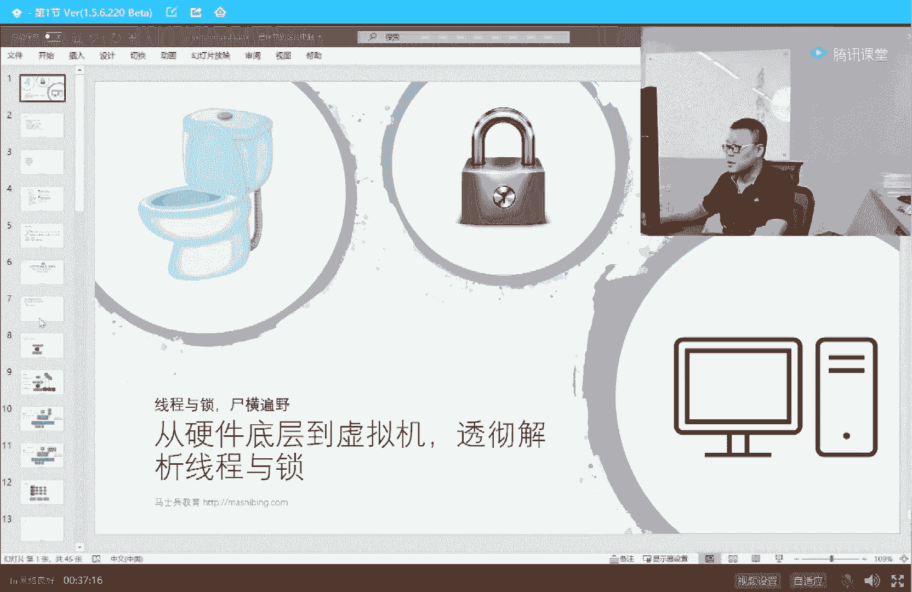
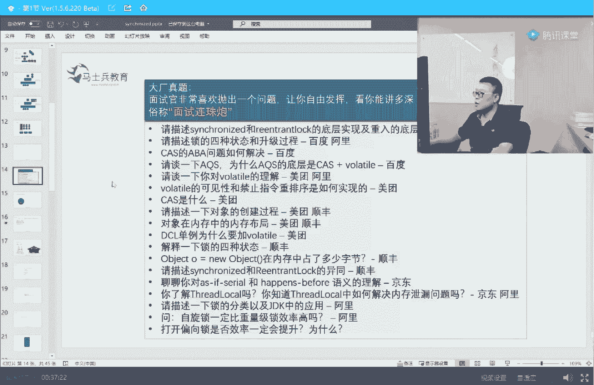
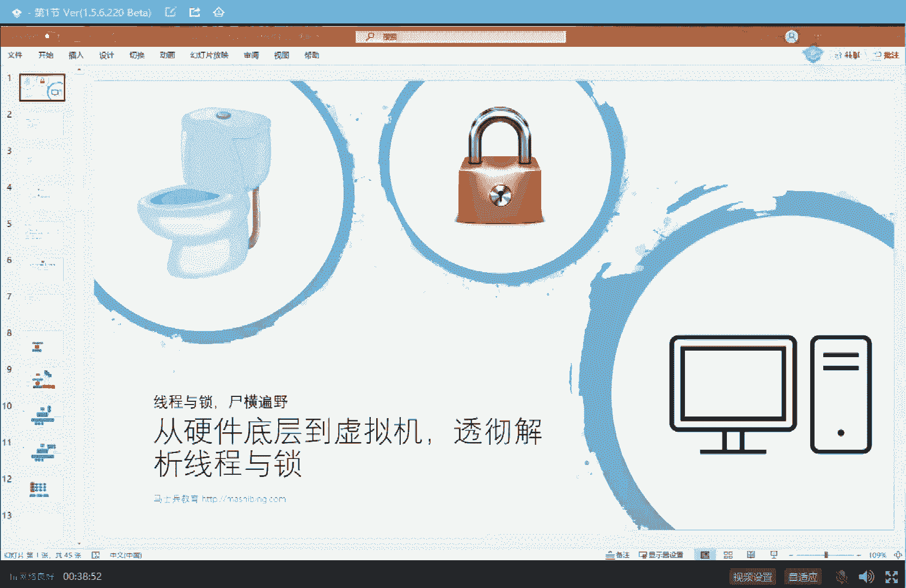
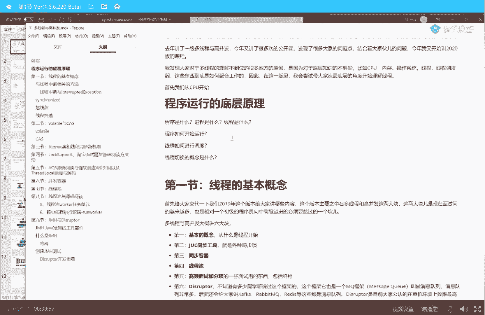
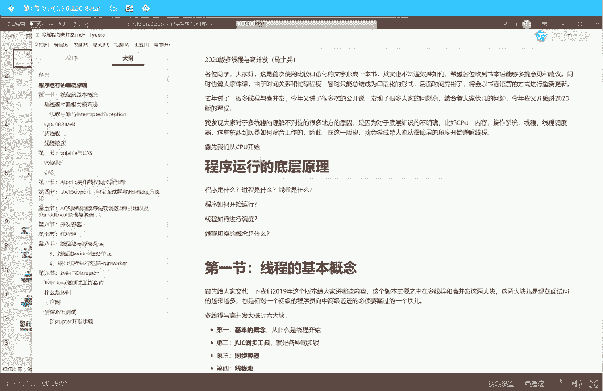
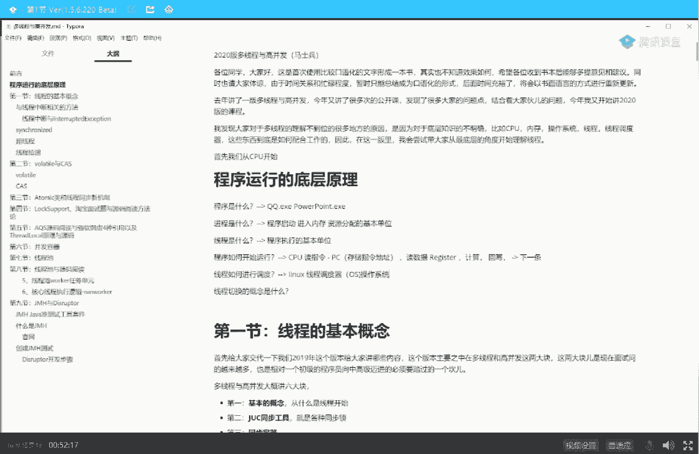

# 系列 2：P24：马士兵老师多线程：1.线程的本质(操作系统与CPU是如何执行线程的) - Java视频学堂 - BV1Hy4y1t7Bo

虚拟机来给大家透彻讲解一下这个线程和锁的问题，县城所这件事呢在大厂的面试之中叫做必不可少，而且呢死人死的特别多，我们俗称叫是县城与所适横遍野是吧。

关于面试题呢我就不给大家一一的列了啊，就是其实挺多的。

大家可以看看呃，去年的时候，2019年的时候，大概我们在面大厂的时候所用到的一些面试题，你大概大致可以溜一遍，给大家个15秒，20秒的时间，这玩意儿怎么这么卡呢，下一个客户端就不卡了啊，乖乖乖。

你曾是少年是吧，嗯你还是那个少年，很好，我都不认识，哈哈哈哈哈哈，都是不认识，对了就对了，说明你有很大的成长空间，好了，同学们呃，这是基本上是一线大厂的一些面试题，呃，其实你弄懂这些题之后呢。

那些中小厂就已经应该是不在话下了，属于是降维打击了我呢，这个课呢其实已经讲过好多遍了，包括去年呢我专门讲了多线程高并发大概20多小时的课，但是从反馈来看，从大家伙的我又我又不断地讲了很多的公开课。

从大家伙的反馈来看呢，很多同学理解起来还是困难，我后来就反思我说为什么大家理解线程和所理解这个东西的时候。

理解特别困难，就在于呢有很多东西讲的特别晦涩，另外呢很多人实际上是它底层的知识不太够，我这一点也很重要。

所以呢我在这个2020版的这个里面。

我打算从给大家讲这个多线程的时候呢。

先从程序运行的底层原理开始讲，而并不是说直接上来就给大家讲代码呃，我呢今天来尝试着从这个层面来给大家讲线程和锁，以及先程携程管城这些东西到底是一个什么概念，现在我们就可以开始了，来准备好同学老师扣个一。

马上开始，后来，我先把我bb打开，呃在我的另外一门课里头讲的是这个计算机的底层知识，我觉得给大家讲清楚，县城之前呢需要给大家聊一点计算机的最基本的底层知识，这个以前从来没跟大家聊过这一点。

所以有很多同学理解起来特别麻，特别困难，呃我现在呢就用这个一个简单的图啊，这个图呢是来源于计算机组成原理这门课里面的一个图，大家的这个图呢也不要执念于a aru是什么，cu是什么，mu是又是什么。

先不要只念执念于这个，先从大块上开始看任何的一个东西呢，大家记住了，叫做先学脉络，我一直强调这一点，先学脉络再学细节，只要你沿着这样的一个学习方法，你的效率就会提升很多，很多有很多人学习不识庐山真面目。

到庐山里头先去找庐山，一棵树底下有一颗蚂蚁窝，跟他研究小蚂蚁，没错，你研究蚂蚁研究的很深，但是别人问你庐山啥形状呢，你根本就不知道，所以先建立知识体系，再来查漏补缺，找细节，大家记住这句话，好看。

这里作为一台计算机来说，它最核心的组件有这么几个，最核心最核心的叫cpu，那么还有一个装程序的叫内存，当然还有什么硬盘呀，显示器，鼠标键盘网卡等等，这些都叫做外围设备，大家听我说。

这里面程序运行你需要理解的最根本的东西，一个叫cpu，就叫内存，在这儿呢我想给大家简单澄清几个概念，第一个概念呢叫做什么是程序，程序是什么东西，我呢不想给大家讲什么那种。

就是特别文绉绉的那种定义化的那种语言，给大家举个例子就行，比如说你的你看到的qq。e x e，比如说你看到的powerpoint。ex e，像这一类的东西放到硬盘上，静静地躺在那里，这就叫一个程序。

那好对比的概念，什么叫进程，进程是什么概念，进程是什么，县城是什么，这是大厂在面多线程的时候特别特别喜欢问的一个起始的面试题，什么是进程，什么县城，好好听我说所谓的进程，双击qq。ex e，夸夸一。

双击背起来一程序，本来你看，这个qq。ex e呢是放在我们硬盘上对吧，然后呢我们通过浏览器能看到它一倍一双击马上起一个程序，这个程序是一个什么内容呢，实际上他把qq。e x e的一些相关的内容和资源。

放到了我们的内存里面，ok它会在内存里面分配一些资源，分配一些空间，分配好我们的什么文件的i o啊等等等等，总而言之，这个qq。ex e双击不就跑到内存里了，占了一块空间，里面装着这个程序的指令和数据。

指令指令是什么，就是诶下面要执行2+3数据是什么数据，就是那二和3k指令和数据，一个应用程序以双击跑起来的时候，这部分的东西这个叫一个进程，ok所以这个进程是一个什么概念。

就是程序以双击开始运行之后放到内存里的那部分内容，好了，这就叫一个进程，那么县城又是什么呢，线程是程序执行的基本单元，好我先说结论，如果大厂问你什么是进程，什么现场标准的回答，进程是资源分配的基本单位。

线程叫程序执行的基本单位，啥意思好听，我说大家看着依然看这张图，我们的整个的程序放到内存里之后，它有指令，有代码，有指令有代码，但是这些指令未必位于同一个县城里，它会首先找主线程。

也就是我们的main线程，然后开始执行执行的过程，有可能有其他的执行路线，ok这就是别的线程好，所以进程是什么，进程是我需要一些资源，你先在内存里头帮我分配好，所以它叫做资源分配的基本单位，线程是什么。

县城是我现在要执行这个程序了，ok从main线程开始执行，然后中间可能会有分叉，可能会有合并，可能会有同步，所以现城市叫做我们程序执行的基本单位好关于这几个概念，不知道我说清楚没有，来。

可以继续的同学给老师扣一，好这个这几个概念比较简单，那现在我们来看看下一个概念，这个程序怎么着才能开始运行，也就是cpu是怎么执行一个线程的，所有的人听我说，任何程序开始运行的时候。

cpu执行的就是一根线程，这个线程是什么，就是main线程，main线程开始之后才会启动其他线程开始运行，cpu是怎么执行一个程序的呢，cpu是这么来执行的，我们拿最简单的东西举例子啊，还是举例来说明。

你仔细听，比如我有这么一条指令叫2+3，a等于2+3，然后你要打印那个a也好，或者怎么样也好，我们不去管它，就是我们有这么一条指令，让你算一个2+3放到a里面，a可以理解为内存里面的一块空间。

2+3就理解我们程序的数据，那这些数据呢会被cpu通过系统的总线哎，总而言之就是一根线，cpu和内存之间连接的一根线，读到cpu的内部里面去，cpu内部里面，我希望今天大家记住三个最基本的东西。

第一个呢叫寄存器，第二个呢叫pc，pc也是一种寄存器，但是要把它单独为独立出来，这个pc的全称叫program counter，叫程序计数器，无所谓，你不用管，记得它的名字是什么，你听我讲就行。

我们会把这个二和这个三放到寄存器里面，放到我们cpu的寄存器里面，那么寄存器是什么意思呢，就是存数据用的，所以这个二和三原来位于内存对吧，最早是位于硬盘上，被我们装到内存里。

然后真正开始做2+3的计算的时候，怎么做计算呢，把二和三放到我们的寄存器里，好由他来做计算，你可以就认为cpu里面有一个专门做计算单元，这个这个这个单元呢叫做数学逻辑单元。

叫arithmetic logic unit，我们不去管它叫什么，名而言之，二和三放到寄存器里头开始运行，运行完之后的结果怎么办，返回内存给它放到a里面去，放进这个a里面好了，就是这么一个过程。

那有同学会说老师这个pc是个是个啥呢，这个pc就记录一件事，记录什么事儿呢，下一条指令执行到哪里了，一个程序呢就指令一指令二，指令三，指令四，最开始的时候这个pc指向第一条指令，第一条指令执行完了。

它就变成第二条指令，下一面就是第三条，第四条，第五条，第六条好，我把整个的计算机的执行程序的过程大概跟大家说了一遍，这里面有好多好多细节，好多好多特别多，细到可以，你怎么样去做这个电路。

怎么样去做cpu，怎么样去做这个芯片的设计，但是听我说，我还是那句话，学软件的人，先把最主线的内容掌握住，我们再回顾一下，假如一个程序里面，或者说精确的说一个县城里面要执行一个2+3。

然后给它放到某一个地址上去，cpu怎么做，首先把二和三拿到我们的register里面，放到我们计算器里，计算最后的结果，把最后结果写回到内存里，然后pc指向下一条指令，下一条指令可能是打印。

可能是做另外另外一个计算好，这个过程不知道我讲清楚没有，有没有同学对这块有疑问的，有疑问你直接提，没问题给老师扣一，我知道你们会有很多很多的疑问，pc怎么知道下一条指令是哪里啊。

计算器到底是怎么进行计算的呀，中间有没有缓存啊，别着急，我也强调过，好好听你呢，先建立最基本的认识，再去抠里边的细节好吧，好还是那句话啊，先建立最基本的认识，再去扣里面细节啊，au是计算单元。

它就用来做做计算的，先学脉络好，我给大家讲这个东西呢，最主要要引出来一个什么什么概念呢，其实呢嗯cpu呢是这么一个这么一个破玩意，我先把笔记给他写好啊，cpu呢是这么个破玩意儿，它就是读。

指令指令存哪存到pc里面对吧，然后读，数据存到哪，register里面，然后计算回血，然后呢下一条指令啊，它就它就是这么一个简单的东西，他就会干一件事，所以站在cpu的角度。

其实他也不知道你有多少个线程对他来说没关系，你跟我有半毛钱关系吗，没有，还能跟上吗，还能跟上吗，嗯还能跟上，他给老师扣个一来，pc叫做program counter，程序计数器存储指令地址。

你就想着就记录着我是执行了第一条指令了，下面要执行第二条指令了，就把这个指令的序号存在这里就可以了，没办法啊，现在大厂问就问底层没招，你以为我想跟你讲这些东西。

我直接给你讲那个thread new出来之后，然后run rable collib多简单，但是没办法，必须得给你讲这个，这个是dvm内存模型程序计数器，可以认为这都这都是通用的，相通的。

没关系嗯好我们继续啊，同学们，你们学东西的时候呢，不要想着一下子把细节全理解透彻，千万不要这么想，这个学习方式是不对的，我能给大家讲这个底层，我主要想引出来下一个概念，就是线程是怎么进行调度的。

这又是一个特别复杂内容，线程的调度linux理念，它有一个叫线程调度器的东西，注意这里面就会牵扯到一个概念，叫做操作系统，好我觉得操作系统这件事其实一说呢大概就明白。

我们写程序的时候，直接可以跟硬件打交道，没有问题，但是你直接跟硬件打交道，非常容易出错，而且会会把很容易把硬件搞死，很容易互相影响，所以在现在的计算机里头，一般都是这样的，我来给大家稍微画一下。

如果这个层面是我们的硬件的话，我们的cpu，我们的内存，我们的硬盘，那么在原最早开始的时候啊，我们一个一个一个a p p，一个普通的a p p是完全可以直接访问硬件的，但是特别容易出错。

特别容易出bug，这是最早最早最早的时候，你们可能都没经历过，后来呢为了管理这些好多好多的app，互相之间的竞争啊，协作呀，访问啊，他们之间的app诞生了一个软件呢，这个软件叫做操作系统。

叫operating system，所有在大厂面试的时候可以这么说啊，这部分内容属于必问的操作系统，那么作为操作系统来说，它是怎么管理这些a p p的呢，好好听我讲。

每个app都有好多好多好多的线程对吧，同学们，交到操作系统，这里操作系统会来帮你管理这些线程，什么意思，每一个app里面都有好多好多的线程，比方说啊这是所有app里面的这些个线程，我举个最简单例子呃。

我来给他换个颜色吧，线程一线二线程三，线程四，线程五啊等等等等，这些个呢，这是用户里面的a p p里面的这些个线程线程六啊，有同学说老师这个我理解不了，简单听我讲，比如说我们有一个app。

这个app是什么，这a p p叫jvm，jvm这个能理解吧，就是我们的hot spot，我们的java虚拟机，大家知道我们在java里面写一个程序，new一个thread。

然后让他start就起了一个jvm里面的现成，我再强调一下啊，再说一遍，当我们没有一个java里面，我们new了一个thread，溜了一个thread，然后掉了他的start。

是不是我们就起了一个jvm级别的线程啊，我知道你们的线程吗，好听我讲，这就是我们的a p p里面所扔出来的这些线程好，这些线程operating system对他们进行调度，调度给谁呢。

主要调度给cpu，所谓的给cpu进行调度指的是什么呢，指的是我这颗cpu，比如说，我这和cpu该执行这个县城了，还是该执行另外一个线程了，执行多长时间好，这个东西叫做线程调度。

关于这个线程调度呢是操作系统里面比较复杂的一部分，而且前前后后经历了各种各样的算法，在linux最新的算法呢叫cfs，叫completely fire，是是是schedule啊，叫做完全公平的线程调度。

这个东西呢是我在操作系统课里头讲了，但是大家基础不同，我就不跟你多说，我主要想强调什么呢，就是在你app里面启动的这些个线程是需要经过操作系统来帮你进行，在cpu上进行调度的，那有同学可能就会说了。

说老师你所谓的操作系统调度给cpu是一个什么概念，这个概念呢是这样的，操作系统说下一个线程该你了，我们有一堆的程序，每个程序里面有好多线程，操作系统来管理哪个县城，扔到哪个cpu里面去执行。

比如说操作系统说下一个县城好，该你了，这里有一个线程，这里有一个线程，小金同学，下个线程该你了，下一个线程该你了，啥意思，就是你你把你的指令扔到pc里，把你的数据扔到rely ok。

然后开始进行计算cpu，它就是一个速度特别快的这么一个接待接待员，反正你来了我就接待你，我不管你是哪个县城，站在cp角度，我是看不见县城的。

