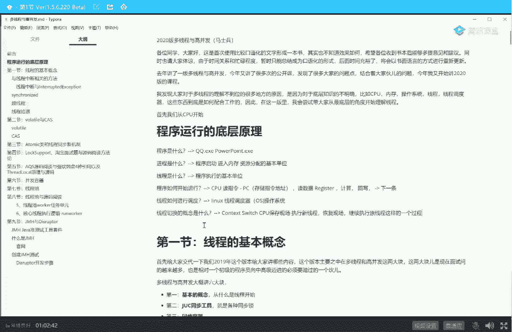
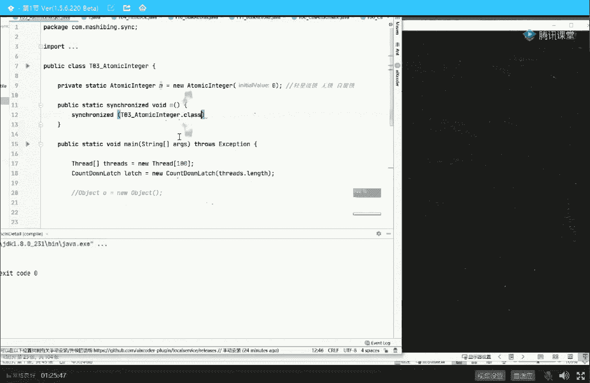
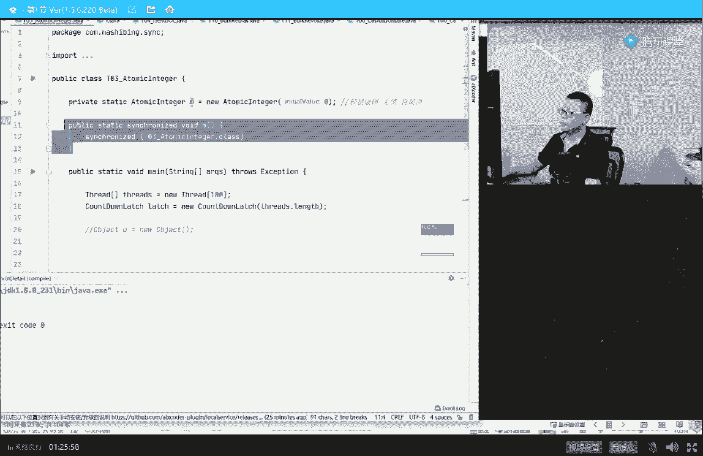

# 系列 2：P25：马士兵老师多线程：2.纤程的本质(go语言纤程为什么和线程池有关) - Java视频学堂 - BV1Hy4y1t7Bo

pc里面扔了条指令，register里面扔了一些数据，那我就按照指令来计算就可以了，总而言之，谁来负责扔这件事，扔指令进去，扔数据进去，谁来负责扔，记住这哥们叫做操作系统，呃我争取给大家讲的浅显一些。

不知道大家能不能跟得上，如果能跟上的话，给老师扣个一来，那下面的问题又来了，站在操作系统的角度，他会有一大堆的孩子嗷嗷待哺，大家都叫着哎到我了到我了，哥们儿，能不能让我让我执行了这么多县城。

等着我执行操作系统，说你到底该谁了呢，这个叫做调度策略，今天肯定来不及讲这个调度策略，现在linux内核最核心的其实就是这个调度策略，我们先不去管它，总而言之，言而总之，站在操作系统角度。

不会说让某一些个现成他自己的孩子老饿着，也不会说让cpu永远都是执行某其中某一个县城其他线程都执行不到位，这个这个肯定不行，所以在实际执行的时候，一定是执行你一会儿执行你一会儿的意思就是把你的指令。

把你的数据扔到计算机里执行一会儿，执行一会儿之后就换另外一个人，这是一接待员，速度特别快，接待你一会儿接待他，一会接待你，一会儿接待他一会，那现在问题就来了，我就想问你，假如在开始的时候。

我执行的是t一对吧，我这里面装的是t一的指令，t一的数据，那我现在要执行t2 了，等会儿一会儿还回来又执行t1 ，同学们，那你们想一下我中间要做一个什么操作呢，必须要做的一件事，我一定得记录下来。

t一执行到哪里了，就说我第一次执行t一的时候，我在哪里停下了，我下一条指令该执行的是谁，注意你执行t2 的时候，他会把那个指令，pc里面那个指令就已经把t一的给你给你给你冲掉了对吧，t一的就没有了。

这时候执行的是t2 的，那t一的跑到哪儿去呢，一定得保存现场，所以这个呢叫保存现场，啥意思，刚开始在执行t一的时候执行到哪里了，数据是什么，这些东西在执行t2 之前都给我保存好好。

这个一般呢会保存到catch里面，这个我们先不去管它，保存到哪里去，总而言之，言而总之得把t一的现场先保存好，保存好之后，t2 来了，t2 来了，什么意思啊，这里面执行的是t2 的内容，t2 的内容。

然后t2 执行一会儿，t一要恢复执行的话怎么执行，把原来的现场做恢复好，关于t1 t2 t3 t4 tn都是一样的，这部分内容叫什么呢，叫现成的切换，专业名词叫context switch。

指的是指的是cpu，保存现场，执行新建程，恢复现场，继续执行原线程，这样的一个过程，那有同学啊，那可能就会说老师这个你跟我讲这个到底有啥用呢，在这儿呢有一道解非常简单的面试题。

就是也也是一个非常简单的问题，大家都知道啊，呃如果一个任务采用单线程的时候，开始执行的时候，它的效率呢稍微低一些，那么我们就会说我们用多线程来执行它，嗯很多个人来帮他干这事儿。

那现在问题是是不是线程数越多越好，是不是一定是越多越好，能不能说我是他一个线性呃，这种线性效率提升的概念就是我的线程数原来是十个，那我的效率提升十倍，我要是1万个，那效率就提升1万倍，会是这样吗。

肯定不可能，绝对不可能，为什么，因为我说过cpu啊，它中间有一个切换的过程，听懂了吗，就是切换得把你把你放进来，把我放进来，你如果1万个线程的话，我要在这1万个线程下来回切换。

所以你整个把资源全浪费在线程切换上了，所以不一定线程数是越多越好。

我们再来稍微回顾一下我讲的一些基本的内容，看看大家是不是能理解，记得我画了个图看看啊，超线程呃，这里是一个小小的线程切换的概念，我记得我是做成了一个动画，为了给大家讲清楚，费了劲了，这是两个线程。

这是t一线程，它里面有指令数据，t2 线程指令数据，所谓的线程切换指的是什么呢，当我们执行t一的时候，t一的内容会装到我们cpu里，当我们要执行t2 的时候，t内容会从cpu里面挪出去。

挪到catch里面去，t2 进来执行，ok就是这样的，就是一个线程切换的过程，这个动画没有演出来，再回来，这个过程我会进下一步进一步完善它，这是线程切换的概念，现在明白了，线程切换之后。

你就会知道这个线程数量并不是越多越好，它会有一个合适的值，如果你特别多的话，它会把整个的时间全浪费在线程切换上，好了，我们回过回过头来看这张图，大家明白了现成的最基本的概念之后呢，我们回过头来看这张图。

这张图呢实际上背后有一个特别重要的问题，这只问题是什么呢，注意啊，我在这里所写的线程，这个线程是什么，这个县城是一个用户所产生的线程，就是我们我们的app自己所产生的线程，但是现在的问题是。

我们a p p产生的线程，一定和我们cpu运行的这些个线程是一一对应的吗，听我说在这儿我就讲到了go语言的最核心概念，同学说，老师您您讲这个java讲完还讲go语言，没错，所有东西都是相通的。

在老师这儿看来，无欲无我，大家都差不多，好好听，假如我们是红颜色的，圆是我们用户级别的线程，假如我们这个颜色的啊，这哥们儿换个颜色吧，好假如这个颜色的是我们操作系统级别的线程，就是俗称的内核线程。

有同学说老师我的app不能直接产生内核线程吗，听我说可以，很多app如果你写的是写的是什么呢，比如说你用c语言写的，你就直接调用了内核的接口，那你直接产生的就是内核线程，但是也有一些应用程序。

什么应用程序呢，比如jvm，jvm是一个虚拟机，虚拟机里面是我们java写出来的那个线程，好，java写出来这个线程和我们的内核线程又是一种什么关系呢，go语言里面大家都知道。

我不知道有没有同学听过这个概念啊，这个概念呢叫做呃携程，这个大家都有多少同学对购员比较熟的有吗，有的给老师扣一听，不懂是吧啊，polaris没有听懂啊，sorry，呃线程的最基本的概念。

我觉得大家伙都清楚，就是一个程序里头不同的执行路径，它并不是说从头12345这么执行完的，而说并行执行，而go语言里面你们知道是怎么起一个这种现所谓的现成的概念，单独起一个执行执行路径的吗。

我看我购物员有没有打开在这里听我说啊，你你你你你不用心教，也不用着急，因为我讲课呢，我喜欢纵横百合，把那个横的竖的都给大家讲清楚，你明白了这些个最基本的概念之后呢。

其实任何语言对你来说也就是点语法的区别而已，好好听我说，作为go语言来讲，大家看这里，这里呢我是写了一个小程序，这小程序呢有一个客户过来，我会用一个方法，这个方法叫handle去处理它。

具体的逻辑是什么，你不用管，你就可以想象成为这是一个餐厅，有一个客户进来的话，我就派一个服务员去处理它，假如我们前面不加这个关键字，那么相当于你的餐厅只有一个服务员来多少。

客户也只有这一个服务员去服务它，但是如果你在前面加了这个关键字，go就相当于有一个客户过来，我就有一个新服务员去服务它，又有一个客户过来，就有一个新服务员，这里头非常像什么。

非常像java里面的现成的概念，现状概念就是有一个客户端连接过来，我就起一个线程去处理它，有一个客户端连接，我就起一个线程，只不过在go语言里面，它这个不叫写，不叫线程，叫什么叫go routine。

叫做go语言的携程这个概念，携程o，而且呢它的这种起携程的方式，或者叫起多线程的方式，多方位处理的方式比java写起来超简单多了，就直接一个关键字就搞定了，这是go语言，叫做天生支持高并发。

哈哈听懂了这块这块大家还能跟上吗，对你就想象着原来呢我们就要起一个线程，new一个thread，调它的star的方法，而在go语言里面，你只需要加一个关键字，go后面跟个方法名就可以不用控制总量的，对。

不用控制总量，我一会儿告诉你为什么不用控制，睡着了是吧，语法糖而已，不能这么理解，大哥，这真不是语法糖，你说出这句话来，我只能说你是一一瓶子不满半瓶子，咣当，好扯得有点远了啊。

注意看这里面有个概念叫做用户级别的线程和操作系统级别的线程，内核级别的线程，它到底是一个什么样的对应关系，好好听我讲，作为java来说，站在jvm的角度，一个java的线程对应一个内核线程，什么意思。

就是一比一的一个关系，java就是这样做的，你在java里面new一个thread出来，站在那个那个那个内核的角度，它就对应的给你起一个内核级别的线程，大家记得这个这个结论好吧，再说一下。

就是操作系统管理的线程和java，现在jvm所起的这个线程是一比一的一个关系，还有同学说老师你这个是一比一，那go语言里面那个是什么呢，go语言里面这个是m比n的关系，而且m远远大于n。

它是一个m比n的关系好，这是什么意思，好听我讲，我看这个图是不是画了，我记得我有印象是画过，画过我就不重新画了啊，看这里，这是go语言里面的模型，go圆面是这么一个概念。

当我们起一个go语言的程序的时候，它会自动化的给你起来一堆的内核线程，就是内核线程已经给你起来了，好假如在go语言里面起一个携程，就是我们go handle school handle。

来一个来一个我就起一个，来一个我就起一个，这个携程是个什么概念呢，这个携程就是这么一个东西，这些节整起来之后会放到一个一个的队列里，好多好多队列放在这里，然后交由下面的这些内核线程去执行。

所以这是go的携程的概念，go携程更像是一个任务，一个task，你不是要求我处理这个任务吗，我就把这个任务弄出来之后，扔到队列里，谁去处理一堆的内核线程，去处理内核线程，而java里面线成什么样。

大家还记得吗，同学们jaa里面成什么样，java面是来一个我内核就对应一个线程，来一个对应的内核线程，那么刚才我们说过，站在操作系统的角度，如果说我管理的线程数特别多的时候，我的效率反而会降低。

所以我们说java里面你要写东西的时候，不能写特别特别多的线程，你要来1万个县城，我告诉你，你整个程序快崩了，他所有的资源都花在线程切换上了，但是go语言里面你随便玩，不限制数量，几万个没问题。

有人说我写几10万字，他是不是也会崩，也会，但是毕竟这个容量比java这个要大好多，原因是什么，原因是它真正执行程序的时候，实际上就那么十个几十个线程，而这个任务都是在这里好好的队列里头，等待着。

等到我执行你了，你就来执行，不到执行你的时候，你就你就跟我这等着，所以同学们你们想象一下，我不知道大家有没有接触过线程池，java里面有线程池的概念，线程池是一个优先启动的一堆线程。

然后呢这里面装了一系列的任务，线程池里面呢去往这个任务队列里头去拿拿拿任务，拿完一个我就执行一个，拿完一个执行一个，拿完一个执行一个，ok，所谓的java的，所谓的go里面的携程的概念。

go routine，非常类似于java里面的线程池，我只是说非常类似，但是并不是完全一致，不完全一致的原因，我尝试讲一下，有点深，不知道大家能不能跟得上，能跟上的，给老师扣个一，嗯嗯，好好听我讲啊。

我讲完你java和go基本上就全全全明白了，甚至包括后面的rest基本上也就全明白了，好地方讲，那么我们说java语言里面呢也有线程池，尤其是他的fog join pool。

就是这个线程池叫fork join pool，它的模型呢和这个图非常的类似，每一个县城都有自己的任务队列，自己的任务队列完全没问题啊，执行自己的任务队列，执行完了之后呢，再合并怎么怎么样，很类似。

有好多个任务队列，每个任务队列里面装着好多任务，但是任务和任务之间他们是不能做同步的，就是说不能说我这个任务执行完了之后，你才能执行另外一个任务后，这件事java是做不了的。

但是go语言里面做了这么一个事儿，大多了件什么事儿呢，就是任务和任务之间这哥俩是可以做同步的，我们之前说我执行完了，你才能执行，完全没问题，我执行一会儿，你执行一会，你执行到什么程度了。

到我执行完全没问题，java是控制不到这一点的，同学们，你们站在go语言的角度想象一下这一个另外一个东西，不就是一个线程的同步吗，所以这就是go语言里面的线程，它中间是要做一些同步，他怎么做到的。

其实模拟了cpu的原理，cpu大家还记得吗，不就是说把某一个里面的数据放进来，放到我们cpu里来执行，然后如果你你你你你执行你执你执行完了，或者执行到一点时时间了，或者阻塞了，把你拿出去做个备份。

把另外一个拿进来继续执行，所以它是模拟了在用户空间模拟了cpu的执行这块儿，我不知道大家听懂没有，所以不能完完全全不能直接说说它就是相当于java语言里面的线程池，就是jav里面的任务，就是一个语法糖。

真不是那么回事，这里面是有一个切换的概念，怎么模拟，大哥你问的有点太多了，这要讲起来就真没完了，怎么模拟呢，程序模拟你java虚拟机都能模拟，如果你想好好听这块，我讲的java虚拟机的内容。

认真听就能理解，就是一个占用栈来模拟就行了，好讲，到现在为止呢，基本上把腾讯问到的问题还是听我讲，这是你听不懂也正常，你因为这里讲到的问题是腾讯大概在70万左右的一个程序员问到的，现在的这样一个深度。

听不太懂呢，也是非常的正常的好吧，大概是腾讯70左右的水平，他会问到呃，整个的这个先程到底是怎么回事，县城和县城的区别又是什么，好你把这个图发给他就全明白了，好了呃。

大概的意思是我从底层开始慢慢的一点点的讲给你听，每一个每一个这个这个这个这个这个概念啊，我大概给大家讲了这个现成的这种模型啊，hospital模型呢大概是一比一go的模型是m bn，你可以写2万个。

携程完全没问题啊，当然rust语言是史上最牛逼的语言了，这个我今天不打算给大家聊这个，这个聊起来又没完了，呃，毕竟呢我们今天聊的是java的多线程，但是有同学可能到这儿可能就会问了。

说老师java里面有没有写程，这里有携程啊，就是你我我我我我已经有任务队列了，我任务和任务之间只要能做切换，是不是java里面就可以支持携程啊，好好听我讲，jav里面呢并没有天然原生的携程。

但是呢有各种各样的类库可以来扩展它，大家伙听到过的有可能是这个叫crazer，还有一个就是阿里内部直接用过，我们曾经讲过的，就是也是阿里的程老师给大家讲的。

这个部分的内容就是本身他们在阿里内部就直接这么用的，killing这块课程也都已经上线了，好，现在java呢还并不支持原生的就支持啊，也许在后面的某一个版本里头，它会原生的支持。

那么go语言相对于java语言的执行上的优势基本就没了，ok，这些基础内容讲完之后呢，下面我们来聊一聊锁，县城本身呢不是特别难，其实难的就在于县城之间的同步了，解锁这个概念好，我们可以继续吗。

可以继续给老师扣一，你们还能坚持住吗。

好我们来聊一聊锁这个概念，好听我讲啊，锁这个东西是一个什么概念呢，它是一个逻辑上的概念，它并不是一个那种一定是某一种写法上的一些概念，大家千万不要这么来理解锁是一个什么内容，锁这么一个概念。

注意第一所是一个逻辑概念，它是一个loading的概念，锁的意思是说呢，要保证一个数据的一致性，必须要采取一些的一些手段，啥意思呢，什么叫数据一致性呢，比如说你要干一件事的时候啊。

你要你要你要你要你你你你要进去干这件事，那么同一时刻访问这个马桶的注意，只能有一个人，不可能有人坐你腿上，然后再来一个在你马桶在，在你在你在你身上同时干这事儿，那你这个马桶就属于处于不一致的状态。

这个就是这个意思，总而言之，言而总之就是在某一个时刻只允许一个线程干这件事，好，这个时候我们就需要干嘛呢，需要上锁，注意这个锁的概念呢是这么一个概念，锁是一个单独的东西，你可以呃你干任何事情。

也可以用任何一把锁来进行锁定，只要是大家伙做同步的时候，锁定是同一把锁就行，从形象上来理解啊，假如说有一哥们儿，这哥们儿叫这哥们儿叫谁啊，我看看欧拉欧拉欧拉欧拉欧拉已经看饿了对吧，那就塌了。

他们要进来干这件事，他进来干这件事的时候，如果说这个马桶大家伙都可以抢，那么为了保证在同一时刻只有一个人能抢到，我们就需要干这么一件事，就是进马桶干事的时候得需要持有这把锁才可以，什么叫持有这把锁。

就是把这个锁给锁上，那有一个门口给锁上，那另外别人要来的时候，怎么就是你当你当你锁定的时候，欧啦欧啦已经进来了，他不是饿了吗，他进来了，他进来了之后呢，锁定了这把锁，然后当别人又有新的人要过来的时候。

同学们，你们想象一下，那这个时候该怎么办呀，又有新的人过来的时候啊，啥情况，ok ok ok好嘞嗯啊，刚才有点小事儿啊，我们同时过来了一下，稍微打断了一下，我们回来啊，如果有人已经持有这把锁了。

持有这把锁的概念就是已经把他给lock住了，已经给他锁住了，好持有这把锁的时候，他就可以进去干这事儿了，那别人来的时候，怎么才能干上这事呢，只有一个办法就是等着把锁打开，等他不持有这把锁的时候。

撬锁肯定是不行的，当然通过通过程序上的概念叫做什么时候叫所持有这把锁呢，我们一般是这么写的，代码synchronized什么什么，然后所谓的干一件事。

就是整个这个大括号里拉屎拉屎拉屎拉屎拉屎拉屎扑扑扑扑扑好，什么事，叫释放这把锁呢，释放这把锁就是整个这里面的事，干完了，大括号结束的时候，ok这个时候这把锁放开，那什么时候别的人进来呢。

有另外的人哥们儿过来，发现这把锁是开的，他就可以尝试去锁，他锁住了归他了，这是这把锁的最基本的概念，好这就是锁的最基本的概念，当然那个从语法的角度上来讲呢，说这把索尼锁定的到底是谁，其实你锁定的是谁。

由你自己来指定，我不知道大家伙的这种这种这种基本的概念到底是一个什么程度啊，我问大家几个小小小的问题吧，比如说我们我们我我我我简单给大家写几个事例啊，看这里就如果这么写。

object o等于new object，那我要是呃这样写的话好，谁是那把锁，这把锁是谁，对就是new出来的object，这就这就是那把锁，听懂了吗，这就是锁定这把锁，这个这个对象就被我当成锁来用了。

当然在这个理念的话呢，实际上是你在里面输出的任何内容啊，噗噗噗噗噗，你干的任何事情，这个呢就是当你持有这把锁的时候，你干的事儿保证在同一时刻只会有一个线程来干这件事儿，放心不会有第二个线程。

必须得得等你这个线程执行完了，释放了这把锁，别的线程才能进来，这个在整体上就能保证数据的一致了，那我问大家几个简单的问题啊，我想问大家这么一个问题，那么假如呢，假如我有一个方法，我是这么写的。

public void synchronized的m好，请大家告诉我，好请他告诉我这里谁是那把锁，谁是那把锁，ok这相当于什么，相当于锁定的是this对象，synchronized this。

所以this是加把锁，ok那现在我再问大家一句，假如我这么写，esthetic signalize the worm，好，这时候谁是那把锁，who对，这时候写的，这时候这把锁是什么，相当于是这么写的。

synchronized t03 ，atomic energy，class。

呃这个比较基础，不需要不需要我专门解释吧。

好既然大家理解这一点就行啊，这就是你凡是你看到sc的关键字的时候，你放心，肯定有一把锁，那么这把锁是谁，那就看你锁的是谁。

你写的是synchronized的o那就是那个o你写的是synchront方法呢，就是this你写的是srt静态方法，那就是当前的class，好了我们可以继续了吗，可以继续，老师可以。

所以大家一定要理解，确确实实，在你写完代码之后，真正的有这么一个锁对象存在的，你记住这一点，然后当然有一个专业名词呢，下面你要干那些事儿，这种在专业上我们称之为叫critical section。

叫做那个呃临界区，这个我们先不去管它，理解区的概念就是放心，总而言之言而总之，同一时刻一定只有一个线程在里边，不会有另外的别的县城，只有等这个线程执行完了，别的线程才能执行好，这个就叫上锁。

这就是锁的最基本的概念，所有各种各样的类型，乐观锁，悲观锁，读写锁，分段所等等等等，但是我们先要理解这个基本的概念开始啊，我看有同学说那个嗯感觉还没有深度讲普及还可以啊，大局为重，嗯，别着急。

还是那句话啊，得从得照顾基础稍差的同学。