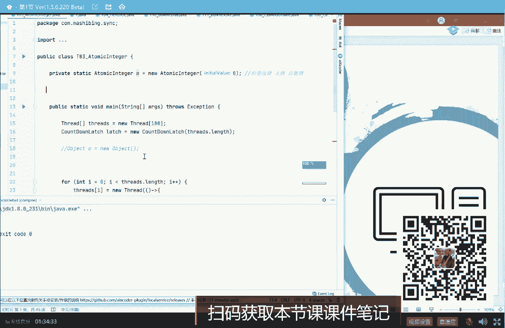
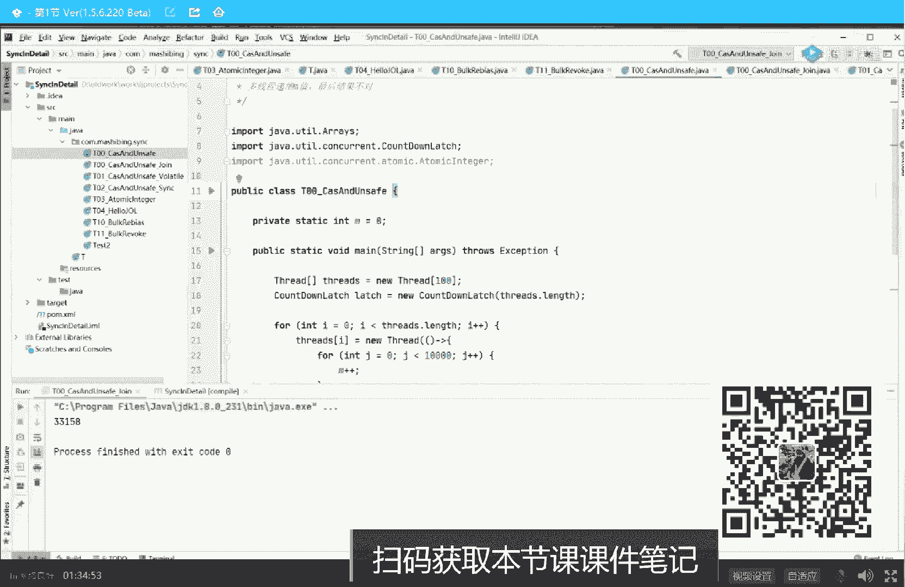
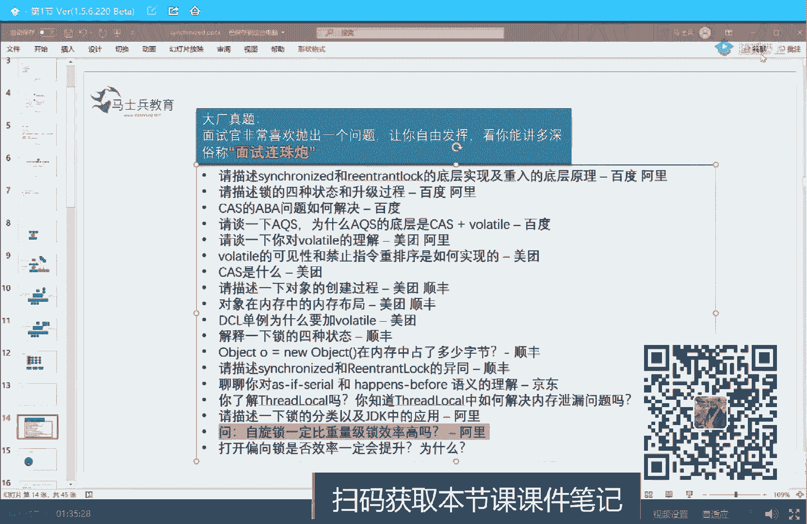
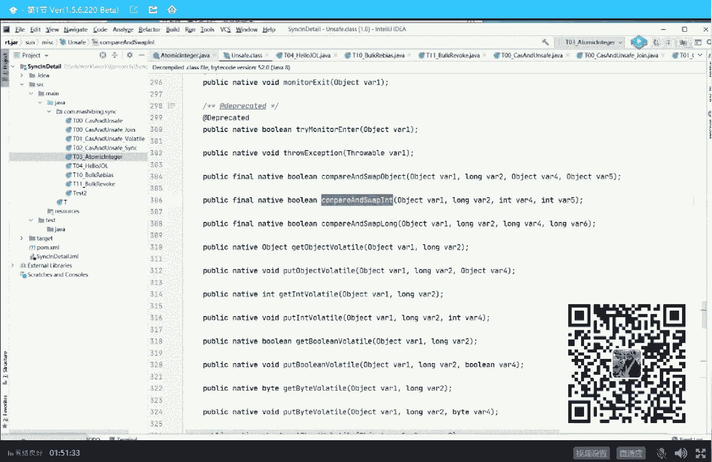
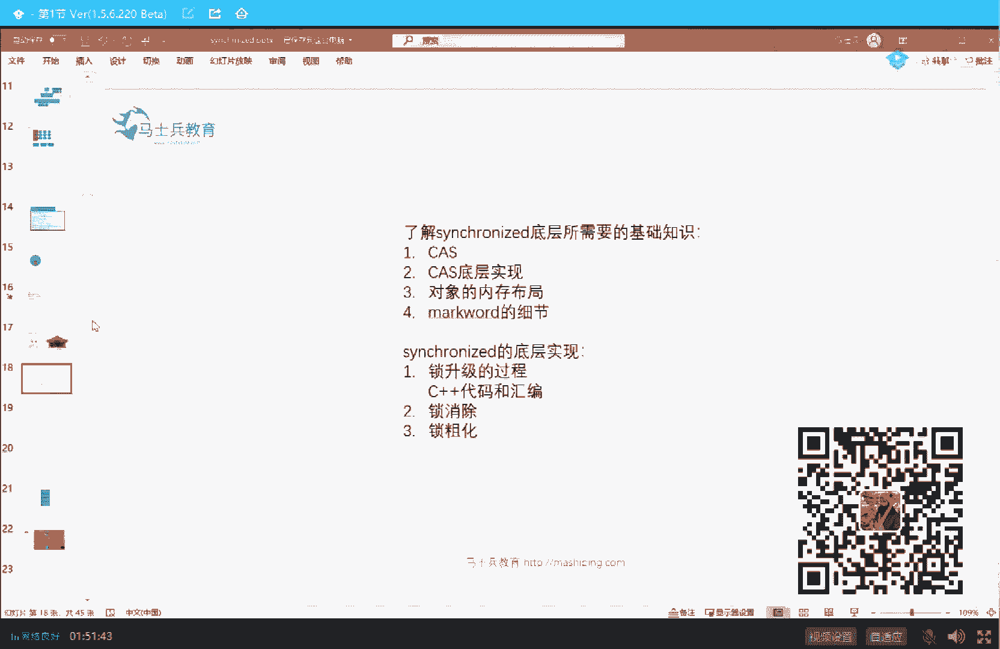
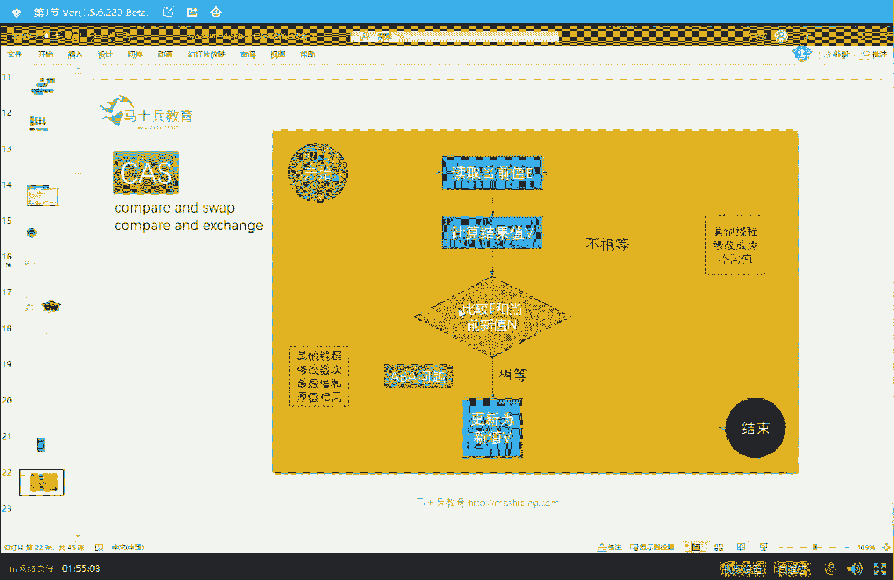
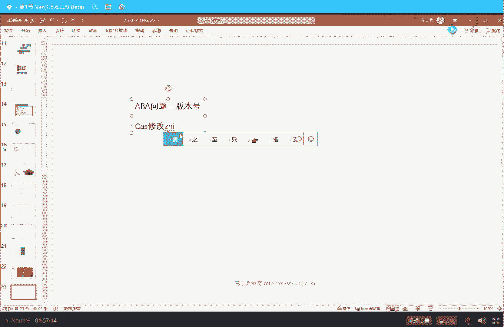

# 白嫖到马士兵教育价值23980的MCA架构师课程一次让你学够！ - P26：马士兵老师多线程：3.并发的本质是什么？锁的本质是什么？ - Java视频学堂 - BV1Hy4y1t7Bo

嗯。好，大家看这里，我们继续。那么下面就引出来另外一个问题。当有一个人持有这把锁的时候，别的人该怎么办？这里面呢是这么一个概念。就是不持有所的现成，这时候该怎么办？好好听我讲，不持有所的现程。

一般会这么办。他有两种办法。第一种办法呢就是。这种。嗯。再看一遍，说有一哥们儿进来了，对吧？寒江雪在里边待着，他持有这把锁，陈明过来了。哥们儿，你啥时候玩呀？他在旁边拎着裤子转圈，这个叫盲等待。

O这叫自选等待。自选等待的意思就是当我。我在这里well哥们，你啥时候玩，你什么时候结束？well你不结束，我就在这里转圈，什么时候你结束了，什么时候我赶紧进去。好，这叫做盲等待，拎着裤子转圈圈。

当然还有一种方式，这种方式叫等待队列。等待队列的意思就是说这里边有哥们儿进来了。好，我另外进来的人什么时候轮到我，只要有人持有这把锁，我二话不说，我进入等待队列，我先等着。那这个时候什么时候轮到你呢？

注意，凡是有等待队列的。需要经过操作系统的调度。OK这个时候必须有人调度你才行。也就是说，如果你使用这种。锁定的方式进入等待队列的这种方式是需要经过操作系统老大的，是需要经过它调度的。

所以我们就比较这两种方式，这两种方式有什么好处呢？优势和劣势这种方式是什么？这种方式我就在这里原地转圈圈，转圈圈转圈圈转圈圈。这种方式是我来了之后呢，我就直接进入队列，由操作系统来对我进行调度。

什么时候到我了，把我拎出来，我再去抢。这两种方式。一种叫自选锁，也叫轻量级锁。这种叫轻量级。好，另外一种进队列的要经过我们的操作系统老大。来进行调度的各位，这种叫重量级。当然，轻和重是相对的。

为什么这种叫重量级啊？因为你要对锁等待的这些线程，需要经过操作系统的老大，需要经过厕所所长，需要经过另外一个人帮你调度完，你才能继续执行。所以这种锁叫做重量级锁。

而上面这种锁你是不需要经过操作性能老大的，你只需要写个外循环，在这里等着就可以。那么这种的锁叫轻量级。当然，由于它是原地转圈，我要循环跟这等着，所以它也叫自悬锁。所以到现在为止。

我觉得这几个概念应该弄清楚了，什么叫自悬锁？什么叫轻量级锁？什么叫重量级锁。来弄明白这概念的同学给老师扣个一。我们可以继续吗？好了。当然有同学说这个公平不公平，别着急，那是另外一的概念，跟这个没关系。

那现在就问了。说轻量级锁一定比重量级锁轻嘛？同学说这不是废话嘛？注意他其实背后的问题问的是这个就是轻量级锁的效率。是不是一定比重量级锁的效率高？是这样的吗？自选锁的效率一定是是比是比重量级锁的效率高吗？

当然不是。同学们，你们想一下。假如进来干事儿的这哥们儿。这个这是谁进来了啊？墨斗先生进来了，墨斗先生呢本身。他肠胃比较好，干活比较快，蹭蹭蹭就完事儿。然后别的县城在原地转圈也转不了几圈，转个两三圈。

嘣儿，我就可以进来了。这个效率当然是很高的。因为我不需要经过操作系统的老大，我还要进入队列，再经过老大把我调出来，再来抢索等等，不需要经过这个过程。我就直接抢到了，哇，very good非常好。

同时呢等的人也不是特别多。哎，我进去之后就等两三个人在旁边拎着裤子转圈圈。okK完全没问题。😊，但是现在的问题是，假如等的人特别多。锁定争超级激烈，1万个人在这里等。那么你们想象一下。

这1万个人拎着裤子在这里转圈圈。注意所谓的转圈圈，是你写了一个我要循环啊。是写了个物要循环，物要循环是要消耗CPU资源的。消耗CPU资源的话，1万个人。

CPU就拿把所有的资源都花在对这1万个线程进行线程切换上了。进行context switchitch上网。他甚至都来不及，好多都给你执行的时间都没有。那你想想看这个效率能高吗？一定不高。肯定不行。

所以这个时候我就应该采用另外的方式，发现没有？就是你一万个人人太多了怎么办？进队列进队列我就把你冻住，你老老实实搁那待着，什么时候轮到你，我再把你拎出来。😡，你消耗CPU吗？不消耗，你只扔到队列里嘛。

你有什么消可消耗的？😡，所以当竞争特别激烈。执行的代码时间特别长的时候。便秘的时候怎么办？重量你说。好，不知道我有没有说清楚这个区别，这也是一道面试题。就是自选锁的效率一定比重量机锁效率高吗？

I don't think so，并不是。不同的场景用不同的锁。好，当我讲到这里的时候。我觉得关于锁的最基本的概念，你应该已经建立了。那么下面呢我们来聊真正开始来聊 synchronized这个关键字。

嗯，我们可以继续吗？可以继续，老师可以了。这里呢是给大家打打基础啊。😊，开开胃。每个人的他的那种那种那种基础不一样，我只能招顾稍微呃基础弱一些的，好吧。

呃，下面我们来看这个关键字。

。

好，大家看这里。我们从最基础的小程序开始看，我们来了解一下呢这个signchronnet这个关键字到底是个什么内容。好好听我讲，我先说结论。呃，作为大场的面试题里头有一道经典的面试题，是这个题。

把它调出来。嗯，在这儿。

当场面试题里头呢有一个经典的面试题是这个。描述所的四种状态升级过程，描述 synchronize的重入什么 synchronize的一些东西。Synchronized。还有还有啊人车lock一同嗯。

锁的升级内存布局，vololaattile锁的四种状态啊，这种的都是下面我要讲的内容。磁悬锁一定米状的镜合效率高吗？这个我刚才讲过了。那么听我说。

关于schronize这个关键字。嗯。呃，拿这个关键字来说。这个关键字在最早的时候最早的时候指的什么时候呢？就是JDK的1。01。2这个版本的时候，这个关键字直接使用重量计算。啥意思？

就是我们说JVM不说过吗？JVM要起一个现程的话。它对应的内核线程是1比1的关系，对不对？它就会直接起一个内核线程。好，这些内核线程呢会去抢一把锁，对吧？就是就是他抢这把锁去抢它。抢它的时候。

我们说使用的是重量级锁。重量极锁的概念就是操作系统老大帮我调度。所以在最早的时候认真定最早的时候。是这样的。当我们看到这个关键字的时候。操作系统会接管。对应的线程。谁抢到了这把锁以及锁之间的同步。

以及线程之间的同步的状态？由他做好了之后反馈给JVM。GVM才能继续运行。所以它中间经过了一次倒手，你发现了没有？就JVM起了这个现程之后，得交给操系的老大帮我进行锁的管理，说到你了。

okK反馈给GVMGVM继续执行。我跟你讲，这个叫重量级。所以。synchronize最早的版本，这个关键字最早的版本，它的效率非常低。因为每一个不管锁什么样，不管有几个人竞争，他都要经过操作系统老大。

中间加一层加一层调度。本来我一个人能完成的事情。当然我就一会完成就行了，可是不不好意思，你得必须得中间加加加一老大来帮你做完这件事之后，反馈给你，你才能继续执行。所以这个叫做重量。你所最早的时候。是。

好啦。这这个奇奇奇怪怪的符号说有点不明白为什么需要内核线成强，不需不能。我不跟你说，最早的时候嘛，这是JDK最早的实现，因为这种实现最简单，你懂吗？就JVM这种实现最简单，等来该我管的事儿，我不管了。

交给谁去管，交给老大去管，你想想看我是不是省了好多事很多事儿。😊，这是最开始的时候。后来大家伙实在受不了这个schronnet的关键字了，本身用特别多，但是你效率又特别低。后来大家哎。

后来大家实在受不了了。咋办？终于。JD可以在后面的版本里头陆续对schronize这个关键词进行了优化。进行了版本更迭之后的优化，说大哥，你能不能上来，不要一下就去找老大去申请那把重量级锁，你别这样。

你不要这样，你能不能上来先。😡，做一点简单的，比如说最简单那个自悬锁，你总是能完成的吧。😡，好，这就是它的一个升级的过程。从最开始的时候，只有重量级锁，到后面呢经历了一系列的升级。

中间会产生一个自悬锁的状态。所以现在schronize真正执行的时候，它的过程比较复杂。Okay。为了讲清楚自选锁的原理以及它的升级过程。我看看啊，9。1刻，我大概需要花半小时到45分钟的时间。

来准备好的同学老扣一。嗯。好了，同学们。我们现在说这个自选锁这个概念，刚才我说过了啊，自选锁呢是在用户空间就解决问题了，就不需要经过操作系统老大了，不需要经过操作系统，用户自己就能解决问题。

那在线程数量比较少的时候，在线城执行的速度比较快的时候哈，这种方法它会非常非常的方便。所以针对于用户空间的这种锁，用户空间的这种锁。😊，这节K1。5之后。

推出了一系列的JUC的这个内裤下面的各种各样的锁。呃，为了让大家理解这个东西，我写了几个简单的小程序，大家认真听。我们先看这个小程序，这个小程序呢给大家一点点时间读一下啊，这应该比较简单。

就是我现在有一个变量，in特类型的M等于0。我呢起了100个县程，100个。每一个县城对这个数。给他加1万次M加加。最后我们得到的结果，正常的情况应该是100万。ok来。稍微给大家几十秒时间吧。

你把这小程序读一下，看能不能读懂。就干了这么一件事儿。就是我现在有一个资源。M。好多个县程，100个，每一个县程对他加了1万次，最后的结果应该是100万，这是我们理想的结果。好啦。这个程序大概能看懂吧。

有同学说latch是啥？大哥，这个叫门栓，是新型的一种锁。这如果你读不懂的话，没有关系，我就是用它来让整个线程结束的等待线程结束，好吧。嗯。当然这个小程序执行一定是有问题的。

我们把这个M的结果最终打印出来是多少？本来正常应该是100万的，我这是好3万多，我天哪，差这么多。本来应该是100万的对吧？但是他只有3万多，为什么？原因是。我分析一下就知道了。

它会找好多的呃加的加的结果。比方说M现在等于8了，那我第一个线能拿拿出来的时候。OK第一个线程拿出来，我把八变成9，把九往回写，对吧？写成写回成9。第二线程拿出来到CPU里面啊。他也把八拿出来了。

他也改成九了，8就往回写。所以呢呃本来正常的情况下，你应该是十的。但是由于呢大家伙一下子把这个八拿出来，又写到这县城一写了，在县城里大家都加成了9，最后一覆盖，最后结果还是9加了两次，最后结果还是9。

所以最后一定是达不到100万。😊，那现在问题呢。就是。怎么来解决这种问题呢？以前有同学啊当然这是我明天我明天想跟大家讲的概念啊，这个有同学说老师我加volt是不是可以？大哥。😊，我先问大家一个问题。

我在这里加vollatail，最终结果可以不可以，可以吗？😊，肯定不可以啊，注意vololaile只能保证两个东西。😊，一个是现成可见性，一个是指灵虫歪序。好好听我讲，我明天会给大家讲vollet。

但是我要求大家给我做一点小小的预习，能做到吗？就是你稍微理解一下什么叫volttail。vollettail有一个叫现成的可见性，这个也是牵扯的底层牵扯的比较深的一个概念。呃，明天的时候啊。

大家给我做一点小的预习，你起码要理解vololatile的线程可见性指的是什么？好吧。好。我们继续加vollet条肯定不行，因为你只是保障了现程可见性。我这边改了之后，另外一个线程可见。但是呢。嗯。

我需要把程序重新执行一下。嗯。没有地不啊，不去管他。但是你看到这个数字啊，96348虽然比刚才那个大了一点点，但是数字依然不对。呃。关于vollaile，如果你理解不了的话呢，咱们明天再讲。总而言之。

言而总之，你在这件事上加volatile肯定是不行的那怎么样才能行呢？画面卡了。hello hello hello hello，我还在吗？hello卡了，刷新一下啊。😊，这个是直播吗？这个不是直播啦。

这个是录不。理解吗？我就专门针你的录播。嗯嗯嗯。OK现在可以吗？我可以继续吗？可以继续给老师扣一来。😊，好，大家看这里啊看这里。要想解决这个问题呢，我觉得大多数同学都能写得出来，就是我给它上锁嘛。

就是当我要M加加的时候，必须得等我加完了。我这个线程加完了之后，另外一个才可加完写回去，另外一个线程才可以继续加。😊，啥意思？就是刚才我们分析过啊，说这里是八拿过来改成9。

但是同时呢另外一个线程也读出来了，改成9两个人一往回写，最后结果依然是9，这肯定不对。我要求是必须把这个班改成九，等我写回去了之后，另外一个线程才可以运行。

这就符合就是说我上一把锁在我这里噗噗噗拉便便的时候，另外一个人不可以继续拉，就这么回事。这个时候就用到锁了，锁的时候是怎么锁定呢？最简单的方式怎么来锁定？比如说我设计一把锁。

Object order a new object。然后我执行每一个建程的时候，持有这把锁上锁上完锁加1万次，然后另外一个线程才能运行。我们来分析一下。这就相当于。现在呢我有一把锁，就这把锁。

我现在要进行M加加1万次的时候，不好意思，我这个县程必须得拿到这把锁，记住，我拿到这把锁之后才能执行这部分。想象一下，我拿到这把锁之后才能扑噗噗噗拉便便。😊，好，只有我这个线程拉完了，我把这把锁释放了。

释放了。另外的县程才能运行。那么大家你想一下，这个时候最终的结果一定是对的。因为别的县程读到的都是我这线程执行之后的结果。他不会说存在那种数据不一致的现象。new object是全局的吗？

这不是局部的吗？大哥魅方法里面的有什么全局不全局的，记住我再跟你说一遍，这把锁锁定谁都可以，你只要锁的是同一个对象就行。你不能说这个线程锁定的是O，另外一个线程锁定的是B。😡，这个就不行。我讲完这个。

你应该会透彻的理解这个锁的意思了。当然，这样肯做肯定是可以的。100万完全没问题。现在的问题在于，我们假设现在sronet还是重量级锁。它如果中间没有升级的这个概念。好。他的效率依然很低。所以在。

JDK1。5之后诞生了这个包，这个包叫JUC叫java。呃呃呃呃。叫这吧这吧这吧concurring这吧这吧这吧。优是优是什么来着？java utility对啊。

有java的 utility concurrent啊就是并并发的这个包。在这个包里面呢有这么一个类，我不知道大家理不理解，下面我就要讲自选锁的概念了，就是自选锁的核心是什么？什么叫自选锁的核心？

到底什么叫自权锁？所谓的自权是什么意思？我就来给大家讲这个这个问题，认真盯。打概这里。所以在JUC里面增加了这么一个东东，这个东东呢叫atomicengr，叫原子的engger。

估计很多同学都听说过这个类，但是它类背后的背后的意思，我估计很少有人去钻研它。好，大家看这里啊。嗯。呃，这个attroomiceng到底怎么用呢？我们先说它的用法。

还是模拟我们刚才那程序atomic engine。小M等于缪1个at make engineer，然后它初始值设为0，然后依然是100个线程。但是我们不上锁了。

不上那个至少不上我们那个 synchronize的那把锁了。我们呢在每一个线程执行的时候，依然是给他加1万次。但是这个家我们使用的是叫做M点 increment andge。

就是对这个M increment增加and get，并且拿到这个最新的值。好，大家看这里，这叫做M increment and get。就是替代了原来的M加加。大家还记得吗？

我们写M加加的时候必须得上锁，对不对？但是呢我如果用atomic energy，我就不用上锁了。😊，不用写schronized的了，最后的结果依然是100万，没有没有任何问题。好。

听我说这里面他用到的就是自选锁。也称之为呢CAS它是怎么实现这种锁的呢？CAS是自选锁的实现方式。这个是怎么实现这种锁的呢？来。嗯。看这里我们可以继续吗？可以继续，老师可以。这是CAS的实验方式啊。

认真看。我们把它点进去看它的原码M点increment get它里边干了什么，我不需要上 synchronized。当我们点进来之后，我们这里访问的是atomiceng这个类的。

increment get方法在这个方法里面，它实际上调用的是unsafe这个类的get and at end方法。继续点。我们先不管这个unsafe是啥意思啊，我们继续点进来。😊，当点进来的时候。

你会发现呢在这个方法里面调用了这个方法。这个方法叫compare and swap and。好了，这就是CASCASCAS。Compare and s it。比较并交换。这就是他背后的原理。

这就是自选锁的实现方式。有同学说老师这里面到底怎么实现的？点进去。当然，当你再往里点的时候。不好意思，他是native nativeative什么意思啊？C加加写的嘛？就是hopot的C加加的代码了。

😊，好啦。能看吗？也能看。但是在我给你看之前，我先教大家什么叫CAS。好，可以继续吗？可以继续给老师扣1。嗯。

好，大家看这里。

。这是CAS的一张图，但是你不用换不用看这张图了，我我就直接跟你讲就行了。CAS本身的概念呢非常简单，它全称叫compare and swap。或者叫compare and exchange。

或者叫compare and set，无所谓啊，这就是CAS用来实现自悬锁，用来实现乐观锁的一种方式。这种方式是不需要经过操作系统老大的调度的。我只只需要在用户空间APP空间就可以解决。

它是怎么做到的呢？是这么来做到的。认真听。假如这里依然是我们的M的个值，这个M值它的值是0。现在有一个线程去运行它去对它进行加加。我这个线程把这个零。读到我的现成本地，就是自己的CPU里面给你们来理解。

好，把它算。加成一，再把这个一给写回去。OK这就是M加加的执行过程。那么如果在这个过程之中，我不用我上锁，不用我去锁定什么，这个时候该怎么做呢？是这样来做的，把这个零拿过来。改成一。

再往往回写的时候比较一下，比较什么呢？比较你现在的这个值跟我期望那个值是不是一样，什么意思呢？就是我看看你是不是依然是我期望的那个零，你是不是依然为0。😡，依然为零代表什么？

依然为零就代表着哥们儿在我把你拿过来做加加。往回写这个过程之中，没有任何人改变过你，这个就叫做依然为0。那好了，如果你依然为0，说明没有人动过，你没关系，那我就把你一一给你写过去。

这个我不用上锁就可以完成。我不用说非得加 synchronized，我就可以完成。我不需要经过操作系统老大的调度，我就可以完成。好了，这个就叫做CAS实现compare and swap。

我比较完了之后，我再给你设为原来的值。好，你先听理论，先听理论。先听理论，你好好听好吧，别着急。你们问的那些小屁问题，我后面都会都会给你解答。你先听理论。😡，好，那有同学说了，老师原来是0。

我把它改成一。但是在这个过程之中，如果已经有人把它改成八了，我怎么办？😊，好听我讲。很简单，你就再把这个八读过来。改成九，把九往回写的时候，看看他哥们儿是不是依然是八。如果依然是八，把你改成九完成。

如果你不是八已经变成12了。没关系，我再把十二读过来，一直到某一次成功为止，所以这是个死循啊。一直不断重试，好吧，成功为止。OK不知道我说清楚没有。这个就是CAS最基本的概念，就是我把你这个值读过来。

改完之后，我看看你是不是依然是我期望那值。如果你是okK我改了。😡，好了，这就是CAS的概念，这就是自悬锁的实现方式。当然。

作为这个咨询所来说，CAS来说面试有两大两大问题两大问题。看这里。我给大家稍微说一下。第一道问题著名的ABA问题。这个问题的核心性就是说这里原来是零，没错，我把你改成一，往回写的时候，我看见你依然是0。

但是你这个零非常有可能是别的县程把你改回8。另外一个线程又把你改回成0，也就是你中间经历了080这个过程ABA。此灵非彼灵。好，像这种问题怎么解决？你的。女朋友。跟你分手之后，又经历了别的男人。

等你回来的时候，发现你的女朋友依然是你的女朋友，但是是经历了别的男人的女朋友。那么你怎么解决？你怎么监控？很简单嘛，你加一个版本号不就可以了吗？加什么volat。你加个版本号不就OK了吗？

你在他的脑门上，在你离开的时候写1。0。经历任何一个人的时候。加一。好，当你回来的时候，发现他脑门上写了99。0，那么你就应该知道okK。你需要原谅他。所以加版本号就可以解决。这是第一个问题。

当然有同学说老师具体的那个是什么样的内容？听我说JUC里面有专门的类，有好几种，有加布尔类型的，有加数字类型的。总而言之，有加那个时间戳的都可以。总而言之，好，这个你加版本号就可以解决。那好。

第二个问题第二个问题才是最关键的。假如就是。CNS。修改值。

时候。