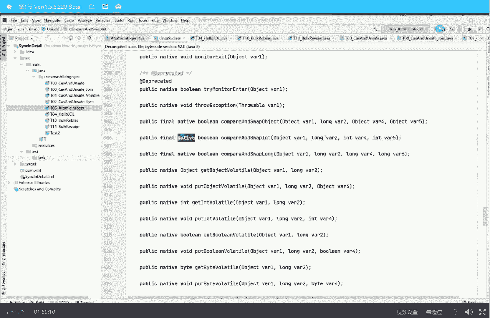
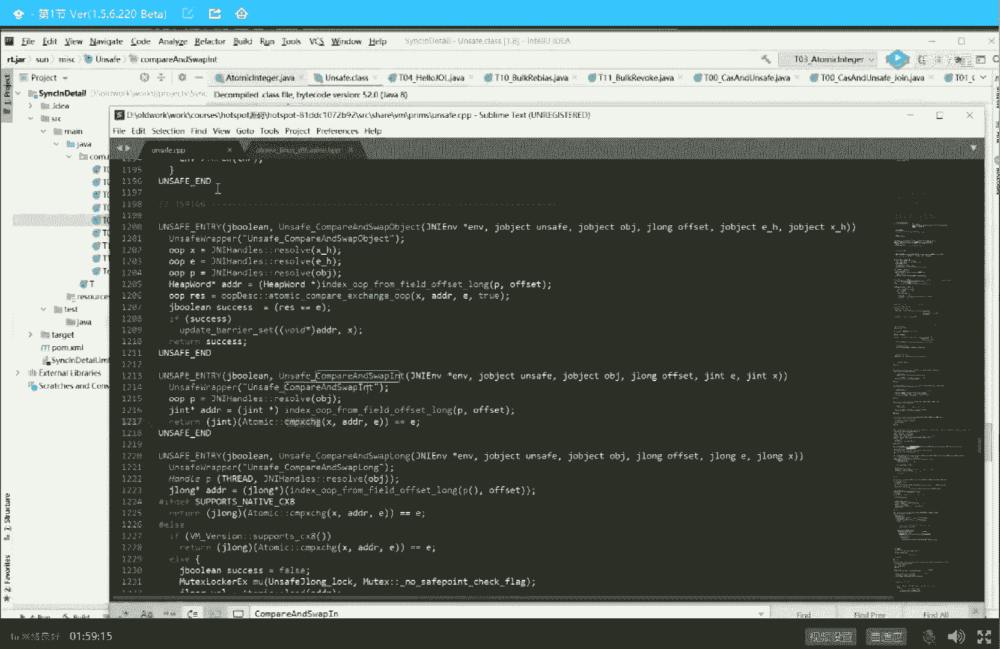
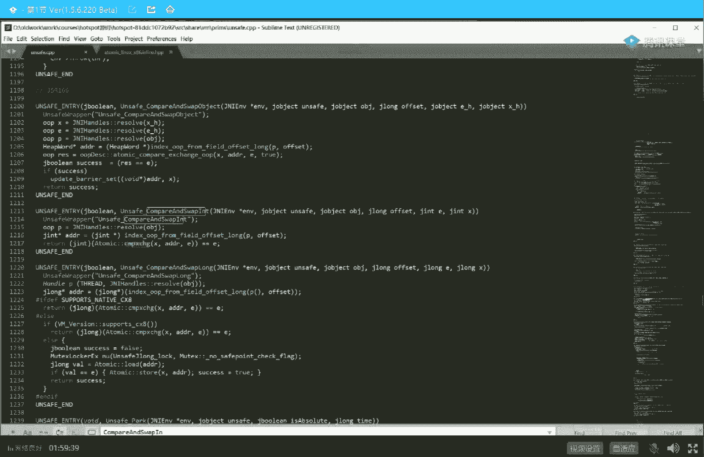
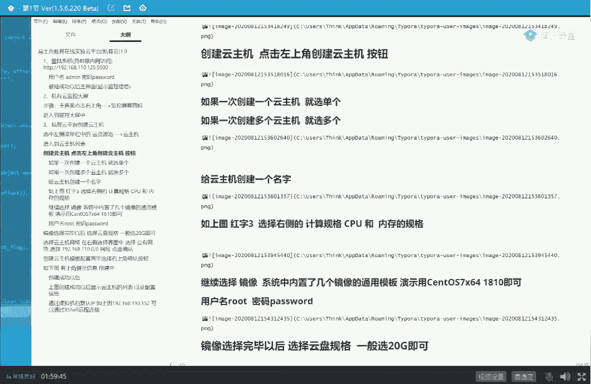
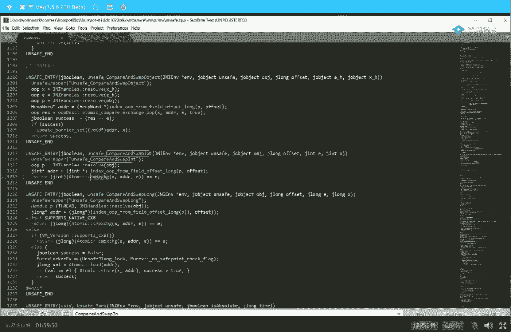
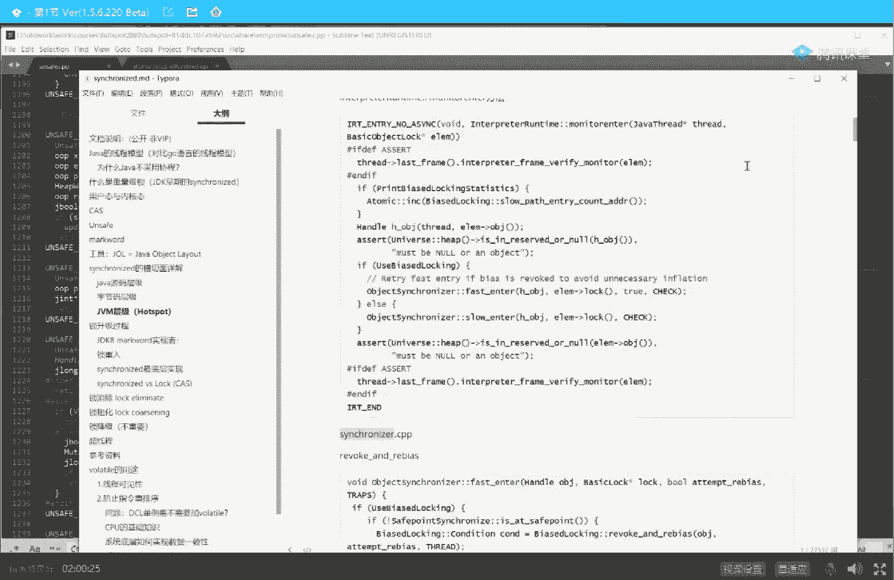
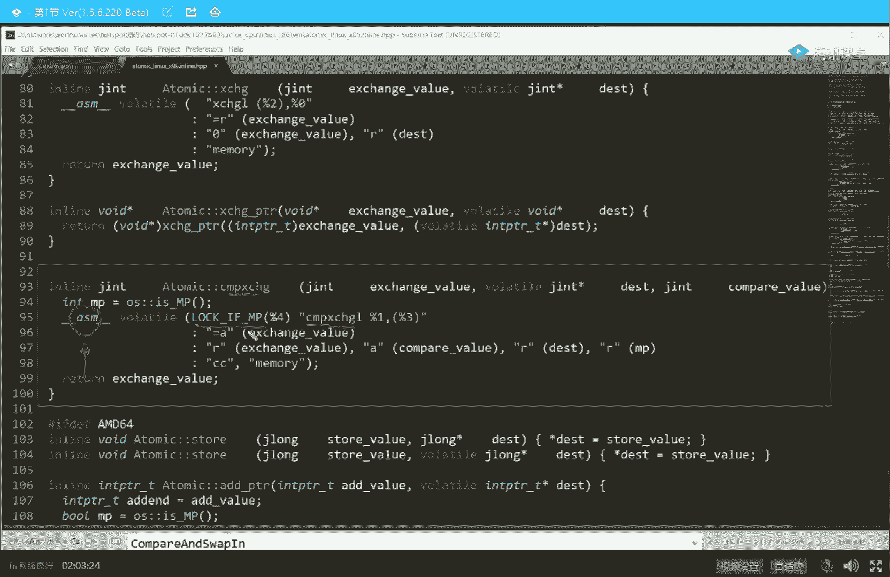
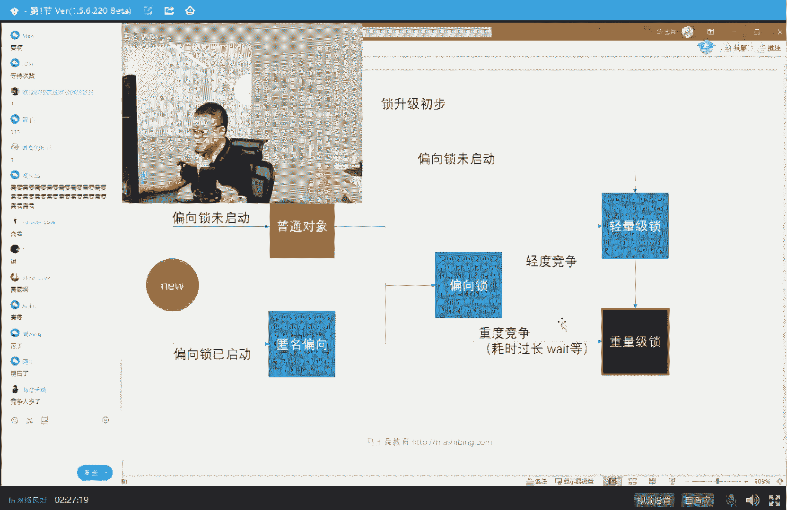

# 白嫖到马士兵教育价值23980的MCA架构师课程一次让你学够！ - P27：马士兵老师多线程：4.synchronized关键字的字节码原语 - Java视频学堂 - BV1Hy4y1t7Bo

我的原子性问题，这是啥意思啊，你听我讲，同学们，你们想想看，现在呢这个是个零，我拿过来改成一把一写回成零的过程是这样的判断，如果你哥们儿，你是不是依然为零对吧，如果你确实依然是零。

那么我这时候把你的这个零给你变成一不就这个过程吗，那现在假设我就问你，如果在你判断完依然为零，还没有改的时候，另外一个线程把它改成八了，你那时候咋办，所以这个肯定不行，如果想完成cs操作。

必须保证cas的操作是原子性的，好这两大类两大问题不知道说清楚没有，有一个我解答过了，另外一个我还没有解答，我一会儿解答给你，到底是怎么保证呢，好可以继续，同学老师可以来，你们还还还还在听吗。

还能跟上吗，ok看这里volatile行了，volt明天讲吧，为什么你们对volatile有这么多的执念呢，你觉得他能完成所有的事儿是吗，别扯volt能干的事很少好，大家看这里。

那么它到底是怎么来保证的呢，回过头来看我们的源码，刚才啊我们跟跟跟跟着cs代码，跟跟跟跟完之后跟了一会发现他是native了，这是unsafe这个类。

这个类unsafe这个类里面一个native的代码能不能看，完全可以。

如果你要看的话，打开c加加代码。

看这就是c加加代码，有同学说，老师您别这样讲完go讲java，讲完java讲c加加，这哪这哪跟得上啊，大哥你想挣七八十万，上百万，跟着我的思想思路走就行，而且真的没有你想象中的那么难。

因为难题全被我解决了，你跟着走就行，黑色看不清没关系啊。

像老师这么体贴的男人，你放心。

像老师这么体贴的男人。

肯定是都给你写在了笔记里了是吧，就是说在笔记里给你详细的记录，如果你想跟进来，跟着c加加代码的时候，去哪里跟，很简单，去哪里跟呢，诶去哪个类里面哪个方法里面，哪个方法里面哪个类里面直接去跟就可以啊。

笔记会提供吗，当然会了，明天吧，明天我修改里面修改一点里面的内容啊，可以可以没问题啊，tomorrow，这个c加代码怎么打开，这个稍微有点复杂，你得需要下载open jdk源码，然后搭建测试环境。

然后把代码给打开，我是直接给你打开的，好大家看这里我们继续继续来聊，我们刚才聊过啊，说在那个呃java的代码里面，我们已经读到什么地方了，就是当我们调用cs的时候。

实际上呃它调用的是unsafe这个类的compare and swap对吧，还记得吗，当然如果你要找c加加代码，实际上是在这里注意看它也是unsafe的cp嘛，然后找对应代码。

在这找叫compare and swap in，笔记我已经给你详细记录了他是在哪行，所以你要想读的话，跟着我笔记走就可以，我们来跟踪一下这个cs到底它是怎么实现最终比较的，原子性的这块儿还能跟上吗。

能跟上给老师扣一来，大概就是c加加，你可能不懂，但是你跟个大概就可以好，大家看这里，当我们得到这个方法的时候，compared swan，其实你往下读。

你会发现它调用的是atomic这个类的compare and exchange方法，看到了吧，compared and exchange，好，那我就跟进去呗。

看看这哥们儿里边儿due to definition，definition比较多，我就直接定位到最终的这块就行了，最终就在这儿，在这个呃头文件里面就a tonic linux x86 的实现。

原子的这个类在linux上x86 的这种架构上的一个实现，到底是怎么实现的呢，在这atomic这类的compare and exchange方法呃，我这个字体能放大吗，我看一眼放掉在哪里啊。

为大家放大一点啊，这是哪个方法，好我们来看这个方法，下面我们来看这个方法，在这个方法里面它到底是怎么实现的，它是一个汇编的实现，a s m叫ember，ok汇编，汇编语言实现。

这个汇编代码里面呢是这两条指令来实现，叫lock if mp以及compare and exchange。

好了，同学们，这个过程呢我就不直接给你这么一点点详细的演示了，你呢看我们这个笔记，在这个笔记里面跟踪来跟踪去，最终的一条实线就在这叫lock if mp。

然后后面呢是跟一条指令叫compare and exchange，我先说结论，听我说，先说结论，呃跟不上了吗，还能跟上吗，跟不上，要不然今天就，懵了是吧，呃呃呃呃ok ok我慢慢稍微回顾一下啊。

我们稍微回顾一下，大家记得吗，上来先解了现成的概念，然后讲了锁的概念，锁的话呢是一个synchronized的对吧，呃但是呢为了提高效率，除了synchront之外呢，它提供了j o c的包。

在这个dc的包里面使用的是cs的方式来上锁，c a s方式来上锁的意思，但它就是我们刚才分析过cs的概念，就是比较并交换，然后呢面试题里头呢有第二道就是比较并交换的时候，你要保证原子性，它是怎么保证的。

怎么保证原子性，我现在已经讲到这儿了，好，是不是稍微稍微就是梦梦一点的同学，是不是稍微可以继续了，不用死机，不用死记啊，好大家看这里啊，马上就要攻打山头了。

我们现在就是最核心的是我要保证c a s的原子星嘛，对不对，cs原子性怎么保证的呢，注意看最终的实现就在于就在于一条汇编语言上，这条汇编语言叫做lock呃，compare exchange。

当然呢中间呢有一个叫lock if mp，我稍微解释一下这个lock if mp，这人听我讲mp的意思叫做呃log a presence，不对，好像有问题，呃sors，哈哈哈。

mary processors k叫做多核多个盒好吧，好看这里啊多处理器啊，我是故意的，我是故意的，我看看大家有没有在认真听讲啊，好叫做多核多核处理器，前面加lock，单核处理器只需要一条指令。

所以我们先得出第一个结论，所谓的cs在最底层是由谁来支撑的，是由这条指令来支撑的，这条汇编指令，这条汇编指令叫做compare and exchange，所以我们说这么难理解。

就是一个cpu去访问内存的时候，完全可以有一种方式，这个方式就是c a s方式，就是这条指令来完成，你这里有零，把我这cpu拿过来改成一，我马上就给你写回去，比较一下好。

这个就叫做compare and exchange，但是在多核的时候，前面必须加lock，原因是什么，你们考虑一下原因是什么呢，我们再画个图，这是这颗cpu，就是另外一颗cpu。

通过一条总线去访问内存里的某个值，第一个cpu把这里拿过来的时候，注意用compare and exchange指令改成一把一往回写的时候，发现你依然是零，我就可以把这个零给你给你变成一了。

但是问题就在于，这条指令是不能保证原子性的，原子性不能保证就会发生什么情况呢，so把零拿回来改成一判断一下你依然为零，这个过程有可能另外一个cpu已经把零给改掉了，这是不行的。

那为了让它保证原子性怎么办，就干这么一件事叫lock，请大家记住这条指令，所以几乎所有cpu都支持的一条汇编指令，这条指令叫lock，lock的意思叫做锁总线，左总线是什么概念。

就是我这颗cpu在执行后面这条指令的时候，compare exchange把总线锁住，只让我来用，别人不能用，好了，这就是在汇编语言的一个实现，ok，好看这里我再说一遍，在这里面有一个误区。

有同学说老师我单核cpu就不用加lock了吗，大哥加洛克的原因主要就是说执行后面这条指令的时候，不被其他cpu打断对吧，保证原子性吗，那我就想问你一句，你自己在执行一条指令的时候，都能把自己给打断吗。

自己先把自己打死，再去打，再去打敌人是吗，先把自己杀了再去杀人，不可能，所以只有在多核cpu的时候，当然现在都是多核。

所以最终的cs的实现就是这条指令叫lock compare and exchange，呃我们稍微回顾一下，我估计讲到从讲到讲到现在呢，有小伙伴们有可能有一些些些些些许的晕菜是吧，晕菜呢也很正常。

我先跟你说一下，因为这里呢是真是少说50万年前左右的内容，所以有点云才是正常的，呃不着急，是我慢慢给你捋，我呢最开始给大家讲的呢就是现成的一个最基本的概念。

以及呢线程用户空间的线程和内个内核线程的一个对应模型，jvm是一比一，go on呢是m比n，这没有关系，多线程访问的时候需要了解锁的概念来来保障数据的一致性，最最早开始的时候，像java这个锁。

最早开始的时候要经过操作系统的老大来帮我调度，这个叫重量级锁，后来jav进行了优化，诞生了ju c这个包，这个包里面有各种各样的工具，比方说reenterlock，比方说a tomic integer。

好这些东西它背后的原理是什么，它背后的原理不是重量级，它是在用户空间解决的，这个叫做轻量级锁，也叫做自旋锁，它的实现方式是什么呢，它的实现方式是c a s cs的概念，我给大家讲了，零。

写回来比较依然为零，给你改成一，但是比较的过程会产生两个问题，第一个是aba问题，可以加版本号来解决，第二个是必须保证比较并交换这条指令的原子性怎么保障的呢。

最终我们根根根你就会发现是用这条指令来保障的，好，讲到这里的时候，任何面试官在问你关于这方面的问题，你就可以吊起来揍他了，js里面都是cs实现的，对这uc里面全都是cs实现，好了，呃我们那个可以继续吗。

我讲到现在为止问啥是cx compare exchange，compare exchange，就cs呀，比较并交换呀，刚才不说了吗，你为了50万年薪，是不是也该拼一拼，对不对，讲到现在为止呢。

我基本上讲清楚了，就是死c a s是啥意思，轻量级锁对吧，重量级锁又是啥意思，重量级锁，但是现在我还没有给大家讲所谓的锁的四种状态，就是synchronized的实现原理，听我听我说。

新版的synchronized他比较牛逼，它并不是像原来那样直接使用重量级锁，在synchronized的执行过程之中，它实际上经历了一个所升级的过程，看着脸，我们先说结论，还是那句话啊。

学东西呢先学脉络，实际上呢现在的synchronized他经历了一个偏向锁，偏向锁，偏向锁到轻量级所，也就是c a s，也就是自旋锁到重量级所的一个升级过程，今天还来不来得及给大家讲升级过程啊。

允许我来杯水了，我知道你们有各种各样的问题，主要我给你省略了很多细节，这个没招，第八大奇迹你都问了好几遍了，读一读atomic reference。

那个那个那个那个atomical stamp reference那个源码一看就明白，很简单的啊，为什么喝水让我们看着，因为我要有有段时间不说话，你以为我去世了吗，我让你看着，表示我还活着好吧。

这个过程呢相对来说也比较复杂了，讲完的话估计俩小时呃，我呢先给大家讲一点初步的内容好吧，听听听这里面有几个概念啊，第一个概念呢叫做偏向锁，第二个概念那叫轻量级锁，第三个叫重量级锁，我先解释这三个概念。

其实有两个概念，我已经解释完了，轻量级锁，完重量级锁下面还有一个锁呢叫偏向锁，偏向锁是面试的重灾区，这是面试的重灾区，这里面的细节超级多嗯但是呢我我基本上也都给大家写在了文档里啊。

你只要是愿意朝着更高的薪水去努力，稍微花点时间就把它拿下，并不难，你只要听我讲就不难，ok我可以开始了吗，今天讲的内容不难吧，是不是很多概念也就明确了嗯，聊一聊啊，今天聊最后一个内容偏向锁。

然后我们给大家演示一点小程序好吧，请开始你的表演，我就不表演，初学者能听懂，对我是争取让初学者都能听懂啊，你认真听就能听得懂，至少听力大概嗯好西瓜超人已经饿了，我们先来聊偏向锁这个概念。

所谓的偏向锁是什么概念呢，偏向锁不是一种错，他不是锁，严格来讲他不是锁，不是说要插进钥匙去把这把锁给锁定了之后，好下面的执行的时间片就归我了，只有我一个线程在这里面可以运行，不是这么回事儿。

偏向左的意思是这把锁非常非常的轻，比那个轻量级还轻，它严格来讲不是一把锁，他所谓的占有这个坑的，别的都是都是上锁对吧，它不是它是什么呢，就直接把名贴在门上就可以，比方说雨我看见了雨了是吧。

哎雨说这是我第一个人，他作为第一个县城想进来占有这个坑，想拉个便便，雨呢就直接把自己的名字往上一贴，pg往上一贴，ok搞定好了，这个坑归我了好了，这就是偏向所有同学说老师这太简单了吧。

那跟那个别人要抢那把锁有什么关系呢，认真听我讲，这把偏向锁最关键在于不用抢，只要你第一个线程过来，这把锁就是你的就偏向于第一个县城，所以偏向所最关键的是不用抢，你懂吗。

只要把这个id号把你现成的本人的名字往上一贴就可以，有同学可能就会讲了，说老师具体到底是怎么实现的，贴在哪儿呢，我一会用代码演示给你看，你就理解了好吧，我先给你讲概念，偏向锁就是把自己名字往上一贴。

不用跟其他人去抢，锁好了，这把锁归你了，那有同学可能就会说了，说老师，如果你这个名字贴在门牌上的时候，有另外一个哥们儿过来了，欢乐马来了，说你这个雨啊，怎么在里边老不出来，我来了。

你凭什么还继续再往里边怎么办，第二个奋斗也来了，田坤也来了对吧，这哥仨都来了，说不行，这个不能老偏向于偏向于你一个人，我也要抢这把锁，怎么办，升级，怎么说把你的名字给扯下来，擦撕下来，然后大家伙开始抢。

怎么抢转圈，c a s方式，自旋的方式，拎着裤子转圈，谁抢到，就算谁的，谁把自己的名字贴上去，谁持有这把锁好了，就算谁的，这个叫第一次锁升级，第一次锁升级就是从偏向锁，然后直接升级到了轻量级锁，自旋锁。

但有同学听到这儿呢可能会有疑问啊，说老师这事儿不对啊，这个为什么要有这么一个偏向锁，那我上来之后，大家自选抢不就完了吗，为什么第一个线程还要偏向他一下呢，是不是大家会会有这个疑问吧。

有这个疑问能给老师扣一，丢不掉，这里面的内容稍微深一点啊，你认真听，大家知道啊，呃有一些那个类，比如说vector，比如说hashtable。

啊比如说那个像还有什么那个那个那个那个那个那个string buff，这些类的应该都听说过吧，好这些类里面的方法有一特点，这些方法都写了synchronized。

里面有一个方法方法全写了synchronized，好，那我就想问你啊，我们先假设根据呃整个的工业界的一个调查，虽然说这些方法全上了锁了，但是在百分之七八十的情况下，实际执行的时候只有一个线程在运行它们。

你们可以自己回想一下，有的时候你们自己就调用了里边这个方法，但是真的会有多线程在抢吗，百分之七八十的时间只有一个线程在这里运行，好了，那这个时候你就想了，如果百分之七八十的时间只有一个线程在这运行的话。

当我需要synchronize的时候，我我我我我我我锁竞争的时候，我总是要竞争一下的话，这个效率就太低了，我能不能这个县城来的时候不让他有所竞争，直接往上贴一个id号就可以，你直接把自己id贴到这儿。

就可以把这些名字往上一贴，这样就省了很大时间的一个所竞争过程，省了竞争过程，效率是不是就提升了，我们再说一下，假如不存在这这把偏向锁，那么我是不是看到synchronized的，我就得动用竞争机制。

即便是你只有一个线程，我也要你参与整个竞争机制，你得上去做个演讲，竞选是你这把锁才归你，所竞争jvm内部一个管理所的过程，你可以想象一堆代码得了得帮忙让你管理整个锁的这个过程，假如没有偏向锁这个事的话。

你这个代码必须得启用，让即便你只有一个线程，你也得经历这个代码的流程之后才能拿到这把锁，所以偏向锁，严格来讲不是一把锁，就是第一个线程来了，我就假设没有竞争，假设都是你运行在百分之七八十的时间。

你就你只要直接往上一贴就是你了，不知道这个大概的意思，我说清楚没有，还有没有同学有疑问的，懂了是吧，嗯好了，这就是偏向锁，那有同学说了啊，当然这里面呢其实，有一些特别复杂的面试体验啊。

我们稍微过过过一点点，看看大家能不能接受，1p不稳定，废话当然不稳定了，你贴上你名字什么时候所升级啊，只要有人过来抢，就得进行所升级，听懂了吗，我再说一遍，只要有你把你名字贴到这儿了。

只要有一个人过来抢这个锁，就必须得升级，因为这个时候就有竞争了，听懂了吗，就俩这哥俩得抢了，谁抢到算谁的了，ok，好了，所以偏向左呢就是为了优化那些百分之七八十的时间。

只有一个线程在运行synchronized的代码所设计的一把锁，我觉得最基本的概念大家应该了解了是吧，嗯，好那下面的问题呢我们就来看一眼这个偏向所能，彭彭第一个线程来的时候，怎么知道不需要竞争大哥。

如果你是jvm，你就知道你要是jvm，你就知道听懂了吗，jvm代码里面自己判断呀，对一个线程是线性组，两个线程资源所yes，无锁，大家记住啊，无所这个词最好别用，就这个词儿是特别恶心一词儿。

无所这个词儿你们最好别用，非常容易产生歧义概念，这玩意儿啊是大家发明出来用来方便交流的，以前原始人的时候不知道这个东西是什么，只能说这这这这这个这个这个这个说不清楚，后来大家发明了一个概念。

是这叫便便好，以后一说便便知道什么意思，有人发明这个词儿叫吴所，这个词儿太讨厌了，这个词无所原来的意思叫做没有重量级锁，所以所谓的自选，所谓的cs它都叫无所，但是呢后来又又又有人把这个教程自旋锁。

那他那无所到底是不是到底是不是把所别抬这杠理解什么意思就行，你不要跟孔乙己似的，搁那纠结，回字有多少种写法，没意思好吧，我们可以继续了吗，可以继续给老师扣一哇，十点了，领会精神就行了。

对啊就是没有重量激素，原来这个意思啊，好大家看这里，我们来看，依然会回到这张图啊，我靠我都觉得讲的有点多了，你们你们还能撑得住吗，完全没问题是吧嗯，能给老师来宣传课程了，行一会给你宣传啊，很有意思。

对打开这里锁的四种状态是哪四种呢，new出来刚刚new出来，没有锁的状态，偏向锁状态，轻量级锁状态，中量级锁状态，这就是锁的四种状态，中间有一个各种各样的升级的过程，所以偏向组来说。

什么时候升级成轻量级锁呢，其实非常的简单，你好好想想就知道了，就是只要有一个人过来跟你抢，就得把你这哥们儿撕下来，不把你撕下来，撕下来之后，咱俩开始抢对吧，这时候就就就设计成轻量级锁了。

轻量级锁就是大家拎着裤子转圈在那等，你就想象形象一点，知道吗，你自己拎着裤子转圈转，转来转去的，在那等着说，轮不轮到我了，轮不轮到我了，ok这个就叫轻量级锁，重量级所示，猎人裤子的人太多了。

实在是那个cpu忙不过来了，怎么办，扔到队列里去，那现在问题就在于什么时候轻量级会生成重量级，能这个呢细节其实比较好玩，需要我讲嘛，基本上就是判断你旋转多少次，比方说你拎着裤子转了十圈都没轮到。

你不好意思进队列，等待的人太多了，我cpu最多能接待20个人，你现在都来了四个人了，不好意思进队列。

