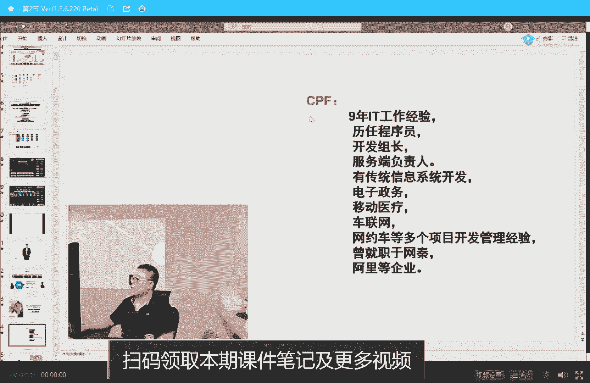
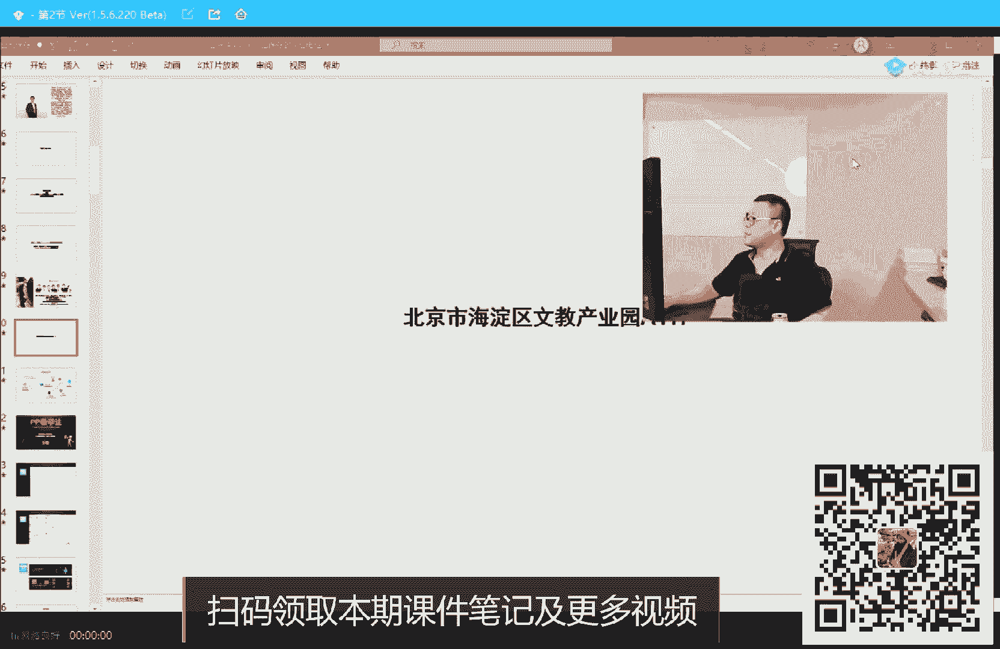
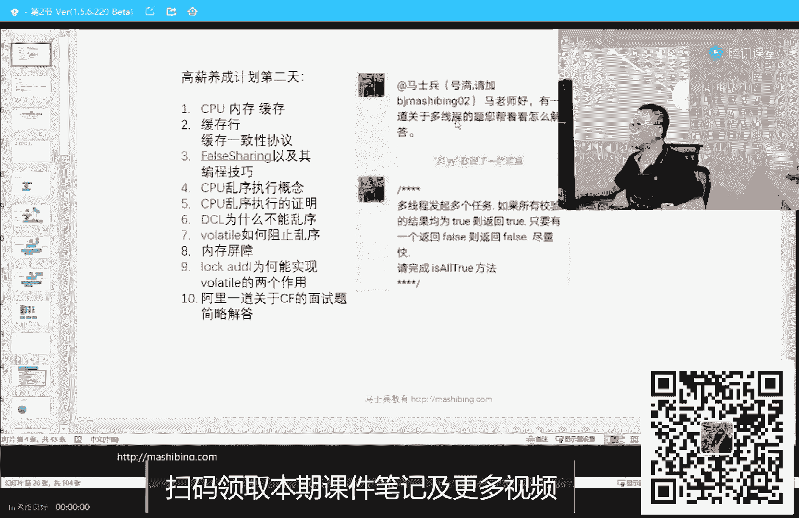
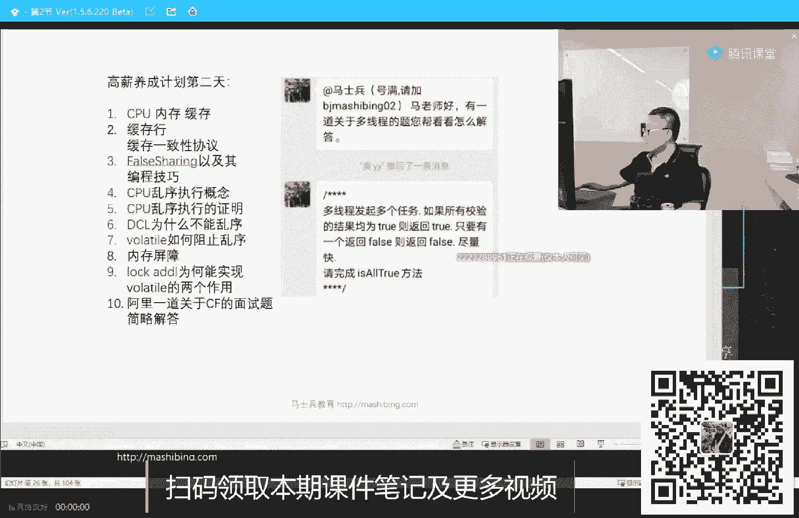
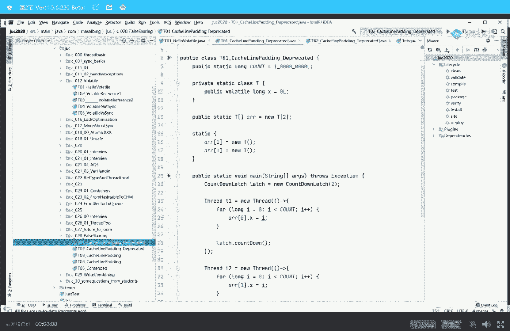

# 白嫖到马士兵教育价值23980的MCA架构师课程一次让你学够！ - P29：马士兵老师多线程：6.02什么是CPU缓存L1 L2 L3？ - Java视频学堂 - BV1Hy4y1t7Bo

扣个一，我得给你拎出来那张图，看一下啊，在我的，能找得出来吗，来看看看这个薪水，就当老师扫盲了是吧，来吧，一到家立马开机上课，不是应该开课上机吗，学完if能听懂吗，完全没问题，字节跳动，对。

出去谈工资一般怎么定位，一般比上家涨个30%到50，我希望大家伙拿到这个薪水啊，这是字节跳动，也就是take talk在美国开的工资，当然人家是个博士，ph d，yes，84万美元，50万的股票。

24万的津贴，10万的签字费，希望大家有朝一日拿到这样的一个薪水啦，哈哈哈哈哈嗯，只要你肯学这行，能给的薪水还是蛮高的，只有在上坟的时候才看过这么多钱，其实等别人烧给你这么多钱的时候。

也许你就什么都看不到了，你就已经见我们马家门的最后一位牛逼人士，马克思通知去了，这是在这上出来的吗，然而并不是哈，我们有ai的课，但是达不到博士中水平，pp 8课程教程大概要多久，快的3月，慢的2年。

好滴小兔纸，新娘新娘考博，其实这个博士呢是已经有7年的工作经验了，你见过最快的是三个月，yes字节二杠一的飘过，二杠一是什么水平，好像听上去比较低的，p8 也是要博士学历吗，不是还有一分钟，说的很对。

8。05，我们准时开球，84万刀，也是打工仔100万刀，你在这说来说去说风凉话，你也是个人键盘侠，谁都会当那叫高级工，学spring源码，看什么书，跟连老师的spring源码课，一般人都都p7 都费劲。

肯学p7 就没那么难，普通大学刚毕业，正常多少工资，普通大学刚毕业，不要在意工资，找更好的更大的企业去做好，我们开始讲技术吧，好不好，聊了半天废话了，来准备好的同学给老师扣一，有没有第一次来到课堂的。

我简单介绍一下公司跟我自己本人了，有没有有的话给老师扣个一来，反正都是要扣一的好，我就当有人是第一次来呃，第一次呢我稍微简单介绍一下咱们的公司。

拿错ppt了，就是这么的帅气。

哎。

啊嗯第一次来到的小伙伴啊，我稍微介绍一下那个我们公司呢叫马士兵，教育好那个我我我我叫马士兵，哈哈哈喽，我们呢是编程腾讯课堂的编程类目唯一的一个最受欢迎的课程。

这也是站在站在站在学员的角度评的唯一的一个奖啊。

我们拿到了还不错，这是本人大概批了200多遍。

好就不看了，除了我个人之外呢，我们有一大堆的牛逼的老师，我觉得牛逼老师带牛逼学员在这呢我就不一一介绍了，有两位清华的老师，我和周老师都是毕业于清华，有一位北大的博士后泸定罗老师，他是前腾讯的ai的主管。

然后呃在北大的博士后毕业，掌区的cpu好，把bat歌的老师在这儿全有百度的，知道老师，阿里的黄老师，陈老师，京东齐老师和陈老师嗯，阿里还有一位那个那个那个呃徐老师，然后腾讯的呢罗老师。

那么海江老师呢是原来前掌去做游戏，月流水过千万的呃，我们的小姐姐呢是留学北美的博士，来教大家英语的一些方面的课程。

呃叫带我们算法课程的老师呢，呃此人姓左名左左，左冷禅，没有，他开个玩笑，左成云，左左老师呢是ibm，百度amazon都待过，算法教学呢已经做过6年了，带的学生进到头条，别提高tmd p的非常的多。

这位老师是那个左老师的助手，tom cat老师，这这这位老师比较严厉啊，我一般都懒得介绍他，曹鹏飞，曹老师是原来阿里的老师，他是因为阿里的一线的开发人员。

然后呢被我拉过来来给大家专门讲课，呃，就是这位老师here，他这是我们的曹鹏飞曹老师啊，目前在我们网约车第三版呃，李娜李老师呢是我们的呃，运维的老师，也是我们私有云的搭建者呃。

我们最近有一个私有云的平台已经上线了，正在搭建之中吧，也不能说完全上线，呃就是来给学员们开放我们自己的一个私有云，这个私有云呢就是你你你你你可以创建你自己的云主机，嗯，因为好多人呢在做实验的时候。

比方说几十台服务器这样的一个这样的一种一种实验环境，它实际上它在自己的机器上怎么搭都搭不出来，那这时候怎么办呢，在云上，在云上帮你的呃，你创建好了之后，就不给你不带你创建了，创建好了之后呢。

直接就从远程的那个shell上就可以执行任何操作，我看看我我我又没有权限运维的产品，互动模板机的通用性，一停止，在对面的测试环境一般是沉到它是内蒙mysql，这是我们搭建p8 的时候的一些建设的机器啊。

呃这个呢是主要由原谅李老师带着他的团队来帮咱们搭建这套东西，测试这边的老师呢姓陈，叫陈记，这个大家在网上一搜就知道他是原阿里的老师，也是现在为阿里提供测试的解决方案的老师，黄俊华老师呢是前阿里的老师。

前美团的老师，他呢24岁从美团离职的时候，差不多是百万左右的年薪，呃我觉得我请老师呢，我是想请给大家请到最牛逼的老师好吧，不仅技术牛逼，而且还能表述出来，而且呢还能有给大家的一种激励的这种机制才更好。

所以呢在这边请的老师呢都不是那种泛泛之辈，也希望大家伙能跟上他们的步伐，嗯，呃京东的呢有咱们的孙老师，他带完咱们的11月的课了，呃为什么普通普普通通的一个室友，我要请京东老师来讲，其实非常简单。

就是我想让大家伙理解呃，cho像这一类的东西在真正的大厂里头是怎么运用的啊，这个非常的重要，目前呢孙老师正在带activity的课程，呃，阿里的我们pc的程老师给他们带过killm的课程已经上线了。

kim呢是我昨天讲过的一个概念，就是携程在java里面的一个实现，我还有很多学生也是很牛逼的，其实啊但是呢他们不是非常的方便出来讲课，那这时候怎么办呢，做我们的课程顾问，从p6 到p 10。

咱们的课程顾问全都有，因此大家伙在工作之中遇到了什么各种各样的不知道的解决方案啊，找我们问就行了，丢给老师就可以，我们的是位于北京市海淀区的文教产员a117 ，等疫情过去之后。

欢迎大家在周末的时候参加我们的线下沙龙。

ok公司呢我就介绍完了，我们开始今天的内容好吧，好可以开始了吗，好可以开始的方案了，扣个一开始啊，嗯。

好今天呢是我们高薪养成计划的第二天呃，我今天主要给大家介绍这么几个概念呃，cpu的内存缓存，什么叫缓存行缓存一致性协议，for sharing和它的编程技巧，cpu乱序执行的概念，乱序执行。

我向你证明d c l为什么不能使用，不能不能乱序，那么volatile如何阻止允许内存屏障是什么概念，为什么look at lj 0能实现volt两个作用，最后一道题关于线程池的面试题呢，我们看时间。

时间如果不够的话，那么今天可能讲不了嗯，看时间吧，好不好，放轻松了啊，放轻松了听呃，今天知识呢很好玩，也是很多面试官呢特别喜欢问的问题，我们一点点来聊这件事好吧。

好了我们开始啊，首先呢我们来聊一聊呢，就是作为计算机来讲，它的一个最基本的这种结构，其实昨天呢我讲过这张图了，由于有有小同学呢可能是今天第一次过来，我稍微的再给大家复习复习。

作为计算机来说最核心的两个组件，一个叫cpu，一个叫内存，我们的一个程序静悄悄的躺在硬盘上，qq。ex e，当你想让它运行的时候，一双击它唉b它就跑跑到内存里，分配了一块空间，分配一块内存的空间。

给他分配好它相应的资源，然后开始运行进程，这就是一个进程，进程呢是我们资源调配调配的基本单位，真正开始运行的时候是线程是吧，哎线程呢是程序开始运行的基本单位，真正开始运行的时候什么样呢。

就是在我们内存里头呢，有指令，有数据通过总线传到我们cpu，数据会存到我们的register里面，指令的位置会放在我们的pc里面，然后开始计算结果，计算好的结果返回到内存里去。

这就是整个程序的一步一步的执行过程，当然这里面呢有一个很重要的一个点，就是他们两个的速度不一致，cpu的速度比内存速度大概要快100倍，这边跑了100步了，这边只走出来一步。

所以就会产生了一个什么样的一个一个一种情况呢，你们可以想象一下，cpu这边呢做了个计算，然后下一步要去内存里头拿个数据，结果呢他就得等99个空的时钟周期就得在那等着傻等着它，速度太快了，内存速度跟不上。

他为了提升这个效率，实际中工业之中是怎么做的呢，实际工作工业之中呢是在cpu和内存之间多了很多很多的线程，sorry，多了很多很多的缓存缓啊，缓冲区缓存，好看这里，这是现代工业的计算机里头呢。

关于呃缓存这块儿的一个一个最基本的结构，我就直接把它画在了ppt上，大家理解就行了，作为速度最快的单元叫做寄存器，当然速度最快的单元其实呢是我们的a l u就是呃c计计算单元。

计算单元要去访问这里面数据的时候速度最快，然后访问储存内存的时候速度比较慢，大概是慢100倍，为了提升速度，在他们中间加了一系列的缓存，这个缓存目前根据工业实践得出来的最好的结果就是三层。

有同学老是问我，老师为什么不是四层，为什么不是五层，为什么不是两层，为什么不是一层，好了，这是跟工业实践之中测试得出来的结果，你记住这个就行了，就是三层，目前用的最多的就是三层。

缓存的最基本的概念应该不需要我讲吧，我觉得应该是不需要啊，缓存的话呢就是那个用到的数据最快的放在我们最近，离离我们最近的位置，呃原来曾经有这样的一个测算，从cpu计算单元l u到寄存器访问一个数据的话。

它大概是小于一个纳秒访问访问我们的l one，也就是我们的一级缓存，它大概是一个纳秒访问，二级缓存大概是三个纳秒访问码，三级缓存大概15纳秒，访问主存的时候大概是80个纳秒。

他们之间的大概从从从最头的这开始到最后，这大概是100比一的一个关系，那好在这儿呢我给大家讲一点非常基本的一些小小的概念啊，呃以前有同学了，总是不理解说老师这个l3 在哪里啊，l2 在哪里啊。

l one在哪里啊，呃呃呃呃r一在哪里啊，等等，听我说大家看这个图，你大概就能理解，那么每一个缓存到底在什么位置，每个缓冲区缓存到底在什么位置，这是我们的主内存，读一个数据的时候，去a r u需要计算。

需要一个数据，这个数据在这他会首先去哪里取取，从lo one里面去取，如果没有到l two里面找，如果l two没有到l three里面找，如果说这没有到我们的主存里面去找，它是一级一级。

这么找出来找下来的，从物理结构上来讲，l one和l two位于一个cpu核的内部，当然有的一颗cpu里面有好几个核，比如说这颗cpu这一颗cpu整个呢它里面有两个盒。

那么每一个核都有自己的l2 缓冲区和l two缓冲区，所有的核共享一个l three就是每颗cpu里面有一个三级缓存，第三集，不知道大家能不能看清楚，来这块没有疑问，同学老师扣一，很简单，ok。

那现在问题就来了，当我们读数据的时候，从内存里头读数据，我们来分析一下，从内存里读一个数据的时候，我可以按照一位一位的来读，就只有一个位，一个比特，也可以按照一个字节来读，也可以按照一大块来读好。

我们读的时候到底怎么读呢，是用到了一位的时候，我就把这里一个小位，一小位就读到缓存，然后这小位再读到缓存，这小位在读到缓存适量的吗，并不是，它是按照一定的长度来的，一定的块儿来的。

他读的时候是从内存里头，比方说我只用到了这一个数据，我并没有用到其他的数据，但是我会把一整块都放到l3 里面，都放到l2 里面，都放到l一里面，它是按照一块一块来读的，有同学说老师为什么呀。

为什么我不能用一点，我就读一点不行吗，这个程序呢有两个原理，程序运行的时候两个原理，这两个原理呢一个叫时间局部性，这个稍微的稍微学术一点啊，大家大概一听就行，这两个原理呢一个叫做时间的局部性原理。

一个叫做空间的局部性原理，所谓时间局部性原理指的是什么呢，当我执行完这条指令的时候，挨着它的指令很快就会被执行到，空间局性原理指的是什么，当我读到这个数据的时候，挨着它的数据很快被执行的。

如果你这个想象不到的话，你可以想象一下，这有一个数组，我们对数组做一个循环，同学们，你们想象一下这个数组的循环是不是我循环完第一个马上循环，第二循环，第三循环，第四个，所以你们想象一下。

如果说我每次只拿一个数据过来，我下次再拿第二个数据的时候，我还要从内存里头找一遍，放到我们缓存，放到缓存，放到缓存，反而这个效率会变低，我还不如直接去内存拿一次，慢慢拿过来，你还要填充中间的缓存。

所以这个肯定不合适，因此空间根据空间局部性原理，每一次拿数据的时候，最好是成块的拿过来，好这个问题不知道我说清楚没有，也是按块读取，根据程序的局部原理可以提高效率啊。

同时呢充分发挥总线cpu针脚一次性读取更多数据的能力，他一个针脚一次性只能读一位，他64个针脚，那就读64位，连着读好几次就能读好多个字节，应该没问题啊，很简单，那现在问题就来了，那这一块到底是多大呢。

这一块到底是多大，好好听我说，这一块儿呢目前先说结论，目前一块的大小大概是64个字节，请大家把这个结论给我记住也很简单，64个字节，有同学又开始抬杠说老师为什么64个，为什么不是128，为什么不是两个。

为什么不是三个，这里面依然是工业实践得出来的折中值，啥意思呢，就是在实践之中，人们发现缓存行你可以定得非常大，你一次性把内存一半全读过来，那才爽呢，但是你读取的时间读了一下的话，读取的时间比较慢。

另外呢你也成不开那么大个儿，你的缓存如果能重开整个内存一半的话，那你干脆就不要内存，直接全用缓存就行了，所以缓存量越大有它的优势，也有它的劣势，缓存越小呢，缓存越小，你一次性进入读俩数据过来。

那速度是很快，但是你马上要去另外两个数据的时候，你又得读一遍，所以也有它的优势，也有它的劣势，那么怎么办呢，人们在工业实践之中发现，64个字节对目前的计算机结构来说比较合适，所以得出这个结论好了。

这里就是64个字节的来历，我们稍微回顾一下，这是一个什么概念呢，我刚刚解释了，其实就是一个按块读取的概念，由于计算单元和寄存器和我们的内存之间，它的那个速度差非常的大。

因此在中间填写填了很多很多的这种缓存缓冲区，这个缓冲区我要在读取一个数据的时候，比如说我计算单元要想读取某一块里面的这个x，我这个我这个cpu这颗cpu要想去读这个x，我读书怎么读呢。

我会优先去我的离我最近的缓存里面找，有没有啊，没有没有，这有没有没有这儿有没有没有没有，怎么办，从内存读过来读过来读过来好，这时候我开始使用这个x开始做计算，那虽然我没有用到y。

但是由于x和y位于同一个缓存行，所以我会一次性的把这个缓存行全都拿过来，ok这是缓存行的概念，同时这一小块有个专业名词啊，就叫做catch line，叫做缓存行，这就是缓存行的最基本概念啊。

所以缓存行就是一小块一小块就这么个东西，记住这点就行好，那如果我另外一个cpu要是用到里面的y呢，同学们，你们想一下，我要用到同一个缓存行里面的y呢怎么办，他会去l3 里面。

他发现这个缓存行已经在l3 了，他还用去内存里面读吗，不需要他直接从l3 里面会机拿过来就行了，换机拿过来他就可以用y了，ok我讲到现在为止，关于缓存行的概念，大家是不是清楚了，来可以继续的给老师扣一。

大家记得这个图，好那下面呢我们来聊一聊，有同学说了，老师这个缓存行真的存在吗，好大家看这里啊，我给大家调个小程序，talk is cheap show me the code是吧，总是得看点呃。

因为看看点代码，好再看这里代码比较多，我找一下啊，就在这，ok我们来读个小程序，在这小程序里面呢，我们来观察一下呃，缓存行的概念，有同学说老师这个能观察出来，可以观察在这里有一个特别好玩的程序呃。

写写看看大家能不能理解是什么意思啊，在这儿呢我有第一个小程序，这个小程序呢先给大家一点点时间，你大概大概读一下十秒钟，15秒，你大概读一下，我给你解释解释，注意啊，我要求大家脑子里先存的一个概念。

每一行每一个缓存行是多大来着，还记得吗，64个字节对吧，接着这个概念每一缓存行是64个字节，好大家看这里，我的小程序呢干了这么一件事，首先呢我定义了一个类，这个类叫这个类里面只有一个成员变量。

是一个long类型的，它是一个x我问大家一句话啊，这个long类型的它是多占多少个字节，这个大家知道吗，long类型的数据占多少个字节，八个，ok这是八字节，再提醒一遍，我们的缓存行是多少个字节。

64个字节一行数据可以装八个long，我定义了一个t类型的数组，这个数组只有两个元素，然后我把这两个元素初始化，a0 等于new t ara一等于6t内存之中呢，你可以想象一下啊，就是一个数组。

这里面装了一个a02 a0 里面有个x2 a一里面有个有个x，然后干一件什么事呢，我干了这么一件事儿，我起了两个县城，第一个县城，修改为零，看到了吗，a0 点x等于i修改了多少次呢，i小于count。

count是1亿次，那么也就是说我第一个线程是修改为零，里面那个x修改了1亿次，第二个线程修改，而a一的x修改了1亿次，你先别着急啊，你先听我讲，我们先来，然后再来看最后的这个这个这个这个结论，看这里。

我先把这个程序跑一下，这个程序最终计算的一个结果值是什么，其实就是计算这个结果呢，整个程序跑完之后，大概消耗的时间是多少，跑一下，1501哎，怎么这么快，我这就换机器了，之后啊，1501啊。

大家记着一点，15011秒五嗯好，这是第一个小程序，这小程序大家应该能消化吧，我们来看第二个小程序，第二个小程序是什么，第二个小程序我别的地儿都没变，依然是两个线程，每个线程改为零的x11 次。

但是呢我重新定义了这个class这个t我们来比较一下这个定义，定义有区别，注意看这是我第一个程序的定义，这是我第二个程序的定义，大家比较一下，这是第二个，第二个里头呢依然是这个t。

但是呢我除了这个之外呢，我前面定义了七个lp，一到p7 ，后面定义了七个lp，九到p 15，别的什么都没变，看这里我们来看它的执行时间，跑一下432诶，刚才是多少来着，1501，这是多少，432。

发生了什么，大家想想看，能理解这件事吗，为什么我在这个地儿前面填充了bug line之后，后面填充了bug line之后，它的执行时间居然比上一个快了这么多太多了，为啥我们来分析一下这个这个效果。

你仔细听看。

这里依然看到一张图，这张图看起来比较直观一些，我们现在假设刚才第一个程序，这是那个x，这是这也是那个x，你把它当成y什么的，没关系啊，总而言之呢，这哥俩非常有可能位于同一行里头。

好位于同一行里头就会发生一件什么样的事呢，就会发生这么一件事，如果你位于同一行，那么当我的计算机第一颗cpu修改完这个x之后，根据我们要保持数据一致性来说，数据的一致性，我这边这一行数据发生了改变。

现在的cpu都支持叫缓存一致性协议，所谓的缓存一致性就是缓存行这个数据一定要保持一致，我这边这个数据这个这行的数据改了，哥们，你另外一颗cpu啊，得去内存里头重新拿一遍我改过的数据。

那么就会发生这样一种情形。