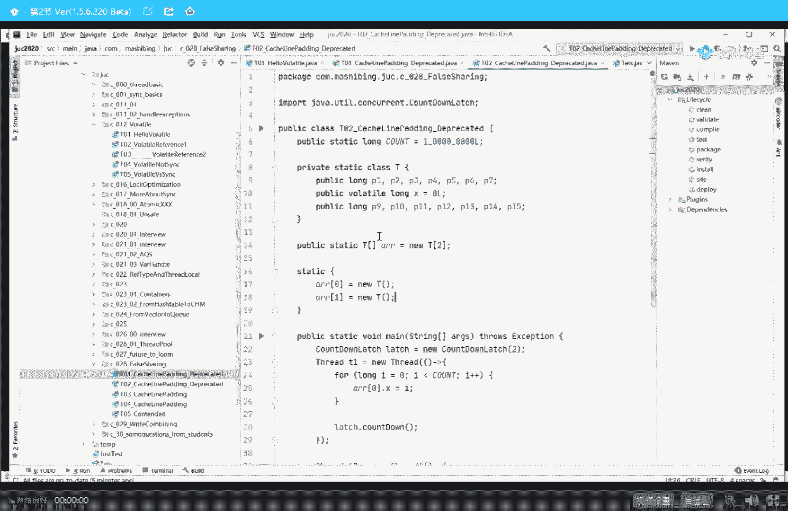
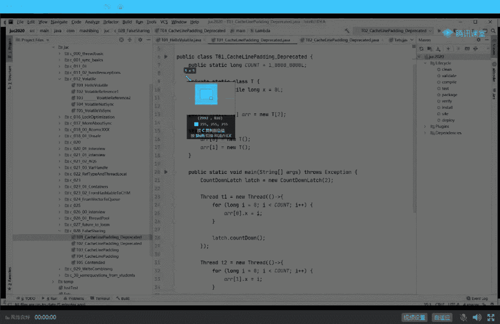
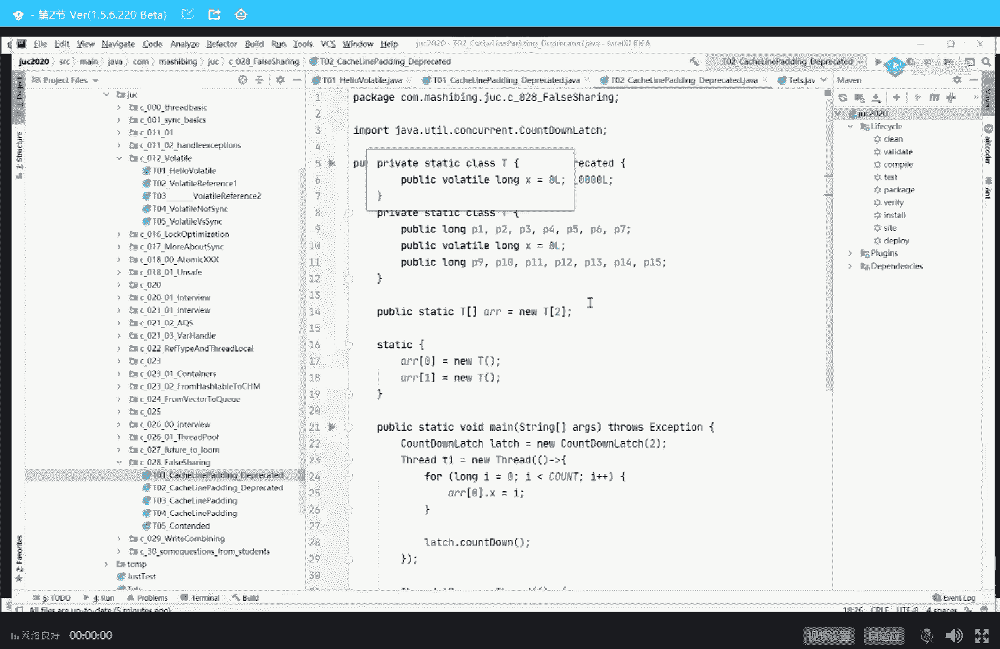
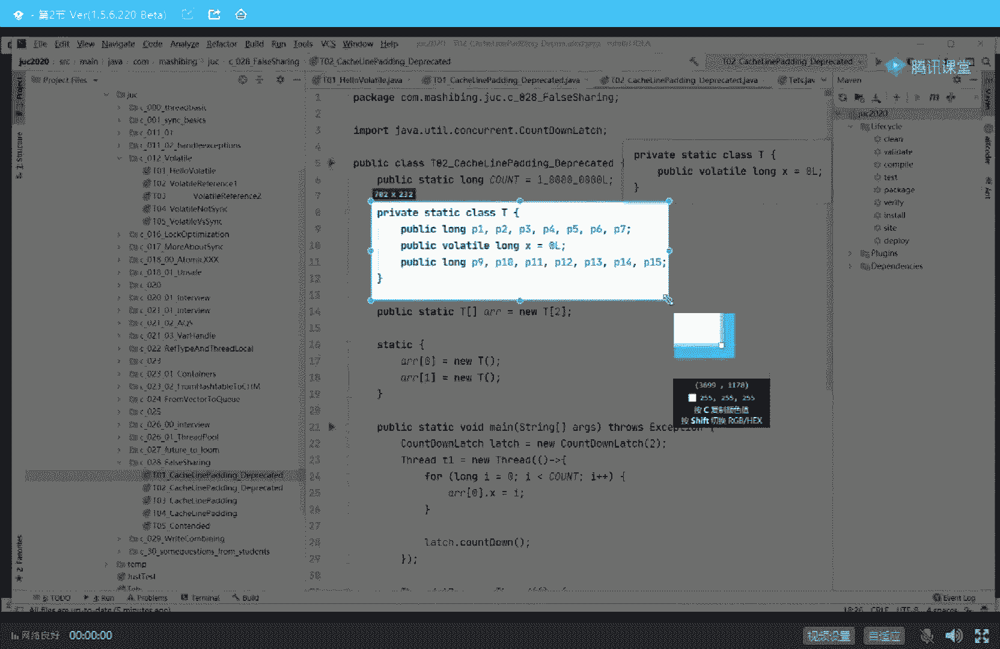
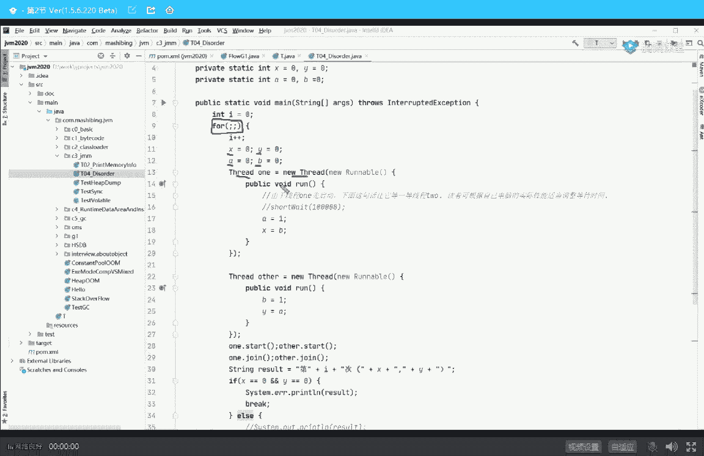

# 白嫖到马士兵教育价值23980的MCA架构师课程一次让你学够！ - P30：马士兵老师多线程：7.什么是缓存行？为什么会有缓存行？ - Java视频学堂 - BV1Hy4y1t7Bo

好像也失效了，你得去内存里头重新再给我读一遍，所以我改了1亿次，你改了1亿次，互相通知来通知去通知来成绩，都把时间消耗在互相通知的这个消耗上了，不知道我说清楚没有，那有同学可能就会说了。

说老师那第二个程序就跟这个不一样吗，来我们来看一下第二个代码，第二个程序代码，第二程序代码什么样啊，你仔细看看第二个程序代码是我在数据前面怼了七个狼，那也就是说如果是缓存行，正好是对齐前半截的话。

那就是从p一开始一直到这个x这格八个位于同一行，那如果是往后来呢，就是这歌八个位统一好，那如果是中间的，那无非就是说我这有几个加上中间这个x再加上后面几个位于同一行，为什么是七个小伙儿。

64个字节为一行，一个long占八个字节，你要把剩下的占满，他不是七个浪吗，七个浪七个隆咚呛，好，没问题没问题吧，所以这种写法就产生了一个后果，这后果是什么呢，就是我这x啊，你放心，无论你怎么排列。

你在内存里排来排去，他绝对不可能和另外一个t里面的x位于同一行，这哥们儿绝对是单独的一行，单独一行有什么好处，单独一行的好处就在于，我这个只改我自己的这个x呀，你这个只改你的x呀。

我们不用互相通知来通知去的，保持一致，所以这个效率变高了，ok这个小程序呢我就给大家讲完了，不知道大家get到了没有，好我们可以，我们可以继续吗，不太懂啊，似懂非懂，不怎么能这样子呢，这么简单的小程序。

还似懂非懂啊，哈哈哈哈，好那个，这个小程序这个小程序还还似懂非懂啊。

其实他们两个的区别嘛，来我们我们稍微花一点点时间复习一下啊。

这是第一种写法。

好这是第二种写法。

那这是第一种写法，这是第二种写法，我们来看如果如果如果是第一种写法，这哥俩这两个x是在同一行里，会发生什么，会发生什么，cpu改完一个x之后，我得通知另外一颗cpu，说这行的数据已经失效了。

你得重新再给我读一遍，然后如果是第二种写法呢，如果是第二种写法，一定是这样的，这有只有一个x，只有1x，然后这行里头只有这个，这行里头只有这个，互相之间互不打扰，我不用互相通知，好还有没有同学有疑问呢。

这个小同学们的基础稍弱啊，最后再重新过一小遍，如果是第一种写法，由于我们是两个t，所以两个x很可能位于同一行，那么这两个x为同一行的话呢，第一个线程在这颗cpu里执行，第二个在线程在这颗cpu里执行。

第一个线程修改完这个x得通知另外一颗c，比如说哥们儿，我这边失效了，你得去重新再读一遍，第二个线程修改完这个x得通知第一个cpu说哥们我这边失效了，你这个行得重新读一遍，所以互相之间为了保持一致性。

把这个资源都耗费在这儿了，如果是采用这种写法呢，这种写法是无论你怎么排练，你放心，第一个x只是位于这一行，第二个x位于这一行，那么第一个cpu呢就只要改这一行的数据就可以了。

第二个cpu只要改这一行的数据，他们互相之间不冲突，我不用通知另外一颗cpu说这行数据失效了，为什么，因为另外一颗cpu不拥有这行数据，为啥是两个x，你怎么还会问这个问题，你是怎么想到这个问题的。

我实在是相当的佩服，为啥是两个x，因为代码里写了呗，代码里写了2a02 a11 个数组不就两个x吗，嗯好，我们可以继续了吗，可以继续给老师扣一来，好我们继续，呃那有同学可能会说啊。

你说那个老师真的有人这么来写程序吗，如果你真的读过那个jdk一点七版本的concurrent hashmap，著名的道格里，这哥们儿就是这么写的好吧，呃如果你了解过有一个著名的框架。

这个框架呢叫disrupture，有没有同学了解过，this rudder把它翻译过来的叫做闪电，它号称是单机版最快的mq，听我说它的核心是叫做一个环形缓冲区，叫环形缓冲区。

别人家的缓冲区呢都是一个数组头指针尾指针在这里面呢转来转去，缓冲区的数据呢往里装，往往外读，但是这哥们儿是一个环形缓冲区，环形缓冲区的意思是你看啊这里有两个指针，但是环形的只需要一个指针。

一个指针指在这儿，等到结尾的时候呢，又从头又开始好一个环形的缓冲区，如果你学过学过redis，其实这个也大概也能想得起来是吧，缓存一致性协议，ok看这里这个环形环形缓冲区，它有一个指针。

这个指针很可能在多线程的情况下访问，为什么你想想看，有好多人往里扔，有好多的那个呃消费者往外拿，那么为了提升它的效率，它是怎么写的呢，我们来读一下，看能不能找不着，this charter好了。

这是它的缓冲缓冲区，这个缓冲区呢叫做ring buffer，ring环状的buffer，缓冲区，ring buffer点进去啊，哥们你看看在这个缓冲缓冲区里面有一个很重要的变量。

这个变量叫做initial cursor，value cursor，就是我们那个指针游标，看到后面我怼了p一到p7 是吧，有同学说前面有吗，注意看他是从谁继承的呢。

从rebuffer fields继承下来的，所以我们看看他的父亲，从ring buffer pad，ok，这是他的父亲，你会发现他父亲前面有七个，后面有七个，所以你无论怎么排列。

这个指针绝对不可能位于同一行里面，这也就造成了它的效率非常非常快，呃这个框架呢是得过哪个奖，哪个奖来的世界的大奖，它是单机版最快最快最快的m q，所以如果你想执行我们单机的这个效率的话。

想让单机的效率做到最高的话，你可以考虑使用distructor闪电呃，黄老师打算在我们的p8 的架构师课程里面，那个再到淘宝的这个项目里来使用distructor来处理交易，这个等他们那边代码出来可以。

大家可以拿去用，好嘞，到现在为止，大家是不是知道了啊，缓存行确确实实是存在这个概念的，那有同学会说了，老师这个互相之间的缓存保持一致性这件事它叫做什么内容呢，听我说这个东西呢叫做缓存一致性协议。

我相信呢很多很多同学都听说过这个概念，就是缓存一致性协议，然后呢好多人还会听说过这个词叫msi听过同学给老师扣个一来，我认识一下，应该听过好多。

但是好多人啊会把这个msi等同于他就是一个什么呃缓存一致性协议，大哥这事儿不对，认真听啊，这个事儿不对，缓存一致性协议只是一种通用的叫法，msi只是是英特尔英特尔芯片上，英特尔的芯片。

它的缓存一致性协议的实现，好这个写英特尔在英特尔芯片上朝这个东西叫m e s i，但是在其他的这种处理器的架构上，它未必叫msi，它叫做什么呢，它还跟着叫m s i，m o s i叫synapse。

叫firefly，叫dragon和这些都是缓存一致性协议，所以你千万不要跟面试官讲缓存一致性协议，就是msi不是，其实如果你想了解整个缓存一致性协议的一些内容的话，大概大家可以去百度上查一下。

或者我给大家改出来的这个链接，你自己去找就行，m s i本身的理解呢并不是很难听，我简单给你讲几句，这个msi的全称其实就是几个单词的缩写，几个单词的首字母缩写，这几个单词分别叫做modified。

分别叫做exclusive，shared和invalid，modify，修改过了exclusive独占share的共享，invalid失效，这里呢指的是缓存行的状态，假如有一行位于这颗cpu。

它改过了之后，这一行也位于另外一颗cpu，那么这一行在这个cpu里面就叫做modify的，被修改过了，与此同时通知另外一个cpu告诉你这行的状态修改为invalid，失效了，既然你是失效了。

你是不是得去重新去内存里头读啊，你再读一遍，读过来的就是最新的数据了，好exclusive叫独占，比方说我们第二种写法，你放心，他只是独占一行，没有其他任何的cpu和它共享。

那这个时候你随便改share共享，共享的意思是我这边也也可以读另外一个cpu也可以读，这个呢就是缓存一致性协议的一个简简简简单的说法啊，但是他协议本身比较简单，但这个是牵扯到硬件级了。

我个人建议呢不要在这上面花太多时间，一般面试官问到这儿也就差不多了，到现在为止，我相信我已经讲讲清楚缓存行这个概念，还有缓存行啊，缓存一致性协议这个概念了啊，来可以继续同学老师扣一。

那有同学可能会在这里问我一个问题啊，说老师这个东西跟volatile有半毛钱关系吗，其实严格来讲啊，这个东西跟volatile关系并不是特别大，起码跟java里面的volatile关系不是特别大。

呃这个呢只是硬件层级，两颗cpu之间做数据一致性的一种实现协议，有一些还有各种各样的实现协议，我给你举个最简单的例子，有有的有的数据特别大，个儿他超跨越了一行，他一行都装不下，那你说怎么做一致性啊。

用缓存行缓存一致协议就不行了，这时候得用别的协议才行，我告诉你，一会我告诉你好吧，不着急，大家明白这个缓存行的基本的概念之后呢，我们下面来探讨另外一个概念，好看这里，我刚刚呢讲完了前三个问题啊。

我们来讲这个后面几个问题呃，我们来讲v了条这个概念，大家知道那个，java里面呢有一个关键词叫voldl是吧，这个是那个编码的问题啊，我们先不管它，好同学们，大家看这个小程序啊。

下面呢我来呃正式的开始讲这个volt这个概念，呃，volt这个概念呢，它我为什么上来先给大家讲这个缓存一致性协议呢，主要是原因是呃网上有n多n多的文章，把volatile跟那个缓存一致性协议混在一起讲。

就说volt啊，底层是通过缓存一致性协议实现的，我跟你讲真心不适，绝对不是一会儿给你讲到源码你就明白了，真的不是那么回事儿，所以我先给大家解释了什么叫做缓存一致性协议，大家听我说啊。

这个缓存一致性协议呢，不管你用不用用不用volt，他这个一致性该保持一致还是要保持一致，它这个同步的时间也并不是能够百分之百的确定在什么时间同步，嗯，你得是你的程序来控制才可以。

volt呢是完全可以控制你的两个线程之间的可见性，有两个cpu之间数据的可见性的，但是是不是一定是用缓存一致性协议来实现，真心不适，在这儿呢，你理解了这个缓存音这种协议的基本概念之后。

我们来聊volt会更好聊一些，网上的文章很多很多都是不对的，你记住这一点，记住结论就行了啊，看这里作为a voluntel来说，它有两大作用，这是面试题里头经常会被问到的啊。

volatile也是一个面试的重灾区，虽然我们你们平时写程序真真的不怎么用，很少有人用word条呃，呃你你用的类库里头可能人家用到了啊，你知道有这么回事，呃，你你你写一个锁的时候。

那个a q s里面人家可能用到了啊，你知道有这么回事，但是你自己写东西，你很少用这玩意儿，但是面试这个是一个重灾区，刚才有同学就一直问我说，老师这东西我实际当中用不着，为什么要学习它。

你学了他面试通过50万，你不学，他面试通过25万，你爱学不学，面试造火箭，入职拧螺丝，你先把造火箭的技术学了，再慢慢去拧螺丝，就差这么多，没错，大家看这里，它有两大作用，窝窝头两大作用。

第一大作用就保持现成的可见性，线程间可见，第二个叫禁止指令重排序，禁止重排，好我们一点点来讲，昨天呢我要教大家做一个小小的预习，至少你要了解volatile的线程可见是什么意思，避免有同学没预习。

我做个小小的简单的解释，大家来看看小程序，这小程序嗯非常简单，在我一个class里面有一个成员变量，成员变量呢是布尔类型的，running等于true，那么m方法里面m start呃啊打印出来m开始。

然后while running，只要是这个running等于处的话，这是一个死循环，那么他一定不会结束，所以当我有一个线程，这里有一个线程，你有一个thread执行的是t。m的那个那个那个方法。

他的名字呢是t1 ，然后让它掉之后，大家可以想象一下，这哥们儿会不停停不下来，一定是停不下来的，我想让它停下来，怎么办呀，想当然的方式就是把这个running设为false，你就应该停下来了呀。

所以我在主线程里面睡了一秒钟之后，直接把这个running设成了false，那么我想问大家一句，程序能不能结束，可以吗，来跑一下看看，大家看到了m4 ，无论你等多少秒，程序都不结束，唉为什么不结束啊。

不结束，其实跟我们刚刚讲的缓存一致性的这个协议有异曲同工之妙，大家你想象一下，这个running是位于我们的储存里面，它的值是true，那么当我一个县城去读取里面值的时候。

while running要读这个值，读到我的县城本地，也就是cpu里的寄存器里面，读到我的县城本地，然后我每次循环注意只会看这个县城本地的内容，我不会去内存里头重新再看一下的，不会的。

因为没有人通知我要去看，所以这个值永远是true，即便是有另外一个线程把你改成了false，但是对我来说我看不到，那有同学可能会说，老师我怎么才能看到呢，看到很简单，vlo条的作用就在这。

如果在前面加罗拉条调一下m4 ，这是小程序的问题，我这个idea的版本有问题，正在重装，我得重新把它编译一下才可以，跑一下m start，你看一秒钟之后，min就结束了，为什么会这样好。

这是volt的第一个作用，volatile修饰的任何一块内存，volatile修饰的一块内存，这块内存是true，你对里面做的任何改变，其他县城马上可见，这就是可见性，保持线程间的可见性。

ok这是volte的第一个作用，来能get到这一点，同学老师扣个一，来看这里，好再看这里，不知道有同学呢老有这样的疑问说老师，假如我在我不用摸了条，那么你应该是结束不掉的，假如我在while里。

我写了一个输出语句，hello，不断的输出，不断的输出，那么它会不会结束掉呢，那他就开始做实验，重新编译，跑一下他发现结束了，他会说老师你讲的不对啊，为什么这就结束了。

听我说在执行语句的时候有很多很多的语句，它中间会有一个和内存同步的过程，systemd line在这个语句执行的内部，这个方法执行内部，它会内存和我们本地缓存做同步，听懂了吗，所以如果你是打印语句。

很可能就结束了，但是这是你的运气好，如果你里边写的不是单元语句，就不一定了，叫做不一定结束，好吧，好了我们可以继续了吗，大家应该都能明白voluntel的这种线程可见性了是吧。

当然线程可见性的本身非常的简单，呃其实比较难的是另外一个就是哪个内容呢，是叫做禁止指令重排序啊，这里头有一个特别牛逼的问题，嗯每次讲这道题呢讲的都挺累的，但是没办法给大家讲讲讲讲看吧，好好听我说啊。

这是美团的一道面试题，这道面试题答出来真的是50万以上，这道面试题是这样的，叫做d c l单立要不要加volati，我这里面题很很很很同学有同学就听懵了，老师什么叫单利，我不知道什么叫dc l。

我也不知道，ok为了讲清楚这道题，所有同学都支起耳朵来好好听，讲完这道题基本就差不多了，好看这里，美团上来不会直接问你啊，会让你写单例模式，sir，要写的好看点，你说的对，你知道字为什么不能写好看吗。

原因其实非常简单，因为我用的那个画笔啊，它不好用，我如果在这写字，会写得非常的好看，比如说这个老马家的人，重新写一下，开始写字书写笔，除夕怎么竟然还用的是你啊，开个玩笑来，马化腾是吧嗯。

大家觉得这个字还可以吗，和冬梅，鸡皮疙瘩都起来了，是吧嗯，写字这件事呢，老师还是可以的啊，当时曾经也是练过书法的人，开玩笑，因为真正写的话呢，那个那种在那个哪儿，好我现在是在讲书法课吗，没有吧。

哈哈开玩笑哈哈哈，不讲书法了啊，呃这个没办法啊，因为用用用用这个东西在这画的话呢，控制控制不好笔触啊，这没招，开始干奇怪的事情，好了好好，大家放松一下啊，没有别的意思，来我们继续啊。

呃为了讲清楚这道问题啊，这个有点费劲，我呢，为了讲清楚的问题，我需要给大家补东西比较多，我需要给大家补点很多的东东啦，好看这里呃我要下面给大家讲的这个问题呢，就是这个问题啊。

就是美团一般是问你呃这么一句话，它的创建过程啥样，你答出来了之后问你tcl要不要加volati，你就很难了，我给大家讲一下这个问题啊，好好听，认真听，洗洗干净耳朵嗯，要讲清楚这个问题呢。

需要给大家打的基础比较多，我一点点来打，我们首先来聊第一件事就是什么叫做指令的乱序执行，指令的乱序执行是个什么概念，ok看这里呃，作为一颗cpu来讲，由于它的速度非常快，那么你未给他两条指令。

指令指令二你未给这颗cpu两条指令，那么在真正执行的过程中，很有可能并不是指令一先执行指令二再执行，很有可能是执行指令一的过程之中，指令二就已经在执行了，甚至指令二已经执行完了，指令一还没有执行完。

举个最简单的例子，如果你是烧烧壶水，你先洗水壶，烧开水，洗茶壶，洗茶杯，拿茶叶泡茶，那么在cpu的真正执行过程中，很可能是亮的，洗水壶烧开水的过程，它就开始洗茶壶，洗茶杯，最后拿茶叶泡茶。

所以通过这样的一个小例子，你会发现，如果cpu能够乱序执行，所谓的乱序其实也不是乱序，就是后面的一些指令提到前面来执行的时候，很有可能会提高效率，这是cpu为什么支持乱序执行的理论基础。

那么我们讲的专业一点，假如有两条指令，第一条指令是去内存里头读一个数据，刚才我说过，cpu比内存的速度大概要快100倍，如果他发出一条指令，一个时钟周期，夸机就去内存里读数据了，但是等数据回来。

他得需要干干的，等待99个时钟周期，然后才能执行，第二个大哥，你稍微想象一下，那个你这样的话，是不是浪费cpu的时间了，cpu效率就不高了，所以在cpu进行优化的时候，有可能是这样来执行的。

我第一条指令区内存读数据，在我等待返回的这个期间，我把第二个指令拿到前面来执行，当然这里面有前提，就是两条指令不能存在前后的依赖关系，你比如说你第一条第一条指令叫i等于八，第二条指令叫爱加加。

你绝对不可能把爱加加跑到前面来不行，这为什么，这个是前后存在依赖关系的，这这这个不行，这是cpu乱序执行的最基本的概念，这个概念听清的同学老师扣一，我们继续，那有同学可能会说老师这个能证明吗，这个可以。

我给你证明一下，这个是我在另外一个项目里头证明的，这证明起来有点麻烦啊，其实你知道有这么回事也行，不给你证明也可以，这个听你们的啊，证明起来稍微有点麻烦，这是一个经典的证明，超级经典呃。

先说这小程序不是我写的，也不是我设计的，这小程序最早是以老外设计的，拿c语言写的，后来国内的人把它改成java，然后呢我拿过来之后讲给大家听，这不是我的劳动成果啊，也向这位写程序的人致敬。

这个特别好玩儿，证明一件事情存在乱序执行其实很难很难证明，但是呢他设计了一个特别精巧的小程序来证明这一点，呃，理解这个小程序需要大家有一点点小小的业务逻辑，这个要逻辑呢也比较简单，你认真听我讲就行了。

好大家看这里，我们下面来证明乱序这件事情是存在的，这个小程序啊，记住这个小程序的使命叫做证明乱序存在，小程序怎么证明呢，这么来证明，现在呢我们有四个值，第一个值是x，第二个值是y。

第三个值是呃a第四个值是b然后不停的死循环，一直不停的起两个线程，这两个县城第一个县城干了一件事。

