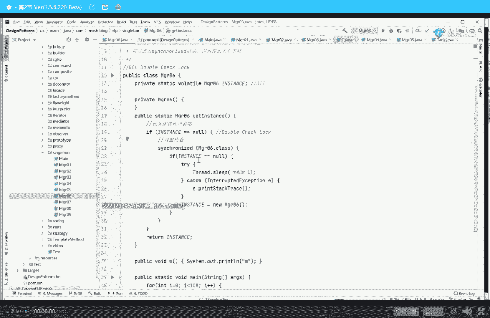
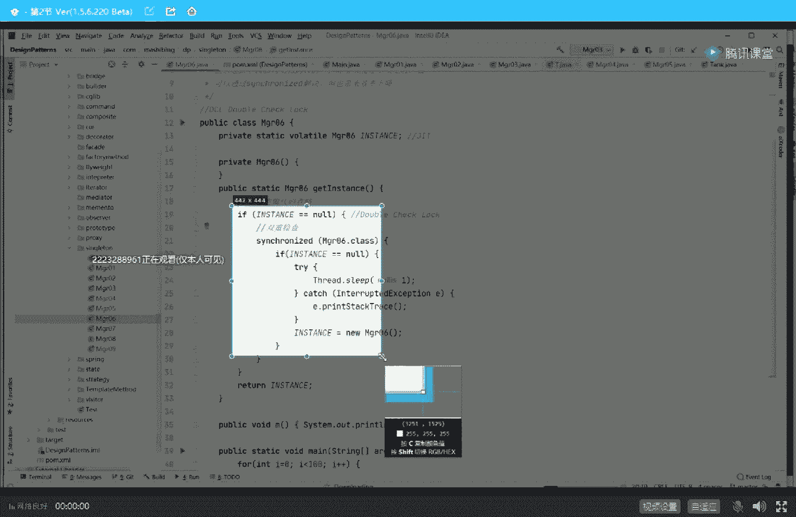
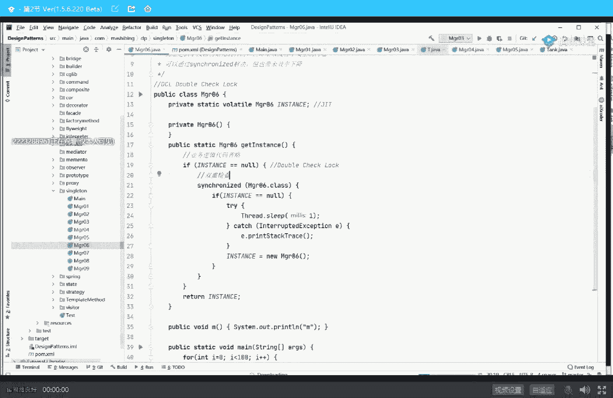

# 系列 2：P31：马士兵老师多线程：8.缓存行如何影响Java编程 - Java视频学堂 - BV1Hy4y1t7Bo

a第四个值是b然后不停的死循环，一直不停的起两个线程，这两个县城第一个县城干了一件事，叫a等于x等于b第二线程干了一件事叫b等于一，y等于a o给大家十秒钟消化一下这小程序，这小程序已经已经没了嗯。

那这个证明是一个反证法的证明，反证法好，根据我们刚才得出的结论，你们认真听我说，乱序啊，这两条指令之间或者两条语句之间很可能存在乱序，为什么，因为这哥俩前后没有依赖关系，你发现没有，它没有依赖关系。

那站在一颗cpu的角度，你随便乱序，你乱序来了没没有关系，最终的结果是一致的，o这个东西呢叫做as if serial，这个我一会我来给大家讲这个概念嘛，很可能好同学见到过这个词，但是不明白什么意思。

不着急，一点点来，总而言之，言而总之，这个小程序证明是这么来证明的，我们如果假设首先假设不存在反证法嘛，首先假设不存在乱序，不存在乱序，就会有一个后效果是什么呢，a等于一一定在x等于b前面。

x等于b绝对不可能跑前面去，b等于一一定在y等a前面，y等于a一定不可能跑前面去，同学们刚才讲的这小段还能跟上吗，能跟上的，给老师扣一，你继续，这个你能听懂就听，听不懂就算了，听不懂就记得结论。

乱序执行这件事存在知道这件事就行，那有同学可能就会说了，这这怎么证明啊，证明我们来分析一下这两个线程，无论你怎么排列组合两个线程吗，他们之间有可能互相之间你执行一会儿，我执行一会儿。

无论你这几条语句之间怎么排列组合，排列组合什么样的，第一种很有可能是这样，我a等于一执行完了，马上执行x等于b然后第二个线程开始执行，b等于一，y等于a好，这是一种可能性，这种可能性你计算一下x值。

即使是x值是几，y是几，你会发现x等于零，y等于一，这是一种情况，当然还有其他的可能性，就是那b等于一跑前面去，y等于a跑前面去，a等于一跑后面x等于b跑后面，这是第一个线程，这是第二个线程。

是第一个线程好最终的结果是x等于一，y等于零，当然也有可能是打断的，比方说a等于一，执行完了另外一个线程执行b等于一，然后呢x等b y等于a也有可能y等a跑到x等于b前面，总而言之言而总之。

无论你怎么执行，绝对不可能出现x等于零，y等于零的情况，你自己验算一下，我再说一遍，假如这几条语句不会发生重排序，你放心，x等于零，y等于零，绝对不可能出现，很有可能是x等于y等于x等于一，y等零。

或者是x等于一，y等于一，嗯李浩问了个初级灵魂的问题，李浩同学，你怎么那么敏锐呢，这是指令集乱序还是语句级别乱序，这是语句级别，这种语句级别的乱序不太容易出现，但是也有一定的概率。

语句级别语句不就是好几条指令吗，好几条指令之间也有可能乱序的，我向你证明指令级别的论述，我只能给你写汇编语言，大哥，你觉得我在这跟你聊汇编语言聊的通吗，虽然我的笔记里头写了汇编语言。

但是我要今天给大家聊汇编，咱们今天就别别讲课了，估计好多同学就更懵了，虽然我的笔记里啊跟大家聊了一些汇编，但是今天还是算了，这是汇编吗，因为它内核带中间的0x80 调用过程必须得用汇编来解。

所以只要你只语句级别存在乱序，你拿大腿给我想想它指令级别存不存在乱序，对啊好了不说了，当然刚根据我们刚才分析的结果，只要我这个程序有一个x等于零，y等于零的情况出现，那么一定就会存在乱序，调一下试试。

这个靠运气，有可能跑好长时间也跑不出来，有可能跑个十几秒就出来了呃，原因是呢由于它指令级，由于它是语句级别的，得好几条指令同时乱序才能出现最终的结果，所以这个东西得靠运气了，我呢大概以前执行过的。

这是呃272万次，执行完了之后出现零零，这个呢11万次运气比较好，出现零零，我今天如果运气不好，就多等会儿运气好的话呢，也许很快就能出现，太讨厌了，运气不是特别的好是吧好吧，不说了。

x的我为什么没有同学还在这儿啊，出来了一点啊，运气不错，来看这里啊，呃29万次的执行之后出现了结果零零，所以这就证明了乱序执行啊，我看有同学说x等于b y等a最先执行不就都等于零吗，你这不废话吗。

你x等于b y等a最先执行不就已经乱序了，大哥，好好想想啊，我们说假设不存在乱序，它才不会出现这种情况，出现这种情况就已经是乱序了，那你自己都已经证明了，你想啥呢，老天这是反证法，对啊。

呃不管你听听得懂没听懂，总而言之言而总之有一件事情存在，哪件事情存在呢，cpu的指令之间有可能后面你给他写的这条指令跑到前面去执行，ok得到这个结论的，给老师扣个一，我们继续注意。

我跟你讲那道题你还记得吗，叫d c l要不要加volt大哥，这里面好多东西呢啊，我只是给你讲了一个乱序，执行了，我给你点点来，好大家看这里，我给你讲完乱序执行之后呢，我还得给你讲一个概念啊，看这里呃。

我给你讲了乐趣之行之后呢，还得给你讲一个概念，这个概念呢就是第一题就是解释一下对象的创建过程，先说结论，对象创建的时候有一个半初始化状态，呃，这个是什么意思，嘿嘿嘿，看这里啊，一点点来来。

我们来看这句话，object o等于new object，这句话应该是最简单的一句话，围绕这句话，美团出过九道题，这九道题得答出一个来都不容易，我们先讲第一题，也就是我们要讲的那道大题。

需要的这个结论就是new object，这中间到底有哪些个执行步骤，好跑弹一条线，诶，怎么debug了，跑弹一下，先run，版本有点问题，rebuild一下，跑一下好，跑一下之后呢。

我们来观察一下它生成的它那个class文件生成的字节码，关于字节码这个概念应该不需要我解释，我觉得啊那个就是呃我们一个java文件编辑完了之后呢，生成的是什么呀，by code，这个叫字节码。

就是我们的点class文件，这个相当于java语言的汇编语言，java语言的汇编码，汇编码里边是什么，怎么执行的呢，它是有好几条指令来共同完成这条语句，这几条指令是什么呢。

看这里我们来观察一下view show by code with j class library这些小小的插件啊，我们用这个插件呢来观察一下这条语句生成的哪些指令，method，好了看这里。

这是这条语句生成的指令，这里第二对嗯，一共有五条指令构成，当然这个字体比较小，我担心你们看不清楚，所以呢我就给它挪到了我们的ppt上，看ppt就可以了，ok当我们写这么一个小小的程序的时候。

就这个小程序啊，class t里面有个成员变量m等八，然后当我们写这么一句话，t小t等于6t6 t的时候，真正执行的呢是五条指令，这五条指令呢分别是new指令，duplicate指令。

inbox special指令，a store指令和return指令，在这里面有两条指令不太重要，我暂时也不想跟你解释，return指令，先不管它，duplicate指令先不管它。

这里面new出一个对象来，至少需要三步，大家还能跟上吗，大家还能跟上吗，能跟上给老师扣一了，嗯跟他说是吧，嗯当我们new出一个对象来的时候啊，至少需要三步，这三步是什么呢，打开冰箱，把长颈鹿拿出来。

把大象放进去，关上冰箱，开个玩笑啊，开个玩笑好看，这里啊，第一条指令呢叫new，第二条指令呢叫invox special，第三条指令叫a store，我解释一下这三条指令的意思。

六的意思是申请一块内存空间，用来装我new出来的这个对象，还有这个空间已经申请好了，大家都知道new出来这个对象里头一定有一个成员变量，这个成员变量是小m，那这个m的值是几呢，听我说。

当你刚刚new出一个对象来的时候，这个m的值是它的默认值，default的值默认值是几呢，数值类型的都是零，double类型，flow类型，零点，引用类型都是空值。

ok所以最开始的时候这个m的值是一个零，那什么时候它才会变成八呢，我不要求它等于八吗，什么时候变成八呢，调用完下面这个方法，这个方法叫invoke，invoke，调用的意思。

special特殊调用调用了一个方法，这个方法比较特殊，哪个方法呢叫initialize，什么方法构造方法调用了它的一个默认构造方法，这个方法执行完这个m的值才会从零变成八。

所以当我们列出一个对象来的时候，它里面的成员变量是由一个从零变八的过程，有一个从默认值变成初始值的过程，好这个状态叫做半初始化状态，最后一句话叫a store，a store的意思是建立关联。

谁和谁建立关联，我们有一个局部变量小t，这个小t里面储存着一个指针，这个指针指向这个对象，好在只有在执行完这句话的时候，一个小t和我们真正地出来对象建立关联，通过小t才可以去访问它，呃。

为了让大家看得清楚，我作为小小的动画，大家认真看，当我们new出一个对象来的时候，首先new执行到new这条指令的时候，内存里头是一个默认值的情况，m值等于零，当执行到invox special的时候。

它才会变成八，当执行到a store的时候，它才会变成建立关联这个过程，所以你看上去简简单单的一句话，在汇编界呢，实际上它有三条语句构成，它有三个步骤构成，好听明白这个过程，同学来给老师扣一，我们继续。

有同学说第二行第五行大哥，我建议你呢先踏踏实实地听完主干，这些细节是我的课程，专门讲每一个指令专门讲的都给你讲完就没边了好吧，加载链接初始化，加载链接初始化是静态的过程，class的加载链接初始化。

这是new的对这个开始执行之后的对象的过程，跟那个差不多，话不多说，因为有每个同学的基础不一样，我们还照顾一下基础稍弱的好继续，呃在刚才我讲课的过程之中，我第一步给大家讲了，有乱序执行这件事存在。

有乱序存在，第二步给大家讲了，当你有一个对象的时候，它有三步构成，还记得那道问题吗，那道问题是d c l单利要不要加volatile，大哥，这里面有没有谁需要我解释一下什么叫单利的，有吗，有的话。

老师扣个一扣二吧，真有啊，呵呵呵好，我解释单例和dc l单例，你放心，我30秒给你解释完啊，你要听不懂，那就是你的你的问题了，我就不管了，关于单例呢，它是一种设计模式，这是另外一个可以把代码调出来。

23种设计模式，代码呢我都带大家写过，但是单例呢写的比较多，一共有九种写单例模式的方法，单例先说是个什么概念，单例的概念是这么一个东西，我有一个class，我只允许你溜出来一个这个class的对象。

不允许你用第二个在内存之中永远只有一个这个class对象，不会有第二个，这是啥意思，大家看这里，我有一个class叫major 01，如果我想实现这个单例的话，我这么来这么来写就行了。

ok我上来二话不说，先定义一个对象，这个对象叫instance，然后把它给弄出来，用完了之后，我不允许别人虐我，这对象我把他的构造方法设成private的，那别人就虐不了了，所以谁想用我的对象的话。

通过我提供的一个方法叫get instance，你只要调我这方法，我返回的永远是这一个对象，所以无论你调多少次这个方法，最终你拿到的对象只有一个only one，这个就叫做单例模式。

这也是单例模式的最简单的玩法，关于这块能跟上的李老师扣一，关于单例呢，我需要给你快速的过一遍啊，反射可以对你说的很对，你说的一点都对，看这里啊，作为这种写法来说，我上来二话不说，先定一个对象。

那么有人呢就会吹毛求疵，有人就会吹毛求皮是吧，嗯好谁呢，就是我们处女座的人，比如说乔布斯啊，比如说还有谁啊，不知道啊，哈哈哈哈，开玩笑啊，比如我们处女座的人，他会追求每一个细节的完美。

所以当我还没有用到这个对象的时候，你干嘛要都one 6出来，你这不是浪费内存空间吗，所以好听我讲，因此呢就诞生了第二种写法，第二种写法是什么呢，你能不能做到当我需要这个对象的时候，再给我扭出来。

我不需要他说你不要给我new，所以第二种写法就是我首先定义一个对象，但是我不给他初始化，什么时候初始化呢，有谁调我这方法的时候，get instance，要用我这方法的时候，我判断一下哥们儿。

你是不是为空啊，你为空就是没有人把你初始化，ok这时候我把你给初始化掉，最后返回给你好了，这个呢就嗯满足了处女座人的肮脏龌龊，不能这么说啊，满足了处女作人的想法要求，但是这种有问题，车有问题在什么地方。

这个程序线程不安全，为了向大家证明这一点，我能在中间睡了一秒钟，表示执行了一些业务逻辑，那么在这个情况下，如果你多线程去调用这个get instance方法的时候，他一定会出问题，淘一下。

写入计时出错而不，diary is not specified，我考代码的时候的问题，一边啊，嗯等一下，上一个版本的那个里面拷过来的，等一台机器，我先不管它那个这小程序呢，呃大家都不用给你运行。

结果你应该能想的出来是使会出什么问题，你可以想象一下啊，当第一个建成来到这里访问这个对象的时候，发现为空吗，为空好，第一个线程暂停，第二线程也来了，为空吗，为空，那第二线程来了之后呢，继续往下执行。

new了个对象，用完了之后，第一个线程继续往前执行，注意第一个线程已经判断完了，那直接又new一个对象，所以这哥俩new出来的不是同一个对象，因此这就不是单例模式了，好吧，演示也能演示啊，我给你拷过来。

重建一个项目就可以了，但是我懒了，偷个懒可以吗，代码太简单，好那怎么解决这个问题啊，太简单了是吧，解解决这问题还不简单，加锁嘛。

上锁public static synchronized的get instance，你放心，上了锁之后，昨天我讲过锁的概念，上了锁之后是什么意思，我只有持有这把锁，我才能去new这个对象。

只有等我遛完了，另外一个线程才能进来，我持有这把锁，我在里边噗噗噗便便，我便便完了，另外一个线程才能进来，另外一个线程拿到这把锁之后，由于我第一个线程执行完了，我已经把它给弄出来了，你放心。

第二个线程来判断它已经不为空了，那啥也别说，肯定拿都是同一个，所以这个上锁肯定没问题啊，这块还能跟上吗，能跟上的，给老师扣一来，但是处女座的人又来了，处女座的人说大哥，如果你这里面有些业务逻辑。

比如说你这里面写了好多好多代码，我们假设嘛写了写了好多好多好多行的代码啊，long two啊，lin three等等，来four等等，写了好多好多代码，这是你的业务逻辑，这些业务逻辑本身啊。

其实用不着上锁，用不着说我持有锁的时候才会执行这些业务逻辑，没有必要，但是你如果这样的话，你锁定的代码块就太大了，这叫做锁的粒度太粗，叫做锁太粗了，锁力度粗，所力度粗就会怎么样，效率就会变低。

持有锁的时候，你要干很多事情才能轮到另外一个线程，所以锁力度粗就会变低，就是把锁细化o看这里所细化，简单了，就这么来做嘛，业务代码有一些业务代码，然后没问题，我不给他上锁，什么时候上锁，能判断哥们儿。

你是不是等空啊，如果等空上锁，synchronize major，零五点class，上完所把你给new出来，new完了之后返回回去，好问大家一个问题，这个写法能不能保证现成的一致性，线程安全能保证吗。

依然不能，我看有人说能我们分析一下，为什么他不能，原因是啥呢，原因是你判断一下啊，第一个线程执行到这里，判断instance等空没问题，第一个线程暂停，第二个线程执行到这里判断。

注意instance依然能空，第一个线程还把它丢出来了，然后第二个线程继续执行，第二线程到这里的时候，申请这把锁没问题，只有他一个线程拿到这把锁，开始执行，把manager 05 new出来。

new一个对象扔在这没问题，然后第二个线程释放锁退出好，执行到这里的时候，第一个线程开始执行了，开始继续执行了，第一个线程开始继续执行的时候，开始又申请这把锁，我想问你这把锁他能申请下来吗，没问题。

为什么，因为第二个线程已经释放了呀，你想想我已经把锁打开了，你第一个线程想锁上，当然可以锁上了，没问题啊，我已经用完了，我已经变变变已经变完了，该你了，既然该我了，那我就继续往里走，走到这里的时候。

是不是又new了第二个，所以即便是你在这里上把锁没用，所以就诞生了dc l的写法，下面我来讲dc l这个写法是这样子的，我呢呃一个线程来了，首先判断instance是不是等空，如果等空上锁。

我上完锁之后，我再判断一遍，你是不是依然为空，刚才咱们那个过程不就是说在我上锁的过程之中，有另外一个线程已经把它给初始化了吗，我上完锁之后，我再判断一下，哥们儿，你是不是依然为空，如果你依然为空。

说明没有人改过你，ok那就完全没问题了，好这个东西叫dc l，全称叫double check lock，check一下，check两下，中间夹着一把锁，double check，中间加了个lock。

叫double check lock，但是他的问题还不是止于这里，它的问题是说哥们，你这个double check lock要这种写法的时候，你这里要不要加volatile，这是他的问题，当然我讲到这。

大家应该明白什么叫double check lock，什么叫d c l了，我相信大家呢有一堆的问题，我一点点解解释给大家听，好最基本的概念明确了的，给老师扣一，ok大家看这里。

我相信大家呢有这样一些个小问题啊，第一个问题就是说老师你干嘛要写这个if等于空啊，你直接上来直接直接拿过来上锁不就完了吗，你外面这个衣服有啥用啊，有狗屁用吗，同学们仔细分析一下。

如果去掉外面那个if会发生什么情况呢，假如有1万个线程都来抢这把锁，反正他二话不说，上来就synchronize，那么是不是上来就锁竞争啊，最终是不是只有一个线程才会把这个弄出来。

也就是说剩下9999个竞争过程必须得上来，不管你是不是你弄出来的，你得去参与锁定证，那这样效率就太低了，如果前面加一条if语句，会发生什么情况呢，只要有其中1万个里头，只要有一个new完了。

另外的人过来判断一下，我就不用参与锁竞争了，效率就提高了，这种写法啊，在很多很多的开源软件里头都用到了，我希望大家掌握住，没问题吧，嗯这第一个问题就解决了，好我们来聊第二个问题，还有还有其他问题吗。

提高性能，对没错，就是提高性能的，好我们继续，来我们继续，第二个问题是他要不要加volt，我先把这代码啊给大家，来给它切下来。

切最简单的最干练的就行了啊。

放在这儿，然后呢。

我们来看这个p p t，好，呃我们先说结论，先说结论，这个必须要加volatile，原因是什么，回想我前面讲过的内容，我讲过程序是可以乱序执行的，第二个new一个对象的时候是存在半初始化状态的。

那好下面我们来分析为什么double check log必须要加volatile，好对照代码说来看这里，假如有第一个线程过来了，判断instance等空上锁，判断它依然为空，然后就开始new对象了。

注意new对象有三步，大家还有印象吗，new对象的话是这样来做的，第一个线程来了，判断为空，开始new这个对象中间有三步构成，第一步是申请一个内存，把这个值变成零，默认值。

好我们假设它扭到一半的时候发生了指令重排序，认真看后面这条两条指令发生了重排序，再看一遍第一条第一个线程来判断等空没问题，上锁可以开始new对象也没问题，new到一半的时候发生指令重排序。

大家还记得这两条指令什么意思吗，这两条指令指令的意思是，这条指令叫建立关联，这条指令叫构造方法执行，那么他会先建立了关联，也就是说这个小t已经指向了这个初始化了一半的对象，ok正好在这个时候。

第二个线程来了，来你猜猜看第二个线程，第二个线程来会执行哪句话呀，是不是会执行if instance是不是等空这句话呀，好我就想问你这个时候这个t也就是那个instance等空吗，等不等空不等空。

不既然你不等空，我还给你上锁去拿吗，我不需要上锁了，我就直接拿过来用了，对不对啊，那么你猜猜看第二个线程用到的是一个什么状态的对象呢，他就使用了一个半初始化状态对象，半成品，你做到一半的时候。

他拿去用了这里的值，记录着双11我们成立了多少个订单，本来是100万了，不好意思。