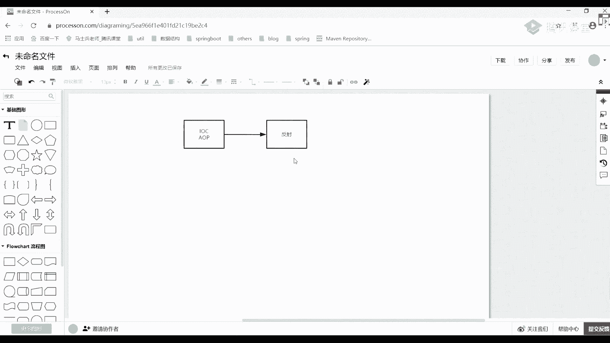
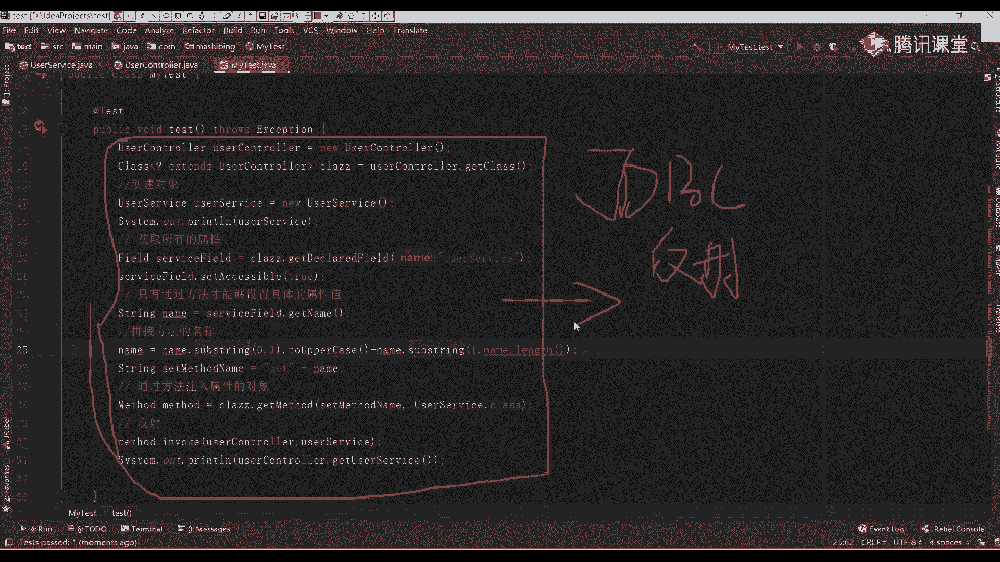
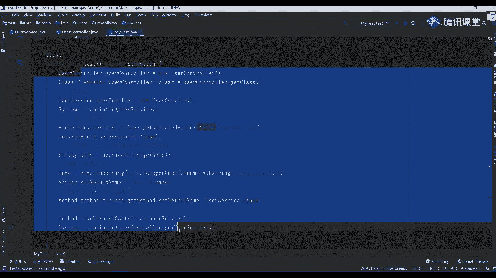
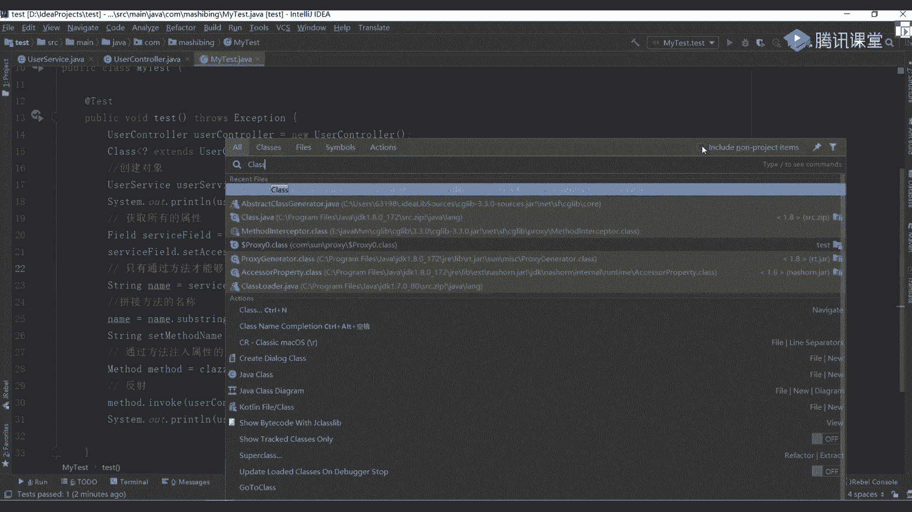
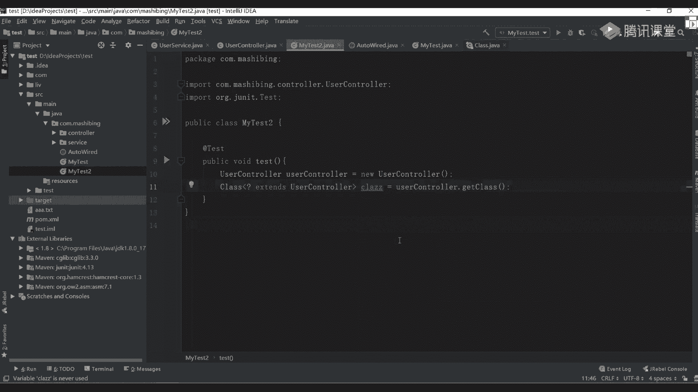
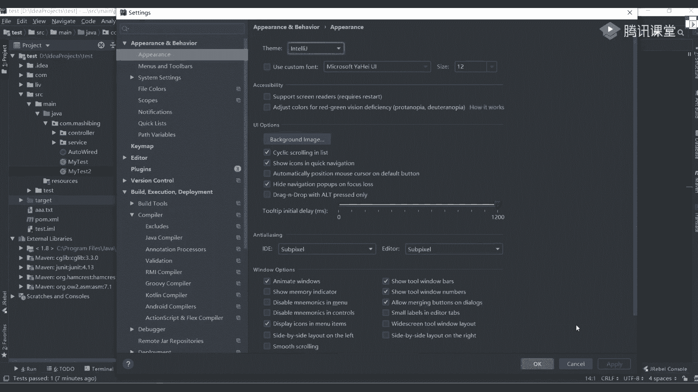
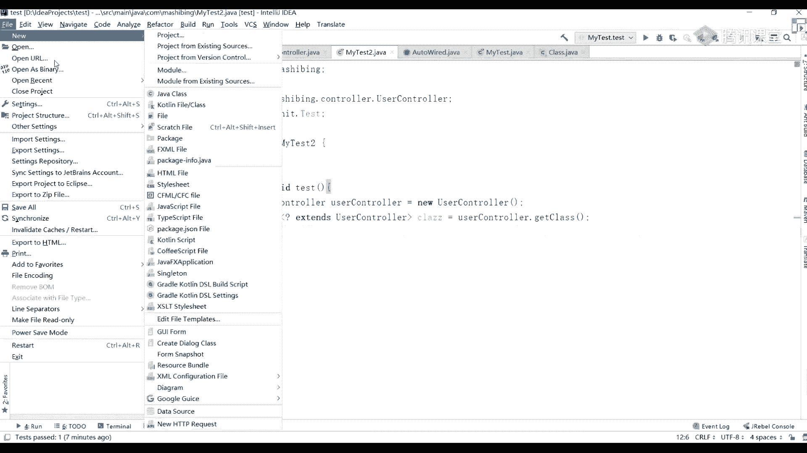
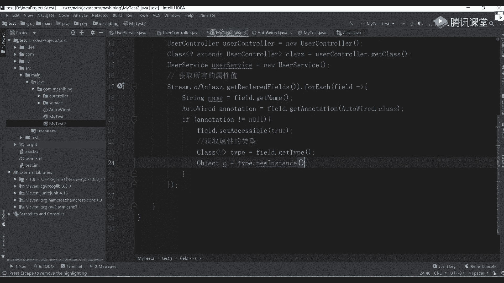

# 白嫖到马士兵教育价值23980的MCA架构师课程一次让你学够！ - P33：SPRING源码：01Spring从入门到放弃 - Java视频学堂 - BV1Hy4y1t7Bo

重点侧重在哪，i o c这块，我先问一个点，先问一个点，ioc ioc它底层的实现机制是什么，有人知道吗，ioc里的时间就是dna反射，对你应该答的是反射的东西，你们对反射应该是非常非常熟练了吧。

啊非常非常熟练了吗，反射是什么东西啊。

比如说我来写代码，大家来看一下到底是什么样的一个效果好吧，这就是随便一个项目，我之前做测试的一个test项目，这里面没啥啊，啥都没有啊，啥都没有，非常简单，先做这样一件事，在里面，你们在公司里怎么做的。

是不是先创建一个最基本的package，叫什么control，是不是创建这样一个包，然后在这个包下面我再创建一个包，page叫service，然后呢我在ctrl是不是要调用我们service里面的东西。

不然都删掉还是干掉，不用它这个control只有service，然后在里面假如说我写这样的东西叫什么呢，叫user series，然后呃不对，给我下边这写一个叫user control，control。

大家都这么干的吧，然后呢你需要在这个user control里面做这样一件事，什么事呢，private，然后写一个user service，再写一个er service，这个代码看了没问题了。

看没问题吧，这块儿我还是那句话，你要具备一定的spring的基础，这块才能听得懂，你每次在调的时候，我是不是直接调用我们service里面的方法去处理具体的逻辑就完事了对吧，那这里面就会涉及到一个问题。

什么问题呢，这我只是声明了一个引用，对不对，它并没有实际的一个对象，这些对象如果如果我现在要想把对象付给他怎么办，你们之前做的都是这样干的，随便写一个注解叫at auto w。

q w a r e d是这么干的，但我这个地方是一个普通的最最最普通的一个项目，里面没有引入spring任何东西，如果让你自己来实现一个这个东西能不能实现，能实现吧，能实现吗，别扭好吧。

new就没意思了，如果让你自己来实现，能不能实现，或者说或者说我不用我们oo的，我就用最基本的一个反射机制，我能不能做这样一件事，所以可能会说老师这东西到底怎么做，我不会写代码。

其实spring里面的代码非常非常简单，没大家想的那么难，只不过大家看起来比较麻烦的原因在哪，在于里面的类太多了，接口也非常非常之多，你在一层一层找的时候，看一会儿你就看懵了，所以你如何把死的源码看好。

掌握其中最核心的点好吧，记住我叫最核心的，那我现在我做这样一件事，什么事呢，这样我已经有一个service需要在control里面好吧，付付给我们的就是service这个对象，如果让你来让你来自己设置。

或者通过反射来进行这样的一个实现，能实现同学来扣个一，不能实现同学来扣个二，能实现吗，很多同学敲二啊，就如你要想把词汇原本看懂，你反思你必须要会，你跟老师，我一点反应都不会，那不好意思。

这课可能不太适合你，明白意思吧好吧，我们来写一下，看这块儿我应该怎么做，其实非常简单好吧，我创建一个my test，这可以吧，在里面我随便写一个方法。

public void test这样一个方法上面加一个at test，没问题吧，我们一会儿方便我们做测试，那这时候你要想做怎么做呀，很简单吧好吧，第一步，user control。

先创建一个user control的一个对象，这没问题吧，然后你要想拿到它整体这个映射的对象的话，是不是有三种方式，第一种class for name，就是我们之前在学gd b c的时候。

你们就用过的东西很简单，这是第一点，第二点是不是通过类名点class获取到，第三种是通过对象点get class，是不是三种方式，我这儿用的是第三种方式，所以这时候可以怎么写，可以这样写。

user control。get class，这个没问题吧，应该能看懂吧，创建了一个大写c的一个class对象，有了当前这个class对象之后，我能够非常非常方便地去访问里边的属性方法，哪怕你是私有的。

我是不是也能够进行最基本的一个访问，这块能听懂同学来给我扣个一，能听懂吧，比较简单比较简单好吧，下面我们来写一下试试吧，你注意了，你要想给我们这个controller里面的service负对象。

首先第一步我是要先创建一个对象，什么对象啊，reuser service，user service等于new一个user service，这问题吧，这是第一步，很简单的好吧，有了第一步之后。

第二步在干嘛，你要把它给复制进去吧，而本身在我们当前这个control里面，它只是一个属性，是不是一个属性，既然是属性的话，来告诉我怎么做，你是不是可以通过反射或者说获取所有的属性，属性吗。

怎么获取来着，叫class这样写吧，把这个改一下名字啊，c l a z这样写舒服一点，这样写一个class。get什么东西，是有东西叫get fs这块获取到是一个什么fs的一个集合，这没问题吧。

同时你可以获取到具体的某一个具体属性，是把这属性名字传过来，这两个方法都没问题，能拿过来，但还有一个什么呢，叫declare是啥意思来着，是不是可以获取到我们对应的一个访问权限的一些设置的东西。

所以一般我们在用都用什么叫get declare fad，然后传入一个属性的名称，这名字叫什么，是不叫user，这问题吧，我把这个拿过来啊，user叫service，四个字，非要这有异常抛出去。

小张这个时候能看懂，这很简单吧，获取到我们对应所有的一个属性值，拿到当前属性之后没完，你还要干嘛，他干什么事，我是不是最终目的是为了给这个属性要赋值了，那赋值的时候你看到了我这写的是什么私有的吧。

既然是私有，意味着不对外提供公有地方不公允的公公有的一个吸管权限，所以这时候你需要通过什么，是不是通过一个set方法，是不是来设置我们的属性值，要通过一个get方法来获取我们对应属性值。

是不是这样的东西，所以这一块我们可以直接来进行运行，get把都写好，写好没问题吧，好写好之后，我这改一下create，这可以吗，你是不是也可以把它当成private，那这个时候我这儿如果测的话。

如果测的话，我能拿到当前属性值吗，听懂我意思吗，听懂我意思啊，如果我能拿的话，能拿到吗，这时候能能拿到，不能吧，我改成什么东西了，是不是叫private，这种情况下应该是什么，应该是public的。

所以这个访问修饰符这一块一定要给他搞清楚了，千万别随便瞎写，别随便瞎写，如果你是私有的话，想拿也可以怎么办，c水怎么办，可以这么干，是不是有对应的一个这样的一个属性值，什么属性值，然后还记得吗。

叫user service fad，点set accessible，把这个值改成true，是表示说我也可以访问我们对应的一个私有属性，这样的一个值，这没问题吧，这东西啊你们应该提前学反射，都接触过了。

都接触过了，这样接触完了之后，下一步再干干嘛，在干什么事，还是那句话，属性你是没办法直接操作的，所以只有通过通过方法的名称的方法才能够设置具体的属性值，是必须要通过方法，那方法的话，我这应该怎么办。

很简单啊，我们那个set和get方法，它都是有具体的一个自己特点的啊，自己特点的，那自己特点的话可以怎么写，是不是第一步叫service failed，第二get live嘛。

是不是先把这个名字给拿过来，这没问题吧，拿这个名字拿到这个名字之后，第二波我可以干嘛呢，是不是拼接什么方法的名称，要不然是get，要不然是set，只有这两种对应的一个方式，所以这时候你可以做这样操作。

name等于什么呢，name。sub stream，是不是截取下我们字符串，因为首字母必须要进行要大写加粗，apple case，这没问题吧，然后再拼上一个什么呢，叫name，点substring。

拼上什么一逗号，name，点length，把剩下的东西给拼起来，那此时我拿到的东西说白了就是一个什么，是不是原来叫user user service。

现在呢呃现在叫什么叫大写的u然后呢the e u s e r service，是不是这样的方式就转了一个大写转大写转大写之后，第二步是不是该拼接了，怎么拼接，写一个string叫set method。

name等于set，然后呢加上我们刚刚写好这个名字，这个时候我是不是拿到我们的方法名字了，是不是拿方法名字了，拿到方法名字之后，下一步在干嘛，叫通过方法，然后呢注入属性的对象，这怎么写来着。

是不是叫class c l a ss呃zz，第二干啥玩意儿，是不是叫method，是不是要获取一个方法了，方法名字就叫set method name，第二个是要传我们对应的一个类型。

而写一个uer service，这样class整理好我们这里一个诶，大写啊，your service指定好这样一个类型，当我把这类型拿到之后，这是不是意味着我们获取了一个master的方法了。

有了这个master的方法了，那很简单了，干嘛是不是反射就行了，是不是反射型怎么做，method。invoke，然后呢把我们对象传进去叫user control。

然后逗号把user service service给传进去对吧，这块都传完成之后，我可以做一件事了，什么是s o t叫user control。get有的service，这个时候如果我能拿到具体的对象。

具对象，那意味着什么，是不是能取到具体值了，太基础了是吧，你们都觉得这东西几个基础是吧，一会儿咱们往下写好吧，就这些基础东西有多少同学看不懂，如果你觉得这东西比较基础呃，去看别的课。

不勉强不勉强明白我意思吧好吧，如果你觉得你这些东西可以忍受，接着听，好好听，ok好了，刚刚这段就是一个反射的原理，那现在我通过是什么。

是不是user controller这个对象来获取er service，你肯定也看到了，control里面有对象吗，没有吧，我是不是通过一系列的反射操作来达到对象了。

这个时候这个时候如果我能打印到具体对象，那意味着什么意思啊，是不是意味着已经成功了，好吧，来看看看看具体操作好吧，看看具操作，不要嘴里的东西，基础好吧，spring里面就这么干了。

看这是不是有一个service，这是不是拿着对象了，你甚至可以把当前这里面这对象，you are service，来，我们试一下，打俩对象，看两个对象到底是不是具体的同一个对象是吗是吧，那意味着啥。

我通过这样一堆一系列的代码就完成了我们整个对象属性的一个反射，猪进去了，和同学老师这东西比较基础，我们在学那个gdb c，一般讲到g d b c的时候，都会给大家讲反射好，都给他讲反射，讲反射的时候。

按道理说你们应该是具备这样的一个能力的，能把这段代码给写出来啊，应该能把这个代码给大家写出来啊，但是我需要强调是什么，那老师太基础了，我能写出来，但是你看到源码之后。

你能不能看懂啊，当然原版里面可能不是这么做的，因为现在你们其实很少写这种原生的这种呃反射的方式的。

更多还是用什么，是用我们对应的啥玩意儿，啥玩意儿是不是又注解了对吧，但是你要先把这块东西能理解到这块东西理解了之后，我们再用注解来实现一下，你们当时用那个at out to wr的注解。

是不是拿spring框架里面直接自己用的，我能不能自己写一个at ow，理论上来说一定是没问题的，一定没问题的，我们一会儿来带你实现好吧，来这段代码能看明白，同学主要是扣个一能看懂吗。

如果看不懂也没关系，下去之后把你反射的基本技能给补充一下，好把反射给补充一下，你只要学完反射了，知道这些方法是干嘛的了，你知道怎么回事，听到意思吧。

那这东西我不能可不可能说我再把反射里面具体信息再给大家，大家详细讲一下，这是啥意思啊，你可以看一下这是啥东西啊，有一个class的一个类。

找一下吧，这是jdk里面原生提供我们的一个class class一个对象，通过这个对象我可以做很多的事情，包括生成具体的一个实验对象，好生成具体的实际对象里面有一堆的一个解释，在当前这个类里面好。

那当然这个类里面可有什么东西啊，可以看下这个方法，看一下这个方法好吧，找get的方法有get annotation，是不是获取注解，有get class loader类加载器，有get什么。

是不是还有一些constructor获取到构造器，还有get failed，get method，也就是说当我现在如果有了一个大写的class对象之后，我可以对当前这个对象里面的所有属性方法构造器好吧。

任何东西都可以做随意的一个编写，随的一个编写，你想怎么改就怎么改，想怎么玩就怎么玩，听懂我意思吧对吧，这点就注意了，那说没明白为啥不直接调用set user service，我们这儿看这儿啊。

我们这儿在进行最基本调用的时候，你想一下你用反射是干嘛的，用反射干嘛的，你这块在写的时候，我是直接写死的，但你想一下spring里面的东西，我能直接把每一个类给你写死吗，能写死吗，不能吧。

它更多应该干嘛，这些类都是不知道的，都不知道的，我应该生成的是一个提供是什么，类似于一个模板的东西，你按照我的模板往里面套好吧，不管你传入什么类，我都能够完成最基本的一个功能，最基本的功能啊。

所以是以这样的方式来进行完成的，明白我意思吧，这大家一定要注意了，好了，来这个点能过了吗，能过同学这样的扣波六能过吗，好了，正常过之后，我们再来写写什么，刚才老师，我在公司里面不用这种方式，我用什么。

我用这样一个方法叫at auto wear，是不是这样注解，我现在里面没有这个注解好吧，因为我从来没写过这样东西，我这个一代里面也没有任何跟spring相关的一些框架的东西啊，就是最普通的一个账号项目。

那现在如果你想使用awm的，告诉我我怎么做，能做吗，肯定可以吗，你们现在用的注解是框架提供给你的，那我完全可以自己实现一个注解吧对吧，对于class叫out over，这是不是可以。

然后在前面这儿改一下，改什么东西，at interface是变成注解了，但是你在写注解的时候一定要注意了，它是不是有四个对应的属性值，是不是四个东西对应对应的属性，这四个对应的属性分别是啥。

我可以怎么写，第一个你必须要写的at里面写什么，写一下我当前这个注解它的一个运行的一个范围，是源码编译还是运行时，这有东西，reaction有个什么wrong time吧，把你属性给加上第二个属性。

还有什么东西叫target吧，比如说我当前这个属性可以作用在什么地方上，在这儿也一样的，element type，然后呢第二是failed，我是不是作用在我们的属性上面，我是不是这样的话。

我就把它定义好了，还有一个继承吧，还有一个dotomation俩东西啊，一般没用，把软工写好之后就可以了，还有什么东西at in ht对吧，还有一个at d o c o dog问题的也有四个注解。

这两个主角写不写无所谓啊，影响不大，所以我们这不写了，就写这样的东西，这都能看懂吗，好非常简单非常简单了，在写完之后，然后把这回来报好了，这里是不是已经自动到导入进来了，这导入进来之后。

你现在能直接注入了吗，肯定不行嘛，不要纠正我的发音，同学们，求求你们了，我求你们，求求你们这个翻译，我知道不标准，希望大家忍受一下，等马老师开英语课的时候，跟马老师好好学一下英语好学英语好吧。

往这看往这看，我这是不是有个out，where are，有它之后，我现在是没法直接往里面写的，那如果是spring源码的话，他会帮你做什么样的一个处理啊，来我们再创建另外一个类。

your class叫my test，2k里面写一个，还有一个botest，一样道理，at test问题吧，那这块我在写的时候，我应该怎么去写它呀，写的套路跟刚刚一模一样，user control。

然后u的ctrl等于另一个user ctrl，这没问题吧，由它之后，第二第二步干嘛，还要通过我们的ua controller。get class获取到当前class一个对象。

这改一下c l a z z太黑了。

太黑了，改一下。

现在看到了吗，现在看到了吧，来了就刺眼了，我的天呐，你们这太难搞了。

你们不管了，就黑的好吧，不适应同学没办法了好吧，看到了吗，看到了吗，ok啊，我把字放大一点，放大一点，ok呵呵，太太难搞了，太难搞了，来往这看，今天晚上看，今天晚上看，不浪费时间，不在这浪费时间。

这样获取到这个class对象之后，下一步干嘛了，一样的，我先创建好一个user service，这种啊，这个套路都是一模一样的，就是service等于另一个you a service。

是不是这样的对象有了当前对象之后，下一步开始变了，开始变什么东西一样的，你也要需要获取到我们的属性值，一样的，你要获得什么属性的一个注解值吧，是不是这些东西我都要能够给获取到。

那这个时候如果你想拿过来用的话，我应该怎么去进行最基本的一个使用啊，这玩意该怎么做，其实也比较简单，也比较简单好吧，怎么做呢，第一步你要把所有的属性都获取到这选项，获取所有的属性值怎么写。

是不是有这样一个方式，stream。off吧，应该用过class，点get啥玩意儿，是不是写一个declare files，把所有属性给拿过来，拿过来之后再写一个，第二for each。

应该有人见过这种写法，让表达式再写一个fid，ok你先可以这么写了，应该怎么写，这是第一步，我先获取一下我当前属性的一个名称，再写一个in fid点，get li，把属性值给拿过来，拿完水之后。

第二步原来你是拼接名称的方法，直接给它注入进去的，现在不再用我们对应的方法了，专业方法了，用什么，它下面是不是已经加了一个啥样l to wear的一个注解，对不对，那我能不能获取到我们这个注解。

是不是也可以叫fid，这get啥玩意，是不是叫annotation，对吧，里面写上你要获取的是什么样的一个注解，是不是叫out wor，点class，这时候可以拿到，拿完之后再声明一个变量名称吧。

叫antiquation，比如这个t键之后，我这可以注意判断了if什么东西，annotation，然后呢，不等于意味着你当前属性上面已经加了注解了，如果你不等于空，我把当前的属性值可以做一个设置。

设置什么点，set accessible，为了安全，我们还设置一个cessible，好访问我们对应的一些私有属性吗，这是第一步，第二步你要获取到什么，是不是可以获取一下我们当前这个属性的类型。

是在这儿get tap吧，点吧，再写一个获取属性的类型，有了当前的属性类型之后，我下一步可以再干嘛，可在干嘛，这是我的类型啊，有类型之后我有这样的方法叫什么，叫tap，点什么呢。

叫new instance，想一下这个属性的tap是啥，我们这儿定了your service，它是不是它类型，我有这个类型之后，我能不能通过你有instance的方法来获取到具体的一个这个对象。

是不是可以有是可以有来点有他们用完它之后。

这有个异常，让它捕获一下。