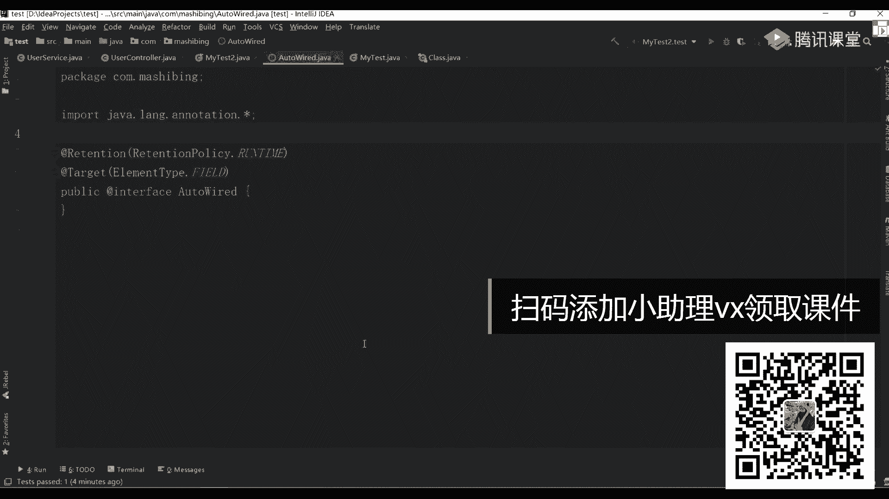
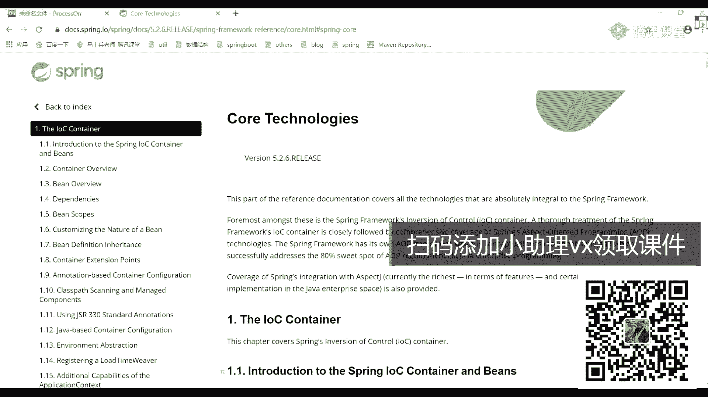
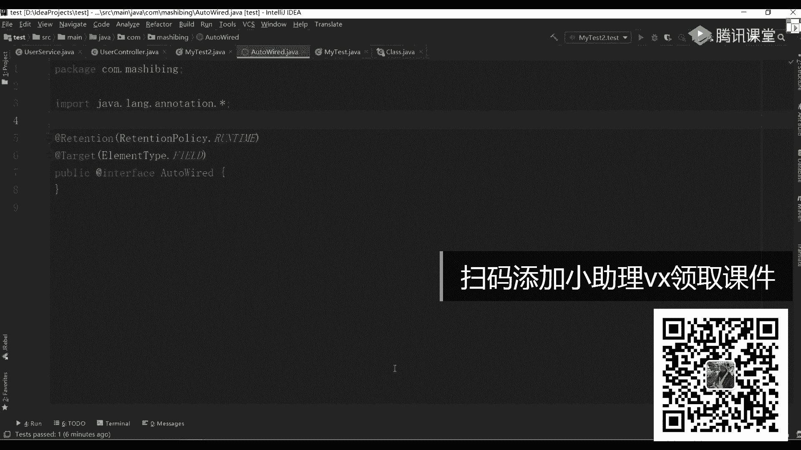
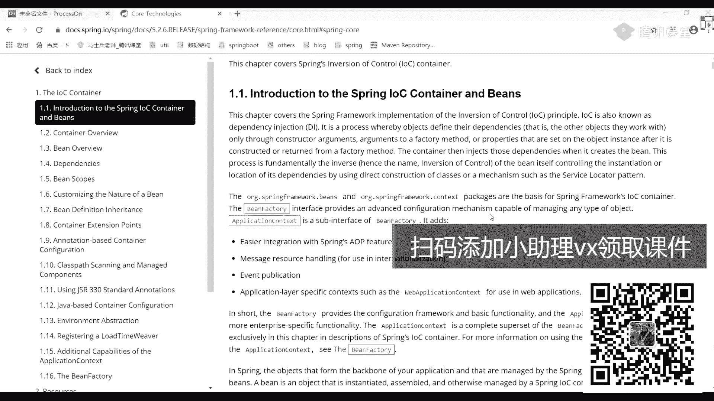
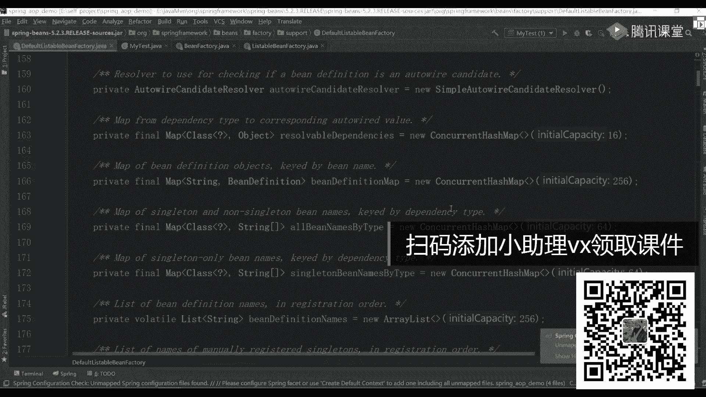
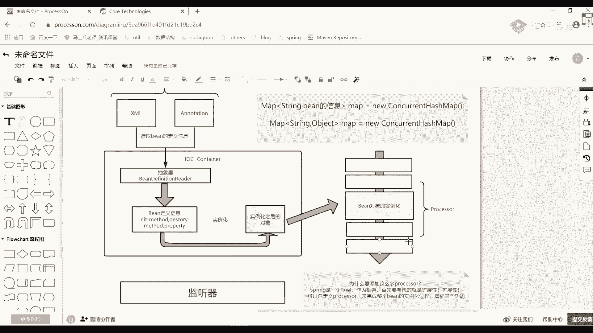
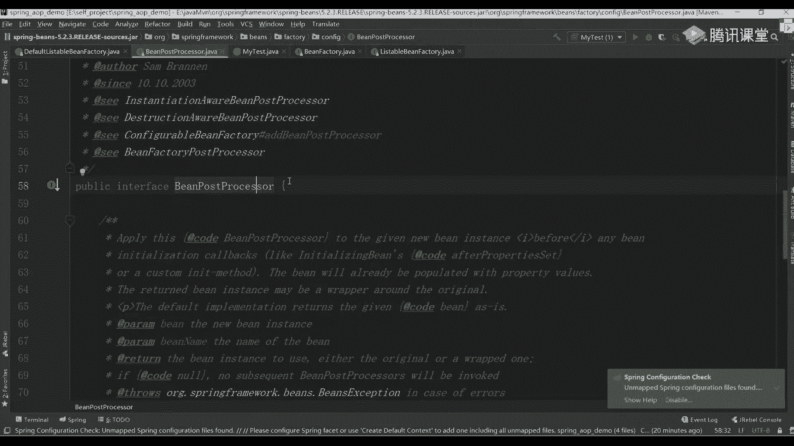
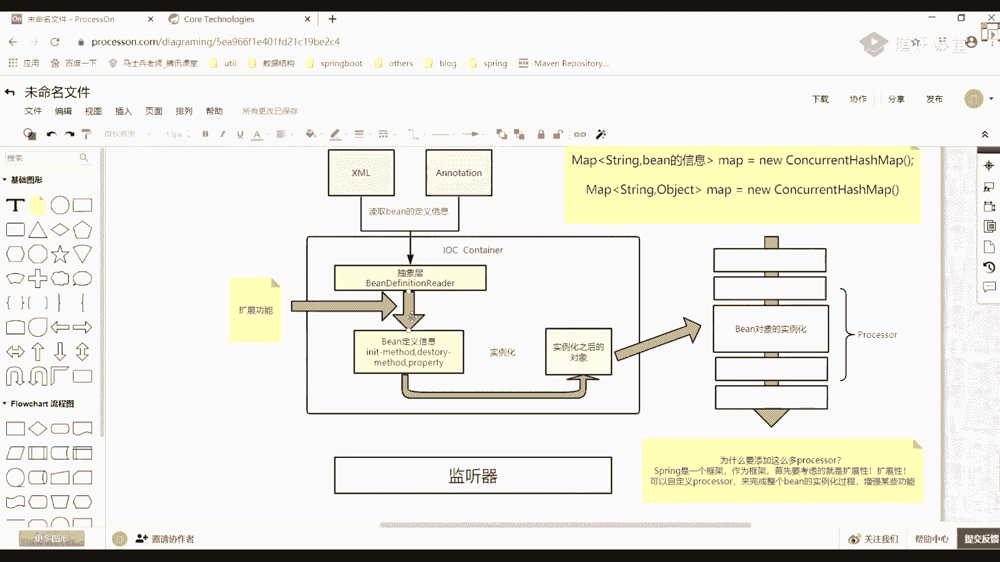

# 白嫖到马士兵教育价值23980的MCA架构师课程一次让你学够！ - P34：SPRING源码：02手把手带你阅读Spring源码 - Java视频学堂 - BV1Hy4y1t7Bo

只能捕获有异常之后，第二步叫什么叫fid。set，现在谁呀，把我们当前这个user control里面设置上，我们当前这个object就增加o这可以吧，可以吧，如果你把这个步骤也完成了，下一步该干嘛了。

我做这样的操作，这打一句话，s o t什么呢，builder control。get your service，看这块啊，看这块啊，我在写这块东西的时候。

还有拼接那个字符串叫set user service吗，还听这方法了吗，没拼吧，是不是没拼任何东西，这是不是只是用了一个instance，那这个时候这一段c位咱有用吗，这对象刚刚是不是又网卡了。

是不是你自己来定的，现在还需要你有一个对象吗，是不是也不需要了，这也不笑了，那我现在看一下我能不能把这个对象值给它分进去，看能不能打印出来，好吧，如果拿出来意味着没问题，如果打印不出来。

意味着就有问题了，好看一下这个对象有没有是不是立场值，这个对象是我们自己用的吗，是自己用的吗，不是吧，谁帮我们丢的，是不是这儿有一个东西啊，new instance，通过这个new instance。

我是不是得到对象，得到对象之后，我是不是可以放到我们当前这个属性里面去，是不是相当于完成这个功能了，明白我意思了吗，啊所以这时候大家已经发现了，我现在用普通的反射方式给大家实现了一本。

我又把注解的方式给大家实现一段，这两个东西你写起来你觉得难吗，what the word，没有啊，什么都没有，就变成空调的话，注解什么都没写，什么都没写，什么都没写好吧，这有一个one test。

把这个水平值给大家做一个拼接，做一个拼接好吧，你看一下是不是就完成我们最基本的功能了，是不是也能完成我们对应的一个自动入住功能，是这个时候我把这set干掉，我不要set了，来再试，能行吗行吗。

跟你的set有没有关系，没关系吧，是不是没关系，这种东西这种东西能不能看明白，能看出同学给老师扣个一，能不能看懂，我知道这块少了很多逻辑判断，少了很多完善的逻辑，没毛病。

咱现在不是要手写一个spring好吗，手写跟spring有什么意义啊，没意义好吧，别人已经写好东西，我只要能拿出来用，看懂原理就行了，你在看具体spring源码的时候，你看到底层的时候，他也是这么干的。

只不过人家创造了很多的一些属性值，加上很多非常完善的一个判断，那老师那就不用了，对确实不用了，我之前在这的时候是不是有用到我们当前这个这个name值吧，因为你要拼接，这时候还用吗，不用了吧。

stream mf啥意思，stro拉姆达表达式，lamba表达式，把它转成一个水母流，好这样spring流就是我这样，为什么要写这样两个程序来给大家带入我们的spring，原因非常非常简单非常简单。

你把这两个东西理解了，你就知道在我们整体的ioc这个容器里面，容器里面我到底是怎么完成我们功能的，你想一下你现在写代码的时候，要不然你写xml文件，要不然你写注注解好吧，要不然你用配置类。

但不管你用什么样的一个方式，是什么样的方式，最终那些对象都跟我们没关系了，这不是我们自己创建的吗，谁在创建的，是不是死人创建的，所以你一定要深刻理解反射它存在的一个意义好吧。

你要想把ioc底层东西搞明白了，就把这个反射搞明白就够了，你看他反射的时候别懵，当然我说了，这是一个最low的，而且有非常漏洞的一些程序，但是这块儿我希望你能够看明白，希望你能看明白。

因为只有这块你看明白了，你在看ioc那些对象创建的时候，好吧，就很舒服了，为什么，现在没关系了，我不是已经把set方法给注释起来了吗，是不是注起来了，你这样再往里面赋值的时候有用到set相关的东西吗。

没有了吧，对不对，但是但是如果你要用我们第一次写这个程序的话，它是需要set的方法的，你必须要往里边进行一个最基本的注入，所以这两个代码看起来非常简单，但是就是spring里面好吧。

进行反射的一个核心点，就是核心点，你把这些东西搞明白了，你就理解理解透了，明白意思吗，对老师，你这只写了一个out to word，你写的at value，at value是吧。

包括你写的那些at controller对吧，at service at component这一堆的注解，你能不能自己也做这样的实现，能够实现吗，是不是就可以啊，有同学我要手写一个spring。

没意义没意义，还是理解对应的一个本质，理解一个本质，你把本质点理解透了，这东西没大家想的那么难，很多同学为什么觉得难，就是因为你上来之后趴着稀里糊涂，从前面开始点一点点点点点点。

到最后诶我是从哪开始点进来的，一脸懵逼，往回找的时候找不找找不回去了，所以每一次从第一行代码开始往这边找，找到最后不行了，再从第一行开始找，再从第一行开始找，找完之后你就废了啊，不知道怎么回事。

不知道怎么回事，明白意思吧，所以先把这块看明白，之前老师说弄懂sm码要10年时间，10年天呐，你你你你用你用10年时间搞一个辅助源码，我的天啊，你你还学不学别的东西了，你还听不懂，你还学不学别的东西了。

别扯了好吧，别扯了好了，这块如果搞明白之后，如果搞明白之后，下面我们来说怎么看源码，怎么看源码，看源码贼简单，但是我不希望不希望你在看源码的时候，从头到尾慢慢去看这东西，为什么那样看，你看完之后就疯了。

还是一句话，你在看原版的时候，看原版的时候一定是你已经用了非常非常多spring对啪，对你们的组件你必须已经足够熟练了，这才行，你老师我一点那个spring都没用过，你让我搞搞源码，搞不了。

别搞没用好吧，那这时候怎么办呢，来给大家说一下学spring的时候。

第一件事千万别忘了去看spring的官网，这个官网真的是太宝贝了太宝贝了，是真的，里面有非常非常多的一些核心点，点开project，我们选的什么for work吧，对不对，等一下啊。

the word选择learning，选择随便也满不满无所谓啊，在词汇里面我们选call call里面介绍我们对应的一个i o c了，在o c里面你从上往下翻看到这块的时候。

就已经给过你很多的一个解释了，说什么东西有什么contest，对不对，还有个东西叫being sy，这是一个非常非常重要的一个接口，也是非常非常重要的一个对象，也非常重要的对象啊。

你在看的时候把这段东西好好看一下啊，如果你觉得还难受怎么办，也很简单，打开spring程序。

或者随便找一个spring程序啊，之前上课写代码，随便op代码，随便开一个，这样你来搜一个东西叫bb，是不是这个接口这个接口上面有非常非常多的一个解释，这个解释很重要，你可以先不看，没关系啊。

你可先不看没关系，但是我在等源码之前我会干嘛，先帮你进行整体脉络的一个梳理，刚刚通过反射，刚刚通过反射，我们也知道了，我能通过反射的方式来创建出来我们具体的一个对象对吧。

但是我们在学spring的时候，它好像没这么简单，也没这么low好吧，你想一下你当时用的时候，你是怎么用的，你怎么用的那种方式，非常简单吧好吧，第一个在老版本的时候，你刚上来可能要写一些插画文件对吧。

或者你写什么，现在的方式用一个and location，这样的一个方式对吧，不管你用什么样的一个方式，这两个里面大家想一下，你都定义了点啥，这样东西垫着点啥，这些东西其实也非常简单吧，订台分公式。

你想一下是不是就是定义了我们当前这个病对象里面，它存在的一些信息吧，再写一下往上写，点一进来再写一个并信息，比如说你的病的名字i d是啥对吧，里面有哪些包括力属性，引用了哪些引用，有有有哪些引用对吧。

包括你的初始化，初始化方法是什么，你的消费方法是什么，是不是有很多这样的东西，你都会配到这里，这里面这能看懂吗，然后配到这里面去之后，这以后下一步在干嘛，别忘了ioc，他说白了是个什么东西。

啥东西叫容器，对不对，我来看画的东西叫容器，什么叫容器啊，什么叫容器，容器怎么理解，非常非常好理解，所谓的容器好比你喝水的时候是不是用水杯，水杯是不是容器，那这块也是一样的，好，那问题来了。

我如果想要有用来装载我们当前这些并对象，这些病对象，我的病对象应该怎么进行存储，第一你要方便你进行一个查找吧，是方便进行查找啊，而且在spring里边还有一个非常非常重要的一个特点是啥来着，是啥。

记得吗，如果你没做任何判断的话，它默认情况下是单例的，对不对，你可以指定power type，power type，但更多的是不是还是single的，是不是单利的对吧，那这个时候我在存储的时候用什么存。

刚才说了，用concurrent hc代码，所以那时候我在进行定义的时候，我其实可以定义这样一个代码，放容器怎么定义，有啥东西，很简单很简单的东西来着，这写一个map，对不对。

里面写一个string对吧，那第二个我应该写什么东西啊，写啥别忘了这儿你在进行编写的时候，第二步骤里面有一个非常重要的东西，我不get了，一看就没看过源码，源码里面绝对不会直接放obs，放什么东西。

有这样一个东西，being definition，好，我不知道这是啥，没关系，单词先不重要，那叫什么叫b等信息，再写一个map，等于另一个c o r r e n t，开心了吧，可以这么写吧。

是不是这样的东西啊，变了一些定义信息，这是一个map了，我，好了，这个mac没问题吧，除了这个mac之外，你想一下，这只是放了一些定义信息，肯定写不太完整不太完整，那我再怎么办。

我是不是还应该放一个map结构，放map结构想一下放些什么，map上面有一个string，对你们刚刚说的是不是东西叫object，就是你具体的实体的类到底是啥，对不对，它就一个concer。

卡西lap是不是应该是有两个这样的一个map结构，有了这个map结构之后，有了这个map结构之后，我是不是就可以进行相关对象的一些直接存储了，但实际里面是这么存的吗，是这种存的吗。

我们可以做验证的领导老师这咋验证啊，没法验证啊，我又不知道哪些类，我还是那句话，你去看官网好不好，你去看官网好不好，你看看官网的时候，你知道了这样一个对象叫什么，叫been factory，叫病的工厂。

对不对，很明显，你们应该都知道工厂是干嘛的，生产对象对不对好吧，但是它是一个什么叫接口，接口是不能实例化的，那意味着啥东西，接口的底层实现里面一定有具体的实现类，你虽然不知道是啥，但一定有时间力。

对不对。

那这个时候打开spring的源码，别歪嘴吧，你往哪看，他说了，发展interface，such as叫lizable being factory，还有东西叫什么呢。

叫confetable being factory，是不是两个类对象干嘛了，我也不知道，不知道没关系，来点开它一类，这是不是告诉你说它也是一个接口了对吧，然后这个接口里面它一定也有什么。

是不是也应该有自己的一个时间内点开，有东西叫default，liable being factory，在这里面你往下拉来搜，我们对应一个mac结构，找办法好吧，看这是不是有一堆的那1234有卖吗，有吧。

那么干嘛了，我不知道resolved dependence啥意思，处理的依赖对不对，跟我没关系，叫bedefinition mac，想想我刚刚写的那个东西写啥来着，是不是写了一个string。

写了一个原并的一个定义，这是不是有是不是这个信息了，这有个or may be liams by tape，是不是根据类型有病名称的一个匹配，还有一个singleton bean name by太坊。

是不是按照类型进行这样的一个匹配，是不是就放了一堆map结构，我们每次取的时候，是不是就是说通过这些map我能够把具体的数据值给直接获取到。

如果我能够拿到的话，就意味着外面19有了，那这个map说白了它里面帮你做了一个封装，封装完成之后变成什么了，是不是就是我们这儿说的这个i o c容器啊，我放这边吧，哎呀就放这了。

这就是我们说的这个ioc容器，容器里面是啥，是不是就可以理解为我放了一堆map的东西啊，那里面可以用来放置我们具体的一些对象，这能不能听懂，能听懂，学来扣个一，这容器吧。

当然有的老师你这里面放map没毛病，我能听懂，我能听懂，放map，但是你这个map里面的这个对象哪来的呀，这是怎么过来的，怎么过来的，又很简单啊，怎么简单很简单啊，这有一个叉号。

有个annotation，这两个东西是干嘛的，都是用来放置我们这些病的一些相关信息的，我可以通过这样的方式把它给读取进来，或者说给加进来啊，那问题是问题是什么东西，我每次在进行加载的时候。

可以从叉l文件读，也可以从注解里面进行一个呃配置读，那我应该怎么做呀，所以在这块的时候，别忘了他是一个什么，是一个框架，好吧，有框架的时候，每一种具体的子类实现一定有自己实现的一个原理。

但是在上层的时候，你告诉我这人干嘛，大家干嘛，是不是应该有一个抽象层，等一下抽象层，上次看完了有这样一个东西叫什么呢，叫b。

definition d e f i n i t i n definition，然后呢叫rider，就这样的对象，我把这个加加加点颜色啊，好加上颜色，这个对象是干嘛的呢，这个对象的意义其实非常简单。

不管你外部的这些病信息到底是从哪读过来的，我不管我一点都不关心，但是你要想读取其他的一些配置的话，不好意思，你必须给我实现当前这样的一个接口，因为只有有了当前这个接口之后，我才能够进行具体类的一个识别。

啥意思啊，我才能够把这里面的属性值给读过来，可以是插盘文件是吧，也可以是对应的一些呃，注解配置什么方式，我不限制，我也不管，我也不，我也不关心，但是你要想实现，必须有这样的一个接口啊。

这接口你是必须要提供好了好吧，所以这块你可以写这样一句话，叫什么叫读取，搞定义信息，这没问题吧，是这没问题，但你把它读取过来之后在干嘛，这黑在干什么事，注意了，这只是一个接口，底层有具体的一个实现类。

有了实现类之后，那意味着他读过来之后啊，你注意啊，如果你是插画文件的方式的话，你注意了，这个叉号文件在我看来，在我看来它就是一堆的字符串，这能理解我想表达的意思吗，它就是一个字符串。

这个字符串在这放着一点意义都没有，所以我要把这些字符串转换成我能够识别的这些类了，是不是进行识别这一类，所以我要把这里面的一些相关信息我都给读取进来，把对进来读过来之后，把这儿会放成一堆对象。

这叫什么东西，是叫定定义信息，什么定义信息啊，比如说你定义了一个init method的一个方法，比如说定义一个distroy杠method这样的方法，比如说定义了一些property。

像这些属性是不是都是我们应该读取过来的，是读取过来的，我们把这些信息都给读取回来之后，那下一步该干嘛了，这是怎么读外的，是通过这样的方式从上面直接给迭代回来的，看这儿看这个箭头。

这个问题吧是从我这儿直接读过来的，你通过这个读取之后，这就完成了，当你这样完成之后，没完什么叫没完啊，你有了这些病的定义信息了，下一步该干嘛了，你告诉我下一步该干嘛了，有了这些病的定义信息。

那下一步我应该把这些病的定义信息是不是要转成具体的对象，也就是我们要完成一个具体的实例化的一个环节，对不对，实例化，实例化站在完成实例化的时候，其实这个过程也是比较简单的。

完成实例化很明显怎么实例化反射嘛，是不是通过反射可以进行一个实例化，可以用什么，class a new instance吧，是不是可以这样进行一个呃实例化。

实例化完成之后就能获取到我们具体的一个对象值了，那时候我拿个箭头，快下，转一圈好了，好了不能马上坐下，这我能看明白，那其实这个过程里面它所涵盖的一个意义就是什么，就是我们整体的一个实例化。

这如果是实例化的一个过程的话，那这应该是什么，是实例化之后的一个对象，找对象，这没问题吧，大家听明白吗，再换个12是对方对象，ok这样这能看懂吧，这样能看懂之后能能能看懂吗，能吧，ok这样看了之后。

这到实例化了，这个实例化这个环节是不是有点太简单了，我拿过来对象直接实例化，这么这么这么着就完成了，不对肯定不是这样的，因为你在实际这个实例化的过程中，你看到了很多，或者说看到了非常非常多一些。

你看起来非常难受的累，什么难受累啊，比如说我举个例子，你们有没有看到过一些这样的名词，你们看不上这样这样这样东西，叫processor，有人见过吗，见过吗，process干嘛的processor。

它实际的一个意义叫什么呢，叫增强器或者叫处理器，这有什么意义啊，啊这块有什么意义啊，e其实也非常简单，然后一个对象信息我直接实例化这么多，多多没意思啊好吧，我在中间这个过程里面。

我可能会牵扯到非常非常多的一些处理逻辑这块东西，所以这块你如果想完整表述的话，可以怎么做呢，这还是对象，是实例化好，在当前这个对象实例化之前，实例化之前，我在上面我要添加n多个或者n多组的一个模块。

那c2 v，啊上下啊或这样的东西，然后呢整体这a，这给个颜色，就这颜色这啥意思，并在实际化实际实例化前或实际化之后，它最终都会有一个从上往下依次执行，必须要经历这样的一个环节，把这地。

然后在这个环节里面我给它涂一个色，这个颜色好吧，这些东西全部都是啥呢，都有一个名称叫p r o processor，p o c e s s o r，还有一个processor。

这样东西有processor，有了当前那个processor之后，这其实干嘛的去干嘛的，这块东西对我们在整个类实例化的过程中，课程中可以干嘛，就是说在前在后，在前在后，我能做什么事。

是不是可以附加很多一些额外的功能，我想加什么，是不是就加什么就完事了，所以这我虽然只画了一个实例化之后定对象，但是中间这个环节里面应该是包含非常多的一个数逻辑的啊，这应该是指向到整体这个流程里面去的啊。

这应该是有一个指向性的东西的，这儿只有指过去，它才是一个完整的一个回笼，所以你看起来好像比较简单，但其实没那么简单，这块最终的目的是为了什么，是为了什么，就说为什么，要添加。

这么多p r c s s2 ，看什么东西啊，原因在哪，注意了，spring，是一个框架，作为框架首先要考虑的就是什么扩展性吧，是你必须要提供一个扩展性，如果你写的代码都是比较死的，拿到你代码之后。

别人谁也改不了，谁也动不了，那你觉得你会有这么长的一个生态吗，别人会轻易使用你当前这样一个框架吗，一定不会吧是吧，也就是说在这块有了这些processor之后，我能做什么事，可以自定义。

processor来完成整个，的实例化过程，啊增强某些功能，而至于是什么功能，而且这些是什么功能，你自己随便随便好吧，你想加什么功能，都只要你遵循它接口的规范，都能够进行这样的一个实践，能讲点时间。

这东西能不能看懂，到目前为止能看同学来给老师扣个一，能看懂吧，这如果能看懂之后，ok下面再来一个问题，什么问题，啥问题，你有没有感觉在整个环节里面少点东西，少啥了，少东西吗。

你们觉得赋值不是对a o p就是其中一个扩展是这样，依赖关系不对，依赖注入也不对，这里面少了一个非常非常关键的，也是非常非常核心的一个点，哪个点呢，给大家写一下，有人对这东西有影响吗。

有同学知道是啥监听器，在spring里面里面应该见过非常非常多的一些监听起对吧，千金干嘛的，现金干嘛的观察者模式吧，在我创建对象之前，创建对象之后，刷新容器之前，刷新容器之后。

这里面是不是有非常非常多的一些状态都是让你监听的，你监听完成之后，我是不是能触发相应的一些额外的操作，是操作是不是这个意思啊，这里面是不是少占一个环节里面，是不是都应该包含这样的一块车子的一个逻辑啊。

是不是这意思啊，好吧，所以你要想把i o c这块东西搞明白，我希望你们要注意了，最起码这个最基本的图，你要可以get到这个图，如果你理解不了，那后面的东西你别看了，看也白，看明白了吗，来这张图能消化。

同学老师扣波一能像话吗，张老师这个图的大致逻辑我已经理解透了，所谓的大家想一下，根据图我们捋捋捋捋个什么逻辑，第一步我先读取我们的配置文件，是不是要解析配置文件对吧，解析完成之后。

第二步我要有一有一堆并definition，然后呢，我要把这些bean definition的信息反射生成我们具体的一些实例化对象，有了当前这个对象之后，在对象创建之前。

我会有一堆的processor这样的一个处理机制，有了处理机制之后，我可以对我们当前并做一些增强的功能，有了这个增强功能之后，我是不是能完成很多事情了，是不是可以添加非常非常多的一些扩展功能。

来帮助我们做最基本的一个实践，注意这是一个简化版的图，这是一个简化版的图，一会儿我们再来画了一个非常非常完整的图，但是我希望你们先能够把这些简化点图搞明白。

processor很简单啊，你来看一下吧，有没有一堆post post processor，什么呢，abstract advance，ban post processor。

processor gress，什么东西是有一堆的，这些protest看看这不有接口啊，being in post post s版，有一定量的东西啊，但是啊这东西不完整不完整。

你在学spring源码的时候，我再说一点，我再说一点。

你们在看原版的时候，不要一个类一个类去看怎么看，遵循某些接口，spring里面其实就几个核心接口，你把这些核心接口只要都掌握掉了啊，百分之百你是没问题的，版本没问题的嗯。

今天今天我们不会带着你们看整个的源码debug，一步一步走，不会带你看，明天我会带你们debug，带你debug，但是我今天会帮你们梳理整个脉络，因为你只有有了当前整个的脉络，有了这个脉络。

下一步你在看原版的时候才不至于蒙明白我意思吗，为什么同学们一直感觉说老师这个东西我看不懂，我看见猫，就因为你没有一个图，你没有一个整体的一个树状图，能带着你说我一步一步往里面去看。

等你有了整体的一个脉络之后，有脉络之后，你再看的时候，你知道我看到这步是处于什么环节，看到内部处于什么环节，你知道这个环节了，这个时候你再往回找的时候，也会变得相对而相对比较容易一点，明白我意思吧。

来到目前为止，能听懂同学刷波六个老师，能听懂吗，能听懂的话，来我们写一个总结，写些什么总结这个图里面我问一个问题啊，你觉得我们除了可以在这儿加一些processor之外，还可以在哪加，没完没完。

还有一个完整图呢，除了在这儿，这是为了什么，是不提供扩展性，除了这之外，我还可以在哪儿提供扩展性，还在哪儿可以加对应的东西，抽象层解析文件，是不是相当于我在这个环节好像也可以加点扩展性的东西。

是不是这块儿这块加什么东西啊，你想一下这块是说什么，我现在是从我们的插画文件或者说注解里面呃，我直接把信息读完了，读完之后，我现在就要人为了给他进行一个强势的修改，能改吗，能吧。

你在进行修改的时候是这样，也可以提供一些额外的扩展功能，是不是意思是不是以这样的方式也可以往里面进行一个加载，那这个过程是不是就比较少，所以就比较爽了，明白我意思吧。

啊被改的体无完肤。

