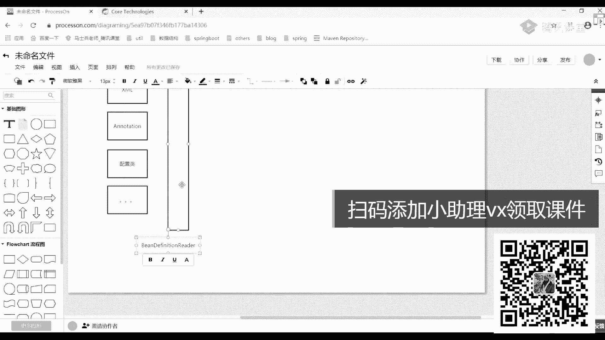

# 白嫖到马士兵教育价值23980的MCA架构师课程一次让你学够！ - P35：SPRING源码：03Spring的生命周期源码解读 - Java视频学堂 - BV1Hy4y1t7Bo

如果你对sp原码比较熟的话，你可以在sp原码里面sp原码里面为所欲为。开始想怎么班就怎么玩，想怎么搞就怎么搞。懂我意思吧？所以看到这块之后，你应该有一个具体的一个总结了。什么总结呢？

这是我们通过这个图之后，我总结出来的一点东西。想要。成为一个框架。首先。要考虑的。一定是扩展性。这一点我希望所有人能给我记记住了，完全给我记住了，这点很重要。很多同学理解不了。

就就就就在这点有了扩展线之后，扩展线之后，我们这可以思考了spring。提供。往什么扩展性？想一想通上面图，你告诉我spring提供什么样扩展器。好。来写一下吧。第一步。在对象。创建之前。能不能呃添加。

某些。功能。能做吧是吧，第二步，在容器初始化。之前。添加。某些。功能。可以吧啊，第三步，什么东西可以在不同的阶段。然后呢发出不同的事件嘛啊，然后呢完成。一些功能。是不是这意思？好，这有了之后还干嘛？

是不是可以第四步叫抽象出一堆的接口来。帮助。扩展。所以在这一块你需要理解是什么？叫面向接口。编程。把这一点给盖到。啊，这东西很重要。我希望你看完这个图之后，能理解这块的一些含义。列解这块的一些含义。

明白意思吗？啊，这儿现大家能改造。OK第三啥意思？这是我们说的监听器嘛，观察者模式吗？😡，观察这个模式，比如观察这个模式之后，我是不是就能在完成有对象初始化完成之后，我做的做什么事。

完成之前做什么事可以发出一些事件。有了事件之后就完成很多功能了，就这意思。来这地方这几个点能听吗？同学告诉客户一。好了，这问题之后，这个简略图简略图我们就过了，我们就过了啊，过完之后我再画一张。

画一张什么画一张稍微难理解那么一丢丢的一张图，或者说是一个更完善的一张图。我需要干嘛？我需要把对应的一些接口给大家说出来。比如说比如说源码源码在进行设计的时候，或跨下来进行设计的时候。

我到底要遵循什么样的一个东西？是不对到。架构设计过程。就如果你来做的话，你会怎么样来做这样的事情，好吧，或者说你会做什么样的一些扩展，完成什么样的一些基本功能。好吧，我把它改一下。好了。

这些过程在这个过程之前，首先我希望你能够干燥一点。是不是？😊，IOC的核心。核心是啥？这个图会给你们发的，好吧，图给你们发的，别别担心，这图一会都都会给你们发IOC的核心是什么？😡，通过。反射。

然后呢创建。对象嘛，然后呢是不是可以操作？对象是不是这意思？好吧，然后呢，你还需要理解一点是啥？这东西其实我们完全没必要有1个IOC的东西啊。什么意思啊？你要理解容器的一个发展历程，容器的一个发展历程。

最开始的时候最。你想一下你们刚写那边怎么写的？😡，是不是直接扭对象？每次需要什么对象，我直接拗什么对象，是不是你什么对象，扭完之后，我拿过来之后直接用什么时候不用了，然后用GVM垃圾回收完事。😡。

是不是这东西你们之前是这么做的。😡，对吧然后呢慢慢对象创建起来比较麻烦了。人们开始想了，有没有一种更简单的方式，什么简单方式？比如说有个东西叫什么叫工厂模式。是不是工厂模式啊。

我通过工厂模式里面有个东西叫get instance，是不是可以来通过工厂来创建我们具体的一个对象。但这个时候你还是需要工厂类的吧，有工厂类来帮助我们来创建具体对象。是不是这意思？然后慢慢再过渡。

过渡是什么样子？过渡层我们对应的一个容器。啊，在容器里面，特别是词文容器里面做点什么事情？就是我们对应的一个反射。加上。工厂完成具体的一个操作。所以这就是容器整个的它的一个演变过程。

也就是说我们原来你需要用对象的时候，或者你需要自己来使用对象的时候，你怎么做的？刚开始又后来有了工厂，有工厂都不够，有了容器，有了容器之后有什么好处啊，想一想。有了容器之后，你想一下。

在spring里面，你什么时候自己用过对象？验过吗？在sp里面，你自己有过对象吗？😡，啊。😮，拗过好，哪尿过。哪尿过。Got a变。完全不需要吧。说完全不需要同学不对。告诉大家。

有一个地方你可能是需要拗的，但是你们平常写代码的时候可能没这么写过什么东西呢？有一个东西叫。Fttery。b见过吗？在f对B里面是不是有一个方法叫什么？叫get object。😡，在这里面。

我是不是可以自己来拗对象？听白意思了吗？这边是不是可以有，但是一般也特别是一些初级的一些程序员，或者说呃刚接触sp的一些同学这块东西大家几乎没人这么干啊。

所以这块你不用管他你不用管它一般都是什么你配置好了并的信息，把并的信息交给我们当前sp容器，他来帮我们new帮我们复制，帮我完成一系列的一些具体操作。这块我们压根不需要再做任何的一个关心了我。

不要做任何关心了啊，一会儿我来详细讲一下那个factorory bin这样的东西啊，啥是factorory啥是factory，一会我来说一会来说O下面来我们再接着往下画。赔个啥啊，骚一点。OK好了。

下面再往下写写什么东西？我说了，把刚刚画那个简化图，简化图我们来详细画一下。它里面包含了非常非常多的东西，非常非常多的东西。好吧，需要我们深刻去理解一下。还是一样。你想一下，你在拿过S分中心之后。

第一步先干嘛，是不是先把我们的依赖加载过来，加载过之后，第二步，要不然你写注解，要不然你写配置文件，是不是两种方式，对不对？那我们可以怎么办？把这配置文件拿过来。第一种你可以用插牌文件的方式？

这没问题吧。然后呢，第二个你可以用什么用注解的方式。然后非事第3个还可有什么东西？是不是现在你在用springbo的时候，很多同学都在用什么？配置类吧。是东西？假如说后面还会有一些新的东西再写一个加点。

第二点，其他方式可以吧，但不管你用什么样的一个方式，最终我是要把对应的一些病的信息给读取出来的吧。而在读取的时候，我也说过了，怎么做来的？中间这块必须要有一个什么叫抽象层的一个逻辑。抽象层。

这上层其实我说了句好理解成像层。不讲。说啥意思来着，这东西叫什么名字？还记得吗？刚刚已经写过了，叫变，然后呢。带芬你上，然后呢。啥。这叫Bing definitionread吧。可能这个类比较陌生啊。

看你们都没看过这东西啊。

看到了吗？是不是这样一接口，看一这是干嘛的？他说simple interface for being definition readers是吧？

so specific load methods为 resource and strain location parameters干嘛的？是不是用来加载我们对应当前的一些参数了或者一些配置信息。这块。

我到时候看原版的时会带你们看，我带你们看别慌，别慌好吧。但你要知道它有这样的一个类，或者有这样的一个东西，能帮我完成具体的功能，我来标红一下。😊。

这个类是一个非常非常重要的一个接口，如果记住了哎。呃这A呀。对对，这是一个非常非常重要的接口。你记住了，这是第一个接口，这是第一个接口。有这接口之后。

我通过不同的语可以把我们对应的一些配置方式或者是配置信息都给读过来。读过来读完之后，这事儿就了了。这是我们之前那个配置类。🤧嗯。啊，这样的一个方式，但你读过来之后还是一样的，后面给谁来了。

是不是给了一个容器IOC。啊，给到一个容器，在当前容器里面在干嘛？它中间其实是有一层过渡的，什么过渡？我说了，你读过来的信息，说白了就是一堆字符串，对不对？那字符串在我们看来没啥意义没啥意义，好吧。

那既然字符串的话，我需要干嘛？把字符串进行一系列的一些解析工作，解析工作完成之后，最终会转换成什么？是并的一些实体类信息，在这写上并。信息。😊，正么问题吧。到目前为止啊。

跟我们前面看到的东西一模一样一模一样，没有任何的一个区别，就是病的一个信息。有了当前病信息之后，病信息之后，实际上来说该干嘛了，是不是该进行实例化了，是不是该进行实例化了。

但是实例化我们刚刚就直接画出来了，就直接实例化，是实例化，但其实是不对的，其实是不对的，为什么不对？你想一下，你这些病的实例化的时候，是直接来进行实例化的吗？这写一下。实例化的对象是直接进实力化的吗？

不是吧，你告诉我这里面的病是怎么来的？😡，Casloader。别忘了，你要想创建好我们距离项，必须要成为什么？是拗的一个方法，对吧？但我们现在已经不用拗了，不用拗了，不用拗的话怎么办？之前是不是说过了。

你必须要通过反射的方式来创建我们具体的一个对象了。那如果是反射的话，其实也很简单了，我怎么写反射代码。怎么先把上代码？很简单吧，如果你这里可8的话，是不是直接用plus。第二。

什么new instance。是不是完成了？如果你是99以上版本的话，他换了吧，换什么方式，我们写一下。PRUCTOcon等于。什么class点get。Constructor。然后呢。

由当前这个contract的方法，CON点6。Insタス。是这样的方法来完成我们具体的一个功能，这写一下object。OBJ等于它这行代码能不能通过这行代码来反射出，或者说能生成我们具体对象。能吗？

正张代码能看懂同学能看懂同学扣个一。能能看懂？那么好吧，是不是就直接就完成我们具体这样的一些功能了。但是在完成具体这项功能的时候，它有问题，或者说它有毛病。有什么毛病？我说过了。

你不可能不可能直接就new instance了。在new instance之前，我们一定会用到某些具体的一些操作，或者说需要使用某些具体操作。什么操作刚说了吧。

是不有一堆叫什么叫pos叫popocesor东西吧。跟我这样一样的，我也要加一些pocesor东西CAV。拿来。这道。安多一下。摸一下，然后这块呢我们画一条线贯穿下来。这是底。嗯。哇，这样一个方式。

我把这个标上。好吧，一定有这两条线关下来了吧。而这些线最终构成是什么东西，这儿该给具体的接口名称了。听马说的好吧，该给具体的接口名称了，这什么接口？来写一下。叫什么来着？叫Bpost。他在生。

应该有很多人见过这样的一些东西。如果你看过源码的话，一定有很多人见过这样的处理过程。就是这块一个逻辑。这样能看明白吗？这边有接口，都是我们对应的一个bpo post点，这有问题吗？来这儿没问题同学。

李老师扣个一。有没有问题？没吧，这儿没问题之后，来再接着看看什么东西。除了这块之外，除了这块之外，我完成具体这样的一个功能之外，还有什么东西啊？这儿你可以进行对象的一个实例化。但是这些对象的实例化。

你记住了，它属于什么？属于什么东西，属于我们自己定义的那些信息东西吧。所以这样你可以给一个名词叫什么东西，叫普通对象，这叫普通对象可以这么干嘛？我们自己定义信息叫普通对象。但除了这个普通对象之外。

你别忘了这是不是有一堆的binpost processor。这些东西也是具体的子类吧，因为此类事件里面才会有具体的一些逻辑，完成我们对应一些处理方式。是不是这样东西？那你有这个子类之后。

子里面有实现这个子类实现，它是不是也是一个对象？这个对象叫什么？😡，对啊，就这这对象叫叫什么，还能称之为朋对象吗？这是我们自己定义对象吗？😡，不能了吧，叫什么叫spring是啊内部对象OK。可以这样叫。

可以这样讲，这还有东西。叫思瑞。容器对象，我一般喜欢把叫成容器对象。当然这东西啊无处查证。啊，没有人说过这东西没有说这东西。但是你知道它代表的是什么意思就行了啊，没有人叫过这样的名字。

我在任何书上也没有查到这样一个名词解释啊，自己造了一个，你知道什么意思就行了啊，就说在此谓容器里面，它所用到的一些具体的实体类，你可以把它称之为一个东西叫容器对象。转向方向。等下。好吧。

就是这些具体东西，你知道什么意思就行了，我这不带话了，我再不带话了。OK这是这块的一个意思啊，这块的意思。所以你要把对象能做一个具体的区分，能做一个具体区分，好吧，这儿区分完成之后加个勺吧。

再继区分这区完了之后，下一步我们再来聊聊啥。还有什么东西可加的吗？有你是通过这块的并信息并信息，然后呢来实例化我们对象的。而实例化对象的时候，是通过我们反射的方式来进行实例化的这里面你没有感觉断层了吗？

这块上海下海到这块有没有个断层东西，这儿少了一个什么环节，你告诉我。😡，有没有爽环节先说。😡，少了吗？减电器哦，对，不是少减电器。参数好了，羊驼桑说对了，叫工厂不见了。工厂哪去了？

你是不是应该需要一个工厂？😡，你这些实际化是不是都通过工厂方法来进行创建的那其实大家想一下，在工厂方法里面，是不是意味着我就完成了这块对这块代码的一个逻辑了。那所以这块我可以怎么办？套一层。😡，质地。

是啥意思？可以给他起个名字。叫对象工厂。是不是要工厂这意思？这问题吧，有大家对象工厂之后，对象工厂之后，大家想一下对象工厂对应关是啥？嗯。😊，顾老师啥。

是不是就是我们说的最开始的sp容器里面最Q的一个副类啊，是不是最坑的一负类，科负类表示谁呀？很简单啦。然后C看着杯，它表示的是不是另外一个类叫B。February。是不是这接口。

这是不是就是我们那个工程方法？这没问题吧，这没问题吧。好吧，你告诉我对象工厂干一件什么事儿，对象工厂我是不是需要把这些病的信息给读取回来。读取回来之后，通过我反思的方式生成我系列对象。

并且经过一堆的binpost processor来生成，或者说实例化我们具体的这些对象，是不是这意思？那中间是不是相当于我少了具体的一个环节，而少了环节是由谁是由这个bfactor来帮我们完成的。来。

这块能听明白同学给老师扣个一。能听懂吗？所以这时候我们可以怎么办？这儿画一张图，画一箭头。对。哎，这个色不对啊，哪个色来着？按镜头，当你换完镜头之后，我们这儿是不正常指向这儿的，在指向这的时候。

注意了中间砍了一刀。😡，直现给你拦断了。被拦断。拦一下。拦一下之后这干嘛来着？刚刚在第一张图的时候，我就跟你说过这个这个扩展的过程。拿去。我说了，在第一张图是干性规你化的时候。

这块是不是可以进行一个扩展，就要什么进行扩展。这要进行扩展的话，那是回过来回归过来，是就这一块这是会进行扩展了。那这儿我在进行扩展的时候，你告诉我我扩展什么东西。😊，是相当于在我们当前这个工厂前面。

我也可以加一堆的post processor。是不是这意思啊？所以这还怎么画了？可以这样来完成当前这个操作。呃，我想想怎么做。来画一堆东西。好了，这块东西叫什么？😡。

注意了这三个东西这三个东西这三东西它实际上是指向哪的这是并port，这是创建，或者说在实例化具体的并对象之前，我要做的事儿。你告诉我这块用是干嘛的？😡，是不是在工厂方法执行之前。

我要调用的一段处理逻辑了，对不对？所以它也有对应的一个名字，什么名字？能看到吗？preport在这不对。叫啥叫定。有人见过这东西吗？Bingfactory post processoror。见过吧？

这块是不是就当把你把这块东西都给你贯穿起来了。注意啊，这个箭头并没有实际指向这块，好吧。😡，曲线这件头并没有实际指向这。没见过。

有没有点开多少次类实践，你既然说没见过。😡，你没见过这这这些东西吗？😡，一定见过的一定见过的，不可能没见过。啊，一定见过这样东西一定见过这样东西啊，所以这块大家要注意了，这块大家要注意了。

是不是这样抽样出来又是另外的一个接口。现在见过了没？😡，之前不管你见没见过，现在见过了吗？😡，见过了吧。嗯。好。票不要较真好，不要较真儿，我讲的东西一定是有的一定是有的一定是有的啊吧。

所以这块是有这样逻辑的。就说正常情况下，我们理解起来，它应该是直接指向这块的。但实际上中间是通过工厂方法来进行操作的。所以由工厂的时候创业对象的时候会经这样一个环节。那这块你告诉我我能做什么事儿。

你做什么事？啊，正常做什么事？读取。对应的病。的配置。信息是吧，但是发现需要进行。认为。的修改。是不是要进行人为修改啊，或者说我要再添加一些作员信息。此时。😡，可以在此处。完成具体操作。啊。

这块就是这东西啊，这可以把它加讲来，加完之后可以修改我们当前并的一些信息，这是不是就完成对应的功能了？是为了扩展使用吗？那肯定的都是为了扩展使用的，都是为了扩展使用。如果不扩展，这东西贼简单。😡。

这了好吧，为什么生成的死标容积对象指向并post processor。是啥意思？大注意啊，哎，可能我画画画画图的问题啊。

哎。呃，对。Pot。

我确实。你看一下当前这个接口，好吧。我只是写了一个接口的名称，在当前这个接口里面，它有两个方法，好吧，它有两个方法，一个方法叫什么？

下面这个叫post processor before inization，还有一个叫什么？叫post processorces after in，一个是前，一个是后吧，这只是一个前置后置的东西。

而我们现在这个类都叫post processor，这个类的post并不是后置的意思，明白吗？并不是后置的意思，都叫postpro。现在听白了吗？那个skiwalker。听白了吗？这这不是这个接口。

没有一个东西叫prepro，没有这样东西。这个接口里面它是不是提供了两种这样的一个方式来帮你完成这样的东西。😡。

明白我意思吧？这你要注意这你要注意了，好吧，别别别别别弄混了，别弄混了啊，千万别弄混了。O就他这么起名字的，也没招，人家就这么定义了，你能怎么办？😡，🤧好吧，没有没有没有批评啊，没有没有没有没有批评啊。

没有批评的意思。好吧，就大家有疑问就就就就发出来，好吧，就发出来。好了，这是这块的一个整体的一个配置信息。这块看完之后，大家能理解吗？来能力的同学给老师扣个一。能理解吧？啊，应该算是比较简单，对不对？

但是还没完，看一下，现在我出现几个接口了，一个、2个、3个、4个是不是出现四个接口了？有了当前这四个接口之后，下一步我再接着做做什么事情，想一下含收含少啥东西。还少什吗？他他要是啥啥东西。

卖ap mapap就IC容器里面东西吗？不是map。😡，对，监听器永远不要忘了监听器这件事情，这件事情很重要很重要。我把这个挪这来。冇的。到这好吧，到这之后下面我们画一个总体的图。这儿这个箭头不太好啊。

你知道箭头不不指向一次就行了，好吧，我先收一点。😡，藏起来好吧，这样的方式好吧，来这写一句话，什么意思呢？如果想在。不同的阶段。啊，做不同。的事情，那么怎么处理？什么东西？是不是观察者。

模式它在整个容器呃。不去吧。他在整个容器的整个初始化过程中都扮演着一个非常非常重要的一个角色啊，非常重要的角色。这块你一定要知道了一定要知道了，它是位于底下的一个底子，一个底子。有了这个底子之后。

你才能理解说为什么要有这么多疑问。他。这些疑问是干嘛的？他触犯了什么样的一个事件，我应该做什么样的一个处理，这块都要知道了，都要知道了设计模式不熟悉，尴尬设计模式不熟悉的同学，一定要去看设计模式。

你看原码，如果不懂设计模式，看起来会很难受，看起来会很难受。好吧，呃没关系，设计模式东西啊慢慢去补，你平常用不用，我不管，但是你要知道该有设计模式，你要知道，你要知道。好吧，好了，这块没问题了吧。

赵明丽之后来再接着聊，再接着聊。老师讲的这么浅，你都懂。觉得讲讲讲浅是吧？😊，讲起你你就理解一下，好吧，稍微理解一下，毕竟大部分同学的水平是不一样的OK。好了，这块聊完之后，这块聊完之后来再接着聊。

还有啥东西？还有啥？还有一个非常非常重要的一个点。非常非常非常重要的一个点。什么东西呢？在整个环节里面，我们一般创建对象的时候，都是用定factorory来创建对象的。但是你别忘了，在当前这个框架里面。

它还提供了一堆的什么叫factorory。病的东西。有一个factoractory bin的一个接口。这东西我相信在面试的时候问的相对而言也是比较多的。来。

有多少同学问过factorory bin主老师扣个一。有人被问过吗？这块怎么办？这怎么办？第一个问问你说fey病病factory他们有什么样的一个区别？对对是不是有什么样的区别？第二。

你用过f bin做过哪些事情？其实f bin这个接口非常非常简单，它里面一共提供了三个方法，哪三个方法？第一个方法叫get object。这就是为了返回一个object一个对象。好吧，第二个什么呢？

叫is single，判断一下你单应对象到底是否是单立的。s OK啊吧，第三个叫什么叫get tap获取一下我当前的一个类型。啊，就这三个对应的一个方法，别东西没有了，别东西没有了。这块我们可以怎么办？

可以在原码里面进行一个查看，好吧？

Ftter。变。在那找一下get up有吧，get up type吧，它有一 single嘛，是不是一共就三个的方法啊，这东西注意了，它的目的是为了什么？是为了做扩展啊，还是一样，为了做扩展。😡。

做。扩展。做什么扩展啊？我来问一下我来问一下呃，有多少同学，有多少同学在之前学习过程中学过spring cloud。休庭学老扣个一。

spring cloud里面那些组件有哪些组件用到这些factorory bin有吗？有没有？对，finin fame，你可以去看fin里面的。

