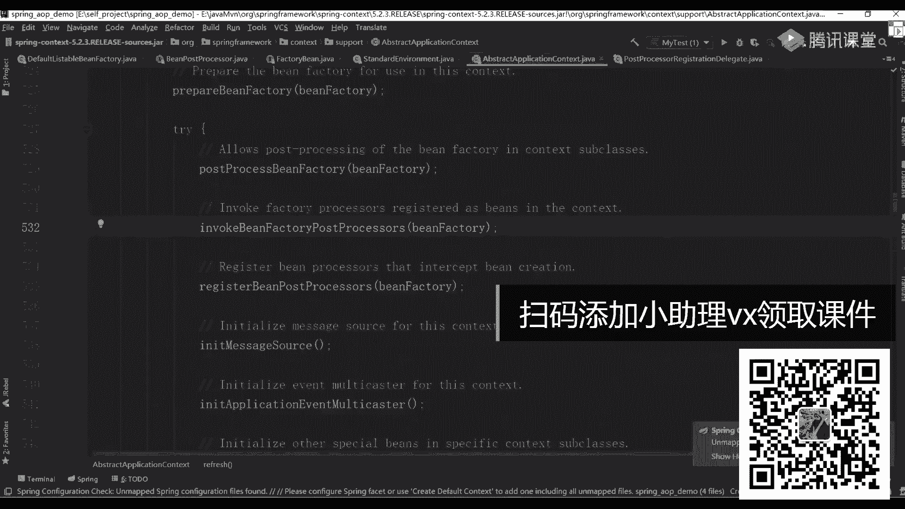
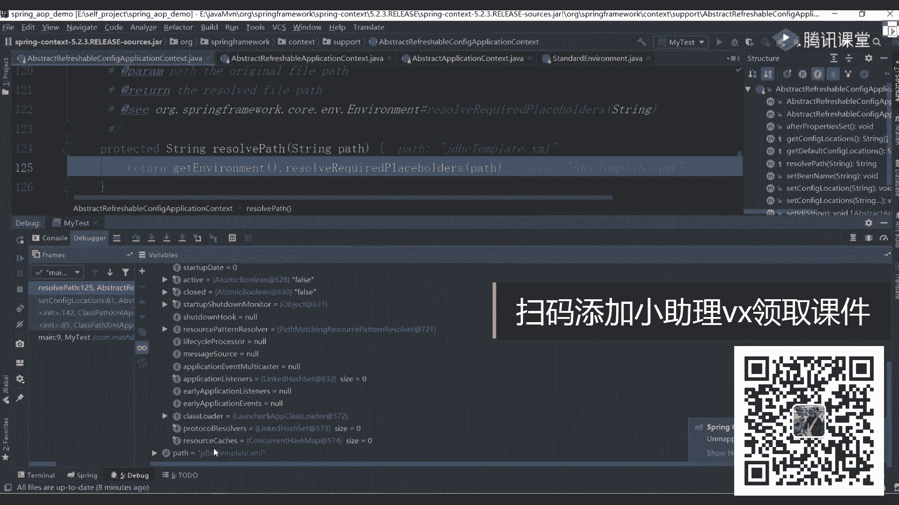

# 系列 2：P36：SPRING源码：04Spring Bean的实例化过程 - Java视频学堂 - BV1Hy4y1t7Bo

他在进行突入的时候，就是用这样的方式来往里面进行装对象创建的，就这么干的好，那到底是什么样的意思，来我举个例子你就明白了，我举个例子就明白了，他非常非常好理解，没大家想的那么难，那么难好吧。

来什么例子呢，呃比如说呃大家都知道在中国的那个神话故事里面，呃中就人是谁造的，人是谁造的，女娲到了吧对吧，女娲是不是要捏那个捏人对年轻人之后，然后呢放到炉子里面烤一烤，烤完之后呢，人就出来了。

是整体上来说应该是这样的一个方式，我就说女娲好吧，不聊别的，就是女娲，你要造人的时候，大家想一下，他在刚开始创造人类的时候，它一定有固定的一个模板，是不是一个模板，那个模板有了之后。

那意味着我创建出来的模人，那个人是不是都是一模一样的对吧，但大家想一下，有一天他发现我在创建这个人那个人人的时候，发现所有人都一模一样，这很明显不合适，我们也不合适，那既然不合适，我怎么办。

我想造一些独特的人，或者说有一些特殊的人，比如说个高个胖瘦，对不对，是不是有各种各样不同的一个人，那这时候怎么办，难道说我在创建出来另外一个模板吗，假如说我就需要一个这样的人，明白我意思啊。

我就需要一个这样的人，我也有必要造一个模板吗，没必要了吧，那怎么办，你就可以使用我们当前这个factor be来创建出来我们这对象，而你在创建这个对象的时候，我说了，他每次在进行调用的时候都是什么。

都是调式，get object这个方法在你实现的时候，你实现好之后，通过get object是不是一个是一个方法，既然是方法，意味着里面可以写n多种的一个逻辑，这个逻辑你自己来判断，或者你自己来编写。

你想造什么样子的，你就造什么样子的，你想怎么玩，你就怎么玩儿，但最终我在进行调用get的时候，返回的就是你自己逻辑的一个对象，而不是我通过这个工厂方法创建好的一些标准对象，明白意思吗，这块明白了吗。

不管是ban factory还是factory be，它最终都是为了用来生产对象的，但是并factory它更多是像是一个模板的一个工厂，然后呢我按照模板生产对东西就可以了。

而我们的father bean是可以按照自己的一个需求进行独特的一些控制，你想怎么玩就怎么玩儿，好想定义什么就定义什么，想增加什么扩展性就增加什么扩展性，爱怎么做怎么做，这他们两个之间的一个区别。

看之前一个区别，所以我们在用的时候，如果就可以普通的像你用你的finder being factory，踏踏实实去干，踏踏实去干啊，然后如果你现在需要创造一些独特的东西，跟刚才的工厂没没多大意思。

没多大意思，我就想能创造一个非常独特，跟其他对象都不一样的东西，你可以用fib来进行实现，来进行实现，就这意思就这意思哦，所以不要把他想的特别特别麻烦，不要想特别的麻烦，你把这个案例如果能想明白了。

这事就了了啊，它没有特别麻烦的东西，没特别麻烦的东西啊，所以这块会出现出来另外的一个接口，什么接口叫seer，并对对象好吧，这两个东西面试的时候，再写一下吧，成分，成分理解本质好吧。

知道大概是什么意思就完事了啊，其实两东西啊，这是一个比较独特的接口，而且啊之后在用的时候，其实用的是比较多的，应用比较多的，特别是一些呃框架里，比如说分刚才说了。

比如说f飞的时候就是用这个呃father be来往里面进入的，你下去之后可以来看一下，可以看一下肺的源码，源码里面能看到这些东西，能看这个东西好吧好了，这块理解完之后来再接着往下聊，还少东西吗。

你去看黑的源码好吧，这样能看吗，我看一下。

算了，网速慢啊，诶能打开。

找一下，这样没有什么怎么搜啊，这个，open粉粉瑞克有开源项目，算了不找了，你下周自己找吧，好吧，下一周自己找吧，然后在官网里面你能看到这样的一个实现啊，这能看到这样写，我每天提前没准备这个东西啊。

没准没准备东西，或者明天我们来看一下，这东西是你大概知道什么意思就行了，大家知道什么意思就行了，来回到这张图上，我们再接着聊，还少什么东西吗，还少不少东西了，你下一次你找到好吧，找到的话。

明天我们上课说一下，还少吗，还少东西还少一个，另外非常非常关键的一个接口，什么接口呢，有这样的东西，有人见过这个接口吗，有没有这样东西，有二本的环境，对不对，环境是干嘛的，环境的东西重要吗。

告诉大家非常非常重要，这个接口什么意思，你在进行进行配置的时候，大家想一下你们之前是不是写过哦，你们之前是不是写过一系列的东西，一些配置文件，比如说写过什么配置文件，p p e r t y t e s。

叉叉点包括第四，比如写一些什么呢，叫叉叉点y a m有人写过这配置文件吧，或者说有没有人这样写过，叫system。get property，有没有这个方法吗，有吧，你在进行首先的一个创建的时候。

是不是就能看到，是不是就能看到类似这样的东西，这配置文件都是通过我们当前这样一个环境对象，环境对象环境接口来进行加载的。

在spring里面，spring里面诶。

看错了，在spring里面还有一个默认的一个实现standard，a r子弹的a n d，1v2 看了吗。

还有这样一个子类实现环境里面有什么，有system environment，system property，好吧，下面还有几个这东西，是不是这样两个环境变量它是可以进行这些这样的一些加载。

就是读取我们当前这样的一个呃系统的一个属性值，把实际值可以进行加载，这东西啊用的也很多，特别是你在进行一些变量值替换的时候，用的都很多，运动很多，这块大家要注意了，要处理好，所以你看完这张图之后。

我缩小一下来告诉我，如果现在让你在看spring源码的时候，你会怎么看，看这个图，你告诉你怎看，现在清晰了吗，对sp l对，是这样的，首先这几个123456这六个接口，你先搞明白gm 6接口之后。

改变六接口之后，下一步我是不是要进行我们整个程序的一个实现了，零七不清晰，不嫌弃的话，我一会带你们看源码实现，我们来看一下源码到底是怎么做的，我应该做什么样的一个东西，第一步先干嘛。

是不是先要读取我们这样的一系列的一个配置文件，读完配置文件之后，我一定会有一些并在分析认为的这样的对象，有了对象之后，我是要把这些并信息给拿过来，拿过来之后，我要进行n层的一个实例化。

在实例化的时候会有一些been factory post processor，还会有一些什么呢，叫being post processor这样的对象吗，这东西你们应该都见过，在哪儿见过，这哪见过。

你想一个点。

你们都知道怎么在进行初始化的时候，一定会掉一个什么，找这个类啊，有人见过这类吗，见过吧，在这个类里面有一个什么方法来着，找一下，比如这样的方法吧。

很多人都告诉你说老师reflash是一个非常非常重要的方法，不管你是spring还是spring vc啊，其实这种东西所有东西都是在整块这个流程里面都解决掉了，是不是这种东西你在这块看的时候。

第一步干嘛呢，准备先刷新，然后呢构建我们的in factory，下一步呢准备这个工厂下面呢有东西啊，post processor，being factory。

还有东西叫invoke ban factory，post processor是干嘛的，你是不是能看到我们对应这样的一些对象，post processor ban对吧，然后呢been factory。

post processor，能不能看出具体这样这样这样一些类这个方法，你点进去之后非常非常长，点进去之后非常非常长，很多同学看到这代码之后就慌了懵了，老师你在干嘛，在聊什么事情，我不知道，我看不懂。

我看不懂，所以你把这些东西如果能够拆分开，你知道这个图了。

你知道每个环节里面在做什么事儿了，你还晕吗，这东西我知道你们很多人在私下私底下的时候，一定看过非常非常多的视频源码，你得看过，你看完之后，所有人都会告诉你说，在看了之后。

一定要找到我们当前这个on reflesh方法，因为这这个refresh方法，因为这个refresh方法里面才是我们最最根本的一个核心，在这个核心里面，核心里面你要看一下具体处理的一个步骤。

在bl里面我要做什么样的一些事情，每个方法做哪些功能，完成这样一个逻辑，我应该怎么做处理，看过吧，来有多少同学看过这里面的方法。

给老师扣个一，看完就忘记了为什么忘记了，为什么忘记了。

忘记的原因就在于你看完这东西之后，就是把它看完了，你没有自己能总结出来一个流程图，如果你有一个图，如果你有个图在那画了，告诉你说第一步，第二步，第三步分别做什么事。

这是不是讲了对不对，我大概看一下，我之前在讲spring的时候找一下啊，往上放小一点，这是之前讲spring ioc容器初始化的时候，初始化的时候，下面每一系列的工作一部分怎么跳转的。

做什么样的事情应该怎么做处理，每块我都写上了，都有这东西，你如果直接把这些东西画成图一条线，然后这条线然后这个分支一条路捋下来，你还会蒙吗，你不会再梦了，你不再懵了，明白我意思吧，啊所以还是那句话。

还是那句话，你们在学习东西的时候也好，还是看源码的时候也好，大家其实并不是在呃看源码，更多的东西是什么，是你们在走代码，就是把那个代码来走一遍，走一遍之后这事了了，跟我没关系，跟我没关系。

我看完了好像懂了懂了吗，懂了懂了之后就完了，不对不对啊，所以不要把这东西想的特别特别简单，你不要把它想的特别难，你一记住一定要去总结，一定要去做总结，你好意思吗，好了，选那个图，那个图不给啊。

那个图不是他今天换了，不给啊，今天画两张图，我给那个图不给好吧，一会儿带你们看原码的时候，我再说，ok来到目前为止，还能听班同学给老师扣波六，跑32炮32在线的一个工具，再现一工具。

ok有了这个东西之后，下一步干嘛，看源码吧，是不看源码，看源码怎么看，我们就记住流程，第一步有这些配置文件，第二步读取我们对应的一些类，有了类之后读取配置信息，然后呢进行反射进行生成啊。

做完这些事情之后，我可以完事好吧，下面来我们来带一下具体的一个流程。

怎么带呀，把这些类都干掉，都干掉都不要好。

第一步开始看，首先你要找到我们当前的一个测试类，这有一个my test mett，非常简单，我这是用什么用配置文件这样的一个方式，用配置文件这样一个方式，用配置文件量方式的时候。

第一步叫class pass叉m2 ation contest，是不是这样的吗，所以在第一步这你可以打一半点，一步一步往里边进行挨个的一个1万个挨个的bug，哎你们想听下这个流程吗。

需要带你们看一下这个流程吗，记住在看的时候跟那个图去做对比好吧，去做对比，一步一步对比的，你知道哦，原来是这么回事，原来这么简单，没你想那么难好吧，来走一下，我们走就好吧。

这个代码我也不知道什么时候写的，写了很多，比如讲当时讲那个spring课的时候，带一下这个这个这个这个这个这个流程，这个流程好吧，记住了。

叫class pass travel up in contest，就这样一个东西点上去，第八个，考第一步了吧，注意了，你读了一个配置文件叫j d b c他们的长矛文件，就这个文件不用管它。

然后点f7 调这块之后，这是一个为了防止weblogic 8。1的时候一个bug问题，加这样弄东西没啥意义好吧没啥意义，连续到这儿了吧，是不是掉了一个this表示什么东西哇，再点到this到这了。

到这儿之后，第一步叫super，这个super啥意思，不用下载源码好吧，你用idea的时候，它里面那个包里面带着源码，你直接看就行了，直接看就行了，继承吧，调用父类吧。

这里面我希望再给你们灌输另外一个思想，在四本里面非常重要的东西，什么东西呢，它这里面分着容是有容器，对不对啊，但是容器的时候，容器的时候它有n多个父子关系好吧，就是说他第一个先有一个子容器好吧。

然后有一个副容器，所以你在看的时候比较容易晕，住在哪儿呢，你第一次先在子容器里面找，如果子容器里面找不到的话，再找谁，再找副容器，再找副容器，它是这样的一个一次迭代的过程，听明白意思吧。

所以不要说诶子中线没有就不看了，不要这样，最好你再看一下，既然是在学习，既然在学习，就别怕看的比较多，为啥看原版是五点几的，我们我们讲课讲的都是最新的好吧，给大家看一下5。2。3。

当时讲课的时候用的是5。2。3啊，现在已经到5。2。7了吧，这就是5。2。3啊，不讲四讲四都没意思啊，价格讲最新的加上最新的好吧，当然讲课讲的5。2。3，首先就用旧的东西，ok 5。2。5可以。

这个spring的更新是非常快的，刚给你们给你们看那个官网了，现在最新是到5。22。7了，掉5。6，当时还五点点三呢。

ok，好了来我来点一下试试好吧，第一步super你点击看看没事，点击看看好吧，看看又不浪费钱对吧，这次交流方法里面调完之后创建了一系列对象，这些对象干嘛的，我不知道，我不知道，但是我知道了。

我知道什么东西，它里面准备了一系列的历史对象，包括环境对象，一堆东西先留一边，还是那句话，注意了，你看不懂的东西先不看，听明白了吗，看不懂的东西先不看，先扔一边，别想着一口气把所有东西看明白了。

不现实不现实，第二个叫什么呢，读完之后读到那个分类里面叫abstract obligation contest，诶，这啥意思，所以这时候你在看的时候最好能怎么看，找到我们当前那个class pass。

come on in contest，等到这个类选择它右击，看一下当前这个类的一个类图，它有一系列非常非常复杂的一个继承关系吧，这是我们最下面的，还有一层一层这样的一个继承关系，但不管怎么继承。

最终到上面之后一定是谁，是不是叫being battery，是不是有他对啊，这是我们之前看的那个祖祖祖宗那个负类组的负累，好吧，留下之后下一步再怎么干，告诉我是不是直接进行，我们刚刚那个实际话讲。

这叫get resource path reserver啊，这啥意思啊，获取资源匹配的一个处理器吧，是护理资源匹配的处理器，点了这个方法里面他就用了一个对象。

叫pass matching reserve，past reserve，是不是这样，对象点进去看一下这对象构造方法走，你要有一个计算的板块，往上走走，是返回了就返回对象，这东西没有了。

拿走set pad等于空空，把直接跳过就走了，所以这块里面啥也没做，就做了一个资源的一个路径匹配，别动西没没没有没有啥好，回来之后到这儿了吧，第二步叫set config location，是啥意思。

这啥意思，这个set config location表示说我是不是读过来一个配置文件，但既然我读过来一个配置文件了，那意味着这里面应该是谁，是不是叫，g d b c template的点插板文件了。

是不是你写的配置，你可以点开我们debug，看一下康菲和鲁迅比赛有吗，没有在我们这看一下，等下string是不是叫jdbc tely trl文件，是这东西，就一个配置文件，然后点它。

他将来也告诉了微软不等于空做一些处理好吧，读了之后他接过来是一个数组吧，是不是一个可变那个否定堂的一个参数，对不对，有它之后，然后往里面进行处理处理的。

就说this表confilocation等于resolve pass是啥意思，是不是该处理我们当前这些配置文件啊，还是那句话，你需要把配置文件里面的信息都给读取过来，好都有读取过来。

一步一步一层一层挨个处理，这里一个里面我们是不是只有一个，我是只传了一个，所以这只有一个，只有一个，读过之后找我们的resolve pass，这有个东西叫get引观看看了吗，很重要吧。

刚刚我是不是带你们看了，我们刚刚写那个图里面啥图哪去了，这有没有问问他，是大家看到了，现在现在我什么都没做，刚到第一步解析配置文件的时候，他就需要去创建我们当前这样一个环境接口了吧。

这个创建的时候也很简单，它有个东西叫get，那get的时候你想一下，在之前所有操作里面，我有创建过任何跟环境相关的东西吗，没有吧，是没有没有没关系，没有的话，我就给你创建一个新的吗，有的话。

我是不是拿过来之后，我直接进行一个最基本的使用，是不是这意思啊，来到目前为止，能听白同学有点扣个一，那这样吧，所以我刚刚为什么把这个图里面这东西画到一边了。

它是整个环境，也是整个最基本的东西。

它里面包含了非常多的一些属性值，非常多属性值来点到get，他说这东西等于空吧，如果等于空，那o是不是进到里面去，create的时候是不是要创建一个新的，怎么创建新的呢。

你有一个standard environment，是创建一个新的，主要创建新的叫标准环境，那点进去有过多方法，是不是掉到我们复联里面了，所以这一块你在看的时候往上点，这是不是一个抽象的一个负累。

在抽象负类里面，你找一个东西看这块什么，看这块什么，注意啊，子类里面，子类里面是没有构造方法的，是没有构造方法的，但是但是父类里面，父类里面是有对应的构造方法的，所以这个时候你要发现了。

有时候你找属性值，你找不着跟不上，原因在什么地方，别在什么地方，就在于这些东西你没好好看，你没好好看啊，那一样的，我现在要调这个方法来调这个方法的时候，我一定是先在分类里面找的，对不对。

找一下customer property，属于source，是这个方法，这个方案里面有实现吗，没吧，这如果没实现的话，那意味着一定是在我们具体的子类里面做实现的，所以它在进行调用的时候，进行调用的时候。

这大一定要注意了，暂停调动的时候一定会掉到子类方法里面去吧，来找一下，往下走，看，那是不是找我们这个父类的构造方法一点f7 是哪一类，是跑到子列里面了，跑到子类之后干什么事。

是不是叫property source。at last，你有一个property，把properties，property source，这有两个变量点，它叫system properties。

这第一个第二个叫什么叫c where是把这些环境变量都给读取过来，那后面一样是干嘛的，这是读取一些系统属性，怎么读的，c这么点，get a properties，用过没，我之前是不是问过你们了。

就是用来加载我们当前系统里面的一些属性值这一块儿，所以你都能够进行进行验证的，不用我说get system environment也是一样的吧，释放里面判断一些这些集合值。

然后获取下盖子1v判断一下环境变量，当你把这些对象都设置完成之后没走啊，关键在往那边看了啊，点了点了点了点了点了走，做完之后对象里面是有知道environment也有对象了吧，把对象直接返回去。

返回去之后你往下看，找到我们的this，找到我们的environment，麻烦environment在哪，嗯，没有吗。

诶这儿没有啊，没有没关系啊，我们直接直接计算coc head里面有什么东西，default properties，是不是default apower source，点开看里面这些属性值，好吧。

看这sos资源了吗，里面有多少javs e one time environment，什么东西，是不是一堆的属性值，这块是不是都有了，第二个里面是不是也有点开一些属性值，是不是都读过来了。

这是不是意味着把我们当前系统里面的环境值都给拿过来进行运行，就完事儿了，是不是意思来到目前为止能看明白，同学高考个一，这是不是环境，那这个东西准备好环境之后看这个图，我现在是把环境变量都到了，得到之后。

我下一步在整个环节里面，如果我需要读取我们环节里面一些配置的话，我是不是直接拿过来读就行了，还需要做其他操作吗，不需要了吗，听不懂是吧，听不懂，可能是你第一次听，第一次听这东西啊，你一定要去多看。

一定要去多看，太难了，老师研究词汇这么通用多久，10年，用了10年，我想上厕所，所以我我我我我为什么把你画这个图，刚开始先画这个图，画完图之后，为什么要带你看下图这套东西，原因就在这儿。

就是你要有一个流程图之后，然后呢你才能去看它，才能理解它，如果不听这些东西，你听完之后你就懵了，干完之后就懵了，这些图网上都没有这东西，你马上肯定没有，但是我讲完这次课之后，网上可能就有了。

明白我意思吧，讲完这个课之后可能自由了，但是今天应该是就是到目前为止应该是没有了，但我画完之后肯定就有了，因为这东西怎么说，我们很多原创的东西都被抄出去了，无所谓无所谓好吧，知识共享吧，你们想抄就抄了。

无所谓好吧，来我们现在再往下聊。

再往下聊好吧，再往下聊那个厕所，等一下好吧，我们十点钟才下课，十点钟才下课，这块读完之后，下一步叫什么叫result required pholders是干嘛的，就替换一下我们当中的某些人变的一个值。

就这次property reserver是不是之前我们已经看到过当前这样一个对象了，对象里面就放了一些属性值，有属性值之后开始进行相关的一个处理，然后这有个东西叫create。

please hold help，这个place holder helper，有人见过吗，有没有见过，对非常非常对，就是dollar大括号见过吧对吧，context的冒号。

place holder location，实现一个配置文件是不是进行替换，替，完成之后是完成我们对应功能的拿走，点进去你有了一个当前这样一个对象吧，连进去往这里面看，有它吧。

大括号中括号小括号是不是可以进行相关的一个替换，就这块一个逻辑，所以这块是不是就能整体把它给串起来了，连续这里面会有一堆的东西往下找啊，找一个方法哪去了，放大一点放大一点放大看说了，assert。

assert，assert什么东西是不，place holder reflex，到了大括号，到了大公号，小号干嘛的，是相当于就是用来替换我们当前这样的一个变量值，所以这块会完成整个变量值的一个替换过程。

把你之前写的gdbc了，url username password这些东西都可以做一个替换，替换完成之后就了了就了了，这这块的一个逻辑好吧，然后这找到之后。

下一步叫do resolve prince holder，这个do是啥意思，注意了，上面只是创建了具体的一个对象对象，而实际干活的方法，注意了啊，你在spring里面。

你在spring里面会看到很多do开头的东西，比如说do create be，看到了吧，这才是实际具体干活的方法的，所以do的东西做东西一定是实际上活的，看到do的时候稍微留意一下。

这才是实际进行处理的一些数理逻辑这块啊，不带你们先去看了，下去之后自己来看看，自己来看看，ok好了，这边再说了，你知道这块是干嘛的就行了，好不就行了，所以这块帮我们把环境变量都做一个替换。

并且解析了我们当前这样配置文件，配置文件搞定之后，搞定之后，当然我这没带你们细看，进去之后，你看到有很多插画文件的一个读取是吧，包括d td文件的一个匹配，这都有里面细节，孩子去了。

但是我觉得刚开始啊掌握到这个程度够了，招数都够了，然后这儿有个reflesh默认值就是true true之后进来之后跳到哪儿，是不是跳到我们这个reflesh方法里面填进去到这个方法了吧。

这个方法才是整个spring的一个核心，一步一步我应该做什么操作，这块儿我相信你们很多同学看过n多遍了，但是有同学依然看不明白，来我来问一个问题，每一个问题什么问题啊，呃这块在进行整合的时候。

哪块哪个方法是用来创建单例对象的，你老跟我聊膀胱干啥，上厕所你就去嘛，对不对，拿着手机去好不好，其他问题啊，在这一系列的方法里面有十几个方法，这十几个方法里面哪个方法，哪个方法是用来创建单位对象的。

你知道吗，这号码，知道，这有个东西叫finish bin factory，insuler，是不是他说了嘛叫instance or remain，然后呢。

now lady need singleton是创建所有具体的一些单位对象，是不是有好吧，非懒加载的接单列对象，把这个方案里面都有好吧，我再问一个问题，你们在运行那个spring mvc这个程序的时候。

什么vc所有人都知道我们有问题啊，spring mvc里面它会调用这个reflesh方法吗，听完我的问题啊，听完我的问题，svc里面会调用refresh方法吗，会吧，yes，ok会的话。

它是在哪个方法来进行引入了，你们知道吗，内号码，ctrl是单位的，你说这话干嘛的，注意了，就是在这个finish refresh方法里面去，哪个这个方法它是通过什么方式注入进来的。

是通过一个事件听明白了吗，通过一个事件，通过一个事件来启动调用我们当前这个reflash这个方法的这东西啊，有时间的话，我们可以带大家接着接着往后看，接着往后看啊。

所以大家发现了里面有非常非常多的一些东西啊，没办法干嘛的，之后我会带你们详细看，但是你别忘了我说那个思路，说那个思路什么思路，当我第一次完成最基本淘宝开张图。

刚刚环境有了，没问题吧，第二个配置文件我已经读取过了，读取过程之后，下一步我该进行实例化了，但是在实例化之前，你想一下你少什么工厂，你有吗，工厂电有吗，没有吧，那是不是第一步我应该先有一个对象工程。

有了对象工厂之后，我才能把这些病的信息是不是给进行一个加载，或者进行一个实例化，明白我意思了吗，必须要先有工厂吧。

所以这块你往上看的时候，你会发现这块第一步的时候诶，第一块叫什么叫prepare reflesh，你点进去你发现里面几乎跟没啥也没做一样，第一步干嘛呢，得到一个时间。

第二个呢把close方法做了一些标志位好吧，第三个设置一些环境的一些相关操作，把相关参数设完之后没有了，就创建一些集合吧，创建一些集合这块就没有了，这个方法无所谓，好吧，来看第二个方法叫什么。

叫tfa fresh，然后呢being factory它返回值是什么，是什么，返回值叫confiable liable，being factory。

是不是也是告诉你说我返回了当前的一个bean factory吧，告诉你一个叫get ban factory，所以第二步是不是告诉你说我要先得到当前这样的一个工程。

对不对，是德国工厂，当我有了工厂之后，意味着这里面有了这样，有了之后，下一步该干嘛在干嘛，你告诉我，看这个图下边干嘛，是不是正常情况下i进行实例化了，但是你别忘了你在读取这些并配置信息的时候。

是不是有些东西叫being factory，possible呃，破processor是不是经过这些一堆processor这些相关的一些处理啊。

那有这些处理之后，你往下看往回返啊，第二步叫prepare being factory吧，这块里面啥几乎跟啥也没做一样，就设置了一些往being factory里面设置一些东西，设置啥，你先不管是啥。

先不管好吧，就设置一些东西往回返到这一步叫post processor defy，你点完之后发现里面是空的，空的就太好了吧，空的意味着什么，意味着我们可以进行相关一系列的一个扩展吧。

是不是一系列一个扩展功能啊，用来进行一个扩展好吧，再来看到invoke并factory post processor，啥意思啊，叫bin theory post processor。

这个时候你捋过来之后，你发现了是不是到下面这块了，本来有了对象之后，我在对象创建之前，我要先这要拦截一下，对不对，是先进行这样一个操作逻辑。

所以在刚刚那个方法里面，是不是仅进行了一系列这样复杂一个逻辑，没问题吧，当你把这一卸载就做完之后，做完之后，这是不是有个emove方法，当然这个方法会比较麻烦，会比较麻烦，比较麻烦你我们先不看先不看好。

先不看，我看回家之后，下一步叫register being post processor，是啥意思，注册并post processor吧，刚刚是谁叫bin factory post processor。

下面叫什么叫bin post processor。

你再回到这张图上，这事完了占完了之后在哪儿了吗，说到这儿了，是不是叫bin pos processor，看看是这张图里面画东西吗，是不是一层一层挨个往下进行一个迭代，挨个往下进行一个铝对吧。

留完之后来再往下看，这个方法下面干嘛叫你it message source是干嘛的。

这用来进行国际化相关的一些配置的，国际化相关的一些配置啊，l8 对对对，i8 好吧，那再来看一下什么叫in application event，然后mute custom是啥意思，啥意思啊。

初始化应用程序已问的事件了，是不是该进行我们整个事件的一些控制的东西了，是事件控制的东西。

这块是不是到最下面来了，观察者模式吧对吧，叫广播器或者传播器。

好多波器都行都行，无所谓，再来看一下a reflesh，点进去就是空的吧，既然是空的，又是此类实现，无所谓了，不管他对吧，再往后翻叫regilistener，上面是一个广播器，有广播器之后。

我是不是要往里面注册一下，我们当前已经有一些事件，因为不同事件会触发不同的功能，会有不同的一些扩展，对不对，这块都完成了，下一步叫finish bsary ination。

这个时候是不是该完成我们整个实例化这个功能了，是不是意思，你实例化功能完成之后。

这事不就了了了了之后，下一步叫finish reflesh，是完成我们整个这个reflesh下面的一些方法，明白我意思吧，就相当于说完成我们整个刷新功能，下面就是一些清空的一些操作了，没啥了吧。

听懂意思了吗，所以你看一下刚刚这里面这些复杂逻辑，是不是我给你们画这张图。

为什么你们看这些源代码的时候看的比较晕，看得比较懵，如果有这个图在脑海里面，你按照这个图的逻辑一步一步往里边走，你还晕吗，不用了，这东西不再会成为一个问题，明白吗，来学六位同学给老师刷波六。

所以啊你要知道你缺乏的是什么，其实不是大家不刻苦，不是大家不努力，有时候可能方法更加重要的一点，人家撞一遍，你一定要在看源码的时候自己去捋啊，自己去捋，面对日本国家可以吗，可以啊，但是但最好的是什么。

你能对里面的具体类或者具体细节，具体细节，然后呢再做一下，就是做一些细节这样的东西，这东西还是要看的啊，不是说不看也还是要看的，还是要看的，关键是你要先有这样一个概率图，有了概念图。

然后呢再来看看这块东西，懂我意思吗，所以今天咱们时间不够了，可能同学的膀胱都要炸了，膀胱都要炸了啊，明天我会带着你们去捋细节，去理细节，先讲o p话，不讲o p解码，我问一下a o p在哪实现。

a op在哪实现，谁能告诉我，你need哪，这块吧是been post processor，注意啊，a o p只是其中的一个功能，其中的一个功能啊，就在这块进行一些时间就可以了。

所以你把这里面的逻辑都捋清楚了，a o p也不是个事儿，不叫个事不叫个事，好吧好了，这是我们整个详细的一个处理逻辑，我觉得你花两分钱听这节课不亏吧，这两块钱我觉得花的很值了吧，年代refresh。

对我今天只是带你们把这个大致的流程给大家梳理一下。

明天会带入里面的具体细节，看一下细节里面你应该怎么做一些处理，懂我意思吗，哇树在哪块事物是spring里面一个声明是树，它是以一个切片的方式引入进去的，引入进去的流流程不就是这个图吗。

我画了一节半课的时间。

不就给大家画这个图吗，有了这个图不就不就ok了嘛，对不对，听了两节课，抽20的烟，哈哈哈，所有的扩展功能都是在这个的基础之上来做实现的，听明白了吗，听到了吗，好吧这大家一定要注意了，一定要注意了。

那么老师原码怎么学，其实我跟大家说，我给大家说一下实话说一下实际，我给大家说说一下，说一下实话呃，如果你要看源码的时候，同学们老师我初学者我要不要去看源码，你理论上来说，理论上来说我是不推荐出去的。

看源码看懂了，但是但是啊我在讲那个基础课的时候，我也给大家讲解码，给大家讲解码，为什么这么讲，我可以给大家来看一下这东西啊，就是呃我不看不看课了，省你们说我在卖课不卖课啊，我给大家看一下。

我之前上课写的给大家整理的这些文档好吧，加spring的时候有smart原理讲解好吧，有一些动态动态规划看一下，讲这个原理的时候，我是以面试题的方式来给大家进行讲解的，面试题。

因为这题的方式给大家进行这块的一个基本讲解的，并且这块也带同学们看对应的1v2 ，然后再讲那个spring m v c的时候，也有对应的一些源码东西，给大家写了一些注释，写了一些注解。

这个具体流程都有是吧，包括在讲my best is的时候转换，把bance，这站边啊没写文档，那边这次的时候也会有对应的一些源码的课程，也会对应源码课程这块我都是有讲到的，我来找一下啊。

应该讲的词根分work，看到了吧，spring源码讲解a o b的详细事物的一些讲解啊，这都有动态代理的源码我都讲了，包括像spring vc这块源码都讲了，然后包括像my bed编码也讲了。

好源码几乎都是给大家进行了一个基本的讲解，基本讲解，包括其实在讲spring boot的时候，bot的时候我也讲源码了，给大家看一下spring boat源码源码源码源码为什么要讲源码。

很多老师你没必要讲源码基础课，我就学习应用，能讲源码干嘛，你最开始最开始就算你没听懂，但最起码听个响儿，什么叫听个响儿，随便听个响声告诉我，你先留个印象之后，如果你看的时候，它不是一个新鲜事物，明白吗。

不是一个新鲜事物，如果你每次听到一个东西的时候，都是一个新鲜事物，这你学起来成就一定是非常非常慢的，所以为什么要给大家讲这块东西，原因就在这儿，我希望能够给你们看到这些东西。

你们也要需要自己下去之后可以好好聊一下，好好看看这个这些细节，你记住啊，记住的东西是死的，你只要肯花时间，肯花精力，这东西没有说学不会了，你只要不傻，没有学不会没有学不会听懂我意思吗，好吧。

所以这样大家要注意了，一定要注意了，k9 负的话，以前我对我以前有九负，2013年的时候，114年14年的时候好吧，还一样别人花一周一周时间搞定的东西，我花三周，别人花一个月搞定，是我花三个月总可以吧。

能搞清楚最怕是什么懒，最怕是什么，是害怕很多东西一看原版就懵了。

我是不干了，干不了这东西不是人看的，我看不了这东西没招，所以我希望在两篇课里面可以带你们梳理一下大致流程，具体的细节下去之后可以详细再看一下，ok课在哪里买，今天的资料今天的资料哇，可以呃。

一会儿那个图我会给大家发出去，发出去，我可以给你实验的，早一点比较好，那个时间是改不了的，时间是改不了的，老师我专科1年工作经验，希望他最后能拿20k吗，不敢保证，但是我能保证是什么。

是你的技术是没问题的，但是有没有这个机会看你自己了，看你自己了，这边的内容绝对是最深的，没有之一，没有之一，61，但能不能拿20，能拿20，看你自己的运气和你的表达，有些同学啥都会就说不出来，难受。

我这不难受，ok公司cpu缺你了，不要嘲讽好吧，老马应该和你讲spring，我在基础班一讲，spring不是没讲老师那一句话，说一下spring spring boss的区别吗。

spring boot它比较就用起来比较简单，你需要写出非常多的一些配置，现在自定义了一些starter，你也可以自定义starter，然后启动的时候容器这些东西都帮你自动，将来完成了。

不需要任何依赖外部的一些服务，直接进行配置就行了就可以了啊，这这这这这个很这个很简单啊，它不是微spring boot，不是微服务，它只能算是一个脚手架，只能算是一只脚手架，好吧，所以我的封装很深。

就是少了点什对，就这样的老师可以说一下怎么给面试官吹牛逼吗，吹牛逼是依托于你的技术实力的，一定是你的技术实力的，如果你的技术实力不够，你吹的牛最终都会破掉了，没有我意思吧好吧。

所以啊所以啊还是有了技术的底子，再加上点数牛逼就ok了就ok了好吧，试用期你过不去哈哈老师来波话术，什么叫话术，咱俩会教面试吗，老师会的会的会的，我可以给大家给大家看一下，老师阿里p几没见过阿里。

不好意思，比较惭愧啊，惭愧，怎么阿里就一定是大牛吗，不信阿里一定不行吗，我怎么这么不服呢，词根考不会讲吗，咱们今天可能讲不到，今天可能讲不到，但是呃课程里面是有这个词汇考拉东西的，随便可以多讲面试题吗。

你把源码看了，你还会在乎面试题的东西吗，我怎么理解不了这件事情呢，好吧嗯，我可以给大家看点东西，看下什么，有学生学生很多学生会问我们简历指导就是专门的面试课，马老师也讲过。

大家之前不知道有没有同学听过这这个马上也讲过，我们会学生入学之后也会有一些面试简历的更改，这方面的一些服务都有都有好吧，现在在马士兵教育好吧，我很骄傲。

ok面向面试编程op为什么不是在being factory post processor实现的，你先理解清楚什么叫a op再来问这个问题，他在哪个层面，你觉得适合比较好，在供应上前面就实现吗。

它是嵌套在具体对象的具体的方法里面去的，你在工厂前面做有什么用，有什么用好吧，之前有同学，老杨是之前的学生吗，心若止水，你之前认识我吗，好了好了，不聊了不聊了好吧，今天咱们就上这么多。

然后嗯明天明天我们再接着带大家做里面的一些深入的一个学习，深入学习还要明天八点准时开始，准时开始好了，今天咱们就聊这么多行。

