# 白嫖到马士兵教育价值23980的MCA架构师课程一次让你学够！ - P38：SPRING源码：06Spring的BeanFactory和FactoryBean的区别？ - Java视频学堂 - BV1Hy4y1t7Bo

生命周期吗，有没有同学被问到这个问题，被问到我同学来扣个六，有人被问到过吗，有没有你们怎么回答的，我相信大部分同学在回答这个问题的时候，都是提前准备好了一个面试的文档，然后呢我背了一下，面试官一问。

我啪一说，完事了，是这样做的，但其实你注意了，他这儿有一个非常非常非常简单而且直观的一个方式，什么意思，他会告诉你整个病是怎么做的，往下面看，他说了，being factory，实现类干嘛呢。

应该支持什么呢，叫标准的病的一个生命周期的接口吧，或者说尽可能的去支持一个标准的并生命周期好吧，他说这个完整的初始化的一个结合好吧，再让它们的顺序是下面那块东西有什么呢，内幕宾name aware。

being class，loader，aware，aware，aware，aware aware是啥，是不是设置了一些偶尔的接口，这些偶尔的接口最终目的是干啥呢，是为了设置我们对应的一些属性。

方便我在后续进行使用的时候，注意后期使用的时候，直接从我们的容器或对象里面获取到相关的一些属性值啊，或者相关的一些属性值，所以里面这是写好了。

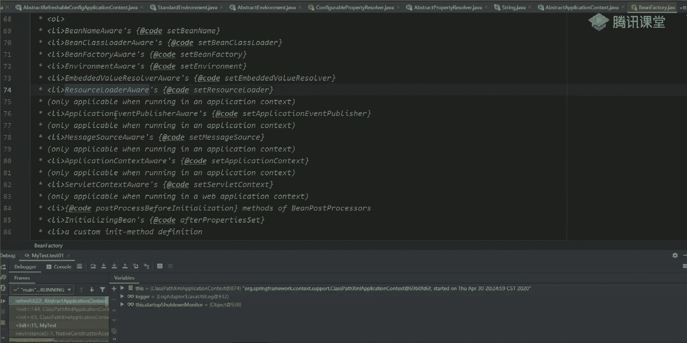

当你把这些av的接口你都看完之后，不管它不管他到哪儿。

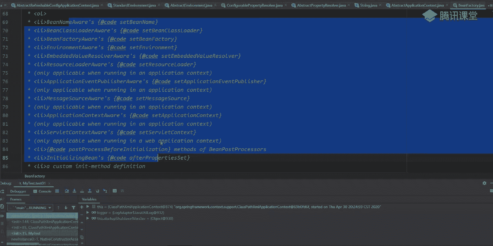

这儿完了吧，这有什么东西，我再往下走啊，哪去了，说post processor before midation method of being，post processor。

是不是告诉你说being的时候，你应该先执行什么东西，先执行什么方法，这个目的提示有提示之后，第二步叫什么零收来，b是不是执行这个初始化的一个病。

然后说有一些customer in need a method definition，你可以自己定义当前病的一些初始化的方法吧，这东西你们应该见过，对不对，哪儿见过，打开我们当前所里面的一个配置文件。

你这样写的时候，这样能不能写这样的东西，init method，还有什么东西，是不是有东西，descri method是这样的方法，这块你是不是都可以进行自己的一个实现，在这块说了叫a cut吗。

叫定制的，对不对，好吧，那定制就这样一个意思，就这样意思诶，哪去了，是不是有执行这样的一个方法，这这这块吧，直接完成之后又告诉你了。

我要执行being post processor里面的post processor after什么东西，这是before吧，这是after，是不是一个前置，一个后置，是不是这样的，写，再翻翻书了。

on shdown of being factory，好吧，说the follow the circle max，我看如果你要进行关闭的时候，还要执行下面这样一个顺序，干嘛呢。

叫post processor before，好dirt什么，然后他说deposable being a table destromeo。

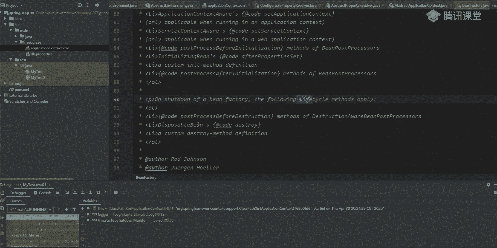

大家看一下这个过程是不是就是我们完整的一个b的生命周期。

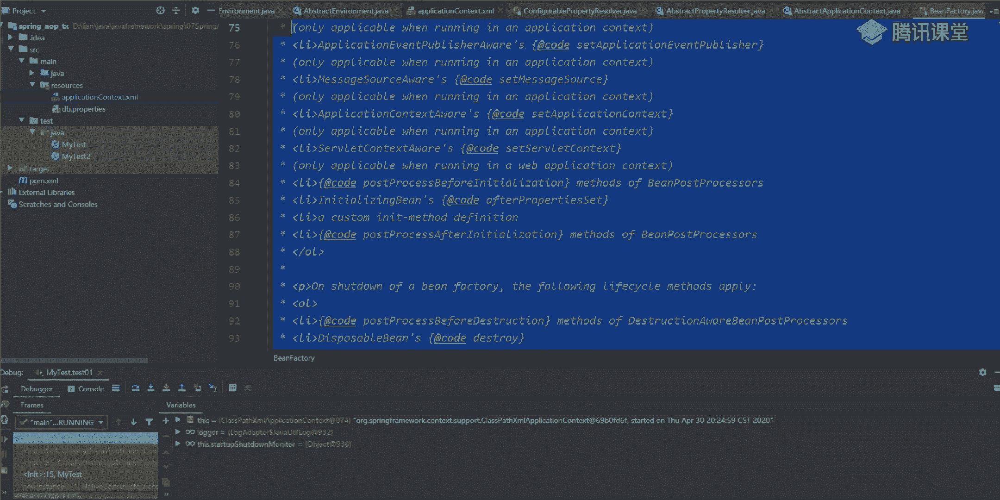

听懂我意思了吗，看到没有有吗，有吧，你还需要去背那些文档吗，有位表文档，这里面是不是给你写好了，没有地方比这个东西更精准了吧，这是原文里面写好的文档，写好注释，没有的地方只要更精准了吧，是不是意思。

所以你要知道在哪儿找这些东西，去哪做整理，你把这东西都说清楚了，我觉得你面试的时候那个问题可能不过吗，懂我意思吧，来听麦同学666走起，能听懂吧，这很重要啊，这很重要啊，所以为什么你们看源码。

源码里面透露出来很多关键的一个信息，关键信息哈切是什么意思，这个更难背，唉好吧，你别老想着被打好吧，没意义了，ok来这块拿完之后，我们回到我们当前的动画里面去好吧，我们开始往下接着走，接着往下走。

接着往下走啊，所以启动的周期是什么。

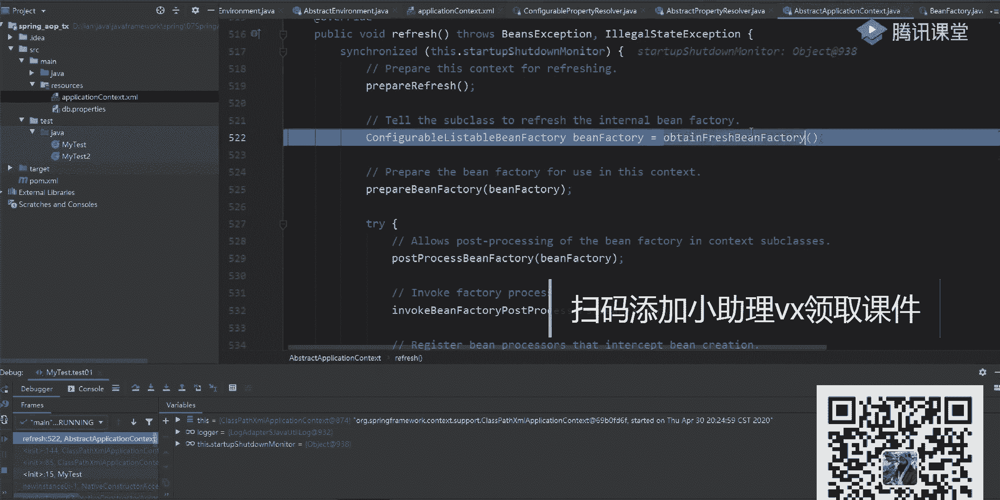

哎呀之前我说过了，我给大家整理过这样的一份东西，嗯哪去了，spring。

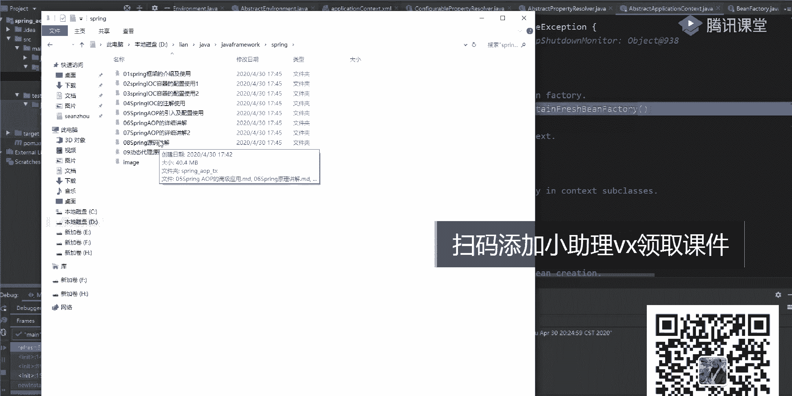

这块如果你觉得你不熟悉的话，试图找到，并在生命周期一步两步三步，每个步骤这样写好了，有需要的同学下周可以看一下，这东西，就是按照刚刚官网里面的东西来进行一些操作的好，今天步骤进行整理了。

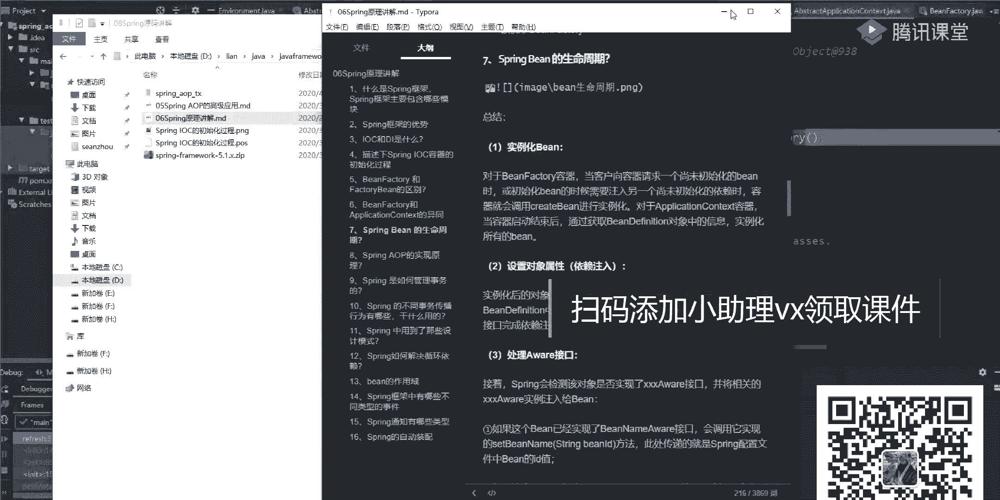

就这块东西啊，背面特别难啊，别别特别难，ok讲这个讲不出来好吧，你要觉得讲不出来，你就算了，ok那你觉得还死记硬背还ebay，但是我要说的是什么，官网里面有没有这样的一个过程，有吧。

官网里面给你里面那个源码里面给你详细解释出来了，好吧行了，下一步来再点进去看一下当前这个工厂里面做了一件什么事情，第一步叫reflesh being battery，是干嘛的，这个文档去发吧。

一会再一会再说发发的事好吧，一会再说发发式啊，那现在方法的reflesh being f，这干嘛的，刷新工厂了，什么叫刷新工厂，点一下是吧，如果你已经有一个工厂了，怎么办，我要把你给销毁账。

把你给克鲁斯掉，是不是第一步要做这样的事，判断一下我到底有没有当前哪个工厂，如果有的话，我先销毁好吧，消费完成之后，然后呢我再进行创建，因为我们这是第一次进来，所以工厂方法是一定没有的。

所以这个步骤不会走了，不会走的，第二步叫create being battery，这是不是开始进行最终整体的一个创建了叫create，刚接到f7 里面什么东西。

你有一个default placeable being battery，所以之后你再看的时候，你在看的时候，你知道了我们所用的那些并排名字叫什么，叫default lbbf，好把这个对象给我记住了。

或者说把这个类给我记住，当然你在创建当前类的时候，它没这么简单，为什么这么简单，里面有一个方法叫get in tangle terrobin battery，干嘛呢，这是通过名字来判断，注意啊。

看源码的时候去大胆的去猜测，大胆去猜测啊，猜测完之后去验证，如果不对，你再多修改，不要不敢去猜啊，他说了获取内部的负的一些病的一些工厂吗，是不是获取内部负类的一些病病毒工厂，这有吗。

我们这有多证号算什么，点击看一下有没有进去，唉真麻烦大家看说了，判断一下这个get parent，我们想一下parent肯定是什么，肯定等于空嘛，等于空的话，可以访问什么。

反而我们当前这个pad文档一定是等于空了，一定是等于空的，明白这意思吧好吧，所以这个地方有没有无所谓，有没有无所谓，你下去之后可以自作业证，这一定等于空，刚才空之后。

第二步开始进行整体的一个创建了吧好吧，等一下，这这这这这这个这个好难受啊，那我们第八句话好你好，是不是该调到我们班级的方案里面去了，在跳到这个方法里面去之后，在干什么呢，叫super吧。

终于到我们的super了，我说了一层一层一层一层，一定要去找我们对应的一个分类，找我们对应负累，连续叫super，这有一个this，是不是还是我们当前这样一个父类啊，一点类似，你可以往上点讲。

到最后之后找到一个abstract factory，他说了创建一个新的抽象的一个兵工厂吧，那这块其他事情没做了，当然这会创建一系列对象，这对象也不会管，他走就行了，不管他暂时我们先用不到。

你就先不管先不管，然后咱俩走走走走，这东西啊，我直接跳过去了，也没啥用，也没啥用啊，做完之后，我现在其实已经有了当前这样一个类似对象吧。

叫什么叫default list for being battery，这时候里面有个叫dependency interface，是不是忽略哪些依赖的接口啊，这写的三个叫b类。

in februa were being culder，where are，这些where的接口有没有见过有没有见过，刚刚我在看你那个源码注释的时候。

是不是这几个是不是这几个接口是不是有生命周期点东西吧，这样把它设置成忽略，把它设置成忽略，这里面你可以找对应的一个集合好吧，叫一个now dependence interface，现在是不是零。

现在是零吧，你接着往上走走走走，走完之后几个是不是三个了，我把三个接口直接设置进去，完事儿，别走紧没了，这个东西叫set parent be factory，我们有parent be fantory吗。

没有下载之后，它也是等于空的，所以这里面几乎也没做啥事儿好，有没有大事，这往下走就行了啊，接着往下走，要走，走完走完之后，当前这个兵工厂就有了，当前兵工厂就有了这个病，工厂有了之后。

有了之后想想工厂有了，我不可能说我把工厂直接返回就完事了，这不对，这不对，你别忘了，这是一个框架，听到了吗，这些框架既然是框架，意味着它要提供非常友好的一些扩展性，如果是扩展性的话，那意味着什么。

意味着啥，我是不是要一步一步进行详细的一个推测，进行一个呃属性的一些设置了，是属性设置，所以里面往下走，第一步设置一个serial的一个id，不管它第二个叫customer being factory。

你通过这个名字也能做一个判断，叫什么定制化being factory，就是说你可以设置自己的一些特殊属性值的，说了，有没有叫allow badmination or a。

判断一下有没有这样一个ory的一个方法，如果有的话，我就把它设置一下，再来判断下有没有alone，什么呢，circle reference reference，因为这样一个值如果有没有的话，直接跳过。

这里面两只都是默认都是等于空了，就不管它也跳过去了，到这一步非常非常关键了，这一块也是我们整个的核心，叫low的bedefiniti，很多同学我说一下，很多同学看到这块的时候直接干懵了。

有多少同学看过这块的代码，来给我扣个一，你看过吗，有多少人把这块代码看懂吗，为什么要强一点，一会儿一会儿你会看到有n多个no的b在分析什好，这块看下去之后是比较难的，质量难的。

我们可以跟着往下第八个试试好吧，那我来看这叫being factory吧，就不用说了，是default lines for being factory，记住这个东西已经记住了，记住完了之后再往下走。

来不及，写完之后是不是叫load bean definition，这创建了一个china bean definition reader吧，我是不是看到一个reader，这个reader是干嘛的。

不用想也知道我要去读取我们对你一些参考文件了，所以这样我一定要有这些read对象，所以这也创建了一个radio对象啊，这也是直接拿过来的，不管他这直接创建好当前这样一个对象啊，有对象之后。

这有一个super，剪完之后是不是一堆的一些判断，还有东西讲pass much resource，pandora door，这完了用来处理我们当前这样一个配置文件的东西，还设置一些环境的一些属性。

反正把我需要的一些东西我都全部拿过来，好都全部拿过来，拿过来之后，我有了一个be definition reader，这个reader有没有见过没见过吧，刘老师。

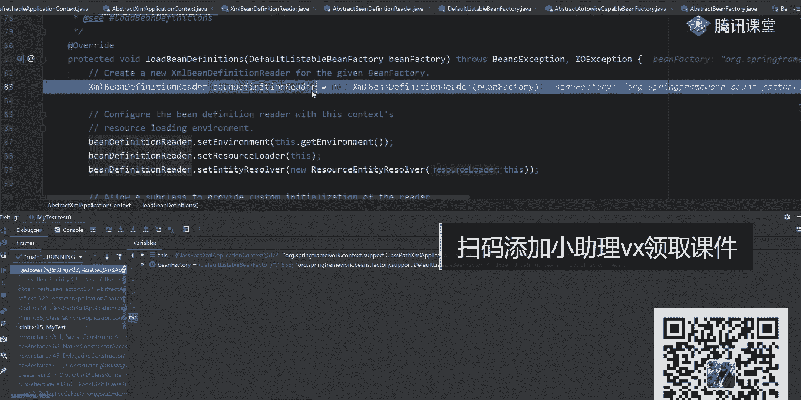

我说这东西好像似曾相识，哪来着，这画图的时候，我是画的东西叫什么叫bgmajor，是不是这样一个内涵，真的吗，我说了，你在进行，你在进行读取的时候，因为你可以有多种方式。

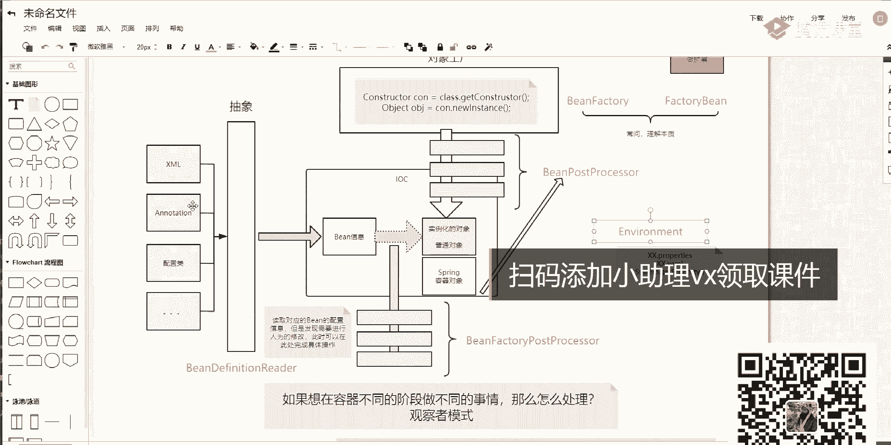

多种方式，所以这一定会有一个抽象接口，而刚刚给大家看那个china是个啥，是不是相当于只是具体的一个子类实现，就是具体一个子类实现，当我有了这个接口之后，我是不是可以去进行相关文件的一个读取工作了。

来这块能听懂，同学不知道，扣个一能听懂吗，好吧看一下这个问题吧，比较简单好吧，有这个read对象，细节我说了啊，细节不看了好吧，细节不看了，咱没那个时间，谢谢咱不看了好吧，但你要知道这些方法是干嘛的。

第二步再往下走，设置环境，环境有没有一定有吧，之前已经创建过了对吧，第二个the set result order是不是要加在我们当前这样一个资源类，但你别忘了之前我们已经处理过那个配置文件了。

所以把当前对象加载过来之后就ok了，这里面有那个配置文件，第二个叫set nt resuler是啥意思，也就是说你最终最终你读取过来的东西都是什么，叫nt吧，是不是实体类就这样一个东西。

resource and tiresullar，还是一些包装类好吧，一些包装类，我只知道这块东西都是为了用来处理我们对那些资源的东西就够了啊，最远些东西，这做完之后。

下一步叫dnit be definition vier，是不是该进行这些breader一些初始化的操作了，连续是reader。svida vidv。

这个very d我希望大家能够注意到它并不是一个没用的值，并不是唯一的值，为什么这么说，别忘了你在写配置文件的时候，插画文件的时候问一下有几种规范，或者说有几种格式，你知道吗，你每次写配置文件的时候。

最开始的时候上面是不是一定会有一些什么呢，叫d td或者x的sd是这样文件，这叫啥，dotment type definition，还有什么东西，小叉号flame，但是你什么是不是这样的一些文件。

所以这里面会做相关的一些验证和值得判断，来判断一下你当前文件我应该用什么样的方式来进行一个解析，这只是说把它设置成除了我要进行一个解析了，一会儿在后面的时候会看到n多种标志位，比如说你用x i d好吧。

或者用ppt d，用这样的一个方式，一直不知道在干啥的，不知道干啥的，你想一下，你在读取这些配置文件的时候，他为什么能认识这些标签，他怎么认识这些病呢，他怎么认识的，这边有一堆s3 s一怎么进。

你等下看一下里面一定定义的相关的一些对象属性值吧，有这些属性值之后是不是有病变，完之后有descriptions import aleras beans这些名字啊。

我是按照这个名字进行整体配置文件的一个匹配，那这个时候我就把它读过来了，我进行验证，对不对，如果不进行验证，那不就完蛋了吗，你就完蛋了吗，好在这儿大家一定要注意了，大家注意了啊。

这这块的一个平时信息好吧，有它之后到这步了，叫漏的顶demon，是不是该进行整体的一个加载了，通过这个read对象，我要去读取我们的唱法文件啊。

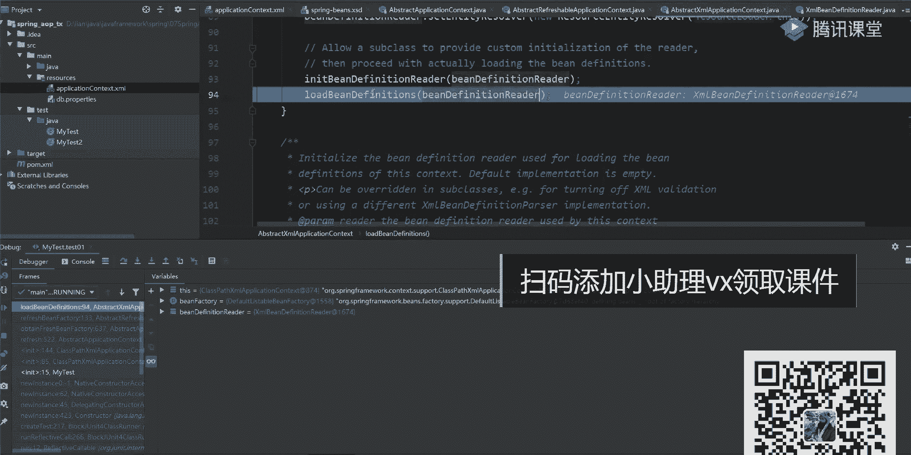

就是我们对应的一个插板文件，然后点进去之后一样来看，叫get configure resource，比如说了一读到我们这样一个空，如果不等于空，走下面如果等于空的话，是获取我们的。

这是读到我们的oecontact的插画文件，读完之后叫rever，点load deadli，是不是该进行一个下载的，点进去往下走，往下走往下走，你看这方法了吗，诶老师，我之前好像见过这个方法。

有没有见过刚刚在看的时候，是不是有个这样的名字叫load being definitions，大注意了，他们的配置参数是不一样的，好配置参数是不一样的，或者说参数类型不一样的，一个是result的一类。

一个是string类啊，一个是string，它们的参数类型不一样，再点进去，这有东西漏了吧，还再往下点，写完之后这样开thresearch loader，然后呢一步一步开始进行整体的一个解析。

截到这儿之后还是一样，先获取我们当前的一个配置，配置成之后，咱low的bedepennition又到这儿了吧，是不是又看到这个名字了，所以很多同学看到这的时候很懵，诶。

老师我怎么看到好多这样相同名字的方法，不重要不重要好吧，你知道他都是为了进行这些xml文件的一个解析就够了，上面文件解析就行了，再往上点，选完之后往下走，往下走，又看到了吧，叫low的bedeton。

这是卡吧，再往上点logo吧，这就再给他加一个编码格式好吧，设置一下我们对应的编码，不管他走怎么连续啊，到这了吧，是不是有4t往上走，这都没到具体的解析的过程呢，到这一步之后开始解析了吧，是干嘛的。

是干嘛的，叫input stream，input stream是什么东西，是啥意思，它是一个外部文件，你要想把外部文件给读取过来，是不是要用到我们对应的i o流。

这一样也是用我们的io流来进行独立整体的一个处理的，把通过io流我们把文件的一些详细信息给读取进来，读过了之后，下一步人告诉我在干嘛在干嘛，这是一个非常非常关键的分数，叫什么呢，叫do漏的病。

definiti，我说过了，do是什么来着，都什么东西，在spring源码里面，你看到所有带do的方法都是什么，都是实际干活的方法，明白意思了，好实际干活的方法，所以你要看到当前这个方法里面去。

开始进来了吧，我们往回返啊，找一下往这边走走走走，来点进去，点到了吧，这创建一个document的吧，叫do load document，那这里面就是干嘛的，没我说了吧，我们这儿简单看一下好吧。

我再给大家详细看了这个the man的loader，看logo document又开始进行这样的一个加载，点完之后这样一个具体的时间内。

谁来知道dotment build gary构建我们当前这样一个到后面的一个工厂，有工厂之后叫在干嘛，是不是create dog们的builder创建这个对象，好吧，你知道了。

就是用来读取我们这个文档的，读完之后有一个price的一个方法，price是一个公共的方法，也有一堆的实现类，这些price是不是都叫道路price price，你再点到里面去之后，你就疯了。

这样代码看起来很难受很难受，为什么很难受，原因在于它就是为了把我们的配置文件都给找过来，把都给拿过来，拿过来之后我要把它封装成一个对象，因为你注意啊，我搜了插入文件，说白了它就是什么一系列的字符串。

明白吗，字符串spring是不认识这些字符串的，所以我要把这些字符串解析成对应的对象，有了对象之后，比如对象之后，我是不是就能对里面的东西进行一个配置了，是不是意思啊，这大家注意了，这大家注意了。

ok所以啊你可以一部分往这边点，我们这儿不点了，你知道这是干嘛的，就是为了解析我们当前这样一个配置文件啊，解决配置文件都过了过去了，结果了，看罚罚罚罚，这个过程比较麻烦，比较麻烦。

但是你要知道我们这没时间啊，不太浪费时间讲这些东西了，你知道是用来干嘛就行了，好干嘛就行了，这干嘛呢，是不是用来读取我们当前这样一个配置文件，当我把那些配置文件都解析完成之后。

这意味着我获取到一个document的一个对象，有了dota的这个对象之后，我能进行什么处理的，来找一下，这有吗，来找一下，找一下我们的dota有没，这能松吗，不能说是吧，有点尴尬。

就是你可以来进行战相关的一个搜索，看一下里面的一些呃道德的对象有多对象之后，我之后可以从道德道德对象里面直接来获取我们对的一个属性值了，就这块东西好吧，不用讲，大家没时间了。

ok这边走完在做完做完做完都返回来，做完做完之后，这有个get been fighter吧，那一样的判断等于空，如果不等于空的话，直接打过就完事了，所以这时候我是不是有了病工厂了啊。

同时这个病工厂里面注意这个病工厂里面有什么，是不是已经把我们对那些插板文件，插画文件已经解析到了，或者说他已经被封装成一个对象，一个什么对象叫dota的一个对象，有了dota的对象之后可以干嘛。

可以从里面获取我们对应的note，明白了吗，里面都是一个元素，一个元素的，我就可以来获取，no no no的好，来到这边为止，能听麦同学搞个扣个一看，听懂吗，所以你看到的工厂，你看到的工厂，注意了。

它不是一个简单的工厂，里面做了很多事情，这块是需要你们下去之后自己来详细了解一下，明白意思吧，我可是这部再来看这部，我说这个无所谓啊，里面也是一样，设置了一堆对象，这样就说过了吧。

设置东西你看叫ban expression reserver，ban的表达式的一个处理器对象啊，the standard ban expression reserver，并处理一些东西。

再来看第三个叫and property editor register，是不是我们当前这些属性的一个编辑器，也得把它给捉进去了，这注册完之后，下一步叫at be post processor。

终于看到这方法了吧，这干嘛啊，我现在开始往我们当前这个bin finder里面注入啥玩意儿。

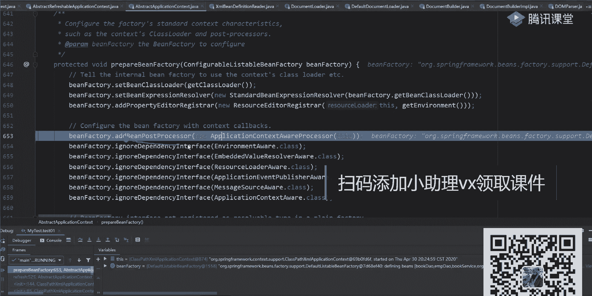

being post processor吧，哪来的，看这个图是不是该注意的东西了。

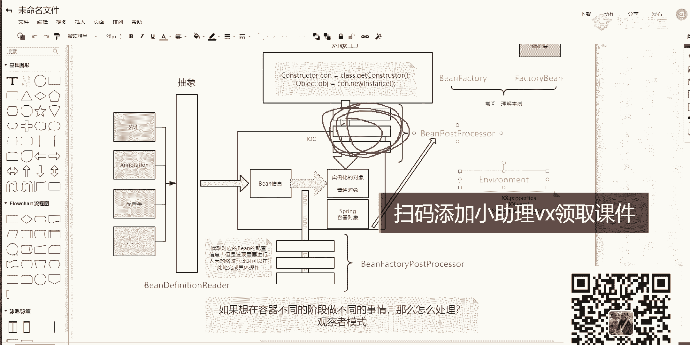

后面还有很多，后面还有很多，我们这儿只讲，只是看看这个步骤，再往下看，叫nore the interface，之前是不是见过了，在刚开始创建对象的时候。

发现创建对象的时候是不是有对应的那个已经有三个接口了，这时候加入了三个派，叫register reserve definity result，你说有这样一些依赖好吧。

再加一个at be post processor，两个了吧，注意啊，这一个这一个是不是两个了，一会儿这些东西都是要进行执行的，千万不要小看他们好吧。

再来看怕的东西叫being father contents being，判断一下你到底是否有这样的一个并列项目的lotime where，你这样去想刘德华做什么事，没有德华做什么事。

就这里面啊就是一些基本属性值的一个判断，请问水平判断啊，这个一步一步往那边走就可以了啊，这里面有什么有什么作用，你可能现在还不理解不理解，还是那句话，你先扔一边，先扔一边好吧，那我们这儿直接跳过去了。

直接跳过去了，看到这块我不带，你必须行上看了，你知道这只是往里边说的一些对象，创建一些对象，什么时候用，一会再聊啊，一会再聊来，现在能听完，同学考科目一，你在这跟不上啊，能听懂吗，章子怡不要刷屏好吧。

不要刷屏了，这我觉得应该没问题吧，没录上啊，这做完之后这东西啊，下一步重复看，你把每一行代码都第八代才行啊，第八代行到下一步叫post processor，being ter，终于到这块了。

终于到这块了，叫post processor，并发掘，这干嘛来着，这方案我说过了，他是为了留给我们当前此人来进行扩展的，所以你往里边看的话，什么东西都没有，什么都没有，是不是空的，空的话。

我们这就不看了吧，无所谓了，对不对啊，往下走，走到这之后叫invoke b factory，post processor是干嘛的，这个步骤很简单。

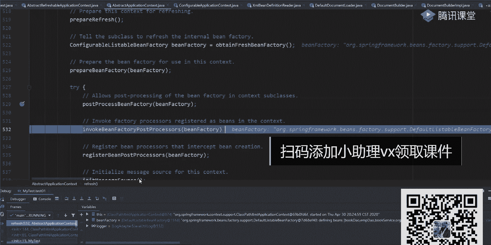

回到这张图里面，我说了，现在并工厂也有了病，工厂有了之后，按道理说我们应该正常的话是怎么走，怎么走，是不是该创建我们这个时间化对象了，说实话的时候，我们刚才已经看好了。

我刚刚在那个prepare prepare方法的时候，是不是已经往里边设置了两个b post processor了，但是注意了，还没走到这个环节，还没走，这在执行这个环节之前，还要注执行一些什么呢。

叫并factory post processor，有这样一些东西，有这样一个东西是干嘛的，这是对我们的兵工厂是不是可以做一些扩展，也就是说你读过来读过来这些配置文件了。

我可以对这些配置文件的一些配置信息做相应的一些修改，好做参考，接修改，k老师能不能把屏幕设成白色，虽然效果了白色更亮一点。

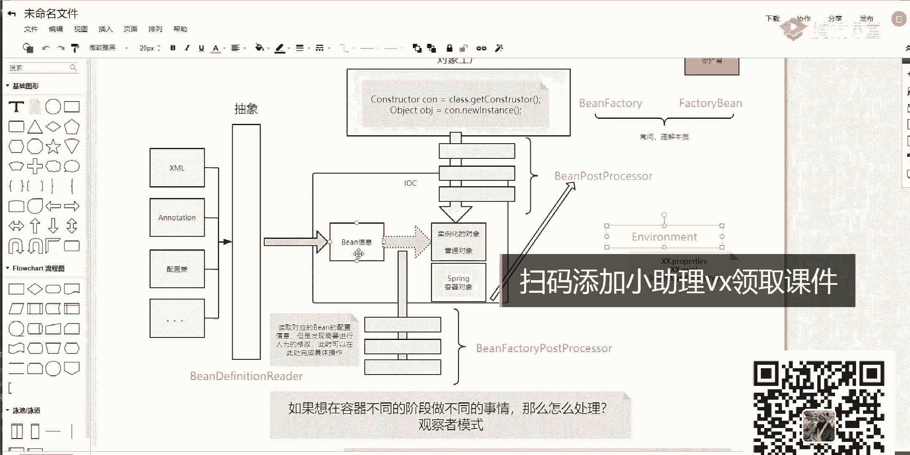

白色更搭一点，所以把它改成黑色，好吧，呃勉勉勉强听一下，ok，稍作完之后把这个方法呢我说一下，这个方法是一个非常非常重要的方法，而且也是一个非常非常关键的方法，这个方案里面到底做什么事，叫invoke。

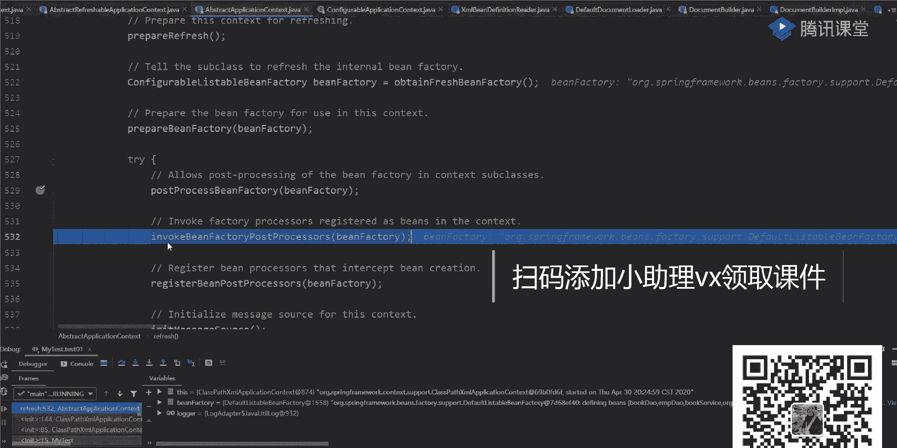

是执行的意思，还有个叫bin faitpost processor，这一块就是我们这儿画的这一系列的一个步骤吧。

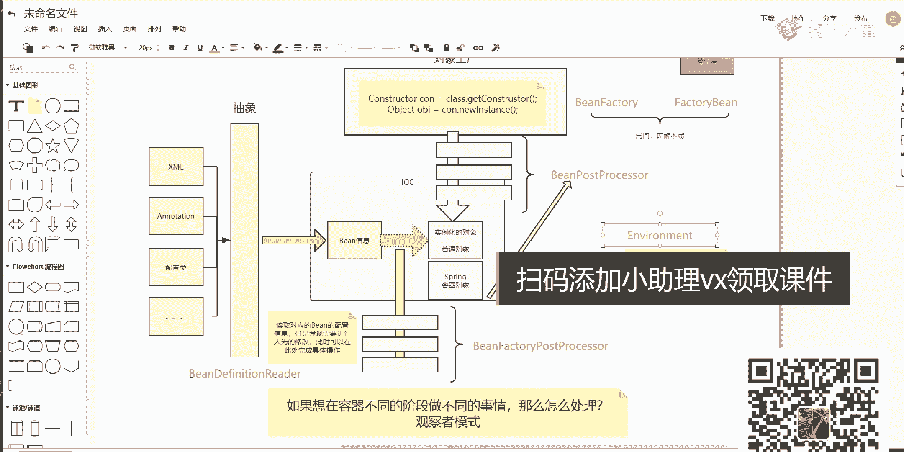

是不是这块东西这里面逻辑看起来是比较麻烦的，但是别瞎看也别慌，没大家想的那么难，没大家想的那么难，怎么看呢，点进去瞅一眼，这里面下面只是一些基本的判断，最核心的步骤是在哪呢。

在invoke并factory post processor里面去，第一个叫什么呢，叫get看这个方法叫get been factory post processor，是不是这样的方法，你点开看一下。

计算走没有东西吗，没有吧，说明东西是等于空了吧，等于空，不在意了，第二个把并翻译给发出去了，放完之后该执行当前这个invoke的一个方法了，在invoke方法里面。

很多同学其实看到这个方法的时候就疯掉了，为什么这么说，因为这个方法非常非常多，从55行开始，一直到187行啊，而且这段代码在看的时候，你会发现它有很多很多重复的代码，很多人看重播代码之后干蒙了啊。

这干嘛呢，这是这块东西，鼠标同步代码，然后来看这，先判断一堆东西，做一个键盘呢，这是一个外部的一个if吧，你把这衣服往下拖，它几乎哪来，哪知道到这块吧，衣服有else吧，是不是对应的一个else。

在这if和else里面，它两个地块做的逻辑其实差不多啊，其实差不多好吧，但是你要知道他干了什么事，你把这个事能看明白，这事就了了，这两个好吧，怎么做来，第一步先创建一个叫post behyset。

是啥意思啊，这个集合千万不要忽略它很重要，因为我们在进行创建的时候，你会发现里面有很多对应的一些处理的病，比如说被迫活在这这些这些对象对不对，如果你之前已经处理过了，我还需要再进行处理吗，听完问题啊。

一个ban fei啊，这样写的一个并finally post processor，它可能在整体的这个逻辑里面背什么呢，能匹配到三次，那我是不是只要在三次里面，只要第一次我执行了。

我后面两次再匹配到的时候，我还有没有必要进行执行了，有必要吗，因为这块说白了也是一堆if else的一个判断，对不对，是if else的判断，既然是衣服i判断，这意味着我一个类可能被匹配到多次，有三次。

那这个时候如果我第一次匹配到了，我就把这个类做了一个处理，那我第二次第三次我再匹配到之后，我还有没有必要再进行处理呢，你们觉得呢有必要吗，啊没有必要没有吧，是没有必要了，所以同学说了，这叫什么去虫标记。

这个标题说我已经处理过并对象有哪些，我把它放到这里面去，后面会有逻辑判断好吧，ok就这块再加上之后，第二步是一个义务判断错了。

如果你这个b factory是一个been definition registry这样一个对象啊，你就执行下面的逻辑啊，如果你这样不是的话，alt呢哎哪去了，找了半麻烦，在这块els的时候。

是不是执行下面的一个逻辑，是针下面留辑，所以你先从刚刚那个55行看到137行，如果你是上面那个类，我就执行这一块中间逻辑，如果不是的话，我就走下面这个逻辑，但是你发现了走下面这个逻辑的时候。

这个方法名字一样不一样，发明的一样比较一样啊，是不一样的，但是你传递的参数是不一样，明白了吗，传递的参数是不一样的，好传递参数是不一样的，ok来再来一个，我们看一下这个东西吧，第一个它是什么。

你如果看过这个bfx类型的话，你会发现它是这样一个对象，所以这时候能进来，进来之后一样的，第一步先做一个强转，先做个强转，强转完成之后创建两个集合，一个叫什么。

regular post processor，引导reject post processor，两个名字，别去看他，你看什么，看当前类的类型，看类型，这个集合里面放的类型，第一个类型叫什么。

叫be factory post processor，没问题吧，这不就是我们要处理的东西，第二个叫什么呢，叫being definition，registrate post processor。

是不是又涉及到这个b damage是丙单位，是啥来着，这是我们注入的一些病的一个对象吧，就这儿有两个对应的一个集合，有两个对应的一个集合，有了两个集合之后，你就可以做相关的一些处理的。

刚开始的时候一定都等于空的，没空之后，我这开始进行判断了，for循环里面是一个循环判断的过程，好判断一下你当前这个processor这个bfpx等于等于什么，等于空吧，日里面能进来吗。

这些东西啊是从外面传过来的，传过来之后说了等于空，所以这个方法是进不来的，你不管它好吧，这个东西叫current registration，processor。

叫ban definition reer pro，不在这吧，别忘了上面两个集合好吧，一个叫bbruary，一个叫bean definition，把两个名字给我去分开，你必须要把这两个名字区分开。

b3 就不用说了，b3 是啥的，是我们当前类的一些定义信息，当前类的一些定义信息，明白了吗，这是我们工厂类的一些提前处理的方法，这是我们类的定义信息的接触的方法，然后就不一样了，对吧，我去混了一谈。

往下退这一步的时候，这又创建这样一个集合对象，集合对象有了定对象之后，这儿有个名字叫been fire get be by for time，这干嘛的，他要来我们当前这个工厂里面去做一个匹配的。

根据名字去做匹配，是不是根据类型去做匹配，匹配什么，看一下当前类里面。

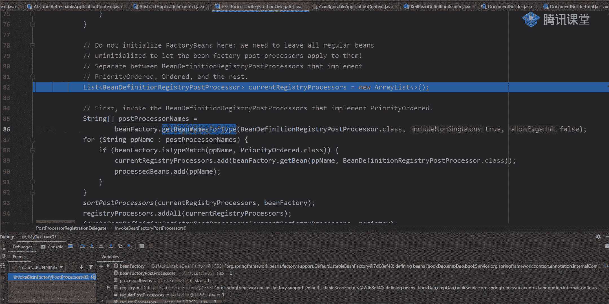