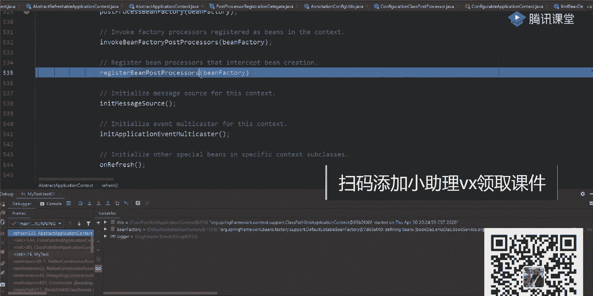

# 白嫖到马士兵教育价值23980的MCA架构师课程一次让你学够！ - P39：SPRING源码：07Spring的面试常见问题 - Java视频学堂 - BV1Hy4y1t7Bo

匹配到如果匹配到我就进行处理，如果匹配到我就不进行处理了，就这意思，所以往下走走走，走完之后你发现了里面有几个值，往上翻看一下里面的值啊，呃pro有几个一个吧。

一个叫internet configuration annotation processor，是不是这样一个数据类，这一类我给大家说一下，你根本压根儿找不到它，找不到它啊，它不是我们写好的一个类。

是through里面允许创建的一个内部类，它指向的是一个什么，是一个配置类，记住了是一个配置类，你现在看不到右边就看到了，一到了，怎么看到这个东西，怎么看的东西，有人知道在哪个类里面吗，有没有人知道啊。

有没有知道这个configuration，有人知道这个变声器制器在哪个类里面吗，没有啊，都没有了，唉都没有，我们都没有了，那么大家看就行了，不知道是吧，晚上看一会就知道了吗，往下走开始循环。

我们当前这样一类是不是开始穿过这个接口类之后，他说了叫is type match，意思开放，那是干嘛，是否匹配，就是说你有这样一个类之后，我要对你进行对应的一个映射，实现有一段时间之后。

我要判断一下当前这个类到底是否记住啊，到底是否是实现了叫pay a pretty order的一个接口，这啥意思啊，有一个类啊，找一下叫叫什么来着，叫a我忘了我忘了叫lp有跳蚤l o p啊是吧。

有为什么有跳舞来都记得，我忘了那个内叫啥了，看一下，就这里往下看，叫annotation configure，your toos，是不是这样的东西，类在当前这个类里面，你找一下干嘛。

都考验着是不是叫org three four contest，annotation，internal configuration，annotation processor，你穿过a类是不是类什么问题吧。

是不是类这个类，它在进行指向的时候，你可以来看一下wifi，它匹配到是哪个类，哪个类，看见了吗，叫configuration，然后呢，class post processor是不是这样的类。

所以你刚刚看起来的时候，好像我找的是这个类，但其实是哪个是configuration，那那那去吧，那个名字我记住了，combination class post processor。

实际上处理的是这一类，所以我要判断一下这个类它到底是否具备了preparty那样一个接口，如果是的话，意味着我能够进行处理的，如果不是的话，我就不能处理明白意思吗。

而且刚刚那个这个邮票里面它封装了很多啊，所以有时候同学老师我怎么找到这个类啊，你没找对类，第一个是这个名字来翻，是不是这样的名字，看到吗，你是这样的名字，你看这个名字了吗。

这个名字如果你去spring包里面去找的话，我告诉你你一样可以找到，这样找不到好的，就定义了一些静态变量，这些静态变量下面的时候会告诉你我到底匹配的是哪些类啊，这是不是有往下翻，如果是他的话。

匹配到这个类，如果是他的话，匹配到这个类，如果是他的话，匹配到这个类，是不是下面有对应一些类了，这些类都是都是什么叫being post processor，好。

都是这些being post processor，来这块能听懂吗，果然小孩很枯燥，废话原版人都不枯燥吗，你看别人想的这块逻辑都不枯燥，对不对，你要知道在哪儿找的好吧，你要知道在哪找吗，如果你找不到的话。

很多同学你看到这块时候直接大懵了，老师这东西哪来的，我怎么样把它找这个类啊，你根本不知道怎么来的，o好了，当你把这个类取出来之后，你要判断了吧，判断一下它是否实现两个接口，对不对，这个怎么判断呀。

很简单很简单，你找到刚刚实现好的这个类，刚是不是通过它来形容这一类的，你打开这个类的类图啊，其实不用打开了，这儿也有了，看这块，看这块有这个接口吗，它是不是实现这个接口，它如果实现了这样一个接口之后。

你告诉我，我这样在做类型匹配的时候，能不能匹配上，能匹配上来选择同学扣一分，同学看二能比得上吗，可以吧，所以这时候我就能够进来了，听到了吗，这就进来了，进来之后我把它加进来，下面是把它加进去。

加完之后我把它加到那个处理过的里面，就把加那个pose of process病死，比如说我已经处理完成了，我已处理完成了，做完之后这个东西大家走是不是该shot了，好排下序。

然后呢就把这个注册里面加一个对象，然后开始进行具体执行，完了之后把它给清空，这样切完之后注意了，从这块开始，从这块开始，这是一个整体的逻辑，这是一个整体的逻辑啊，这儿执行完之后往下看，第二块。

看这块这块你是又蒙了，老师诶，这段代码跟我上面这段代码好像看起来差不太多呀，我把全屏打开啊，唉你告诉我这个代码跟着代码看起来差别大吗，不大吧，是不是上面的时候告诉你说我要匹配。

是不是being definition rejection，possible or，第二个是告诉你说我要进行验证，验证一下你是不是病，但分离散热沾水泡缩在这吧，这两个问题看起来是一模一样的。

是不是一模一样的，所以这样又要进行一个判断，这样判断完了之后没完没完，这个名字其实还是同一个名字，同一个名字，这儿做完之后，这要进行又一个match了，那是啥说了。

如果你这个post process be不包含这个东西，同时它能匹配到什么呢，叫order这个接口，那么我要进行下面处理的，如果不能，我是不是前面处理多少，所以大家发现了，为什么很多同学看起来比较乱。

原因就在于这两块东西是差不多的啊，但是你看这个的接口，这两个接口是不一样，明白了吗，两件不一样，那你告诉我，我这儿已经处理完成了，我下面这还用处理吗，这就不用处理了，你看左下这个逻辑来走一下。

走下走下走下还能进来吗，是进不来啊，进不来，我就直接跨过去了吗，那这样东西就没啥可说的了，那最后还有一个什么，还有一个翻着，你还有三个人发了什么意思啊，翻译什么意思啊，一样的来看。

又是一个been father，该能用病死，that for all time吧，好告诉你说我是否包含这些东西，也就是说我们现在在判断这些病，但是cost processor的时候。

我先判断一下你是否有一个什么呢，property order这个接口实现，如果是的话，我先处理，如果他没有的话，我判断一下你是否实现了一个order的接口，如果是的话，ok我处理，如果不是的话。

我再进行下面的一个处理逻辑，所以我说过了，这块整体的处理逻辑都是差不多的，你看起来的时候别晕，看的时候别晕，懂我意思吧啊这大家要注意了，当这些东西都执行完成之后，我要执行invoke。

这些emoe就是具体的一个处理过程去处理过程好吧，那下面这个这块呢一样的，你往下翻，刚刚是什么来着，注意啊，刚刚你取的时候转成什么了，叫being definition register，这样的对象。

下面在转的时候转成啥了，转成并factory pos pos是吧，比如说把你一个ban工厂，in factory要进行n多次的一个判断，看一下它到底能匹配到几个子类，几个此类如果在平面上进行处理。

平行不上，我就不进行处理了，那下面这块处理逻辑一样不一样一样也是是否包含，然后呢是优先级的一个排序，然后order这个排序再往下的话就没有排序的一个东西，又拍一东西，所以这块都处理完成之后，一直往下走。

就能把这些完好，所以才说了，老师这个逻辑看起来很麻烦，确实很麻烦，原因在于它里面有很多重复的一个代码，重复的一个代码好，既然是重复代码的话，好吧，你要是你清楚整体的一个处理器到底干了点啥，千万别蒙。

但是最核心的点是什么是啥，这只是整体这个逻辑有逻辑之后，下一周看了看，看完了这儿有个东西叫invoke，什么东西，invoke就是具体执行了，下面也是invoke进行具体执行啊。

所以当你把这块东西你都执行完成之后，意味着什么，意味着我这张图里面这一块的环节我已经执行完毕了。

听到了吗，这已经执行完毕了，这已经执行完毕了，ok我知道很多同学已经听懵了，能给你听懵了啊，但是我希望下去之后，你现在好好看一下李老师这个重复代码，为什么我不能把它抽象出来。

想得非常非常对，是啊，为什么不能抽象，我说的是大体的逻辑是一样的，但是你看一下具体的处理细节是一样的吗，不一样啊，不一样啊，这些东西本来就已经是一个方法了，你还能再进行抽象吗，没有了，明白意思吧。

好在这他应该注意了，ok当你把这个方法也进行完毕之后，已经完毕之后，我还我还打打打打点告诉你说什么意思啊，我刚刚那些been fport在哪，我已经执行完毕了，我执行完毕了。

到目前为止能凑合跟上的同学扣个一，凑合干啥，不要求你全跟上，我告诉你，我这给你讲完了，你立马就听懂了，你们也太看不起spring了，别想了，立马就立马能听懂，这不现实是不是现实好吧，还是一样，先捋思路。

我这也是为了带你去验证我刚刚说的那个思路，这个思路ok你要争一口气，看你在怀疑我们这些学习能力，好好，我错了，我错了，我对不起，你好吧，我没怀疑你们，你们都能登上好吧，这块也一样吧，这就是一个逻辑判断。

我接下来讲吧，当你把这块逻辑判断执行完成之后，ok往下走就完事了啊，这块东西刚刚干嘛来着，处理的是been factory post processor，下一步该干嘛了。

该been post processor了。

哇，两个环节不要给它涂上，刚刚是直到这块吧，现在不要跟这块了。

把这一块也执行完毕之后，就可以进行整体对象的一个实例化及对象实例化，点击看一下吧，连续这块有一样的叫post processor，register than a dog，register。

b post processor，再慢慢走，里面就是往里面创建了一些对象，是不是告诉你说你判断一下当前这个类是否属于并put protest，往里面进行一系列的一个术语，你发现了。

这是不是也有类似的东西，什么power the order吧，是不是有order，这个order连读是干嘛的呀，有人告诉我，谁能告诉我，这out了干嘛的，奥尔有用吗，排序排序有用吗。

我相信很多同学之前一定写过这样的一个主题，叫叫什么叫at order，是不是写过里面是不是可以写一个整数，是不是用这东西，所以他俩一定要执行对应的一个顺序好，执行了一个对应的一个顺序。

那这块逻辑理来说也是差不多的，也差不多的，只不过刚刚执行的是什么，是being fury post processor，现在是什么，是b好吧，post processor，把这两个东西过分清楚了。

还是一样，回到这张图里面，你记住了，先执行being fa，再执行being host，放在这两个东西是不一样的。

他先执行，他后执行好吧，分别是在两个不同的方法里面去执行的，只不过我在你看的时候没带你们看具体的一个处理逻辑，好怕你的猫懂我意思吧好吧，那我们这儿不再往里边挨着点了啊，你知道大腿一出游就可以了啊。

走走走走，走完他这是一个循环啊，循环很多，哎呀看到了，我找一下s上的，哪去了，reflash，找一下我的方法，start reflash，当时没能创立方案里面去了抬走，所以你记住了，第一步。

第一步是执行的是been factory post processor，第二个是being post processor，把两个东西给分清楚了，把两个分清楚了好吧，这一块也执行完成之后。

已经奖走100人了，我估计这是一个劝退课哦，估计这是个劝退课呃，这给大家说一下啊，你们别一听不懂我就走了，一听不懂我就走了，你想一件事，你随便写的东西你就都懂了，你懂了之后，市场上的人都懂了。

你凭什么拿25为三，十，35为40，这样你只要懂点别人不懂的东西，你是不是才能够达到高薪工作，你随便学点东西你都懂了，这有什么价值啊，没意义好吧，所以你要提高你的核心竞争力，哪怕你现在听不懂，没关系。

你先听个响儿之后，如果你有兴趣或有心情再重新看的时候继续说啊，好像原来李老师讲过这个东西，我好像有个印象，我大致知道一个思路是什么样子的，这也比你重新听要好很多，懂我意思吧，好吧行了。

老长时间我们接着聊好吧，再往下一方法叫什么叫in it message source，这个我说过了，他是干嘛的，知道吧啊，用来进行国际化的一些配置啊，进行国际化的一些配置啊，这样不看了没啥意思。

连之后你看一下这些国际化的配置，我消息一些配置不用管它，ok再看第三个什么叫objection event，没cast就打完了，这是用来指示我们对那个多波多波器或者那个广播器啊。

往里面设置我们具体的一些事件的一些事件的啊，这有个东西你有一个simple什么东西出现这个对象对象的时候，你给他有一个set b啊，这块你还可以怎么看，还可以看一下我们当前这一类的一个负累吧。

找一下复联，复联里面有多方法吗，网上没有什么，没有啊，那就算了，就它里面设置我们当前这样一个艾特一个b对象，往里面时候开始设置我们具体的一个对象值了好吧，这就注意了，这最终的目的是为了什么。

就是为了设置一个广播器，有当前这个广播器之后，方便我在后续的时候可以往里面添加一系列的事件，一切的一个事件好吧，什么意思呢，这东西叫application，疑问的music cast。

是不是告诉你我有这样一个对象了，有对象之后，我开始里面什么叫register singleton，是不是开始往里面注册我们这样一些单位对象了，就是一个具体的一个值，有了这个东西之后。

你以后再往里面设置事件的时候，就可以直接来进行一个编写，就来进行一个编写了，所以这也是一样，先注册一个单位对象，但调完了之后搞定了这个unreflesh，on relash，因为啥也没有。

我说老师一个空的留给子进行实现的，再来看叫register listener吧，是不是终于到这个listener这个环节了，连续看listen，那他是怎么做的。

开始循环叫get up listeners，先获取一下我们这listener到底有多少个一行，有没有没有啊，那没有的话，我要循环法肯定是等空了，再来看这又来了。

这啥玩意儿叫get big name for time这个方法，你们现在已经很熟了吧，刚刚在看的时候是不是很熟了，这干嘛呢，这东西谁能告诉我是不是去我们当前这个兵工厂里面，干嘛类型查找吧。

看一下有哪些东西符合我们的obliation listener，所以你们还有一步，这能匹配到对应的一些结构影响，是不是有一个string值能匹配到吗，给大家看一下吧，找一下。

this is my bilives，看这块这匹配到当前这个值了吗，这个值没有吧，没办法，这也进不去，进不去之后，这来了叫this early application even，还记得这玩意儿吗。

你们能记得，哪用这东西的，你们能记得，有印象吗，哪有印象，我当时在你们看当前那个方法的时候，运回来方法的时候按照，所以为什么让你去看这东西啊，看这块儿看这块儿记得吗，我是踩到过了，这是不是一个空的。

那这块是不是跟我们后面这块儿就对上了，判断一下这个值是不是等于空，如果等于空的话，然后呢做什么事，如果不等于空的话，我做什么事，是不是这意思对吧，这样虽然等于空头上有个东西啊。

early event to process，不等于空，不在于空的时候，我还要进行循环遍历，遍历的时候一直往下走，是不是也进不去，因为现在我们没有任何的一个事件，没有任何一个事件，所以里面什么都没有。

但如果你在看spacc或者spot源码的时候，你能看到很多对应的一个环节，很多对应的环节里面都有一些事件网络机制啊，你知道这是注册我们的监听器就可以了，好来到这儿能听明白，同学扣个一，能看懂吧。

美照片美照片好不好，来再来看看下面再干嘛啊，它finish b fy，你出来a吗，是啥意思，是不是该进行具体实例化了，那就一直问我老师什么时候进行实例化呀，怎么进行实例化呀，到这儿就来了。

这里面的逻辑也很复杂也很复杂，来往里边点点一下，填完之后开始告诉老师，告诉你说看他判断一下你当前并犯罪里面是否包含这样一个the啊，是否包含连续进去，大家看是否是一个内嵌的一个值的处理器啊，这也进不去。

再来看叫be factor get being names for time，又看看了吧，叫load time where while，这样class有没有，是不是也是一堆的一些循环，判断好。

它也进不去，进不去之后一直往下走走走，走到这一步的时候，这是我们对应的一个核心，这是我们对的一个核心，这还有啥叫pray neural nesingleton，是不是告诉你说。

我要进行所有的非懒加载的那些单例对象的一个什么实例化了吧，所以从这儿开始进行整体的一个实例化，上海你实际化什么实体化点进去，这就麻烦了好吧，这就麻烦了，从这开始就比较复杂了。

但最终我会带你们看到反射内部，看到反射，你知道哦，原来是这么回事，原来这么回事好吧，那往下走，第一个也是漏洞判断，不管他往下走，第二步创建一个粒子集合，原创是什么，叫并在分析成内部这儿有一个时期。

这个时期是啥，这个时期代表的是我们现在你需要创建的这些对象到底有多少个，是不是这么多东西，这是哪来的这东西啊，就是我们之前在我们的java代码里面，我写这个不到e m p t e m。

然后service book service有这些东西吗，是不是这三个类，同时我在我的配置文件里面，我是不是写了一堆，比如说被对象找一下，现在dos有没有这a b c comic。

有没有transider manager，有没有，是不是就是我们这些b类啊，这都有啊，都能被读取道，都能够读取到，ok连续这点完之后再往下走，下一步再开始进行这些病对象的一个循环了吧。

啊是不是进行循环循环的时候，我要判断一下说这些对象到底是否已经什么实体化了，如果已经实例化了，那很好，我是不是拿过来直接就行了，如果没有实例化的话，我是不是要对它进行一个实例化，这怎么实例化了呀。

往上看，这有一个非常关键的一个判断，叫判断一下它首先不是抽象的，首先它是单利的，其实它不是懒加载的，是不是有三个对应的条件，这三个条件能看的同学来扣个一，能看懂吧好吧，然后这又多了一个逻辑判断什么呢。

叫is factory，并看到这个方法了吗，黑着说，老师你给我讲一下那个那个什么factor being和been factory吧，这有问道吗，点的方法看一下判断这个病到底是不是我们的艾滋病。

如果是的话，是不是有return一个判断连续，如果是的话，我是不是调我们当前这个犯病的一个方法就行了，是不是get object，如果不是的话，我是不是就按照常规的方式进行一个处理，这是不是有判断了。

那我们自己定义的这些实体类，大家想一下，并不是fib吗，所以这里面这边能进去吗，进不去吧，这里面都进不去，好吧，都进不去，而且你在这儿的时候能看到一个东西，什么东西。

有没有同学有没有同学见过这样的名称是at一个类，有没有人见过吗，你们有没有见过你爱的看到一个类，啊没有啊，如果你用的比较多的同学应该是见过的，看着它不是and的意思好吧。

它不是and的意思是用来获取我们当前这些单并对象的时候，它前面会加一个at的标签来进行获取的，faker并不是bin fak 3倍病好吧，这样大家要注意了，这里大家要大家要注意好吧。

内部类是dollar，不是与内部类是dollar，叫对叫取地址符啊，一看这些东西啊，都用过，用过你就知道了，是从这里是不能取到，就能看到这个东西对吧，这个原版里面都有验证，都有验证好吧。

我们刚刚是取到的，取不到怎么办，是不是到get be了，它变的时候一样，我要进行整体的一个获取了，他或者有个东西叫do get be，开放了吗，我说过了度是干嘛的，都是实际干活的一个方法。

再连续人家都说了，第一个缴获取一下我们当前这个病的名称是不是叫古董，学完之后获取下当前的一个是否是一个单例吧，来咱慢慢走，这是因为我们之前没做过，所以里面一定获取不到，如果它不等于空。

并且参数等于空的话，直接下载逻辑，如果他这块判断不过的话，到这块了，是不是当l怎么了，elc也一样，先获取我们的负的工程，如果获取不到的话，往下面走，具体的一个逻辑反走的时候。

你最终要看到一个地方找一下，我就往下面看，还能干嘛，第二个跟他走，向他走，他说啥叫mark并as created，当你上面的逻辑如果都通不过的话，意味着什么，我现在要开始进行整体对象的一个创建了。

这开始创建对象了啊，所以我要制这样的一个标志，制完之后往下走，往下走拿走，第一个叫m bd点，get depends on，这干嘛的，有没有知道这码干嘛的，你知道吗，知道吧。

你在写我们对应的一个配置文件的时候，在后面是不是可以加对应的一个属性值叫depends，是不是可以指定我们当前bin的一个加载的一个顺序，是不是，当然我们并加了一个对应数据。

是不是需要我们对于一些对象的一个依赖，这是不是可以进行一个判断了，对吧，再往下走，如果这东西不等于空，我直接下载逻辑，如果等于空的话，是不是接着往下走，判断一下它是否是一个单位的，是向大家走走，哎呀呀。

过去了不好看，这块这有什么东西，这里面是不是传了一个匿名函数啊，然后等下试，然后等下试，这东西叫什么叫crazb啊，是不是从这儿开始，我要进行整体并的一个创建了，但是我也说过了，我也说过了。

这个create b的时候，它的方法前面并没有do，没有度意味着什么，他不是干活的，他不是干活的，谁是实际干活的，是不是应该有个方向，什么叫do create be，应该是吧，大胆去猜好吧，应该是吧。

正在来往上走，点进了一个直接直线，我们来往这点一下，聊这行好吧，聊这行，然后呢，我重新往这边走，重新重新重新启动一下，重新弄一下来，这小伙就刚刚跨过去了，走走。

他那是不是跳到我们这个病例方法里面去了对吧。

再create be，在create be这些方法里面去之后，下一步是不是又是一系列的一个逻辑判断是在里面，你要找了，找什么东西还挺好玩，看这个代码是什么关系吗，叫什么叫do create b。

多亏没干完了，注意啊，苏联语系的判断就玩不了了，玩不了，下一个自己看下来，自己看是吧，你让他看看这个吧，叫多亏的病，又看到度了吧，我说过了度数干嘛的，是不是实际干活了，你既然是实际干活的话。

意味着是不是应该在我们当前这个度方法里面，我要通过反射的方式来创建具体对象，这句话能听懂，同学来扣个一，就在那个方案里面，我是不是应该通过反射来说创建对象了，但中间有可能代码我这直接跨过去了。

但你要知道这是不是这样的逻辑，那我们这儿可以直接点到这块来讲下面它这块了吧，点开之后来往里边再点一步读点，在这里面的时候，看这第一步有个东西啊，being观察吧，就是变了一个包装类啊，变成一个包装类。

你不用管它啊，别管他往下走，往下走，拉倒走到这块之后，到这块吧，叫create bedience，诶，这啥玩意儿，我好像也不太懂也不太懂，但懂没关系，连续剧填完之后。

里面有个东西叫resolve been class，然后呢，md什么东西什么东西，你发现了，这里面好像没有看到我想要的东西啊，能看到吗，上面也是一系列的一个判断逻辑，你注意啊，作为一个框架。

你肯定是要有一个非常完整的一个判断逻辑的，比如这块判断什么东西，说been class is public，是告诉你说是不是public的啊，不是public的话，不允许是一些事情判断好吧。

三个头也是一系列才能判断，判断完成之后，最终你会找一个方法，这样这叫啥叫instance b吧，这啥玩意儿这啥玩意儿，来点进去看一下当天我们这个方法好吧，走了这块之后，走这块儿之后，我就直接点过来吧。

看着啊，我是真的点就行了，打到这里看看能不能调理好诶，没进来吗，这都没进来抓走啊，这k的b慢走慢走慢走慢走走，剪完之后走慢走，还没进来吗，不应该啊，那走啊，点进去，看到上面有个获取初始化的一个策略吧。

啊或者我们当前这个b边的一个对象，再拉走转换的对象，哎这怎么没看到这个方法呀，我直接直接直接直接装上看吧，直接从哪看啊，这是一个初始化病的一个对象，填写完之后，这有一个一系列的一个方法。

在什么里面还说了叫object sense，等于什么东西，说了accessible controler，什么都previlege这一系列的一个基本判断，判断完成之后再进行一些实际化，一些基本操作了。

让他点具体的时间内，咱们来找找一下我们当前这个处理过程，看这块能看这个代码吗，是什么代码，叫contract to use，是变量翻车了，这叫翻车吗。

大家看这边有个东西叫construct to use，这是个啥，是不是构造器，我们现在要进行整体实例化的时候，实例化的时候是要通过构造器来进行实例化，那坐这儿有什么东西叫class点，class。

struct是有它对吧，有它之后怎么做，叫b有tx点，instance class是把刚刚的构造器传过来，传过之后点进去里面又是一系列的复杂逻辑，什么叫reflection，有调点。

make senal允许它进行一个访问，如果允许完之后，你往下走，在这块的时候有问题，叫c t o r点，new instance是不是该进行我们整体这样一个直接化了。

new instance不用说了吧，这是哪一类的，把它看是哪一类，是不是ctrl的这类，那是不是意味着我通过我当前这个构造器来进行，整体对象的一个实例化，通过了，明白意思吗。

好这是不是我们整体对象的一个实例化，来这边能看明白吗，我是不是一步步点进来的，是不是通过我们当前的构造器来进行整体的一个实例化，实际完成之后，我就通过反射来进行实现，当然我之前啊。

我之前那天上课之前是给他写，然后代码那个反射是最基本的反射，最基本的反射，同学说老师那个代码不太严谨，确实是这样的，我们只是为了说明一个最基本的案例，这里面其实要包含一系列的一个判断逻辑。

有了这些判断逻辑之后，拍出去之后，我是不是就能够进行整体对象的一个反射了，完了完了之后我是不是生成了具体的类这块反射的东西，能看出来，同学给老师扣个一，能看懂吗。

