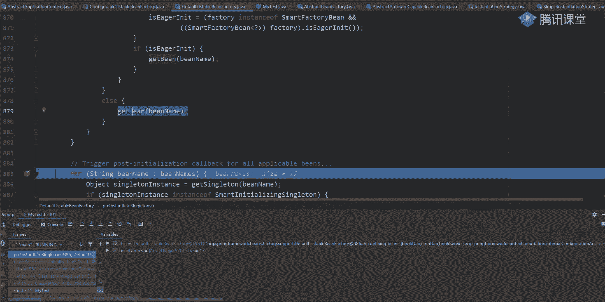
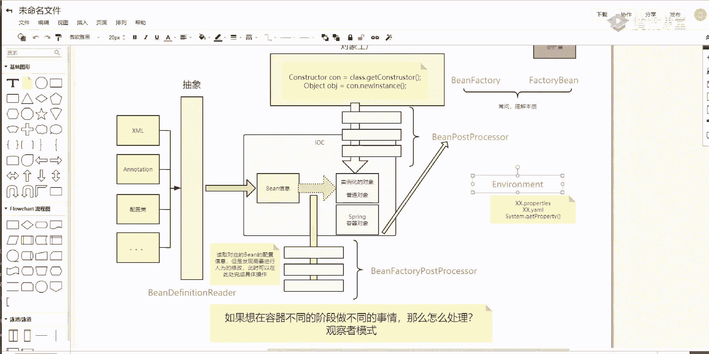
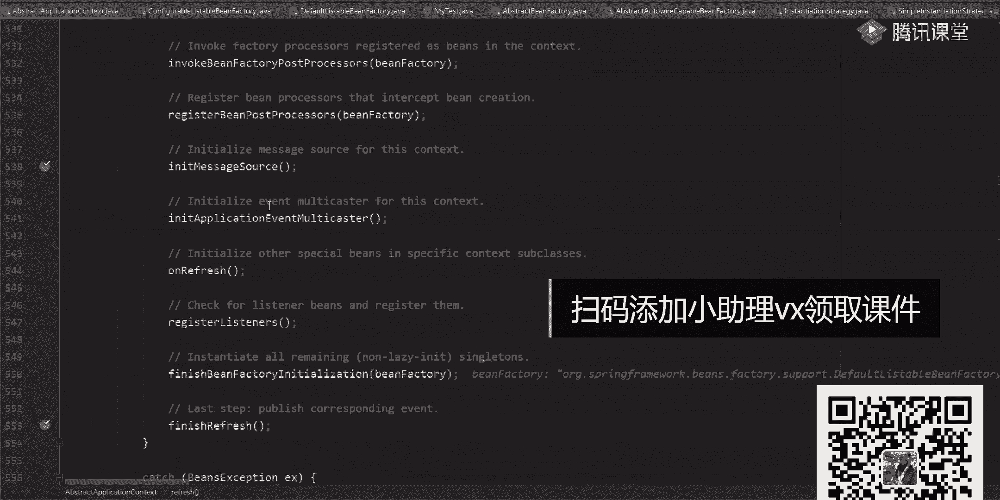
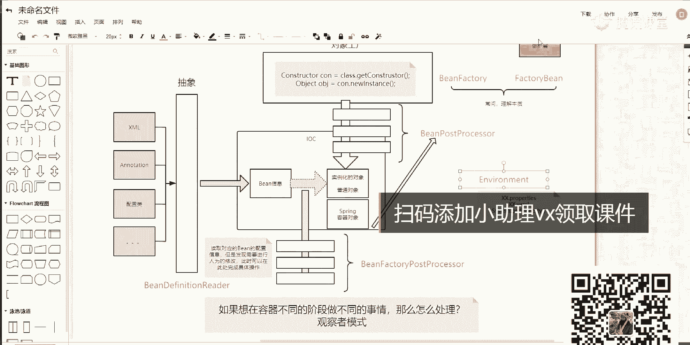
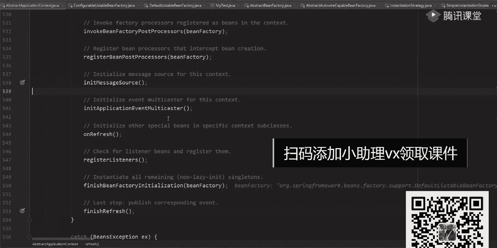
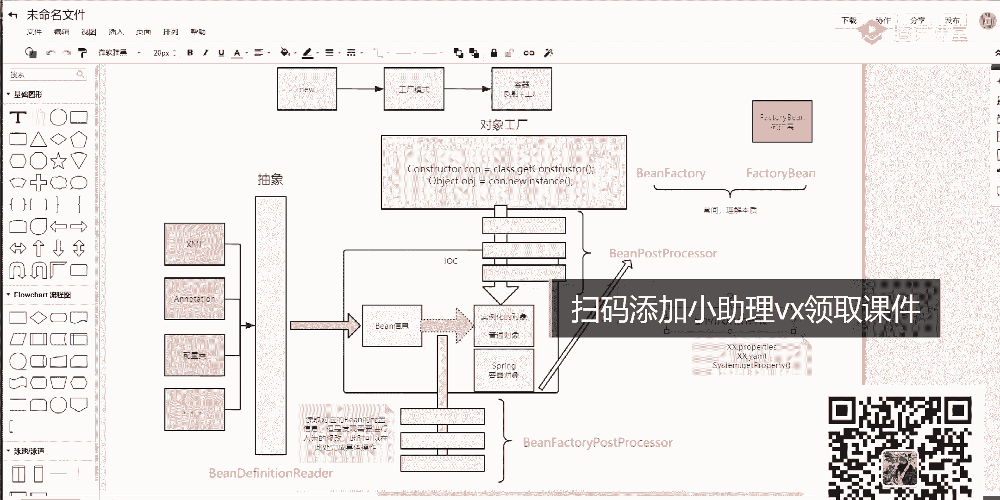
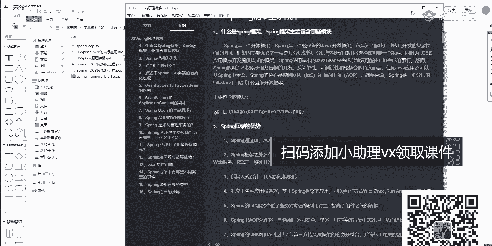
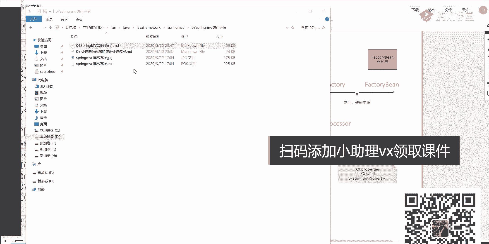
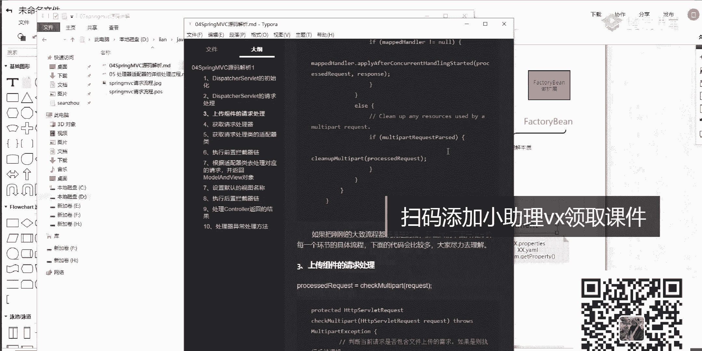
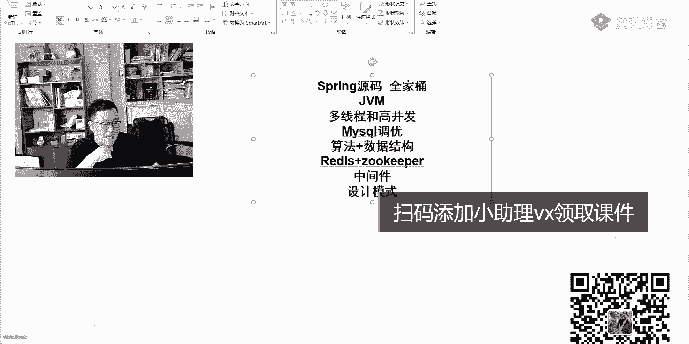

# 系列 2：P40：SPRING源码：08职业生涯 - Java视频学堂 - BV1Hy4y1t7Bo

设置了类型的判断了都有，但是你这是不是已经看到我们的反射，能看到反射了，有了反射，我能不能生成对象了，是不是能了，当我生成完全项之后，当然里面有n多个判断的逻辑，里面很多好，我们就不挨个看了。

这对象我都是要进行一个实例化的，所以东西比较多的那种，能走完吗，那走走走走走吧，走吧算了，对象太多了吧，我们直接返回到这，找一个算的，不是乐队，不是乐队啊，找新方法，哪去了，这。

刚刚是不看到这个方法里面去了，好实现，刚刚是不是通过看到我们这个gb这个这个方法了，就看ab往下点一来，你妈走走走走走吧啊走吧，因为里面对象比较多，他每次的时候都要进行实际的一个判断。

所以这块逻辑是比较复杂的，这麻烦吗，把大家都去找，嗯找一下，目标目标是，来往下走一下，再往下走嗯，看不到了吗，谁打个点啊，直接打到，哪去了好吧，重启一下，所以啊跟原版的时候可能会比较乱，比较懵。

但是别慌，但是别慌，刚刚是不是通过这个该在b方法里面听进去的，是通过改变方向里面进去的，进去之后有毒，该在b然后一系列的一些逻辑判断判断完成之后，把我们的病对象就反射成功了，反射成功之后。

你告诉我是不是意味着我这一块的逻辑就完成了是吧。

能能能看明白吗，这玩意就完成了，到我这块完成之后，意味着我已经具备了很多对应的一些单例对象了，我有了这些单对象之后，我之后取的时候，是不是就可以直接从当前对象里面取我们队的一个结果值啊，明白我意思吧。

好吧。

来这儿做完之后，下面也是一样，一系列的一些循环判断，判断完成之后，看大家说你到底是否是单列了，然后呢如果不是的话，什么叫after singleton distance。

是之后的时候再进行一些实际化操作啊，这也是一系列的一个逻辑判断，逻辑判断是做完之后最终跳到这个finish research方法里面去走完，它不是这个方法了，这些分析里面就很简单了，很简单。

你要做什么事，clear什么东西，然后呢初始化什么东西好吧，然后呢party是问是不是告诉你说我要进行一个呃事件的一个呃广播了，发布一个事件，复杂过完成之后再进行一些注册，就这块东西。

所以你把这段代码看完之后，这个最后一个清理环境的一个环节再往下走，有个reset computer catch，把所有的缓存给清空掉，大概经过完成之后，整个东西就执行完了，所以在刚刚这些方法里面。

这方法里面，这方法里面我说了啊，到东方代理a o p我们这儿没提，没讲到a o p如果讲的话，给我三四个小时之后给我们讲完，你讲清楚，把四条给讲清楚，但是时间肯定是咱们一个半小时给你讲完的。

或者两个小时给你讲完了，明白我意思吧，但是这里面我希望你能够了解几个核心的步骤，核心的步骤，什么核心步骤，看着啊，在我们当前这个reflesh这个方法里面，这个方法里面你想想看了这么多方法。

我也给你们画了这样一个图，这样一个图，你告诉我哪几个方法是最核心的。

那把就恶心了，我们一起框一下，首先第一个方法，这话抓不住很重要吧，只是为了通过获取我们当前什么，是不是那个工厂定工厂吧，所以这一步是非常非常重要的，这是第一步，大家都记住了，第一步好吧。

第二步还有谁还理方法，是不是这个方法比较重要，干嘛来着，用来执行我们对应的什么呢，叫b单腿cos coser，是不是原来一个数据逻辑这方表述了吧，第三个把这方get到这干嘛的。

这是我们的be post processor，是不是这块的一个逻辑了，是不是意思是这块东西好吧，这做完之后再往下看，还有什么方法，是不是在这一块了，这是我们完成整个实例化的一个环节，实例化的一个环节好。

因此你要想明白一件事，如果你要看这个refly方法的话，第一个第二个，第三个，第四个，这四个方法你是必须要能够看明白的，必须能看明白好吧，你看看第四个方法之后，中间都是些细枝末节，都是细枝末节。

所以把这些东西看明白啊，把这个看明白。

如果你还是找难理解的话，怎么办，来看一下我刚刚给他画这个图哪去了，这图里面是怎么做的，这里面有些被动的一些说明啊，这就说明，然后呢在右边这块我详细画一下，每个步骤里面做什么事，第一步叫资源定位。

虽然定位，第二步叫初始化的一个入口，第三步叫准备的一些基本工作好，第四个叫构建定factory的一个入口，是不是叫reflesh be fathy，第二步干嘛呢，就开始加载并对象，然后解析我们乘号文件。

乘号文件解析的一个入口或者盗墓对象，解析我们的长门配置文件构建，并在finition到完成之后，下面又是一系列一个出了金eb 5应该怎么做一个处理，出完成之后，下面就是一些分散的一些具体步骤。

明白我意思吗，好吧，下去之后你可以看一下这张图，这边的类对象，我东西写好了，方法都写好了啊，一样一步一步去捋这些东西，一定要去旅，你别指望说老师你讲一节课，我就能把这东西听懂，我告诉你，我办不到。

臣妾做不到，明白我意思吗啊，但是但是你听完这节课之后，这节课之后最起码这个图你应该是能接到，就是说我刚刚之前说这个图，说这个图我们刚刚不是验证过了，虽然那个验证的过程不是特别详细。

但是这个图有没有验证过来验证，能听明白，同学老师扣波一验证过了吗，验证过了吧，是不是就是这样一个逻辑，有了这个逻辑之后，你是不是只需要去抠我们对应的一个细节就可以了啊，但是你要知道整体的一个脉络。

有了整体的脉络之后，你再去看我们对应细节的时候就会好很多，会好很多啊，你说我老师从第一行开始往第一行，一行一行往下看，看，一会就懵了，你就疯了啊，比想象多一步一步沉下心来，踏踏实实去看你那个老师。

你看这个spring大概呃看了多长时间，昨天看完小说10年，其实你们用不了这么长时间，真的用不了这么长时间哦，没大家想象那么难，没大家想那么难啊，但是我再讲一点，我再讲一点啊，我再讲一点。

你们在看源码的时候，不要看到一个点你就放弃了，看到一个点你就放弃了，不要这样干，就好比你在大学或者呃高中的时候背单词一样，每次背单词都是从第一个字母叫abandon开始背齐的。

背到最后你还是只会一个abandon，这东西都不会是吧，第一个单词是把那个单词书里面我没记错的话，应该是吧，是这意思啊，至少学会了一个，不要这样不要这样啊，咬着牙去看啊，然后你在看的时候。

我告诉你怎么做，我告诉你怎么做，你别想着说这个大体的脉络图是不是有了，有了之后你就画一个，拿这个号再大也行，你拿拿那个s慢来就行，哪怕用最基本的最基本的那个画图工具也行，无所谓，不管是什么工具。

哪怕用笔写也是可以的，你去构建整体的一个思路图好吧，从哪个类跳哪个类，挑哪个方法应该怎么做处理好吧，你不把那个记下来，你把它记下来，当你记完一遍，你把整个事都理通了，你再去做学习的时候。

就会变得非常非常容易的明白了吗，就没大家想那么难了啊，那这个时候我我process on process on一个开源的一个一个不是开源，有免费的一个呃啊，在线的一个画图工具。

在线画图工具免费的话应该可以画几张图吧，应该是没记错，没记错的话啊，一定不要从每次从头开始掌握这样一个逻辑，这很重要，这很重要呃，不不交不交钱的话，应该是有九张图，还是其他出来的好吧。

那之前我跟大家说过了。

那个之前出过这样一个文档，这文章里面包含就是什么呢，基本上常问的一些spring的一些面试题这块都有讲到，都有给大家写一些呃，就是文字性的一些描述，这块都有啥都有呃，这个文档一会儿我发一下。

一会儿发一下，一会儿发一下好吧，呃给你们吧，无所谓好吧，反正我还一样啊，源码东西呃，下去之后一定要自己去跟，一定要自己去啃这个图，这个文档会给你们，但是我希望你们一定要去看。

别背了好吧，你现在在背埋，完蛋了，完蛋了，你背是互虎不住面试官的，为什么你们现在都去参加过面试，对不对，是都去参加过面试，你去参加过面试之后，我问一下现在在面试的时候还是说东一榔东一榔头，西一棒槌吗。

是这样的方式吗，不是了吧，面试官现在面试的时候是怎么面试的，或者你们在面试别人的时候，你们是怎面试别人的，根据项目由浅入深，我会纠正你一个点，一直往深了问，一直往深了问好吧，这时候有一个问题，什么问题。

如果你是背的话，你只能把你背的东西给说出来，往底层扣细节的时候，你就完蛋了，所以永远不要想着说老师我再去背别的东西，别讲这东西了，这事儿已经不存在了，这事已经不存在了啊，一定要去深入去理解这些东西。

不理解是不可以的，理解是不行的，一定要去理解这些细节，那我再问一个问题，为什么面试的时候要问源码，听到我的问题啊，为什么呃，面试要问源码，我说实话，咱们咱们说句良心话。

你们在面试的时候或者在课程工作中用源码用多了吗，学习能力功力深不深，我告诉我问一下，你们有几个人去扩展过spring，有几个人自己去定义过post processor，有几个定位。

这这这这些东西我不能说一个没有一个没有，可能就有点偏差了啊，但是不多，大肠里面可能会会会用的比较多一点，但是在中小企里面几乎没有，几乎没有啊，原因是啥，第一大家不清楚，不敢写啊，这是第一点。

第二点是你们不太精通对线细节不了解，所以你做完这件事情懂我意思吧啊但是面试的时候还是那句话，人太多了，你要提升你自己的一个核心竞争力，有了这些核心竞争力之后，能进力之后，你才能够把你想要的东西给拿出来。

不想要的薪资给要到，要不然的话凭什么要你不要别人啊，你比别人多长两个眼睛吗，多长两条腿吗，也没有吧，是不是这意思啊，这一定要注意了，一定要注意了好吧，所以啊这些也不是你们需要学习的好吧，这是为什么。

我之前在讲课的时候给大家说过，我在讲课的时候，在基础班的时候，我就把源码里都讲到了，不管是spring，包括像spring mvc的这些源码好，我都讲过了，之前也画过一系列的一些图四。

vc里面你是怎么一步步做的，从哪开始，进进进进的介绍一步步我是怎么样一个流程，这东西我都画过这个图，都画这个图，为什么给大家画这个图啊，然后c原版讲解可以可以给大家看一下。

这东西美里面都有详细的流程，包括一些注释都给大家写的，都给大家写到了，给大家写到了，为什么要想讲这些东西，啊为什么讲这些东西，原因是啥。

还是那句话，你还是一样，你现在在进行数据面试的时候，数据面试的时候出去面试的时候，你要知道考的是你的核心竞争力，你要把这些点都掌握到了，星空说，雷老师，你来做讲座，that spring。

你们讲的不好是吗，咱不好凑合着听，凑合听好吧，如果有啥问题的话，我们可以交流一下，ok，万箭穿心没关系，咱们那个基础班里面我都我都讲过这些东西，都讲这些东西了啊，咱们微信里面发一下吗，有那么贪心好吧。

别那么贪心，ok好了，这是我们对应的这些这些东西来，觉得这节课有收获的同学给老师客观六有收获吗，老师能加了3年级的对吧，我觉得你只要三星听完了，你看这个收获的，你看这个收获的好耶，有舒服了。

这话还是一样，跟大家说一下，这些东西其实都很关键，重的核心你要去学这些东西，那再问一个问题，你觉得除了spring之外，现在面试的时候还会有什么问题，或者面试的时候还会问啥，刚刚不是讲spring了。

你这还会问，你还会面面是啥，循环依赖，可以讲一下吗，循环依赖你看完源码之后，循环依赖怎么解决的，是不是一个是set，一个是一个是set方式注入，一个是高高区的方式进入，对不对，一个是可以解决的。

一个是不是可以解决的，那东西没啥可问的，你看原版里面它有三级缓存的方式，可以进行相关的一个处理，这东西你现在一看就是那东西是死的，它不会变的，它不会变的，明白吗，它不会变的好吧，那就来我们来说一件事。

那为什么我们要讲这些东西，来想一下我刚才讲的是什么spring源码，对不对，大家注意了，spring源码包含是什么，是全家桶的源码，你问问老师，我就会spring不够啊，就会spring不够。

你还需要啥，刚才说过了，这边误吧，是不需要必须必须要会的，是不要会了，ok再来看还是什么逻辑多线程和高并发，你出去之后你要说老师我不懂javg m里面的锁，我账号里面的锁，你别说面试了。

基本上大厂肯定过不了，不管你是社招还是一些别称都过不了，再往下看，还有什么东西，之前我讲过很多次mysql东西了，mysql我不知道有多少同学把那些东西给吸收完了，有多少同学掌握里面的一些精髓了。

应该怎么用，对不对啊，还有啥东西在想，还有啥东西还有吗，算法加数据结构，对不对，我看还有呢release加scher，对不对，再往下看，还有什么写数学线啥东西吧，能说老师设计合适。

设计模式这块东西其实是跟什么，是跟源码，你要了解到的就是你在看源码的时候，如果你设计模式比较轻松的话，是比较舒服的，是比较舒服的啊，是不是大概就这么多点啊，它是不合法的，我们放这个视频研发里面了啊。

就四门考的方式里面去了啊，包括一些对应的一些架构思想，同学老师现在要开始卖课了吗，对是这样的啊，直接告诉大家是这样的啊，原来是啥这东西我刚刚讲的那一块，刚刚我也给你们看。

我们对应的那个我给大家反复发生这些资料，这是在基础课程里面进行相关的一个讲解，相关的一个讲解啊，除了这个讲解之外，每一个点我们讲的都非常非常深，为什么要讲这些东西，原来在什么地方，原来原在什么地方。

我说老师你为什为什么每次都在卖课，你愿意在卖，是周老师也在卖课，然后所有人都在课，为什么这样，我不觉得我们是麦克好，给大家说一下我们在做的事情，什么是推销，我们对一个就是推广我们对应课程。

我们的课程是很有价值的，也希望大家能够经过通过这样的一个方式进行学习之后，你能获得比较高的一个进步，我问一下有多少同学现在是在30岁左右的女警，或者说快30岁了，或者说30多岁的年纪了。

有多少同学这样一个情况给老师扣个一有吗，很多吧我觉得很多这样的情况，为什么你们现在在找工作的时候会变得比较难，或者说不敢轻易找工作，之前我有很多同学说过。

我说你现在公司里面拿着25k拿到30k或者拿到更高的薪水，你现在敢出去面试吗，你在出去面试的时候，你能否拿到现在对应的一个薪水，有人敢保证能拿到吗，不一定吧，原因在什么地方。

就在于大家对于自己的一个知识体系这一块儿啊。

