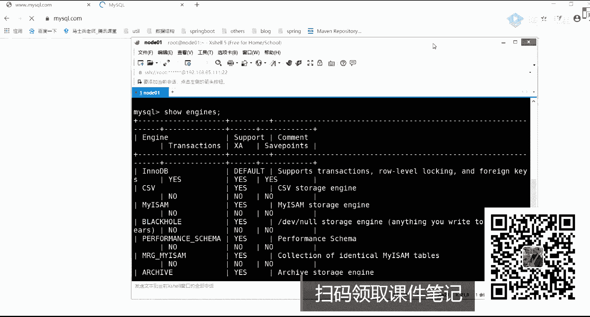
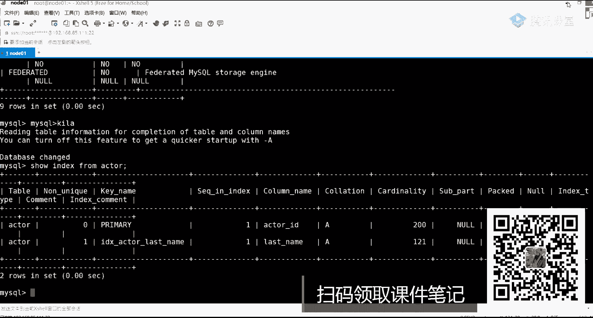

# 白嫖到马士兵教育价值23980的MCA架构师课程一次让你学够！ - P41：MYSQL调优：0.1 从0到1掌握mysql的索引系统 - Java视频学堂 - BV1Hy4y1t7Bo

课程讲对应的一个课程好吧，本套课程适合oracle吗，不是有只讲msl的，在最开始之前在企业里面oracle用的其实也比较多，但是就现在而言，企业里面可能用msl更多一点。

或者面试的时候问msl问的更多一点，更多一点，我希望大家把这些课好好听一下。

为什么这么说，这是刚刚有一个学生给我发了一个截图好吧，大家可以看一下，我截下来了，梁老师你好，我是谁a j，然后呢最近在看梁老师my sol优化解决了好几个线上问题，感谢感谢好吧，收获很大。

系统的学习比倒装写的好很多，这学生刚做的一个评价。

所以希望你在这几个小时之内过踏实下心来，好好学好好学，还是那句话，我这个人语速是比较快的，如果你在中间某个环节里面走神儿了，不好意思，回来之后你可能就不知道我在说啥了，好吧，集中注意力，集中注意力。

ok在讲解课程之前，我说了叫从0~1构建索引系统，这样提出了四个问题，你看下这四个问题你是否能解答出来哪四个问题的，第一个为什么要设计索引，第二如果是你的话，你会如何设计。

第三设计缩影的时候要使用什么样的数据结构，第四my sql是如何实现的，这样一共凸显了四个问题，我们把它拍掰开了，来聊一下这件事情好吧，第一个为什么用索引这件事情很好解释吧。

你们应该都知道我们用索引的目的在问最快呃，最终的目的是为了加快整个数据的一个访问，对不对，或者提高我们查询效率，那为什么加上索引之后就能做到这件事情，上学的时候都查过字典，对不对，经常拿这东西来举例子。

好查字典，你根据字典里面的编码能准确定位到某一个汉字所在的页数上面，直接就把那个字找到了，同样的在公司里面，你们在用数据库的时候，表里的记录可能是成千上万行啊，要不是呃成百万级或者千万行好千万哈。

那这个时候我如何快速的从里面定位到一条数据呢，此时就需要用我们的索引系统了，也就是说如果我能够根据某一个条件或者说某一个值，某一个值来直接定位到这条数据在哪，放着我把它取出来，是不是就完事了对吧。

这是我们最终的一个目的，如果你要达成这样的目的话，你想一下你会怎么来设计它，你会怎么样设计，就如果想拿到这项目的怎么设计，如果是我的话，我一定会这样想，数据库里面最终的所有数据一定是要落地到磁盘的。

对不对，是的，磁盘那漏掉磁盘之后一定是一个文件，那我所需要做的事情，就是说我要把一个文件里面的某一条数据给取出来，这件事情难度太大了，但是你们应该都做过文件读写，应该知道文件里面会有什么。

是不是会有一个类似于指针的东西，你们之前一定接触过一些方法，比如说叫sk有接触过吗，是干嘛的，每次你打开文件开始进行文件读取的时候，在最开始的时候是不是有一个头指针，然后随着你的读取。

这个指针是不是一直在向后进行移动，那大家想一下，如果我能够准确地定位到，或者说只是这个指针，你给我挪到第50个位置，挪到第100个位置，我是不是就能把后面指定长度的数据给读取到了。

那你想一下你来设计的话，你会怎么设计，第一我要知道我查询数据的时候是不是需要一个关键词好吧，这个关键词我们可以称之为什么称之为k，你是需要这样的东西，这肯定要吧啊，这是第一点，第二点我还需要知道啥。

好好听课好吧，不用签到了，好好听课，ok第二点我还需要什么东西，想一想还叫啥，是不是还需要定位到说当前记录应该存在于哪个文件吧，文件名称，这东西是不是也要文件名称，肯定要的好吧。

因为你的数据库文件不可能只有一个，然后第三个是不是要指定一个东西叫偏移量，因为我指定了偏量之后就可以定位到当前k是从哪个位置开始的，就是我们俗称的of set，缺这东西哎。

of set我是不是可以进行直接一个查询了，好吧，如果大家了解过大数据里面的某些技术的话，比如说have，我不知道你有没有用过have，在创建索引的时候，就是按照这种方式来进行存储的来进行存储的。

那么问题来了，mysql里面是用它来进行存储的吗，如果不是的话，如果不是的话，为什么没有，就是我为什么要用这样的一个方式，原因在哪儿，人在哪儿，这里面就会涉及到一个点，我希望大家能够注意了。

希望大家能注意了，对，就是慢的问题，就是慢的问题，这个慢的原因是啥，你要注意了，你在进行数据库方面的一些操作的时候，需要注意一件事，需要注意一件事，注意什么事，你当前的应用到底是哪种类型的应用。

如果你是来应用分类金融类型啊，比如说有这个东西o l ap，还有一个o l t p，有人知道这两个东西吗，有没有知道这东西干嘛的，来知道同学丁老师扣一不知道扣二，我母鸡不清楚是吧，来说一下两个干嘛的。

一个叫联机分析处理，一个叫联机事务处理，是这两个名词的一个定义好吧，online，然后呢，elastic process，还有online transition process。

也就是说我们现在如果你接触的是数据库层面的，特别是我们现在这种my circle了，oracle了，sql server了，像这样的数据库，他有什么要求，是不是必须要满足我们当前业务系统的一个支持。

当我输入一个sql语句之后，我要求你在尽可能短的时间范围之内把数据给我反馈回来，是不是及时性要求比较高，而o y a l o l i p什么意思，非常简单，它表示更多是什么呢，对历史数据。

比如说我之前5年的数据，我之前10年的数据，或者之前某一个时间范围数据做一个整体的分析来产生决策用的，也就是说如果你用这样的方式可以做，但是不好意思，它这个索引文件如果比较大的话，注意啊。

你的行记录比较多了，同时索引文件是不是也会变大，所有文件如果再变大的话，你读这个文件要不要时间，要不要时间，是不是也要时间，那同时大家想一下是不是又慢了，是不是用完了对吧。

所以这种方式对于我们的mysql而言可能不那么合适，可能不那么合适，大家想一下我要用什么样的方式要直接读文件，肯定不行了，那我现在就要考虑我们的基本知识了，基本知识什么基本知识。

我能不能够采用某一种数据结构来代替这样的一个方式对吧，你们应该都知道mysql里面它的索引系统用的是什么样的一个数据结构啊，b加数对不对啊，所有人都知道啊，那么问题来了。

为什么你知道数据结构有线性表对吧，有图有链表，有各种各样的东西，为什么就要用b加数，就算聊到数了，就算聊到数了，还有什么东西，还有二叉树，有b s t tr，有红黑数对吧，还有a v2 数又n种数。

那最终为什么选择了b加，对不对，这是一个面试中常问的一个点好，下面我们来看一下mico到底是怎么来进行实现的，以及他为什么要做这样一个实现，我的世界只有零和一说了三层就达到千万级别了。

你要知道这样的历程到底是为了什么，刚刚啊我看到一个同学说了，说我们在进行这个数的时，候，在进行这些数据结构选择的时候，有n多种的一个选择，为什么不是b数呢，b加数是b数的一个延伸或者是一个扩展。

除了b加数之外，还有什么，是不是还有b星数啊，是不是要离心术这块东西啊，希望你了解一下，是左老师会不定期的讲一些数据结构的一些公开课和算法公开课，希望大家能够看一下啊，看一下这个课程里面都会讲到。

ok现在我看一下mysql里面对应的一些具体实现，具体实现好吧，有没有b加，有没有b减数，注意丈夫强一件事啊，这东西b杠数有人把它叫b减数，注意了没有，这样的说法叫b杠数好吧，这东西就是一个什么念啥。

叫b不b数，很多人叫b减数是不对的，你千万不要这么念啊，这么念出去之后会被人嘲笑的，会被人无情的嘲讽，无情嘲讽的，大家注意了，ok其实这个时候你可以通过我们对应msl的一个官网来进行一个查看。

看一下官网里面它是怎么对这块东西进行整体的一个定义的，好吧，看官网里面有一个描述，这我要强调强调一下，这呃这个东西啊很重要，因为看过官网的同学应该都知道官网里面写的这个数据结构用的是啥。

他写的叫什么叫betr好吧，而没有b加数这东西，但是实际底层在进行使用的时候确实是b加数，好吧，哎这怎么了，但是官网都访问不了啊，完蛋看不了啊，算了，等他一会儿什么时候刷出来，我们再再再看吧，好吧。

你记住了，不是强势不强势，网速有问题啊，网速有问题，可能开直播占那个带宽占的比较比较大啊，所以这个网站可能刷不出来啊，看不出来，ok再来说一下官网里面有一个关于索引的一个描述，关于索引的描述。

索引这块它官网里面写了有什么有我们的b数，但是你记住了，他底层用的确实是b加数，而不是b数，一会儿一会儿我会告诉你b加数和b数它们之间的一个区别啊，这是第一个点问题再来了，除了b加数或者b数啊。

除了b加数之外，还有没有其他的还有没有其他的一些数据结构，在msl里面除了b加数，还有别的吗，好了同学提到一个名词叫哈希，那么问题来了，哈希它作用于什么样的东西，或者说在哪些地方会用到哈希索引。

哪些地方会用到它啊，memory好了，其实大家提到memory之后，memory之后就应该熟悉另外的一个名词叫什么叫存储引擎，什么叫存储引擎，谁解释一下什么叫存储引擎，它其实非常非常好理解。

所谓的存储引擎就表的是表示的是什么呢，不同的数据文件在我们物理磁盘上面的什么不同的组织形式，不同的组织形式，这点希望你能弄清楚了好吧，那么问题来了，my sql里面它到底有多少种群中引擎呢。

这我应该怎么看，看的时候非常简单好，我们来看一下吧。

我当前这个虚拟机里面用的这个my circle，用的是5。7，这个版本好吧，my circle，杠幺肉上杠p，少in jn，看到了吗，这块展示出来的都是我们my sql里面存在的一些所有存储引擎。

innod b c s v masm，好吧，本来后还有pperformance schem mg啊，什么东西，然后achieve memory是不是这些东西，这里面这里面问的比较多的。

在日常工作中问的比较多的是main db，my son和memory，这三个里面如果再选择的话，谁印度db可能问的是最多的，或者大部分在提问mysql问题的时候，默认的存储引擎都是我们的intedb。

但这个时候我希望你能认识到，当你在聊索引的时候，一定是跟我们当前的存储引擎相关的，以脱离存储引擎来聊这件事情是不对的，为什么这么说，in the db，my son用的是b加数，这没毛病。

但是memory用的是哈希哈希索引，这样东西，希望大家能够区分开了，现在区分开，那我再问一个问题，in no db，它是否支持哈希索引，这是什么，这是不支持，好了有说支持的，有说不支持的。

这儿我给你一个统一的描述，统一的描述，注意了，听我说inno db这种存储引擎，它支持的是什么叫自适应哈，希，ok什么叫自适应哈，希非常简单，也就是说我们认为是控制不了我们当前的一个索引的。

你如果想用它的话，这是由my sql的系统自动来做判断的，会把我们的b加数转成我们对应的什么叫哈希索引这件事情，用户是没办法去干预的，明白了吗，好没办法去进行干预的对吧，进行干预的，这要注意了。

这时候你可以做一个查看好吧，怎么查看柚子saka，我们来看一下数据库啊，比如说show index，from，看这个表，这个表后面有一个东西，啥是b税，这不是告诉你说我用的是b加数这样的一个数据结构了。

明白意思吧啊这你要注意了，这一定要注意了，ok好了，这样希望大家能够判断一下，希望大家能够了解了了解一下好吧，问题是为啥要用自制引发器，使用场景能给的吗，自适应还是什么意思，你要先了解哈。

希它到底有什么毛病或者有什么问题，会有什么问题，有啥问题啊，你在使用哈希索引的时候，一会儿我们再讲索引那个存数据数据结构的时候，我们来说这一点，我们来说这点好，说完这点之后。

你就理解他为什么要使用这种自适应哈，希这种方式好吧，这种方式吧好了，东方一个同学提到一个问题，就是存储引擎到底是个啥啊。

到底是个啥，所以说引擎其实非常简单，这样给大家举一个最简单的例子，你就知道了，打开我当前的一个文件，请大家打开我的c盘，c盘里面文件夹里面也装我们的mysql了，打开我们的my circle。

找到我们的program data，在这里面你可以看两个对应的数据库是吧，看这块这有这样一个文件，一组文件叫emp，是不是这样的文件对吧，这个名字是一样的，但是后缀名不一样，这个点f rm表示什么意思。

表啥意思，表示的是存储的数据的一个结构，当前表的一个结构好，而a b d才是我们实际存储的数据的，这个文件是数据文件，这个数据文件里面包含真实数据，好吧，还包含什么了，包含所以好吧，这一定要分清楚了。

这是什么，这是in no db这种存储引擎，in no db啊，这你要注意了，除此之外，除此之外再打开另外一个库，看my sql，这库里面一样有一组文件名字是一模一样，但是你看后缀变成三个文件了吧。

第2f rm还是表示我们的结构m y d m y表示什么意思，m y d表示是date数据，而m y表示的是index，所以所以在这里面你的所有文件可以数据文件是分开放的，这个东西用是啥。

叫my s这种存储引擎，所以你会发现了不同的存储引擎，它的数据组织形式是不是不一样的，是不一样的，好这希望大家能够达成一个共识啊，我们这能看不能看到，ok正常看到之后来这个点没问题，同学给老师扣个一。

没问题吧，这边内容下面我们来详细聊一下my sql的一个索引系统，msl的一个索引系统，好吧，来往这看吧，官网也打开了，打开我们的dog mission，这儿做一个查看，dogo mission。

我还想带你们看一下啊，算了算了算了，我放弃了。

这网上真的难啊，不管了不管了，来我们现在来看一下msl的一个收音系统，好吧，在聊索引系统之前，你说新系统之前是我想说一件事出现什么事呢，你在这块想要掌握的比较清楚的话。

最好能够具备一部分的操作系统的知识，我问一个问题啊，这个我们的数据啊最终都会考都会放在我们的磁盘里面，对不对，这肯定是大家的共识，放到磁盘啊，但是我在进行实际数据读取的时候，你是从磁盘直接读吗。

还是要干嘛，刚才说了，我需要把磁盘里面的数据加载到内存，走到内存之后，我是不是才从内存里面取到我们对应数据，它是有这样的一个环节的，所以这里面会涉及到一些磁盘跟内存的一些交互，那我问一下磁盘跟内存。

它们两个读写的速度是一样的吗，是不是一样的，不一样吧，什么样的量级啊，往下看，这我专门找一张图片，他说了，mean memory reference，这是它读取的叫100纳秒吧，然后再来看还有什么呢。

叫round trip with the name，什么scripter，这是50万，再来看第四个seek是我们的磁盘，往上看是多少，你看这两个值它们是一个级别吗，很明显不是一个级别吧。

是不是一个级别对吧，所以内存的速度一定是快的，一定是快的，一定是快的，因此我要做的事情是什么事，情，需要把磁盘里面的数据给加载到我们对内存里面，从内存里面取数据，这样是更好的，如果我的内存假设是无限大。

我现在的话我可以做些什么事儿，把全量数据都加载到内存对吧，然后呢直接从内存里面取数据，这个时候很明显速度快很多，但你不可否认有另外一个问题，什么问题什么问题，你放到内存了，如果断电了，怎么办。

数据是不是一定会丢失啊，这是我们不允许发生的事情，不许发生的事情，因此我还是要进行持久化放到磁盘，但是我在去数据取数据的时候，能不能把一部分比较重要的数据会优先读取到我们的内存里面，这可以吧。

也就是说我能不能怎么样呢，加快或者提升整个磁盘跟内存的一个交互过程，假如说我现在取一行记录，取一行记录，我取一行记录记住，注意我说的啊，我取一行记录，我是真的从磁盘里面只加载了一行记录，读到内存了吗。

是这样来读的吗，不是吧，大家怎么读的，你告诉我，所以这里边会有另外的一个操作系统方面的一个原理，叫什么叫啥叫磁盘预读，什么叫磁盘预读啊，这个磁盘预读它是有一个理论基石的，叫什么叫局部性原理。

这局不行是啥意思啊，我刚说了，晚上看这个专门给大家截了一张图啊，说了程序和数据的访问都有聚集成群的程序的倾向，在一个时间段之内仅使用其中一小部分叫做空间局部性，或者最近访问过的程序和代码。

数据很快又被访问的可能性很大，这叫时间局部性，时间局不行，有了这两个局部性原理之后，有的东西叫磁盘预读，也就是说每次在读取我们实际数据的时候，我就算只需要一个字节a回一个字符a啊，不好意思。

我读我们数据库的呃，读磁盘的时候也不是只读一个a的，我需要读取的是某一个块的数据，或者说某一个单位的数据，而这个单位我们统一把它称之为e，这个页大小是跟我们整个操作系统相关的，一般是4k或者8k好。

4k8 k，而你在进行数据交换的时候，数据交换的时候一般都是什么都是啥，都是这个页的整数倍，就是我们的这个配置是有人一般都叫dd的配置，很多地方你应该都看过这样的描述。

这个配置数据页一定是我们整个4k或者8k的一个整数倍，整数倍好吧，这这也写的吧，可能操作系统里边也通常是4k的好吧，储存和我们的磁盘以页为单位发生我们对应的一个数据交换这块儿，我希望你能够先了解了啊。

必须要把它给先了解到这块儿，了解好了之后，下一步我们再接着往下聊聊什么，那我怎么能够保证，或者说我用一个什么样的一个数据结构能够保证这件事情呢，每次是以4k的一个整数倍来读取我们的数据啊。

这块儿我应该怎么保证，那这里面你就要从什么，从我们当前的一个数据结构里面进行选择了吧，选啥有哈，希表有二叉树对吧，也有链表，有n多种，这样的一个方式，我应该怎么读，是不是这意思好吧。

从下面我来写了索引是什么东西好吧，所研系统必须存在文件系统里面，然后呢所以的文件存储形式与存储引擎相关，然后你要想建索引的话，可以选择这么多的方式哈，希二叉树b树和b加数是不是这么多。

为什么最终选择了b加数，来挨个来解释这块东西，我希望你把这块东西给夯实了，夯实了啊，因为数据结构这块问题啊，现在面试的时候问的很多啊，之前就有学生出去面试，被问到过，为什么my sql里面选择b加数。

那你要举论证吧，是不是说其他东西不太行，那b加数是最合适的一种方式对吧。

这块怎么看一样的。