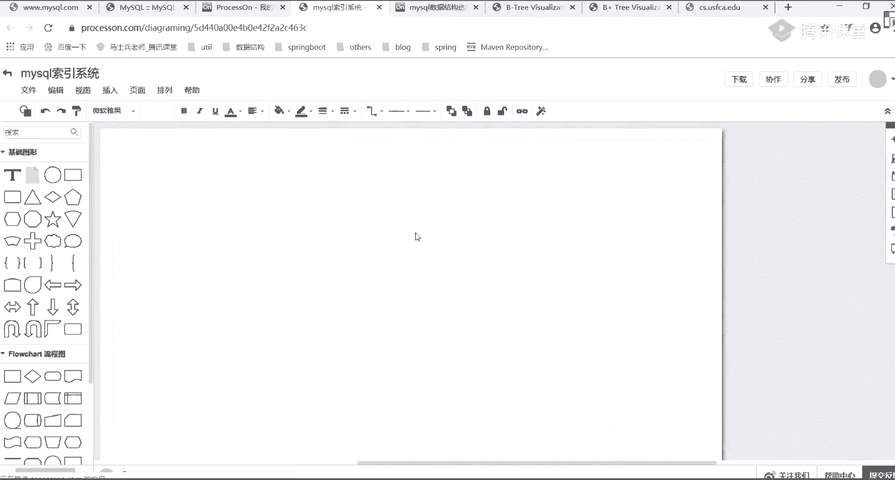

# 系列 2：P42：MYSQL调优：0.2 索引系统中数据结构的抉择 - Java视频学堂 - BV1Hy4y1t7Bo

直天上课的时候给大画过很多图，我们这直接通过这些图来进行一个展示，好吧。好后看假如说现在我有这样一个表ID内两列，这是我们里面的一个数据。如果我用哈希表的话，哈希表的话也能够进行存储。

你们都是搞java的好吧，应该知道一个东西叫什么叫哈希 map。他在进行实际存储的时候，是不是KV建制对这样方式来存储的，它底层用的数据结构，什么数据结构，是不是叫数组加链表或者加红黑数。

是不是这样实现，我是勾浪，这没招了，好吧，但存尺建值都是数据，应该知道吧。什么意思？这是一个数组，对不对？这些数组，如果我把某一个值取完哈希之后，取完哈希之后。

它一定会计算出来1个01234567这样一个位置，对不对？我往指定位置里面插就行了。但是一个位置里面是不是只能放一个元素。因此当我想存储其他元素的时候，我必须要往下面堆格子。

这一系列格子里面的东西就意味着它们的哈希值是一样的吧，是不是一样的？那我如我取到这个哈希值了，我要挨个进行对比。啊，进行进行对比，这很明显，这是不合适的吧。好，来再看这个哈西这种结构，我刚刚说清楚了吧。

有个影响就行了。好吧，有影响，这不是我们的重点OK这个有影响之后，下面聊一下它有什么缺点，让mesco不选择它。说去点。第一块的缺点希望大家注意了。对，就是同学提到的碰撞或者叫冲突。是啥意思啊？哈希。

我们用一种最low最low的方式，我是不是直接可以进行一个取模。比如说模8，我取到值一定是01234567，对吧？但是你要知道，当你在用这样的方式进行实际的一个存呃。

没有没有把用这样的方式来进行实际存储的时候，实际存储的时候，会有很多什么样呢？相同的值出现在这个链表里面。而你的数据又是随机的，所以会导致一种情况，某一条链里面可能会非常非常长。

而其他链里面可能数据几乎没有，是不是几乎都没有，对吧？因此就这样情况，你应该知道了。我如果想用哈西表的话，我必须要设置一个非常非常完美的一个哈希算法，在java里面，哈希 mapap里面有一什么东西。

还记得吗？有东西叫扰动函数来听过同学在老师扣1，有没有人听过？调动函数。这么多没有啊。搞java的不应该不知道这东西啊，你要搞其他语言的无所谓，但搞java的不应该不知道什么意思？来，我解释一下。

假如说我现在这个数组的长度，数组的长度，假如说是16个格子，16格子，几个二进制位可以表示16啊。😡，几个二进制倍可以表164个吧。现在我有这样一个数据，比如说1110，然后呢，0101。

还有一个数据是01010101这样的两组数据在进行实际存储的时候，我要放到16个格子里面，我是不是只需要磨上16。当我在进行模16的时候，我其实只需要4个二进制倍就行了。那意味着我只需要后四位。

你看一下后四位一样不一样？是不是一模一样？那这两个东西是不是要放到一起的？这很明显，碰撞率比较高嘛？因此人们想一种方式，什么方式，我要把我高位向右进行移动，拍慢是移动16位啊。

把高位向右移动移动完之后让高位去尽可能的参与运算，同时还会配合一些抑货的过程啊，尽量让我们的数据散列的更加均匀一点啊，散列的更加均匀一点就是我们那一个扰动函数这样的一个意义啊，对。

计算排期值的时候要用的这些东西。听白意思吧。说哈希麦克不行不行吗？这是在进行这种高额运算的时候，计算哈希的时候，要用哈要要用这个扰扰动函数。你别说你老师，你转这些名词干啥？面试官问你个扰动函数。

你说我不知道合适吗？😡，不合适吧。对吧OK啊。好了，是这样，一会儿名词还多呢，一会儿名词还多呢，听完之后你就懵了。OK好了，这找动函数。

所以第一点你需要设置一个非常专业的或者非常一个让数据尽可能散来的一个哈希算法啊，哈希算法，这是第一点啊，它不太好的地方，因为一般哈希算法总会有一些毛病啊，这是第一点。第二点，哈有什么东西。

你在存储存储哈希 mapap的时候，我存完比如往里面放了一堆元素。当我存完里面的一个数据了，存完了，我现在取的时候，要不要要不要把哈希 mapap里面整体的数据结构都放到内存里面。

什么问题啊？呃，不要说我说话快，好吧，我知道快，所以让你们集中注意力。开课之前我已经提前说过了，好吧。就是说我们在进行数据查询的时候，哈奇 map哈奇 map你那边放了一堆数据，放完数据之后。

我要想从里面取得某一个数据的话，这个数据要不要放到内存里面？不要。你告诉我，你不放到内存里面，你的hay map去读过文件吗？😡，肯定是放内存的肯定是放内存的。好吧。

而且你要知道而且你要知道哈奇 map最大的容量是多少来着？😡，二的右移多少位来着？31还是32记不清楚了，是不是一是不是很大的一个数据量，对吧？如果我现在要把这些数据都放进去。

是不是特别的占用我们的内存空间了，内存是非常非常宝贵的资源吧。那因此这个时候它是不是也不好了，是不是比较占用我们的内存？😡，这是第二个问题吧。好，来再看第三个问题，还有什么问题？哈希。

你在进行值的查找的时候，你要怎么查找，是不是根据某一个K值，我能直接定位到某一个数据结果，是不是这样的方式？对吧但是你要注意了，如果你直接有等值查询，一定速度走走的啊，肯定很快肯定很快。但是你想一下。

如果你在公司里面做的东西都是范围查询。范围查询，你告诉我你怎么办？你是不是变成说我要挨个进行对比了。如果挨个进行对比，效率很明显就低了嘛，是不是这意思？所以我这时写的什么样呢？如果所有查询都是等值查询。

哈希确实很快。但是我们在工作中等值查询的情况其实并不是很多，更多还是范围查询，那怎么办？它是不是不合适啊，所以刚刚列了这么多问题，这是哈希表不好的原因啊，你再回想一下，谁可以用哈希作业来着？

memory吧，为什么memory用用可以用哈希作业。原到了吗？第一个占内存我不怕。第二个开机算法比较麻烦。我设置一个相对而言比较公正的一个开析算法好吧。第三个，我要保证你这儿都是等值查询。

就算你是范围查询，我一点都不在乎为什么反正都在内存嘛，是不是在内存，内存查找元素，这个整体的速呃效率跟磁盘里面完全不是一个量级吧。是不是这个意思？所以在memory的时候。

它会使用我们当前这样一个哈希表哈希表，明白我意思了吧？好吧，而我们的应用DB为什么没用？你在跟磁盘做交互的时候，这很明显不合适嘛，对不对？来这个点听白同学要2扣1。Yeah。

过了吧，好吧，过了之后来往下看第二个二叉树红黑树，这些数为什么不行？数为什么不行？数在聊数的时候，我知道很多同学你遇到数就疯了，因为这个分类太多了。二叉数BST treeAVL数，然后呢，红黑数对吧？

还有B数，还有B加数，是不是一对这样的一个数据结构。这些数都是都是可以用来进行数据存储的，好吧？但是我希望你能注意一点，注意一点，前面这些数在进行实际存储的时候，我们存的就是一个值，对不对？

是不是存就是这些数据是这样的一个值。我有了这些值之后，我能直接把我们的数据给取回来。但现在你注意了，你所有的数据是要落地到磁盘里面的。落胶磁盘。当你在落地磁盘里面的时候，你想一下。

是不是意味着你每次要从磁盘里面取一个数据块回来，比如说取一个页回来吧，而不是取一个值回来，对不对？你你大想想一下，一页里面注意啊，mycyclcle DB这种存储引擎，它默认每次取的是16K的数据。

16K的数据每一个里面放一个值，你告诉我你得放你得放多少个节点。放到节点，而且节点越多会有什么问题啊？😡，接着读。节点越多就有可能会造成你整个数的深度会无限加深，会无限加深，而数的深度越深了。

依然会有问题，依然会有问题，会有啥问题。数越深意味着你的IO太频繁了。也就是说磁盘磁盘跟内存在做交互的时候，你也需要N多次的一个访问。我之前说过磁盘机械磁盘那个呃读写速度是固定好的。

我们一般改变不了这件事情。如果你想提升你整个IO的一个效率的话，只有两种途径，两种途径好吧，什么途径？第一个第一个是减少IO的次数，第二个是减少IO的大小，IO的量。是啥意思？

为什么公司里面不让你写s莱新啊？😡，啊，为什么不让你用此来性？为什么让你必须要写这些字段，原因在哪儿？😡，原就在于数据是放在磁盘的，而my circle里面它本身有一个服务。在每次做数据交互的时候。

我需要由这个服务层去我们的存储引擎里面把数据给拉回来，拉回来之后，在这儿可能要做一些数据筛选之后，才能反馈给客户端。如果你每次都是用的是这种全标扫描，或者把全后端都取出来。那意到这个IO的交互过程里面。

数据量是非常大的。那很明显影响效率了，所以不推荐大家使用这种新的方式啊，但不管怎么样，最终到底还是什么还是IO的问题，明白了吗？还IO的问题。所以在二叉树和宏维数这块都比较麻烦都比较麻烦啊。

当然啊当然啊我说一下，很多同学啊对这些数可能会比较懵啊，可能会比较懵你别懵，一会儿啊这个东西咱们不是特别重要。因为是属于数据结构里面的东西。等咱们把今天该讲的核心的点，我给你们讲完之后。

一会儿我来带你们捋一下这个数，你们需要吗？需要我带你们捋一下刚刚写那些数吗？什么数？第一个我刚说了二叉树吧，对吧？然后还有呢红还有BST垂对吧？有AVL数，有红黑树，有B数，有B加数啊吧。

有一堆这样的方式，一会儿带你们捋一块东西啊，带你们捋这块东西，这块啊属于数据结构的，属于数据结构的。啊，一会我们再来聊他，一会再聊他好吧，先讲核心点，先讲核心点，好吧。所以呃别着急别着急。

O一会儿来讲它。好了，刚刚我已经总结过这个理论了。什么理论说了，无论二叉树还是宏黑树，都会因为树的深度过深而造成IO次数变多。IO次数如果变多的话，就会影响我们整个数据读取的一个效率。

所以就不用这样的方式了，不用这样的方式了。那为什么B数就可以啊。

啊，为啥避数就可以啊？嗯，这为什么？这为啥？其实非常简单，我问一下B数，它这东西B数的东西它到底是怎么来存数据的？好了，同学说了存的东西不一样啊，存的东西不一样。这是我们说的。除了这个多差这个区别之外。

除多差区别之外，好吧，还有一个非常非常关键点的一个区别，就在于往这看，我们给大家打开一个网站。

看这个东西啊。这是一个数据结构，我认为比较好的一个网站，好吧。

为啥深度深IO就多？假如说我现在我现在有N多个节点，对不对？假如说一个节点里面我放的是一条记录，我放的是一条记录。那这个时候大家想一下，我要把所有记录都加载回来的话，我现在有1000万条。

你在组织这个数的时候，你告诉我你要多少层。你要多少层？N多层吧，是不每层里面是不是只有这样的东西，是不是两个分支，你是要从里面N层进行一个筛选，每次取的时候都取一部分，每次取的时候都取一部分，这很慢嘛。

😡，是不是这意思？好吧，来，我们来看一下B加数它是什么样一个关系。刚刚讲了那个红黑数也好，还是那个二叉数也好，它每一个节点里面只放一个值啊，只放一个值。而我们的B数和B加数。

它放的是一个值的集合值的集合。它里面有一个概念叫什么呢？叫dgrade。

地国人在司法导论那本书里面把它叫做杜。好，我习惯把它叫成接，这个接什么意思啊？接表意思是这样的，表示说我单个节点里面可以放置多少个数据元素好，可以数据元素OK。DNS是什么数？哎，网站不能用了？我天哪。

兼职网是咋回事？

这么坑的吗？啊，系。先打开一下啊。网速嗖嗖的。我这网速不好啊。太坑了呀。

可以用。我开VP了吗？没有吧。没开啊。又是别下片了。没有提前备课，下午的时候啊打开是没问题的。这晚上不知道咋了。

这很难受啊。算了，我直接画吧，我直接画吧，我直接画吧。好吧，直接给大家画一下。呃，这个数是这样的一个方式，是这样的一个方式。好吧，不这有啥慌的，大家看一下数是这样的。

比是说原来我们在放的时候放的是一个节点，一个节点一个节点，好吧，现在在我们的B加数里面放的是这样一种组织形式，什么形式呢？我不在这画了，在这里面画吧。

他这里面有一个节点。好吧，这是第一层节点，这C口V，这第二层。第三层，然后呢每一个节点里面每个节点里面我可以放一个元素。ややそう。三个元素，假如说我这个节点里面是一个四呃四阶的。

假如是四阶的四阶的话表示意思就是说我这里面最多只能放三个对应元素，三个元素。如果如注意啊，如果我当前节点元素超过4个了，不好意思，我会把当前节点向下进行一个移动啊，出来了，出来了，来，往下看啊。

假如我这是一个四阶的，我往里边插入我们对应元素，往这看，差第一个没问题吧，插第二个。

我把这速度调快一点啊，听到了，我再往里面插第三个。来，现在这三个了，当我在插入第四个的时候，你会看到一个效果。他是不是做了一个分支，是不是把刚刚的1234分成134了吧，我现在往里边插插5。然他再查6。

看这儿了吗，是不是又变了，是不是这样的一个方式，你能看到组合方式了吧？每一个里面放的是一块数据，而不是一个节点里面的一个数据。所以我可以再往里边7。😡，是是不是七了，再往里边插8，大家想一下。

当我再插入8这个顶点的时候，这是不是超过4个了，超过4个，我要往上再过渡一个吧，查一下。😡，是不是再加一个，来再差一个9，还有啊差九的时候。😡，还没问题，再上一个十，你看十的时候有什么变化，好吧，十。

看效果了吗？差实之后，下面超过4个了，我要往上移，往上一移，上面也超过4个了。OK我还要再进行一个分裂，是这样的一个过程。每一个里面放的是一整块的数据，所以这样的方式的话，我们可以干嘛？

是不是可以表示说每一个节点我去放置一页的数据，比方说16KB，这是不是可以？啊，不能超过4个。对不能超过4个不能超过4个。因为我这定义的接触是几是4吧，比是说最多放的是deggrade。然后呢。

减一的数据减一的数据是这样的一个方式，这样一方式。为什么要向上移？这这就是B数里面规定了，这有什么为什么要向上移的，你向下移吗？好吧，注意啊，你如果一直往下移的话。

你是不是跟刚刚那个东西又跟刚刚那个二叉树是不又变成一样了。你一直往下移树的深度是不是又深了？所以它必须要保证说我上面的节点填满之后，我才会向下进行移动。如果上面的节点没填满，我就一直往上补。

这样的话能减少你对应的一个什么数的一个深度吧，是不是这意思啊，就这一块东西啊，把它往上换一下。😡，OK你们可以下一周后自己看一下，好吧，是这样东西是这样的东西。OK这就是我们的比。

这就是我们对应的一个B数啊，对应的一个B数。O我都翻了好多遍了。好了，这是这块一个B数的一个数据结构吧。再重新回到我们当前这个mycle里面my是怎么做的？它是怎么来存储我们对应的一个数据的呀。

来往这看下面这样一个图，这一图，这样画这样一个图。😊。

好吧，这是不是就跟我们刚刚那个数是一样的，是不是也是一个B加数，对不对？呃？也是一个B数，对不对？既然是一个B数的话，那意味着我可以往里边存数据，也可以往里边导出我们对应数据了。

这时候你看了里面分了3块内容，123是不是有3块信息，是不3块信息，这3块信息表示什么意思啊？你想一下，你在创建对应的一个索引值的时候，K值的时候，啊所索引的时候，是不是必须要有个K。

比如说给ID列建索引，给内部列建索引，或者给其他列来创建索引，是不是一定需要一个列，这些列里面是不是一定有值？对吧那这个子框里面紫色框里面表示的就是我们实际要存储的那个值，记住啊。

是实际那个值实际那个值。然后有了当前这样的一个值之后，当前那这样一个值之后，下边干嘛？这个值我刚刚插的时候是123是不是这样一个方式，但其实你已经发现了，这插的时候这是68是不是68，这是呃再找一下啊。

没有是吧，这是6868是连续数据吗？

不是人音数据吧，不用发网址了。那个网址现在腾讯课堂被屏蔽掉了，你们都看不到你们看不到。😡，听白意思吧？这个网址一会儿我发到咱们那个群里面，或者你们去找小姐姐去要，找小姐姐要，不要再忘了。好吧。

同学可能会屏蔽的网址，网址发不出去。听白了吗？好好听我这的课，好吧，好好听这块东西。我们现在已经知道BB数是这样一个数据结构了。我现在画了这样一个图，画了这样一个图，有了这个图之后，有这图之后，好好听。

好好听。有图之后，我这固定三个类型数据，1233种类型，三种类型，这三种类型的数据里面，它表示是我们的K等值，是某一个范围。😊。

是某一个范围。当我有了这样一个范围之后，大家想一下，假如说我现在要查询28这条数据，你告诉我我怎么找。叉28。我是不是要大家想一下，这些数据啊一定是都放在我们的磁盘里面的，一都放在磁盘里面。好吧？

第一次我要先读取1个16K过来，是不是第一个磁盘块读过来了吧？读过来之后，我判断一下我的28在哪个范围里面，如果你是在小于16，是不是根据P1是不是一个指针，是不是指向这个节点。

如果你是16跟234之间，P2。如果你大于34是不是到下面，是不是有这样一个方式啊？那因此既然这样的话，我28很明显指向是不是P2这东西，所以我找到P2这样的一个指针值，是不是把这个磁盘块三给读进来。

刚刚是1个16KB现在是不是意味着我又加了1个16KB这没问题吧。证明题的话，来磁盘框二和磁盘框4，这两个东西会不会加载，或者说会不会从我们的磁盘加载到我们对应的内存，会不会？不会吧。

因为我的指针是不是没有指向，所以这时候它是不会进下来的。😡，那下一步来，我们再接着往下看，我到这之后，我是不是又要跟28比了？我一比之后，你发现了哪个范围？😡，哪范围是不又在P2指针里面。

我是不是又把这个磁盘块八给读过来，又读了1个16KB。😡，这没问题吧。早上是86K并之后，我是不是能准确定位到我们当前这样一个数据值了。这个值当然这个磁盘块你注意了啊，磁盘块注意了，你可以有也可以没有。

如果没有的话，意味着我查询不到数据。如果有的话，我直接把当前数据进行返回，是不是这样个过程？为什么使留在最上面？这就是我们在插入数据的时候，这样一个组织形式。你可以按照这样的模式往里面插一下数据。

插一下数据，你知道是什么样的方式啊。😡，好吧，这东西啊并没有什么特别难的，并什么特别难的。刚刚那个找数据那个过程能听明白，同学跟诉科波一。可以吧？如果这样能听懂的话，你想一下，在整个的历程里面。

我一共读了多少数据？16K加16K加16K是不是一共是48K的一个数据。这个问题吧，是不是48K。好，而且大家想一下，那我这里面我可以放多少个磁盘块儿？提到问题啊，我可以放多少个磁盘块？

磁盘块跟表什么关系？表里面有数据，你的数据在进行存储的时候，数据在进行存储的时候，它都是一个亿。而那个页就是我这标的这个磁盘框，就标这个磁盘框。16K怎么算的？16K不是算的？

刚刚是不是有一个东西叫磁盘预读，是磁盘预读，每次在预读的时候，是不是都是4K的整数倍啊？每移动DB存储引擎默认就是每次读4K乘4，就是16K的一个数据，是要规定好的，是它规定好的，这没有算的过程。

第一个磁盘块1个16K，第二磁盘块是第216K第三个磁盘块，第三个16K1共48K的数据。😡，这没问题吧。好吧，下面来再聊。我们知道了，读了48K的数据，那这个接是多少啊？同学们了，刚利借了多少？

这个接我怎么去做判断？是不是看一下我们每个节点里面最多可以放几条数据，对不对？这个图啊只是一个样例图，你注意了，只是一个样例图。这样例图。那这时候我要思考一个问题，接的东西我先放一边。

假如说我这里面我可以无限去进行存储。假如啊假如先扔一边啊，假如这样说的，然后下面我读完之后这是48K数据，你告诉我我这个东西可以存储多少数据啊，这三层这个三层的B加数呃，这三层的B数可以存储多少行记录。

那这个跟什么相关了？😡，跟谁相关，是不是跟我们这个跟我们这个数据块的大小相关了，对吧？这里面16da表什么意思？😡，这16倍表示说16K等于16这行记录就是da就在那放着，da在那放着啊。

假如说我们一行为了好算是1KB。这种一果是11KB的话，你想一下这里面可以存多少条？上下东西假如说不占空间，假如说不占空间，假如不占空间。想一下这个4方块里面可以放多少记录？16没问题吧。

这是16条下面这块磁盘块可以放多少个数据？16条吧，下面这个字盘块放多少数据？16条吧，这个时候你发现了它是不是等于是16乘以16乘以16等于多少？是不是二的12次方等于4096条数据？是不是这样意思。

注意啊，这种算法是不精准的，算法是不精准的。虽然不精准，为什么不精准？我们把上面这空间是不是干掉了，是不是都没占空间，这很明显不合适嘛，肯定要占空间的，肯定要占空间的。只不过我们人为把它干掉了。

我们粗略算一下，这东西是能存4000多条数据的，你想一下，你3K，你你想一下啊，你三层的一个B数只能存4000条数据，这4000条数据不跟玩似的吗？是不是跟玩似的。

你在公司里面你的数据库不可能说我只有几千条吧，一般都是百万级千万级别这样一个数据量，那很明显问题来了，为什么这个三层的B数，它能存数据这么少啊，空间浪费在什么地方了。😡，为什么不是相加？

这里面会有N多个分支啊，我这如果把16个都补满的话，你想一下多少？😡，如果把16都补满的话，是不是意味着15个范围，那多少了，肯定是相乘嘛，对不对？肯定是相乘啊，肯定不是相加。O好了，同学说了。

浪费在date上面了，就这块是不是比较占用我们空间，对不对？所以这时候我要干嘛？是把我们当前的da给干掉。如果把date给干掉之后，下一步干嘛了，就从我们的B数演化成我们对应一个B加数了，这块还是一样。

你看一下B加数什么特点，一样，我再指定一个四阶的，指定四阶的，这是B加数，刚刚是B数，好吧，我们再插入相同的数据，你往来看有什么特点？一。😊。

2。速度快一点。34。56。你能看什么特点吗？😡，看这块。层数一样吧，但是有什么样的特点，你看一下。😡，当我这样的放在存储的时候，B数是这样的，每一个数据值，每一个数据值是不是只可能出现一次。

只会出现一次。但是你往这看，必加数里面，这个7两次吧，三两次吧，5两次吧，9两次吧，这意味着啥？意味着我们对应的这些数据块给干掉了。我们所有的数据都放在我们对应的叶子节点里面去了。

而上层这块东西我是不再放数据了，只放我们对应一个K值。如果我这只放K值的话，你想一下K不要了，get表要了，ge不要了。你想一下这块的范围是不是会越来越大。

范围是不是越来越大，对吧？这块范围如果越来越大的话，那意味着什么东西？😡，你第二层里面的节点数候是不是会越来越多是不是越来越多？那第三层是不是也会越来越多？那那个时候在计算的时候。

还是16乘16乘16吗？不是了吧，那它应该变成什么样的一个结构啊，来往回看，它慢慢变化的话，就变成这样一种结构了。😡。

然后。第一层第二层我只放K值，最后一层我再放我们实际的一个数据。如果还按照我们刚刚刚刚指定好那样个规则的话，每个块16K16K16K。你告诉我第一个里面能放多少数据。1600这不合适吧。

假如说咱家看一下P1是不是指向一个数据值，P2指向一个数据值，P3是不是指向数据值。假如说他们这样的一个方式，好吧，假如是一组，他们这一组数据假如说占10个字节可以吧？我们为了方便计算啊。

假如说占10个字节，如果这占10个字节还是16K，16的话是16000，那除以10的话，多少，是不是1600。刚刚在前面B数的时候，这些东西空间我都省掉了。现在我把这些空间给加上。

是不是意味着是1600条第一层里面。😡，这1600能听吗？同学告二扣1。你们的问题一会儿来回答好吧，先听我说。能听懂吧？这如果16的话，第二层多少1600吧，第三层多少？😡，剩多少？16吧。

是不是还是16？第三层是不是还是16，你为第三层里面是不是还要放数据的，也还是一KB嘛，对吧？还是1KB所以是多少啊？就相当于161600乘以1600乘以16，这块加起来的话变成多少了。

变成40960000。是不这样一记录呃，是这样一个技数值的。这个时候这个时候你发现了发现什么东西，跟刚刚的B数相比，B数相比比这个跟刚刚B数相比，它这个数据量是不是成指数级上升了，是不是4000万了？

是不是这意思啊？当然我们这种算法啊这种算法只是一种最low的算法，或者说最不准确的算法，但是大致可以这样估虑估算出来。

