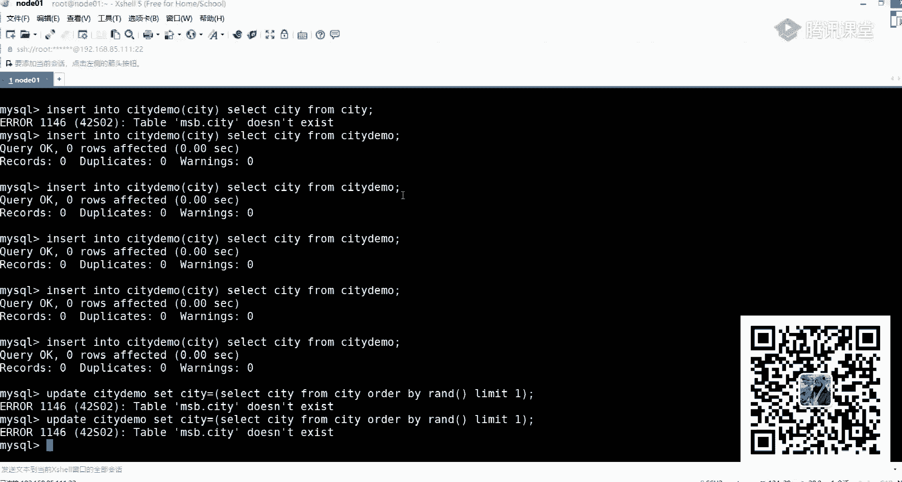

# 白嫖到马士兵教育价值23980的MCA架构师课程一次让你学够！ - P43：MYSQL调优：0.3 索引的分类及应用场景 - Java视频学堂 - BV1Hy4y1t7Bo

大家可以做动做做这样一个估算，明白我意思吧？这是为什么mexico里面要用成我们对应一个B加数，对应这样一个B加数。1600没整明白。每一个磁砖块是不是16KB16KB换成字节的话。

是不是16000乘以1000嘛？1K是不是1000，但一K是11024嘛，我们把24给省掉，简化就算1000是不是1000。我这一组，假如说我占10个字节，我除以十0是不是1600条？在前面B数的时候。

我把这些空间都没算，只能放16条。现在是不是把它给算上了，是不是这样的数据量？对吧那这块算完之后，你会发现是不是已经达到千万级别了。那这种方式的时候，是不是就效率比较高了？听白意思了吗？听白意思吧？

第一层为什么只有一页，你肯定要有一个根节点吧，这是不是就根节点？😡，是不是跟紧点？你不可能上来之后，就是N多个分支节点嘛，肯定是根节点，对不对？😡，第三张，为什么1616K16K1条数据占1KB。

那是不是16？是不是16？为什么十字节？我们说假设嘛假设我们把它算了十个字节嘛？😊，Good。我要崩溃了。😊，明白了吧？都是预估嘛，都是我们我们总要给一个数，对不对？总要给一个数吧。😊。

所以这儿会衍生出来一个问题，什么问题呢？所以经常们老师这个mycyclcle里面这个必加数，B加数到底是三层还是四层？听没我问题啊，mycyclcle里面必加数到底是三层还是四层？

你们有人被问我这问题吗？😡，有说三的有说四的这块我来给大家说一下给大家说一下。这个三层和四层不是规定好的，不是规定好的，也不是我们默认来进行一个设置的，不是这样的一个方式。这个层数三层和四层对。

指的深度指的深度指的深度。这个东西是取决于当前的一个数据量的？因为之前我们是不是指定了一个值叫什么？叫deggrade，是不是有个东西叫接。deg什么意思来着？如果你deg等于4的话。

意味着只能放三个数据。如果你这个d等于等于呃5的话，只能放4个数据，这只是一个量级。为了在这个图里面好展示，但我也说过了，这里面它表示的是一个磁盘块的数据，所以磁盘块数据的话，意味着是16KB，对不对？

是不是16K16KB的话，那意味着我要让这16KB尽可能多的去存储我们当前的一个数据，是不是这意思？因为里面存数据越多，那意味着我现在能存储的数据量就越大了，假如说现在你用一个ink类型的值。听我说啊。

假如现在你用了一个int类型的一个值去设置我们当前所有的K了。你告诉我这个degree是多少，degree是指定好的吗？😡，是执接好了吗？不是吧，应该怎么算。

是不是拿你当前这个数据块的总大小是不是要除以你当前一个值一个值占用的一个长度？这个之占占用的空间，你是不是算出来我们整体的一个der位了？😡，你算完之后，你想一下它是不是就能存多少个范围。

那一层一层时候马上延伸就可以了。所以三层跟四层不是人为指定的，不是人为指定的啊，决于你到底要用什么样的方式来存储。所以你们在公司里面在设计索引的时候，你告诉我。😡，int类型好吧，one叉类型。

太词类型。你告诉我你用什么类型来存。😡，用什么来型类型来说啊？肯定思吗？这是为什么很多人告诉你说，你不要去用外它类型来存储我们的索引。为什么在这儿它会占用掉我们很多很多额外的一些空间，额外的一些空间。

😡，啊吧，这会导致你的树有可能会变深。啊，所以所以越小越好，就这意思。听白意思吗？好吧，这大家一定要注意了大家要注意这大家一定要注意了。好吧，这是为什么后面的时候后面的时候。我举过这样一个例子。

举过这样一个例子，举个什么例子，我给大家看一下，在优化这有一个东西，我给你们提前看一下。好吧，这东西咱们都要讲话，咱们咱们都要讲了，别慌，好吧。

我找一下。

来往上看，咱们讲到这就说了，好吧，说了说有一个东西叫前缀缩引。这个前缀索引什么意思？签诉什作音什么意思啊？非常简单啊，我来举一下这个例子，举下例子看一下你们知道什么意思了。

觉接就看一下就知道知道什么意思了。我现在有一个数据库表，数据库表，这个表里面有一个字段叫CT字段叫CT。在当前这个CT字段里面。😊，它长度是50，长度是50，对不对？我可以干嘛？我在实际做的时候。

可以把这个50来截一部分，我把它运行一下吧，好吧。

我们讲这，我们把个例子来演示一下，好吧，演演示一下啊，大家知道都要演示的哎。可以的。对ta贝ase andB。

然我创建一下这张表啊，我直接运行了。好吧，这命令我不给你们粘了啊。

O。我们这只是为了造造数据，好吧。😡。

嗯。😊，这儿哪有问题看一下，把这一据拿过来。

表已经存在。哎，是这么干的呀，insertupdate。

CTdeCT等于。这移动不够用啊。所以试一下说哪哪哪哪哪写错，这里边是不个东西啊。

做化 database。

是。核示一下啊。

No delivery slack。又是MSB。Create database。钥匙。USB，然后瘦黑。好，没有了，下重新建一下啊。现在好了吧。In色的C demo。

Sa the city。诶。这什么问题啊？cre以的这张表因素的这张表CSCD防CT。这个表没有吗？算了，我们又会来演示吧。CTdemo。

这有Cde啊，这CD表没在啊，我等一下找一下吧，找一下这个CD表好吧，那我们这不演示了。好吧，现大家说是什么样一个什么样一个例子啊，这个例子啊非常非常简单，非常常简单给大家说一下。

就是说我们现在我们现在有1个50个字段的1个CT的一个东西。😊，不慌，好吧不慌不慌好吧，那个表里面有数据，一会儿我找一下那个数据，找一下数据，好，找一下数数据。好吧，这有1个CT表。

表里面有1个哇差的一个字段。我们每次在创建我们当前索引的时候，你可以用这样的方式来进行创建。什么东西叫left city3，这什么意思啊？

来看一下这个东西啊，我们可以这先见一下叫。要der。tableable保养的C。demo，然后呢艾 index IDDX下划线。City括号。Left。括号上写一个CT逗号3，有人写过这样的语句吗？

有没有写过这样一句？前面我们本身只是为了创建我们对应一个索引，对不对？这东西应该都见过。但是我后面指定字段的时候，你们原来写的时候都直接写1个CT完事了。但我现在引入一个什么呢？叫left的一个函数。

是啥意思？我从左只取前面的一个三位啊，你这我就有问题了。index left city。我靠，今天晚上出事不顺。艾 index ADX下线。Left。CT逗号3。这会有问题吗？不靠啊，疯了吧，1莱他。

C体 demomo。発生。有C一的字段啊。alter table C demoad index IDDSEle C3。这有啥问题？全体起立下课。这只是表啊，修改这张表里面这个索引啊啊。😡。

这这店铺我认知了啊。没收过。创建。所以。我天哪。这宇就都记错了。谢谢啊，张小天。可不。Table name。带的已经带的是。这样创建的吗？看到吗？使用这个语句，还得in in that name。

我站一下。不可能啊。找一下这改一下这名字。CITY干吗？in袋一。这写一个。City。没问题啊。left括号。C题逗号3括号。

不能用lifeft的。哦。看了吗？不用不用不用来他啊哎。😊。

不知道咋回事。这直接写。CT括号。这样写行了，这边这样写就行了。😡，2。好了吧，这样写法，刚才写错了啊，left让他看。这是不是也写了啊吧，这块呢。

这意思就是说我可以指定前三个对应的一个索引值是这样的一个方式啊，这样一个方式只取前三个是前三个只取前三个啊，那他说老师，你这儿我怎么来判断说我到底用的是前三个前四个前5个还是前六个啊。

这个东西我该怎么来确定啊？所以在这里面在这里面会引入另外的一个名称，另外的名称，什么名称呢？往上看叫它索引的选择性，所引选择性。也就是说也就是说你可以用来进行对应的一个查询，进行一个判断。

判断什么信息呢？判断一下，我当我截取多少个的时候，跟我全量的数据是一模一样的？

好，我截多少的时候跟我全量数据一模一样的。这样的话我可以来实现对应的一个方式，实现对应的一个方式。这儿我没这样提前没准备好数据啊，抱歉，没准备好数据。这儿有数据的话，我们这儿可以做一个演示。

明天我承诺啊，明天大家进来听课，明天我把这个呃我把这个东西给大家演示一下，大家演示一下，好吧。给家演示一下OK。

休息啊，咱们扔一边，好吧，扔一边。好了，接着说回我们对应索引的一个事儿。

说是我们所有的事啊。所以通过这样方式，你发现了我如果有一个三层的一个必加数的话，几乎可以支撑什么呢？叫千万级别的一个数据量啊，千万级别的一个数据量。大家想一下，有同学老师老师到底是几千万啊。

是2000万、3000万、4000万还是几千万，这个怎么确定啊？冇。啊。我要把这天东西讲完才会停播，好吧。看第个位大小好了，这块要根据你对应的一个索引大小来进行判断了，没有一个具体的准确值。

所以你们也不要去问这些准机值没有意义，听白了吗？你根据你自己的一个硬件去进行实际的一个测试和评估，测试的一个评估，评估完了之后就得到一个具体准机值了，就准确值了。这个图一会儿这个这个图一会我会发啊。

一会儿会发OK。性能测试搞定好吧，所以当你这块来计算完成之后，计算完成之后，最终我们得到一个结论，my circlecle是不是选择了B加数这样的一个方式？现在为什么选择B加数能听麦？同学给老师扣波一。

好了，这门题之后这门题之后，在毕加数里面，它还多了另外一个特点。我这儿还要强调一点，刚刚只是说我建了三层，对不对？除了这三层之外，你往这看。你往上看，你看这两个图，除了这个节点这个重复之外。

还有没有什么不同的点啊？这个B数里面它每一个块就是每一个块是单独独立的，但是在B加数里面，你发现了它是有一个箭头指向的吧。这啥意思？这啥意思？意思是这样的，也就是说在我们当前的一个mycle里面。

当你使用B加数之后，你在进行数据查找的时候，可以使用两种方式，一种方式是通过根节点一层一层往里边进行一个查找，这第一种方式，好吧，还有第二种方式什么东西呢？它底层会有一个双向链表，双向链表。

我这标的是双向好吧，标双向标双向列表，你可以从这个节点开始，然后呢，按照顺序进行整体这样一个查找。也就是说它支持两种查询方式啊，支持两种查询方式所以你要取决说我到底用什么样的方式来进行合理的一个查询了。

这不是写了是一种是对主键的范围查找和分析查找。另外一种是从根节点开始进行随意查找啊，有两种方式，两种方式。うん。🤧明白我意思吧？啊，那怎么从磁盘块四开始呢？它在读取的时候会存储这样的一个数据值。

会直接把因为这个B加数里面啊，它些数据都是有序的都是有序的。所以我可以直接把数据进行一个读取。啊，都是进行有血，写的优先级高，这个东西没有优先级。my circlecle里面有一个组件叫优化器。

优化器会选择一个合理的方式来往里面存储我们对你来执行我们的数据。到底是从根节点开始找，还是从我们下面这个呃最小节点里面，叶子节点里面开始进行查找。听白意思吧？好吧，请问排序是在存时做的吗？对。

是在存的时候做的是在存的时候做的。排序过程啊，一定不是说后期维护的时候做的，一定是说我们在插入数据之前，就把这东西给大家做到啊，可以人为干预吗？不可以不可以。不可以，好吧。不只是叶子节点吧，啥意思？

没听懂。好了，这块东西能听明白吧？来听懂同学第二个扣个一这东西。好了，这只是B加数这样一个数据结构。下面问题来了。刚刚老师跟说了老师，你刚刚讲的这个东西是my some的还是inowBB的？

是哪种数据结构的呀？这儿给大家说一下，我在下面这块，我标注的是什么叫date，看到了吗？我标是date，我并没有标一整行的数据，所以my song和inow DB他们都是采用这样的一个数据结构叫B加数。

只不过他们最终这个date里面放的东西是不一样的。date里面东西是不一样的。听白了吗？这里面数据是不一样的啊，怎么不一样，往那看。😡，inow地B这种存时引擎，它在最后面的数据里面放的是什么？

放的就是你实际的数据，注意啊，实际的整行数据，一整行数据。实际的整行数据好吧，而如果你用是my sum的话，它底层放的是什么？放的并不是整行数据的，而放的是什么？是一个地址。

我要根据这个地址去读取到数据所在行，然后把数据给读过来。这是为什么你在inDB存储引擎里面的时候，你看到是一个叫IDB的文件IDB的文件。而在我们对应的一个mysome的时候。

你看到是一个什么MYD和MYI的文件。好，这他们两个之间的一个区别，懂我意思了吧？好，懂我意思吧？这儿大家一定要区分清楚了，一定要区分清楚了，好吧。就他们俩之间区别，别东西别东西别东西没啥了啊。

别东西没啥了啊，这儿没啥之后来往这看。刘涛老师，你这里面这个K值到底指的是啥？有人把它叫做主建。是主件吗？问一个问题啊，这儿是主件吗？是不是主建？这个K。在那个书里面写的时候啊。

它翻译过来叫primary key。我们把它翻译成主件了。但这个主件这个主件给大家说一下，跟我们之前你们认知的那个主件是不一样的啊，是不一样的啊，那这东西到底是啥呀？这儿来给大家说一下。

因为我们在创建表的时候，有可能你没有制定主件。是不设置主件？如果我不设置主件的话，我应该怎么做？😡，是不是这意思好吧，所以这块你在聊的时候要牵扯到另外一个问题了。我这儿到底这个K值存的是啥？听完了说。

我这写了说如果你在进行必加数呃，应owDB这种存储引擎进行数据存储的时候，好吧，如果你有主键OK我按照主键进行主件进行这样一个索引创建。好吧，然后呢，子点里面存放记录。如果没有主键。

那ok我会选择唯一键。同说啊，唯一键如果唯一键也没有的话，怎么办？我会生成一个六字节的row IDD。而那个row IDD对于用户而言是不可见的，听明白了吗？对应化言是不可见的，你永远看不到的东西。

我永远看不到东西，但是我必须要按照这样的一个方式进行数据的一个组织。这行数据的一个组织原因是啥？别人是啥？😡，原因其实也非常非常简单，这样给大家说一下，这就是你们在面试的时候经常问的另外一个问题。

到底什么是剧促索引，什么是非剧促索引啊？这东西怎么解释？什么叫剧组？什么叫非剧组？啊，这啥意思？这是你们面试常问的问题啊？什么叫技术索引？什么叫非技索引这块给大家来说一下给大家来说一下好吧。

所谓的剧组索引和非技索引更多表的是表示什么？是你数据到底是怎么来进行存放的，进行怎么存放的。B就是技组索引用用技组索引。而my用的就是非技索引，就取决于你的数据和你的索引是不是放在一起的。

是放在一起的啊，当然放在一起的时候，那个K值可以是主键，也可以是唯一键也可以是一个六字节的roID六字节的roID。明白我意思吗？听我意思吧？啊，这块希望大家能分清楚了啊。

这个剧组索引跟非剧索引的一个区别到底什么时候应该用什么样的方式啊，老师是不是一个索引对应一个数啊？对，比就说你在往表里面插入我们对应数据的时候，如果你有主件啊，或者你不管有没有主件，我在数据插入的时候。

我就会有一个K值。就会有一个K值就会K值。而那个K值指在的可以是主键，可以是唯一键，也可以是一个roID它必须要这么放必须要这么放。每次你在进行数据值的一个查找的时候。

我要根据这个K去找到我们对应数据了。啊，这个所引是不是不是列值吧，是啥意思？你说啥？好了，新说了剧左引数据和索引放在一起inowDB非剧左引不在一起mysome。对，就这意思。啊。

那我DB创建三个索引和数据一起，岂不是放三份数据？OK这是另外的一个问题。SLTIN同学他们他说那我DB如果创建三个索引和数据一起是不是三份数据，这就是计组索引涉及到另外一个点了，什么点。

你的主件或者你的K值和数据是绑定在一起的。如果你给其他的任何一个列又创建了一个索引，又创建了一个索引，那O那O这个时候它会做一件事，做些什么事情，当你给其他列来创建索引的时候，它这颗必加数。

B加数最后面的叶子节点里面存放的就不再是数据了。那放什么放的是你在这棵主键必加树里面那个K是啥？如果你用的是主键，O这就放主键。如果你用的是唯一键，这就放唯一键。如果你什么都没有，这就用row IDD。

听白意思吗？明白意思吗？好吧，是用这样的方式来进行实际的一个存储的这是我下面往这放的这个东西，看到了吗？刚刚上面这个图是给ID建了一个主件，对ID是主件建了一个索引，这是我们数据的一个组织形式。

如果我想给内幕再建一个索引的话，会有什么方式，往家看内幕列里面这是不有列名。有个列名之后，我实际里面放式啥？是不是主建那个知道？好，主原值了吧。所以我要根据的主原值，我要查询的时候。

如果按照内幕去查询好，去查询，我先查到ID值，有了ID值之后，我再去根据这个ID值去这棵树里面找到对应的数据返回给客户端。好，是这样的一个方式发馈给我们对应的客户端。所以这大家一定要注意了。

大家要注意了。刚刚我看有同学问个问题，说，老师为什么关于数据库里面，它推荐我们要使用主件自增啊。你们推荐使用主电自动吗？没有问题。这个ID自能要不要用啊？推荐不推荐。

给大家说一下给大家说一下这个东西啊取决于你到底你的数据库是单机的还是分布式的。如果是分布式的，如果是分布式的，不建议不建议。啊，如果你就是那些单体的一个系统，非常非常建议你使用主键。

所以跟业务场景相关啊，如果你是分布式，OK不推荐啊，不是分布式的OK非常推荐。为什么？😡，当你的主件如果是自增的话，你告诉我，我现在往里边插入我们对应元素的时候，插入对应元素的时候，我怎么插？怎么唱？

你想想刚刚我们在插数据的时候怎么插的，是不是一直在向最后面这个节点里面添加数据是吗？后面直接加而如果你这不是自增的，是一个乱序的话，会有什么效果？他可能会往中间某个经验里面插数据。

英老师中间插就中间插呗，这有什么关系啊，关系大了去了。假如说你中间这一块。数据满了。满了之后，你还能往里边插数据吗？不能了吧，如果满了不能拆了，那里面会涉及到另外一个问题，什么问题？对叶分裂。

叶既然能分裂的话，那意味着还会有什么东西？还会有叶合并。老师，这个东西很简单呀，不就个分类合并吗？我把一个文件拆成两个文件不就完事了吗？告诉你没这么简单，为什么没这么简单？我刚刚在演示这个动态图的时候。

你会发现它一层二层就二层一层里面这个节点值是一直在变化的吧。😡，是不是一直在变化的。就是说你看起来好像说我直接把最后的数据页来做了一个分裂，来做了一个合并。但其实它是能够直接影响上面的这些索引页的。

你像索引业的，所以这个时候你的系统维护会变得非常非常麻烦。要师不就16KB吗？很快嘛？如果你有N多个人并行查询，你告诉我怎么做。听白意思吧？所以这件事情非常非常不推荐，一般都用是自增，都用是自增。啊。

改分布式的时候，分布式里面有自己的生层策略，你可以自己指定一个主件生层策略，也可以用循环算法啊，也可以用循环算法。这在分布式里面用的比较多的。O。那插入多了也不一定不也得做一分页页分别分裂合并吗？

是得做是得做是得做这个做是没办法。但是如果你是自增的话，如果你是自增的话，自增的话会减少整体业的一个合并和合裂合并和分裂的过程。如果你不是自增的话，可能要进行频繁。这里面就是索引的一个维护的东西了。

所以维护的东西了。听白我意思吧？好，这大家要注意了，大家要注意了。OK来刚刚描述那些点，听麦同学告着扣扣一。没有吧。啊，这东西难吗？你们觉得。咱们花了一个半小时讲清楚这这这东西你觉得难吗？还好是吧啊。

还好来上难度，这只是基础东西，好吧，就是基础东西。下面来说几个名词。呃，没关系啊，咱们两个小时课讲不完了，讲完咱们就往后拖啊，往后拖没关系的，好吧，小事儿O。😊，来上难度好吧，什么难度呢？😊。

现在提几个名词，提几个名词，什么名词呢？第一个回表。啊，第二个名词。缩紧覆盖。第三个名词，缩引下推。第四个名词。最多匹配。来这四个东西这四个东西之前听过同学扣一，没听过同学扣2。哎。好了。

现在课外人越来越多了啊。😊，是啥意思啊？来，我们挨个来解释一下这东西，介绍这东西。我告诉你这东西啊贼简单贼简单。好吧，嗯名词看起来好像很厉害的样子，我点着烟好吧，抽根烟好吧，抽根烟啊，这个烟也比较大。

okK这个东西啊特别简单。你听这些名词的时候，感觉哇塞，这都什么东西好吧，但其实很简单，好吧，一解释就说了，一解释111一解释就会了，好吧，来挨越看第一个叫回表，什么叫回表。😊。

是是汇表拉往来看在刚刚这个缩音系统里面好吧，我这是不是建了1个ID的一个主件索引，是不是主件索引好吧，同时我是不是给name给name是不是也建了另外一个索引，就是我们下面这块是不是另外一个索引，对吧？

假如说现在我写了这样一个circle语句，什么ci狗语句叫st。然后呢，星 fromtablewhere什么name。等于一个值。当我写这个语句的时候，你告诉我我是不是应该会走索引？😡，是不是所以？

因为内是一个索引链嘛，我先要根据我们当前这个内目值去这棵必加树里面找到，比如找马老师，我是不是根你这个值去找一匹秒马老师OK找到马，我返回值是谁，是不是这个ID值。当我取到ID之后。

我明明需要是星这一行记录里面可能包含了N多个列，是不是N多个列，那下面你告诉我应该怎么办？我是不是要把这N多个列要进行数据的一个查询了。所以此时会把这个一的值带回来，带回来之后找到这块。

