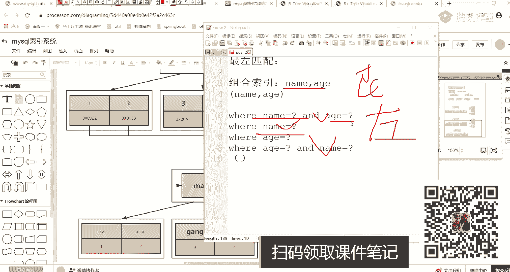
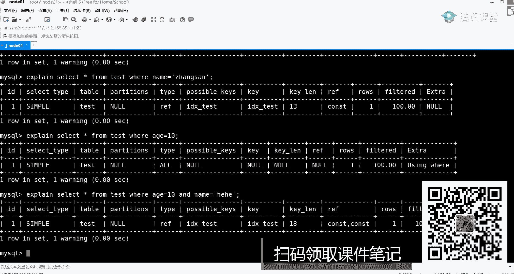
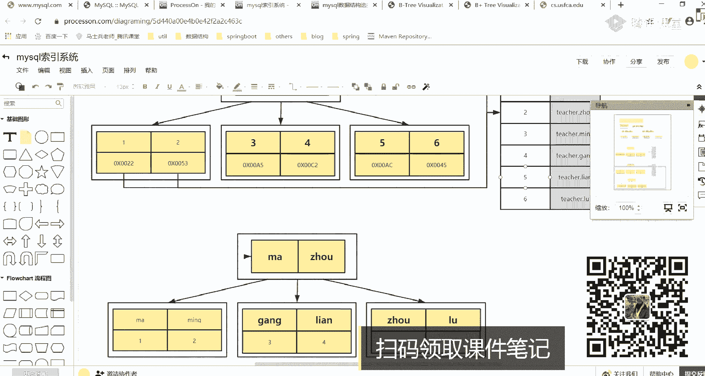
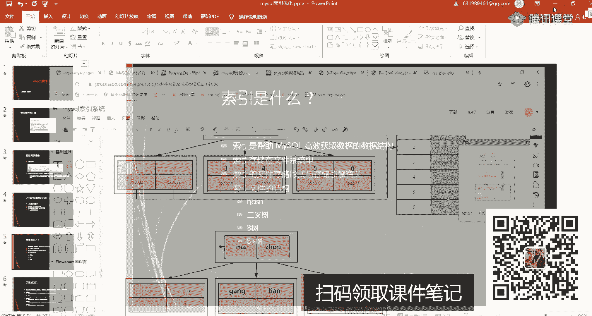
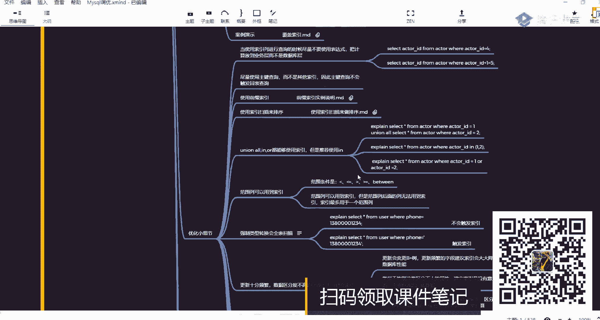
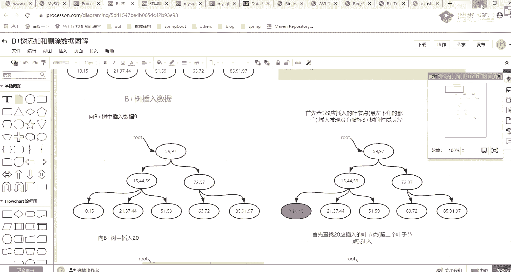
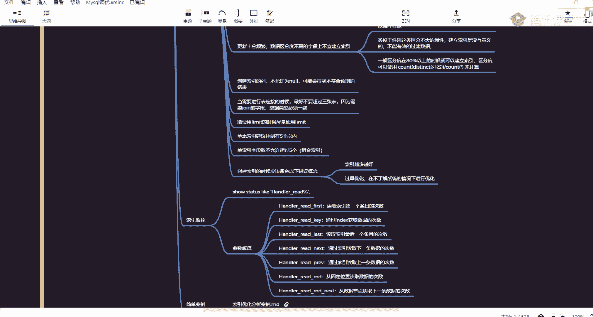

# 系列 2：P44：MYSQL调优：0.4 不同存储引擎索引的区别及数据存储方式 - Java视频学堂 - BV1Hy4y1t7Bo

是不是30几50几要找到一，一是匹配到马老师是把数据直接翻了回去了，也就说当你在用这样的方式查询的时候，是不是查了两颗b加数，第一颗是内部内列的比加数，第二颗是i d这类比加数，这个过程就称之为回表。

明白意思吗，所以什么时候会触发回表，一般当你在用什么用二级索引，或者说用辅助索引的时候，才会用我们的回表，好采访有回表，注意啊，有人叫二级所言，有人叫呃那个那个二级索引啊，不是有人叫二级索引。

也有人叫辅助索引，无所谓啊，无所谓啊，就就就就就这意思这么难吗，啊会很慢吗，好了问题来了，所以解说这东西会不会很慢，会不会很慢慢不慢，取决于什么东西，你想一下你们应该有这样的一个生活经验，什么生活经验。

你现在给一个数据库建一张表表，里面有id，有内幕两列对吧，然后那id是主键，内容不是主键，现在你往里面插了20条数据，注意啊，20条或者说非常少的数据，非常少数据，这个时候你又给内部列创建了一个索引。

传言索引，现在你在用内部查询的时候，你发现了我用内部查的时候反而不如用什么，就用了内部索引之后，反而不如不用索引的速度快，是不是东西就为什么数据量小了，我也见索引啊，速度反而会非常非常的慢，为什么。

不会一定会慢的，你下一周自己去查，一定会慢远一点，就在于它触发了回表，假如说一次b加数的搜寻是要走三次i o3 次i o，而现在我要走两次b加数，是因为六次i o我就算全表扫的话。

是不是也用不了多长时间，是不是这意思啊对吧，所以这时候反而数量慢，一定是什么，一定是数据量大了之后，你的二级索引或者说你的辅助索引才会能看到对应效果，如果胸大小的话，是看不到对应效果。

就这块产生的一个原因，io的问题，明白意思吧好吧，这就要注意了，这一定要注意了好吧，刚刚是回表，来听麦同学扣一，明白了吗，好吧，听完之后来第二个概念叫索引覆盖，什么叫索引覆盖，来一样的意思一样一样都写。

我这儿再写两条sql语句，sat星from table，where name等于一个问号，再写一个swe id from table，where name等于根号，这两条sql语句，这两条sql语句。

你告诉我像我一样吗，不一样有什么不一样的地方，第一个语句刚刚说过了，是不是一定会触发回表，是一定会触发回表啊，但是第二个语句我需要触发回表吗，不需要吧，为什么不需要我在找内幕这个b加数的时候。

我是不是直接把id给取回来了，是不是id取回来了，我把id取回来了，我这个值是不是就有了，我还需要再去找那个主件b加数里面，去里面再找整个整整行记录吗，不需要了吧对吧，所以这种情况就叫什么叫索引覆盖。

这所覆盖这东西还难吗，不难吧，是很简单啊，ok就这意思就这意思好吧，来再看第三个点什么呢，叫索引下推，这又是啥玩意儿，什么叫索引下推啊，所以下推下推很容易啊，很容易很容易来给大家说一下。

所以下推是这样一个理论知识给大家说一下，现在假如你要查询这样的数据好，先先先说这个吧，先说这个最多匹配吧，最多匹配什么叫做匹配啊，最多匹配这一块，一般情况下一般情况下是不是要跟什么跟组合索引一起使用的。

组合索引之前你们在建索引的时候，可能用的都是单列i d了，name啦，制了可能是这些列啊，都是单列，但其实在工作中你发现你所有的查询语句里面，所有的查询语句里面我都用到了内部逗号age，这两列加多少。

那两列，那可以干嘛，可以把这两列共同一起来创建一个，所以叫name逗号age，好按照发射建一个缩影，按这样的方式来创建我们对应的一个索引之后，所以之后你会发现你所有sql语句执行的时候。

只要查询条件里面包含这两个条件啊，我都会来走当前的所有，那这里面就会涉及到这样一些查询语句，我不写三叉星了，好吧，你写过，什么呢，name等于问号and的地址等于问号。

然后呢where name等于问号，where age等于问号，然后呢where什么呢，age等于问号and等于问号，是不是会触发这样四种情况，当你有这样四种情况之后，有四种四种情况之后，我的问题来了。

这什么叫最多匹配来着，这东西啊就类似于你在呃淘宝网站里面，淘宝网站里边啊，你在输地址的时候是怎么说的，是不是有东西叫3d联动，你先输省才能出事，出了事之后才能出去，是不是这样的方式对吧，这也是一样的。

这是一样的，你要想是这样的方式来建索引的话，那ok我必须要先匹配到内蒙，再匹配到，必须这么干，必须这么干，先匹配内蒙再匹配值，如果匹配到name，不好意思，只是不能用的，所以如果是这样的话。

你来告诉我这四条语句里面哪几个语句会走索引，哪几个语句不会走索引，1243124，看到有人说一二，有人说124好吧，这给一个标准答案，124会走索引好，为什么大家看一下name age。

它它两个东西放大一点，name和age是不是匹配到这东西了，他肯定走name，是不是第一列呀，我匹配到第一列是不是也会走的好吧，第二列是不是匹到age的name是不是没有，那如果没有的话，不好意思。

这是不会走的，人不会走的好吧，那四为什么会走啊，还是记住了，在msl里面有些东西叫优化器，这个优化器很牛很牛的老师，我们现在不是有一些优化吗，我们现在不要做mysql调优吗。

对你做mysql调是要调整你的sql语句，调整你的架构，调整你的设计，调整你的参数，调这方面在msl本身里面也带着一个优化器啊，这句话器有两种选择模式，一个叫cbo，一个叫r b o。

刚刚我看到同学打打打这东西了，cpu什么意思，cpu叫基于成本的优化，ibo叫基于规则优化，现在大部分的这种数据库在选择的时候都会选择基于成本的优化，就说什么样的效率越高，什么效率越高，好吧。

他又会选择什么样的方式来进行执行，所以当你运行第四条sql语句的时候，第四条sql语句的时候，他会把你当前这个查询帮你做一个优化，用什么方式会选择内部和age的顺序做一个调整好。

会把内部放前放后位置方号明白我意思吧好吧，这样大家一定要注意了，大家一定要注意了好，所以124这三个都会走，所以而三不会走，而三不会走好吧，所以这就叫什么叫最左匹配原则，明白意思吗，明白了吧好吧。

my sql里面默认是cpu pole里面是有r b o和cpu的好吧，执行一下这个东西下去之后，自己演示的时候，一演示就出来了，如果你演示的结果不对，你找我保对好吧，你现在说自己可以演示。

如果你演示结果不对的话，你找我，ok，你建一个表，往表里边给这两个列建一个组合索引，建完组合索引之后，然后你写下思路语句，你查一下试试，查一下试试。

哎呀大哥们，来我见一下好吧，内部，位置啊不对，不能这样讲啊，table然后test，id逗号，这个你一眼就出来了，好吧，这样写一个十，假如我写这样一句，可以吧，然后呢。

这写一个alter table test and index i d i d下划线，test括号，是索引啊，show index from test，这是不是有一个索引了，我先查一下语句。

行from test，where name等于张三，and age等于十，看这块有用，索应了吗，用了吧好吧，然后再往下看，我把这个a值删掉，是不是有这个k值对吧，再往下看换一下，这等于十有作业吗。

没有吧，来再换a就等于它and的name等于呵呵，有没有作业出来了吗，是不是四种情况，他就做匹配了吧。

这不是出来了，别的懒得动手好吧，这个很简单啦，很简单了啊，这就叫最左匹配啊，最多匹配，ok好了，就这块来这个第一慢了吧，明白了吧，好听完之后来再接着往下聊，再接着往下聊，聊另外一个名词叫什么叫索引下推。

这个索引下推什么意思啊，它是5。6还是5。7来着，我忘了是哪个版本之后才有的一个规则，还有规则什么意思呢，就是说select行from table，写一个where name等于根号，and值等于根号。

假如说我现在是这样一个sql语句，你告诉我我实际在进行数据存储的时候，我会在我会怎么存，我会怎么存这个东西哦，一会儿再说哦，一会儿来说，算上一会儿再说好吧。

先看这块这东西在筛选数据的时候到底会怎么进行一个筛选，怎么进行筛选。

我看刚刚你这边有没有显示出来的东西啊，啊没显示出来。

还没显示啊，告诉大家这块什么意思呢，就是我们在实际数据筛选的时候是这样的过程，数据一定在磁盘里面放的数据存储磁盘好吧，然后这意味着mysql有自己的服务，是这样的方式，所以每次筛选的时候一定是干嘛的。

my sql服务要跟什么呢，磁盘发生交互吧，在原来没有这个索引下推之前，他是怎么做的，是这样做的，说select会，再写一下没有，所以下推，这时候我会怎么做，sd先从存储引擎中，中什么叫拉取数据。

这个数据什么意思，是根据name筛选的数据，是第一步好吧，再回来之后，然后呢在服务层，在msl，server，然后呢根据什么age进行数据的筛选，大家看到了是这样的一个方式啊，先根据内容把数据拿过来。

拿过来之后拉到我们的server层，在server层里面再进行a h的一个筛选，是这样的方式好吧，而如果有了，所以下推他会怎么做呢，啊会在拉取，数据的时候直接根据name逗号age来获取数据。

不需要在服务层，在给服务层了server做任何的数据筛选好吧，这个过程就会搞，所以下推大家看一下这个下推指的是推到哪儿了，什么叫下推，现在理解了吗，怎么样下推，原来是先根据一个字段。

然后呢把数据拉回来好吧，拉回来之后拉回来之后，然后再根据进行一个筛选，然后现在呢筛筛选的时候是直接根据内部和h来进行一个筛选，筛选完之后直接返回我们对应的结果，明白意思吧。

好就就就就就这这样一个意思好吧，这叫随性下推，随心下推，推到我们数据筛选环节，原来是在服务层做的，现在是在数据筛选的存储引擎层来进行一个实现的来进行实现的，他这个东西啊不是让你自己来选择的。

不是你自己选择的，是在5。6还是在5。7，我忘了哪个版本了，那个版本之后他又做了一个修改，好，哪个版本里面只做了一个修改之后，就都用到我们对应一个数，都对应一个数据下推了，我忘了一个版本了，好吧。

ok 5。60吧，ok好了，5。6这样的一个问题，那为什么不选择索引下推，给大家说一下，索引下推会有问题，所以下跌是会有问题的，有什么问题来你告诉我孙一下，有什么问题，有什么问题是这样的。

你想一下这个组合索引在我们实际数据存储的时候，实际存储的时候，它会怎么进行数据存储，怎么进行数据存储，也是组合作用，我到底是怎么存的，这怎么存档，啊数据查询不全吗，不是这意思，现在我有两个列。

我有两个列，这两个列在进行数据的一个交互的时候，你告诉我，你告诉我我这两个问题应该怎么存放器怎么存，那现在有一堆这样的数据，看着我拿整数来举例子的话，整数举例子比较比较比较容易一点对吧。

呃假如两列都是整数，两列都是整整数，两个b税不是就一个就一个就一个好了好了，r2 说对了，是这样的，比如说我现在有一层，就这层里面我写了一些数值，什么是二根号四。

然后后面呢这再有一个东西范围是三根号五这样的范围，下面这层几点里面筛选的时候，左边这块是什么，是类似于这样的形式，比如说一逗号二，然后呢呃一逗号三，然后呢二逗号三括号，然后呢二逗号四。

这是这个里面指向的一个数据，指向一个数据啊，这是这个节点指向一个数据，那中间这块可能会有什么，会有二二逗号六，然后下面呢可能会有三逗号五对吧，然后后面这儿可能还会有括号，三逗号七，四逗号八。

看到这意思了吗，跟笛卡尔积没关系，好吧，这是name，假如这是name，这是他在组织数据的时候，是按照这样方式组织组织了，所以我会先比较第一个列的值，第一列也值，有了之后。

我是不是在比较我们第二个的值是不是这样一个方式，当你在使用这样的方式进行数据存储的时候，如果你两个字段听我说啊，如果你两个字段，两个字段在进行数删选的时候，你只看后面的东西，你还能取到数据吗，取到吗。

因为你第一个根本拿不到，根本拿不到其他更多类似于什么，类似于是一个二元组，是这样的方式，必须要先比较第一个，再比较第二个，就这样的方式明白意思吧，好这个大家要注意了啊，这东西就叫索引下推，索引下推听。

麦同学给老师扣波，一能听懂吗，没懂都没理解啊，我们这里面在进行数据存储的时候，在进行数据存储的时候，上面这个值这是不是一个范围，这是不是一个范围，小于它的值，在这边放放着，在两个中间的，在那放着。

然后大于它的话是在这放着，怎么写的东西啊，是不是只让它好吧，然后中间范围是不是这样，它然后大于它的话，是不是只按这样的方式，你在考验我的画图功力啊，是不是这样的方式啊，这这这样这样东西24分别是什么。

name和a的这一列呀，这一列里面的一个值啊，这一列里面的一个值啊，它在数据组织的时候就是按照这样的方式来进行组织，原来我在进行索引下推之前，所以现在之前我应该怎么做，原来我做的时候。

我直接把这个值只要能匹配到，只要能匹配到，我直接返回去，我直接反弹回去，是把之前是不是直接把这呃这这这写错了三四这写错了啊，343434这写错了哦，34234我是不是直接匹配到第一列值之后。

我返回去返回去之后加载到我们对应一个服务里面，服务里面直接做筛选就完事儿了，好吧，现在呢现在怎么做的，现在是说我要在这个层面，我先去筛选我们的内幕，再筛选我们对应的一个值，然后返回回来之后。

我再去把数据给返回回去，他有什么缺点，有什么优点啊啊缺点和优点优点非常明显，当我没用索引下推的时候，没用索引下推的时候，很明显你这个i o量是非常非常大的，i o量是比较大的，所以你的速度会比较慢。

会比较慢，因为呃会比较慢，而现在呢当你使用索引下推之后，使用索引下推之后，他是不是要把这个东西匹配，把这东西匹配先匹配第一列，再匹配第二列，你匹配匹配完成之后，返回的数据值一定是少了吧，是不是少了。

是不是io量上面应该是少了，是不是l o l上面是少了，io量少了之后，是不是性能就有所提升了，那老师，那为什么刚开始设计的时候没有这么多设计啊，为啥刚开始做设计之前，那个时候机械磁盘的速度说反了吧。

我说反啥了，顺一下推，顺一下推，刚开始为什么没用，为什么现在用了，为什么5。6之后用了5。6之前没用啊，原来是啥，想一下26对吗，为啥不对啊，这不是24吗，这不是二四吗，24是这个范围。

26是不是表示中间的一个值对吧，就是因为我们硬件读取的一个成本，我们一直在说说磁盘慢慢慢慢慢，磁盘是不是很慢对吧，磁盘再慢，听我的问题啊，你磁盘再慢，你现在只是相对于我们的内存而言的吧。

再换句话说你能不能换成ssd，但是你想一下内存是非常非常宝贵的资源吗，如果把全量数据都加载到内存里面去了，你想一下，如果占用了其他空间，导致你其他应用程序运行慢怎么办。

是不是意思啊啊它是有一个时间年代来发展的，就好比之前你在问一个问题，说老师现在索引里面在建索引，在进行加载的时候，是指加载根节点吗，听到我的问题啊，是指加载根节点吗，我说了int类型值好写。

所以我就写成int了，不是吧，不是吧，为什么这个只加载跟腱，这种说法是在原来很早很早之前，你的内存只有照级别或者只有kb级别的时候，那个时候说的，但现在很明显已经不适用了，你现在随便随便呃，就是怎么说。

你现在随便一个电脑是不是都是16g的，是不是都是16g的对吧，现在像像我个人笔记本，我这我这笔记本32级的这个人pc啊，你服务器128g起步吧，是不是这意思啊，这大家一定要注意了，大家一定要注意了。

ok所以内存越来越也在变大了，也在变大了，所以这些东西啊是跟它的历史发展年代相关的，所以所以现在我说了半天还没明白，你在做数据筛选的时候，在做数据筛选的时候，数据筛选的时候，现在先筛选第一个。

再筛选第二个，这些数据的查找是由谁来完成的，是不是需要在磁盘磁盘里面完成的，是在磁盘里面完成的没用，所以下去之前是不是在内存里面完成内时候，内存数据不是比较宝贵，现在而言，现在而言。

你的磁盘性能是不是也可以内存，大家想一下，你内存这块东西是不是可以变大了，但你磁盘这一块还是像原来那样一样那么慢吗，不是的吧，所以他是不是把它换成了我们索引下推这样的一个方式。

所以说现在是不能在磁盘里面直接做了，而不需要把它加到内存吧，是不是减少整体的io量，而且现在更多是什么，你不要老师，我感觉没多多少吧，好像也多不了多少东西，但你别忘了别忘了现在更多是什么，是这东西。

是这东西是并发，是并发，是并发，如果变化大的话，有可能有n多客户端都需要把我们对应的一个数据加载到内存里面，你内存能给多大，就算128g的服务器，你能给多大好吧，而且还跟你的带宽是相关的。

是不是带宽相关，明白我意思吧好吧，所以这块我们就把它放到下面来做了，不要往上面去做了，就这意思就这意思好吧，但是io是不是少了，io量是不是少了，这没问题吧，再说一下现在推荐使用。

现在说一下推荐使用磁盘下推啊，不是索引下推好吧，推荐使用索引下推这些东西啊，就好比是这样一个东西，你往下看，我写这个，你看你能不能理解啊，sat t1 ，点a name，逗号t2 。

点name from t，joy，t22 t一点，id等于t2 点来，你告诉我，你告诉我这块东西，这块东西这个sql语句，这个sql语句在执行的时候有几种方式，挺好的，几种方式，两种三种还有三种的。

还有三种呢，这几种方式两种吧，第一种方式是什么，先做表连接，然后查询，需要的字段，把第二种方式呢先把需要的所有字段都拿出来，然后再做关联，是两种方式，你告诉我一和二哪种方式好，1号啊，1号啊，看数据量。

现在我们在聊的时候聊大数据量，可能聊大大大大大的数据量这块儿给大家说一下，二一定是好的，像这条sql语句，假如说我这个表里面假如说有100个列，你把100的列做一个关联。

它是要变成一张临时表或者一张虚拟表，是不是一张虚拟表对吧，现在呢我是不是只需要提出四个字段，四个字段我做完关联之后，我是把需要段是不是拿出来就行了，这个时候你是不是学四个字段。

这两个的i o量是一样的吗，这俩io量是一样的吗，不是吧，是不一样哪，还有量小，是下面还有量小对吧，这东西叫啥，这东西啊，也有一个名词，也有一个名词，什么名词叫这东西，这个东西好谓词下推，叫谓词下推。

所以啊它这儿也有一些名词这块儿，你尝试着去理解，或者说尝试着去了解这块东西，ok啊这我解释一些东西好吧，淡定老师，所以现在是人为干涉的，还是mac和mac机制，据我了解，现在我这一套参数没有参数能控制。

就是版本这个不同版本里面有这样一个方式，刚才说了是5。6，这个版本里面自带的好吧，你下一周可以自己看一下，你下一周可自己看一下，ok人生如戏，为什么搞这么复杂呢，mac就能不能自己管理。

所以智能管理数据库的发展趋势是不是会走这个发展下去，真要那么真要那么智能的话，那还有啥可说的呢，对吧，索引下推，所以下推，唯一的缺点是需要在机械或者需要磁盘上多做数据筛选，原来的筛选是放在内存中的。

现在放到了磁盘，查找数据的环节，的环节，这样做看起来成本比较，但是别忘了数据是排序的，所有的数据是聚集存放的，所以性能不会有影响，而且整体的i o量，会大大减少，反而会提升性能，听明白意思了吗。

现在我写的东西能不能理解，能理解吗，好吧，好这个问题再有这个问题再有问题，下课来找我好吧，下课来找我，ok就是你在很多同学会，很多同学可能会感觉说我在磁盘里面做那么多的一个数据筛选工作。

可能会成本会上升，可能成本会上升，就你想一下，原来我在筛选的时候，我直接匹配到这个数据之后，拉回去就完事儿了，我现在除了匹配第一个字段之外，还要匹配第二个字段，我的成本是不是可能会高。

是不是这种可能可能性会高，这也不是缺点啊，我啥时候说他有缺点，你们刚刚问的问题是什么，问题说为什么刚开始的时候没有使用索引下推，这你刚刚的问题吧，这你刚刚的问题吧，我是不是来解决这个问题，好吧好吧。

这次咱们不聊了，不聊了好吧，是谁有问题的话，下回再单单聊，我聊我ok好了，这四个名词如果同学们听明白了，听完了，下面再说一个东西，这东西很多同学可能没听过，还有个叫什么叫m22 ，这东西有多少同学听过。

都觉得简单吗，这都为啥什么叫m2 m2 ，这东西全称叫什么，muted，range read什么意思呢，啊这什么意思呢，这意思其实非常非常简单，当就是你现在要如果要进行数据回表的话。

回表你怎么进行数据回表，你想一下在进行回表之前，假如说我查询的是某一个范围的数据，比如说我匹配的是一个name，是字段，假如name字段好吧，name字段我写了一个呃，内蒙大于某一个值。

这个时候我取完之后，假如说我取到1万条记录，一比1万卡1000点吧，假如我取到1000个id值，有没有可能这东西有没有可能有可能吧，我根据name去这个条件做筛选，筛选完之后，我取到了1000条数据。

这一项数据对应过来就是1000个i d，那如果我把这些id值去一个一个一个一个去进行筛选的话，意味着我要从根节点里面是不是按照这个分支依次去进行一个查找，是不是这样的过程，是不是一个筛选。

这很明显是比较慢的，对不对，好，那我可以做点什么事，所以什么事我能不能把取出的这1000个id值肯定是放到内存里面吧，好在1000个，那这几个值这些值我先做一个排序行不行，我们先做一个排序，可以吧。

当我做完排序之后，做完排序之后，我能做什么事了，你告诉我，啊拍进去之后是不是相当于我不用一条一条再去挨个进行匹配了吧，我是不是可以走那种范围查找，这可怎么分范围查找说法。

查找时候我是不是可以一个批量的方式取出我们对应的一个数据，而不需要再从根节点里面一个一个在挨个遍历了吧，是不是这样的方式，这东西就叫标题range read，明白了吗，来这个点听白同学给老师扣一。

就相当于我中间加了一个排序的环节，当然排序可能会加内存，占内存空间，但是不会占特别多，因为你不就存了一个i d嘛，你排序在哪，排在内存排，同学们，内存排序很慢吗，这牌也很慢吗，不慢吧。

原来你在做排序的时候慢是因为什么，是因为在磁盘里面做的，这个时候你的内存和磁盘是要发生交互的，所以这时候比较慢，之前经常问一个问题，说我有一个1t的数据文件，我如果对这些数据文件这些数据一个筛选呢。

这笔是比较慢的，这比较慢的，好吧，ok这样做完之后，这个做完之后来再看另外一个名词呃，叫f c i f e fc，什么叫m i c，你知道吗，刚刚我看有同学说简单f i c好吧，这叫什么东西。

叫fast create index，好，是这样的东西，这又是啥，这里面就涉及到说我在进行数据的一个就是就是数据的一个dm合作，比如说新增啊，新增fci吗，我写错了哦，fci不c，你写错了。

人f i c吧，那那那那就下下下，下面写错了，我记得m c啊，这才对啊，这这是什么东西，f c i吧，i f i c吧，这什么意思，也就是说这东西是这样的。

每次如果我们在删除delete或者说音色的数据的时候，你是不是要修改我们对应的一个索引，在修改索引的时候，他是这样的过程，什么过程呢，我必须要先创建一张临时表，然后呢把那张表里面的数据。

包括我新增删除数据到临时表里面，然后把原始的数据表给删除，删除完成之后，删除完成之后，我再把我们的数据好给把原来那个临时文件再改一下名字，改完名字之后完成是这样的过程，有了这个fc之后，他怎么做的。

他在这个锁里面给你加了一个s锁，还是锁a组之后意味着是一个什么，是一个share的一个锁，那此时你的毒是不影响的，但是血会影响画成这样的一个机制，这样的一个机制，所以这里面的名词是非常非常之多的。

你看完这些东西之后，感觉疯掉了，感觉要疯掉了，但是这东西还是那句话不难，别把它想的特别特别难，听懂我意思吗，比他想的特别难，ok你们都总感觉说老师这些东西，你讲一节课，理论。

这些理论性的东西有必要搞懂吗，我问一下，你觉得这东西有没有必要搞懂，没必要，我给大家说一下，如果你在公司里面实际敲代码的话，说实话这点东西半毛钱用都没有，后面用都没有，因为你根本用不起来，用不起来。

但是如果你做的是某一个数据库方面的一些产品，或者说你要参加一些数一些面试的话，特别是大厂，他一定会问的，一定会问的，一定会问的db，不是db，不是里边就是程序员，就是程序员会问这些问题。

所以你这样一定要把这些点给掌握好了，一定要掌握在掌握好了，实战咱们明天的时候我会给你讲，实战会有n多个数据库，不会有n多个表，实际上给你进行演示，听明白意思吧，好吧，fs再讲一下，是这样的。

fc是这样的过程，原来我如果我再来说一下，最开始，如果你现在想做一件事，做什么事，我要去更新的插入，和删除数据，你怎么做，这个过程是这个过程是什么样的过程，先创建临时表，将数据导入到临时表中。

当然这个临时表里面就包含就包含什么东西了，就包含我们现在已经修改或者删除的数据了，添加我删除一个数据了，那这个时候第二步会干嘛，把临时表，删除好吧，不把原始表删除，然后第三步会干嘛呢。

叫修改临时表的名字，大部分来说是这样的一个过程，这个过程很明显是有问题的好吧，所以这个f i c是什么意思，叫fast嘛，更快的一个方式好更快的一个方式，这个更快的一个方式在进行实现的时候，他怎么做的。

给当前表，然后呢创建或者添加一个share，锁定一个线索好吧，然后此时注意了，不会有创建临时文件的资源消耗，发消耗，然后呢还是在原文件好吧，但是此时如果有人发起dml操作，很明显数据会不一致。

所以怎么样呢，添加cs，读取是没有问题的，但是dm操作，会有问题，明白意思吗，好是这样的一个方式，是这样的方式，ok这些东西啊，你去听一下呃，一般面试一般面试是不会问这个点的，但之前有一个学生在面试。

顺风玩啥来着，反正面临一个公司，他被问到这个问题了，所以我要给你们提一下这东西，你们提下东西，明白意思吧好吧，这一定要注意了，这一定要注意了好吧，这几个点这个点这就是发你在修改数据的时候，要不要改索引。

要不你要不要改作业，要吧是不是要改索引，你不能说我只改数据，不改索引吧，这时候你加锁之后，都会连带着把所有的东西也给你进行一个修改，也进行修改，ok好，这东西啊，下一周自己看吧，自己看吧好吧。

下一周自己看一下，ok好了，这是这方面的一个知识点，你们觉得这些东西啊，当然冷水说了，感觉也没讲啥，都是基础的东西。

它这些东西啊是比较基础的，相对而言是比较基础的，这我给大家说一下，我刚刚为什么从这个轴上开始给大家讲这些东西。

因为在优化这块前面一块往上看，文章写了很多很多东西啊，索引的优点，然后呢索引的用处，索引的分类，然后索引的技术名词，数据结构，这前面这些点都属于基本知识，我要给你们讲这些东西，如果我不讲它，我不讲他。

我下来直接给你讲，下面这些点，直接把你干蒙了，明白意思吗，所以我们要开始进行这样的一个知识点的一个铺垫，你学了这些东西之后，下面听起来才带劲，好，才能听到你听到这个东西，要不然我下面讲这个的时候。

你根本不知道在说啥，明白我意思了吗，所以我为什么拿两个小时间来讲这个东西，我到时候给你提到这些名词的时候，不知道怎么办，ok好吧，这样一定要注意了，这一定要注意了，从入门到放弃，没必要好吧。

这些东西啊慢慢学总能学完了，这个图好大啊，这个图我在课程里面讲了16个小时，16个小时好，还不算前面的基础课，基础的铺垫，基础的铺垫，ok我说了，只讲这一块，只讲这一块，这一块是能讲完的，是能讲完的。

ok下面来把刚刚讲的东西，刚刚刚讲的东西，刚刚讲的东西再说一个东西，刚刚说了，在讲完之后给你们梳理上的个数，还记得吗，还记得吧，哦我说了，我哦，后面会讲的，你别慌好吧，我找一下，这是不是有二。

这里面是不是也有哦，我哦后面会讲的好吧，你别慌好吧，你你明天接着来听课，接着来听课，我这些东西都会给你讲到的，不会落下你们什么东西不给你讲，不存在不存在。

对好了，下面我们来梳理一下这个数好吧，我承诺的东西啊，承诺你肯定会讲的，所以别着急，承诺肯定会讲，ok好了，下面来说一下那个数的一个历程，数的那个历程好吧，你们都这个数啊都比较陌生，我咱们来说一下呃。

换个轻松点的话题，ok呃什么东西呢，第一个点，第一个点刚刚说了体内很多名词嘛，第一个二叉树，然后呢后面有我们的bs t锤，然后下面呢还有我们对应的一个a v l数，还有呢叫红黑树。

然后下面呢哎我们可以说还有我们的b数，还有我们的毕加索这些东西啊，你们应该都比较熟了啊，都比较熟了，然后呢我现在把这些东西给大家梳一下，贯穿一条线，希望你们希望你们能够对它进行一个了解。

进行一个了解好吧，现在第一个二叉树，什么叫二叉树啊，二叉树这东西啊其实是比较简单的，你们都见过数，对不对，正常情况的数，这是根节点，有n多个分支，做个分支，但这种分支很明显，我在进行数据查找的时候。

数据查找的时候很明显比较麻烦，为什么要麻烦，你要挨个节点进行一个对比，对不对，在说这个分支可能太多了，分支可能太多了，所以这时候我想办法说我能不能把我们这个数的分支给进行一个减少。

比如说这样整两个之后就变成了一个二叉树，但很明显你就算减少两个了，你在进行数据查找的时候，依然要进行挨个值的一个对比，对不对，这个比依然是比较麻烦的，这个时候你可以做一个关联关三什么，在数组的时候。

数组的时候，如果我对当前的一个数组经过了一个排序，经过一个排序，你排完序之后可以用什么样的方式进行查找，传下去之后好好听好吧，好好听二分吧，对会用二分查找。

那我现在能不能保证我二叉树在进行数据插入的时候也保证它有序呢，是不是可以，如果有趣的话，是不是就是o老n了o o n对不对，这地方很简单很简单，但是你想一下二叉树它有自己的一个问题。

或者有自己的一个缺点，什么缺点，我来看一下这块这一个二叉树没有啊，那排序之后是不是叫bs t锤，叫二叉搜索数，二搜索数，你在每次往里边插入我们对应数据的据的时候，他一定会按照你当前的数据进行一个排序。

比如插一下一，然后五三，然后240看的结果了吧，这是我们当年查的比较差数对吧，其实这个时候大家已经发现了已经发现了，这是有问题的，这个左腿是比较短的，但右腿比较长，我再起一种比较极端的情况。

什么极端情况我这样来说，这样的话这个数一，坐，发现了吗，这个时候它就完全的退化成一个链表了吧，这很明显是不合适的，因为链表查成型复杂多少，跟我们的二分查找就没就没关系了，半毛钱关系都没有了啊。

所以这个东西肯定不行，没有左腿，只有右腿，这不对吧，这是它存在的一个缺点，那这时候我要思考了，为什么会造成这样的一个效果，为什么造成效果，因为在二叉排序数里面，我这有个规定说了。

我的根节点必须要大于左子数，我的根节点必须要小于右右子数，也就是说右边的节点永远是大于左边节点的，我如果是一个递增或递减的话，一定会造成一个腿长一个腿短，所以这时候我要调整调什么东西。

我要想办法把这棵树能变得相对的平衡一点吧，比较平衡，就说保证我左子树右子数你存在的今天个数差不太多，是不是就可以了，所以这时候慢慢由它开始进行过渡，有了什么，有了a v l数，这个a v2 数。

它的名字是由三个作者的首字母拼到一起的，拼到一起的a v2 数叫二叉排序数到二的平衡数，什么叫平衡数，就说我要保证我的左子数跟柚子数怎么样呢，个数尽可能保持一致，然后呢他们有一个约束说呃。

你不可能做到一个完全二叉树，不可能做到一个完全二叉树，所以只能说你的最高指数和最低指数，你的高度之差不能超过一，能超过一，所以这时候往里面插电线的时候，你看看一下，还差这些数据，一二没问题。

到差三的时候，你看一下是不是有对应的一个变化了对吧，来再差四，看到了来再插五差是不是往下延伸了，开的时候它又要进行旋转了，好你如果再往里面插678 90的话。

它依然会进行n多次的一个旋转的n多次的一个旋转，所以这时候大家发现了这儿，虽然以这样的方式能保证我这棵树的一个平衡平平衡好，那既然平衡的话，我在查找的时候，性能一定是高的，现在是不是有点高。

这高度差不是差二了吗，哪差二了，这是不是二，这是不是323差二吗，2332吗，是不是这意思好吧，所以这大家注意了，我这样的方式进行数据插入的时候会有一个问题，查性能杠杠的，但是你的插入性能会变得比较低。

也就是说我损失了大部分的一个插入性能，来保证我查询性能的一个提升，是不是系统的一个提升对吧，这肯定是有有有问题的吧，因为我们有一种需求，比如说你插入的情案例比较少，查询情况比较多，你用它没问题啊。

但是你总会想一件事什么事，如果我的插入的性能和查询不是插入的需求和查询的需求是一样的，或者说是差不多的，那这个时候你告诉我应该怎么办，现在我要取一个平衡了吧，所以慢慢的由avl数，我在想了。

是一颗严格的平衡数，我的左子树和右子树高度之差不会超过一把，这个我把这东西给放宽一点，所以慢慢有了什么，有了红黑树，这不来个水，后来出什么特点啊，是这样的，什么呢，说我的左子数要不是我的最高指数。

只要不超过最低指数的两倍即可，注意啊，最高指数主要不长了两倍，如果我的最高指数额最低的数是三，高指数是六，如果是四就是八，如果是五的话，这就是十啊，那这样的话做什么事儿，加什么效果有。

我现在不需要再经过n多次的一个旋转就能完成，我们对应这样的一个需求，他还加入了什么，加入了变色这样一个特点，它还有什么要求，又又刷出来了，那就非常简单说了，任何一个路径上面。

你所有的黑色节点个数必须要保持一致，而且每一条路径里面，每条路径里面不能有两个连续的红色节点啊，有了一堆的一个限制，有一堆的限制，一堆限制，这都是红黑树里面的一个限制。

但是它的插入和查询性能是近似于取得了一个平衡，我们依然可以看下一，三，变色了吧，旋转，然后再往下看四，五，六你下来之后可以对比一下对应的两个数好，然后再t这是不旋转了，这不是选哪一次，这时候这是二吧。

这是四，对不对，你在我们的a v要数里面，刚刚是不是到几了，差到五了是吧，再往里边插六，旋转过程大家看是不是要七，是不是还要进行n多次的一个旋转，但这块是不需要了，是不需要了侦探里面的一个性质限制。

所以我的旋转次数会降低，所有的查询和插入性能会变得足够，取得一个平衡，不像那么严格，到这儿为止能听明白吗，能听懂之后来再接着往下看，但是这个红a数它依然有问题，有什么问题有啥问题，大家想一下，有啥问题。

它这个树身会依然无限制地往下进行加深吧，数深度越深时候对我们的差异效率是有影响的，对不对，好，那既然是这样的话，我要做调整吗，做调整吗，做什么调整，这个树身变身的原因是啥，原因在于你有且仅有两个分支吧。

是不是两个分支，如果我能保证你这棵树有多个分支，就多个分支，同时你还是一棵排序的数，注意啊，有n多分支，同时是多个排序的数，那这个时候小，那是不是就高了，你的树身是不是就不会过深了，同时还倒是什么。

每一个节点里面我只要存储多个数据，不再存储一条了，存储多个范围的数据，是不是完成这件事情了，是不是就过渡到我们的b数了，明白意思吧，当然每种树里面，种里面它有自己不同的一个适用场景，你也别一棒子打死了。

是你要知道各种数之间它们存在的一些问题，存在一些缺点，根据这些缺点在合理的应用场景里面做合理的一个试验，这事就了了，明白意思吧，好这样大家要注意了，ok就是这样一个历程，所以你在学数据结构的时候。

你可以尝试以这样的方式去捋这，捋一下之后你就知道哦，原来是这么回事，他就不会那么难记了，不会那么难记了，明白我意思吧啊我也想问一下，什么时候红色，什么时候黑色，这个根节点必须是黑色的。

然后呢插入的节点必须是红色的，但但是在插入节点之前，插入节点之前，它会判断你整个分支里面，条子做的分支里面是否有相同个数的黑色节点，同时也不能出现两个连续的红色界面，他一堆的一个限制，这儿啊。

之前我也讲过这个红黑树的一些东西啊，大家看一下，找一下，是结构这个红黑树我画的这些特点好吧，他这个演变过程，包括红黑树，它的节点是什么样子的，我要怎么往里面插出去，数据的时候是怎么样的一个破坏。

怎么样一个改变，怎么样一个变色，怎么样一个旋转，下面会讲一下左旋右旋到底代表什么样的一个意思，要什么样的意思好吧，然后呢还有一些东西，比如说mysql哪去了，这还给大家画了一个预习资料，给大家发过了。

这是b加数，往里面插节点的时候，一步一步这样的一个历程啊，这样一个历程这块都有明白意思吧，所以这块大家可以好好看一下这个预习资料版，我都发过了，预习资料你都发过了。

下周可以看一下什么一些数据结构课比较好，数据结构和算法的课，现在有左声给大家讲，左成英老师给大家讲这东西我们就不再浪费时间了，好吧，你了解这个大致的带入思路好，然后细节东西下去之后，自己去抠。

自己去抠好，慢慢的就理解这些东西了，没有意思吧。

所以啊今天我们讲的时间大概就是这些基本的点，基本的这些点今天上来之后，我们就开始直接干这些优化点了，或者说我这后面都写sl语句，都有对应的案例给大家做这样的一个分析演示啊。

到时候你知道我就应该利用索引应该怎么进行优化好吧，正好完全不通不通也要去看，也要去看看，那咱们今天晚上的课，咱们就聊这么多，聊这么多，明天晚上八点准时再给大家讲这东西好，明天八点再再再聊。

ok呃那个网站那个网站如果需要的话，一会儿我会发给小姐姐，让小姐姐发给你们，那小姐发给你们好吧，ok好兄弟拜拜，ok今晚就到这么多。

