# 白嫖到马士兵教育价值23980的MCA架构师课程一次让你学够！ - P45：MYSQL调优：0.5 索引中隐藏的知识点：索引回表、覆盖索引、索引下推 - Java视频学堂 - BV1Hy4y1t7Bo

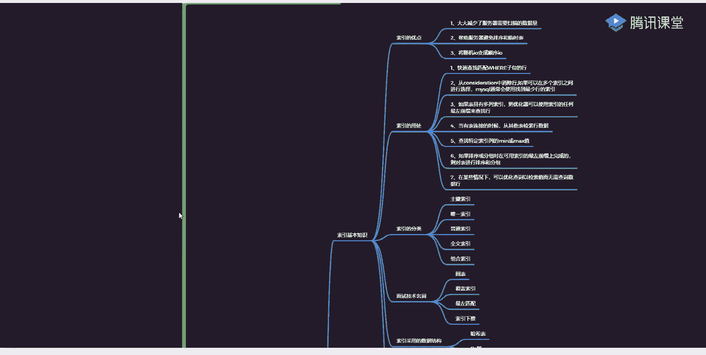

扣个一，咱们开始进行上课，忘记扫码了，我昨天同学老师们必须是啊，不然还坏人跟你讲吗啊来还是那句话，集中注意力好好听，我们希望今天把今天的东西给讲完，来先说一下昨天讲点啥。

其实我昨天讲的东西就是跟索引相关的，然后讲了，所以里面最基本的一些实现原理和面试的时候常用的一些点，当然这些东西里面包含了我们的数据结构啊，包含了查找数据整个的一个过程和面试中常问的一些名词。

主要讲了最终多点，其实大家发现了量还是比较多的，或者说量还是比较大的，量会比较大的，今天会有更多的点等着你们好吧，来第一个优点，第二个用处，第三个分类，第四个面试技术名词，第五个结构，这五个点。

这五个点我都聊完了，昨天都已经讲完了，这东西咱们就不再赘述了，如果昨天没听的同学下去之后好好再看一下，这东西很重要好很重要，ok昨天那个cp那个实例，我一会儿会演示，我说过了。

承诺给的东西一定会给咱是个言而有信的人，好吧，别着急，后面会有用到好吧，下面来讲一下这个点叫索引匹配方式啊，索性匹配方式这啥玩意儿啊，什么叫索性匹配方式，在你们面试的时候，经常会被问到一个问题，说。

如果你发现一个sql语句执行比较慢，我应该怎么去创建索引，这第一个问题，第二个问题，在写sql语句的时候，有哪些点可能会造成索引失效，听过这两个问题，或者面试被问过这两个问题，同学给老师扣波一有问过吗。

有吧对吧，这就是具体的细节嘛，就面试的时候一定会问到这些点的，我们现在来了解一下，你想把刚刚那两个问题给解决掉，你必须要知道我有了索引之后，我应该怎么去按照我们的索引去进行数据的一个查找，经数据的查找。

所以我这练了一个模块叫索引匹配方式，昨天没有讲声音分类呀，一会儿来聊天，所以没讲顺序分类是吧，那买家二次元分类吧，分成五类，第一类叫主键索引，第二类唯一索引，第三类普通索引，第四类全文索引。

第五类组合索引，这五类表示什么意思，逐渐不用说了吧，当我给一张表创建了一个组件之后，我在组织具体数据的时候，一定会按照我们主键来进行一个创建，这东西就叫做主键索引，它关系到是什么数据的一个组织形式吧。

好这些东西，第二个唯一，所以啥意思，如果你给一个列设置了唯一的一个值，v味着当前脸面是不允许有重复值出现的，这两个东西啊，这两个东西其实说白了说白了其实表示一个点，一个三点，如果你有主键索引。

我在组织数据的时候用主键索引，如果我没有主键索引，我在进行呃数据组织的时候，用唯一索引是不是这意思，当然我自己也可以添加合影吗，昨天我也给你们写了个sql语句了，还记得吗，alter好了。

table对不，name add index，如果是普通用的话，起一个名字，i d s括号指上列只是一个普通作业，如果你是唯一作用的话，是用语和你讲unit是不是用手就完事了啊，这样一个形式啊。

这东西你们在之前学习中应该遇到过，应该遇到好吧，再来看还有一个普通索引，这个普通索引其实说白了表示什么意思，就是昨天咱们提到的一个问题叫什么叫辅助，所以吧啊或者换另外一个名词叫二级索引。

二级他们这三个名词啊表示的是一样的，意思是一样的，意思，就是说我给锤了除了主键和唯一件以外的其他列所创建的索引，叫做普通缩引，或者叫辅助索引，或者叫二级索引，三个东西是等价的，等价的，ok再往下看。

还有个东西叫全文索引，什么叫全文索引啊，我现在举一个例子，现在我要做一个比如说文档的一个管理系统，然后呢文档管理系统里面存储的全部都是文章，我把文章放到mysql里面了，放心之后，我现在要做一件事。

出什么事，我要检索一下所有文章里面，或者包含java这个关键字文章，你告诉我怎么做，听明白我的需求啊，我要把所有包含java这个关键字的文章都找找出来，你怎么找，能找吗，不能招啊，同学说了，对分词。

比如说现在年费用最好的东西是ik分词器的分蘑菇已经赖赖完，已经疯了，赖效率是最低的好吧，所以这东西更多类似于是一个什么是一个搜索吧，或者说是一个检索的一个过程，检索在最开始之前好吧。

可能有人会用loser，对不对，然后后来有了server，然后呢现在用的更多是什么，是不是用的是e啊，所以在mysql里面其实很少有人去真的见这种圈文，所以大家同学说老师1o db是不是不支持啊，5。

6之后支持了，5。6之前是不支持的，确实是这样的，这东西我们一般用e s挺好用的，而且效率比较高啊，效率比较高好，再来看主播作业，我是不是说过了啊，这就是大致的一个分类，这东西没啥都没啥。

其实你们在用的时候也没必要说，我把每一个所有的分类都描述得比较清楚，都比较清楚，也没必要招那么多，你知道怎么来进行使用就ok了，好吧，来这个分类听麦同学给老师扣个一，没问题吧，没问题。

之后我们再来说这个索引的匹配方式，所以匹配方式这我写了几个东西，全职匹配，最多匹配，然后前缀列，然后呢匹配范围值进入到匹配某一列，然后访问所谓的查询这块，是不是表示说如果你建了索引了。

我在进行数据查找的时候，应该怎么去查找我们的数据好吧，第一个叫全职全职匹配是啥意思啊，这东西更多适合一是什么，是一个组合索引这样的东西啊。

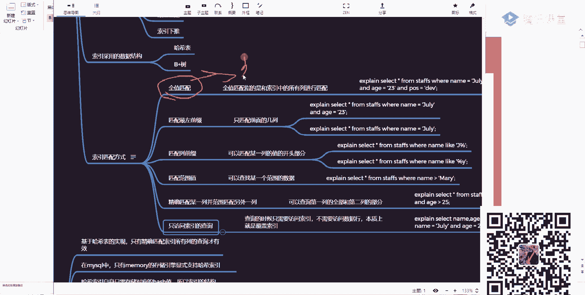

这给大家说一个点，我们现在啊一定要通过案例来给大家进行一个演示，我这是一个虚拟机里面用的这个i s o，看一下，杠p123456 啊，这种这些东西，stays版本是5。7。29，5。7。29。

是这样一个版本，然后在这里面我用了一个库，小k的，有这样一个库受tbs这个库也不是我建的，不是我建的，是msl官网里面提供给我们好的一些样例数据，明白这种东西吗，这同学扣一不知道没扣二有这东西吗。

如果你官网看的比较多的话，对这些东西应该是比较熟的，因为里面有很多对应的一个案例是从哪找啊。

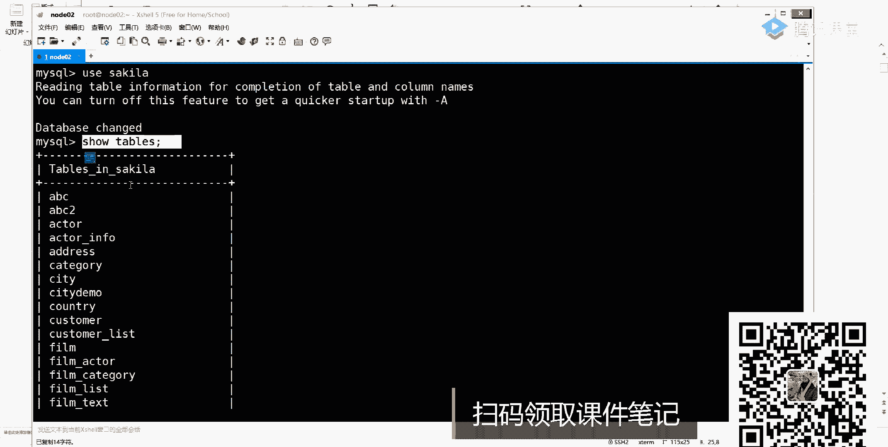

来给你们看一下，找一下，我告诉你突然下载下去之后，自己可以下载一下，里面有对应的表，然后呢，所以这些东西数据这些东西都帮你创建好了，我们只需要拿过来之后直接用就行了好吧，选择automation。

在这里面有一个more，有一个more，点开这个帽之后，它里面提供了一堆的库，提供了一堆的库，我们刚用的是什么叫saka database，你把这个z i p一下载就完事，好就完事了。

你可以把里面的sql语句给直接倒过来，里面包含两个文件，一个是gm c h e m a好吧，一个是贝塔二代，好文件都执行一下，你数据库里面就有这个数据了，明白我意思吧，下去之后自己可以搞一下。

今天网好了，所以今天网好了，今天插着网线，所以用的是无线啊，这下去之后自己可以挡一下。

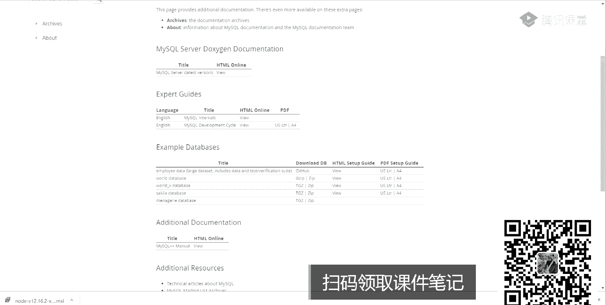

自己可以挡一下，那这时候我们来看一下是不是这么多表啊，表里面有什么样的字段。

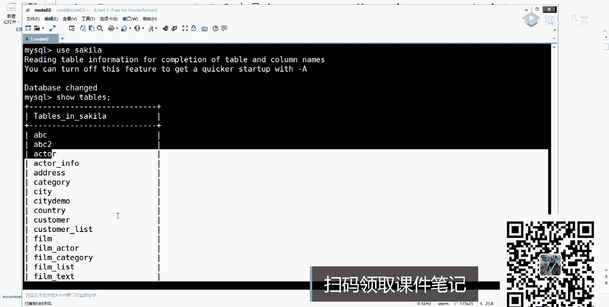

有什么样的结构，你先扔一边，我们先不管它，我们先管它好，先看一下。

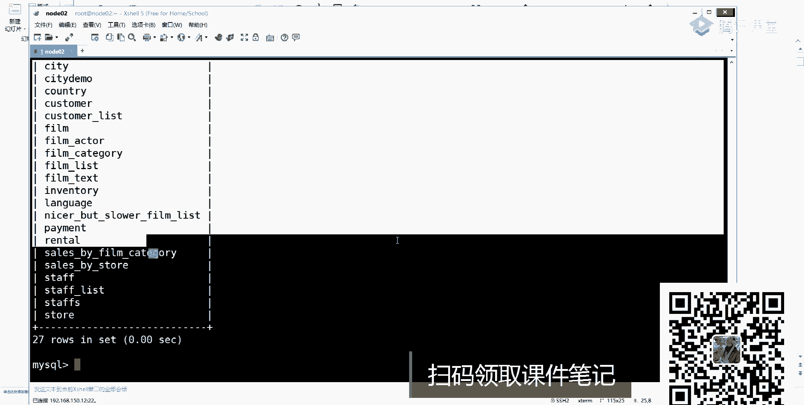

刚刚也是这个案例，这个案例我就直接从这儿复制语句了，好吧。

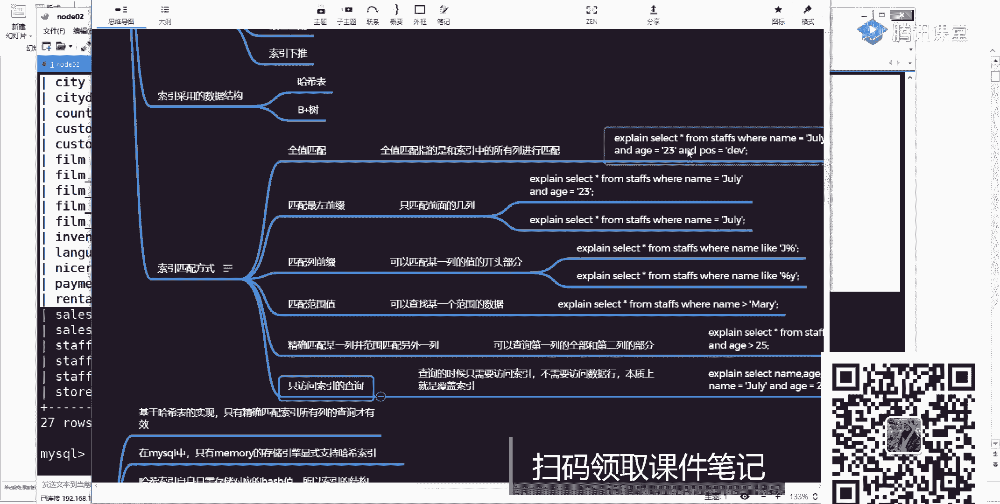

先看一个表，什么找的，这是谁呀，dsc st有这样一张表啊，id name age post s time，一共有这么多东西啊，这无疑用五个字段，然后呢可以看一下收音death from。

然后再写一个stars，可以看到这个表里面一共有几个缩影，听我的问题，这个表里面有几个缩影，几个，好几个说一两个吧，所以不要看四行径都是四个，所以你根据名字来判断k内，第一个。

这是不是还有一个组合索引列，分别是name age pose，又共有三个值，三个值，它们三个共同组合的一个组成的一个组合索引，所以我在进行使用的时候，就可以把这三个东西是不是进行一个最多匹配了。

是自动匹配，怎么匹配来着，我直接拿四口语句来运行，我是歪着写啊，太浪费时间了，a型看这一句是不是先匹配内容，再匹配，再匹配pos版，是这样的方式，来a型看一下执行计划。

他是不是用到了这个i d s n a p啊，是不是要这个东西了对吧，表示说我使用了当前这样一个主编，这是一个全匹配，全职匹配，同时后面还有一个列叫什么呢，叫k lx是啥意思，谁能告诉我这训练是干嘛的。

它表示的是索引的程度，听明白了吗，叫索引的程度，那么问题来了，既然是左引长度的话，这个140是怎么算出来的呀，啊怎么算出来的，注意这个在基因计算的时候有人知道吗，有没有会的实际长度，你就告诉我。

我通过计算之后，我怎么能得到140个值，怎么算预估吧，不是预估，不是预估你是一个组合作，意味着你是不是有三列，所以这时候你要看一下当前这个表的表结构了，内置pos是不是有三个，是不是三个东西。

这个时候24 20表示每一个字段的一个长度，然后我们在设计这个表的时候，一定会要指定一个编码，对不对，一般e都是什么，是u tf 8，一般是这样的东西吧，有的老师不是我们用的是mp 4，可以好吧。

u加八占的是三个字节好吧，j b k这是两个字节，如果你是拉丁的话，占的是一个字节，明白意思吧，所以我在进去算的时候应该是什么，24+20括起来，然后呢乘以三，这值多少值多少，是不是等于100多少。

32吧，没算错吧，一般在这儿还有还有什么，还有in吗，in是不是占四个加四，对不对，还有包含四个字是啥，四肢啥，别忘了，这里面要判断一下说我到底是否允许空，然后呢还会保留一些额外的长度计算值。

所以加起来之后等于是140，140，一会儿我们可以再做一下，其他地方，你看一下就知道了，这东西啊一般没人考，一般没人考，你知道大概的一个计算公式就行了，int不是11吗，占的是对应的一个字节长度。

就是我在存储的时候到底是占几个字节，明白吗，不是你那个意思不是11吗，不是11啊，你硬的类型最大范围是多少，你在java里面bat shot in the long，占几个字节。

你在世界存的时候是不是也要占四个字节，是按字节数算的，同学们，字节数算的不是那个长度，好吧，把这两条概念给区分开了，乘三是啥，那个是你的长度，表示说22呃，24+20是你规定好的一个长度。

规定好一个长度，每个长度需要用一个三字节来进行存储，所以要乘三，因为默认格式是ut啊，我们这儿指定是ut m8 那种格式，u t f8 ，所以这三个字节如果你设的是j b k的话。

j b k就占两个字节，如果你设的是拉丁的话，拉牛one就占一个字节，是跟你的字符编码是相关的，是相关的，好吧，这块你下去之后自己搜一下就知道了，自己做下去知道了，it里的11是什么意思。

11就是一个长度，其实就是一个长度，那个长度你就设了之后跟没事一样，没有什么影响，它最终该存的时候还是用四个字来存，还是用四个字节来存的，明白我意思吧，好吧，ok这是一块东西。

所以第一个是我们的全职匹配啊。

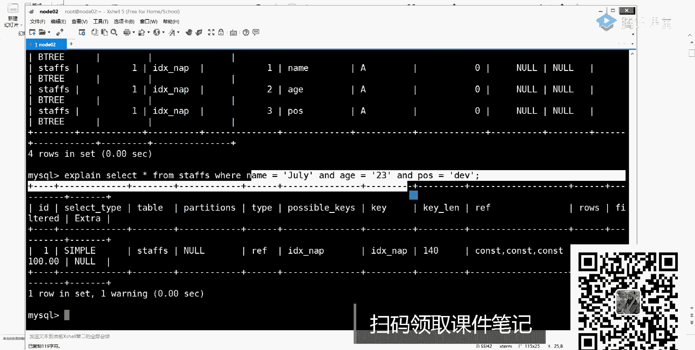

这注意一下，再来看第二个叫匹配，最左前缀这边啥意思啊，还有一些什么是空值所占用的一个长度，还有一个是什么。

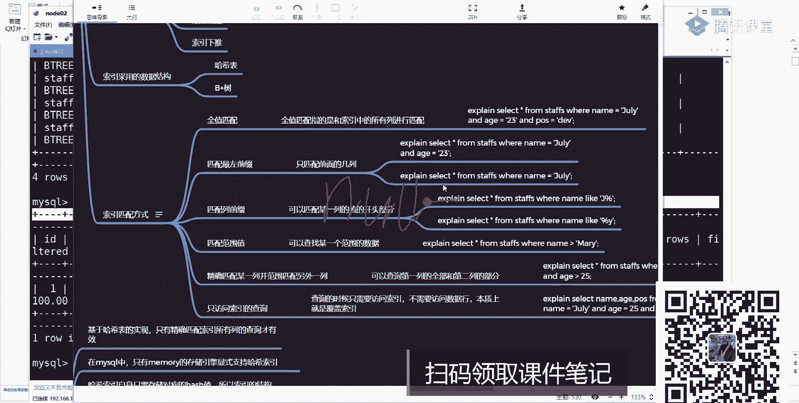

注意啊，你这个列里面是否是允许为空的，就是这些这三类语言是否是允许为空的，如果允许为空或者不许为空，它会有一些字段值得一个判断，还会有一些标志位，还有一些标志位，这一共是占了四个对应的一个字节四不定积。

所以加起来是140，一会儿我们可以再按照这样一个公式再做一个计算，这种计算大家说一下，我来说一下，我来说一下吧，这允许没空吗，这三个列这三个链是否允许非公，听到有问题，不允许吧，是不允许为空。

如果你这样不允许围攻的话，那ok我一个字节就不加了，就不加了，那个老师，那还有四个呢，如果你是vx类型的话，它最终会在最后的长度里面再加两个字节，再加两个字节，所以这个时候变成什么了，是变成24+20。

然后乘以三，然后加上40int，再加上一个往上两个字节，两个差是不是四个字节加4=140，等于140，这是算出来它整体的一个长度，明白我意思吧，如果你在允许为空了，允许为空啊。

我还要在每一列里面再多加一个标志位，或者再多加一个字节，懂我意思吧，就是简单计算公式，我们一会儿开再多验证好吧，这是不是140，这是全职匹配，现在我按照我们的最左匹配原则，我把后面的删掉。

这是匹配两列了，是不是两列两列我应该怎么算来运行，看效果是不是也用到我们的索引了，是要我们同意了，那这个时候我应该怎么算，是不是78呀，起码哪来的啊，我刚刚的公式第一个内容占24，所以中24x3=72。

没问题吧，72再加上一个是不是有个一一的类型，是不是加4=76，对不对，如果你是画叉的话，是不是还要额外再占两个字节，再加二，是不是等于78，这就是这个78这个的由来，听白了吗，来这块儿听到同学扣一。

就是一个非常简单的一个公式去算好吧，这种假赛之后自己看什么，面试的时候不会问到这点的，不是被问到这点了，ok画叉那个那不是八叉类型吗，那不是八叉吗，对不对。

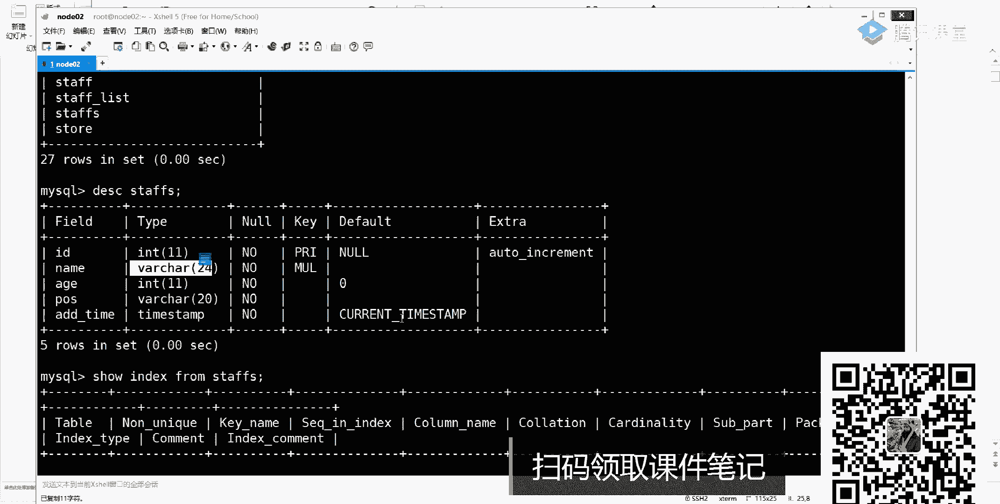

好了，加到这里好吧，加成这个样，再往下看再往下看，刚刚说了一个是全职匹配，一个是匹配最左前缀，最左前缀好吧，还有什么呢，叫匹配列前缀，这个列前缀又是什么意思啊，什么叫电子竞业前缀。

就是说我匹配其中一部分，匹配其中一部分，就好比我们经常用的这个live查询，把那个拿出来like。

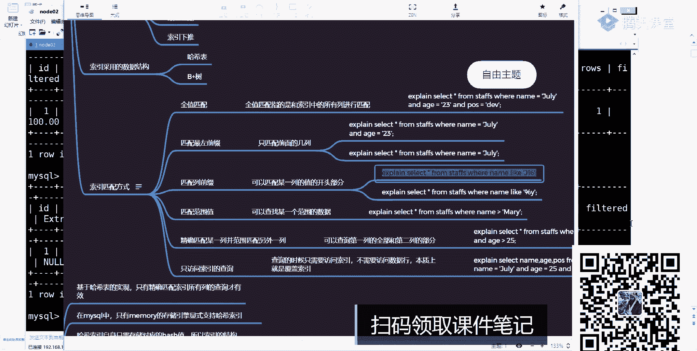

什么意思，是不是模糊查询，如果你在用lab的时候，你发现了，这是不是也用到我们的索引了，它匹配的是内部这个字算值name等于什么，这是等于74啊，哪来的七二十4x3，再加上20=74。

就算出来这个长度算长度，那这个时候他会用到我们的，所以但是如果你换一种写法，怎么写法，这样加一个百分号，你再运行，你发现还会用，所以吗，不会的吧，是不会的好吧，这个时候就会造成我们的索引失效。

所以你把第一个索引失效给我记住了啊，这第一个索引失效点一定要记住它，ok好，这是什么意思啊，表示匹配某些列的一部分叫列前缀。

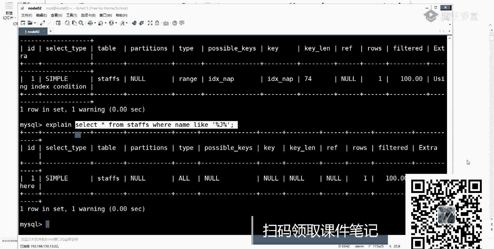

列前缀好吧，还在为什么你告诉我。

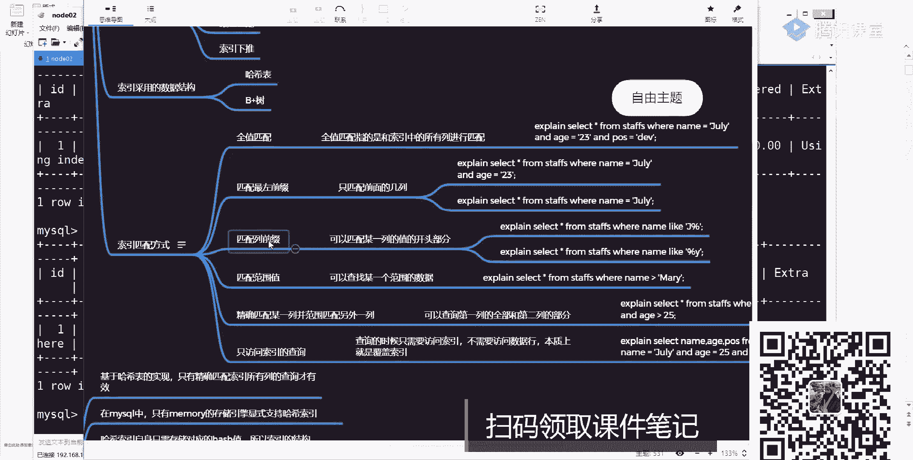

你写个百分号，我在进行索引查询的时候，我怎么查询你百分号是不是代表啥代表啥，一到n个字符吧，那我是不是所有东西我都能够匹配上，那你的索引还有意义吗，没意思吧，而我在前面没有百分号的话，是不是以g开头。

后面有多少无所谓，我只要能把g开头的东西，所以所以里面包含这个值取到是不是就行了，就这意思就这意思好吧。

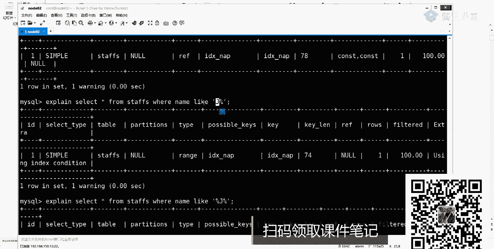

这一定要注意了，要注意了好吧，来再往下看，第四点，还有什么叫匹配范围值，这不说了吧，范围查询是不是也可以用到我们对应的一个呃。

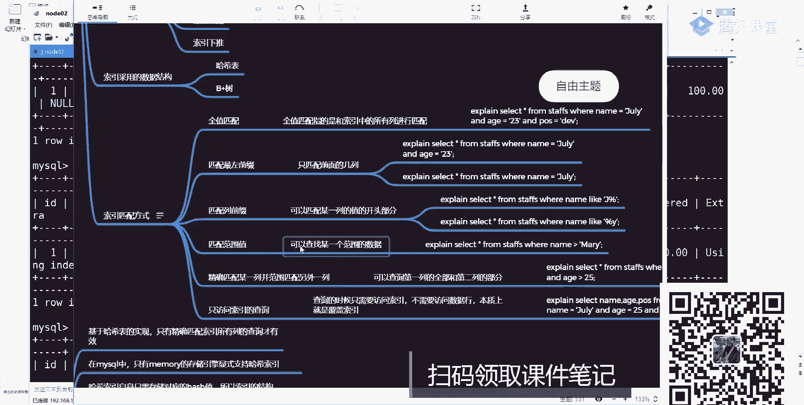

所以啊放一匹配，这不用我说了吧，来试一下这个语句啊，我们直接站，就昨天给你看的文档好吧，直接粘过来来运行，听到作业了吗，听到了吧啊这也会有我们对你一个索引，也就是说大于号小于号，它也会使用我们的索引。

而且这个时候效率是高的，为什么，所以在进行数据存储的时候，本身是不是就是有序的呀，既然有序，那我是不是就可以使用我们对你一个，所以明白意思吧啊这大家要注意了啊，这样的一个计算方式。

那我现在在写另外一个东西，在另外一个东西写这样的，大家一下name等于它，然后呢and的a值大于十，and的呃，真是还有一个啥来着，有name age pose是吧，pos等于20。

这个时候会不会用我们对这个索引，能说点高级的东西吗，有简单往难说好吧，会不会会吧，他会用几个索引，它会用几个索引，也就是说我们会匹配用哪些列吧，这时候你可以看一下是从哪列，78瓦。

其实法表示说我用了name，用了a是吧，也就是说当你在使用我们对应的一个组合索引的时候，一定要注意一点，如果你中间的某个环节，中间的某个环节出现了这种范围查找，ok后续的座椅直接失效。

所以这也是第二个索引失效的点，严格记住了，第二个数据是要点指纹匹配内部和a指指纹匹配内部和a啊。

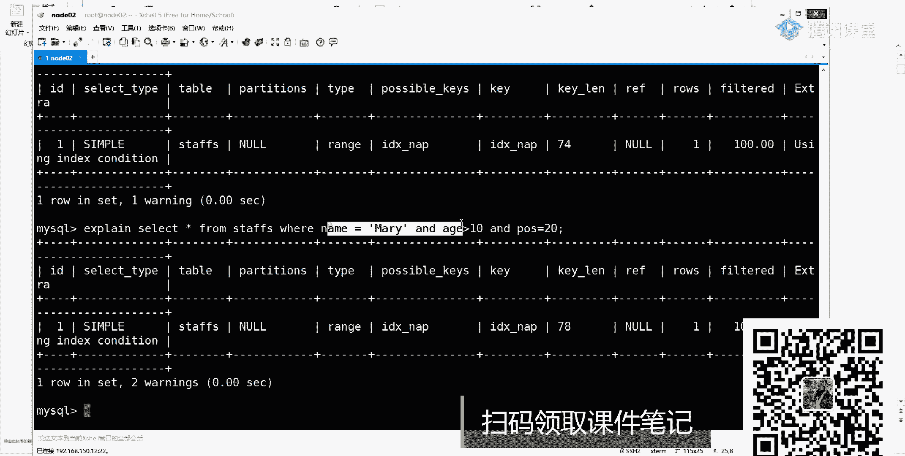

这大家注意的好，这个点啊，我们大家说一下好吧，再来看还有什么呢，说精确匹配到某一列，并范围匹配到另外一列，这刚演示了吧，这就是一个范围查询啊，也会使用我们对这个索引好吧。

再来看还有什么叫只访问索引的查询，这玩意什么意思呢。

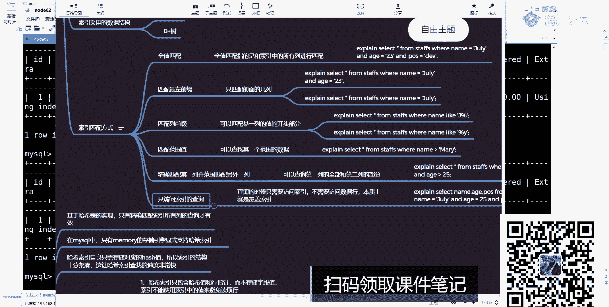

pos一前面去了，然后来看有这一个是吧，前面写多了，pose等于十and的大问题，这东西会行，所以吗，来看效果，一看昨天就没有听我讲的课，我昨天讲课怎么说的，是不是也是遵循我们作为制度原则。

是不是也会去调整我们整体这样一个顺序，我昨天有没有讲的东西，讲了吧，所以这一点啊我也讲过了好吧，所以下周还是把昨天的东西好好再听一下。

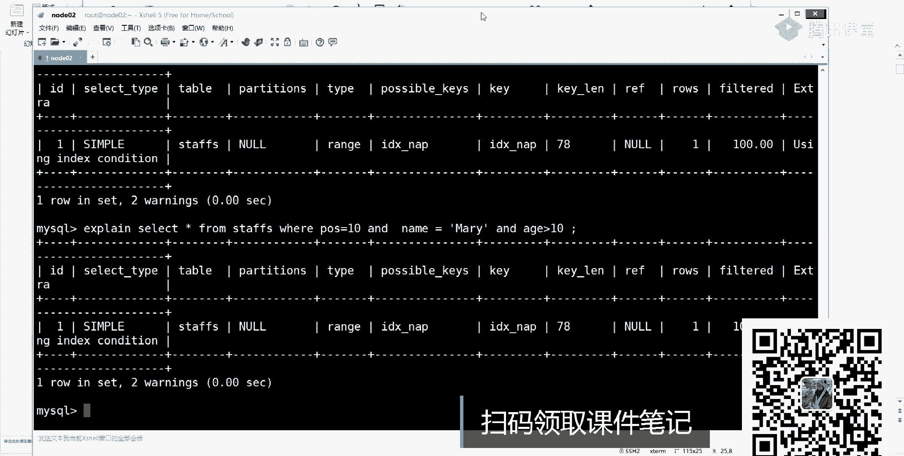

好听一下，ok来再来看最后一个说只访问所有的一个查询是啥意思啊。

这意思也非常简单，也就是说我们这个时候再进行查询的时候，看效果，看这个地方它是因为我们全部的一个缩影，看这块的话跟刚刚好像没有任何的一个区别，没有任何一个区别，但是但是你能够进行一个发现，发现啥。

你这举的例子是什么列name age pose，是不是刚刚好就等于我们对应这个名称条件的一个值，所以这个时候叫u z index了，所以覆盖对，所以覆盖啊，所以覆盖好吧。

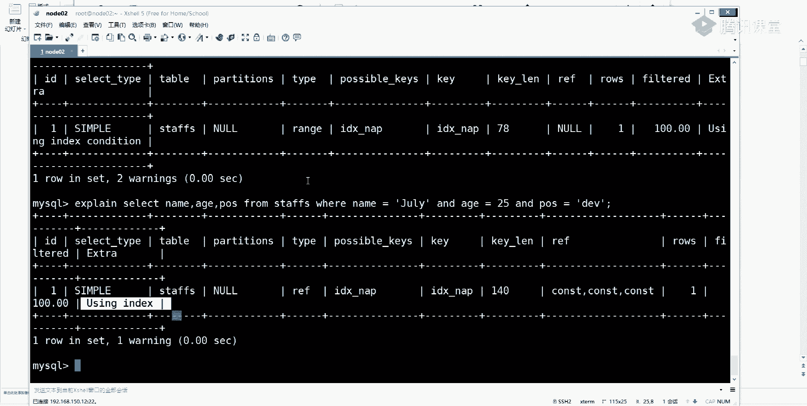

不是我们所有负担，所以这是这使用的六种左右匹配的一个方式，这块我希望你先了解了，来这个点没问同学要通过一，没问题吧，好了这个问题之后来看第二点叫哈希作业，还有个什么意思啊，我不说了吧。

在memory移动从中引擎里面会使用我们的派系所引，以此同时印no bb in no bb是是有有有什么演的叫自适应哈，希啊叫自适应哈，希刚才说了，继续哈，这表实现只有精确匹配到。

所以所有类的查询才会有效，那mac口中只有memory曾经引擎显示支持，还是索引哈利索引自称只需要存储对应的哈希值，所以所有的结构十分紧凑，这样哈希表查到速度非常快啊，是它里面对应的一些特点。

下面呢还有一些限制，还有一些限制，这些限制就比较重要了，好我需要跟你说一下，第一个说还者也只包含哈希值和行指针，而不存储任何什么叫字段值，叫字段，之所以这也大家注意了，不存储字段值，所以不能使用。

所以啊所以不能使用，所以值的值来避免读取行，比如说我匹配到那个哈希值了，我还是要读取我们具体的行记录，才能把数据给读取出来啊，这是第一个点是限制，第二个说到哈希索引的一个数据。

并不是按照索引值数据存放的，所以无法进行排序吧，没法排序，没法排序啊，这牌不用排队，我说了，说过吧，因为你是要根据你的哈希值来计算，导说我要定位到哪个单元格里面，然后从这个单元格开始进行数据的一个大学。

下面还有排列表，不支持部分列匹配查找，还得做演示，使用所有的全部内容来计算还是值的，所以必须要做一个完整匹配，就上面这写的是不是必须是一个全职匹配啊，必须把所有东西都匹配完成之后才可以才可以。

ok刚才说哈希支持等值比较，但不支持也不知是什么呢，找任何范围查询，昨天讲数据结构的时候，这东西已经说过了，好我也说过了，第五个啊，说了有很多哈希冲突的问题，所以你要设计一个比较好的哈希冲突算法。

第六个说他承诺比较多的话，维护代价也比较高，这东西几乎都是昨天说过的点，我们这儿来做一个回顾，也做一个回顾啊，这我有一个小案例来需要给大家演示一下，就给大家演示一下，演什么东西呢。

也就是说他俩说当如果你现在有一张表表里面，我需要去存储一堆的url，你告诉我u2 怎么存，幺二怎么存，你ur 2相当于是一个非常非常长的一个什么字符串吧，我们也说过了，你在进行数据存储的时候。

尽量去减少索引字段的一个长度吧，我昨天有个强烈点，我有没有强调说这个尽量去减少所有的一个长度，说了吧对啊，为什么，因为是所有长度越多，意味着你占用的所有空间就会越大，这个时候你的数据量就越大。

所以怎么样呢，会增额会增大我们整体的i o的一个量，所以这时候越短越好，所以就说了，你如果可以干嘛呢，如果你要存储u2 的话，可以干嘛呢，把这个资本值进行一个编码。

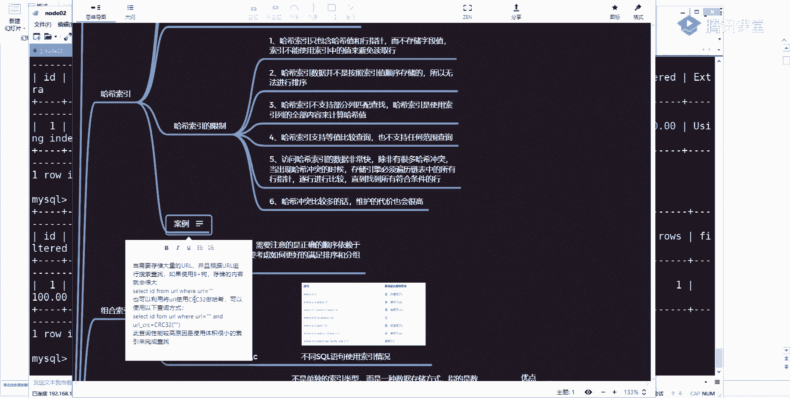