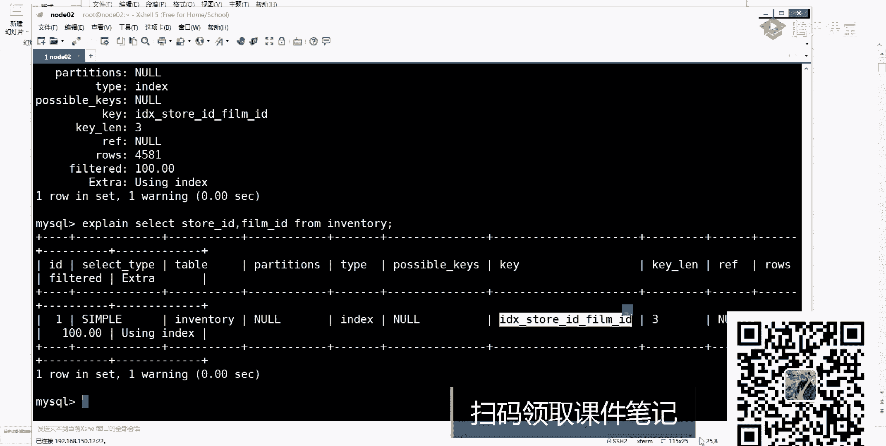
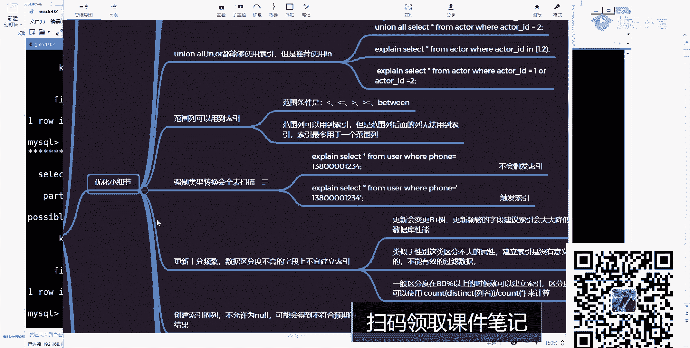
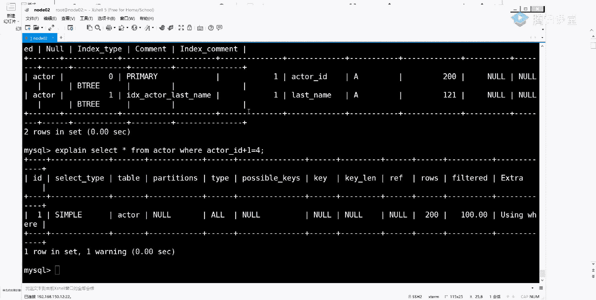

# 白嫖到马士兵教育价值23980的MCA架构师课程一次让你学够！ - P46：MYSQL调优：0.6 如何创建性能最优的索引 - Java视频学堂 - BV1Hy4y1t7Bo

还有什么叫c2 c32 ，有人听过吗，有没有人听过c23 32这东西啊，叫什么，叫循环冗余校验规则，对循环冗余校验规则，就是说当你用这样的方式进行一个加密之后，或者进行一个编码之后。

它会变成一个十位的一个整数，十倍的一个整数，有了这个整数之后，你可以直接存整数了，而不需要再去存储我们其他的一些很长的一个计算值了，整数占的字节数是不是就四个，如果你存字符串的话，该多长了，是不是意思。

所以这时候你可以用哈希的方式来做这样的东西来做这种东西，这东西啊很很少用，你大概听一下，了解一下就可以了，了解就可以了，之前我在讲那个大数据课的时候，我们在设计那个hbase的时候也是一样。

hbase里面有一些rok，rok字段可能拼了很多，为了减少这个长度，我们就用了c2 c32 这种方式来进行数据交易，叫循环冗余，数据校验规则啊，这注意一下就行了啊，这些东西啊好了。

这块我们都不再多说了吧，再多说了，这也不是我们重点，重点放在下边，下边下边再重点啊，这有优化细节，这是重点，然后再往上看，还有什么叫组合作引，组合作引，还有我听到吗，昨天是不是已经聊过很多了。

不聊了很多了，聊了很多之后，这我要强调一件事，想一件事，你看一个非常神奇的东西，看非常神奇的东西好吧，来看这个图，这样我画一个图，这图是什么意思呢，我我不改答案了啊。

就说我现在有一个表标里面有abc 3列，这三列创建了一个组合索引对吧，然后呢，当我在进行数据查询的时候，是否会用到我们当前的这个索引，并且用了哪几个索引。

是不是意思对百度有百度有百度有我一会给你也是一种情况，你看一下是否是一样的，如果一样，我就没必要说这些东西了，可能有一些比较好玩的东西才会跟你说好吧，第一个a等于三会用吧，a等于三，b等五会用吧。

a等于三，b等于五，c等于四会用吧，这是不是就是我们的最左匹配原则对吧，这东西之前我已经聊过了啊，再来看这种东西叫where b等于三or这多了个where or c等于四，这个东西会不会走我们的索引。

我这同时也有一张表。

也有一张表好吧，什么表呢，叫select先from a b c啊，d i c a b c，那我们来看一个表，分别是a b c是不是33列，然后呢可以看一下叫show index from a b c走。

是不是这个点对吧，都建的是统一一个缩影对吧，那我现在运行一下叫一个select 7 from a b c，where a等于一，然后呢2b等于二，它会不会使用索引，如果使用索引的话，会用哪几列。

这其实就注意到一个问题了，昨天有同学问我说，老师or到底会不会使用，所以奥会不会这样，我们来解释，我来解释会不会会用谁ab对吧，a b来看效果走，他这个地方他用的是谁，用谁。

是不是用的是15 15是什么鬼，记住我之前说的那个计算规则，刚刚为什么要讲计算规则，现在这a b c全部都是什么类型，一个类型吧，in的类型，再来是四个字节，对不对。

四个字节你是怎么给我凑出来15这个值的，怎么做出来的，11+4，别扯了好吧，哪来的11啊，任何一行就是四个字节，哪个是我，4x3+3 int需要乘三吗，同学们这儿我告诉你怎么计算，告诉你怎么计算啊。

本身int本身int是占四个字节，这没问题，加起来是等于12，这为什么有个15这个值原因非常简单，我也说过了，如果你的列值允许为none的话，我需要多额外加一个字节吧，你看他这个表于是维护吗，允许吧。

三列为空是不是加三，刚刚是不是相当于是4+4+4+3是不是等于15了，你看蒙老老师不对啊，我现在只写了一个a，只写了一个b，你是怎么给我算出来a b c的，我都没有c那个列，你给我算出a b c了。

对不对，这东西怎么做到的，为什么会出现这样一种情况，来我再看一个东西，牛，因为用了索引，不是不是不是不是来再来看，再看另外一个东西，再看另外一个东西好吧，d e s c有一个表叫a b c2 。

这个表格刚刚表差不多啊，我多了一个字段叫内部，多了一个name字段，多内部字段，这时候你可以看下受index，from abc 2是不是还有组合作业a b c吧，是不是a b c。

这个时候我再把刚刚那个语句拿过来再运行一下，你看效果，看效果好吧，叫explan slide in from a b c2 ，where a等于一，b的二，b等于二。

这个时候我有使用我们对应的一个缩影吗，没有吧，你对比一下两张表诶，为什么呀，为什么上面这个效果是这样的效果，而下面这一条是这样的效果，这是为啥，所以这才是你思考的问题。

我如果只给你展示那样的一个情况的话，对比一下，对不对，我如果整体展开刚才那个情况的话，没意义了，所以一定是有不一样的地方，我才给你做做演示，如果一样的地方的话，我给你演示都能干啥，没意义了。

没一个明白了吗啊，所以这给大家说一点，说一点，我们一般在创建表的时候是不会出现这样这种情况的，就abc这种情况的，那啥意思啊，a b c一共这个表里面有三列，我把三列统一都做了一个组合索引。

这个时候不管你怎么去查数据，我都会去占用我们对应索引的好，都会去占用我们对应一个索引的，这时候大家不注意，大家注意是不是叫索引覆盖就等于代词吗，但如果你现在加了一个内部的列。

这个时候我用or的时候还会用，所以吗，不会的吧，那这个时候同学得到一个结论，什么阶段说老师我在使用这个奥查询的时候，他不会走，所以这句话对吗，只差a也是15吗，来实践出真知，是多少，这多少五。

你只差一个a的时候，用的是谁，又是谁，又是a吧，你这不出现其他列了，所以又猛了，老师，那为什么这就出现了，来换一个再换一个and的c等于四，看这块啊，我现在这个是组合座椅，应该是什么。

是不应该是最多匹配，这个时候我是不是应该也出来是是什么，是五吧，来看这个结果，看结果诶，这为什么又对了，他为什么对了，那老师这是什么情况啊，怎么一会动一会不动，到底啥意思，他这种情况到底是否匹配。

我们对你一个最多匹配原则起码有问题啊，这种情况是否匹配，最多免费原则，皮肤匹配，匹配吧，那这时候来往下看，我再换一种情况，再换情况，这写一个b等于四，如果b等于四的时候。

这个时候你告诉我我用的作业是哪个作业，哪个作业，来看效果十吧，这就对了吧，是不是就对了，好这时候大家能看到我们对应的一个效果了吧，那为什么上面这块儿这诶哪去了，再改一下啊，哦来看啊，我现在把它换成o。

然后换成or换成or之后，你再接着看，当你换成or之后，这会变成什么东西了，and是不是没问题，你使用and的时候是不是最遵循那种最多比例原则，但如果你使用out了，这谈遵循吗，还在学吗，不能学了吧。

做做行了吧，所以这时候在组合作业里面or是个比较特殊的东西，它会把我们这种情况都给我们做一个演示啊。

这这种特殊情况特殊情况明白了吗。

特殊特殊为什么，这哪有什么为什么呀，这东西没有啥，为什么好吧，就是我在进行数据检索的时候，当你匹配到说我有20个字段的时候，我会在我们全部的所有链接直接进行一个数据查找，我直接进行数据查到。

而如果你把它换成一个and，这时候就跟我们昨天讲的那个图匹配一模一样啊，最左匹配一模一样，一模一样，所以有的老师or到底是否要走，所以我可以这么说的，我说哦是否走，所以你要根据具体情况去做判断。

好进行了去做判断，在你如果这些列里面，在你列里面如果全部就完，如果全部都是组合索引的话，这个时候他是会走索引的，做错了，而如果你再换一下，看哪儿，我换一下，我把它换成二二，是不是多了一个内部字段。

多一个内部阻断，再看效果，这不就可以吗，不会吧，我再画再写一个and的c等于四，再一个系统会有作业吗，不会吧，不会了吧，所以当你带了你的普通列之后，带了普通列之后，如果你也是一个组合索引。

这个时候or是不会占用的，or是不会走索引的澳洲波子做一个，所以这点希望大家能够把它给分清楚了，听清楚了，如果不查普通电呢，来帮他看，他说老师我在后面看同类了，差什么，差a多少，b多少c这样的吧。

再查下来看效果，他会懂吗，会吧，这个时候就会懂了，你只差普通列是不是跟我们刚刚那个表一模一样了，是不是刚刚表现不一样了，这个没什么区别了吧，没什么区别了，所以你在查询普通其他列的时候。

这个or可能不会触发我们对的一个索引，两个a的号码是啥意思啊，好同学说这两点，你看这好，这个同学非常好啊，他应该看了一些资料，a等于三，他会不会做索引，嗯是谁问的，艾德里安，艾德里安会有关键吗，会是吧。

来看我们对应效果好吧，会吗，所以一会儿我给你解释什么时候会走索引，什么时候会走索引好，下面会显示这个情况，下面会显示这个情况，到时候演示就知道了，但最起码这个情况是不会走的吧，所以你得到一个结论。

得到一个结论表，选错了就是a b c2 ，你会把一个表里面的所有字段都建成了一种组合，所以吗不会的，不会的，你a b c的话就没意义了吗，你这有啥意义啊，那这有啥意义啊，这没意义了嘛，对不对好吧。

所以这块我希望大家能够注意了，希望大家能注意了啊，就是说如果你是一个组合索引啊，并且你的组合索引只占了你当前表的部分列，这个时候or是不会走我们对应的一个缩影的啊，不会走对应一个索引的这块东西。

你下去之后我再演示各种情况，你需要把这些东西下去之后，自己做一个总结。

如果只查询字段a呢，只差3a你还能用到on吗，你是不是用不到，用不到这个号了，是不是意思好吧，注意啊，这种情况下or是不会走索引的，一会我给你演示，刚刚同学说的，老师a等于一，二，a等于二的时候。

什么时候组合引，一会儿我们来演示，一会我们来演示好吧，我记住这记住这记住这好吧，ae就是又了解了，来看一下吧，where a in括号一，括号二那么多合理吗，后面都拿来看，这是一个页码。

跟奥运什么关系啊，这是什么a b c2 吧，是不是在内蒙一次段，这是a in一逗号二，会不会走，还说会吧，这这是走了吗，没走啊，没走吧，所以接下来同学问我说，老师我这个东西有没有走索引，我怎么判断呀。

你具备了一定的理论知识之后，你是可以做判断的，但是在数据库里面，数据库里面会有n多种的一个情况，会有n多种一个情况，你要对这些情况做一个整体的分析，明白吗，整体的分析我说了。

当你在使用这个a逗号b逗号c，如果一个表里面只有这三列，并且这三列是组合索引的时候，做作业的时候它是一种特殊情况，好一般你们在生产环境里面是看不到这样东西的，看好两东西的。

而如果你是一个a逗号b逗号c组合，所以还包含了内部或者其他类型字段的时候，这个时候你的or是不会参与整个索引的一个呃，是不会有索引的，是不是做索引的好，这里要注意的一定要注意了，ok好了，就这块东西啊。

一会儿我来跟你们说一下，为什么那个奥什么时候做作业，我也想知道y这东西是跟对应的一个优化器去做一个合理判断的，知道吗，是给你优化器去做一个判断，跟优化去做一个判断好吧，同学说了说不包含沃尔条件。

在这一点浪费时间，浪费时间够多了好吧，我们这边再多聊了，现在之后自己去演示各种情况。

演示各种情况来看一下，刚刚我给你展示这个图，同学们都说老师我知道的东西，你真的知道吗，一个or给你测出来，扯出这么多问题，接下来之后自己去看一下，自己看一下，ok现在说了，a等于三，b等于四。

是不是直走a对吧，a等于三，b等于十，c等于七，是不是只会走a和b，然后a等于3b like，然后c等于什么，是不是只会走a啊，就这样一个情况，这样一个情况，这块大家听一下就行了，大家听一下就行了啊。

这是我们对应一个组合索引，记住我说那句话，就我说那句话，当你一个表里面的全部列都是组合索引的时候，这是一种特殊情况，而且在组合索引里面all是不会走索引的，听明白了吗，刚刚那句话听懂同学给老师扣一。

我就是为了给你演示那种特殊情况，这个表其实很简单，昨天我都讲过，都演示过了，就为了说这个out的那个点，一会儿我们来演示or什么时候会走索引好，会不会一会我们来演示这个点，ok好来再接着往下看。

小一点好了，这是我们的组合作用，a b2 c呢。

倒数第二行为什么只走ab倒数第二行是谁啊，倒数第二行这个啊。

你说你说这个是吧，a等于三，b大于十，c等于七，你中间如果出现这种范围，查找了，是不是会阻断我们整个这个组合，所以是不是只会匹配前面，后面不管你写什么都不会做缩影，这东西我昨天已经提到过了啊。

就想过了好吧，这款东西昨天我聊过了，如果我们一会儿同学下一周后可以好好来看一下啊，是这块东西啊，来再来看下一个点，叫剧组缩引和非聚簇索引，分居组是啥意思，就不用我说了吧，虽然我解释过了，什么叫巨促啊。

什么叫分居促啊，它表示的意思是说我的数据跟我们的，所以所以是否是组织在一起的，是不是组在一起的，如果你做起来存储数据叫做句作业，如果你不是一起存储数据的，就是非剧组作业。

所以你发现在mysql里面innovb这种存储引擎，innovb啊，这种存储引擎它用的是什么，这不是我们对于一个剧组作业，而如果是my son的话，那就是非剧组作业，你通过它文件的一个组织形式。

也能够做到这样的一个判断，做这个判断啊，这这个点这不再多说了，ok就这个点再看下一个点叫覆盖，所以是啥意思啊，那说过了吧，如果我的查询列里面，比如flag后面这个字段。

字段里面如果包含的值刚刚好是我的索引列和查出来的那个主键值，所以啊所以如果你sl后面那个字段刚刚好是你的索引列，加上你查出来那个主键值，ok这个时候会触发我们的素性覆盖，就不会再走我们队里一个回表了。

是不是这意思啊，这我昨天已经说过了吧，好吧，这样在做的时候可以减少一次回表，也就是说会减少n多次一个i o吧，是不i o这儿也有一些。

所以覆盖的一些案例，这个文档说过了啊，我一会发一会发，写下来之后，你自己去看一下是什么，来看这个看这东西，还有案例，这什么案例啊，还是一样，我们来打开我们当前这个数据库好吧。

select，index，1v一提高看这这是一张表，这个表里面呢有有123个吧，是不是包含了三个索引，三个啊，也就是三个索引这个问题吧，一个组件，一个是单列索引。

一个是组合索引，用，包含这几个，放这几个之后，我现在写一个这样的词汇语句。

诶，没看到啊，我先再来最后一句。

那你告诉我他会不会走，我们对立一个组合作用啊，听完问题啊，这会有重新覆盖吗，会不会，会有说不会的吗，你说不会了吗，会是吧，来看具体效果，看到这儿有一个possible k等于它，然后一个k等于这个值。

这是i的，是不是我们创建了一个组合，所以这个组合索引是不是就是spd和fm，所以当我们在进行数据查询的时候，是不是直接会走我们队的一个什么复合复合索引覆盖吧，是不是用类似断了，这是我们实际的一个k值吗。

如果你这样看不舒服的话，把它干掉，这样看看，这弄好了吧，说不定到我们当前这样一个字段值啊，把它直接取出来之后，只是就掉了，这就掉了，这是我们当前这个组合缩影，只在一个组合索引啊，所以这种方式也会有的。

它不会触发我们整个的一个回表，这个战术有什么写，叫using index嘛，in death，对没有查询其他特pk有啥用，pokey表示说我在整个查询里面可能注意是可能会使用的索引。

这个时候他通过他的一个执行计划推断之后，发现说我没有什么东西可以用，因为你后面没有条件，但是我在实际取数据的时候，因为你的叶子节点里面，叶子烟里面是本身存储的，就有这些作业了。

所以我是不是可以把这些索引值直接都拿过来，是不是直接拿过来，别忘了啊，直接组合索引不是主键，所以这两个索引是不是也会建一颗b加数，那我是不是只需要把当前b加数里面这些值都取出来就可以了。

而如果在取的时候，你就发现了叶子里面本身又都是有序的吧，所以我是不是可以把e的点都取出来，我还需要回表达行吗，我还需要从上往下依次遍历吗，不需要不需要，所以这时候我推断的时候。

推断的时候不需要在适应用的时候，可以直接从我们当前叶子节里面返回数据，那这时候用到了我们的，所以时代就是这个意思啊，这希望大家能够认识到，你能认识到。

好吧好了，就这样的一个问题啊，来再往下看看有啥第二点。

第二次后一句看这一句。

还有一样叫show index，from either，他这个表里面这个表里面有几个，有几个那个索引啊，两个吧，一个是primary，一个是index actor，last name。

是不是两个这样的一个值，是不是像这样的值。

这两个作业啊，作业之后，我们现在再演示一下刚刚这个语句啊，转过来。

就是这时候你来看一下它会用我们对应的一个组合作用吗，他是谁啊，他是谁，他是谁，是不是x i d查得拉丝内容吧，这两个列是不是刚刚好正好是谁，正好是谁，是正好是这个辅助位，你看啊。

这个东西是主线作业是没问题的对吧，这是什么呢，这是那个普通座椅吧，或者说叫辅助座椅，或者叫二级作业，是不是这意思，那我再根据我们这个拉斯内普通索引区进行查找的时候，我是不是能根据它取为一个主键值。

而那个主键值我所需要的是不是刚刚好在这边，就在这里面，那这个时候你告诉我会不会又分覆盖回表，我这东西需要回表吗，这个需要回表吗，这不是都有数据吗，我根据内部查的时候是不是能返回一个ip值，id。

是不是主键，我查是不是查的是不是主键，查是不是另外一个列的值，这时候我们还需要吗，再好看是不是到这个缩进，是不是就到这个值了，那这时候不用回表啊，不用回表，不需要回表。

不需要还站着出来，这是我们所覆盖一个案例啊，所以暂时不需要我们这样一个回表。

如果我要画一下怎么画啊，能改一下，看这啊，我改成这样的方式，看到了吧，我只能force这种fm，大家把预习了，看这地方这两个语有什么区别啊，老师我都用到索引了确认方法，但你好看，最后一个列。

这一个是什么叫user index，一个是什么叫n in the index，表示用到了索引覆盖，而none表示并没有进行一个使用，所以这是它们之间的一个区别，这是不是意味着下面是不是要进行回表了。

而上面这块是不是就是不回表，明白我意思了吧，好来这个点题班同学老师扣个一，两个案例一对比就出来了啊，就这块好了，这点所以它也比较简单。

也不难好吧，来往下看上面这些点啊，都是我们昨天讲过的一些东西，只是做了一些呃详细或者更细致的一些说明，下面这些东西就是需要你们具体去掌握的什么东西呢，就是我要写的名字叫优化小细节，这里面都是细节点啊。

都是细节点。

为什么查意思不会表达啥意思，查什么意思，哪有意思了，谁说没没看看你是什么意思好吧，为什么查id不回表，你根据内部是不是能直接匹配到我们对应的一个id值了，那我还回表干啥，你根据内部是不是能匹配到id。

你告诉我还回表干啥，你要回回秒了吧，是这意思，这一看昨天昨天没听课，你看昨天没听课好吧。

就大概知道什么意思，ok这块好，来我们把这块讲完，把这块讲完好吧，这东西还是比较多的，来往下看，第一个点说，当使用索引列进行查询的时候，尽量不要使用表达式，把计算放到业务层，而不是数据库层。

这句话是什么意思，刚刚我举了两个，所以失效的一个案例，还记得吗，那两案例所以失效，你给我说一下，我刚刚讲到，所以失效的时候有什么样的一个案例，lap范围吧or吧，然后呢这个大于的时候。

是不是会把后面的一个组合组里面的东西及视角，这儿讲另外一种视角的一个方式，就这块来看这两个语句。

看两句，我要写这样一句，这肯定能查出我们对这个数据结果对不对，然后看一下我们对于一个执行计划不出来，意思好吧，等于行，这是不是就我们组建了primary，主键索引就要逐渐缩影啊，现在我在做一件事。

这写一个a d加1=4，这句话是什么意思，然后往上看，这也是我一直没有想明白的一个点，我到现在我都没想明白，我现在都没想明白，来往上看什么意思呢，说insplslid from actor。

where actor，i d加1=4，那其实相当于x的id是不是等于三，你这样是不是加表达式，加表达式之后，按道理说，按道理说听懂没有听懂没有意思啊，按道理说这个时候我是不会读索引的。

因为我这是不是有个primary，他是不会就不会有对应的缩影了，但这个时候你会发现他用了一个什么索引，有什么缩写叫i d s艾特拉内，是不是这样算是用到了组合作引，index from。

这里面你告诉我哪来的组合作业，哪来的组合作业，有懂可以吗，看我的意思啊，看这儿有多作业吗，primary内幕吧，那这样为什么在进行匹配的时候，我查的是i d值，为什么是根据我们当前这个内部。

所以去找做去去走呢，所以说老师我能猜到这是查了id吗，因为你查id，因为你查id，所以我就直接去d里面进行一个查询了，这种解释好像能说得通，但是我为什么要走这个b加数呢，对是是这样的，所以说的很对啊。

我把这个换一下，换成星是不是就不走了，是不走了，看着歇着就不走了，但你发现了，当你在查询另外一个字段的时，候，另外一个字段的时候，他反而去走另外一个缩影了，这个时候我能给到的唯一的一个解释是什么。

解释是什么解释，当我在使用这样的方式进行查询的时候，本来本来我是需要去主见b加速里面挨个去便利主见的，从根进来开始挨个进行一个便利，这很明显很麻烦是吧，现在因为我有一个辅助，所以我有一个辅助索引。

这些辅助索引里面存的就是内部和id，而本身的叶子连里面存储是不是就是当前的一个id值，所以我直接去遍历当前的一点点，我就能够把我们当前这个id值给取到，所以这个时候他告诉我说我用到了当前这个辅助作用啊。

这是我能给的唯一的一个解释，但是到底是不是我这不确定明白意思了吗，刚刚也是了吧，如果查不是s i d的话，那肯定就不会用了，就不会有分类了啊，所以这是也是一个特殊情况，也是特特特殊情况哦。

对这东西确实得看源码了，所以你们所以你们在做这种，所以判断或者做所选择的时候。

一定要去看具体的执行计划，如果你脱离一个执行计划，给我发过来一个sql语句，是老师他会不会走索引，我觉得你在耍流氓，不应该逗我，因为这里面异常情况太多了吧，光我刚刚给你演示出来多少异常异常情况。

都是不太符合我们正常的一个理解，对不对，所以这时候会有问题啊，这时候会有问题，明白我意思吧，所以这点希望大家能够认识到，明白意思了吗，所以你下垂不是讲过重新下篇了吗。

没倒数，你下去了好吧好了，这这块有东西啊，这块有东西啊，东西好了，这是第一个点，那老师，那如果这样算，这样的话，是不是用表达式了。

来往下看啊，还有同学说这样一个法什么用法呢，他这样写的还是这个值很多，a d等于4+1，这种方式算不算用组合，所以不算不算用我们的表达式这种方式算吗，告诉我好了，同学们都知道算了，这块确确实实不算。

你可以来看一下，他说会做我们专门，所以这不算好吧，这不算，这就是一个表达式，一个计算好吧，跟我们整体这个判断是不一样的，它不会造成所以失效。

所以两种情况要分清楚了，是这块来这个点过了，pass掉好，再来看下面一点说了，尽量使用主页查询，而不是使用其他索引，因此因为因此主页查询不会触发为表操作吧，这句话是什么意思，这句话什么意思。

这儿我需要强调一件事儿，就是关于主线的问题，你们在公司里面在建表的时候，一般情况下都会来设立组建，你告诉我你在创建组件的时候是怎么来创建的，u i d还有吗，自从。

