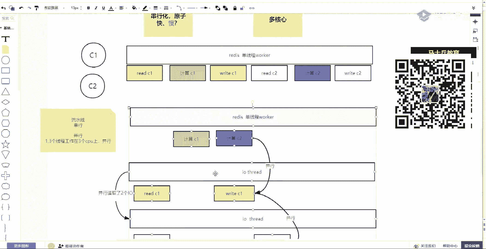
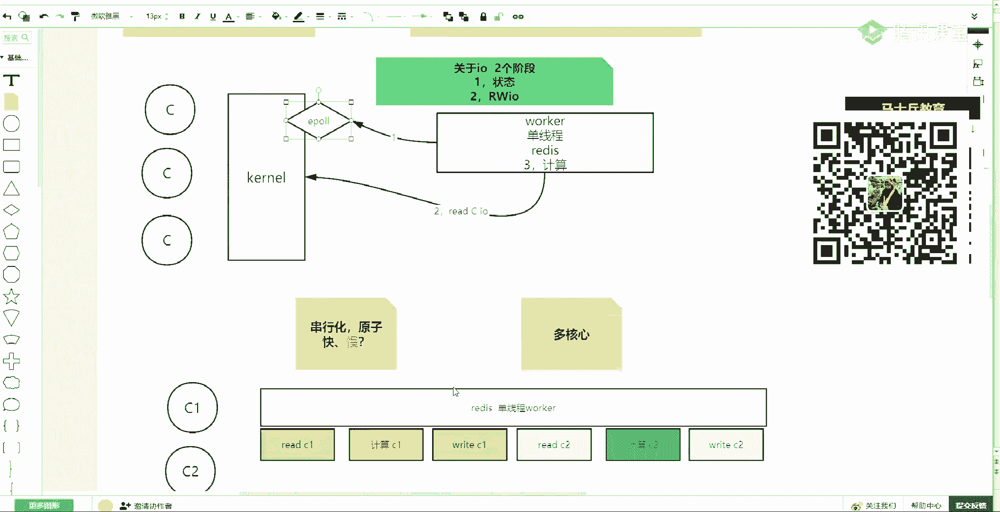

# 系列 2：P49：redis合集：1、Redis的5大Value类型解析 - Java视频学堂 - BV1Hy4y1t7Bo

你就会就是如果你穿的东西特别大。

然后想导出在别的地方导入的话，这个可能要花费1年才100多好111 200块钱吧，不贵，在在座的都是这个身家，对不对，都是身份证的人对吧，嗯好了，今天要讲什么东西，这两天主要讲什么东西啊。

redis为主redis，那么，越发的现在这个rise重要性很强啊，这个尤其在现在找工作，面试和你工作中，他的这个地位是越来越突出了很强，很长的一个小一个小东东，就是一个小东东。

但是围绕redis可以讲的知识有一大票的值，从计算机最底层的通信io模型，到他的单机使用集群，使用分布式，然后解决分布式当中的一些事情，然后解决你这个整个架构当中的流量问题啊，缓存问题啊。

性能问题其实都离不开release这个小东东，然后之前让你们看过一个预习资料，我在这强调一点，没看过的，你回去必须要看这个预习资料，不要认为他预习俩搁这不值钱，这个预习资料当中有从源码编译，安装。

然后最主要的是讲到它的因果关系，为什么有这个redis，然后release一些简单的一个特征，以及最主要的一个环节是有一个关于io这方面的，尤其讲到了操作系统底层的n o b l o到多路复用。

一炮的一个发展历程，而且我们redis也好，然后n x要很多技术使我们都是依靠这种多路复用的好吧，这个预习是必须要去看的啊，必须必须必须要去看，就光这个预习你如果看完的话。

其实这些这块的知识都能让你在面试当中增加很多的分数，这是第一个预习资料，要看第二个，你对redis必须有一个认知，我们做一个小小的一个总结，然后总结之后，今天先说啊，今天今天要讲什么东西。

今天是主要围绕它的使用场景，release可以应用在哪些场景当中去啊，这个东西很值钱，很重要，这是我觉得专业当中相当相相对来比来说比较比较重要的一点，为什么，因为你在面试的时候，这个面试官都会问你啊。

你你用过redis吗，你用过，那你拿出来这是干什么用啊，啊以及你比如说咱们好多报名的小伙伴，以及咱们在座的都说还我，我现在这个之前做开发一直是传统单机项目，sm传统项目。

然后我感觉现在公司一一看招聘信息，就是要一些什么分布式的微服务的，然后这个项目我也没做过，好这个好担心啊，其实如果redis它的场景主要场景你会了的话，那其实把你的现在手头这个项目改一改。

那这个感觉就不一样了，出去面试的时候，其实面你项目的时候，你只需要说我在里边用了某一个技术，这个技术你了解的很透彻，方方面面很多场景都用它代替了曾经的简单的c l o d的话。

那这个时候其实你的感觉是不一样的，好吧，所以你要重视这个学习的过程啊，先走一个小小的总结，对这个开始使用之前，我们先对redis宏观上有一个认知，那么redis是一个什么东西，看过预预习资料。

我咱们一块回顾啊，redis是一个什么东西啊，是基于内存的，然后它的性能为王，它主要是性能为王，速度快，对吧，这是一个很简单的一个描述，另外一个呢它是基于建制对kv的，这样的一个存储模型。

然后呢它是单线程的，the worker，是单线程的，就是他的工作线程只有一个啊，然后呢它的io底层网络通信，i o就是它是支持多客户端的并发的一种注意听是并发的一种访问，是并发的访问。

并发是通过一炮这种多路复用来解决io的并发问题，因为有两个词有两个词汇，一个叫并发，一个叫并行，然后并行的另外一个反义词叫做串行，redis是能够解决io并发，但是还是串行的一种技术。

这句话能听出来刷波一，我看他有多少能听懂，就并发redis是一种并发的啊，但是它并不是并行的，它是串行的，有录播吗。

有咳咳咳，那么先就这一块，我先在使用之前，先把这块的整体的给再给大家说一下它为什么性能好，速度快，然后呢它的一些特点是什么，首先如果从拓扑模型来说，拓扑模型也就是说我们会有操作系统啊。

首先你要知道一个kernel内核，任何程序是和内核打交道，才能够使用我们的人的网络硬件等等，然后你有很多并发访问，这些客户端是并发的访问，并发的访问的连接到达看到之后。

然后又会有在qq里边会有很多的这种socket，然后我们的就有点小是吧，放大一点，现在可以了吧，然后我们的redis是一个只说他的worker线程，walker是单线程的一个单线程的一个redis。

一个worker，他工作的时候是怎么工作的，我们先从宏观上来说，就是你要了解一个程序的特征，它是如何工作的，第一件事情，redis在io上用到了内核提供的多路复用器，一炮，那你出去面试的时候。

最简单的回答方式就是用最简单一句话来总结的话，就是第一步，redis这个程序通过内核的一炮获得了，知道了有这么多并发的客户端当中，哪些客户端有实际的数据到达可读可写，这是第一步。

一定要把这事情的12345想明白，他的其他的模型，你才能才能接受啊，就是这个县城的工作的第一件事情，如果他写了一个死循环，每循环你的第一圈儿里边儿，然后他要做的一件事情就是先掉下一炮，然后这块儿没听。

就是这块如果你没懂的话，证明你预习资料没有看，回去看预习资料我都讲过什么是e破了，通过e炮先知道吧，比如有三个客户端，那知道说哎这里边有两个客户端已经有数据可读了。

那么redis就可以通过e炮知道有两个客户端，两个socket可以去读取，第二件事情，重点的事情来了，你的redis会通过自主的在这个单线程里边，下一步就会真正的去访问内核。

要先去一个一个的one by one的线性的串串行化笔处去去读取，我们的客户端的这个io里边的数据，就是读取数据是第二步，读取数据12，第二步，而且这个读取的时候先读一个客户端给你读进来，然后处理。

所以第三步是在它的这个单程里边，第三步是一个计算的过程，这个计算我用记得那个词来代表啊，那这里这边可能是客户端发了一个这个increment加一，或者是set get等等一些操作。

这个操作会在这个线程里边，第三步执行处理完之后呢，然后再处理下一个客户端，再去读取，总的来说有123633个步骤，这是他的一个拓扑模型。

这个能看出来是不一。

好吧，而且这一定要记住了，关于io上，在这儿一定要总结出一件事情啊，这个很值钱，你之前没有没有关注过，因为这个之前直接使用现成的，就光io上有两有两个阶段，关于io它是有两个阶段的。

第一个阶段是有没有数据的一个状态，就是一共有这么多客户端，连我那谁可以读，谁可以写这个状态，这是第一阶段，第二阶段是有我拿到了有状态的之后，我要去读写，读写io是第二个阶段的事情，这还小吗。

这样自自带就可以了吧。

这是第一个拓扑图，这是第一个拓扑图，更深的东西啊，更更完整的东西去看这个预习资料就可以了。

另外一张拓扑图，这是第一个拓扑，第二个拓扑图就是它的工作模型。

工作模型的详细的这个过程，就把第一个阶段获知一破的时候给它屏蔽掉，如果你还是有很多的客户端，因为你是单线程的，把内核也去掉了。

连内核里边那个多路复用器也去掉了，如果你的redis是单线程，那么它的串行化这个worker单线程是怎么工作的，如果redis是单线程的，如果在客户端当中用两个吧，有两个客户端，一个是c1 。

一个是c2 ，数据都到达这台计算机了，但是因为它是单线程，它不能并行的处理它们，它只能串行的，所以他的第一件事情是哎，我先去读取read，然后c一的数据先去读它的数据，读到我的这个进程空间之后。

读到程序里之后，第二件事情才是计算，计算是一，这个计算你可以decrement，increment，然后等等一些计算或者said get之类的，计算完之后。

第三步才是rc一给c一把c一处理的结果给他返回，处理完第一个客户端之后，因为它是单线程的，才可以处理第二个客户端，所以它叫做串行化，有问题的先别发，我把这个讲完之后，到我到时给你留出时间讨论啊。

其实问题我一会儿会帮你提出签证的问题。

那么用颜色也区分一下前面处理的一个客户端，用这个颜色，后面这个客户端用另外一个颜色，然后但是在所有的操作你去发现一个特征，这个特征当中其实像前边读写是关于io的，读写是关于io的。

只有中间计算才是属于什么，城区内部的业务逻辑的就能感知到吧，嗯嗯好，接下来接下来那这个模型是redis在六点x之前的，因为它只有一个一个线程，那这个县城现在如果你去理解的话。

要总结出几句话来，第一个就是串行化，然后他你对release的操作应该就是原子的，只要它是串行化的，你的操作就是原子的，这这句话能听出来，刷波一redis是单线程的，无论你有多少并发的客户端。

他们的操作都是挨个的去处理，挨个去处理，它们是串行化的，然后他们的每一个操作并没有别的线程干扰，所以每一个操作要么加1-1，他说了算，所以它是原子的嗯，那这样的一个处理模型，请问是快还是慢，是快还是慢。

在这种模型下是快还是慢，那么你是一个程序员，你是一个架构师，你是一个工程师，你要在不同的维度去看它，如果单这么盯着的话。

那这一个线程显然是有点慢了，因为他们没有没有并行，但是如果把视野和技术堆起来的话。

这个东西可能就会有一个快慢，没错，有人说对比，或者你要参照了，举一个例子啊，举一个例子，如果在我们的业务性当中，你类似于秒杀呀，或者是订单等等这一系列的行为啊，比如说啊我举个例子啊。

如果你用的是mysql数据库，然后呢里边有一个item，这个安卓的数值是99，然后在并发整个系统有并发的客户端到达，那么在并发变成高并发的时候，那你肯定是需要用负载均衡的技术。

也就是说曾经你只有一个server，一个tom cat，可以接受两个呃，这个比如这个100个客户端的并发，你的一个sol可以处理了，再多的话它处理不了，但是并发一旦变成200的时候，你可以怎么办。

你可以再来一个sol，能理解什么意思啊，啊用另外一台server去使，就使用负载均衡的技术，把你的客户端的数量均摊一下，这样的话你的系统的接入能力就能接进来了，并发接下来之后。

但是注意他们可假设200个人都想访问这一个商品，当想访问了一个商品的时候，其实最终是要和这个数据库里边这个数值进行一个计算的过程的，那么在这儿注意听啊，在这儿注意听。

当你这个服务层现在上看上去在高并发情况下，你的服务做了负载均衡，你感觉它是什么的呀，是不是并行的，因为读取他们发来的请求，这个处这个处理过程是并行的，听不出来刷波一大家一定要听得见，并发并行是两个概念。

客户端是并发的，有很多并发的请求过来了，但是处理它的时候，读取他们的请求，分析他们的这个请求头这个hp协议，然后拿出他们的u r i，然后调自己的这个contraction，这个这个过过程是并行的。

在并发情况下，但是一旦听这个200人，一旦听到这个数据的时候，那怎么他这个过程是什么呢，如果说两个一两百人都想减这个数值，减减这个数值的话，那在数据库上，比如说他查过了99select回来。

test select回来，然后他们各自在这减一，并行的去减一，注意听啊，是并行的去减一，然后回更回去，其实还是这个就变成98了，减错了能理解什么意思吧，那这个时候一般在业务性当中。

对于数据库这样的一个使用模型，想让它减对这个怎么办，就是其实你看似是并行的，最终它要让我们的这个使用数据库的时候使用悲观锁枷锁，悲观锁的呗，悲而且是悲观的，最最严苛的就是串行化。

也就是这个这个服务如果想改他的话，先锁住它开启事务，然后减对了，回根回去之后释放，然后他再去锁住它，然后它再把它处理完，那其实它依然是一个串行，但是这时候你的视角就不要看着这，这看这玩意儿。

如果刚才看这的话是并行，但是如果你看完整个通路的话，其实它是一个串行到这个环节，能听出来刷波六，好吧，那这里面其实既是串行，而且使用数据库的时候，中间还有事务所提交等一系列复杂的操作，而且数据来回漂移。

这个成本比较高，那么你只需要把它换成另外一个东西，我把他给留住吧，这张图给留住啊，如果这是这是数据库的。

是是这个样子，复制一份扔一边去。

这是关于数据库，如果换成redis的话，注意你前面负载均衡这个并行接受客户端的并发的这种请求，接下来的话依然是并行的，这些服务service层依然是并行的，然后但是把后边那个东东。

把my circle换成了release，换成这种工作模型的话，注意它本身就是串行的，因为它是一个线程，它并不是多线程的。

而且redis有一个特征，就是它是键值对的是有k有value，你对着它的value是有类型，且类型这个数据类型有本地方法，比如说increase decrease decrement就加减。

如果说想对着这个item把这个值99-1的话，那他们两个客户端可以并发的去发出decrement，但是在我们的release处理的时候，它却要串行的去处理，你虽然两个人同时并发的发过来了。

但是我只有一个线程，你有再多的i o我得200万的一个一个读取，读取一个减减下，读取一个剪下，所以它最终的计算结果依然是正确的，那么如果你再从全局去看的话，它其实虽然这是并行的。

但是整个对数值的计算的时候，因为它最后是一个线程的。

依然也是串行的，但是这个串行比上面那个串行在成本上是要快了一些。

听过来刷一波一，这种串行是不会让你在通缉当中有所谓的事物加锁，然后都能抢抢抢占这么一个过程，判断这么一个过程是基本是无锁的。

因为它本身就靠一个线程，这个串行让它自动马这件事情做好吧。

一步步进阶啊，一步一步的去进阶。

把这个东西想明白，这个如果能想明白的话，那翻回头来你现在可以接受了。

这个其实单线程这事儿挺美的啊，因为多线程这个事儿反而成本更高。

但是这时候这是他的肯定快，这事儿就确定了，但是他又一个弊端，请问b端是啥，就是redis，现在描述你描述的这样，你感觉这个挺好的，但是这种单线程它有一个不好的地方，这个单线程有一个不好的地方。

什么是是什么问题，阻塞不不不并不是这些东西，你要说阻塞还是没有听到刚才那个那个那个那个理论没错，你的硬件是多核的，多核心的啊，你的硬件是多核心的，有四颗cpu，那你这个单线程的话只能供在一颗cpu上。

那是剩下三个cpu就已经浪费了，然后这时候我前面讲的知识不是白讲的，我一再强调io的干这一件事情是分成两个阶段，一个是判断状态，一个是读取的e i o读完之后，第三个阶段是计算，计算和io其实是两两步。

两大阶段能解吧，这些阶段性就不其实这也也也想说一件事情在并行处理的时候，我们尽量的去怎么样，就是说让你写一个程序，你要不要使用多线程，你要不要使用多线程是怎么去，是怎么去去分分析这件事情的。

要不要使用多线程，其实你这件事情是一个事儿，还是多个阶段，尤其在多阶段的时候，把不同阶段给它用不同的线程，这个才是你多线程最应该做的，而且是效率提高最高的，这句话听不懂你就往下看。

曾经release只有一个县城，这个县城里既负责了io，又负责了计算，但是其实我可以用多线程，比如说他的工作线程还是一个工作线程，还是一个，我先把这个图先这么画的，然后再加几个线程加，比如再加两个线程。

那这两个县城叫做什么，叫做io thread，两个i o线程，那么i o线程已经上面这个叫worker线程，工作线程下面i o线程就是读取io，它不值得计算，那如果现在我的release有三个线程。

注意看我的release曾经是一个。

现在有三个了，还是这两个客户端，那他怎么怎么可以怎么去处理，其中让两个io线程可以并行的去读取不同的客户端在l流里的数据，先加载到我进程中间里，进程空间里先读进来，读进来之后呢。

然后我的工作线程比如说先去处理c1 ，那这个工作形成一个的话，他不可能并行处理两个计算，他只能先处理其中这个c一的读取到的数据，然后处理完之后，他肯定要给这个c写回返回这个结果。

但是返回的结果如果还是这个工作线程去做的话，那你这个线程独到的数据就得排队排到后边去，那怎么能提升这俩线程，别别耽误呀，然后让另外的线程负责去写出这个线程，让出来之后，他不能在这闲着呀。

恰巧刚才那个并行的另外一个线程io线程也读到数据了，那这时候工作线程可以接着干活，处理另外一个io独到的独到的结果，然后他处理完之后，然后才会让另外的线程给他写出去，到这步能听懂同学来刷一波一什么。

你什么时候应该使用多线程，你的事情可以有很多的不同的阶段，那我可以把不同的阶段分在不同的线程里边，儿阶段与阶段之间，这其实就组建了一条所谓的流水线，你去想工厂有一个流水线，流水线粗看上去是串行的。

它是一个流水线，是串行的，但是串行的阶段与阶段之间，比如说一个车上了路线，我第一个人装了门，给到第二个人去装轮子，但是我第一个人不用闲着，我可以在接第二辆车装门的，然后再给他第二个人去装轮子。

也就在第二个人忙的时候，第一个人也在忙，他们并行的，其实这时候是一种稳定性。

最终还是听明白你数数就可以了，如果这台计算机只有一个线程，它只会消耗一颗cpu，其他cpu闲着，然后这一颗cpu上的进程，这个县城里边要干一件事情，读读客单一，然后计算。

然后写扣单一就是1233步完成处理，第二个客户端，右三步一共是成本是六部，才能完成两个客户端工作的事情。

就这个他们发来的数据处理这个这个这个连处理再再再回送。

但是如果你改成了三个线程，注意听啊，如果你改成三个线程，如果你感觉现在我在就就在重庆，注意听，如果你redis有三个线程。

一个县城还是曾经的工作线程，他只负责计算用户发的指令。

然后另外两个县城，这三个线程是不是工作可以工作在三颗cpu上，第一件事情，三个线程是不是可以工作在三个三个cpu上，这，个能听懂的来刷波一，三个线程是不是可以工作在三个cpu上。

那么这时候其实它们就不叫并发，他们叫做并行了，对不对，一定要注意用用词准准确度啊，他们叫并行了，他们是可以并行做事的。

那只不过并行做的事情不不是一类事情，因为i o我说了两个阶段。

一个是读出来，然后再再干，所以呢工作线程依然是要去负责计算这件事情，他如果刚起来的话，不读取io这件事情，工作县城里边是没有什么东西可可算的。

所以先通过一炮知道了，说唉有俩客户端数据可以读了。

状态知道了，然后这时候这个共主攻内城通知另外两个线程说。

你连你你们各自有两客户端，有两个哦，有两个socket，有两个输入流，一个输入流，一一个一步一个一步带你们各自读一个啊，读到的东西先读读出来，放到这个堆里边，然后我就能看到了。

所以这时候另外两颗cpu是并行的，就是它们是并行的，并行读取了，两个i o里的数据到这步能听懂，同学来刷波一，这两个线程可以并行读取两个i o，他们先把读到的内容就放到堆里面了，放到队里之后。

然后其实我这个县城可以处理一个，再处理一个，对不对，哎，我挨个去处理，那处理完第一个之后，本来我是处理完，我还得就是给客户端返回。

是不是还得抬着走io，是不是我可以让我这个线程调了一个从ioe给他red写出去，我还可以通知另外一个线程，哎我计算完这个结果，这个对象放在堆里了，你把它给我输出，你你这个cpu在做这个io输出的的时候。

我这颗cpu的一个线程就可以处理，我堆里边另外一个队列里边另外一个数据，就等他咱俩之间是不是开始并行了，就这两步是不是也是并行的，这不是不是并行的哎，病情处理完之后，你这边i o无论你发的快慢以后。

你你发着我找这个完了之后，我还可以让另外一个县城走另外一个cpu，然后走内核交互去把我刚才那个第二个计算结果再给我发出去，但是其实他们之间也也因为他的时间轴可能很长很慢，发的东西比较多。

但是他也会和另外一个依然是一个并行的，压到两颗cpu上，现在能听懂了吧。

没问题了吧，那其实你数成本就可以了，其实总共来说一个并行一次，单独它计算两次，然后这是一个并行三次，然后这一个这一个他俩有可能并行，或者他已经处理完了，但是他最后他必须有他第三部完了之后他能写。

所以还是第四步，下边是四个宽度，上面是六个宽度，所以下边一定是用了用到了多核的能力，比上面这release这个模型一定比上面这个模型快一点。

好吧，那下面这种i o这种多线程的方式是注意是在redis 6点差。

redis 6点叉的版本当中会增加进来，然后其实它的增加进来那个功能叫做io surprise，io多线程，但是无论注意听啊，无论你的是六点差五点，差三点差二点叉，它的工作线程是只有一个的。

多路复用是另外一回事。

多路复用是一炮，知道哪些客户端一共有1万条路，里面只有两条路可以有数据，那这时候走到e后，多路复用器知道了哪些就是获取i10000 个io事件。

这个事儿服用了一个调用，就知道了哪些可以掉了。

然后这是状态的第一个阶段，i o的第一个阶段，我知道哪些可以用了，第二阶段我要读取这么多。

我可以单线程one by one的串行读取，我还可以让更多的cpu同时让他们独不同的socket io读过的结果，第三个计算我可以单线程计算。

我也可以多线程，但是我们说了单线程计算是串行化。

串行化它的成本相对低，因为多线程一定会限制到锁。

串进化是没有锁的，数据是最干净的，其实效率反而更高一些。

最后这个总结能听懂。

好吧这能听懂，然后在这儿还有一个点要聊一下，这是之前一个学生问的啊。

我在这多说一句，再来一遍大哥开视频吧，因为我这还得讲别的好多知识好吧，咱们这个课是有视频的，而且现在是11024的高清的啊，回去那个今天我讲完课后就能看到这个视这个这个视频了，在这儿聊一聊一个事情啊。

刚才我说了，它是串行的，然后你有很多的客户端，它是先计算c一还是先计算c2 ，这个计算的过程会不会混乱，会还是不会，会还是不还是不会，其实这是一个未知的，这一位置一定会混乱，一定会混乱，这是未知的。

为啥，因为你的程序只知道有多少个有哪些io，然后程序调度的时候，它指不定先读到哪个啊，我后读到并并不一定能也罢，而且这两个这两边时间都是这个这个这个不确定的，所以在这个处理它们的顺序的时候。

还真的有可能先处理c2 ，后处理c这个这个c了，就看他俩，因为他俩并且病的时候就是一到并一个分布式的时候，这事儿就没谱了，它不像串行，我必须一个一个来。

对不对，即便其实串行的时候，如果两个客户端，其实你串行这个我还是读的时候，我有有可能先处理c2 的，后处理c一的，所以先处理谁，这件事情不确定，反而这件事情还带出了一个新的一个知识，也是你们平常忽略的。

其实就拿不拿下边这个复杂的模型来说，拿这个简单模型来说，想你加入程序，其实每一个客户端对于我的redis来说是一个connection，是一个连接，这个用在这个知识点可以用到很多技术当中啊。

其实每一个客户端来说，对于我redis是一个connection，是一个独立的连接，那其实一个程序他在这两个客户端中处理的顺序的话，如果没有曾经没有自己明确的代码约定。

死必须按照他们客户端的那个标签属性维度，先处理谁，后处理谁，如果没有这部分代码的话，其实在处理的时候，指不定先读谁后读谁，也就是说连接与连接之间是无序的。

