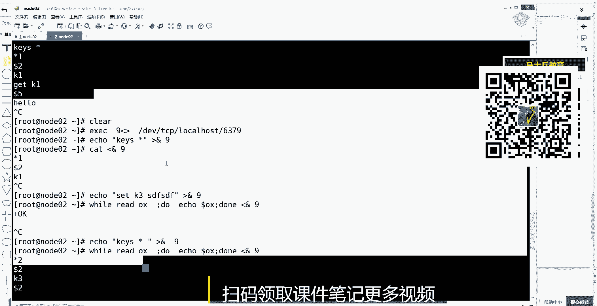

# 白嫖到马士兵教育价值23980的MCA架构师课程一次让你学够！ - P50：redis合集：2、Redis实现活跃用户用户统计playlist.f9 - Java视频学堂 - BV1Hy4y1t7Bo

都在三颗cpu上，第一件事情，三个线程是不是可以工作在三个三个cpu上，这，个能听懂就来刷波一，三个线程是不是可以工作在三个cpu上，那么这时候其实他们就不叫并发，他们叫做并行了，对不对。

一定要注意用词准准确度啊，他们叫并行了，他们是为病情做事的，那只不过并行做的事情不不是一类事情，因为i o我说了两个阶段，一个是读出来，然后再再干，所以呢工作线程依然是要去负责计算这件事情。

他如果刚起来的话，不读取io这件事情，工作线程里边是没有什么东西可可算的，所以先通过一炮知道了，说唉有俩客户端数据可以读了，状态知道了，然后这时候这个共主攻内容通知另外两个线程。

说你俩你你们各自有俩客户端，有两个哦，有两个socket，有两个输入流，一个输入流，一一个一步一个一步带你们各自读一个啊，读到东西先读读出来放到这个堆里边，然后我就能看到了。

所以这时候另外两颗cpu是并行的，就是它们是并行的，但读取l这是并行的，并行读取了，两个i o里的数据到这步能听懂，同学来刷波一，这两个线程可以并行读取两个io，他们先把读到的内容就放在堆里边了。

放到队里之后，然后其实我这个县城可以处理一个，再处理一个，对不对，哎，挨个去处理，那处理完第一个之后，本来我是处理完我还得就是给客户端返回，是不是还得还得走io。

是不是我可以让我这个线程调了一个从ioe给他right写出去，我还可以通知另外一个线程，哎，我计算完这个结果，这个对象放在堆里了，你把它给我输出，你你这个cpu在做这个ip输出的的时候。

我这颗cpu的一个线程就可以处理我堆里边另外一个队列，里边另外一个数据，记得他咱俩之间是不是开始并行了，就这两步是不是也是并行的，这不是不是并行的哎，病情处理完之后，你这边i o无论你发的快慢以后。

你你发着我只记得完了之后我还可以让另外一个县城走另外一个cpu，然后走内核交互去把我刚才那个第二个计算结果再给我发出去，但是其实他们之间也也因为他的时间轴可能很长很慢，发的东西比较多。

但是他也会和另外一个依然是一个并行的，压到两颗cpu上，现在能听懂了吧，没问题了吧，那其实你数成本就可以了，其实总共来说一个并行一次，单独它计算两次，然后这是一个并行三次。

然后这一个这一个他俩有可能并行，或者他已经处理完了，但是他最后他必须他第三部完了之后他能写，所以还是第四步，下边是四个宽度，上面是六个宽度，所以下边一定是用了用到了多核的能力。

比上面这release这个模型一定比上面这个模型快点，好吧，那下面这种i o这种多线程的方式是注意是在redis 6点叉，redis 6点叉的版本当中会增加进来。

然后其实它的增加进来这个功能叫做io surprise，io多线程，但是无论注意听啊，无论你的是六点差五点，差三点差二点叉，它的工作线程是只有一个的，多路复用是另外一回事儿，多路复用是一炮。

知道哪些客户端一共有1万条路，里面只有两条路可以有数据，那这时候走到e后，多路复用器知道了哪些就是获取i10000 个io事件，这个事儿服用了一个调用就知道了哪些可以掉了，然后这是状态的第一个阶段。

i o的第一个阶段，我知道哪些可以用了，第二阶段我要读取这么多，我可以单线程one by one的串行读取，我还可以让更多的cpu同时让他们读不同的socket io，读过的结果。

第三个计算我可以单线程计算，我也可以多线程，但是我们说了单线程计算是串行化，串行化它的成本相对低，因为多线程一定会牵扯到锁，串进化是没有锁的，数据是最干净的，其实效率反而更高一些，最后这个总结都能听懂。

好吧这能听懂，然后在这儿还有一个点要聊一下，这是之前一个学生问的啊，我在这多说一句，再来一遍大哥开视频吧，因为我这还得讲别的好多知识好吧，咱们这个课是有视频的，而且现在是11024的高清的啊。

回去那个今天我讲完课后就只能看到这个视这个这个视频了，在这儿聊一聊一个事情啊，刚才我说了，它是串行的，然后你有很多客户端，它是先计算c一还是先计算c2 ，这个计算的过程会不会混乱，会还是不会。

会还是不还是不会，其实这是一个未知的啊，这个位置一定会混乱，一定会混乱，这是未知的，为啥，因为你的程序只知道有多少个有哪些io，然后程序调度的时候，它指不定先读到哪个l厚度的l并并不一定能解吧。

而且这两个这两边时间读来是这个这个这个不确定的，所以在这个处理他们的顺序的时候，还真的有可能先处理c2 ，后处理c这个这个c一了，就看他俩，因为他俩并且病的时候就是一到并定要分布式的时候。

这事儿就没谱了，他不想串行，我必须一个一个来，对不对，即便其实串行的时候，如果两个客户端，其实你串行这个我i读的时候，我有有可能先处理c2 的，后处理c一的，所以先处理谁，这件事情不确定。

反而这件事情还带出了一个新的一个知识，也是你平常忽略的，其实就拿不拿下边这个复杂的模型来说，拿这个简单模型来说，想你加入程序，其实每一个客户端对于我的redis来说是一个connection。

是一个连接，这可以用在这个知识点，可以用到很多技术当中啊，其实每一个客户端来说，对于我redis是一个connection，是一个独立连接，那其实一个程序他在这两个客户端中处理的顺序的话。

如果没有曾经没有自己明确的代码约定死，我必须按照他们客户端的那个标签属性维度，先处理谁，后处理谁，如果没有这部分代码的话，其实在处理的时候，指不定先读谁后读谁，也就是说连接与连接之间是无序的。

数据到达之后处理的顺序是无序的，这个能求同学来刷波一，但是有的时候我们但是这里边你会发现redis本身就是串行化的啊，这个redis本身计算是串进化的，如果这两台服务器里边如果对了同一商品。

然后它的增删改是有顺序发生的，怎么办，怎么来解决这个问题，所以这时候其实你要宏观感宏观，你知道为什么俩客户端一定做了负载均衡，一定把一台变成两台了，所以你前面一定会有并发，然后后边是串行的。

然后你又想保证所有东西能够所有制这个执行步骤能串行化，别出错，先创建后更新再删除，这仨事不能乱了，那有人说用锁其实不需要用锁，如果你还知道另外的一些知识，就是你的知识点如果足够宽的话。

比如说在我做负载均衡的时候，我一个负载均衡器，那么这个c1 c22 台服务器，它们各自两个客户端对，是在使用这个redis，如果他们各自有一个连接的话。

其实我可以在负载均衡的时候可以按就是客户端很多请求进来了，我是可以根据ui这种七层的，我看到用户他们访问的是哪一个商品的ui，如果ui相同的，我就给到c1 ，就是拿ui做负载均衡。

相同的ui一定去到某一台机器，在负载均衡的时候，我们是不是可以随机负载均衡，这个客户端给他第二次请求，给他，第三请求给他或者轮询的，可以随机的，也可以把客户端绑定，客户端绑定的，我拿着客户端的ip地址。

只要是这个客户端的，无论访问相同，上面不动上面我都让他去c1 ，或者是我拿着ui去做负载均衡，只无论是你a客户还是b客户，只要你访问的是这个商品的，我就一定让你去到一个服务器里。

就是负载均衡的策略有很多，这不能听懂，来刷波一，然后这里边都是细活，你在考虑解决这个环节的问题的时候，其实你可以把眼睛往前看一看这个环节，如果我让我的负载均衡的策略是把相同ui相同商品的。

无论是来自于谁的，都附带了一台机器，那这台机器如果在这个这个这台机的肯定是不止受到了一种ui，但是它它里面可以开启多线程，就它也可以开启多线程，而且它里面的连接池也可以多做，它的临时也可以多个。

但是这时候其实我可以更倾向于相同ui，就由一个线程在一个连接当中把相对u2 处理掉，就是一个connection里边，那所以你re收到的也是只要是一个ui，也是按照你接到的顺序来处理的。

就这块你可以去调整它，调控它，这都是细活儿，就是你而且这个过程当中其实是无锁的，整体的过程是不需要锁的，好吧，其实你如果能够将你的商品的ui的处理打成一条通路，打成一条通路，虽然看似是多线程。

虽然看得多连接的，但是我一定会在我设计的时候，让我的ui一定是走的这个县城或者走走这个最终是走了一个connection，对不对，就一定会处理它啊，所以你收到的一定是串行的好吧。

ok那这是一个扩展的一个知识点，就像上面这两点说的就是什么说的就是一个整体宏观的reits是啥，有三个模型，你只要把这三张图你会画了，面试的时候你就有这种感觉了，第一个是它的这种并发模型。

然后它的串行化单线程，另外一个就是现在以及这个之前的版本当中的dworker现实工作，以及他未来的版本变化，或者是你对整个技术发展当中，尤其在i o这件事，你想明白了，他是会多个阶段的。

所以在一个词汇叫做ios rise，是可以让我们的某些技术提升的，不只是redis，像nike，像我的，像我们的很多的技术，它都是有一个ios rs这么一个概念，就是从io读到的东西。

编解码的事情是可以由一个线程来处理计算的事情，可以一个线程也可以有一个多线程的一个线程量，对吧，其实这个技术是可以，就刚才我讲的release这个知识点是其他技术可以。

并且这个这个这个这个这个这个这个这个传递的，好吧，ok收，那这块能听出来刷波六，如果还是那句话，刚才听的时候你已经晕了懵了，看预习资料，尤其在e po这你先懂，尤其i o的不同的阶段，这个事儿很很重要。

因为这个不懂的话，io多线程你不懂，那nt就很难去懂，多线程不会乱，怎么会乱呢，他们依然是你看这我没有说在这儿还能计算，一定是在尾随它后边来的，这个计算的结果，工作一定是在这个时间时间点的后边发生的。

好收这块不浪费时间了，那么接下来进入最后的环节，简单给你们总结一下，串一下这个知识点，下面就开始讲我们redis使用场景，使用场景呢，然后我是按照他的五大vd类型，一个一个类型去给你讲。

他有哪些场景可以使用这个使用场景，你一定要把它换成最终你的你的你你最终要为啥要听这节课，你时时刻你想着你曾经做的传统项目，传统项目当中哪些模块功能或者哪些所谓的c r u d的那个代码底层。

其实可以从数据库里好，从那也好，换成redis，因为如果你把你曾经的熟悉的工作用release替代了你这个项目，听上去的感觉和能应付的压力，这事儿就变了一个所谓的逼格，就是逼格往上升了一下。

其实其实你所谓的你认为那个大牛大神，那个项目也就这么也也也就是这么一回事儿，好吧，那讲他之前啊，首先我们来简单回顾一下，或者是你如果没学过，也不怕，我先告诉你redis，它是pv的。

那么它的value类型有哪些，y类型有string类型，value的类型有string，有list，有哈希，有set集合，还有一个什么呀，最后一个就是常常用的五大八类型是salted set，有序集合。

或者也叫做this set啊，接下来这样一个名称，这是他五大八的类型里，一会儿我们只需要分析它来，你可以解决你项目的哪些场景和需求和这个这个问题，在这用。

我忘了那个预习资料里边有没有讲他这个value为什么要有类型，这个这个余字老师跟我说了吗，是value为什么是有类型的，以及它的本地方法，说了说那我就在这不讲了，回去看鱼子料就可以了。

在这就不浪费时间了，因为再讲一遍肯定浪费时间，对不对，讲他省之前安装，其实在预习资料里等等我都有讲过了，在这我不浪费时间。

然后打开我们的shush，基于release是基于linux去使用去部署的，明白吧，就是我们是基于linux的，也很少有企业拿它布置在windows上，所以那个就不说了，使用linux时候。

然后呢安装我已经讲过了，我先把它跑起来，去到redis的部署目录下，然后去到b目录，这是他给我们提供的一些个这个软件和程序，比如redis server就是它的主程序，我用了前台阻塞的方式给它跑起来。

reserver回来之后呢，然后他去占用了一个端口号，默认占用的6379啊，现在这个release我已经跑起来了，跑起来之后，那么怎么去连接它，使用它，它的通信是一个什么模型，怎么去使用它呢。

它的端口号是6379，它是一个服务已经坚定起来了，唉有客户端有很多的在这我多说一句ai和命令行，我只讲命令行方式就可以了，这个ai的方式我就不去讲，可以去讲它，因为你只要会面命令行了。

它是多客户端语言的，无论p是p啊，然后python啊，然后java都可以使用它，命令行呢会使用之后，其实那边的app还是比较相似的，那假设我想访问这个已经运行的这个服务，redis怎么可以访问它。

首先借助工具啊，不用它自带的，比如说nc这个小程序，这是在linux操作系统中，你可以安装一个nc的小程序，连百度连什么，他只是完成一个tcp连接，你自己根据你连接那个软件发送对应的协议。

它能读取读取明白就可以了，比如nc连谁连local house 63796379，说的就是我当前前面启动这个reserver回来之后，那么现在是建立了一个tcp 3次握手的一个连接，io就通了。

为什么i o就已经通了，i o通了之后，然后注意看我们可以比如说set一个k一是hello，那么什么是键值对，比如最简单的你要设置一个键值对，在这个ready release去存，你们别讨论啦。

跟着我这来学东西，先跟着课，课下之后这个操场上见好吧，sd一个k1 ，然后就是k y6 值是hello，当回车之后，那么就发送给我们release release给你返回了一个ok确认了一下。

然后这时候你还可以case星，然后这时候k4 星就是可以返回我整个very cool里边，这个星是通配符吗，有哪些个key就已经有它了，还可以get k1 ，然后知道他的y6 值是哈喽。

那么这里面可以看到一些呃，你看上去很很慌乱的地方，比如说在kiss新客户端发出一个指令之后，其实之前你可能只看到了k一或者都是多种k，然后现在它里边有一个文本传输的一个协议啊，协议这个协议是什么。

协议就是星一星一就是返回的整，如果这是返回的所有报文，你可以人工去解析这个豹纹，这个豹纹什么意思，星一代表返回的是只有一个，只有一个元素，这个元素是什么，注意第二个不是这个元素的内容。

第二个是它的一个描述，描述的是dollar，是描述描述什么，描述真正的一个东西，它是几个字节，几个字符k1 ，这两个字节就是连二就是两个字节能理解吧，如果get p一的话，那么返回的是dollar是五。

这个五描述的是我只是描述我描述的我后边那个东西有多有多宽，你读取到读取那就结束就可以了，听我们来刷波六，就是星后边跟的是元素的个数，然后dota后边是我紧邻我那个元素，它是字节数啊。

就这么一个简单的一个东西，就是nc啊，其实你会发现redis通信的成本和这个语法协议并不是很复杂，起码比你hp协议那个看上去稍微简单一点，都不再再来，除了nc，那有人说我没有nc怎么办。

我再给你秀一把啊，a e c准备一个八或者准备一个九吧，随便一个数值输入流，输出流就是linux基础基础知识了，我就是给你显显显摆一把，我会这个东西啊，输入输出两个流。

这两个流指向哪指向了dv t c p，然后local，l o c a l local host，然后6379，那这样的话，其实一期节文件也会开启一个socket，并有90g的io io连接石油之后。

你只需要echo echo一个case星，然后到我们的9号文件描述符发出去，这样的话也可以发给我们的redis，然后呢发过去之后，他可能给你返回呀，那读取九就可以了，也能看到刚才浮现那个文本。

这是在没有使用任何第三方软件的情况下，好吧，或者换言之，你都已经和这边建立建立关系了，那比如说我比如我在简单做一些echo一个set，一个k3 ，现在我库里有一个k1 ，看到吧，我再设置一个k3 。

只是随便设置，然后给到九就设置进去了，然后你如果会写脚本的话，well，while的时候让我们的用瑞的这个指令读取到的东西，存到一个圈差这么一个变量里，然后呢do执行的时候。

每次用echo打印圈叉这个变量的值，然后但结束，但是来自于九的返回值来看，这个看不懂无所谓啊，现在只是前前辈，我有多厉害了，走，然后回车ok读到了，少读了一个，因为刚才刚才刚才设置进去了。

那这时候如果再给他发送一个echo，因为反反正就是第一个，ok嘛，如果再给他发一条指令是k4 星的话，k4 星k4 星给到九的话，k4 星的返回值是什么，是不是会返回一个星二，因为有k1 k2 了。

然后第一个k1 k3 了，第一个是dollar 2，然后k1 ，然后再来一个dota 2 k3 ，对不对，是这样一个一个一个一个回旋给我发出去，然后再掉，刚才那个写了个小小小脚本，是不是有两个元素。

第一个元素两个字节是p3 ，第二个元素两个字节是k1 ，好吧这只是给你给你学校显显摆一下，那这个东西有什么意义，e无论加上刚才的nc还是我写这种脚本，这种l6 连接l是一件事情。

二一个它的中间传输的东西比较简单，并没有别的地方所说那么复杂就可以了收但是其实作为人的话，我平时使用什么东西啊，就是用它给我们提供的redis cli的一个客户端，因为这个客户端里有什么有have。

help里边可以告诉你，你可以学习通过have帮助看它的分组的知识点，命令的知识点，然后还可以用table这种股权的方式，而且你在set的时候还可以有提示。

这是这个方式肯定是比刚才我那种写法要简单的多了，因为直接使用它客户端就可以了，但这时候你先看一眼啊，case星你看到的k3 k一有看到刚才那个所谓的星和dota那些内容吗，是不是没有，换言之。

其实现在你已经明白了，你能你能不能写一个redis cli出来，你能不能封一个release客户端出来，只要你会i流就可以了。

没毛病吧，哎现在刚才讲的这票的知识让你看到最原始的方式。

然后它里边传输交互的是什么内容，然后这个会了之后，你再看看客户端，然后看他给你给你，结果你只是底层发生发生了什么事情了。

好吧，收这些都明白了之后，我们再来讲开始讲开始讲歪的类型啊，string list hash set set，先讲spring。

但是讲string之前先说have这个事情，have的是at符，可以接tb键补全，这是一个全局，对哪些指令，像刚才所谓的case啊等等，很多人都都有出现，然后你have n加at之后。

里边就有一个string，它每一种y的类型都有一个自己的组组内，你help的时候会告诉你有哪些指令，就是关于string有哪些质量你可以用。

而且都会有描述，所以他的学习成本很低，你只需要按照我做这种思维导图方式。

一会儿延展出哪些知识点，记住了之后，未来真的忘了都不怕，你记住了一个命令叫害就可以了，好吧，那就先来学第一个使用这个类型，它有set设置啊，有get等等，还有一些其他的东西，我们先来做一件事情。

比如说set，我先听一下库啊，这个指令就当没看到啊，现在我case 4星里面什么东西都没有，那个库里边，然后我set一个k1 ，比如说hello，然后get k一就能取得它的值，这是面向string。

接着段你能设置的，那你能设置的除了他之外，面向字符串还有哪些操作，比如说append追加k1 ，追加一个圈圈叉叉，那么在gk一只能追加到他这个字数就被追加了，还可以。

比如说get range k一从零开始，然后到三就取出四个字符，然后在这儿多说一下瑞当中它的索引，这个零到底是索引，所以分为正负的，你可以从左向右零下放到七八小时，也可以从右向左-1-2-34。

但是放的时候比如放-4-1，你不能放成-1，-4索引是从右往左数，但是索引往上摆的时候是从左向右那个摆法，所以这时候你还可以零到-1，就是取所有或者是-四到-1，就取得后边的这些东西，这是变成字符串。

它该能做的事情，名字串还有什么，比如spring lance，我的k一长度是九，那么这时候你来看看这个九代表的什么意思，来互动一下，哎这个长度这个九是什么意思，有人说是这个字符有不同的意思吗，好吧。

你再来看吧，我set一个k2 ，set一个k2 啊，然后放一个a strlk 2的长度是一，那里边应该有只有一个一，只有一个a只有一个a对不对，哎有一个a那这时候再来看set一个k2 。

然后不是append，追加一下append，追加cr cr里边刚才是一个a我往里面追加一个什么，追加一个中国的中子，那么这时候p2 里存了什么东西了，p2 里存了一个a和一个中国的中字。

然后string l我的k2 ，请问它的长度是几回，知道是几，是234512345，是哪是哪，是哪一个数值，14为什么是四啊，来看一眼get k2 ，它里面存了哪些东西呢，存了一个a。

这个a是什么意思啊，就是我开始放进那个a然后后面我这个中的中字它就显示成这个样子，这是什么表示方式，这是16进制表示方式，显示有三个字节，它的实用均值分别多少，有三个字节，加起来四个字节。

所以使用lts给你返回的是什么，是它字节的数量，是字节的数量，注意听是字节的数量，然后你再做一件事情，看我看我做一件事情，如果我把我当前这个客户端注意听。

我把我当前的客户端从u t f杠八切换成，这个gpk就我把当前的编码集，就是把我的数据这个编码去的话，这个编码级换了一下，换成j pk了，然后再set一个k3 ，里边有一个a然后再append的k3 。

一个中国的中字回车，那么这时候spring lk 3它的长度为三，就不是四了，你gk 3就是一个a和后面两个字节了，这是第一个，首先说，你往里存的数据，人给出的数据是不是都是a都是中，对不对。

但是这时候你会发现客户端编码集不一样，它在reality存的东西大小坑都是不一样的，这个东西和二进制安全，一句普通话就是release，只存什么呀，字节数组，你客户端按照你的编码及按照你的序列化的方式。

你把你的数据即便是相同的数据，你序列化成什么字节数组了，我就按照你给我的数组去存，我不会改变它不会怎么着，这就是二进制安全，像hbase super卡夫卡，他们都是让你给他一个字节数组。

这个能能能听同学来刷波六，是这个意思吧，嗯嗯，再接着听啊，再接着听，到时候给你总结出来，到时候给你结出来，那么除了这个string这种方式，然后再让你见识一个东西啊，他还能做这样的一些事情。

比如说set一个k4 里面存了一个九回车，那么请问它的长度是多少，它的长度多少，这是一个数值，一个数字九的呗，哎长度上哎，回车是是一个对对，那这时候注意听啊。

如果set我把k4 的值更新成99或者是129，129吧，分成129，请问它的长度多多少，更新成129，长度多少，在学java的时候，这给你补充一个常识啊。

在学java的时候都知道数据空间有压缩的概念和这个调优的概念，1270~127，它java里边即便你是定制类型，它也是存一个字节里，因为一个字节是可以满足0~127的。

这种这种显示的就是-170到正170，因为前面那个有有无符号嘛，然后超过170，这时候他才怎么样走，他正经800的那个多字节，这个这个这个四个字节这事对不对，他可以调的过程，那么如果在re中。

我set的一个k41 个数值数值了，这桌料开了多少个字节，回车放进去了，spring lk 4是三个字节。

是三个字。