# 白嫖到马士兵教育价值23980的MCA架构师课程一次让你学够！ - P51：redis合集：3、Redis实现秒杀抢购排行榜评论列表playli - Java视频学堂 - BV1Hy4y1t7Bo

Yeah。比如说我再ss1个K4，把4这个里面改成9999，改成这么大的一个数。就是lceK47个字节。显然他其实没有走数值这个这套东西，因为他把这个数值也理解成了文本。明白吧？

就是咱们reis客户端也把它理解成文本，就是文本字符块存进去了。但是注意了，res有这么一个功能，比如说increase。😡，对着K4，它可以做加一加法这个计算，再get的K4就往上涨了一个一。

它能做计算。虽然你存的是文本，但是它支持这个这个数值计算。好吧，然后再来看有一个指令，注意看啊，我刚才写了很多东西。现在我们总结一下第一个指令叫tab。typeap的时候，你可以看K一是str类型的。

typeap看K4，它们都是 string类型。因为刚才你用到的这些个指令都是str。都是sring的这种类型的。命令，所以它的value的类型都是基使类型的。但是还有一个东西叫OBJ。

就是对象真正的我的Y头对象的，比如说encoding。这个单子什么意思？是编码对不对？看K一看K一啊，K1是一个肉类型的啊，里面存存的这种这种这种简单的字符串，或者是看K4，它能识别成int类型。

但是这注意听了，inc code的编码虽然看K4是int，但是实际它占7个字节，它依然按字符串里存的字节数组去存的。只不过它加int有什么好处，因为你曾经对他参与过计算，他计算成功了。

那下次如果你继续想这个increase我K4的时候，这个时候他只要看到你上次结果，把那个K里边的描述那个int，只要看到int了，他就可以大胆的直接去把它转成数值，开始做加法。

它不需要判断我能不能转转的时候有没有错误。

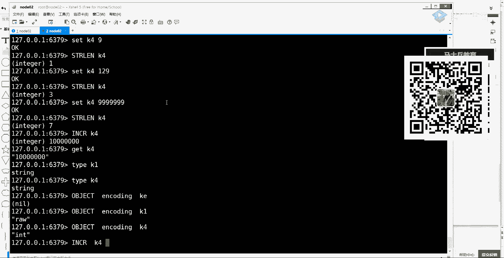

是不是这道理？哎，那么简单总结一下，在这sring。第一个。它可以有字符串。的操作。你们在下边在聊什么？注意听课好吧。第一个有字符串的操作，字符串操作哪些？比如说我get site。

我可以这个这个这个这个append追加，可以显示的长度，对不对？字符串常规操作，然后刚才发现了它有一个数值操作，也，就是里边其实你你是可以有数值。你存1个99，存1个一存一个2存1个3，但是他们注意。

虽然它有数值操作，子符串操作。我说了，它是二定制安全的。20这安全是什么意思？无论这个东西最终是怎么怎么去处理的，底层真正存的时候，它是20安全，20安就是字节数组。就无论它是哪种类型。

最终它都是一个字节数组，只不过在OB的时候，对数值，它虽然有一个int的显示，这个int只是说我曾经参与过就这个数据来的时候，或者我做过计算了。我知道它依然计算结果还是一个数值。

那我下次再再调那个计算方法的时候，发现它是int，我就直接开始把字节数组转成数值进直接进行加一。如果没有曾经没有这个int的话，那如果你是一个程序员，你读到一个字节数组。

你每次是直接就敢把字节数组 tot吗？万一他要一出了，或者里边存的是一个字符串呢，是不是这这里边计算就会报错？你是不是加各种判断，对不对？也就是说复杂度不是O一，而是要每个操作都要判断，都要判断。

都要判断，都要判断。😡，但是如果有一个意子的话，你可以把判断的一些票过直接转，直接直接算就可以了。😡，这是re作者非常细腻的一个一个一个点。你你去品你细品是不是这个这个这个这个这个特征。

就是人家可以不加这个int，反正你我就自己储存内存了。你每次如果你想调in这个计算的时候，我大不了每每一个操作，都要加入一个转换前的判断每一个字节是不是一个数值，它举值是不是一个数值，是的话。

我才给你转，然后才让你参加计算。但是如果曾经参与过计算了，它也变成一个数值了，我就给你标识一下int。那未来未未来如果10万次加一的话，不怕我，这10万次，我都不需要判断每一个字节了。

直接转成数值就可以参与计算了。那后续10万次的计算速度性能极高。现在听懂了吧。哎，你学你听我的课，学我的做时候，别急，别慌。我前面给你要讲一大堆的东西，你感觉听着很low，这你都会了。

但是我到最后我会给你总结它的目的是什。呵。嗯。好吧，str有字符串类的操作，有数值类的操作。那么字符串类的操作就加上二十进制2二进制字节数组。那么我们说了最值钱的地方是你要学习这个技术，它应用的场景。

对啊，追听是场景。那么请给我在这两个范围之内找一些场景。找一些场景字符串，你们公司用字符串str字符串可以存什么东西，再加上二级专线，你可以存什么东西，你可以解决哪些场景，说几个场景哎，有三个共享。

对不对？除了30块钱，还有什么东西啊？😡，tken这不是一类东西吗？嗯，对象哎，说对象的对了，对象。或者叫做小文件。因为它是二0安全的，它里边没有数据类型的概念。实上就是给你你你可不可以把一个小图片。

字节留读它，读完之后变在内存里变成一个字接数组，直接存进去。😡，把你公司很多静态的那那些个静态的页面，动静分离的那种静态东西，以前放在磁盘，放在文件服务器的，但是里面sL可能有点慢。

你是不是可以放在一个reice这这里面来提升这个速度。对象存储这个对象就包含了任何你你序列化东西，你你java这个java里边序列化，我不我不是存在磁盘里边了，我存在reit己去了。

因为它是是个字节数组。那后续其他的GVM重启，或者是这个扩展的时候，是不是加载的时候都会很快。😡，这是他的场景啊，认可你就刷二波一。所以这时候你就想你，你公司项目当中凡是用磁盘IO的。

都可以把它调成reice。你公司就用了redi了，你公司的性能就已经提升了。是这道理吧。好，这是第一个。那数值刚才说数值还能它能有计算，计算的时候，它能加减啊，加一减一或者加几减几。存图片也合适啊。

你包装一下，你公司只要对着一个readd集群包装一下，内存贵，但是速度快。对不对？你比如说都不只不只用提供外部这种服务。比如对你的这个。呃。

AI的机器学习机忆学习里边可能要训练大量的这个这个图片的数据及，反复的读去反复训练。然后你这时候可以把整个一个read集群内存里的东西给它烘装一下。然后直接暴露的就是读图片的路径存存存储。

然后把这个整个外界需要频繁访问这个图片快速加载这个过程全部迁出来，对不对？啊，这是这是字符串啊，字符串不要看它表面的意思是字符串，但是他需需要把这二进制安全加进来。然后再来看数值，数值可以解决什么问题。

但哪些场景可以使用啊，比如说秒杀。秒杀这一定要注意了啊，秒杀的时候，真正啊我们在秒杀性当中库存扣减这件事情一定是放在DB的。那么拿reis做秒杀做一件事件什么事情？reice秒杀做的是限流和薛峰。萧峰。

算了，我不写了，你你自个自自个自个那个哎这个基数啊，基数也可以用它。其实。如果简单的这个基数的话，是可以拿这个sring兼职对的。但是一般我们后边还会说有一个哈西，哈西里边会有很多，对不对？其实。

薛峰还是萧峰，我忘了啊，反正就是大概的意思，这个列了吧。哎，那 string到这儿呃，你的视野我觉得应该呃以以前你可能以前你可能只知道它是一个缓存，能存一个兼职队就完事了。

但是现在的话是不是觉得哎还挺有应用场景的，你都迫不待想回去在项目当中简单的试用一下，对不对？除了两点不值钱不值钱，这都不值钱，还有一个更值钱的，它还有一个20制be mapap为图的操作。

就是为什么reis现在在出去面试的时候，为了问的频繁度这么高，然后他为什么可以取决你后边还跟你们面不面了。你reis答对了，人继续跟你聊。rereis没都没答答对的话，那不跟你玩了。先别说它应用场景。

那么beat map20制这类操作是一个什么概念？分两个阶段去我给你讲。第一个阶段我先给你去讲什么是20制，咱们复习一下。20的操作。以及专业当中如何操作二进制这个讲明白之后，我再给你讲它的应用场景。

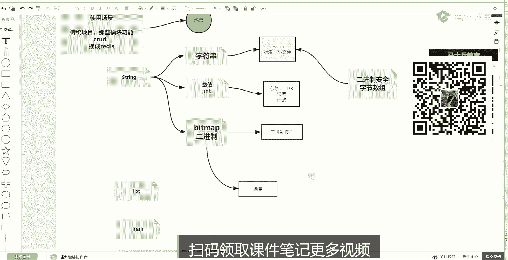

好吧，因为可能这个大部分其实会啊，但是咱们我也我也讲一下吧，因为咱们可能有小伙伴平时没没用过这些东西。这个命令我一再强调我我敲就行了，你把它忘掉。其实在你们公司，如果真的。真的真的有运维的话。

这个命呢也会给你这个别名化，你根本敲不出这个命。这是一个清库的。库里都没有了。那么。什么是为图help。strring注意我们现在学的依然字符串，它里边有一些什么bitit set bit。啊。

然后还有一些什么get beat，或者是beat operation ，beat post或者be count，有些二人之位的这种操作的指令。它是一件什么事情来，我们来演示啊。他在库里什么都没有。

对不对？注意听，如果我set。地纸。啊，s beat set beat的时候，后边注意看字参数给出一个key，比如说K1注意听给出offset，再给出一个value，那都已经是二进制位了。

那value想想想的话，二进制里边无非就是零和一两种，其中一个那offset什么意思？先看我先写一个一，然后在偏量为一的位置，打成了一个二进制的一回车。那么这个时候首先看第一个知识点。

s K一请它的长度是多少回车是一，那么代表刚才的操作创建了一个间值段键是K1value是一个一字节的内容，一个一个字节的宽度。那这个字节里边一个字有8个二进制位，它里边是一个什么样子呢？

我们先来看它的值，最终是什么get K一回车是一个at。那这时候想一想，这有一个知识点，我不知道你们知道不知道啊，就是在计算机系统当中。有一个编码集的概念，艾特其实归属于哪个编码集。

艾特归属于阿码编编码级学linux太省劲了，书都不用买，网页都不用开。它有很多的帮助手册，menu ask玛回车。这时候他告诉你了，阿斯玛它用的是7个20之位一个字节，7个位左边那个高位永远至0。

然后后边7个的变化的话，就是从0到127的一个范围，下面的表里边已经告诉你了，从零啊数值为0的时候，这00000的时候，代表的是斜线0。然后再往下看艾特是你的011这个0101的某种组合达到64的时候。

那就是艾特。那请问。20制60就是十进制是64，是20制的多少？十这个十进制的64，这个数值是二进制的多少？

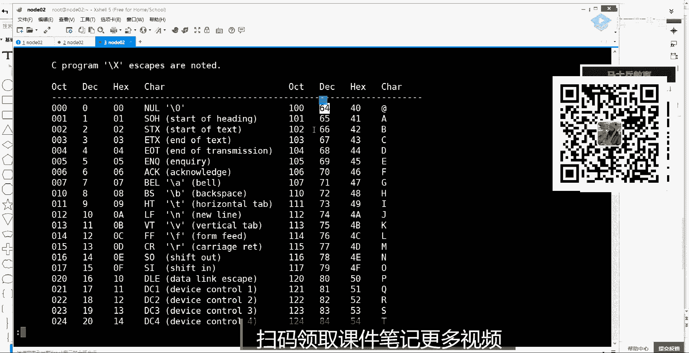

一个字节，一个只有8个连轴位，123456788个连轴位。然后我们一般怎么算二进制啊，是不是从左从右向左数就是。1248163264。每个位如果独立出现一的话，就是这个规律1248163264128。

那么其实刚才我这步sK1偏音量为一啊，打一个标识一，其实就是从左向右012345，然后在这个一的位置打成了一个一，这就是艾特在阿斯玛当中的表示形式。听出来刷波6。这是010000啊，这是阿斯玛。

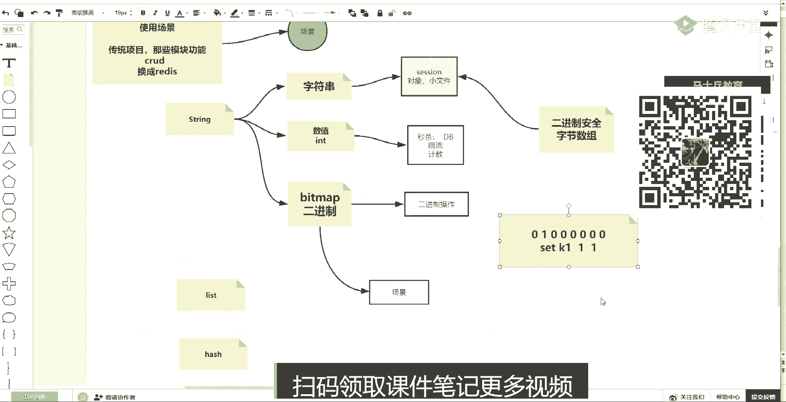

那。这个你会了，而且阿码有规律的，64是它65就是大写的A。那么65实际就65，在二进制怎么表示？

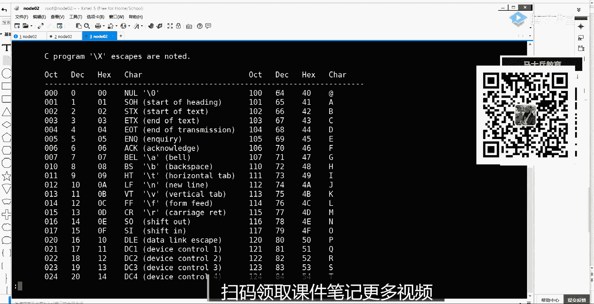

这是64了，再往上加一个是不是65，这变成一是不是就可以了。那么现在怎么把刚才这个K一的艾变成一个大写的A呢？

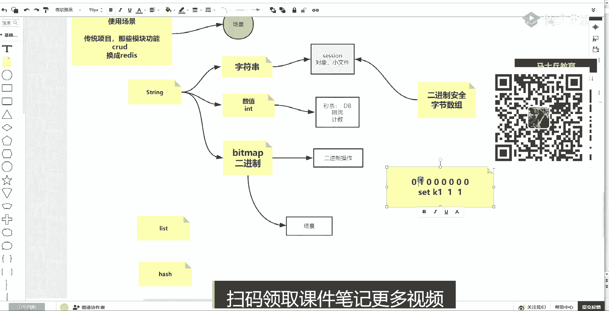

偏移为一的这位时候打了一个一，是不是在最后那个位置再再打一个一两个一同时出现，是不是就是一个大写的A了？所以setd K179是8。因为从零下标从零开始打上一个一getK一就是大写的A。

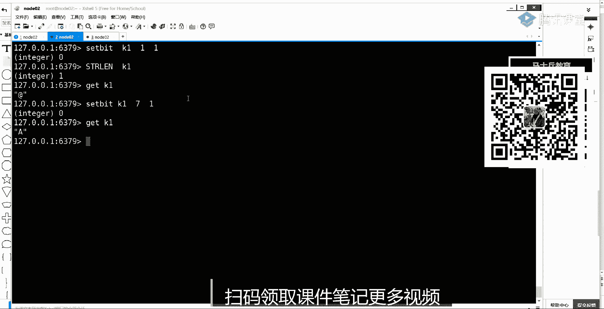

这是可以设置的，看懂了吧？然后再来看哎，那如果我想设置注意听啊，我们看二地证码，我想设置一个数值。

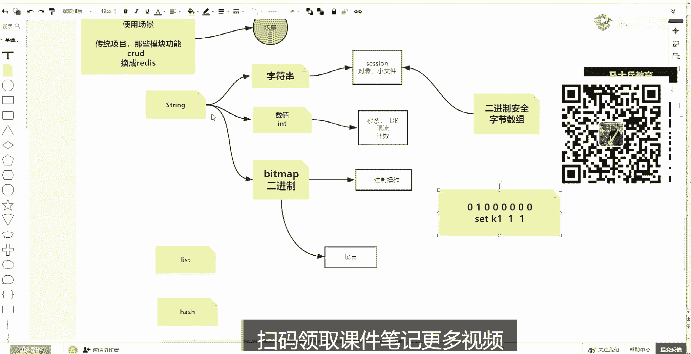

找一找阿克玛当中数，你平你从平时看到123478910这里边，比如说我们看到1个48。48。48代表的一个0，对不对？嗯，48，那48的2D是多少？32加16等于48，对不对？

32加1612481632，也就是把这两位置成一就可以了，就0123把23两位置成一，是不是就可以了？所以set beat K2，先在偏量为2，打一个一，在set beat K3的位置。

这个K2三的偏量的位置打一个一。那这时候get K2就是一个数字0。然后我们increase K2就会变成一。

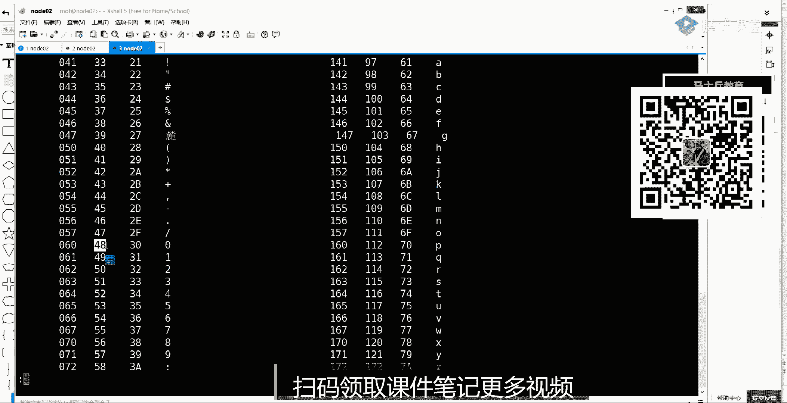

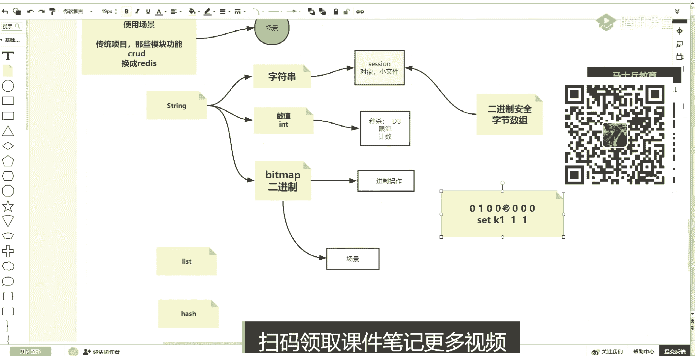

那变成一的话，其实是在刚才0110000的最后一位，也就是get beat K2的偏量为7，它变成了一个一。如果恶心一点，我们来做一遍啊，get beat K2的偏量为0，这左边第一个位是0。0。1。

1。0。0。0。有。Yeah。K2它的长度strring lung。是一个字节，这个字节从左向右的二令制偏偏移，2令制位的偏移ofside是0123467，那零位是0，一位是0110001。

这是它里边字节，一个字节里边二进制的这个001的一个关系。

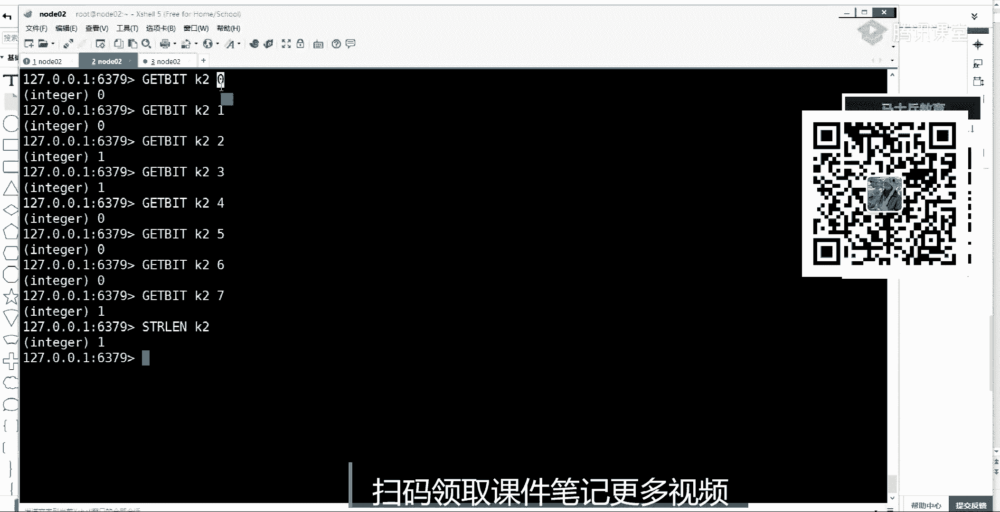

这个看懂了吗？

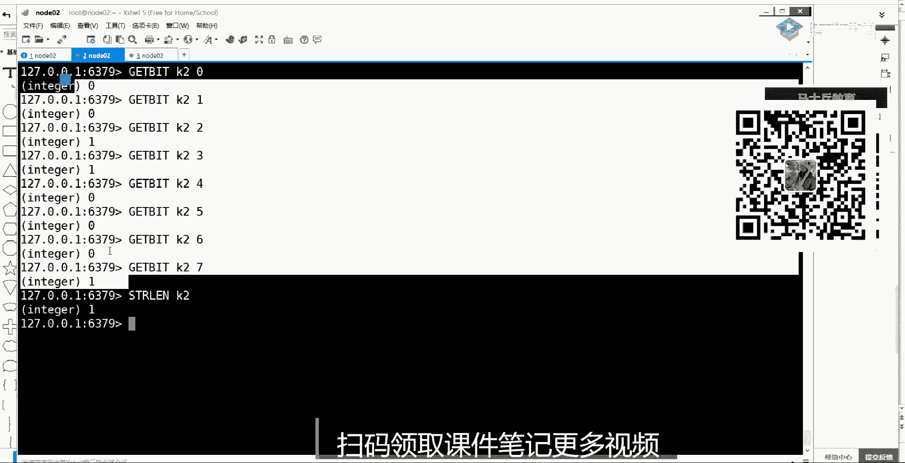

刚看到这个不算完啊不算完，再再来一个再来一个。如果我对着K2做这么一件事情，set beat对着K29999打了一个一，注意偏量就不是02347了，换成了9999，打了一个一，那会发生什么事情呢？

会发生什么事情？streamring lung K2就有1250个字节。不会溢出它会自动扩展字节宽度，就是这个特征的一个特质。只要你给出偏移，这个26位的偏移。

从从左向右就是01234891112345，只不过每8个一个字节，每8个字节它会往后拼字节，这是一个特征。好吧，这个都记住了。那为什么要讲他为什么讲他？你记住这件事情之后。😡，2令制里边。

无论你是学ready好，java也好，你学C也好，学二令制意义不大。最重要的是二进制位的操作。2这位操作。什么样这个操作？它有一个beat啊，先说有一个统计啊，有一个统计。那像刚才我get K2。

这里边其实很多很多位，就这位置一，前面都是0。然后最开始的时候会有一个这个这个数值一。那么这么大的一个子接数组里边一共有多少个一啊，根据我开始的设置。怎么统计它里里边一共有多少个一。

可先说啊be count对着我K2从零开始到-1。所这里面说的是从第零的字节到最后一个负字节里边，一共有多少个一。回车一共4个。一共4个啊，因为刚才那个数值多多少，我给你回忆一下。😡。

零是64，64的话是。12481632。32加1648，所以这是一前面是一个0，就是00。11这K20，后来我让他加了一个一，所以这变成一了。第一个字就3个一。我后来在999的有点打了一个一。

所以整个里边一共有4个一。

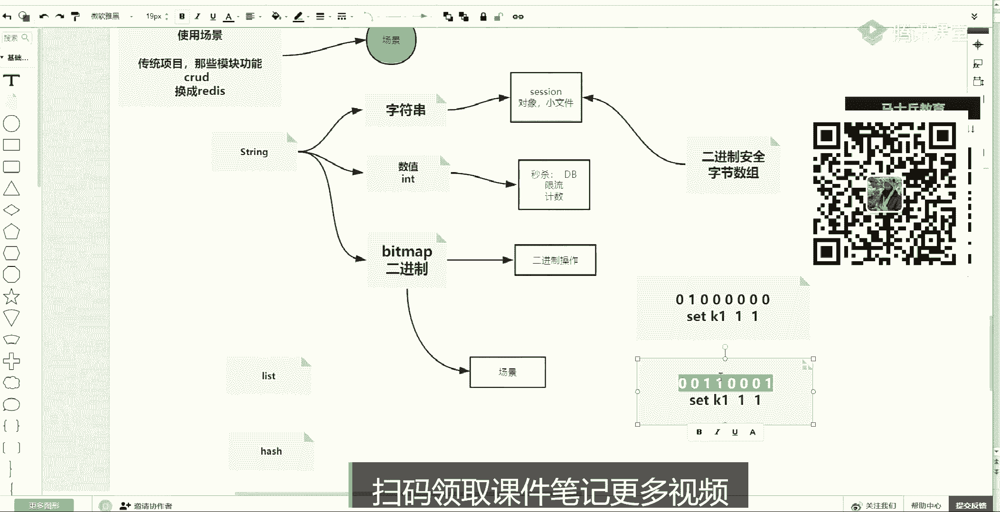

一共是有4个亿的这个这个统计就对了。be count可以统计你给出的字节区间里的一的个数。这个抗位统治统计出来啊，然后最后是B的operations。

bitit of这个operation这个bitat operation就是做二定制的与获飞啊，你后边给出与获飞的操作的那个子子指令and all。

然后给出与获的结果的那个目标的key以及哪些可以去参与。首先我们来整合一下flash all清清完所有东西啊，跟着我思路走set bit。准了1个K1，我在它偏量到一的位置。

然后打了一个一在s和B的K一的偏量为7的位置打了一个一。就就说就是分开了，s the beat。那这个K一的值是什么？😡，🎼就是一个大写的A，就是01001，你懂吗？

就在这个一个字节数组天量唯一的位置打了一个一，就01。然后0000在7的位置，最后一个位置打了一个一，就是010001，然后再s beat1个K2也给了一的位置。

打了一个一再s B的K2给它呃偏量为6的位置打了一个一。那这个请问现在告诉我，请问K2的值是多少？K2值多少？现在K1的时候是0101，现在K2是01010，正是跳两位，它是一个大写的B。好吧。

这两个有了之后，注意看我下面做beat operations，然后做and安慰语，然后是and key的结果K，然后K1和K2做安慰语。请问结果是什么？希问结果什么？get and key。

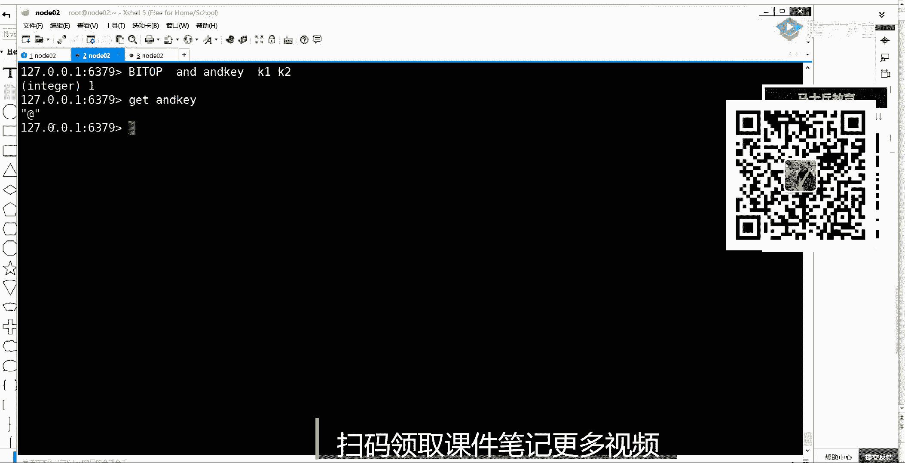

是at为什么回顾一下回顾一下，刚才是在脑子里回忆的，现在我给你解释啊。我第1个K1在内存里长什么样子？我K一。他的字节在那那那内存里长什么样子，我怎么去设置它的，是不是在K一的下标为一打了一个一。

下标为7打了一个一，下标为一打了一个一，下标为七打了一个一。那么K一的value值的字面表示就是大写的A，对不对？

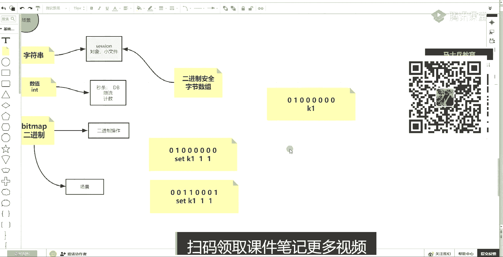

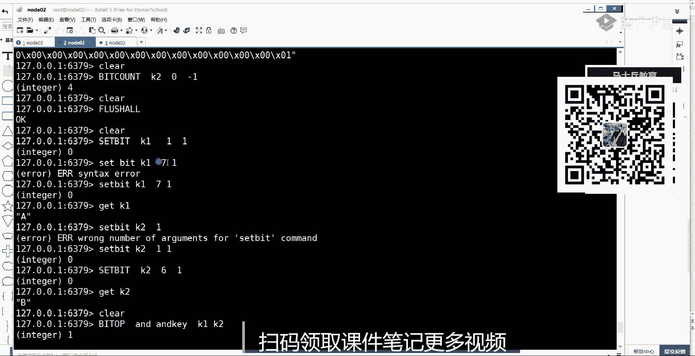

然后后来我又做为1个K2K2的时候，我是不是在下标为一下标为6的位置打了一个一，然后七的位置它还默认是一个0，所以K2的字面值多少，是不是一个大体的B。对不对？然后这时候我如果让他们做暗慰语。

什么叫暗慰语，咱俩与一下，咱俩与一下相互位相同这个高度的位去做那个按按这个二级安慰语语语计算的特征什么特征，全意为一有零则0，所以它的结果就是什么呀？就是你看这个一跟那个零就是零了，零跟一就是零了。

但是这两个一就是一就是01000000，所以结果就是at。

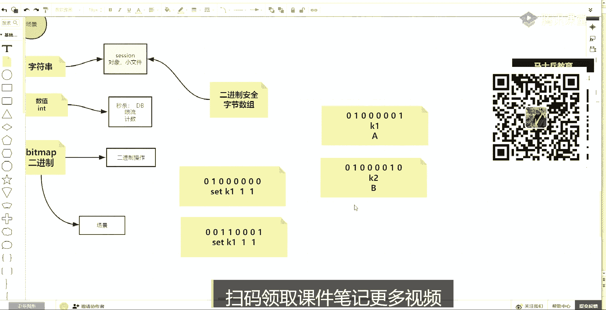

那这个这个第第一步，为什么是under case艾听懂同学同学来刷波6。你还可以做一件什么事呢？beat operation。做货运算就是OP，让K1K2来参与，对不对？这个参与之后回车。

那么get OP它的结果就是一个大写的C。因为按微货计算的时候，就是有一则1，有一则1，全零为0，有一则1就是010011。

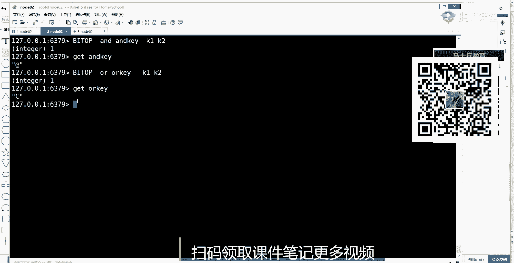

01是110是211是3123，正好是这个ABC对不对。

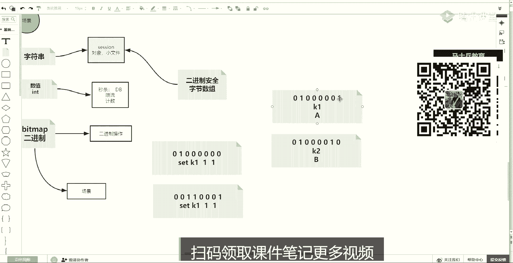

好吧，说这是20的基本操作。这是我讲的20制的基本操作的这块的知识。这个知识只是一个复习。那么你学它有什么意义？

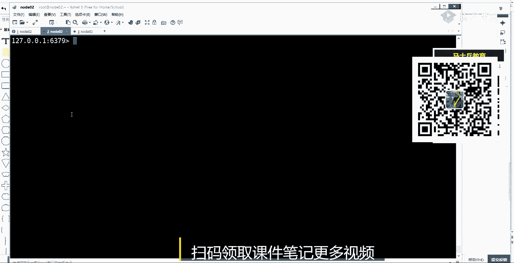

要看它的应用场景，那么Bm可以应用哪些场景，这个才是最值钱的。我再说你刚才听懂了，或者没听懂，下边去翻视频场景是什么？好，我给你一个需求啊。对。第一个需求。让你统计。统计什么任意。时间。窗口。ね。

用户的登录次数。就统计一个用户。这个老板你的老板说了，我指不定让你统计哪天到哪天的这哥们儿，他一共登录了多少次？那么如何落地这个需求怎么做啊？对。你可以用数据库，用日志，怎么都都可以理解，对不对。

这用数据库可不可以？你这张表，你只需要这表里边把你公司这个所有用户的每天登录的事情，888就开始管理管理记录就可以了。你也可以。比如说你曾经没做过这些事情，是不是你来自于你的日志当中会有用户的日志行为。

对不对？你再做一个统计分析，是不是挖掘一下就可以了。但是这时候你的老板可能一会儿给你一个88到8月到9月的，一会儿双十一的，一会618的。同样的数据，他可能给出同样的数据同样的人。

他可能一口气给了你不同的，或者今儿给你这个窗口，明儿给你那个窗口，所以你一定要想出一个办法来，能够让你的数据支撑这种动态的任意时间窗口统计的计算。reis不只可以放在web当中使用，在大数据。

或者你临时分析个数据都可以用，能明白我什么意思吗？那这个时候其实换成reis怎么去做？

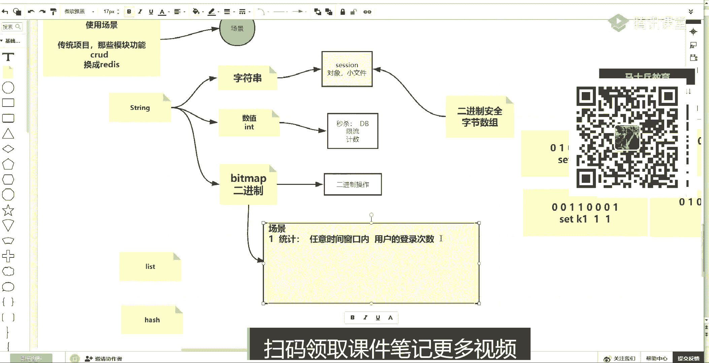

注意跟着我思路走啊，比如说用户我你可以做一个set，先听一下库啊，flash off先听掉。sta beat，然后肖恩，这是keyK就是我我呢，然后后边肯定是valueY呢。

我就想成哎一年有多少天呢365天，那就应该有365个格子。我哪天登录了那个格子，你给我翻一下牌子。那你有什么意思吧？那比如说我第三天登录了，那应该就是012，下标为2，不过制撑一就可以了。然后呢。

比如我第第50天登录了，那就是把下标为49给我打成一。我第365天登录了，那就是364。打了一个一。是这意思吧，那这时候其实你看面向我的一个人，我的数据的统计量。Stam lung肖恩。46个字节。

即便我天天登录，依然也是46个字节，就是46，就是360360。364个1嘛，要么0要么一，对不对？明明白我什么意思吧？哎，然后这时候其实那我这一年登录多少天啊，我是不是登录3天。

怎么怎么你怎么知道的beat count。😡，肖恩从0到负1有3个一。Yeah。一天登录多次，你就一直往里设置一，那么代表这天他登录了，注意听这一天他登录了，这天登录10次，也叫他登录了。

对吧那要说两年的怎么登录的，两年的怎么怎么设置setbit肖恩。然后第八天第第二天的时候登录了一下。那明年的时候set beat。肖恩2021年的第二天也登录了一下。

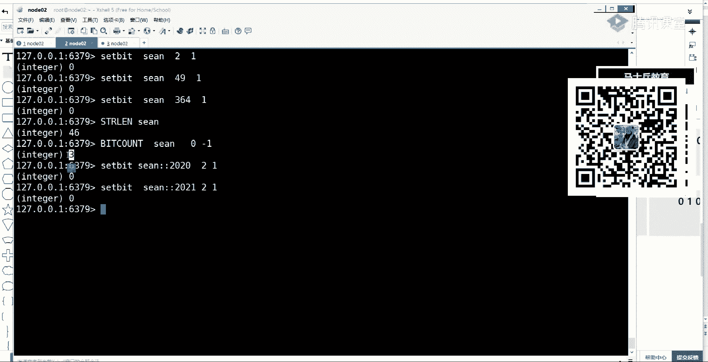

Yeah。很灵活。对要我给了你一个简单的一个题目，其实你要举一反三，条件反射了，这事儿其实可以玩了。

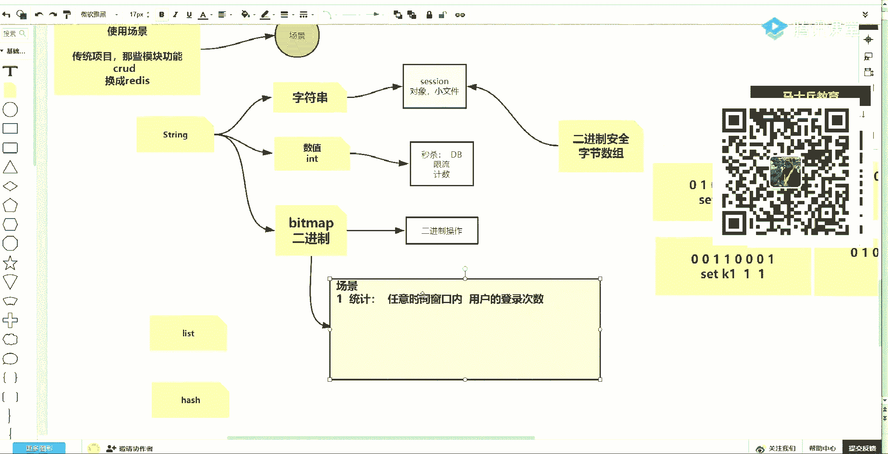

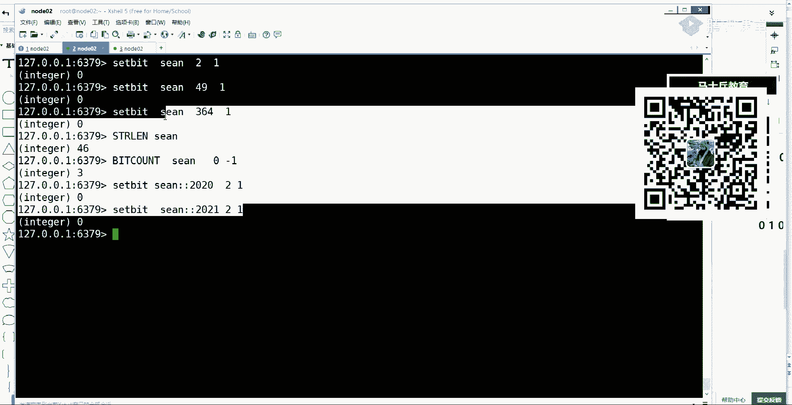

对吧这一个统计，那么这是一个维度啊，这是一个维度，以人为K，然后以自以天数为value料占取你的二进之位再来一个需求。如果那个京东。

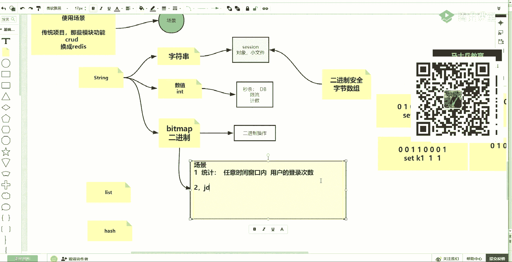

也就说这个肖恩202什么意思？那就其实这个key就是代表肖恩，我在2020年Y6一共有300有3有64个字节，是我每天登录状态。肖恩2021呢就是存到后边这个46个字节365个20之位里边。

就是我2021年的登录的状态，你只不过取了个名字而已，这只是个名字区别数据而已，对吧？

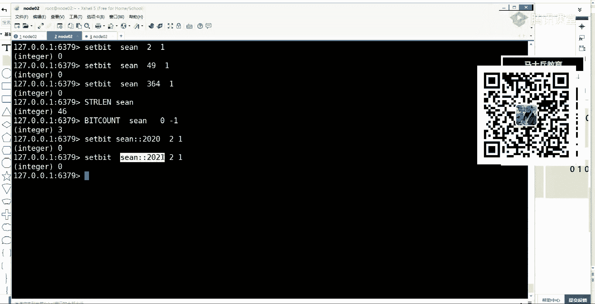

那接着接着跟我听啊，接着接着听他的场景。比如京东是你是你开的啊，你你就是东吧。京东是你开了之后呢，然后比如说啊618双十一，然后呢都想给用户送礼。登录就送一个礼。那么这时候你的大库要备多少件商品备货？

然后假设你有2亿用户。两亿注册用户，你在大库里边备货要备多少件礼物？备多少货啊，是备两亿个吗？看登录人数，你怎么统计出来的？🤧是不是你要根据不同时间圈，你要看历史数据，比如去年的618啊。

一共有这个有多少人，或者看这个临近的几个月，一个时间圈里边有多少活跃用户，你是不是要算活跃用户？

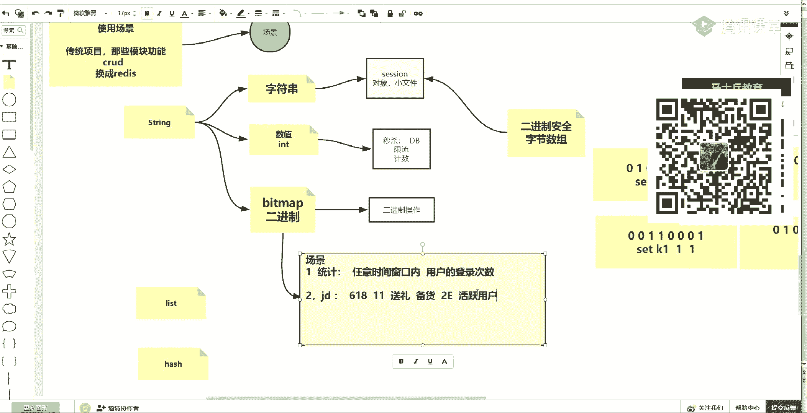

能理解我这个需求吧，是不是要算出一个活用户，那你算活用户这怎么算，怎么做啊，再flash烧一下。😡，用reis这么去做，看着啊。一年不就365天嘛？你公司不就是有这么多用户嘛？用户有ID对不对？

把用户的ID转成0023478小时做做做成映做成映射这这注意这样去做啊。那么一天里边有多人登录，把每个登录人在一个这个表表单上给他勾出来。

比如set在2020年1月1号这一天8号用户8号用户他登录了加一在他那个他在他那个ID那个偏移的位置给他打一了，他代表他登录了。但是这一天里边除了8号用户可能3号用户也登录了。

也给打一个一这一天里边谁登录了，谁就在那个在那个相同的一天那个日期里边，在他那固定的位置。打上一个一就可以了。那这个一行二针之位里边肯定有间隔到很多的一出现。到第二天的时候。

再s beat到第二天7日了。2020年0102这一天，3号用户又登录了，8号用户没登录。那么现在就两天的数据，我问你活跃数是两个人还是三个人。活用是223。你不要看记录数有三条，这是用户的话。

其实8号用户和3号用户，3号用户即便每天都登录，他也是算活用户的呗？那你怎么算出来的，你怎么算出来的？😡，这时候怎么去算，是不是等于有两个K了，一个1个01K，1个02K把他们的一是不是收纳一下。

是不是可以了，先把一收纳，再统计有多少个一，这是两件事情。把一收纳，把两个K里的所有的20制的一收纳成11个一个维度，里边怎么去做啊dat operation做货运算有。

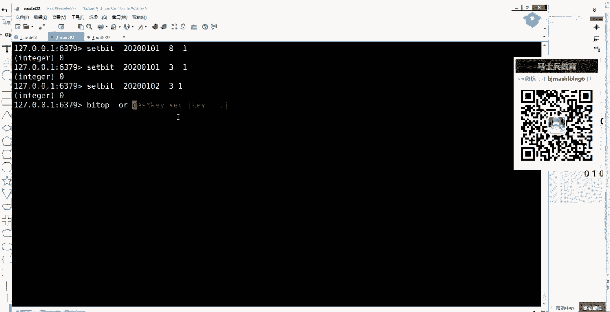