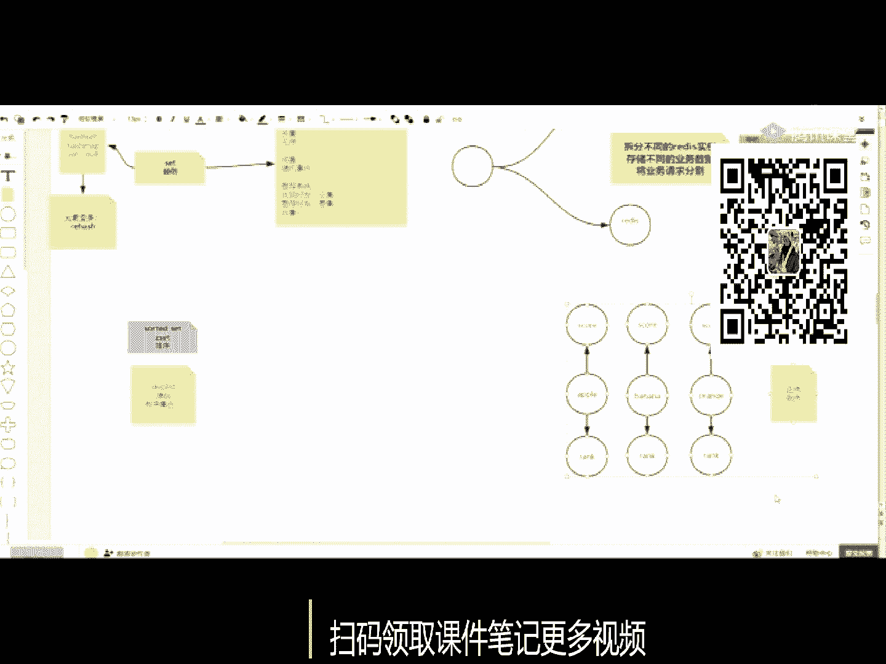
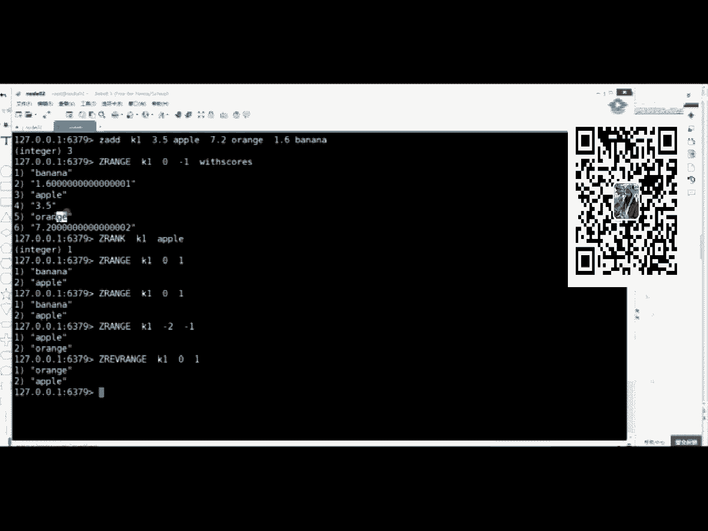
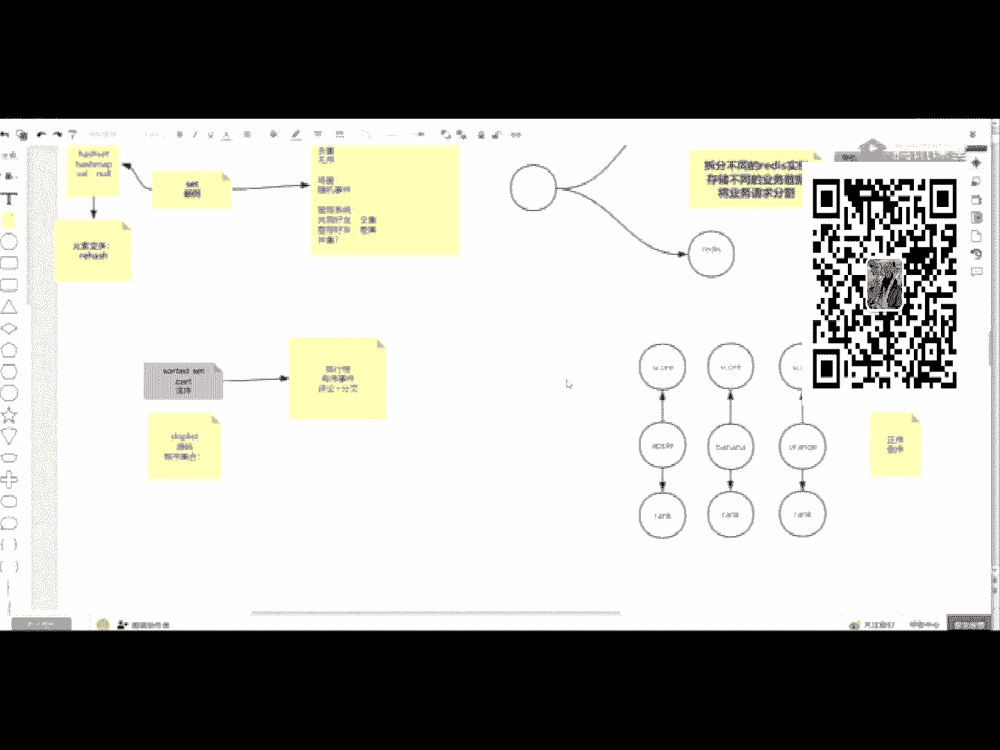
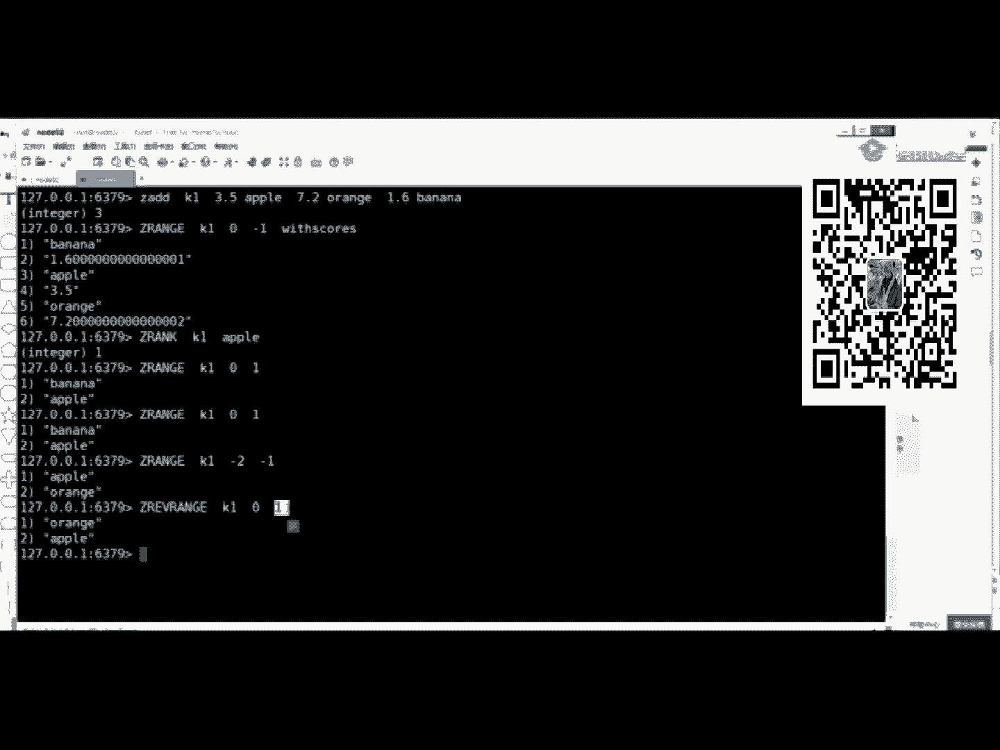
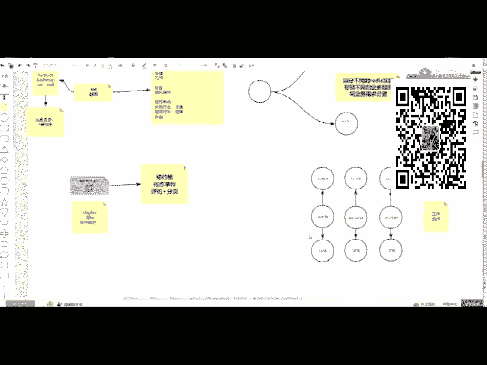
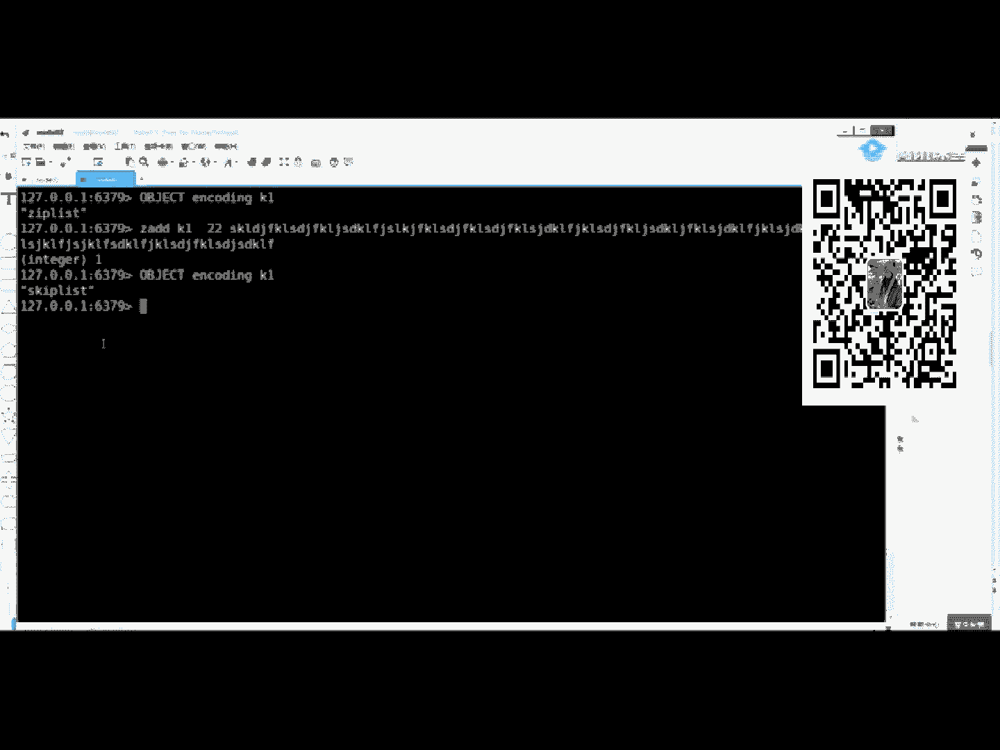
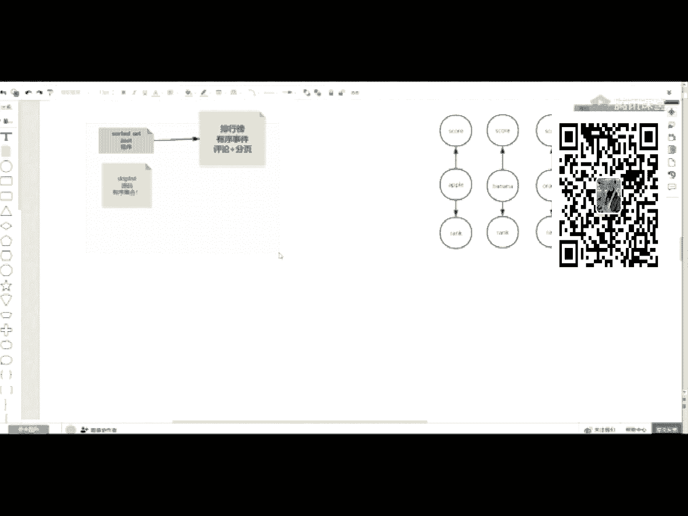
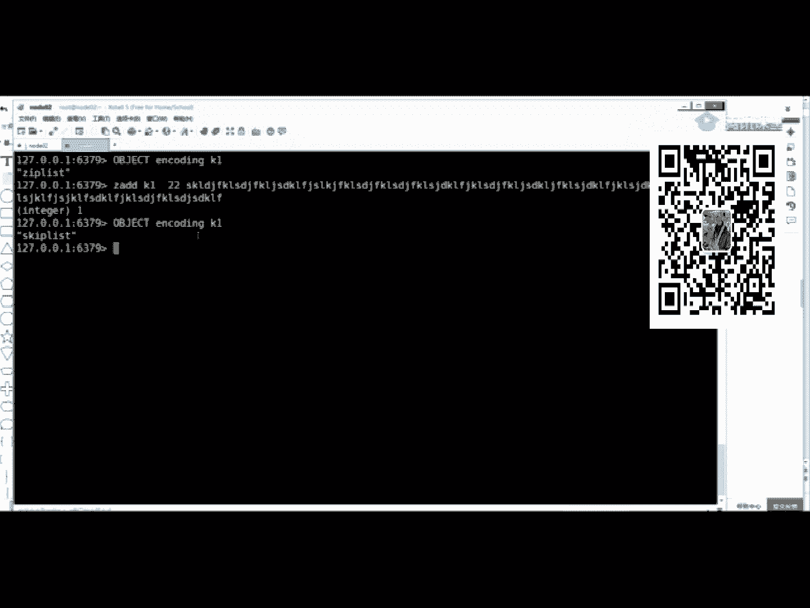
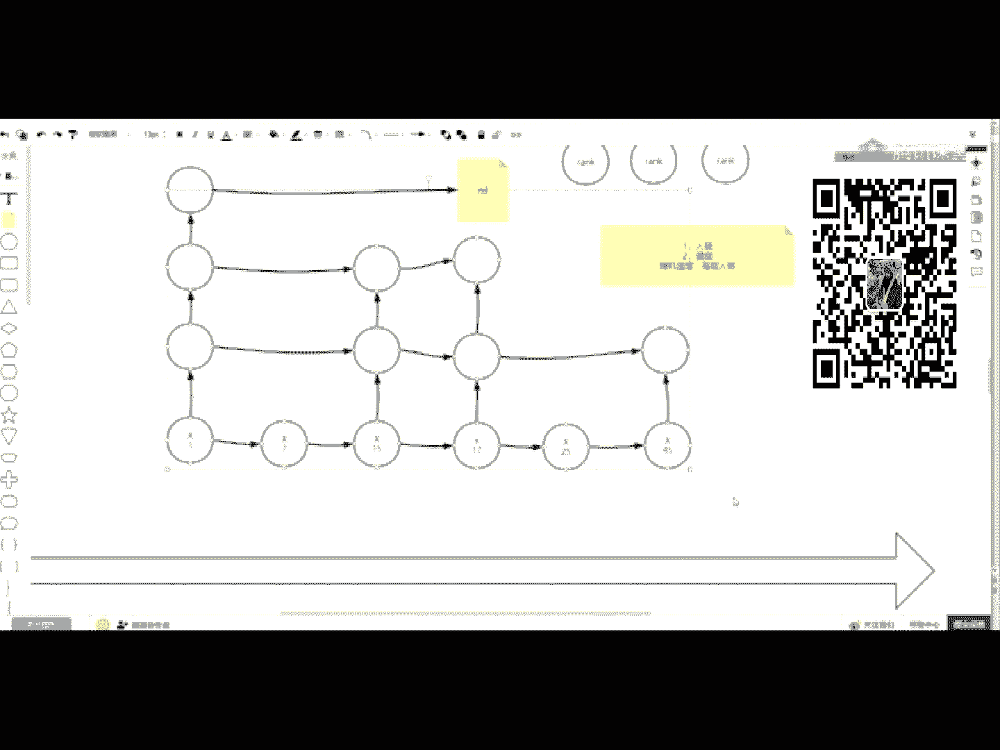

# 白嫖到马士兵教育价值23980的MCA架构师课程一次让你学够！ - P53：redis合集：5、Linux系统的支持：fork、copy on wri - Java视频学堂 - BV1Hy4y1t7Bo

欢迎小伙伴们声音，没问题吧，哦嗯这个雷雷总也在，遇到个大佬，雷军，有人，嗯嗯，算了，看不到画面了，你把你那个客户端重新挤下，已经看到画面了，嗯这个这个我在这打出来，他也看不到了。

what a clap on heart，want to say，gosh，pin a place，shtuesday，i go back，want you to stay bing。

the preciate you，this time of my heart on the day，got your girl in the party，shake tuesday。

i go her want it to stay your part in the prediction，if i want my，哈哈哈哈。

on tuesday that you probably in the party，shake tuesday night of night，i always take your losing all。

this time i was down in a rise of the cal，it is me。

i never found i can to take to the party on the weekend，upstairs like，i said，i'm in i have a bottle。

arsa ship with you，do，so i get a good，look，my want some day，got your girl in the preciate tuesday。

but i love birit want it，tm stakes that you put in the party。

shado that i got my want to say that your pardon，the preciate to say that one day，我tmc有些讨厌你的语气。

真别太过马路，我曾经那些讨厌的学习打光，太是怕他们被人喜剧，你太过卖头，我自碎在是怕他们给谁去，嗯，妈妈妈妈妈，你好，我来我来我来哦来哦来嘞来嘞来嘞，on my my my，啊啊啊啊。

i look for peace to see a dotack money for keeps the soul game plan，love you b，i wanna wanna see。

i'm not the fast，i could come my soul，it's so long to the day and night day and night。

and when i wanna leave my life，be like me，like me，like me for me，啊啊，嗯，啦啦啦啦啦。

啦啦啦啦啦啦啦啦啦啦啦啦啦啦啦啦啦啦啦啦啦啦啦啦啦，啦啦啦啦啦啦啦啦啦啦啦啦啦啦啦啦啦啦，叮叮叮叮叮叮叮叮叮哦哦，快快给当当当当当当当当当当当当当当当当当当当当。

巴拉巴比巴比巴巴拉巴拉巴拉巴拉巴拉巴拉巴巴巴巴巴，啦啦啦啦，嘀嘀咩咩，叮叮叮叮叮叮叮叮，啦啦啦，叮叮当当，呜呜，拜拜拜，啊，i want my tears back。

the trees are searching this，the snow is sis between the green white flowers。

don't let those heather wind in the wheat a railroad cross water，the for grandpa，i love do by you。

it's a wonder，where it all，with the truck on it，takes me there with a relashing for your love，moch啊。

这歌听得我都我都忘了，这个厕所也没上，所以没接这俩事都没办，稍等我一下，稍等我一下，我去我去打杯水，去打杯水，救命，回来了，这个今天没洗头啊，这还有一根小天线，看到了今，听不到声音吗。

小天线应该能听到声音吧，看不到人，一会儿再看吧，咱们先太帅了，怕你们这个不能集中精力来学习，先把我们这个移出去，我们先来讲课，昨天讲到哪儿了呀，真题要讲的不是这个这个是，咳嗽了拉出去。

我这个咳嗽是经常的，昨天讲到了，该讲该讲这个骚鸡赛有序集合了，微问前面的这个应该都看完了，好好去看，尤其预习资料跟老师需要，然后现在先去讲那个有序集合啊，那么开始吧，在讲这个有序集合之前呃。

首先回顾一下上节课已经讲完了一个所谓的一个东西，就是集合，这个已经有一个set了，已经是集合了，为什么还要再出一个有序集合，这个有序是要排序的一件事情，那么排序是干什么用的，昨天有一个录播没上传。

不可能的，这是平台自己录的，这是平台自己录的，你可能是漏看了，那么要谈有序的一件事情的话，我们得先明白集合里边是放元素的，元素排序的话，那么元素应该是怎么排序呢，我们先从生活的角度出发。

比如说我给出一个apple，然后是，orange，然后再来个banana，有问题吗，有一个没回放，第一个没有上传，第一个没有回放，再确认一下吧，一会儿一会儿我下课时候，我也我也确认一下没有这个画面呢。

你就重启一下客户端好吧，待会我确认一下第一个有没有回放好，先跟着我的思路走，然后这个首先说集合里是放元素的集合，为什么还要谈有序的一件事情，这是一个非常非常根本的一个问题，首先说我现在有元素了。

那这三个元素啊可以放到集合里边，放到我们set里边，也可以放到这个soc，但是如果想使它有序放到sc的话，那请问这三个有序吗，现在这三个现在有序吗，apple orange bana有有序吗，没有。

那我调整一下，请告诉我他们有序了吗，他们有了有序了吗，啊有人说有序了，但这时候其实不精准的不精准，尤其是碰到数据的时候，这事不能这么回答，因为元素是以什么方式。

你哪个维度排序这件事情你并没有问能发能理解我想表达什么意思吧，你并没有问他们以什么排序，万一我说的是含糖量，个数大小公斤数，然后喜欢程度，所以这里面缺了一个东西，缺了一个什么呀，缺了它们排序的依据。

也就是car分值，s c car分值，跟着我的思路走啊，因为这个把这个东西想明白了之后，你这个你再去学它的时候，它里边为什么命令有那么多参数，他为什么设计成有分值，有元素的两两种，你才能想明白这件事情。

对不对，这是根本，这是第一个有你你要给出一个维度，比如说含糖量这个公斤数，然后这个营养维c等等，你给出这些维度之后，才会决定他们的排序的这个顺序元素只不过就是自身它的维度，你要给出这是第一点。

排序就得给出分值维度，另外一个既然它是排序的话啊，既然开始排序，排序的时候其实有排名的概念，所以它还有一个一个维度，就是它是第一名还是第二名啊，啊rank就是有元素，有scar分值，有rank排名。

这个才是有序集合，该为我们提供的纬度，相应的这个这个这个数值对不对，就是有一个应该提供哪333个维度啊，就有有元素自身有它的分值，然后按照分值排序，然后还有他的排名，而且既然是有序有序。

里边就会有两种序，一个是正序，一个倒序，那么证据倒叙它是不是能给我们提供以这个维度，这是在我们人的生活的角度思考出来的，对不对，哎那么这个你能想明白的同学来刷波一，这个这个得先懂啊。

这个得懂这个懂了之后。

我们再去学，先把它洗一下啊，release提起来再起一个客户端，shall清一下，这些都学会了之后，然后再help，然后我们的salted s关于有机合，它提供了一些指令。

这些和命令之前前面都是z开头的，为什么z开头的呀，只有分值不就可以了吗，那你分值排完之后，你一个三分，一个八分，一个积分，一个二分，你知道分是哪个元素吗，分值元素的俩收一个都不能缺，对不对，能理解吧。

唉就是分值和元素，因为你最重要的是元素分值值，让他去参与排序这件事情，这个z是什么意思，因为s已经被占用了，那个set集合的开始的命令首字母都是s，所以现在就全都全部用z，然后这个怎么去用啊。

我们看一眼，比如说有zi的，有经验了，添加添加，像一个key添加元素的时候，注意它跟set集合添加就不一样了，set的时候添添加member就可以了，you do the member。

这时候你要必须前面给出一个car一个分值，如果我刚才不讲这个的话，我说咱们要玩友谊集合的话，必须得用zs，然后给出分值，给出给出分值给的有点讨厌这个突兀是吧，那现在的话你就应该知道了。

比如把我刚才那个集合z add对着k1 ，然后先写分值，后期元素这样的一个成对成对出现的，比如说一个三块五的一个apple，还有一个两块，就是这个七块二的一个orange。

然后还有一个一块六的一个这个这个bana，好吧，那我是添了三个元素，且带了他们的car，分值低就填进去了，天气之后啊，然后可以用z range，然后对着我k1 ，然后呢给出起始在瑞文中所有的这种元素。

多个元素的时候，它都有这个star和，就是起始和结束，从左向右是0123678，从右向左是-1-2-3，要取回，所有的话就是零到-1，就是正向索引和负向索引，这么可以结合使用。

然后最后你还可以带着scarce分值刷出来的话，其实你会发现我给的时候是苹果orange和bana出来的结果是bana它的分值，apple它的分值，orange它的分值，这个东西它为什么后边这个小尾巴。

是因为这是一个精度的问题，分裂吧，哎那现在其实看到他已经给我们排好序了，这就是这就是有序集合的本质，到这一步能看懂，回来刷波一很简单的一件事情啊，咳咳，好了那接着再来，它有元素了，有分值了。

其实还有一些相应的其他的指令，比如说z，g2 k的时候有牌子有排名啊，你你你你比如说想取出它的排名是什么，这样给我们k1 ，然后apple他的排名为一，但是这时候注意了他的排名的索引是从零开始的。

零是banana，一是apple能看吗，就是三个维度都出现了，既有rank，然后又有这个元素，又有分值这三个维度，然后再来再来再来再来看，那它一般用它做什么事情，有排序的一件事情。

其实一般用的就是所谓的什么排行榜啊，然后有序的事件啊等等的，那这里面取的时候刚才说了，还有一个正序和倒序，那比如说听我一个语义，我想取出从小到大的前两名是什么，我想取出从小到大的前两名是什么。

怎么怎么取，z range前两名，然后k101 取出前两名是不是叫banana和apple，这就是前两名了，这能看懂吧，这就取出前两名的元素了，这在它已经有序的这个这个结果集之上。

如果再听我换换一个话术啊，请取出这个有序集合的从大到小的前两名，那怎么取，这是从老大的apple orange，那这个时候是不是就是orange apple把这两个取出来，对不对啊，怎么学啊，你说零一。

你觉得元素是可以根据你给出的参数，它就可以在底层翻个个吗，这是不对的，对不对啊，不是就没有改过来啊，我来看别人这个-2-1，有人说-2-1-2-1是负向索引，也就是说你取的整个的索引当中最后那两个索引。

而且负向索引也是什么呀，-3-4负-3-2-1，这个这个顺序就是从右边往左数是-1-2-3-4-5，所以你写的时候千万不要写-1-2，你要按照那个索引出现的那个负负值，在这个按照顺序写出来。

这样的话的确可以取出apple和orange，但是这时候你取出的是从大到小那个排列顺序吗，apple是从大到小的那个最大的值吗，不是吧，这这个其实你取的时候还是还是按从小到大，只不过取出了最后两名。

从小到大的最后两名，所以我的语义你没有实现，对不对，那这时候其实它有一个，在z rt前面加一个反向反向，这时候你再取的话，还是从零一，那么前两名嘛，前两名就是零一，对不对。

那这样取牌的就是orange apple。

这个就整个这个过程当中啊，就跟我刚才ppt讲的这几个概念就出现了，第一你要添加元素给出分值，第二它是有排名的，第三它是有正-2个顺序，你都可以实现的，然后这就是所谓的有序集合。

从概念到使用或者同学来刷波六，逻辑非常严谨吧，当这个你会了之后，它的应用场景，应用最多的场景就是什么呀，排行榜，有排行榜啊，然后有序事件，有趣的这样的一个事件或对列或消息之类的，都可以使用它来完成啊。

比如说还有这个评论评论分页评论，然后加上分页，因为评论的时候我们评论是有时间的，所以你的评论是元素，时间是分值，然后这个时候分页的时候，其实你应该是要么看到最新评论，要么看到最早评论。

就从两端看哪端去取。

然后给出区间，给出这个区间你想取多少条，如果再按一下，按一下翻页之后，只需要区间这个区间值，这个值固定的，只需要换一个起始这个这个这个位置就可以，然后后面加上那个偏移就可以了。

这样翻页也非常灵活，而且都是动态翻页，因为你在翻页的一刹那，如果别人评论的话，上一页的会挤到下一页继续看到，这样效果非常好，这是它的应用场景好吧，那么这些其实都是非常好理解的，最重要的是它是如何实现的。

就是这个有序集合啊，它是如何实现的，我们来看一眼啊，通过tap来看，我们刚才t一它是z set，是我们有序集合，还记得那个命令的吗，就一个o b g，然后e n coding，然后我们的k1 。

那现在给出了一个它底层使用的数据结构是jp list，好压缩表呃，我们上面说的类似这个value的类型和有序集合，其实它底层在你的添加的元素特别少的时候，它都会使用这种压缩表来节省内存啊。

就是类似于在一个线性数组里边把这些元素摆好了，然后之前加上一些偏移就可以了，这是非常省内存的，但是当你的元素特别多的时候，比如说z i的对着我的k一要么多，要么一个元素非常之大的时候，就会超出它。

就就会就有一个底层这个存储结构的一个变化，比如我添了一个分值99，这个22的，然后它的元素是，这个元素的值有点大，看到这个元素的值有点大，一定超过64个字节了，贴进去能往里填。

然后这时候你再看ob加including就是skip list，好吧，评论的数量太多，放缓存合适吗，看我上节课，我上节课讲过一个会维持一个合适的平均数的一个list，它有结果l trim。

然后像刚才如果你真的要使用有序集合展示你的评论的时候，这时候其实它作为分页，那么证明其实用户看不同页的评论的情，这个场景就比较大了。

就更关注这个评论内容了，所以这时候是在不同场景下，你做一个取舍的问题，因为如果你只是拿来做纯缓存，就就快速取回第一页内容的话，你用list就足可以了，特别trim它还可以清掉。

但是如果说你这个用户的行为习惯偏向于看很多的评论，而且这东西可能不叫评论，它就需要一页一页一页的，因为他不不想一次性io太大，取回所有东西，那这时候大部分用户还看全量，而不是只看第一页预热。

那这时候你最好使用有序集合。

是这个道理吧，哎所以这是一个非常灵活的一个一个一个事情，起码说release给你支持起了这个功能，用不用是你的事儿了。

对不对，翻回头来说说这个skiplist，也就是说有序集合，其实它底层啊，像这种压缩表，我们就是这个既不历史就不管他了，我们只聊这个skiplist，它是如何一直完成我们元素有序这件事情的，好吧。

这个问题问题就一会儿我们最后可以可以回答问题，现在先跟着我的思路走，咱把这个有有有一个底层，那个是个例子讲讲一下，那么讲他之前啊，讲他之前我先给你一个状态啊，就咱们先评论一下，比如说有这样的一个集合。

这个集合里边有元素x它的分值，比如说这个一，还有我就把所有元素都叫做x了，然后还有一个是，先让它有序起来啊，我先让他有序，然后呢我们找找感觉之后，先说这个修改插入的事情，当这个会了之后。

你知道他是一个什么逻辑了，再去讨论它从最开始的时候没有元素的时候，是如何构建出一个有序有序表，这事能想明白了，那么一步走一步推导，这个世界上为什么要使用这个跳跃表来维护有序。

它的时间成本和这个复杂度是一个什么情况，当你有一些元素的时候，假设一七十五二十五四十五，这是他的标分值，他们呢先组建一个链表啊，先组建先组建出一个链表来，无论你是zip list list。

其实这个list的感觉是要有的，那么先不说跳跃表示，先不说跳月表的事，先不说跳的事，先说这个普通的一个链表，当你有一个即可有一个元素，这个元素也是x，但是它的分值比如说是17，那么时期应该放到哪个位置。

才能保证它还是有序的，应该放到哪一个位置，它还是有序的呢，那么如果只是一个单向链表的话，然后你需要做的事情就是跳啊跳啊跳啊跳啊跳啊跳啊跳的诶，你比我大诶，你别你比我小b大，你不对。

我我一脚就插在中间这个位置可以了，但是这时候其实会有一个最大复杂度，有可能会差，最后就是其实它倾向于是一个o n的复杂度，有点慢，对不对，插入有点慢，那么如何调用它，如何调用它，其实什么叫跳表。

是这样的，它有一个牺牲空间来换速度啊，节省这个这个这个这个这个就拿拿拿一点时间来浪费一下，减少一下这个提高一下这个速均衡速度，它是一个渐层的一个概念的，比如说第一个元素就见了老板拉一下。

造了一个三层的一个房子，什么叫三层，一个房子是现在这个列表当中的每一个元素不只持有上下游的指针了，每个每个元素除了自己，然后分值他自个儿手里还攥了一个重组和链表。

一个若干层的一个这个层会水平的每层再维护一个链表，只不过这个链表不是向下边，应该是满的，它是会跳过，比如说这个就连到了他中间，他就没他，他就只有元素，没有自己那个那个那个那个那个几层那个房子。

先跟着我的思路走啊，你先别猜是什么，你你去推导，你去推导这个过程，推导的过程，然后他到最后可能指向了是他，然后二层的话，这边又来了一个层，然后到他了，然后他呢起起始绕，再没有元素能达到这个层次。

然后它就是new，谁也没指，没有指向，好吧，我先把这个层次给你画出来，这个层次画出来之后，比以前的这个单链表肯定牺牲了一些空间，对不对，能有什么意思吧，他肯定牺牲了一些空间，但是这时候大家注意看。

如果我拿着17，这个17应该去哪，其实17先来到第一个元素，然后以它这个元素最高的那个层次来判定下面的那个元素大小，如果比他大，ok那我就应该在你的右边找，但这个层次里边右边是没有的。

所以它降层相乘之后来到这个层次之后，然后找它右侧有右侧有，之后来到这个右侧，看元素是15 17，比你15还大，但是把你的右侧走，你右侧又是一个new没有，所以这时候我依然要降层，再降层的话。

然后走到这头是一个45，哎我这个45比他小了，那这时候其实你可以跟着往回勾，也可以再往下降层，往前往前跳跃，就一定能找到这个25，那这时候其实这个表因为它长度不够啊，这只是跳过了一个七。

他只是跳过了一个七七，是不是没有没有比较过，只是比了一个一，然后比了一个15就过来了，他跳过了一些东西，如果这个表足够长的话，其实这个优势是可以显示出来的，这个就这第一步先有一个有序，先是有多层的。

他这个查找并找到正确的位置，插入到这步能听懂是不一唉，足够长，高度是多少，这个题我给你解释，咱们看一下源码，刚找到之后，我们先说插入是一个什么顺序和逻辑，它是怎么工作的，其实如果把插入一个元素。

你想明白了，那么这时候从表示为什么都没有元素的时候，从第一个元素怎么构建，你能想明白了，但找到10 15和十那个二五之间的时候，它的成本是多少，他做了两件事情，在这一定要说说清楚。

二表示做两件事情的第一件事情是把自己入量，是入殓，不是入殓，入这个链入链是什么意思，其实都已经找，从这个他已经找到了，已经跳到这儿了，其实只需要把自己的地址付给他的指针，他曾经持有他的指针。

赋给自己的吓一跳，next指针，所以只是一个地址指针引用的一个修改，成本很低，这是链表该有的特征，到这步能听懂，原来刷波六，这是入殓的过程里，也就是链表的基本操作，那么它比链表list的多了什么操作了。

在每一个元素的增删改数量的时候，它有一个第二步，第二步就是渐渐层，他要建一个层次出来，那建层是什么意思，他会随机造房子，注意这是一个随机的行为，它随机造若干个层，比如说假设是一个抛，的确是一个方面。

假设建两层，它会有一个从这儿出一个两层的链，两层链的第一层链，那其实找到属于这个第一层链，它它这个层的这个这个左边那个元素，那怎么找到的，来自于它底层往左飘，找到你的元素，判定有没有上一层，有的话。

直接把你上一层那个指针修改就可以了，其实依然是一个修改指针的指向的一个过程，然后等于从这背离到这儿，拿到它的指针修改它，然后它如果还有一层的话，如果它还有一层。

其实这时候就看刚才你找到这个这个这个这个判定，它是不是有上有下一层，有下一层的话，直接把下一层的指针指过来就可以了，如果他没有下一层了，那只需要从这层往前跳一下，找到上一层，所以这时候他不是在底层。

纯欧文的一个便利，是这么这么这么往上跳，这个建桥建房子也是跳跃的，找他同层的最近的最最最左边那个那个那个勾就可以了，这个能听出来刷波一，你就是建层的时候，第一个是随机造成，然后每层会入链。

每层要入链就可以了，那这样的一个造成入链，造成入链，最终给我们的一个拓扑，就是它有很多的层次，这个层次其实越往上的话，这个元素的高度越倾向于稀疏，那跳跃的越远，这样的话整体的大量的增删改的操作的时候。

他这种这种跳跃表的速度和我们红黑树的速度，其实这个成本是差不多的，不过什么呀，红梅路的语法对这个这个算法比较比较复杂，这种是比较简单的，直接的，能理解现在什么时候跳跃表了吧。

这是面试常问的一个基本的这么一个数据结构。

