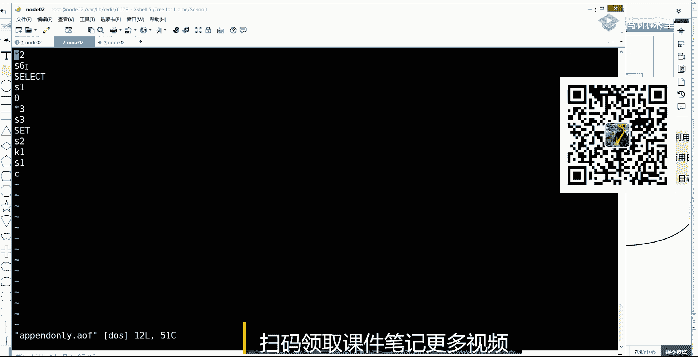
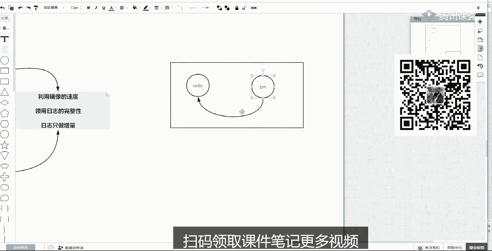

# 白嫖到马士兵教育价值23980的MCA架构师课程一次让你学够！ - P54：redis合集：6、Redis的持久化：RDB、AOF、RDB&a - Java视频学堂 - BV1Hy4y1t7Bo

讲的时候都会问那层数层高的得多高，是十层还是1万层，还是还是还是几层，哎比如1000万大一千万。

这个这个数据多少层，对不对，来我们看源码，当你打开我之前，是不是教你使用源码编译安装的，对不对，所以你应该有一个源码的目录，src这是它的所有源码，c开头的a开头都是都是它的源码。

在源码里面你找一个this set有序集合啊，这个源码文件，点c这是一个c语言写的一个源码文件，这是他的，然后在这里面你搜索一个random，这有一个方法啊，返回一个int值。

这个方法是c这个this set，然后这个s是skip，然后l是list啊，就是它的跳跃表，random level就是随机的一个层数，然后给你返回一个值，这个值是取取什么的值，注意看return。

这是一个三木的一个判断，这个判断里边是你在上面这个while循环在随机数造成的时候，指定是悬空了多少次，造出了一个level值，让lel加一，指定加了多少次，你这个level值小于它一个常量值。

就是sky的这个max value最高的层数，如果小于它的话，那就取你这个值返回，但是如果你的值没有小于它，等于或大于它的话，那就取它的值就是最高最高你的层数是他给出的一个max value。

这个能看懂，回来说不是一，就是这这个这个srt里边这个随机随机造成一个函数，很简单的一个函数，相当简单，对不对，这是它的代码是相当相当简单，就是为了这个速度快，那现在你就只需要找一个点。

那这个这个常量它的值是多少，退你把它复制一下，你把它复制一下，保存，然后在这里面grep查找我们刚才给出的这个，字符串在当前目录下的所有文件查找回车。

他会给出很哪些文件包含它了。

那在这里面你会看到一个define定义啊，是在server。h这个文件里边，这其实已经看到了，是64了，到时候再带上，你再进去看一眼，它的值是多少，是64，好吧最高是64层啊。

是超不过去的啊，这到这步能听出来说说一相当于出去面试阐述你对面是你要对面，如果阐述什么第一啥是跳跃表啊，就是这样一个就倾向于跳过一部分东西，减少欧文复杂度的一个便利。

然后这就它比list多了一个层的概念，每层越往上越稀疏，那造成造多少层，告诉他原本有看的是一个64的一个常量，搞定这事儿说过去了好吧，ok收，这并不是特别特别特别特特别值钱的一个东西啊。

然后我可以看一下我这个版本多少啊，嗯这个version是，在前面能看到我当前的版本应该是一个五点点七的。

好吧，说这个因为这节课的知识量还比较多，那么五大y的类型回去自己复习吧，所有的这个value它的使用场景，然后他的一些有用的地方能解决一些问题都给他想想一会儿，如果在有时间的话。

我把我今天想的那个如何用redis，解决12306这个购票系统的复杂度的一个问题啊，这个是基本上就是按照昨天那个bmc来来来来来来解，来来来设计的一套东西，好吧收呢我们来讲讲接接下来的知识知识还比较多。

下面讲一个知识点，这个知识点里面就是关注的是redis的一些底层的，就是其实你可会可不会，但是里面试必问的一个知识，其实这下边很多的知识对于你来说问题不大，看你的这个收入层次。

如果你就是一个普通的一个程序员的话，那像持久化呀，然后集群啊，分布式这块的东西，你可以不会，因为你只需要cd就可以了，但是如果你越往上走，然后你面试的岗位工资越高，然后工资越大。

这块是基本是常问的一个问题，是的是这个是这意思吧，这个这个应该应该都能都能接受吧，然后看第一个，首先讲它的持久化这块的问题，redis本身是一个内存的，它速度很快，但是内存的话就会有一个问题。

掉点一失了呗，唉这就会掉点一失，那么在持久化这个层次，先抛开redis，而任何的存储技术，找存存数据的都有两个维度，无论你的mysql也好，就是即便这种使使用磁盘来存数据的，它都有这两个维度。

一个维度叫做快照，一个维度叫做日志啊，有人说了，说这个买买买sql关系数据库有拍照吗，有吗，有还是没有，或者是你的操作系统有没有快照啊，什么叫快照啊，最low的一种方式啊，最low的一种方式。

什么叫快照，比如说像我还是我好久好久以前啊，就是这个数据库我们都得ed去定期存一个时间点的备份，或者你玩游戏的时候突然玩玩了，然后游戏一卡，然后你刚爆了一把屠龙游戏，卡了之后没了，那个其实就回退了。

对不对，你可以对着一个东西把它磁盘上那个数据给他拷到另外一台机器去，那个另外一台就是这个原始的数据的一个快照，一个副本能理解什么意思吧，所以这个任何技术其实都是有快照，快照是一个什么东西。

就是你这个某一种技术，它某一时刻的全量数据的一个副本，只不过在redis里边，因为re的数据在内存，那么快照就是周期性的，像一个磁盘，把内存的东西做序列化，直接写成一个文件，那么它的优势就是恢复速度快。

因为这个是等于序列化，就跟这个对象序列化反序的话一样，你把它夺回到内存，这个数据就展开了，不需要什么计算和这个这个这个这个这个推导的过程，但是它有一个缺点，缺点就是丢失的比较多，因为你八点做了一个快照。

到九点的时候刚好刚好拍拍照，结果他挂机了，那你就丢失了将近不到一个小时的数据全丢了，这个什么是快照，能听懂，同学来上班一，那么基本上技术都会有日志啊，mysql有blog等等的日志是什么意思。

日志是你所有用户和这个系统的交互的时候，增删改的操作我都给你记到一个文件里啊，喷子喷的追加，那这样的话就会在一个文件里记录所有的操作，这样的话它有一个优势啊，优势就是完整性比较好。

因为你每一个操作发生的时候，我记我都有一个能力给你立刻记下来，但是它会有一个问题就是什么呀，他不是有一个问题，有两个问题，他的问题有两个，第一个问题就是因为它恢复的时候要重放。

你这个日志里边所有的指令重新执行一遍，它内存展开变成那个最终的一个数据的样子，这是他第一个问题，第二个问题，这种日志啊都是append的追加的，追加的会有一个现象。

就是比如说我对着这个redis创建删除创建删除创建删除，玩了10年，就是创建删除创建删除，那这时候你会发现书这个re内存里边就是有k没k有k没k，有k没k有k没k最后创建。

那最后那次里只有一个k内存消耗不大，但是你低头看你这个日志文件，它一直往里追加创建删除，创建删除这个文件可能就几个t了，能理解什么意思吧，也就是这个文件比较这个冗余量比较大，体积比较大。

然后里边记录一些失效的无意义的这种这种操作，注意注意听啊，注意听，这是俩问题，这是俩问题，这是两个独立的问题啊，第一个问题是必然的，你使用日志的时候恢复肯定慢，但是它好吃就完，比较完整。

只不过它的日志和对家的时候会有一种鱼，那么这里这里面这两者会有不同的解决方案，先说啊，常规的对于冗余的一件事情的话，我们可以对它做一个所谓的重写，重写重写就是去冗余的，你就把现在去冗余之前写了。

创建生猪趁机生成建成竹创建，那这个111样的一个发生定点一发生重写之后，把前面创建创建删除，创建之后没有用的东西给它删掉，就留留下一条创建就可以了，明白吧，这是一个所谓的重写，但慢了事不能不能改变好吧。

那慢的事怎么解决，先知道有这两种方案了，那么来来操作啊，再再扩展一下，在日志里边就记时日，这个行为的时候其实只有三个级别，一会我做压测的时候能让你找到这种感觉，它的三个级别是每每个用户的行为来了之后。

然后串行的立刻记记到磁盘上去，就是每操作都完成写操作，写写日志，这个不是默认的，默认的是下一个级别，就是每秒钟会触发release，把这一秒钟之内的写操作刷四单一次，或者是release。

不管向磁盘刷写的事情，完全留给操作系统内核的缓冲区，满了就往磁盘刷，那么它默认工作在这个级别，就是每秒钟会把那那个还没有刷写到磁盘做一次flash，然后最高级别是每操作都要向日志文件去写。

那么其实打如果你开启的时候啊，如果开启这个级别，你会发现你的redis降级就降到了和mysql啊，这种这种使用磁盘记录的这种其他技术的性能就变得很低了，所以要不要开启日志持久化。

要不要开启这个最终级别是取决于你的业务系统的这个这个需求的，如果对数据的可靠性要求不是特别高，其实不推荐开启这个行为，因为你破坏了redis最重要那个那个那个特征，就是快好吧。

一会我一会我给你做鸭子的时候，给你演示一下，这是两个最基本的常识概念，往下走，那么怎么去使用，注意一个版本的变化，在四点叉的版本以前，r d b a o f注意听rgb默认开启a n f默认关闭。

就是现在也是默a f也是默认关闭的，就ready，自己都知道，最好别用这种日了，因为它会有i o的这个频繁的影响，速度比较慢，但是你可以开启它，但是注意在老版本中，如果你开启了a o f。

那么r d b就不起作用了，四下伤害，以前这俩里边只能选一个，开启了a n f r d b就不不不生效，ready，重启的时候，他就会拿着a n f去回滚，所以它的慢这件事情就会放大到这步能听懂。

学来刷波一，这是最基本的一个常识，数据面试就要这样阐述清楚了，但是高版本有一个变化，4。3之后有一个新特性，这是很多技术都会实现的一个一个一个特点，就是将一个将这两者的优势加起来做加法。

去掉他们身上那个不好的一点，得到一个新的使用形式，就是混合使用，混合使用的结果其实还是a o f这个文件，但是注意你定期一开始，比如你开启了f它就一直在追加，追到好大的时候，里边很多冗余，你要把它删掉。

给他做一个规整的时候，你在给他做山种鱼这件事情，这个成本很高，不用它了，直接先来一个快速的内存，卸一个rgb文件到ai文件里边，直接把内存的所有的这个数据二进制的直接存到这个ai文件的文件头。

然后并把后续追加的日志增量日志，再追加的这个aoa o f文件里边，也就是没错，是归档加日志，而是日增量的，那这样的话rei再重启就不是只拿一个简单的af，是拿了一个混合体的af。

先把前面都快速的这个反序列化等内存，然后再把增量的日志执行一遍，这个日志就比上面那个增量日志就小很多了，那这样的话是一个趋向于一个最合理的一种使用持久化的方案，像我们的hdfs也是这么一个概念。

fs一妹子和is lab这个id log日志增量的fc fs一配置也是一个快照，他们会拿另外一台机器去做一个这个这个这个滚动，把增量的日志一直向s位置里边去整合，那么增量日志永远是少的。

只要你的日志体力一直保持很小，你的快照一直是这种这个最最近的一个某一时点的拍照，那么整体的恢复就一定是最快的好，那到这个环节点都能听懂，同学来说一，不只是redis，其实这样的技术技术类东西。

它是它是一个比较基础的，很多上层技术。

它底层可能使用了同一种技术，唉怎么使用，现在我都给你演示一下，都给你演示一下，刚才理论听完了，我们来演示，而且把压测也走一遍，找到一下它的性能的问题点，因为这些点你找到了的话，那我们讲下面分布式啊。

讲一些东西，你就可以get到它的特征了，第一个先找到它的release配置文件，v i t c redis 6379点com，这个配置文件大家走一下，我们先找你回去玩的时候。

要把这个只绑定要这个本地地址，这个事给它注定，然后呢把这个私有模式给它改成no，要不然的话你改成yes啊，别人是连不进来的，来到这这一个slipshot，就是快照啊，存那个r d b的这块。

我是直接给它关闭了，r d b没有什么可讨论的，我就直接给它关了，就是把这个参数三个参数直接改成cf空，把这r d b也关了，我们只是在关闭的情况下，一会儿他的a f混血都能实现。

所以这跟r d b是没有关系的，然后再往下找，找到我们的，af的环节，这里面就是ios的章节配置文件，其实它的文本描述是特别多的，如果你有精力，我是非常推荐你把它的配置文件从头到尾过一遍。

你对它的配置的属性值得越多，你对release越精通，很简单的一个道理，然后注意在af就是append only file这个章节当中，你要先开启append only，开启这个功能，默认是关闭的。

开启之后，然后向下它会有一个三个级别，这三个级别当中第一个就是每操作都要写一次磁盘io flash一下性能很低，我先告诉你，然后最后一个就是re，不管flash，只管right，不管flash。

它什么时候flash到磁盘的，由内核决定，这是最快的一种形式，开启a f的这种这种情况下，我们先用最快这种形式来演示，release，不染指io这个这个这个太太太太多的io的时候。

就只开着a2 f不然是太多i o的时候就没有这个级别的时候，它能最大的这个上限的速度是多少，一旦开启它会有什么风险出现，一会儿给你表表现出来，最主要是看这个配置的区间里边的最后。

哎在这儿有一个a2 f use，使用r d b上面告诉你了，你的文件当中会出现r d b file，在前面a o f的ta追加的，在后边，我们先给它改成no好吧，那么这样的话就还原到4。

3版本以前的release的一个特征了，到这个过程当中都能听懂，同学来刷波一，我们来演示把它保存保存之后呢，是redis server加载，刚才我们改的这个配置文件，6379，跑动起来之后呢。

我们去看一眼他的数据目录是在war，然后live redis，然后6379，这是在我给你预习资料安装章节当中都已经说过了，他会拿哪些目录来做什么事情，这里面会出现一个append only这么一个文件。

这个文件当中我们打开先看一眼啊，它就是一个普通的一个文本文件，而且跟我上次讲那个协议是一样的，哎几个几个几个token那个元素，第一个token它是多少个字符，第二个token是多个字符。

然后又三个token，三个token，他们每个是多少个字符，多个字符，多个字符，这是追加的指令，就是我们之前执行的指令都已经追加进来了，看到了吧，有很多，我先给他清一下吧，然后看了简单一点。

release scl and flash all，然后bg bg就是在后台做一个rewrite f，因为现在我是不是已经把库清干净了，库里已经没有任何东西了，那么这时候我如果做了一个后台的一个重写。

我的a o f这个追加文件，其实他会把那些失效的没有用的指令给你删掉，他们大概就变成零了，这是第一个表象，这段看我给大家稍微一，其实我可以给你做的更更更容易观看一点啊，比如说set一个k1 a set。

一个k1 b set，一个k1 c，那么这时候库里边只有一个k，它只是c，那么在日志文件当中，目前他一直在做，就是第一个问题，他一直在做着追加，他的追加体量比较大。

因为这里面k一的值是a是b是c它都记进去了，那这时候如何什么叫做重写你手工或者根据它的配置文件，它定期根据这个文件长大之后，它会自动的去触发bj rt去重写这个文件，编辑只要一重写。

他需要做的一件事情就是还是存的指令。

只不过无效指令或重叠指令就被剔除掉了。

他最后就留了一个k1 c，这是早期的版本，它a这个append only file文件依然记录的是指令，铭文体积比较大，这个这个回顾这个启动的时候，重启的时候依然要解析和执行它，这个能听出来刷波一。

那么我们现在只需要改配置文件，700多行吧，往下走，把他的混混血模式开启，啊不是这下边啊，在这，把混血模式开启，然后再跑起来，跑起来之后，然后呢再再来实验啊。

先来看we append only file，是有这些东西，然后他现在是c，然后我开始追加继续改啊，继续在sk 1 d sk 11 sk 1 f那么首先文件又被追加了一些指令。

但是这个指令当中最有效的指令是最后一个f前面都应该被清掉，早先的话会留着这个指令的铭文，但是现在如果开启混血了，再触发bg这个指令，这时候你再来看这个文件，它的头部就变成一个乱码了，这个乱码是因为什么。

因为是现在就是r b这种二零制的序列化的一个结果，而再不是铭文了，那么一会儿我重启的时候，前面这一段加载的速度是极快的，听我同学说不一，关键是他除了头部放了一个刚才那个那种2d的序列化的东西。

如果你继续在sk 1，然后歌set k一巴拉巴拉，那这时候他必然还是个aos，也就是后续的增量的日志。

他还hold住，还能继续管理记，那这个时候这个文件af就是二零制的头加上增量的日志。

两者恢复理论上已经是最快的这种方案了，人口多来刷波666，什么时候触发，带你看看配置文件啊，把它结束掉，它会有一些相应的配置，这是你写入写入这个级别的配置，还有一个配置是它触发后台rewrite。

这两个参数，一个是只是起起，起初的时候他达到64兆了，然后呢就给他重写一下，重启完了之后呢，后续又大了64兆了，然后呢再往上涨，超过64到百分之百的时候再去重写。

然后一直晚上只要超过上一次值百分之百就重演，就一直一直晚上晚上晚上就只有一个后台的一个值可以触发，他去后台重启这件事，你不用去管，这是服务器的这点金，用来刷波一，好吧，这是一点给你演示完了吧。

这是一个新特性，就是它的持久化a是混合使用的，另外一点我们再来把它跑起来做一个压测。

为什么做压测，这个压测还是一个，很重要的一件事情，因为你很多理论会让你蒙，首先压缩它提供了一个首先首先就是注意看啊，现在单机内，因为你ready怎么拥有很多的场景，场景不同，它的性能指标是不一样的。

我们先说在一个一个操作系统内，既有一个redis进程，然后呢又有一个benchmark，一个他自己的一个压测的一个进程，都在同一个操作系统里，那这时候他们是不经历物理网络的。

就在内部的内核就来了一个快速的一个访问的过程，也就是当前的我这个note 02里面既跑了一个redis，我又可以跑一个压测，亚瑟怎么去跑，是在你它提供给我们吗，redis。

然后有一个bench mark这个这个这个小程序help它的参数很简单，而且它很多都默认值啊，你不写参数，它都有默认值，刚来是连哪台主机，默认就连本机默认端口6379。

然后这个下边杠杠c杠c是class，也就是你的对它的连接数，connections就是对你的release要建立多少个连接，它默认是50个，然后这个杠n是request多少个请求，默认是10万个。

港d的话，默认是三个字节的一个体量，一个y的大小，好吧，然后我们先看这么多啊，往下走怎么去测，用redis benchmark杠c，因为杠h就连自己这个默认就可以了，杠c的时候注意看他默认50。

我改一下，注意看注意看这个思路的，我用4000个连接高并发4000个连接压一个re，然后杠n给他发个10万或者百万的这么一个请求过去，刚才忘了看了，还有一个杠q啊，一般我们就带着gq使用css静默模式。

不显示那个详细的日志，然后呢还可以带着一个杠t给出你使用哪些指令command啊，来来去做这个单独这个这个性能指标的一个测试，我们就杠q静默杠t只是只测试set的一种行为。

就是这个string类型的一个set，这个指令都能看同学来刷波一，但是注意观察，先观察一个点啊，这还有个小常识啊，走回车，报了个错。

count create socket to many open files，这个是一个常识，在操作系统里边，它会约束内核，会约束我们进城啊，我们一个进程梁是你吗，我突然看到你了，说我打断一下。

那个那个一会儿一会儿下课聊吧，突然看到一个老朋友了，好开心，那个这个一个尝试尝试，too many open files，操作性内核会约束一个进程，可以这个创建的这个socket数量和创建线程数的。

这个这个可以创建线程的数量，这两个是不同的一个设置啊，我们先来说它可以创建这个socket通信的数量是由user limit这个，limit，然后杠a这里边会有很多的限制。

刚才那个说不能用这个open fes，其实说的是杠n的一个选项，open files杠n1024 ，也就是现在约束了他只能创建1024个socket连接，不能太多，sorry sorry sorry。

我比较激动，我这两天吐，一直还老想你来着，想跟你联系联系，然后就一直忘了，下课别走，下课别走，但是好好聊，我正好有事找你，那么这个值是1024，怎么把它变大一点，有limit。

然后杠s h软硬加上这个n的选项给它改成，比如改成是这个6000，那么在unlimit，然后盖伦只看他的话，就已经从1024变成6000了，我只改了这块的值，注意看我只改了这块的值。

我再吊起刚才那个颜色，刚才是会报错，你不能开启更多的这个这个这个socket，但现在再来走就不报错了，看到了吧，但是这个性能来看一眼，先看一眼这个性能，性能对于sd这种简单操作的话。

它的性能在同一主机内是达到47938好吧，那这是在4000个socket连接的情况下，如果把这个socket连接降降降降级降成一走一个极端是一个5万多，如果把它升上来。

就是连接数对我们的软件的性能是否有影响，十个的时候可以达到9万了，如果达到100个链接，就连接数太少也不行，太多也不行，合适的连接数，根据硬件资源，这个是最，这个你要找到一个合适的连接数。

这就是为什么要压测这个过程到你的公司一定是按照你的积极性呢，这个值是啥意思，这个这个值叫做q p s，也就是一秒钟可以完成多少个气球，能砍回来刷波一，好吧，那么记一下，现在是在单机情况下。

我开着a注意啊，我现在是开着a o f，这个日志呢在向磁盘有刷写的一个性能的一个影响，然后但是没有开最严格的级别，然后这是第一件事情，第二件事情是在一个同主机里边，没有走任何复杂的网络。

能理解什么意思吧，你现在看到的一个最高的值将近十多万的一个600s这么一个性能，然后再来看再来看呃，我们把，另外一台机器。

打开弄个零三no 03是什么，就刚才那个测试是这样的一个效果是将近十多万，再开一个的话是，达到这样的一个效果，但是这里面还有一个矩形，这个矩形是叫做同宿主机，就是我现在的这个环境。

我在一个windows里注意听啊，我是在一个windows操作系统里边，我有两个虚拟机，一个是note 02 release，一个是在node 03，我要起一个benchmark做一个压测。

注意看我又起了一个note 03，我要是对着note 02这个redis做一个压测就能看懂吧。

哎那么这个过程当中他会走什么，他会走一个同虚拟化的一个局域网局域网，因为我的那个零三是150。13，我的note 02，有一个ip地址是15012，他们在同一局域网络，这点很重要啊。

性效的性性能是有差异的，那么怎么去做，注意看还是用redis的benchmark，然后注意杠h连谁连的是192。168。150。12。

我自己是幺三，我连那台一二。