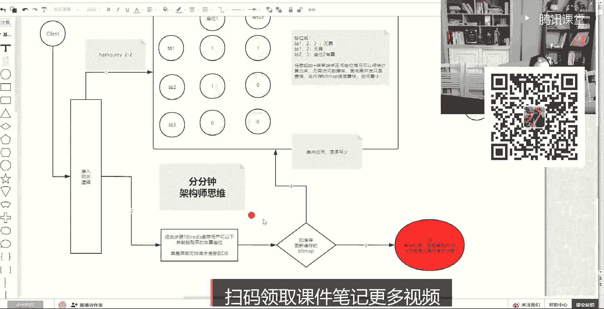
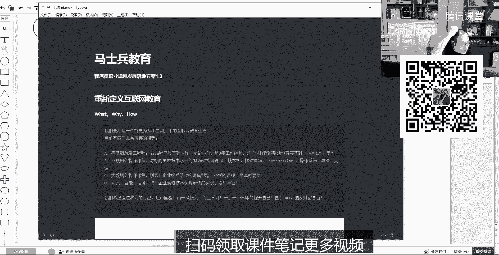
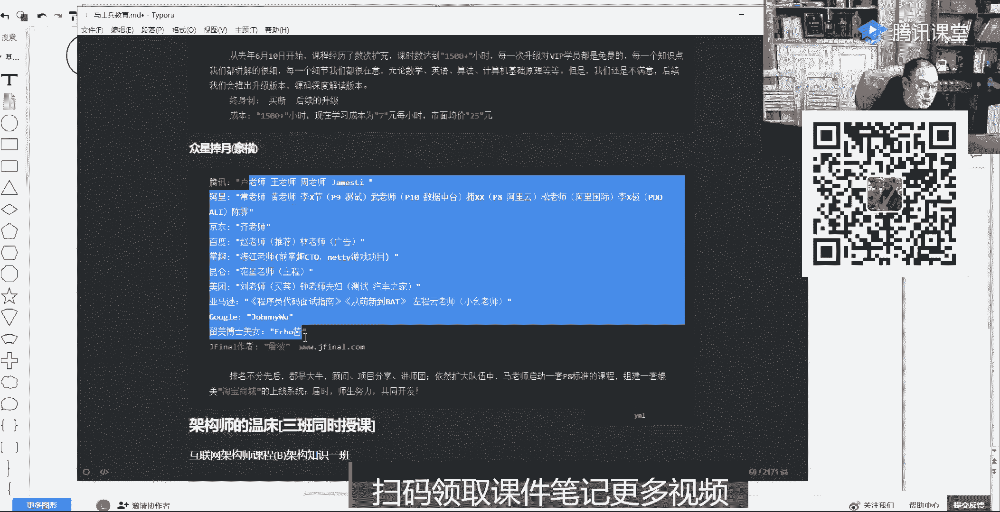
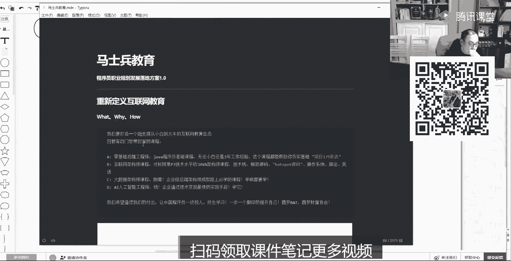
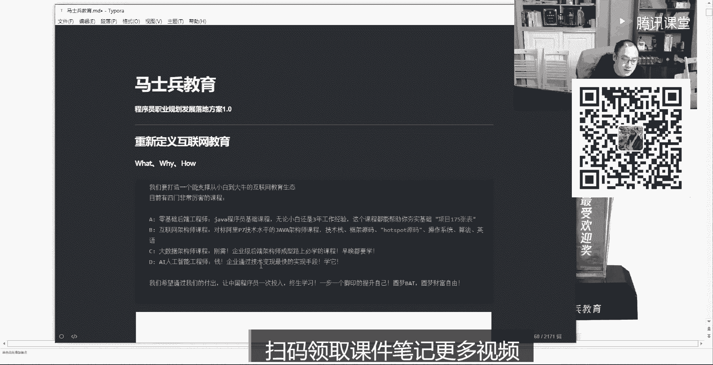
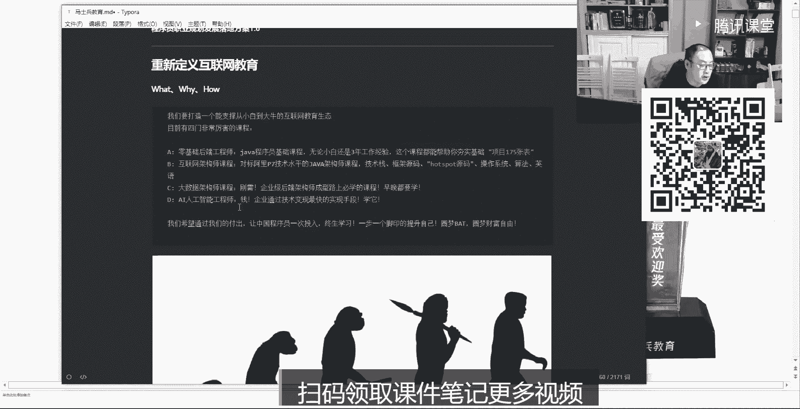

# 白嫖到马士兵教育价值23980的MCA架构师课程一次让你学够！ - P55：redis合集：8、Redis vs zookeeper分布式锁的探索pl - Java视频学堂 - BV1Hy4y1t7Bo

如果客户端请求发给他之后，他内部有跟你曾经你设计的算法一样的一个分区算法，它会把数据稳定到散在不同的节点里面去，你为了你未来不同客户端读写，就一定能找回这些数据，也利用了不同的release存。

不同的数据，这个颜色能听出来，这是基于代理层实现，能听同学来刷波六，好吧，那么这是基于代理层，比如这个学习是有方法的，我图都给你画的这么清楚了，release有一个代理层技术。

其实你只需要把这个百度part一搜，这个技术有很多的，不止我说哪几种，关键是有没有人给你梳理出这个结构这个拓扑来，尤其是从客户端实现代理能实现，一直到它的集群分片，实现它各自各自的原理。

那么第三种类型就是客户端不用去做，然后也不需要有一个第三方的一个技术，因为ready自己就可以实现这个算法方面的过程，那么它们两者的差异是什么差异，你在使用代理层的时候，代理层是一台呢还是十台呢。

它的i o瓶颈呢，它的性能和可靠性，它的高可用呢一系列的问题是不是会在这出现，对不对，你是还要对它有一个记忆，就是因因为你引入了一个技术而引入了一堆问题，你为了解决这个问题要引入其他的技术对吧。

那这时候其实redis自身还有一个集群的这么一个概念啊，集群的概念rein什么概念，release他再也不是那个简单的release了，这个redis技能起来之后，它必须制成class模式。

这种模式之后呢，它里边有两个维度，第一个维度啊，它里边各自都集成了一个一个曾经你在客户端写了一个哈希算法，也就是说哪些数据应该放到哪个release里，它算法是用在了每一个re自身内部。

然后呢他并且有了一个映射关系，什么叫映射关系，他为了保证未来可以动态的rehc，还有一个槽位的概念，有一个槽位的概念，16384，你是你看这儿只有两个redis，但是其实它有一一记魔术的时候啊。

就是你的key磨的是16384，那么比如说这个release领领了这个8000，这个rise领了8000，各领了一半一半的槽位，那每个rise领了哪些槽位，你是有一个map映射的。

每个redis的这个自个儿都要知道整个机器人谁领了哪些槽位，且这个算法应该模16384，这个算法应该每个本地都知道，那这样会起到一个什么好处，get ready，看上去还是独立的，你的客户端像连谁连谁。

因为他们都有公共的映射和算法部分，只不过他们的存储部分存了不同的东西，你的客户端想连谁连谁，只要把key带过来之后，你即便给了他，它的算法部分和映射部分可以支持什么，支持拿这个p找到正确算法。

得到正确的槽位，根据映射可以知道是不是当前持有的，还是比别人持有的，如果是当前持有，就在本地直接存储，如果是别人持有的话，直接给对方返回一个消息，你的k1 remove到别人那去。

到别人这一边走算法走云社，发现是自己的，才是直接落地了，这样的话其实你上边代理层只有一个接入点，客户端只能连它，但是下边这个你就发现，如果并发的客户端想连谁连谁，最终所有的请求是动态的。

散在了访问了不同的节点上，也就是他一个集群技术，让re当中集成了这两个功能之后，满足了上面所有的需求，听同学来刷波六，啊有人说单点故障的问题啊，有人说单点故障问题其实还要记住了。

分片集群每个实例存的是你及你公司里边的这么大数据的机子，某一片，对不对，如果集群里边的这个集群里边儿的或者代理集群里边儿的，或者是你的这种这种客户端，集群里边的只有一个八一卦，是不是丢了n分之一的数据。

虽然这边还能取，这边是不是取不到了，所以是不是就我上面所说的这两种技术要整合使用，我现在单独给你讲完他们特征之后，其实你要不要给你的这个分片再做一个高可用h是要结合起来了，能理解吧。

那这个时候听到这儿能听懂，同学其实是可以接受ak f v服务划分原则了，什么叫a k f划分原则，比如这个以redis来说，它有x y z3 个轴，这是a k f的一个拆分的一个一个理论。

对于redis来说，我可以水平扩展，什么叫水平扩展准备的一台主redis多台备机，这台挂了之后，别立刻接上去，那么这种x是冗余的，它的这个这个数据是定向的。

这就是开始说的主从复制集群x轴能系统学来刷波一，那么y轴是什么，y轴是没有，我这里面有我这个y轴不是我讲的东西啊，这是一个根据业务划分的，也就是一个redis做这种准备的时候，数据量特别大了。

那这时候其实可怎么办，你可以先拆库，分库什么类似于分库，我把你rez数据里边的，比如说关于快速查询这种的，放到这个这一套rex里边，然后用另外一个re实力放的是set那种集合的这种推荐系统。

另外一个release可能放的就是详情页，根据业务存在不同的实力，所以你前端业务根据自己的需求，想连谁连谁谁挂了也不会影响另外一方，这是一个y轴，然后y轴拆分之后是等于是基于业务拆分。

然后你还可以再继续做什么呀，做高可用基于x轴，在就在y轴上，在补全x轴，高可用这个能听的同学来刷一波六，这就是x y两轴了，还有个z轴，z轴是什么东西，z轴就是我刚才聊的分片了，分片其实是面向同一业务。

比如说业务拆完之后啊，其中的某一个业务还是比较臃肿，它又不能再拆了，你不能说把这个这个这个这个你们公司这个这个香精液，这东西还拆分了，这这那那不就再再也拆不了了，这个这个数量很大，一台机都装不下了。

那这时候就要用分片集群，就是同一类数据可以分片，因为它之间虽然是分开的，但是他们基于某一种算法能理解什么意思吧，那这时候其实可以把某一个业务，然后比如说按range的range这种区间的。

比如说这个订单的商商品的0~100的是取取这个分片儿里边儿，101~200取这个分片，对这个分片或者直接用哈希的方式，你如果四个redis的话，直接让你的这个所有的商品的item id id值直接模四。

就可以存到不同的这个四个库里边儿，那这样的话最终你会发现ak f拆分之后，最终的redis绝对是有规则的，存储的是最小的，你公司那个数据片，再回到刚才我压测，如果你知道你公司的硬件水平，产品的水平的话。

那这时候你release要分多少个片，你业务拆多大，每个业务里最终能成多少数据，这事儿你就有可行性了，同学们就是z轴是对着y轴的某一个再给它细分化，万州的某一个业务，再给它细分化，还慌吗。

说说现在你到一家公司说你做一下架构师，设计一下咱们公司应该怎么设置这个这个这个分布式这个这个场景啊，集群怎么规划，为啥叫a k f这个理论推出的一个哥们儿，好像那哥们叫就叫a k f。

我忘了什么意思还是职位是什么，我忘了一个公司的一个哥们儿，就这就忘了这个理论，你会不会，好吧大部分都会了啊，不会的小伙伴你可以明天再去把这个预习的视频，这两天剪的视频好好的好好的去看一看，好吧嗯。

那么其实如果你做一个简单的一个回顾，我讲的哪一知识量还是蛮大的，从给你的预习资料里边，从b l n l o到e poo多路复用，到它的安装，以及到这个线程，它的io线程的模型，它的单线程模型。

然后再到他的五大y6 使用场景类型，然后再到它的持久化啊，然后到他的集群分布式的几种几种形式，这种理论就把这些东西，其实这这几天我讲的东西还真就不少。

连passos c a p a k f分分片集群的几种实现方式，这你别别别把它想成redis，你去想别的东西，基本都是这么一个逻辑，都是这个拆分的方式，因为这个后边的是谁，后边的是来自色试，没毛病吧。

对不对啊，起码说股价给你支起来了，那么这个股价里边蕴藏着很多的详细的知识点，你要把这些知识点如果好好细细研究明白的话，面试无论你面哪个大厂的话，这个这个这个级别能达到这个水平的话。

基本上是呃对方应该是可以给出一个满意的一个分了，讲讲bl nl这个东西，我是之前预习资料都已经发过了，回去看那个视频啊，那个视频是，讲得很强的啊，好吧想不想听听那个想不想听听那个12306那个事。

还有印象吧，12306那个凉火了，哈哈哈，原来原来把一个人炒火这么容易啊，这个是一个小伙伴，今天今天刻意，他就就就就这么巧，他给我发了一个消息，说老师你给我看一下1230这个问题怎么解决，他要去面试。

面试的时候是这样的，就是12366，这个比如说在并发情况下，如果不崩，然后呢，尤其我到因为因为我是北京人，我很少去参与这个春运的过程，我还特意跟几个老师问了一下，我说坐火车怎么坐啊，这个怎么买票。

然后当然了，场景后来我知道很复杂嗯，我只是根据我当时的想法，随便想了一个方案出来啊，大家一块儿跟着过一下，是这样去做的，就是我们的并发的客户端，先刷波666，咱们开始讲这个东西了，别套了。

别别别的没用了，你去思考啊，这是架构架构思维的架构思想呃，通过这个例子，我也想告诉你一个就授人鱼不如授人鱼，你要把我讲的东西应用到你的工作，就是把把我讲的东西你要吸收了，要把它应用到你的项目。

或者你现在这个找工作当中去，你如何活灵活灵活地使用它，比如说在这种12306这种这种情景下，客户端很多并发量很大，然后你去思考一个问题，当并发量很多的时候，其实大家都在干什么事情，这个前置的时候。

你可以把并发怎么忽略掉啊，就是通过什么cdn动静分离啊，然后缓存把这一部分没用的东西给它过滤掉，然后呢通过这个验证码把这种抢票软件给它过滤掉，能理吧，就是最终是人的这种线性的这种这种并发行为。

就是把并发数一定要一定要压低啊，一定要压低精准的有效的这种并发请求进来，然后进来的时候，这个用户的行为基本就分为两类，读写听友回来刷边，一就是用户的行为分为两类，读和写，什么叫读写，用户查查哎。

我到北京到上海，我我我我哪些车次有哪些座位哎，票是多少钱，我这查票对不对，这个查票的一件事情是极其极其复杂的，尤其在1230306里边，因为你的这个他给你查到的结果，这个这个维度是很多的，不光有车次。

这个车次里边有有没有几张，有几个座，这个有没有有没有站票，有没有坐票，然后这个座是哪些座，你可以选，还得他这个东西都得给你，所以他的查询压力其实远大于它的交易压力，任何东西来刷波六。

不是读写其实都是有压力的，他查压力是很强的啊，那么这件事情，我就我其实当时就是先先以这个查这个事情来举举个例子啊，我就给你们一个一个思路，你在reality做这么一件事情，be the map。

还有印象吧，b mm还有他们印象就是那个二点倍图，你看啊，如果你设置这样的一个二维矩阵，什么叫二维矩阵，就是一个be mad，然后我是一辆车，举例子，一辆车这辆车它是不是站一站二站三，有三个站点。

对不对，有很多站点，第一一个一个火车有很多站点，然后这个火车会有作为一座二，有很多的座位，对不对，哎你这样的话横向坐标用多个p，然后呢多个这样的一个二进制组建一个二维矩阵，如果谁买票成功了。

就把他的起始站和经过战，他买那个座位给他勾一就可以了，那么代表周一的就代表这个在这个占三分之内，他已经卖出了，然后那些个没有买的，那就是还是还是回零，那这个时候其实就是没有没有卖掉，能明白什么意思吧。

那你构建出一个二维矩阵的时候，在一个release里，那可以得到这样一个结果啊，就是我们可以用按位或按位或，然后用户我们的用户肯定是查询不同的这个区间的，比如用户想做一站到三站，就是1233站的话。

那么如果安危货的结果都已经不能做了，能明白什么意思吧，就是无票不能卖你了，这个过程是不需要把用户这个查询透穿到数据库的，而且这个过程还有什么好处，你把这个干完货之后啊。

然后把这个最后的结果基于二进制位里边有一有零的东西，这个字符串直接打到这个前前端，前端的js就可以绘出这张图，就这张图那些座位哪些可做，哪些是蓝色，哪些是黄色，那是红色就可以勾出来了，是不是这个道理唉。

然后这时候如果这个用户说我想做二战和三站这个请求，他给出这样一个query，那这个query，然后做安危货的话，会发现诶，作为二没有人买这个座，你可以买，是吧，但是这个我就简单这么简单。

这么说一个这是其实这是一辆车的，那么有人说，其实我查的时候，我想从北京到上海，他会给我很多的车次，对不对，那么这时候我们可以把不同的车次扔在不同的release里。

然后呢你只需要一个外层包装一个service层，就是外层包一个service层，用户只要给出了查询的起始车间，然后并发的让所有的redis调动所有rise，给你返回这个区间里面的一些车次。

他们的这个最终那个祸及这个货及就会展现在用户的前端列表里边，然后用户可以根据前端的判定，然后去勾选买哪个座位，就可以走后端的这个过程，这个过程又像什么，像以来的测试，因为在测试当中它就是多节点。

每个节点里边是一个lucy，一个倒牌索引，你要查什么的时候，是所有的减八一块查，自己做完作文表，然后返回一个结集集合，再根据排序给你返回结果也是一个并发并行的，e快了吧，我这两周周末这周末讲完之后。

下周末开始讲操作系统，i o咱们vip课里边操作系统io还有socket这种，就是底层网络io linun内核的一些个内存的使用，这个讲完之后，然后就开始讲1s1 k1 k还有什么。

还有大数据里边的这个这个平台计算之类的，这个能听懂了吧，然后整个的一个大体的一个框架，这注意这叫机缓存基础，完全，查询这个技术缓存，查询外层，你可以套二层，就2d2 d索引缓存或者二层包装缓存。

什么意思，因为用户的某种query，他如果最终是产生走购票之后，这个carry可以放到二层缓存里边，那么这个时候如果别人说，即便这个车卖，今天老师还那个连老师还跟我聊，他说其实我我买票的时候有一个现象。

就是这个票都卖完了，但是我还可以对着车排队，如果有人退票，如果有人退票，那么我我如果排到第一个，我就可以立刻知道，那这时候其实可以在二层缓存里边做一个什么呀，队列对你的query，那一旦里面有退票的话。

直接查这边，然后触发调调出第一个候补人，然后可以继续买票了，然后还有一个就是你要学风学的什么风，吹的是这个这个这个负载负载量，什么叫负载量，如果一个人因为大家同时看这个的时候，注意听。

大家如果同时看这个查询的时候，大家都发现说诶我这个票可以买，但是注意听啊，如果发现这个票可以买，把这个票可买的一件事情放到查，只要一查出来就放到这个二级缓存里边，放大镜可能放一个hay query。

就跟我们买sql数据库，一般你如果写了一个circle，查出结果之后，它这个sql的结果缓存到内存里边，它这个sql语句会做一个哈，希如果未来查询的时候，你的外表条件没有发生变化，跟那个长得一模一样哈。

一直一样，这个结果直接可以拿走了，能理解能理解大家什么意思吧，有有了他了，并一个人已经触犯，要购票走他了，但是购票这哥们儿可能有30分钟的一个什么呀，付款失败。

但是我可以先把这个query的值放到这个库里边，那么别人只需要再查的时候，先统一个，就从那个二流可能就过滤掉，连他这块查询那个二进制二分计算都可以屏蔽掉，缓存量是不是很大呢。

如果你看过昨天的beat map，你会发现这个缓存量其实并不是很大，都是字节，一个字节，八个二进制位，对不对，其实这个这个是非常省空间的，而且关键是二零计算。

你这块的计算一定比你数据库的计算速度快好几个指数级，换一句话意思就是，如果现在我给你投钱，你买50台机器，这个这个调优未必有把这五台放到缓存内侧来的，更更表现更直接认可来刷一波666，这就注意了。

最后一直在强调，无论秒杀系统，任何交易系统，最终只要扣库存，所以今年交易最终是要让他透穿到db的，就是这层，你是不可能跳跳跳走的，最终最终是要最终最终是走他走，他成功之后。

事务里边会修改这个缓存的这个这个相应的座位，这个时候只需要记住一句话，就是尽量的让有效的请求压到你数据库就可以了，数据库你再做一个分子表，但是把那个所有复杂的查询等等。

那个那个那个那个请求越在前面过滤掉越好，而且这个缓存的这个场景当中，它是单向应用，也就是说用户只会查，用户不会写，只有老师不是，别别说只有这个这个服务扣这个订单。

这个交易成功这个环节的时候才会去写这个缓存，即便给一个缓存开启了a o f最强的持久化，都不怕，就开启最强的持久化嘛都不怕了，尽量他宁可慢一点，但是我绝对让这个就是写操作订单那块可能慢一点。

你就购票的时候啊，等一会儿半天我告诉你订票成功了，但是别人查的那块就嗖嗖的快，能理解什么意思吗，所以这时候你就你就你就站在用户的一个甜度，只要我能把票买上，我前面查票是足够快了。

其实我后面买票的过程其实也就差不多了，对注意听啊，这我就是就是他问我今儿问随便问了我一台，我就随随便便想这么一个方案，这个方案存在很多的不确定性和bug，大家我只想告诉你一个什么呢。

这个不是要告诉你一个12306这么解决就是一个方案了，这未必是个方案，他也未必是个思路啊，有人可能比我更更强大，因为你要牵扯到这个火车路线构做的一件事情，如果再复杂一点的话，今天我还特意问了一个同事。

我说买火车票会不会出现这种这这么一种情况，我从a d买到bd，其实他要走222个火车，中间要换乘，然后他告诉我是有这种情况，就是他支持这个东西，当时我就凌乱了，我这个东西不支持。

因为这东西其实就迁到一个图计算了，对不对，那这时候如果你换图计算的话，可能是另外一种解决方案，但是我觉得你把缓存加到你的架构里边儿，这个东西一定是最直接的，怎么保证最终一致性。

你把真正要双写的一件事情压到最后，压到最后，压到最后全部压到最后去，就是最后真正交易成功的那一刻，这个事物在这块保证住了，库更了，redis更了，给用户返回一个你购票成功，这事儿到这儿的量级其实很小的。

是真实的，是有效的，你在前面用更多的方式拦住那个请求，别争抢，在这还有个小球点，就是这个二级，这个就是机缓存，还有一个二级缓存，二级缓存那个hi query，什么意思，就是你曾经的某一个。

比如说这哥们儿已经是走了一个订单，他是就是排队啊，十个人抢着一个车票，注意听啊，十个人抢着一个车票的时候，那么总会有第一个人产生了这个hit query，就放到这个缓存了，这个high query。

比如就是这个二，这个这个作为二的打了一个一，那已经有一个人抢到那个high query了，那后续的人就是这个所有的一个操作的时候都盯了一个hdcry，那别人只需要盯这件事就可以了。

或者人家就放弃这件事情，就是可以先走走一个一个过滤，然后这个high还支持哪个环节，就是在即便是你可以不让那些人放弃，两人一块儿过来，一个人先是生成这个抢票订单的时候，产生一个high query。

然后他付款成功之后，会把这个high query改成一个码值，改成二，或者改成一个三代专利里边，那未来的流量就直接就被平掉了，或者在这块真正发生交易的时候，扣减库存的时候。

绝对不会不会再有一个多余的这么一个一个一个触发，因为他会撤销掉你后面排的还想买那个座位的人，就是会还会有一个过滤撤销的一个过程，也就是最终你是要靠很多清洁切，就跟a o b切面一样。

切到所有的这个这个路径的所有点上，利用多级缓存，让你最终数据库到达的写操作是最精准的，呵呵呵，脑裂导致的分布式锁重复，怎么去解决这个问题，也没有读懂，多级缓存是个有意思的东西，的确不做有票的情况。

还有现在疫情票都是合作的，咳咳咳，你这个你这个你要玩死我啊，无座这事我也想过啊，没有就是这个这个咱还有站票，站票这事，我这今儿还有点那个啥了，嗯算了，这个思路给给你提供了好玩吧，这个好玩吧。

怎么这个我讲这个过程啊，是要让你知道一个什么什么一个点就是什么是架构师的一个思维，就是呃你可能曾经关注的是api，但是当你会的东西越多越多之后，当需求产生的时候，你像今天这个需求。

我就是我可以可以说这个就是分分钟就随便想了一下，形成这么一个思想，出这么一个方案来，因为我正好今天要准备一个rx赢一个课，为什么讲它跟这个有关系啊，这个这个认可吧，认可来敲一波666。

想他是什么意思，嗯是这个意思，这两天了，然后给大家带来了一些课程，这个课程其实是嗯我是谁啊，我是周老师，我是周老师，然后我是我们几个老师，是和马士兵马老师，一起组建了一个马士兵教育。

这个教育是以马老师名字来命名的，然后我们是想做一个非常重大的一个事情，今天呢也借着这个机会给大家做一个小小的汇报。

就是我们的成长历程。

现在我们所获得的成就，以及未来我们要做的事情这么多。

bt的老师，我们干一件什么事情，好吧，多少年经验了。

我开发了将近十多年了，很简单。

就是我们和马老师要做一个已经完成了第一个小部，就是在腾讯课堂已经拿到了一个最受欢迎奖，什么叫最受欢迎奖，就是在编程类目里边，就在整个程序课堂，编程类目里边加个语言，这个所有的科目，这个所有的机构里边。

我们的好评度站在用户的一侧，嗯是一个最受欢迎奖。

是最受欢迎的嗯那怎么实现的。

其实是是咱们讲课你也听到了嗯，就是这么一个两分钱的训练营，然后呢我尽量是给你玩的命的，给你堆这个知识点啊，从基本上这个从从这个预习资料到两节课，如果这些加起来的话，这个质量是很很大的。

我们说回放可模糊了，回放的时候你可以选它有720p和1024p，1024p就是高清了啊，你要选那个高清的就就会很清楚。

这个我们一直就是一直这么做，才有这个这个这个奖项，那么这么做的一个推动我们的一个核心思想，就是我们想创建一个在在线教育里边的，一个从小白一直成长成行业大牛的这么一个套课程出来，这个课程从四门课的设计。

你可以发现我们是从小白，然后你转行，或者你是大学生，没学过编程的，有一个零基础的后端工程师a课程，你包你从那个课开始就是接受小白了，然后一直学到最后项目死。

ming boot项目光了一个项目就是175张表左右，这样的话学到这个这个层次的话，到spring boot级别，但是现在我跟你有啥说啥，你光学这个课出去找不着工作。

因为你随随便便翻一下现在招聘简历的话，这个招聘如果你面试的话，常常问的面试题，咱们刷一下，小伙伴，咱们刷一下，你如果最近有面试的，常问的面试题都有哪些，就在刚开场的时候，第一面的时候什么我不说。

你们来说，咱们互相刷一下都会哪哪哪些题会问到你，你叫什么名字，像算法jvm调优和smap，设计模式什么锁呀，g u c啊，signt对不对，多线程啊，这基本都是一个常常问的。

所以这个环节学完之后啊啊还差那么些东西嗯，而且尤其技术站各种的redis mq啊，mysql调优性能调优之类的，所以我们还有一个互联网架构师的课程。

这个架构师的课程之前是我们之前设计的时候是一个p7 的一个标准，就是能够达到阿里p7 ，其实有同学知道啊，咱们咱们这个在座的小伙伴应该有有几个知道昨天晚上出什么事了，这个因为他那个一鸣老师打电话来着。

然后那个那个脾气还挺爆，昨天是也是赶上那个阿里的几个人过来，就是马老师约了几个人过来，然后昨天晚上聊到两点多，要去把我们的课程从p7 调成p8 ，这个水平就是经常也是约他们过来聊这个事，咳咳咳。

目前是到港的一两个老师已经挖过来了，就是从阿里挖过来挖过来的老师，目前说现在课程我们讲完的是对标的是p7 的一个水平，p8 的确p8 就是已经是带人，那个就是带团队在这个这个水平代码量已经不是特别多了。

但是你必须有这个架构思维和决策，而且如果感兴趣的话，你可以找我单聊，其实昨天聊的时候也说了一些不该说的事，就是内部关于p8 p9 这个两级别内部有什么东西啊，这是一个互联网架构师啊。

然后我们这边的标准就是带你带你的大带达到这个大牛，这个大牛是什么意思。

