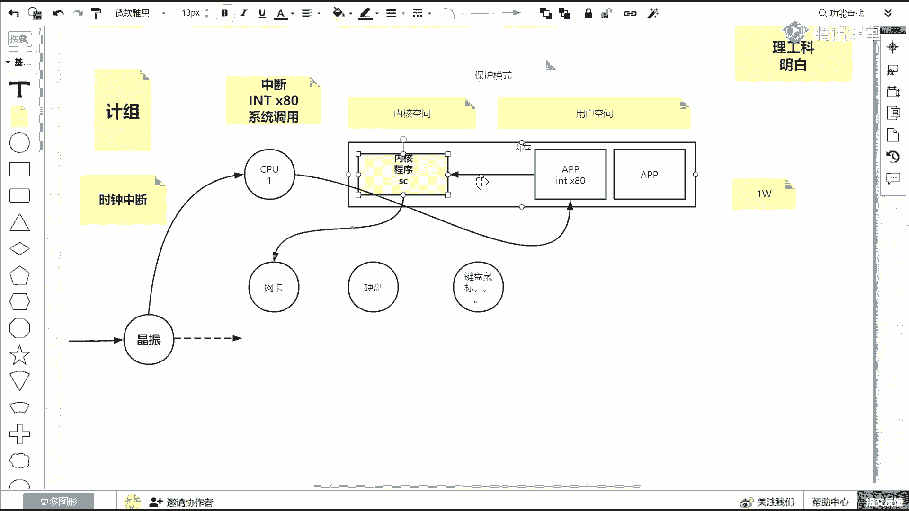

# 白嫖到马士兵教育价值23980的MCA架构师课程一次让你学够！ - P56：1 操作系统中的BIONIOSELECTPOLLEPOLL实 - Java视频学堂 - BV1Hy4y1t7Bo

跌了之后，nt无师自通，无师自通。

切到讲课这个这个这个资料是是我最近在讲vip的，关于计算机系统的整套的i o这个环节，我画了这个隋隋唐画的一个图，就是从磁盘io啊，网络io内核pd开始，然后从b o n i o到多复印器。

刚找到刚脚的多路复用器，到java jdk的select到不同的多路复用器的一个映射关系，以及它们的性能的一个对比，而且过程当中还有一些压测。

今天呢我们来也就是其实io这块是一个非常非常非常重点的一个知识，能get到的就是i o，其实说白了你去思考，而不是现在所有的东西都离不开io，都离不开网io一个程序，如果没有i o的话。

这是谈不上它是一个程序，所以io如果学好的话，就是为什么我们要学ei o这个字体大小合适的，来刷一波一合适吗，有问题你就直说啊，就是这个哪方面都有问题啊，你就直接说出来，反正改不改是我的问题。

回音严重啊，这是没有办法，就是这个刚搬家，我把这个麦风离我的身边近一点，就刚搬过来，然后还没有没钱没钱买家具了，哈哈哈，刚报完家，没钱买家具了，然后屋子就挺空的。

然后为什么要学e i o这件事情非常重要啊，有过相应工作经验的小伙伴应该都知道，就是i o无处不在，而且io关乎到我们程序的性能，io是无处不在的，你随意可以想到的一些常用的面试。

常用的一些地方都可能会出现关于i o的一些问题和知识点，热门的一些技术问题，有时候问你了解吗，对不对，然后redis了解吗，然后卡夫卡了解吗，nbx了解吗，其实这块的技术你可以聊出一大堆来啊。

然后基本上他们都会和i o相关，然后他的对于性能，至关重要，是这个吧，这个光度无所谓了，好那么先铺垫一下，就是把心态调整好啊，那我好好学这个我画图的软件，我也给你写出来啊。

我画图的工具是一个在线的网页版的一个p3 ，那我直说了，我要我想要你的图，想要我的图，行一会我告诉你怎么能拿到图好吧，今天我给你们单独随堂画图，这是我讲课的一个风格，知道i o的重要性之后。

那其实i o的整个的i o i o其实是一个大活对吧，就是一个全套的一个大货，那io里边的知识很多，那这两就这两天的两天的课，两天的训练营，我们要学习哪些关于l的哪哪一块的知识。

只围绕注定只围绕网络通信中的i o，也就是偏soft，基于socket之上，你首先理解什么是socket，然后以以至于基于socket之后，然后可以产生的这种网络通讯的i o它的演变的一个过程。

这个过程其实大家都知道，从b到nl到注意下边多路复用器，然后以及在这个io模型就是网络通信的io模型的演进过程当中，变向不同的语言，比如这个gp c或者java他们的a p m。

其中有一些现成的这个产品和框架，进行了对io框架的一个io模型的一个包装，这个像java程序员必须要学要会就是nike，而且这些都是面试的重灾区，常问的一些问题，且其实你去网上搜一些资料。

资料的描述不清不楚，各种描述可能都会有，好吧，这点一定要认可，就是我们今这个这个这个这这整个这条线是我们这两天要学的东西，好吧哼哼，那么在学习这些知识之前，我要先抛一个我讲课的风格啊，讲课的内容再讲解。

把这些东西如果真的想讲明白的话，首先我会帮你在课程当中梳理你要去掌握和学的东西，以及我课上会有一些小工具小方法来协助你更好的理解，但是其实对你的基础是稍稍有一些要求的，可能有些东西你要去补。

第一个需要去补的知识就是计算机组成原理，计组计算机组成原理，那在这个课的直播过程当中，我会简单的介绍，如果你听不懂的话，先听个响，起码你知道哦，这块东西如果我会了的话，那这整个io的可能一大票的东西。

我我就已经可以很容易理解了，如果这块你可以，你就是首先说作为一个java程序员，这块你可以不用去学，但是这时候其实技术你只能学到它的表面，a p i自个儿能敲出代码来，符合自己的逻辑，能写需求就可以了。

但是如果真的想把这个技术力的很深，面试的时候可以和面试官对答如流的话，那你对底层可能要更深入一些，比如说先聊一个知识点，计算机组成最基本的，因为这里面会牵扯到我后边讲io模型演变过程当中。

他为什么要去从bo到neo的多路分析的一个演变过程啊，这这个这点很重要，首先第一个计算机组成组成基础知识就是计算机是如何运行的，我们的程序是如何运行的，这里面有哪些是损耗性能的。

哪些行为我们尽量去避免啊，这个我直接在上面画图啊，咱们加加快时间，第一个知识点是计算机里边有哪些硬件组成，一个是内存，然后有cpu，假设我们只用一颗核心cpu这个计算机，然后呢有计算机不是有个cpu。

有内存，除了这些之外，还会有一些io设备，这个io设备，比如说我们的网卡，网卡是io设备，还有什么是io设备，就是输入输出设备，我们的硬盘也算，其实在整个io体系当中，除了一个网络通信l。

另外一个分支的o就是关于硬盘这块的l的一个性能调整，它的一个实验原理，也就是它的虚拟文件系统以及内核的缓存页等等，还有我们的键盘，鼠标等等，一系列的这些都是我们的io设备好吧，那先把硬件。

这是计算机的组成，有这么多硬件组成，那我们的软件如何在这个硬件的配置下去执行的，首先当你摁动你的电脑开机的时候，其实硬盘里边第一个程序，第一个程序是我们的内核，首先程序在硬盘里边就是个文件。

然后通过读取它进入内存展开，根据他的这个编码格式，根据内核的这个展开，整个这个文件的格式展开之后才会变成进程，所以第一个是内核，有我们的硬盘被加载进了我们的内存。

当然在前面还有什么这个bios进入内存啊，然后这个不是这个引导程序性类型，最终是把内核前面一段就忽略了，我们直接说内核，首先你要明白内核它也是一个程序，这些词汇也都听说过，但是你有没有具体问过。

尤其咱们不是本专业的小伙伴，就是内核，它到底是个啥东西，就计算机里边为竞机操作系统里边为什么有一个内核，而且它还是个程序，首先要明白内核是个程序，它对外管理了我们所有的io设备，那又代表什么意思。

其实是一种分层结构，在硬件和最终有了内核之后，你才会从硬盘加载你想跑的程序，就是top hat等等的，有lication，那么其实内核和程序和硬件之间它是一个中间层，它是一个管理层内核里面。

如果对硬件的网卡驱动实现了，那么在我们的所有程序当中，就不需要重复造我们的重复实践网卡驱动对吧，内核如果对我们硬件进行管理了统一的资源的控制了，那么这时候程序就不需要自己再写一些和别人如何竞争资源。

这样的代码啊，那这个内核就是一个大管家，这个能听不出来刷波一有人说前戏比较长，唉那这个后边你才能飘得更高嘛，对不对，学东西要学明白啊，就在这儿，我一定要给那些个新造的小小伙伴来说一句。

这个中年中年逆耳啊，就是咱们学的是it it啊，其实这里面是一个理工科的概念，这个所学的知识你一定要一个目标，就是学明白，你当你学明白了之后，这个东西不需要去背，这辈子你就你就知道怎么回事了。

就跟说定理公理的一个概念，当你懂了，知道了，真的学明白了，那这个不需要去背，所以我为什么前戏这么长，我让你把这事给他学透，学这个完全理解对吧，好跟我的思路走，整体上有个硬件。

然后呢程序之间为什么分为内核和我们的lication，这给大家去介绍一下，在这里面还有一个支点，就是其实计算机啊内核已经发现了，他对这个至关重要，因为内核就是这么一个程序，一个在这个内存里。

那我们的其他的用户空间的程序有很多，对不对，后面给你解释为什么它叫做用空间呢，那这里面为了趋于安全考虑，因为大家都可能会使用去使用这个内核，那么现在进入一个这个是否是安全模式这么一个介绍。

当其实计算机开机之后啊，内核如果被加载进内存，cpu执行内核的里边的指令的时候，内核做一件事情，注意听内核做一件事情，比如内存是个线性地址，023578 90 11 12 13，一直到最大，通俗来说啊。

注意通俗来说，内核会把内核所在的地址空间，所在地址空间置为这个绝对安全的，就是内核空间，它会在一个叫做gdp全局描述符表里边，标识出它的这个这个这个这个数据段和这个指令段。

然后将剩余的空间划分为用户空间，把这两个地址区域划分出来之后，那么他要做一件事情，它要启动一个模式，叫做安全，这个安全这个保护模式还不让保护模式，这个保护模式是什么意思。

跟咱们计算机那个安全模式还不一样，保护膜是什么意思，就是诶那么在我内核空间里边，如果cpu做到指令了，它可以访问整个内存的任何的地位，但是如果在用户间你写的程序做到一个指令，如果你想访问。

你硬硬硬生生在说想访问前面这个地址框里边东西，它是静止的，或者cpu里边有很多的指令，就是一个指令集，有很多指令，那么有一批指令和有一批寄存器是内核可以完全访问，完全调用的，但是你普通程序是不能用的。

兄弟们，就这样的话，就基于内核控制了，自己可以访问别人，别人不能访问自己，以及cpu里边也要达成这个保护模式的实现，就是比如这个英特尔或者amd，然后有一些计算器啊和指这个指令指令。

你其他程序你级别不够，你不能访问，那这样的话其实就可以减少对系统的破坏，也就是蓝屏的出现的情况，到这一步，什么是保护模式，能听懂，跟大家说不一很简单吧，如果内核可以允许其他程序随意访问。

随意修改里面的东西的话，那这时候你的程序就完全可以分分钟变成一个黑客或者一个病毒对吧，嗯那好接着讲，那有了保护模式，但是要和我刚才说的理论进行一个对对冲啊对撞，我说了，内核其实向下关于我们所有的硬件。

然后程序呢不需要重复到轮子，不需要写这些硬件驱动，那这时候程序我们肯定是要使用硬盘，使用网卡，使用键盘鼠标，那这时候使用外外设的时候，那这时候必然要访问内核，内核要暴露给程序一些调用对吧。

但是这你又加了一个保护，你还不能访问我，所以这里面要加上另外一个知识点，这些这些城市基础知识点啊，首先你明白它有一个保护模式，你程序不能访问我的直接地址。

但这时候我又想给你暴露一些我对下层这些东西的抽象和包装，得让你去使用，那怎么办，这里面有一个概念的中断，第一个是中断，第二一个是内核，内核首先对我们的程序提供了系统调用。

就是内核是给我们程序提供系统调用的，比如说调用了关于i o的读写，那这时候你还不有保护膜，人还不能直接访问我，那怎么办，其实底层靠的是中段，那中断是什么，我简单的介绍一下。

比如说常见的中段有一个叫时钟中断，什么叫做时钟中断，因为中断这个事必须讲中断这事儿你不了解的话，那后边i o为什么变化，这事儿你也只能瞎猜，或者就是别人怎么说，你怎么去怎么去解释。

而且你根本就不理解为什么性能会变低，中断这件事情非常重要，能理解吧，比如说先说一个叫什么叫时间时钟中断，那么在描述时钟中断之前，我先问大家一个问题，刚才我刻意说的cpu只有一一个，只有一个cpu。

那计算机里边我是不是可以内核程序，然后我启动了tom cat，启动了这个and dex，启动了这个mysql，他们都是程序，那么一个计算机里边可以有很多的程序，请问这些程序只有一个cpu。

他们可不可以并行执行，可以还是不可以，但是他们是不是可以同时启动，然后感觉他们感觉他们是在并行执行的，那么他们是如何并行执行的，这点要明白了，这个里边其实有一个没错，有一个分时系统，一个时间切换的概念。

对不对，一个时间片大家轮流去执行，比如先内核执行眼，然后这个程序这个程序哎，我在单位一秒钟之内，然后结果让你们每个人都执行了好多次，那这个一秒钟的对外界的体感，这事啊好多程序都在同时执行。

这个能听我们来刷波，10分复用，没错，就是这些东西，cpu时间片轮血量等等等，但是这时候你要我，我立刻要问你一个问题了，立刻要问你一个问题，你在你写程序的时候。

你有考虑过说一秒钟之内我只能执行1/1000秒，我执行到1/1000秒之后，我就要让出我自己，我把我自己挂起，我通知别人去执行你，你没有写过这样的代码，你没有写过的话，那就代表什么意思，你优惠你的程序。

只要cpu去执行你的程序，你的程序会耗死这颗cpu，这是一个cpu，就不能执行别的人了，别的东西了，这个理论能听得出来说不一，就是你写程序的时候，你从没有让出过cpu，那你的你不让出那一秒钟之内。

他怎么去执行别的这个程序的呢，那么时钟中断这个东西就就就产产产产产生了时钟中断是个什么东西，它就类似于一个物理硬件啊，物件这个物理硬件叫什么，叫精准，如果你去关注过老式那种电子手表的话。

它背面电路板上有一个小圆柱，两两条腿，一条腿进了一个这个电源，然后呢这个咱们呢比如直流电就是啊一直有电，就是你把手啊站着站着唾沫摸那个电源线是直流电的话，它就是一直马，就是啊一直马。

但是精湛这个东西电流啊进来之后，它会以一个非常规律的哒哒哒哒哒哒的方式向后铲铲铲出，就是啊后边啊能理解什么意思吧，别着急，我我我我肯定会给你讲ni o。

但是前面这波知识它是支撑你ni o它到底为什么出现的性能，前面那个那版的b l o性能损耗在哪，所以这个一定一定要好好听，能理解吧，那么这个震荡的这个频率一秒钟，比如1000次或者是1万次啊。

1000次或者1万次，每震荡一次，这个精湛啊，他就会给cpu产生一个时钟的中断，每震荡一次cpu什么叫中断，比如这颗cpu在忙着这个进程读取他的指令，说拿过这条干活，拿过来干活，忙得不亦乐乎，正忙着呢。

然后1/1000秒就是一，比如说1ms，当他震了一下，那就掉了cpu的一个这个真假电压就过去了，那这个cpu会做一件什么事情，通俗来说，通俗来说别别别比较了一个细致了，因为咱们从表面上来讲。

这个东西这个cpu就不执行，本来要读它相处指令就不读了，然后这时候开始把cpu里边这个程序的寄存器里的值动了，然后写回内存，它的内存区域里把它的缓存清空，然后这时候中段一般都会有一个。

它有一个中断向量表，中段有中断号以及中段的对应的这个中断号，对应的回调程序就是中断产生，我干啥事儿，能理解什么意思啊，就中断程度之后我要干什么事，你不能光让我中断了，让我打断，我不去干这个事儿。

但是你得告诉我下一步我要做什么，中段的那个call back回调函数是由内核来启动的时候注册的啊，注册的注册的时候，比如说在通俗来说是这个时钟中断产生之后，内核比如说掉了一个方法。

这个方法叫做进程调度啊，掉了一个进程调度，那这个时候其实中断了这个程序的执行，并让cpu开始执行内核里的程序的调度，程序调度的时候，内核里边根据他的队列来说，刚才执行这个，那下一个可以执行他了。

那这个时候注意听，cpu会把这个程序的相应的曾经的给他保护的那个寄存器的东西，给它拉取回来，放到cpu的缓存里，然后开始疯狂到独一条直线下，读一条直行线，但是到下一秒光刀在下一个这个这个震荡的时候。

八又一阵是不是就开始把它恢复回去，就是保护现场，然后呢再去根据回调调用内核里边该执行的这个回调的方法，能力吧，然后再根据回调方法里边的基层调度选择下一个程序再恢复现场，因为你曾经保护过他的现场。

以上这个根据十分中段可以切换的程序执行，但是程序的切换过程会牵扯到没错上下文或者是保护现场，恢复现场内存和cp之间的一个数据的，考不来考不去这么一个过程，这个能听懂同学来刷分一好吧。

我一层层给你铺垫一些曾经可能比较比较模糊的知识，咱们就给它顺顺出来了，但是也停留在一个这个理论上，就尽量画图给你简单描述一下，那时钟中断程序可以切断了，可以切换了，这个能理解的话。

它里边有一个保护现场恢复现场的一个一个一个性能损耗，你只需要在这放大一下，如果假设猜测一下，如果我进城是1万个进程，注意听啊，如果你是1万个进程，如果是在表面上看，我这些进程都执行的很快啊。

都都都都一直在活动的话，其实一秒钟之内这个精湛的数量是不是要高一些，然后呢让每个程序是不是都要轮询的执行一下，对不对，那随着你程序越多，其实保护现场恢复现场穿插在两个竞争之间的这个事儿。

损耗最后次数会变多，所以程序越多，是不是单位时间内cpu浪费在内核调度上的时间会变多，而在程序内部执行的时间变短，这个最终结论，任何同学来刷波一这个理论结论要记住了。

因为后边讲b l o到n o演变的时候，是用到这个这个这个理论信息，就是他啊，那除了他之外，其实还有因为后面我们的程序啊，你在使用网络编程的时候都会掉内核的系统调用，那调系统调用的时候用到中断了。

那么这个中段叫什么中断，一般管它叫软中断或者叫陷阱，说白了其实有一点只有一点概念，同学都知道这个软中断或陷阱的话，它叫做这个int，八零，那这里面注意了这个int是什么意思。

就是中断那个单词的前三个字母，它是什么，它是cpu里的一个指令，所以说只能积累的一个指令，那么x80 是什么意思，这是一个号码，是一个号码，这个号码就在中断向量表里边，它一共有255个号码，88 零。

这是一个号码，那一旦注意听啊，现在不是时间，时钟路段，是我现在cpu就在一个时间片里，就在执行你的一个程序呢，但是你这个程序啊就想调一下内核里边的一个方法，这个方法最终是要向网卡读写读写数据。

你程序是不能直接访问网卡的，那么这里边一定会有一个叫做系统调用的过程，那系统调用的时候又受保护模式，你还不能直接访问它那个函数，就是这里面绝对不能产生函数调用，一定是系统调用，这注意注意措辞啊。

函数调用系统用这两个绝对不一样的这个概念词汇，那么当产生性调用而不是函数调用的时候，这时候其实你写的好像是掉了一个内核的一个方法，但是在编译器编译的时候，它会把那个调类似于函数量那个方式。

就是一个函数名调用改成int 80，并在前面植入内核里边那个函数的名字放到这个寄存器里，能理解什么意思吧，嗯那这时候其实当cpu一读到里边，你读到程序里边编写给你嵌入的int x80 的时候。

那这时候我说了，这个int其实就是中段的首字母都会产生一个中断向量啊，八零找8080是什么，其实就是内核曾经治了这个i c这么一个回调的入口，那这样的话其实会有一个从这儿到这儿的一个态的切换。

就是中断这个指令会没错，s一身份高会把你cpu曾经你这个程序本来我就在执行你这个程序，但是我却读到了你要调cpu里面的一个int一个指令，这个指令只要我一掉到，我就开始保护现场。

把你这个城区公园存到内存里，然后开始调内核，然后根据你曾经传的参数，我要调系统调用的具体哪个函数，那这时候其实只有一个保护用户，带程序的保护现场和恢复内核的。

就是掉进了这个这个这个这个引用内核里边那个pp，这个是那个地址来加载到内存，这个这个cpu里继续执行，执行完之后再保护现场，让他恢复你程序把防御值带带回，这个就是由程序在使用内核的系统调用的时候。

也会像刚才这个时钟多段产生一样，有这个进行切换和损耗的事情，能听懂同学来说。

