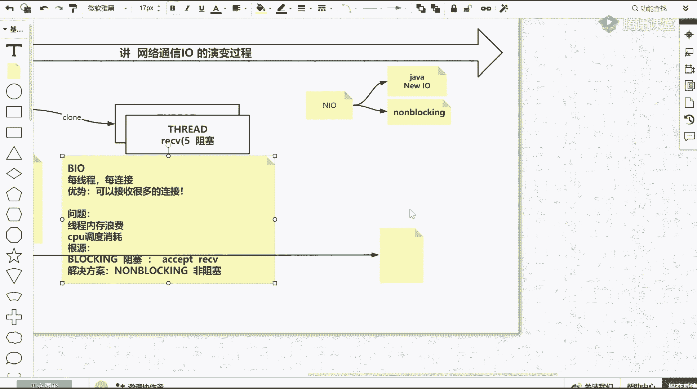

# 白嫖到马士兵教育价值23980的MCA架构师课程一次让你学够！ - P58：0.3 什么是selectorbytebufferchan - Java视频学堂 - BV1Hy4y1t7Bo

里面有符，那返回这个描述符，它要干什么干什么，用n q对出再来二，然后后面接第二步是一个绑定绑定，其实好的，也就是绑定我们那个逗号啊，然后还有一个是listen lion的话。

其实就是开启今天状态能理吧，就是listen是要开启一个监听了，这些都好理解嗯，我们看绑定吧，因为绑定里边会有一个小例子，半个绑定就是要绑定我们一个多小号了，为什么看它它其实里边有一个example。

好吧，这还有一个用力，注意听我下面的描述，抛开你的扎了，如果on linux在linux操作系统上运行，无论你的java index redis，只要是个程序相反。

网络基本上离不开这个example里边非常重要的一个顺序，你能听懂表达什么意思吧，就是你学歌要学到，这就把我刚才给你演的时候，在这个代码中都能找到，首先看这个代码是什么代码，这是一个c语言的。

因为它下面是井号，intro导入炸灯，就是import导什么什么类，往下走啊，往下走，重点呢我们挑几个东西，哎你看它也有主方法，再来一个，如果注意听啊，无论是re，无论nbx，无论是java。

如果想使用网络通信，它必须要调哪些东西才能网络通信往下走，要和内核交互的时候，注意看是不是他在这掉了一个socket，返回稍微的刚才也看了，它是有返回值，是不是返回了一个变量，一个文件描述符。

有了这个变量文件标书之后，注意有新调了socket，他下一步一定调查，根据刚才咱们的追踪，是不是下一步一定会掉半的，绑定绑定我上面这个sf d到某一个动号上，调完绑定之后，是不是要调listen。

把它开启监听，能跟着我的节奏吧啊我不知道你们为什么要聊没用的这个课程，你在别的根本听不到，对不对，就这么一次学习的机会，你为什么还要去聊别的啊，先跟着，起码你要先跟着，跟不上。

你要先听到我给你画图就理解了，起码说你再跟不上这三个东西，现在有没有盖，就是你刚才看我给你演示java的系统不用了，然后我给你演示c如果去开发的基于linux的话，它里边必然也这么写。

你就先记住就仨东西，socket得到一个文件标符，然后肯定我要绑定，绑定之后，我肯定要离心监听，今年之后，剩下的就开始读写了，对不对。

那么其实用过画图，这是好理解的，一定要记住了，根据我前面所有铺垫的知识，下面我讲的东西应该能接受，首先计算机里边有application一个程序，然后你知道除了application还有pl内核。

这两个一个计算机组成里边肯定有程序有内核，而且你现在应该知道程序是必然要调一些系统的这个内核的性调用，才能完成程序的一些逻辑的执行对吧，那么这个时候如果你的application是一个server的话。

是一个服务器，这个服务器它是如何坚持起监听，如何接收客户端如何运行的，也就是我刚才的java程序是如何执行起来的，你们有什么意思吗，那这时候我们来回忆一下，第一个，如果你是一个server，要先几间听。

必然先调内核的三个系统调用，也就是先调了salted，调完socket之后，它会给你返回一个，比如像刚才反了一个三，这是一个文件描述符，这个三是谁，就是server socket，然后得到它之后。

然后还要绑定蛋子，绑定我们3~8090这个端口上，然后并listen开启监听，把三开启一个监听，那么注意听，无论是index redis还是任何的third one，这三步是必须这么执行。

无论在任何的io模型下，dnl多路复用器，第三步是不能省略的，主要是服务端，这三步调用必然产生之后再说别的事儿能听出来刷刷一，对吧，这三步是必掉的，要起立要起监听，对不对，那这三步完成之后。

那么回忆我java当中，其实这三部就是谁，就是new server s8090 ，这三步就搞定了，搞定之后，那么你这是服务端，你要接受客户端，而且你要接受很多客户端对应的连接，因为你要对很多人提供服务。

对不对，那这时候下一步要做做一件什么事情，刚才我说了，其实他下一步在lec完了之后，你可以见到的系统交流，旅游accept接收接收。

在这块儿你也可以自主学习，比如退出这个用menu 2类的a c c e p t接收，接收的时候要给出刚才那个soo socket，那个i那个文件描述符传递了之后，它的返回值是什么，主要战斗你看到为止。

反正就是如果成功，就是别人就是这个方返回了，他会给你返回一个什么呀，文件描述符，一个整数型的一个文件描述符，比如说他也会返回文件描符。

这个文件描述符是谁，就是我们新连接的客户端，对不对，比如像刚才如果有注意听，首先他第一个会阻塞，刚才看到的就是他sab 3，然后括号它就停住了，三逗号它就停住了，不动了，这这这叫阻塞状态。

但是如果他一旦有反有等号给你返回来，比如刚才反了一个五，这就是由阻塞到有返回值的一个状态，换言之，accept会阻塞，这点很重要，这个性能标准会阻塞对吧，到这一步能听懂，原来是不一excel干什么的啊。

他是有阻塞的行政特特征啊，那么当它返回一个五时候，这个五就是一个q端连接，我说了，你可以在当前线程当中是不是还有一个性能叫做receive，receive是不是独舞，但是receive独舞。

刚才是从另外一个线程看的，我现在不不把他死在另外一个线程，如果就是在我单身程序当中，如果掉了reserve的话，这个reserve是不是会在这一直阻塞，因为别人可能没有给你发送任何的数据。

那么在这如果一直阻塞，即便你写了一个死循环，注意看，即便你写了一个死循环在这儿，如果一旦一直阻塞，还回得来吗，是不是回不来，那这时候如果第二个第三个第四个人去连接你这台服务器的话。

抱歉他是不是前面这行接收就执行不到了，对吧，这个能听懂的，是不是一，那怎么解决这个问题，是不是可以通过克隆的方式，也就是说程序当中掉克隆，抛出去一个县城，一个县城。

在这个县城里边儿把这个这个阻塞会单去干扰你主线的一个事儿，给它挪出去，您啊在这儿给我阻塞，是不是在这组算，那么这个线程在这堵塞这个县城，是不是没有这个刚才那个举错了，是不是外国学生大帝又回来。

又开始堵塞，接收别人别人了，那这就是主线程接收，每得到一个客户端，丢到一个线程里去，那么这时候刚才给你解释了，给你演示两个线程，两个连接就是两个线程，如果1万个连接就会有1万个线程。

这就是曾经最古老的代码模型，就是基于bo的美县城，美线程对应美连接，现在这个概念接受，我同学来刷波六，对不对，我说了，我前面会给你铺垫铺垫铺垫铺垫最终就是看不懂，但是最终画图就能接受这个东西。

而且这一定要记住了，前面无论你server怎么设计的什么im模型，前面b调b执行，好当这个能get到之后啊，那其实你要先去思考一个问题，这个模型优势是什么，好优势，他能他能他能解决什么问题。

他有什么优势，简单除了简单，它要解决一个根本问题，它要解决一个根本问题，什么什么是根本问题啊，可以接收很多的连接，他是不是可以接收很多的连接，对不对，这是它的优势，但是它的劣势和问题是啥。

就是他是否存在问题，他的问题是弊端是什么，因为你找到了b端才能知道它有弊端吗，那技术如何改变就出现下一个技术也就出现了n他的问题，先说问题是啥，根据我上面给你铺垫，你现在去看我上面的铺垫是有有需求的。

你看刚才说了，如果进程特别多或者线程特别多的时候，达到1万的时候，其实你cpu在单位时间内净损耗在他们切换上了，就中间穿插这个时间，每个secret执行的时间就不多了，对不对啊。

那这个cpu的整个会被浪费了，所以第一个它有两个，第一个是线程内存浪费，因为你开辟一个线程，这个线程在内存里边会开辟一些数据的这个数数数据啊，还有一些一些这个内存空间的占用，一个浪费内存空间。

第二一个就是什么样啊，这个cpu调度消耗消耗了一些这个cpu时间片，对吧，这是它的一个弊端，那这个问题这个弊端其实其根源是什么，就是你为什么设计成这种用玩命创建线程来接触更多它的实质的根。

最远的问题在于哪，是在于这个单词blocking，也就是主色，因为有两个方法是阻塞的，这两个紫色，一个是accept，一个是receive或者read读取这两个方法，或者两个系统调用会阻塞。

我就不能把都阻塞的这种都有可能阻塞的东西放到一个县城里，那就一个阻塞会干预，另外一个阻塞会干预到让另外一个执行不大，所以这才是根，那也就是说，如果想解决当前bl模型的这个困难。

这个所有的弊端其实只需要一个新的词汇出现就可以了，新的词汇就叫做n locking非阻塞，这是你可能想到的解决方案，从bo给你衍生推导出n是解决bo性能问题的，这个逻辑能跟得上的同学来说不对。

661切的推导都是有目的的，前戏还真的蛮重要，无论在生活中还是生活中，对不对，那但是这时候你要去思考一个问题了，是否阻塞这件事情是程序自己去解决的，还是受制于谁，还是受制于谁，其实是否阻塞的一件事情。

谁能提供解决，就是系统调用的accept和receive，它是不是要堵塞路的问题，那其实受制于内核，也就是只有内核向前发展，内核当给我们提供非阻塞的系统调用的时候，这个问题就被解决了，能对我们来说说一。

现在再来思考，你要不要去学习几组这个知识，因为g组不太了解内核是啥，就算机组成原理，他们工作机制不懂的话，一些技术像刚才这个过程当中很痛苦，你根本学不到底层。

你只能还停留在博客或者一些数据的表面的那种表面公司，这时候你如果特别梦想自己成为所谓的p6 p7 p8 ，这时候其实是说空话，对方可能就是在这关上就过不去了。

那会儿怎么去实现呢，回顾一下信用交那边，比如mu to socke，那这里面我刚才让你看到的返回值后返回一个监听状态的那个三，它会从一个三是监听状态来，但这时候其实它里边还有参数，我们往下走一下参数。

找一下感觉，我还会待会我讲，这个时候还会给你纠正一些问题，在这儿注意看，在操作系统内核的系统调用socket里边有一个参数叫做socket，nblock，就是非阻塞内核。

其实后续版本提供了这样的一个功能，而且除了soc得到这个可以视它为nblocking，你还可以对建立连接用sell counter这个第二类型调用，对它同样就是对建立连接的扣分的连接也设置非阻塞。

对吧也是在试制作，那在这儿注意了，注意听啊，你看到了内核里的，但是在这给你强调，首先提到在在这儿马上进入进入几个环节，要进入i o了，但是要进入n i o的话，注意有两个n啊，注意听有两个n。

一个n一个人是哪个是java当中的new这个l什么意思，是new io，这个n o啊，你看跟跟别人聊天的时候，语音啊，非常好，非常专业，你在跟你的同事，跟你的领导，跟面试官聊天的时候，他一定要说。

你给我解释下n l o一定要加一句话，让他感觉到你很专业，你说咱俩聊java的n l o还是聊操作系统n i o，如果聊java的ni o，那么就说的是nel一个新的一套io体系。

就是nl这个包下有channel通道，有这个bad buffer，然后有select这个多路复用器的选择器，然后另外一个维度是，那他说你跟我聊聊操作系统linux io。

那这时候你要知道他说的是n blocking，就是非阻塞，啊这两个是绝对不同的两个语义，好吧，两个都说下，两个都是这样，那就是我下班要给你讲的东西，好好听，都说一下吧，哎那我知道你啥意思。

get到了get到了，但是你首先要明白。

哎首先说了对这个操作系统里边已经看到了nbing不对。

那个number lock是啥意思，啥意思，什么叫做非堵塞，想不想知道它怎么什么叫做非土特，非主色只是一个名词，对不对，但在系统系统特征上，他是怎么表现出非独特的。

或者我们扎的当中是这个这两个东西到底是啥，你不是等会儿我给你解释一遍吗，来注意看啊。

我用另外一个带你看吧，这个在这看，用这个看比刚才那个linux看的是清楚一点，有这样一段代码啊，要注意注意听啊，有这样的一段代码，这段代码当中说到代码了。

说代码了，这个代码怎么领取，我再多说一句啊，给个十秒钟，新进的小伙伴，如果还没有加这个群的，你扫一下这个二维码，一会儿我的代码和截图都是通过这个群里去发放，好。

满了群里边谁在谁在谁就去发一下新的这个二维码，有人在吗，咱们助教的老师，我听到了外面传来哈哈哈的笑声，别光笑了，再次再次老师就把这个二维码发一下好吧，那回来不耽误时间，我们接着讲。

接着讲，别上就even p有点早啊，很多知识你不学明白了，你不知道为什么面试官就是一定要记住，要学东西有仨词儿，这是我讲课的风格，我是希望你们去学，what，what你真的知道每一个技术它是什么。

它为什么出现，以及如何正确使用它，沃特外号，这三个是你学习东西的啊，一个一个一个方法论，那么进入n o那么什么叫n n l o学明白了，找到b端了，就像刚才bo学明白了，知道我要推到n o。

兄弟们找个弊端，你才知道去推导多路复用器好吧，那么soa的n o是一个什么东西，我们先来看java版本的书写代码，书写方式在这里面注意看啊，刚才这个b l的时候就是什么i o就是net的包。

但是这时候你就看到了哎，这里面是不是ort java。n l5 倍的buff，是不是有channels，里面有soo socket channel，有socket channel。

这个就是所谓的java的new io，这个能看出来上边一这就是所谓的jva new io，那么new i o里边这个线路里边其实最终会包含一个什么队，看下边代码旅游就找到了怎么去做的。

我先看一下这个这个最最重要的地方，比如server socks channel，点open soo soo channel，这是新的i o的那个接口。

比如open之后会得到一个sos socket channel s s，注意看下边是不是s有点半的绑定了一个9090的根号，然后重点来了ssr confish blocking，配置阻塞吗。

这里面有两个值，处阻塞和false不阻塞。

那这对应的就是刚才你看到的内核说的是否。

这一行说的是os的nboption，上边的这几个a p i这一个这个类和方法接口说的是new l新的i o。

刚才一小本说这俩面试官都让你说一说，现在会说的同学来说，小贝略略略。

清楚了吧，非常清楚，对不对，那么继续代码往下走了，重点来了，还是不知道什么叫做非阻塞，对不对，我还没讲完，道路中间啊，那我再说一遍，我再说一遍，就是在开发开发java代码的时候。

就是面向n i o这个词啊，面试官肯定问你nl是啥，你得你得问他，咱们聊渣子呢，还是聊操作系统的，java里面说的是一个nl的包，下边提供了一些新的接口啊。

比如socket channel或者是bad buffer，或者后边有多多附体的selector，这是nl的new io，新的io接口的使用的方式，然后在新的l使用方式的时候。

有open得到了一个sos socket圈等s，然后有b的绑定，然后并listen 9090这块其实跟我们底层调用比较相似，最主要的是唉你还可以ss。confish blocking是否设置阻塞。

fs还是非阻塞，那这个非阻塞其实对应到了操作系统os里内核的nblock，nblock没解释出，根本你别着急，你往下听好吧，这个叫杨三阳，这是不是就到了nblocking了啊，那这个还是不灭。

什么叫做nblock，nblocking啊，但是现在是不是可以区分，起码说是不是可以区分出n l nel和os的nblock，那它具体是个啥东西，往下走，你要往下走，要虚心去学习，往下是什么意思。

默认值是啥，默认值处是阻塞的，看我下面注意看啊，现在我是在当前一个主线成立，而且我通篇代码当中，即便有循环，我再也没有虐过ride，那我下周做了一件啥事，注意在这个循环里边看我做一件事情。

死循环里边我surprise sleep睡了一秒钟，也是这个循环，每一秒钟转一圈，每一秒钟转一圈，每一秒钟转一圈，就是这一行可以看到效果，关键看下一套ss。

就是我上面那个server socket china，第二accept，接受口端，注意如果在阻塞的时候，如果在阻塞的时候，这个方法或者停住不动，反之达不到，但是我上面是不是设置了非阻塞。

这块的非阻塞就是内核的那个非阻塞啊，那他fix之后会会有什么现象，就是这个方法不会阻塞住，只要你掉了，就一定会有返回值，给你返回一个所谓的command的，但是这时候如果别人刚好这个链接。

你就返回看看看看，但是别人如果没见过连接，你返回你能返回啥，所以这时候其实就是要么返回一个none没有，要么就是返回一个具体的客户端，就是在java里面是维纳，在linux底层，就是是否是-1。

或者是某一个客户端具体的那个文件名符，567到这一步，什么是非阻塞，天明同学来刷微一，一会我给你追踪代码演示啊，然后层次了，注意听两个层次。

面试官问到你啥叫做ni o jj里边new i o操作系统nblocking，那什么叫做非阻塞调方法，不停住，绝对给你返回，只不过有正常返回给你返回的客户端，别人来了，或者是返回-1，或者那别人没来。

但是我的方法不会停止不动，这个总结能听懂回答上面的六六，好吧，如果现在还没有学会接受我这个这个这个规则的话，这个这个讲课的这个这个这个这个跟着我的思路走的话，你就慢慢适应了，那么接着往下走。

这刚看到了一个非阻塞，我们说except会阻塞和非阻塞，那么其实后面读取是不是也会组成非阻塞，那么注意往下走，如果你返回客户端，但第一这个客户端还不是说还不是说那个访问空和-1，有了法律真的客户端了。

那那这个客户端你要做一件什么事，情，除了我们可以对leon状态那个sol solid进行一个非阻塞，在上面，这这设置s你还可以对得到的一个高端再继续抢分制，blocking设置非阻塞。

那么对客户端连接是废除，代表什么意思，未来我一旦想去读你的数据的时候，就分两种情况了，你发的数据我就读到了，你没发来，我就返回c1 ，能get到这个点吗，那么整篇非主做我给你解释清楚了。

那我整个代码是什么意思啊，为什么为什么写这么多行，我再给你穿一遍，回到第一行，我准备了一个link list，里边放的是socket challenge cos，连接得到了一个class。

这可能是放什么东西，因为注意听，我是在一个县城里得到了server，开始变成非阻塞，在这个一个线程的死循环里，每寻每一秒钟我尝试接收，这时候有可能接收到了一个有可能没接触到，但是一旦接收到客户端。

我把客户端还设置成非阻塞，并把这个客户端还加到那个link list列表里边，按进去为什么，其实在这一个循环里边分为两个区域，第一个区域是什么呀，接收客户端，第二个区域。

因为你每循环一次可能向链表添了一个客户端，每循环一次添了一个户端，这个页面会有很多客户端，在美循环的时候，既要坐着接收客户端，又要尝试着便利这个class挨个去读取他们的数据，但是这时候读取的时候。

又因为你上面对客户的每一个坐端是指非阻塞，所以这个客户端它的读取行为就不会在这长久阻塞住，要么读到，要么没读到，代码会一直向下走，一直循环，听懂的来说说一，这就是在n i o模型下一个县城。

我可以解决很多很多可能连接我不需要开辟更多的线程了。

我们刚才讨论的是不是就是解决bo线程多消耗的问题，是不是非阻塞就可以一个线程解决这个问题了。

刚才这段话没听懂，我再讲一遍，我再讲一遍，我现在整个java程序当中就只有一个主线程，主线程内部准备了一个link link list，这是一个clipse，这里边为了未来放什么。

就是未来我通过接收的锁可能往里扔，然后我准备了sos socket开始监听，并把它制成非阻塞，然后下面用了个死循环，while循环，while循环里面注意做两件事情，第一件事情接收客户端不会阻塞。

有没有都会有返回，但是继续往下走，无非就是有没有的问题，如果有了，就把这个客户端设置成非阻塞，并添加到克拉斯列表里边，那么第一while循环的前半段都做完了，而且没有阻塞，前半段很快做完之后。

那么来到后半段，外媒外美学校的后半段里边，它都会对这个class这个链表进行一个便利，每拿出一个客户端进行读取客户端发来的数据，但是客户端可能发可能没发过去会堵塞，但是因为刚才给客户端设置非阻塞。

这个方法就一定会掉了，就会有返回，只不过是返回读到了一些东西，还是没有读到等等的，它不会阻塞住代码，就是这块很快的打出，可能变了一遍，然后循环又回到了开头，又开始下一轮的接收尝试，遍历所有客户端。

又开始尝试接收，又开始便利所有客观这一个县城就可以把所有活都干了，就回来收拾666。

哈哈哈哈，对吧很多之前可能你只是读博客啊，线性文字的，这时候其实你要参照很多东西就可以就可以理解这个这个概念，那么其实还是前边注意看啊，你要想着这件事情还是有我们的server啊，还是有我们的内核啊。

只要是服务端。

是不是你看上面这一段的搜索socket。

然后open啊，绑定9090啊，是不是前面这三段无论是在必要的模型还是在n l模型前面，这三段只是server必走的，那么只不过外循环就发生变化了，在while循环之前，你要先对三点。

然后number blocking我就写伪代码了。

设置成非阻塞，那我要对这个三这个server设成非阻塞。

然后呢，while true循环里边while处循环，我做两件事情，一个是accept 3，接收这个是阻塞吗，它就不阻塞了，也就是接收他立刻就会返回，要么返回一个空挡五，要么返回一个-1。

也就是所谓的那对不对，代码就会往下走，跟着我的思路的话，有小问题，小问号收一收，跟着我的思路走，被丢了，在一个while循环里边，第一件事情做他，第二件事情是要再做一个for循环。

嵌套这个for循环里面做一些什么事情，for循环里面其实要做一个receive，我们的客户端读取答案，便利你这个客户端读取，这里边比如说便利那个五变成六分，那个七一个while循环里边会有两段顺序去做。

而且这个客户端其实检测上面得到五五，你得设置一个那locking就是listen and locking口的连接，number lock，大家都别阻塞我一个线程就可以搞定了，两类式的接收和读取。

用一个线就可以了，完全屏蔽了之前的多线程，不，这就是ni的模型。

如果不睡一秒会怎么样，如果不睡一秒的话，这个无所谓嘛，就是空转的速度会快一些，这如果不是一秒的话，就玩命的来这么来，但是这是注意了，如果你看这个list为空的时候，那空调的速度比较快，但是随着接触接触。

可能客户端的话，其实这行是可有可无的，这行是可有可无的，我为了怕他输出的太快，每学完一次都都疯狂的输出，所以我加了一个疫苗，这行无所谓，这一行无所谓。

好吧，我用代码给你演示追踪一下，想不想听，想不想看，眼见为实，对不对，可能c c，把这边的目录清一下，刚才的rm 2 rf 2清清表，rm，plus清掉这些都是其实我跟你们讲。

这些都是在vip课程要去讲这些东西，而且其实只是为b i t课上关于io这块模块知识的冰山的一角，下面我们用哪个例子去演示，其实就是socket n i o，我先看一下代码，我要做一件事情。

我得把这个数一秒的事先给它解开。

