# 白嫖到马士兵教育价值23980的MCA架构师课程一次让你学够！ - P5：马士兵老师JVM调优：5.系统上线前预估系统的并发访问情况 - Java视频学堂 - BV1Hy4y1t7Bo

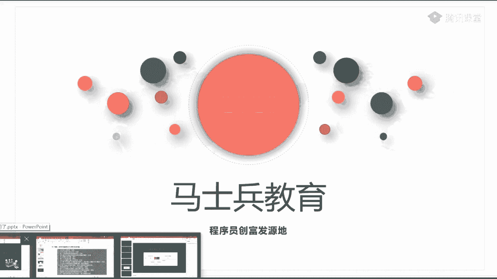

hello酷狗，带我去往在太久覆盖的地方转转，就像上集火影霜发射热白光灯演出来时的脚印，成长，我从狂野转停不下来，借人间第一枝抖开。

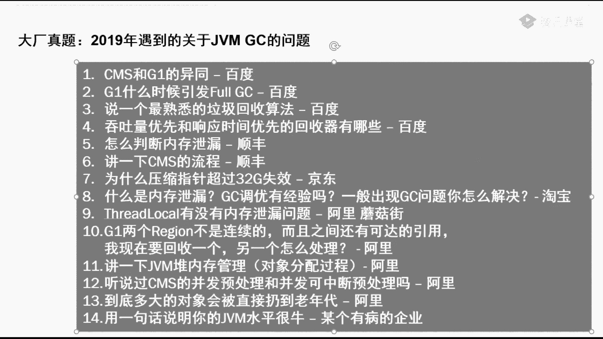

分明只是星辰，能耐窒息，是偏偏做琼台青纱，浊气的彩虹，笑开穿身，过一段时出真正清白风骨，犹在爱上过，有不能期待，哈喽哈喽，这老师声音的老师扣个一，听下声音，听下声音，哈喽，发射的好。

慢慢等待时的脚印长长，带我去了在大雪覆盖的地方，因为你总是不成故乡，连同这遗憾埋过于盛夏，无所情长思念，从上面传来，前来人间被挤出了白，他们做春华的世外梦想，千百天的可爱开始装新手了。

做空的少女可爱纯真，过一个书桌，正在清迈风，不要再心软的，开不动的情怀，人称雪蝶，如何，越来越，你是走一生来，那这一水的轻巧，然后虚妄对的幸福，美的地方抓紧去世，手机多影响此时的等，来时的脚印。

常常带我去，我们在早上覆盖的地方以后，一早是不上冬，夏能同这遗憾埋没于喧嚣，不诉情长，风吹飞舞，人造反，青春开合时传来，就像潜入水，天天纠缠一起上，那是边上的浮动，从一生被归还的伤，谁能溅起。

无数人说你我一分钟那样，make it go，let it，will make it，will make it，哈哈哈哈哈，嗯哼哼，爱的是非对错已太多，来到baby是我的长河，为何他的冲动。

她的寂寞不计较快，你有100万个有漏洞，快说不说，我以后最沉默，在做爱我，你不理我，关心自己过，说你不要太过纯洁，不必停留，你说我要青春都再来，我等到再遇到，我都不要再等候，自由啊，自由现在就要自由。

爱的是非对错已太多，来到没对错误的场合，快和他怂恿她的希望风起小丑，你有100万篇游乐，快说破，说破以后，接着我是否爱不爱我，你不理我，还是这结果，你说结果中间不必停留，你说我要一转头再来过。

难道女的都不要再等候自由自由，现在就要自由，我要看见无比重要，你说我要一转头再来过，难道女的都不要再冷漠自由自由，现在就要自由，怎么走的时候，我明明向往，就想着像天空，怎么也说不出口，等到我转过头。

发现你已远走，要脸上的人不住你都是一生，我曾经牵着你的手走在我前头，就像在那童话世界遨游，不能牵着你的手走到世界尽头，是我一生最美的山河，嘟嘟嘟嘟嘟，一个一个地一个人在游走午夜的街头。

我就像是一只无家可归的流浪狗，那时候我挽留你会不会回头，若时光能倒流，你是否愿意跟我走，我曾经牵着你的手，走在自我之中，就像在那痛的世界遨游，不要牵着你的手走到世界尽头，是我一生最美的伤口。

我曾经紧握你的手，总在发节奏，就像在那童话世界遨游，有解答，你的手足够瞬间尽头是我一生最美的伤口，嘟嘟嘟嘟嘟，不是我游荡在世界的尽头，遗憾的我真的不是你，你的手，情它总是让人痛，梦会变得很沉重。

谁不渴望有人懂能够陪我春夏秋冬，爱来匆匆去匆匆，人心变得越来越苦，谁能够一生相拥，却又害怕自我嘲讽，站在海角望春天，一路分手，如心中缠绵的心动，对你闪烁，勇敢试探春演的春晚，就这样的相遇，擦肩过。

将苍茫茫一片，看沧海，月刀相见，去赴烟灭，哀愁在胸口，眼泪喷溅的眼泪化作穿鞋太长，如何穿上身，爱来匆匆去匆匆，心变得越来越困难，越呼吸，能够一生伤过，却又害怕自我嘲讽，笑着在海角望着天。

已不再回首我心中缠绕的心动，对人小说，动感的视频，终点不见外，这个是给擦肩过珍，苍茫茫一片片，四海无月踏星界，曲风音乐哀愁在胸口，沿海天天在眼泪滑落，世界太君如何处置，生站在海之涯。

望着天一幕幕的再回首，我心中缠绵的形状，对谁说，燕山风雪路不是1000金的笑容，生生生地擦肩过千，草木皆平坦，四海未相见，去死念，爱就在身后，你看下自，燃起爱情如何去驰骋，天空色的假的啊。

ta key that is true，每天不是在打to me，oh keep going on at you，and i'm done，i'm more than，i do。

你所谓的正门朝阳好惨无力的四叶草，cuz，i'm b，流泪也不累也不累，交给交给turkkk，可爱情，我感动的不累还不累，绝不能过年的年夜奇迹就，那个回答一下弹幕孤风的问题啊，这，去查一下吧。

say baby，我关掉了，你说啊，也不能红绿灯的夜路骑个球，面对things，she to take more than you。

now make it up，my testing meeting of the way，could have in your，啊啊，嗯，真的，那里的天空被动还冷清，青色的回忆，希望踏上成长的旅程。

就到这颗，你就忘了，从晚你快回去想想有多点延续，再现过去，在一起才会出现失落的时候，只剩我一样，相信你自己，失眠焦躁的还是日常意义，要找个粉红的小天真一起做个梦，有一天我们会重逢故里。

世界最大的还是日常意义，一起交错，只有他自己，偏偏等100天晴，我们之间靠近你，对头发的不清白的回忆，她成长的旅程，请大丘丘的歌，你就不要送我，你快回去去想象，拥抱每一句，发现我去找你，亲爱的怪。

瞬间失落的时候只剩我一眼，相信你自己是谁，在做自然是假意，我早上最痛的小天真一起做过梦，有一天我们会重逢的，离世界就像温柔的水，一场莫须有，是奔着书来的是吧，需要就行了，东风吹倒了青衣，抽奖码能扫啊。

一会儿扫啊，哪个小姐姐哪个小姐姐都可以啊，世界充满了许愿一下想不想天真一分一分牛已经在路哪条路啊，要不是黄泉路，任何一条路都可以啊，所有人现在都在黄泉路上奔往黄泉的路上，一直活到死为止。

别忘记我们学习学数据结构与算法，刷题立刻就可以了，长清路，只要你开始学习了，你就在找新的路上，小九可以啊，一说感觉基本不会刷，先刷最简单的，不要刷那个中级和高级，先刷简单的，啊傻黑黑买了我的天，这个是。

是吧，众众众众智人中之一啥呀，这哪出题立扣，那算法课程呢，数据结构与算法有还能扫码吗，油可以，7。55开始扫，屏幕上写字，用什么软件软件软件硬件，屏幕画笔，你随便搜一个就可以了，请小仓鼠的小公主。

这喝水杯接广告啊，一直在你水的嘟嘟嘟嘟嘟嘟嘟嘟嘟，骑上我心爱的小，有没有人卖什么水的，才会比较乱了，你就当我是空中的光，这茅台多了吧，哎呦茅台把他当，我越离烦恼和忧伤，先看老师讲的算法。

你就会知道没有没有那么难，嘟嘟嘟嘟嘟嘟嘟嘟嘟嘟嘟嘟嘟嘟嘟，骑上我心爱的小摩托，它永远不会堵车。

骑上我心爱的小摩托，我马上就到家，推荐的这两把，如果你要是愿意刷算法的话，要不是有你算法目前没有纸质版的，你只能去找pdf版，还有一本书红皮的算法，这本书觉得还是写得不错的，三番讨论就别看了，太难了。

计算机程序设计艺术超级难，这两本比较难，只有当你到一定程度的时候，到风清扬这个级别好，然后去学这个好吧，baby，you go away，i still，you're good，建筑会怎么样，可以啊。

那个好多厂子都直接从上面刷原题，也够懒的。

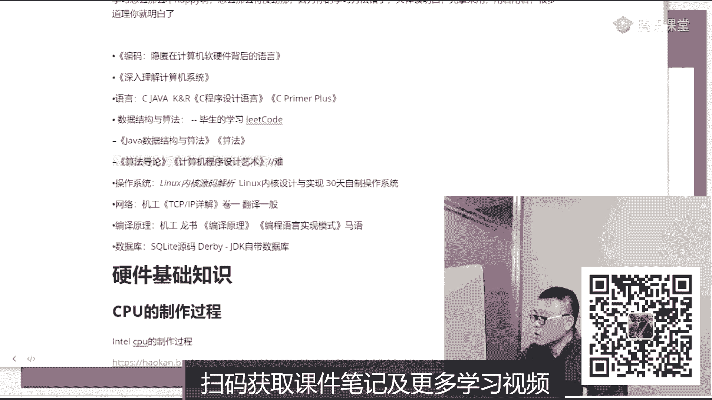

就算把各种我现在算法讲的不多，只讲了那个排序的算法，然后下一步准备讲二叉树，但是还没更到，主要是比较忙，最近然后一直没有更，因为算法这个东西是一辈子的事情，你恐怕这辈子都刷不完这些个算法。

所以呢我们慢慢跟吧，哎呀我已经回答你了，有只是更，但是只是更换初级的算法了，有时间的话再慢慢的更到中级高级，这n e s u s u a l8 比一二十来，觉得什么你的那么逗啊。

借不小龙g one的一点区，你不给设置的话，它是动态弹的，你要不你你也不要设，这样呢是要他要他要完成你的想象时间，你要给他射死了的话，他完不成了，就不要设那个啊，开了美颜都快认不出来了，对我告诉你。

这都是加了二二百多层滤镜的，这已经不算过分了，才200层。

那你看一个那个加300层滤镜的，这能认出来吗。

而且他说呢赶赴印章，老师结婚了吗，结好几回了，都都不知道啊啊您太胖了哦，袁鹏，不要停啊，好咱们7。55开始抽奖，然后8。5分开始准时上课啊，cs并发标记错误怎么产生的，这样一个对象失去赢。

怎么重新引用kd twenty one，你这个问题今天有时间给你讲讲，没时间就算了啊，书今天收到了是吧，ok，所以说那个32g再说一遍，大哥怎么能这样子呢，过两天那个很可能会有录播，你翻过头来看看。

看见了啊，159页啊，对这本书是159页，现在word写着我们的模板编辑比较好啊，你哪个方便用哪个呀，你在那个人家平台上，你就用人家的模板呗，你要发邮箱，你就用word呗，90抽奖了吗，抽了。

小莫读完之后有什么难理解，不难理解的东西都不值钱，咱们看看有没有得奖，8。05自动开奖，二维码挡住了，因为还没到07：55，抽奖被老师挡住了是吧，谁这么讨厌，挡住了，抽奖码太过分了啊。

昨天的都已经开讲了，能抽离一本书吗，目前的那本书还没有印出来，最关键是没给没给啊，看一下高并发的课程吗，可以啊，没问题，等小姐通知就行了，列车队和内存哪个好，没什么太大区别，不管怎么样。

你都是需要通过面试的，这不是有的卖吗，我看清目前没得买，主要是这个内容呢其实是我们讲课的一个整理资料啊，还没有说特别完善的时，弄一本书出来，今天刚变，阿里居然没问这位m，你是第几面，现在阿里就忙死了。

一面往往问的都比较简，单，得看你是第几面，一面实习，你开一面，大哥别着急啊，好多是死在三四面上的，你还没到死的时候，一面线都比较简单，super的公开课，等一会儿给你问问，周老师，抽奖时间到了。

哎呀你说的还真对哈，这个，这哥们是台湾的，哪个哥们是台湾的呀，支出者，刚刚的电商那里就能用的业务层里，对没错，起码你自己写线程池，这里用线程池来完成一些任务，应该是能用得上的，实习的，用繁体。

用繁体就是台湾道，没准人家就喜欢烦的，就特别烦，你也烦我也烦，吴亦凡，阿凡提，那是华为三遍，挂了，赶紧来学习，补充一下死在什么体上了，感觉生活好难，也不是，也不至于你可以用那个佛系的吗，反正我也不干活。

我就混吃等死啃老，每天躺床上生活就没那么难了，做一个巨婴，现在都用spring boot吗，师弟毕业2年大概多少k看人，还有这个这个这个毕业2年，这个毕业2年60万，所以分人，这东西老是忘了怎么办。

记在纸上，把要点记在纸上，没事贴，贴在贴在边上，没事看两眼，没事看两眼，然后等你去面试之前再看两眼，上厕所的时候看两眼，吃饭的时候看两眼，谁都会蒙都够，我好多事我都忘了，昨天讲的啥来着，忘了都。

为什么我的提问就是发不出去呢，对啊，我好像没看到你的提问，简历和你差不多，简历跟你差不多的话，那应该也是个60万左右年薪的水平，连体啊，推荐我们自己写博客吗，必须推荐，如果你们要有自己的博客。

整理自己的学习，或者呃去研究一些新的技术，那面试官老喜欢了，做的笔记也是乱七八糟，要用的时候老找不着，做做着做着就顺了，老师你的演技真的可以，德云社都齐，你咋那么逗啊，老师哪有演技，都没有演技。

你问啥告诉你啥，还有什么演技，老师会都是口技，一直做一条怎么样，你能承认你能接受一个不太高的一个薪水，就可以一点儿，不怎么样，你说的我都听不懂，零基础慢慢听就能听懂了，谁都是从零过来的。

在座的诸位所有人啊，都是从零岁过来，从对于程程序程序一点都不懂过来的，这个点才涨了4。5，可以开心嗯不错，这位置六星下去吗，10年8年的，差不了，我就过来找虐，哎这个可以找js，这是一个好习惯。

而且怎么做到这么成功的呃首先老师也谈不上成功，其次呢老师已经60多岁了，比你们成多成熟一些，多懂得一些也是应该的，也是正常的啊，我60多岁要跟你们懂的还是一样的，那我这个就远远，这不叫成熟。

这叫loser了，就，对啊我都跟你说，加200的从滤镜吗，假如说清华毕业，我我没有没说呀，对呀，我就是清华的，又能怎么样，你打我，那个给给狗熊喝硫酸的还是清华的呢，那个我的小师弟周老师也是清华的，没有。

6年12k2 线武汉工资经验高还低了低了，张学友，你太优秀了，别人优秀跟你有半毛钱关系吗，你只要超过你身边的百分之八九十的人就行了，开始学习自己，努力起来的时候，是身边百分之八九十的人都在那打游戏呢。

你就是老大，number one，当然是我要超越的人，到马老师去世之后，你就可以超越老师了，假如你再活50年的话，3年合肥时期高了低了偏高，r语言计算机专业的吗，机械最多35算，你说对了。

nike要怎么学，先学怎么用，再看源码，号线8。1分，我们稍微等一下，路人小伙伴，8。05呢，咱们准时开课啊，这个职业规划怎么做，看你具体情况，一会儿有兴趣可以跟老师聊一聊，讲完课。

1年半北京大概得多少算正常，15左右，目前，spring的学习嘛就是先学用吗，任何东西都是先学用，你要了解自行车的原理，先学会骑，提熟了之后再分析那个链条怎么传动的，然后呢再往里分析它的材料怎么制作的。

工艺是怎么做的，原理是什么，4年北京25k容易吗，easy老师也是培训班出身吗，老师从学校毕业就培训别人了，毕业演讲的成都拿12k难吗，1年之内12k相对偏难，过了1年之后应该会好很多。

有的是机器人容易取得荣誉，圆梦，50年之内你应该是见不着的，师兄千百度300000算可以吗，可以正常应届生千百度300000算是比较正常，请问老师有哪些公司在过马士兵钓鱼，老师有这个偶像。

所以我们看到看到了，你看到了吗，老师做了多少年的培训，20年，今天有时间干别的来着，开玩笑啊，有时间去干别的了，没想到回来讲课居然还没人讲的过，老师，你说这不是太过分了吗。

揭秘小龙19年20年23k看在哪个城市，这个不一定，还有两分钟啊，两分钟之后呢，我们开始我们今天的内容，声音那叫一个年轻人，你不知道声音也是可以加滤镜的吗，学了就忘难受多倍。

南京3年15k可以不高不低吧，8年才17，那低了哪个城市都不算高，这声音都怀孕了，嗯只有你怀孕这个事儿不合适，下面我给你打胎，好，流产了吗，流产了我就可以恢复原来的声音了，嗯，北京多少年都40。

北京我不跟你说，那个就就就就是按黄老师的简历，2年就已经60万年薪了，好08：05啊，我们准时开始今天的课，这个，首先呢抽奖这个没有抽的一段时间之后，不知道现在开了没有啊，开了就算了。

然后今天还有一次抽奖，是下课之前抽这个抽这个东西哎，这个奖是比较重的，主要是鼓励大家多陪陪老师啊，陪到下课呃，一等奖呢是一个b此耳机我都想要，二等奖是一个机械键盘机械的。

这就是我现在那台机器用的那个这台机器用有用的是也是个机械的，三角是一个小米手环，四等奖是一个京东的一张购物卡，应该是100块钱的吧，五等奖是十本书，其实你坚持到最后，这个书抽到抽不到的关系不大了。

我觉得这个讲述的有问题，回头跟他们说一声啊，那我们先回顾昨天讲的内容吧，好不好，简单回顾一下啊。

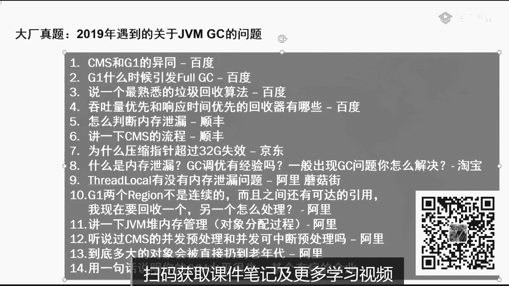

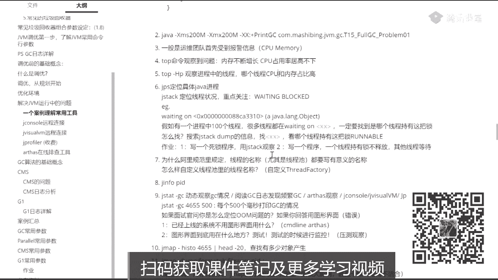

你们稍微回顾一下，昨天呢我带大家呢主要是过了一遍这个东西。

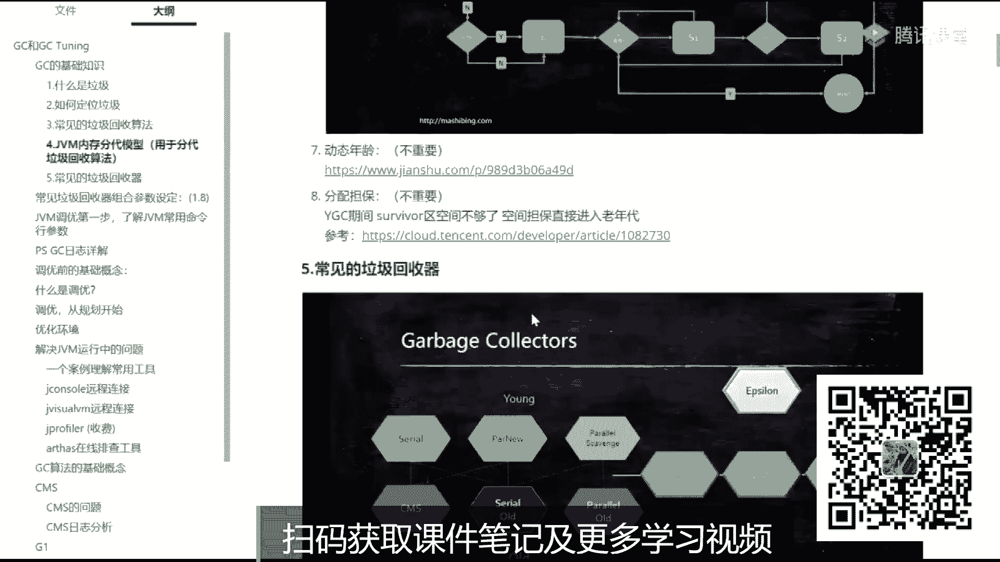

就是常见的垃圾回收器，垃圾回收器的一些常见组合诶，哪些呢是分带的，哪些是不分带的，哪些是逻辑上分，在物理上不分带的，讲了这个东西，然后呢我教了大家几个简单的命令，来观察一下咱们这边的一些情况。

观察一下dc的一些信息的，给他列出来，交了那么几个简单的命令，然后昨天呢我运行了一个小程序，这个小程序呢就是还有这个小程序，小程序呢是模拟了一个呃，对于信用卡模型来做模型匹配。

来做风险控制来做的这么一个小程序，而且小程序呢它本身是有些问题的，昨天呢呃大家伙也都看到了，然后在昨天结束之前呢，我跟大家说过，我说呢呃在我们实际当中调优的时候呢，我们还有一个特别好用的工具，就是谁呢。

阿里开源的那个office呃，其实来教大家做操作这个事儿相对简单的多，呃我今天给大家讲完操作之后，能让你的简历上能够大体写上有过jvm调优经验之后，看看能尝试给大家讲一点理论好吧。

理论其实相对难好难好多呃，面试的时候问理论问的比较多，实际上你只要有个操作，那么别人问你的时候，你是做的什么操作呀，什么情况下你做调优啊，这个东西能说的出来的时候，ok你这个简历就值钱了。

今天他特别过分，我以前的学生啊，就是从做线上教育以来，学了我们课程的学生少着大概学完课3~6月左右，少着能往上涨5000块钱，今今天今天特别过分啊，今天有个学生只涨了2000，还好意思跟我说，太过分了。

实在是太过分了吧，打破了我们一个记录，本来我们是原来的学生，差不多啊，每个月涨5000块钱，今天有一个只涨了2000，但是他只报名只报名了三天，哈哈哈哈哈，虽然他破了我们几个，我们还是很高兴的啊。

好开玩笑啊，来看这里，那今天呢我主要给大家讲这个office的在线拍照工具。

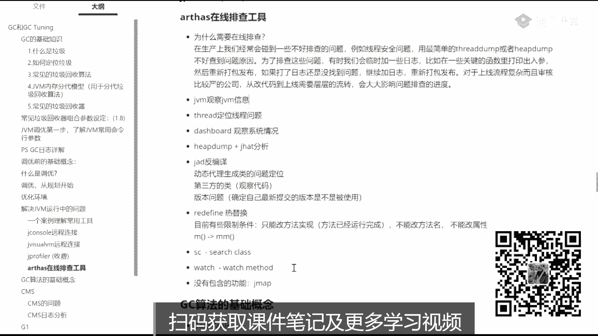

ok回来回顾我们这个小程序怎么用啊，稍微回顾一下，我们首先呢把我们的例子程序给跑起来，还是这个小程序让它跑起来，大家还记得吗，我们others怎么起来啊，就这个小程序呢，它有问题，昨天呢大家也看到了。

我们首先用top命令能观察出来它内存在不断增长，所以你的网管肯定会过来找你一个大耳刮子呼上来说，你这怎么回事，你赶紧给我调去好，你就给他调，你怎么调呢，你用几个命令来调。

当然昨天讲的那个几个命令都比较土，我今天呢给大家也是java自带的，但它比较分散，比较土，用起来不方便，今天用一个核武器，就是那个阿里开源的这个ars，首先所以这是这是原来我们需要需要调试的这个进程啊。

需要调试的这个进程，他在这跑着这个阿瑟斯怎么工作呢，阿瑟斯他自己也是个进程，他起来之后呢会attach到挂到上面去观察它里面的一些运营情况，这里面呢是java自带的一个编程接口，叫jvm ti。

如果你感兴趣可以去看一眼阿瑟斯是拿什么写的，是这个接口叫jvm t i简称叫java，virtumachine to interface，工具接口就是你可以为jvm写一些工具，通过这个gm ti来写的。

就是就是拿这个写成的，我看这里，来把直接点了，这刚站，os 5点战，挪一边去啊，好我们挂到这个进程上，这个进程是2176敲一，那么当你看到f4 这个界面的时候，ok你已经知道了啊，已经挂上去了。

s命令有很多，我推荐大家呢，你直接到others的主页上，就get up那个主页上去看他的中文写的注释写的很详细很好，也不用去专门找找些书什么的，可没必要。

还有一个呢你就是用这个help help写的也不错，非常好呃，我一般就直接看help help，它就会列出来在阿富下面呢，你可以运行哪些个相应的与相应的这种命令，哪些命令都有这么多mac。

我就不一一念了，特别多呃，我教大家几个好玩的，几个比较常用的，首先第一个呢叫dashboard，dashboard仪表盘，仪表盘什么意思，你一敲回车的时候，你会发现诶出了一个用命令行模拟的图形界面。

他每隔5000应该是每隔五秒钟刷新一次，如果没记错的话，当然这是可以指定的，这里面给你显示的是什么内容呢，我想你一看就应该明白上面列出的是什么，最繁忙的有哪些这些现成的状态，它写成的名字。

还有呢关于内存的一些信息对占了百分之多少啊，一边去百分之多少，survivor区多少，tenure generation，昨天我讲过tenure的generation，就是o的区域，老年代占多少了。

这个还有呢下面是一些运行时信息啊，操作系统的名字，操作系统的version，java version，java home，这就这就不说了，好这个比较好玩啊，当然这个是看一个大体的情况。

除了dashboard之外呢，就是dashboard，你可以远程的去看他什么呢，哎去看动态的去观察它，看看这哥们儿年代是不是不断的在增长啊，是不是老回收不了啊，的占用是不是不断在增长啊，去看这些。

去看这些信息，还有哪个线程是最忙的，占了cpu占了多少钱，程的名字是哪个，到底什么情况，他在干嘛，如果有人有县城不断的占占cpu，ok这个县城一定是有问题的，县城都占了百分之百了，查他怼的。

ok这dashboard就干这个式子来get到同学给老师扣一，这个比较简单啊，不难。

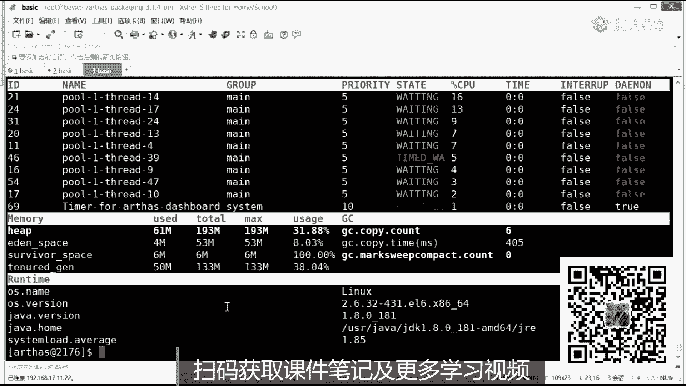

好我们再教下，然后呃在这个就是java，就是阿里的这个东西呢特别强大啊，他除了有一个命令没有弄完之外，其他的基本上全都全都全都完成了，好大家看这里啊，来我们再来再来教大家另外一个命令，就看这个吧。

jvm this late tardage of information，大家还记得吗，昨天我教了大家一命令叫infer，然我看出这位的相关信息，阿里的这个g v m啊。

这个命令其实比昨天我给大家教大家那个jinfer那个命令，它显示的更加的详细啊，他比那个要详细的多，最好的是它能够显示出来，你到你现在到底用的是哪些个垃圾回收算法。

比garbage collectors，你现在用的是哪个，copy market，the mark mark compact，你现在用的是拷贝，拷贝完了之后呢，是一个mark swift。

再加上压缩输入，有有就是简单的说就是我们原来的psp，他算了，当然还有一些其他的信息，这个你自己去看就行了，这个不难，ok，啊没有clear票吧，好我们说我下面我下面来教大家呢，教教他什么呢。

教大家怎么定位我们这个程序的问题啊，我这个小程序一定是有问题的，当然他现在还没有显示出来，但是它有问题有什么问题呢，我现在教大家怎么定位，昨天大家观察这个小程序的时候，你会发现它会执行一段时间之后。

它会频繁地g塞，对不对，频繁发生gc不断的gc，然后呢它不断gc呢是什么情况引起的呢，还得看一看，一会儿我就一会，等他评判g c之后，我们再来看他信息啊，你就了解了，我先教你别的命令吧。

一会儿我们回来看这个信息再看啊，教你一些别的命令啊，你比如说，这也是一个很有用的命令，是把这个java进程里面所有的线程全给你拽出来，昨天我们讲过jdk，大家还记得吗，jdk是干嘛的。

也是观察那些现成的信息的，阿里的这个thread和jdk完成的功能一模一样，但是它用起来更好用一些，比方说我想观察16号这个线程，它的一堆栈的调用，而且呢和16ok就可以了，我知道啊。

这个16这个线程在干嘛，他是在一个什么状态，它是在运行哪个方法，这个方法的调用站是什么，当然如果你一个程序里面现成非常多，你还可以进行过滤thread或者may。

比如说may may may里面开的线程啊，全都给他列出来，全列出来单位呢，如果你像阿里的那个要求，每一个线程你都起了正确的名字的话，那么你就可以用名字来进行过滤，如果县城有谁是，比方说它是持有锁。

产生了这种死锁的现象，直接一个命令thread当b反正我这是没有锁的，就是没有组，没有会产没有产生死锁的线程，所以你刚毕是看不见的，如果你产生死锁，你自己去写的，你用它来挂上去的时候。

thregb就直接会把那个县城哪个线程死锁都给你找出来，thread呢还有一些其他的参数，任何一个命令后面调杠help回车，你就知道这个命令的用法，这个命令到底是什么意思。

他说display infer threstack，然后它有一些个examples，一些告诉你的用法，比方说gb gb是什么意思呢，find the thread。

who is holding a log that blocks，the most number of threads，你懂你就明白了是吧，find the threat，找到那个县城谁呀。

holding log，他正在拿着一把锁，阻塞了其他人，阻塞了其他见证，他导致了思索，把这县城给我揪出来，fly刚毕是不是用起来特别简单，感受到了没有在一个界面里面把所有的问题，所有的问题全解决了。

会影响被监控进程的性能吗，必须得会，如果不影响他怎么去拿到那些信息呢，必须得会影响，然后我们继续往下接受命令，等他等一会儿他要死机的时候，我们再来看他的信息，好吧，再介绍几个啊。

这里面的命令我就不完完全全的从头到尾已经介绍完了，这个就没意思了啊，我就是多数人，大多数的人应该更看外面的文档，看，帮助的信息应该都能完成是吧，来有这个学习能力的，给老师扣个一好不好，我觉得应该有啊。

参加过任何1年半年的工作的这些成员，这都不是问题，大家就再给大家介绍一个命令是什么呢，这个呢我倒是我这几个命令啊，我建议你可以了解一下这个命令还是挺好玩的啊。

第一个呢叫search classes loaded by gb m s c s c，什么也叫search class sc sc呢，当然他的命令的方式有特别多，如果你这条s的话，它就会把他就会把星。

它就会把所有的这种命，你它里边加载的这些类全都弄出来，当然你可以这么来写科目两码是诶，这是我们自己加载的那个类，ok这个包下面呢它加载进来的所有类的信息全都列在这里了啊，你看到除了我们的主力之外呢。

还有三个蓝的表达式是吧，有啊内内部类的啊，两个栏目的表达式啊，两个内部类啊，一个是有名的内部类，一个是匿名内部类，不说了，老师你把这个类的名字找出来，有什么有什么用吗，是因为呢他为下一个方法做准备。

下一个方法叫什么呢，下一方叫sm sm别扭，这名字起的全称是什么，sm叫search the method of classes，loaded by jim，去查什么，查方法，找到那方法，sm。

你点视频这样如果是这样的话呢，它会把这个类下面的所有的方法全都给你列出来，当然你要查那个main方法的话，就可以直接按这样的格式来写，马士兵jvm gc啊，把这个麦给给给搞出来，只是查类名，查方法。

这个东西呢没什么意思，其实它最重要的是干嘛呢，最重要有两个命令是跟在这两个命令之后面的，不是sc，你有几百个类，我用sc把我关心的那个类找出来，这个是需求是经常有的，100个类里头把这个类给我找出来。

这类头有好多比较关键的方法，忘了方法名叫什么了，sm给他搜出来，搜完了之后主要是干嘛呢，一定是这个方法有bug或者有问题，我想观察他，你说对不对啊，同学们，这是肯定的。

那下一步呢有几个观察的命令开始服dc了啊，这就快了，有几个观察的命令命令你值得大家拥有，你值得拥有呃，这几个命令是什么呢，第一个呢是trace，他说你看这里啊，他叫trace。

the execution，time of specified method invocation，这是什么意思啊，读一下你们理解trees，后面要跟参数的话，如果你不知道它怎么用，很简单挑help。

看他的examples就行了，你看啊，比方说它trees某一个类下面的is blank方法，看到了吧，这个trace是干嘛的，这个trace是跟踪时间的。

the execution time a specifimethod of vacation，指定一个方法的调用，它来跟踪这个执行时间，这个就是执行效率，你比方说你写了一个很关键的方法，放上去之后。

这个方法呢肯定会让用户不断的调用，不断的调用，不断的调用不断调用啊，或者是你的web application的话，这个方法会不会用不断调用，这个方法是一个很关键的方法，要求它性能比较高。

但是你会发现这方法性能不到位怎么办，观察他到位没到位啊，这个trace直接跟他看他的方法执行了多长时间，当然我们这个小程序呢没有这种不断执行的方法啊，不停的执行，又来一来一个请求执行一次。

来个请求执行一次，所以这个目前用不到，但是在你们自己写的web application里头，一定有这样的方法，你比如说你写了一个什么service。

service service里面有一个方法叫make an order是吧，设施给他成成交一个订单好，这个方法和数据库打交道，和硬盘打交道，和缓存打交道打交道完了之后反馈回来。

你可以跟踪这个方法的执行时间，你会发现他是执行时间特别长，一定有问题，每次用这个东西跟他跟他跟晕了，真晕了，说明你不了解这，到底是怎么用的，这很难吗，很简单，应该是好，讲。

到这里能跟得上的同学给老师扣一来，那除了这个trace之外，trace很有用之外，还有一个跟踪方法也挺有用的，哪个哪个呢，就简单对老师把这层窗户纸给捅破了，你就觉得没那么难了，就好多时候叫会诊不难。

难者不会给你捅破了，你就觉得没什么难了，叫monitor，这个也挺好玩的，也挺有用的，你看一眼就是monitor，method，execution，statistics，for example。

success，fader，count，average，favorite等等等等等，这是干嘛的呢，跟踪这个方法的运行数据，这是什么意思啊，简单说一下，已经跳不进去了，因为那边那个进程已经死掉了。

这monitor是什么意思呢，monitor的意思是当你跟踪某一个方法的时候，这个方法是哪些值被传进去了，传进去的哪个参数值，哪些值被返回了，他的一个执行过程，这些数据全都能给你跟踪起来。

这个对于你定位问题来说也特别特别的好玩儿是吧，也特别好用啊，这是你为什么要跟spring的方法呀，你不应该跟自己的方法吗，现在为止呢其实还有一个关键的命令，我还没有讲莫及，下面我来讲这个关键的命令。

这个关键命令是什么呢，就是但你的程序发生问题之后，你看啊，现在看我现在这个不停的复dc，看到了吧，不停的刷新，不停的刷新，这特别频繁，而且你看到了这哥们其实已经死掉了。

他只不过有些遗留的线程还在不同的不停的输出而已，那个输出线程哈哈还没有输出完，已经死掉了，已经om了，这个程序的bug就已经出来了，程序bug会是什么样的呢，内存不断增长到一定程度之后。

频繁f g c f d c之后，再过一段就有可能产生l o m，这是这个小程序的问题，那下面呢我们就来定位这个问题，先把这个给停掉，大家需要注意的，有有有一有一点在这儿，其实有一些细节我已经略过它了。

因为呢那些细节对咱们今天的时间来说不是特别重要，你怎么设置gc的日志，你实际的工作场合也是特别重要的，如果有面试官问你，你纸质的设置的这种参数，你要是回答的有问题的话，我告诉你。

面试官一眼就能看出来你的水平到底是高还是低，什么意思呢，这个我在笔记里呢也给大家记了，我怕大家看不懂。

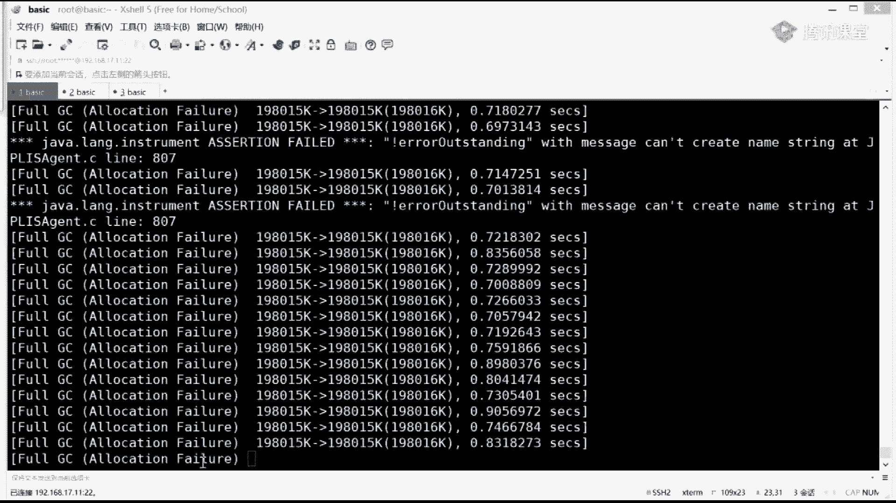

我多说两句，的话，好看这里日制参数的时候一定要好好设，有很多人啊在设这个日志参数的时候，它就直接呢就指定指定一个日志文件，知道吗，那就不管了，我告诉你，凡是指定一个日志文件都是业余干法。

有为什么要问你说你们有几个日志文件，就一个死大耳刮子直接给你抽上来，为什么，因为你自己想想看这个日志它会不断的增长，不断的增长，不断的增长，日志要是增长到四五个g的这种日志，你想分析里面数据。

你累不累啊，累死你，我告诉你，真正的日本参数，按照文档里头这么说，设好日志的名字，自动生成，这个日志是一个滚动日志，叫log for rotation，有多少个日志文件，五个这个数你可以自己设的啊。

五个十个你自己看着办，每个日志文件是多少，20什么意思呢，产生五个日志文件，每个日志文件最大20兆，因为它是滚动的，最后一个日志，满了之后写第一个，第一个就被覆盖了，这样的话总共就100兆。

要搞一个日志文件不断增长，肯定会问你，那是有问题的啊，刚才我讲的这一小段街道同学老师口音。

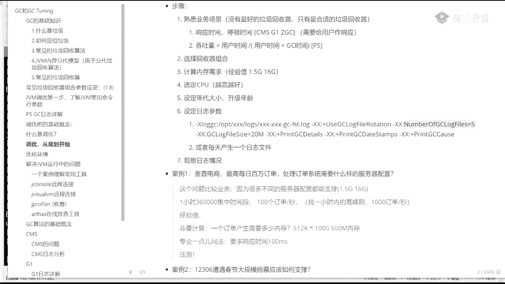

主要是让你知道你怎么跟面试官聊天，日志的信息，这里给的信息叫做非常初级的信息，如果你设日志的时候，一定要设置的特别详细的那种，我给大家讲日志文件的解读，主要第一比较容易。

第二呢跟我们实战的关系并不是特别大，今天所以呢我们先把它放在一边，但实际上每一个不同的垃圾回收器的认知。

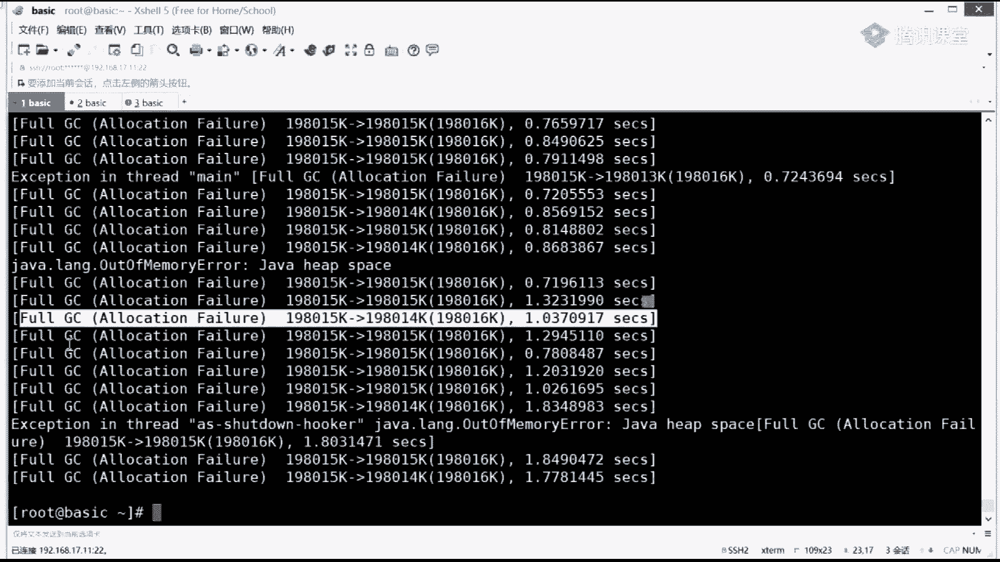

它实际上还是还是很复杂的，你真正要把它看懂的话，你得确实实了解啊，就是这里面的每个日志它到底产生了什么意思啊，这个我有一些整理啊。

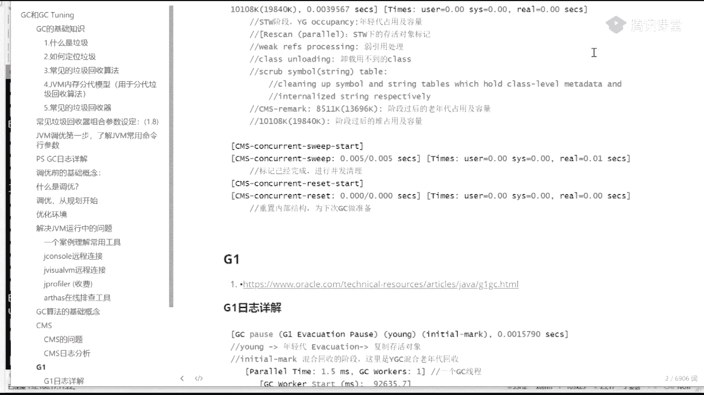

你自己尝试看就行了，在这儿呢就不花时间讲那个了，比较枯燥啊，也没什么意思，先把它放一边儿，你在日志里头发现就定位一个日志问题的时候。

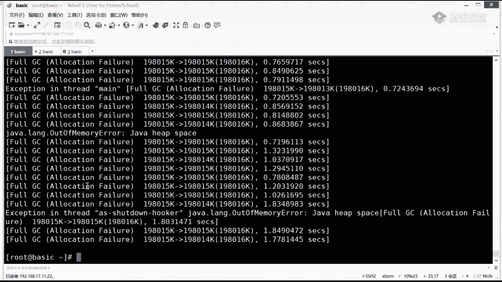