# 系列 2：P60：0.5 netty中使用了那些＂NIO＂ - Java视频学堂 - BV1Hy4y1t7Bo

hello，能听到我的声音吗，小伙伴们。

别说了别说了别说了，可以，你有没有化妆，怎么没有物业的，我刚才禁言了，就是现在这个嗡嗡这声最终没有影响，是，好吧，我们一会让园区的看看哪个声音，老规矩，咱们还是8。05开始讲课，等等，路上的小伙伴。

来得早的都是大伙伴，听首歌吧，这是我能不能七三，what's the point of young year when all our shadows disappeared the animals that i came out to play。

when face to face with all our fears learned that，learn through the tears made memories。

we knew would never fa，he told me，son don't let it slip away to be this time，hard to say，i。

don't you get over you，while，this is a three，he said one day，you know this world。

we are so live a life，you will remember my father told me，when i was，just a child these are the ni，嗯。

the plus all holding down a lot of fire，they can't put out，carving naming to the shining stars。

he said go venture far beon the shoes，don't forsake this life of yours，i got you home，no matter。

where you one day，i'll follow，and will be sl，let it sway，i will see you，he said one day。

you'll leave this world behind，so live a life，you will remember my father told me。

when i was just a child these are the night of the dive，your father told me，he's all the night。

the sky，my father told me，哦哦哦，they will keep your heart，once to heart，she can touch me now。

this this this one，i won't for your midon one，you slay the game of my raiser for you，and your sist。

再开一切成空军恐惧水平，感觉不会，this is not just for you want，this is called for，不爱了就we let your heart，18今年都18。

for him before it would be to tire with the fin there，oh not fit for a king，这这本这本书其实其实就是这个点猪腿。

能能知道这个名字的沐浴之士，能知道这个名字的应该是清火大剧第一节课的，这本书其实没有太大意义，意义不大，fly with me，just fly with me，来，书名是啥，不给你看了吗。

哦我刚才把屏幕磨出来了，我就再再再再再再放点，这本书意义不大，其实，老板，镜像来我给你反转一下，现在清楚了吗，看到了吗，哎我天呐，累死我了，刷好了，去了一会儿就虚了，晚上还装修装修，讲了个蚊香。

蚊子有点多，没错，今天晚上坚持到最后的，我做过，哦哦，算了就跟你们聊天了，没那啥事，哎呀，好开始了啊，还有几秒钟的时算了，不听了，想听的可以自己去下一首歌，那我们来开始讲课了，昨天讲到讲到哪儿了呀。

他这个舌头也不利了，刚才讲到一炮了，对吧嗯嗯数据下1p是个啥东西，理论讲完了还没讲完，一炮到底是个什么东西，vn讲到了这个多路复用器，然后呢梳理了一下这块应该还没有讲到一炮。

只是说了使用多路复用器的时候，无论炮或者是slight这种多路复用器啊，就说到这个，这这主要是说这两个多的分歧了，然后你都要学都要学，为什么说都要学，因为在最终啊。

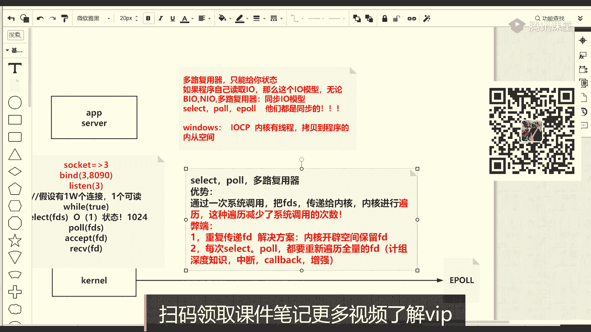

最终就是我们是java程序，你肯定是要写些java代码，java代码当中，在nl当中，它也有一个多路复用器叫selector，当然这个selector是java当中nio包名下的io记录是new io。

然后在nel当中，然后包的体系当中有一个selector，这个selector其实说白了它既可以是select，也可以是poe，也可以是epo，能理解吧。

就指不定他就是你你这个同样一段代码运行在不同的特质的服务器上，它可能是这三者中一个或者是其他的，比如qq这种应用系统，那这个或者是windows windows的这个select，然后底层的东西它会变。

上层只会给你一个接口的这么一个封装，就是select，所以为什么说学讲nl的时候。

这些东西都要给你讲啊，都给你梳理清楚，这是一个很很重要的一个点，那最终其实用的最多的是什么呢，是一炮啊，这是jdk pvm启动的时候，如果在一台linux操作系统上，如果这台操作系统当中有1p的话。

它是优先选择它，但是你可以手工的切一个jdk，就咱们不用1p，当然这gbm就跑到这个鞋带上也可以，所以这个特点你得明白，那最终的话其实用的最多是一炮，我们要把一炮学的相对明白一些，他到底怎么回事。

而且你还要类比，就是一破到底跟前面这两个都不松气，他们三个虽然都是多路松气，那它到底差在哪儿了，它的性能到底好在哪了，本质区别在哪，简单回顾一下，就是在多路复用器当中，其实我们最简单的一句解释。

如果别人问你什么是多路复用器，就是多分析，首先解决的是io状态的问题，它并不解决你读写这样的一个数据的问题对吧，这是第一句要说出来的，然后询一下询问所有的io的状态，而不是每一个io我独立询问他的状态。

减少了用户带到内核态的切换的过程，好吧，这两句能回忆起的同学来刷波一，这就本质了，那这个里面其实反正就这么两句话，但是为什么要分成两类，一个起来的炮或者是一炮这两大类呢。

那这时候其实就在于slpl这个早先的多路复用器，还有一个问题，就是每次每循环里边都重新传你用空间的所有的这个这个瞄准符，到你的内核，然后内核是因为新传进来的。

他并不知道之前你你你你你你你之前并没有告诉过我，所以并没有给你准备过，那这样的话对于造成重心的这种状态的轮毂和便利性能会相对低一点，那一炮其实就是针对这个问题来解决的，就是我现在写的这几个问题。

它的弊端就是重复传递d，那解决方案的话，好像那时候开闭空间保留就可以了，或者是还有一个问题，就是每次因为你都每次重新传嘛，每次死战的炮啊，都要重新遍历全量的f d。

如果某种方式可以避免每次重新全量的便利的话，那这个性能应该也有一个提升，所以基于这个我们先来画一个拓扑模型，简单简单的去思考一下这个问题，那整到一炮的话，根据我们掌握了b端或许的方案，先自己画出来一个。

然后再去想诶，他这个东西是不是这么去解决的，然后最后我们要从实质从这个系统调用的官方的那个帮助文档去寻找，还是程序，那么是个程序的话，注意听跟我的思路走啊，昨天听完课，今天应该就会了。

你别自个儿先去琢磨什么事，你跟着我的思路，还是我们的程序，我们的程序的话，如果里面随着时间的运行，接受一个客户端，接收一个可能未来会接受很多的客户端，这是为了解决每次从曾经那个多的服务器。

每次都往碗里传东西，那我们可以在我们内核里边开辟一个空间，我就先用这种文字描述先开的一个空间空间里放什么东西，这个空间就是把你程序从运行到你一直没有断开的这些文件描述符，接收到了啊。

这个在完整的生命生命周期里，在完整的生命周期里只会向里添加一次，而不是每次你想问问他们有没有状态的时候重新添加，通常来说就肯定会有fd文件描述符，也代表我们那些个输入输出那种l流。

那么应用程序只接收了一个，我得给你放进去，然后无论每次我的程序每次循环里面，我都不重新给你传递了，也就是这个文件描述符，生命周期里只能往里放一次，那随着随着变化，那么你会有很多很多往里增加。

而每一个文件描述只会增增一次，那这个空间里是不是有这个文件描述符了对吧，这个就解决了我们第一个问题就是重复传递f d的问题，这块能接受同学来刷波一，那怎么创建它呢，怎么怎么回事儿。

这个一会儿我们看信用交易怎么去实现呢，跑一个程序来拉一下它的底层调用的顺序过程，那么除了我往里放，但是最终的话其实我们程序它关注的是什么，我明白程序关注的是什么，程序关注的在使用多路分析的时候。

关注的是io状态，那么这里面你f d代表的是i o i o状态之后，那这时候其实程序是要和我们内核去沟通，说这个你告诉我谁有状态，你肯定不能问一次，问一次的时候，那这个先看结果，结果的话。

它肯定有一个返回区，前面我可能放了这么多的f d在这个空间里边就是增是吧，那这边是增，但是这里面如果一个md代表那个i o代表那个客户端，从外界发来了这样的数据包的话。

那这个时候其实他要把他的副本放到这个返回区去，返回区才是我程序想要的，就是程序呢关注的其实就是一个返回这件事情，这是程程序关注io状态，io状态怎么来的，然后只要需要内核。

然后在这里面有一个逆差的这么一件事情啊，在这注意注意了他这一个逆差的一件事情，就是如果曾经我向那个区域放过这些分支秒词，只要我放进去了，那这时候假设啊假设一个极其好的极其好的一个一个一个现象。

就是如果你有两个cpu，我用一颗cpu，假设这个cpu因为很多的中断，这很多中断，然后有中断成之后，就会把这个i d里边来的数据放在缓冲区，然后把d放到这个区域，也就是一颗cpu。

我cpu 01做了这件事情了，那cpu在做fd以及把这个fd向这边去移动拷贝的过程，但是这颗cpu做的假设我这台电脑是服务器，有很多cpu，那是不是很有可能就是另外一个cpu cb 02。

它其实是在忙着这个程序运行七个代码，也就是他们两个人之间间接的是有一个什么呀，是一个并行的异步的，这点很值钱，到这儿呢，这个这这这这两个概念能看懂，同学来刷波一，我用两颗cpu给你描述。

那么同样类比一下，如果还是曾经这种模型使用seless用炮的时候要注意听，如果你有两颗cpu，能起到这样的效果吗，你服务器还是两个cpu，cpu 0 cp 02能起到一个效果吗。

那么假设这个程序是由这颗cpu一直在跑跑着跑着的时候，那这个程序说我要掉slg或者掉po，我要把一批文件没传递给内核，内核帮我看一眼状态并返回给我，那这时候其实这个调用的过程会产生有一个东风气的阻塞。

是我吊你了，咱们现在的内核去帮我变绿了，然后我在在这，因为没有返回，我在这儿等着，然后这个时候其实你这个cpu根本没有起到任何的效果，因为从这个cpu开始执行的程序的代码，然后一调性标记之后。

他会把这个执行从这个用户空间的程序接到我们的内核过来，我把他拉过，是不是这时候在这个cpu再去忙内核的变异的一个事情，变完之后又返回之后，是不是再从我们那边再回到城市，就没有充分利用多核这个概念。

也就没有异步，也没有这个这个这个并行的一个这个这个这个这个概念对吧，所以这时候其实明显就可以很容易看出内核，只要第二段牺牲空间对吧，然后来换取时间，ok这个好理解好理解之后。

我们来看一眼系统调用怎么去解释。

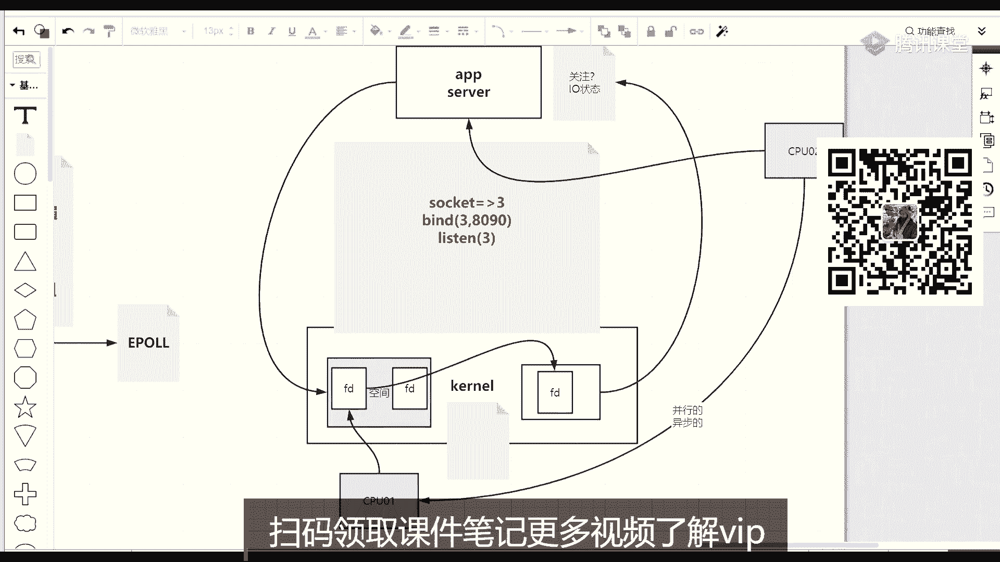

嗯先不是r先搜的是e po回车，那么打开这是e po的官方的一个帮助文档。

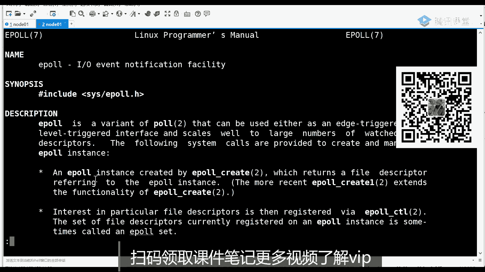

你可以去通片子去看一眼，但是这时候其实我教过你学习方法，这个系统调用在哪，系统调用就是第二。

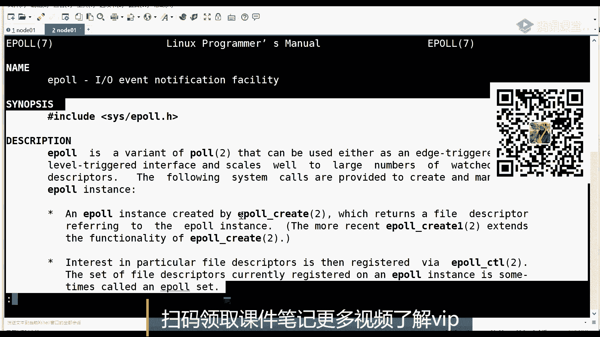

二手性专用对不对，然后你会看到啊，一炮啊，这是七类砸下menu有八种帮助文档进行看下，就是menu这个程序它自身可以给用户提供八种帮助文档，只有二类的系统调用，所以你在看这个文档的时候。

要关注他某一些指令，后边括号里面标的是几，他说哪件事情，那么相对里面炮是二类和这个apple create是二类的，然后e po还有一个cpl是二类的，还有一个eo wait，为什么窗口太小了啊。

还有一个e破位的是二类的，所以这时候你具体要看谁，看那三个在这儿的话，其实你已经找到感觉了，比如说manual 2类的e破c create一个create这个函数调起来的时候。

中间那个括号的参数先不用管，它能返回值，返回值就是一个印子，这个in的返回的是一个啥，记住啊，跟着思路走，如果这个ip就成功之后，它的返回值其实返回的是一个文件描述符，但是这时候注意听啊。

哎那我之前的所谓的文件描述符，它可以描述什么，可以描述，我们现在给你讲个socket，那现在用apple create这个文件描述符描述什么，那应该是pocreate创建了啥，在描述啥，不是创建了什么。

他就描述什么对吧，这应该这应该能理解，所以这时候其实先记住啊，这一波可以的，会得到一个文件描述符给你描述了，上推出去再来1o2 类，还有e刚才看还有e pc条，这时候看到这个的时候。

其实你已经get到点了，那么衣服可能穿的那个东西，然后一个文件文件描述符描述的在使用epc pl控制的时候，它是控制的或者在控制什么，控制是在刚才那个e poo的fd。

就是刚才那个e pocreate返回那个文件描述描述那个位置，在这个位置里边还好有一个open operation，operation是什么意思。

在origin里边会有一个比如说i的往里添加或者是修改或者删除，那这时候我们来看，如果这是爱的往里添加，那添加什么，就是在刚才evil create创的那个区域里边往里添加i的添加，添加啥呢。

后面给出了一个f，比如说我们先有一个可能连接那个socket m d把它添加进去，先去给你关注的是哪些事件呢，比如毒事件，写着件或包括事件等等对吧，这是e pc t l把这个在心里记一下。

到时候你画图画出来，这个能改到这个点的同学来说不一，大家都是程序员，我相信带你看a p i的话，应该很容易能理解他的这个收件什么事情，最后还有一个就是一破位置，wait的话。

这里面会有还是对着这个ip f d，就刚才创建的那个f d文件没有符啊，然后给出你关心的事件，一个一个一个一个收纳的这么一个集合，你给出一个指针啊，这就是未来直接把你这边有时间来给我考到这儿。

我就可以返回了，那通俗来说就这么三个。

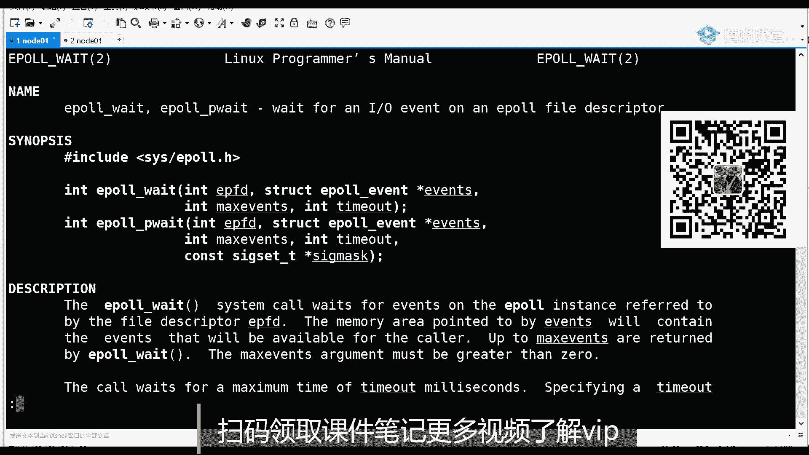

这三个对应到什么地方，比如说像刚才画这张图的时候，这张草图的时候，那么在我程序注意注意听啊，现在开始跟了，我先把cpu这事儿给你删一删，删一删，大哥你还原回来，那么在程序初期运行的时候。

程序是server，注意无论是哪种io模型，前三步他得得得得到第一个f一文件描述符，是雷神的监听的，得到之后才会做一件什么事情，马上这个程序会掉一个吸引将军的epo。

那么ile parade中间这个参数无所谓，他会给你返回一个值，它会返回一个，比如返回一个七，这个七是一个文件描述符，这个七描述的什么描述的就是其实这个在做一件什么事情，就是在内核开辟的这么一个空间。

这是第一个性状用户，而这一个程序里边一博cre掉几次呢，其实调一次就可以了，能理解什么意思吧，eo底层是一个线程接收请求吗，啊一会儿给你解释，从先跟着我的思路走看完啊，那也就是说第一步的时候。

这执行了eo create，好吧，那这个一博create它这个空间其实就是一个用f d的面表符，比如fd 7来描述的，这个字是不有点小啊，微拉大一点，那有了它之后，那上面我们是不是已经有一个文件内容。

三是监听等待别人接收的，那接收的时候怎么办，下一步他要做一件事情是apple不对，加上我刚才那句话，现在首先把这个这个a a p i写完，就为了在在哪写完，是不是要在七里边，然后做一个i的添加。

添加谁是不是把三添加进去，后面不写了，关于关于的事件事件写的吧，它关一个事件，什么事件，是不是就是in equin或者s，这样代码能看出来说明一跟着我的思路走，是不是evil create啊。

咱就给他开辟空间了，那这个f d怎么过来了，这个d怎么进来的，进来的时候其实用掉的是一炮cp，那么只要你放进来吧，下面这点很重要，只要你程序这个cpu在忙着他呢啊，该该该扔扔扔。

然后这个时候下边你其实可以写任何其他代码，添加完成之后，你可以写任何其他代码，你打一个五角星，打一个数组，然后出去上网或者爬别人动，你开始开始爬这些，你这些事情都可以做，就是在这颗cpu在处理程序之中。

但是这个只要这行代码执行完，只要这行代码执行完，你你的你只有多核cpu，只要多核cpu，那这个时候其实你的内核，注意这是内核区域，这个内核区域由于这个文件边符他其实对应的是我们那个i o的网卡。

对最终的网卡读出来的，可能读到这个文件描述，可能读到那个文件描述，只要能光看数据就发过来了，只要你网卡有数据，该机发过来了，那这时候其实你cpu是要处理这个数据，像这个内核空间去存放这件事呢。

那存档的时候，其实这个cpu可以既把数据存到他这个文件描述的八分里，也可以把这个文件描述符再去放到一个返回的一个区域里，那这个区域其实这个空间一般你查上网查的话，顶多会看到出一个红黑树的概念。

这个区域那未来的文件描述很多那个区域里的文件描述怎么去摆放的，就是我就是弄一个红霉素对吧，那这时候其实当你忙完的时候，但是最终我说了程序，你这关注状态啊，你状态这个l状态i状态，你怎么你你程序开心。

你什么时候想要状态了，你只需要执行一句一，那么一部位的话其实就这就这行，那你什么时候程序想要io状态了，直接执行就可以了，执行的时候你用空间带了一个一个指针，一个地址，一个集合，然后执行到这儿的时候。

就把这个区域东西拷过去，那你这个1p weight，其实你不光要说1p weight，只要掉一个e破位置，关键你要告你要改知道这个1p weight其实的时候可以达到什么效果，这是一个oe的复杂度。

就是你掉了就取回去了，因为在你这点这些个代码中间的时候，其实l o状态到达以及这个梳理这块，不是因为你掉了才去往这边挪的，是他那边可能并行的，已经把这东西挪过去了，该到中间来刷过，一不。

网上那些很复杂的一套理解，就是通过这样一个简单的，你要先去理解，学会前边的，如果前面我这个不给你讲，我觉得我说咱们上来直接讲一炮啊，你很难去get到这里面的这个痛点，你他为什么要这么去设置。

非得不等待吧，等待我只是说最优的，你看我每一句措辞都非常严谨，是最优的时候，也就是说你这个代码执行的时候，他毕竟是系统调用，前面那个系统监控直完刚放进去，再进去就来实践了，就扔过去了，那这里边有了。

那这时候你光都给他走了，但是还有一种情况是什么，就是你要你放了，但是谁也不发东西，这边永远是空的，你掉了位置之后，这边因为没有，所以胃才会在这阻塞等待，但是你还可以往里放一个时间。

比如我只是等待你10ms，没有的话就不返回，那么返回上就是-1，没有就代表没有，那我继续往下做别的逻辑，然后我只需要洗循环，一会回来再一投喂，这样就可以，一头胃口啊是阻塞的阻塞的。

但是它可以带一个time out，超时，而且你先记住啊，其实这些东西你的疑问就代表着不知道不应该不知道能不能代表。

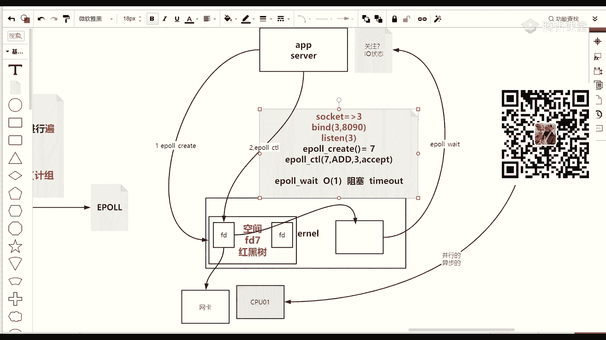

如果你写过slater的话，应该知道他身上有一个被看，就是当你调select的时候，叫select select的时候，你肯定用select select，是不是可以传一个时间，如果不传时间。

是不是一直在等待这有i o状态的通知，这个在这当中站着才能往下走，但是你加了个超时的话，那就多少毫秒，无论你有没有就往下走，只不过是是不是大于零，有没有得道而已，就这么一个基本的概念。

其实你先去积攒这些知识，积攒知识之后啊，然后我最终给你对应到咱们这代码，这个有代码，你其实看着更舒服对吧。

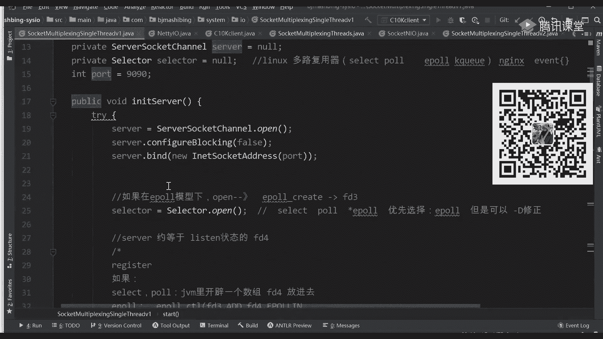

嗯比如说selly哥们一样，select也好，炮也好，还有epod wait也好，这三个都是询问状态的，只不过在1p里多了create和c调，往里添加了一件事情，如果e po里没有create。

没有cpl，那就没有这个空间，不能你增，那你调wait一波wait的时候，你是不是要把那些文件描述传递一次，我就退化成select或者po，我感觉啊你前面是不是知道哦，我谁来泡的时候，我是不是掉鞋带。

掉船很多文件名符，那这时候其实e po跟他做了件啥事，现在你非常清楚了，那其实e poo就比他多了两个系统要用，一个是create，一个是c t l一波位的其实还是想取之剑的。

只不过一波位的其实类类比什么一波位的，类比曾经的死宅和泡那个调用，只不过以前slipo上传很多，现在我只需要调一个位置就可以了，就不需要传递那些人，这本书因为传递件事情被线性的打在了他曾经到达的时候。

这样的话每次循环他就不需要重复传递，对吧，我说最优的时候它可以达到一个o一的，比如说你掉了，这边直接取走了，也没有等待，也没有便利的，什么事都没发生，就最优的时候好吧，那这个i o的模型啊。

从我们的b l o l到多次器这两个模型，这几个尤其到多次器的模型当中。

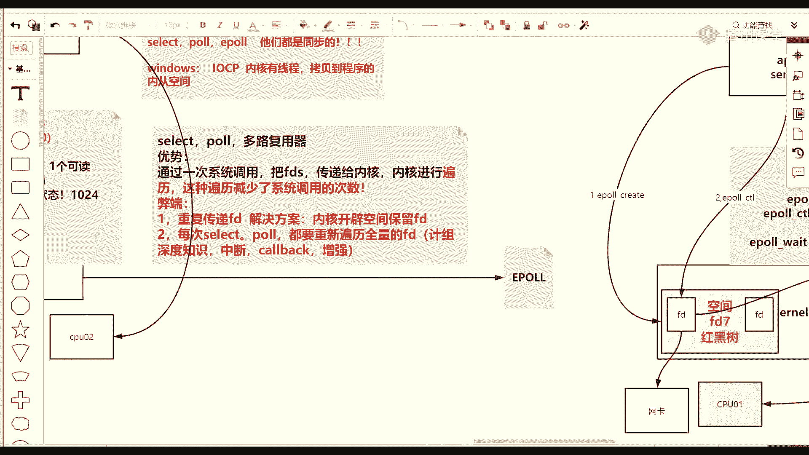

给你讲完了，第八天一炮，我真的想看什么，但是在看了个之前。

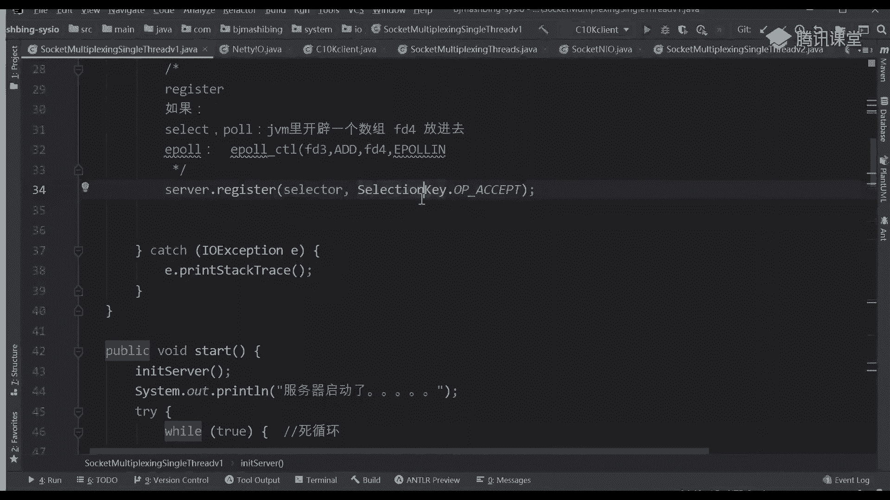

我们得先看一下代码怎么去写，你去java代码理论知识给你讲明白了。

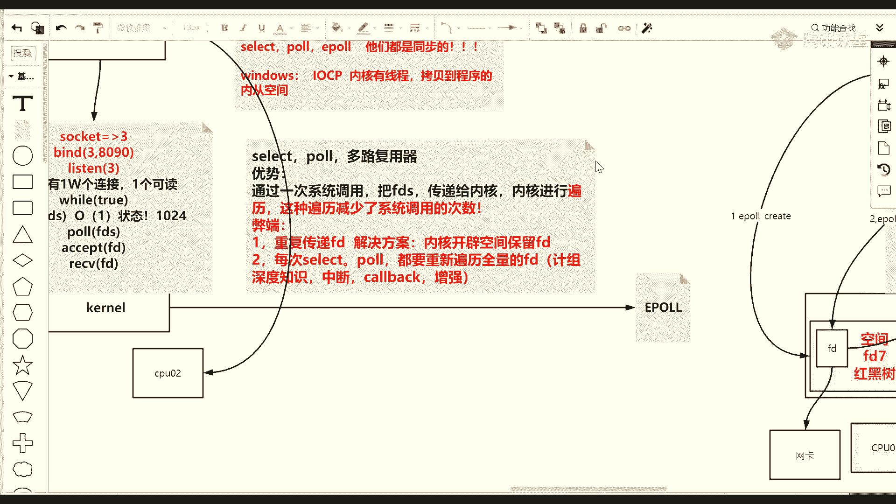

如果最终不和代码去这个关联的话，就像说如果不以结婚为目的的谈恋爱都是耍流氓。

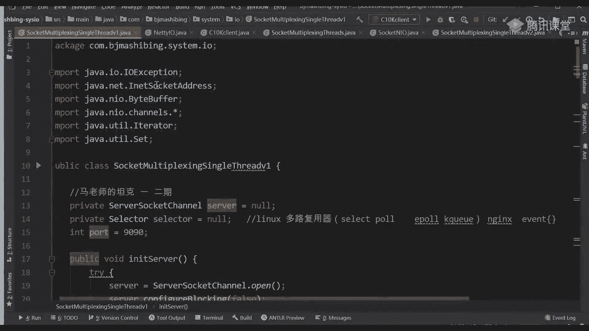

哎对对对，那个nsb同学n s b同学很聪明啊，他问了一个问题，如果有新的d，然后注意看，如果假设走走过来啊，就是一波位的时候得到了一个，比如说这个开始的这个文件描述几是不是三三。

是不是关心的就是accept接受了这件事情，如果他被挪到这边，代表什么意思，就是他如果这个f d被挪过了，代表什么意思，跟着我思路走啊，这是在你e pocdl的时候，七里边放了三了。

三里面关键的cept，但是这个这个被挪过了，这个位置也取到他了，代表的是有新新年年想建立连接，对不对，唉那这时候其实一波位置之后有返回之后，一波位置返回，你要做什么事情。

是不是要自己去掉a c c ett去从三里接收一个新的，就是这么一个8f d8 是不是接受一个新的出来，这就是我说的，为什么e破它也是同步的io模型，因为最终还是让你成为自己去解决事件的这个读写。

或者这个建立连接的一个事情，i d你可以了解成就是就是连接它也可以代表文件，它是文件描述符工，在另类当中一切皆文件，他这都能听懂来刷波一，也就是最终程序还要自己去读写，自己去处理，所以这个同步模型。

那当你接受完这件事情之后，你要做件什么事，来了一个新的一个客户端，那你肯定要问这个扣端啥时候给我发数据呢，这图他啥时候给我发数据呢，是不是你关注这个这个这个i o未来的一个事件。

那你怎么去解决事件的问题，是不是只需要再执行一炮c t l在七里面，在i的一个八，爱了一个八，那关注八的什么事件，我关注他的可读事件，那这时候s8 就进去了，是不是进到这个区域了。

那就把它这又一个cl就把它放进去了，放进去之后，然后这时候你代码这个cpu跑，这个时候这个线程可以忙别的事情，但是最后你肯定写一个死循环里边又要掉一炮位置，一旦你掉了一波位置之后。

那这个时候下次的时候有没有可能f f t3 t82 个都被挪过来，有没有这种可能两个都被挪过来了，是不是有可能又有新的连接，且这个f t8 有数据可以读取，那这个e破位的返回里边，它的返回你可以动。

你是不是要再写一个循环便利f t3 去执行accept，然后遍历到f8 执行锐的读取，是不是可以继续操作，操作完之后，然后ag 3肯定得到一个九再添加，然后再循环，然后再一破位置。

就反正就是一个一群人循环，但是每次预防你发现不需要重新传递所有门那边服文件描述旨在创建，得到它的时候，我给你添加一次词条，一次理论理论上来说，对吧。

整体的ip这个从它的最开始原始的只能把一个listen放进去，三重进去，然后通过有利森有状态之后，为了之后，然后从伊森上面接到了一个新的，可不可以的一个连接的客户端，把他踢进去。

然后到最后技能键的连接就能读取数据，这块是不是走错了，边缘触发。

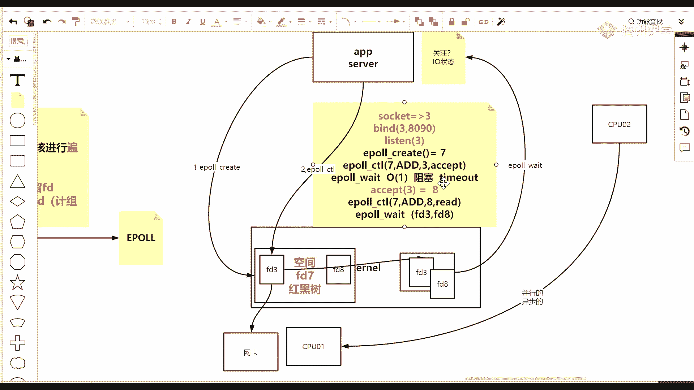

水平触发，那是另外一套。