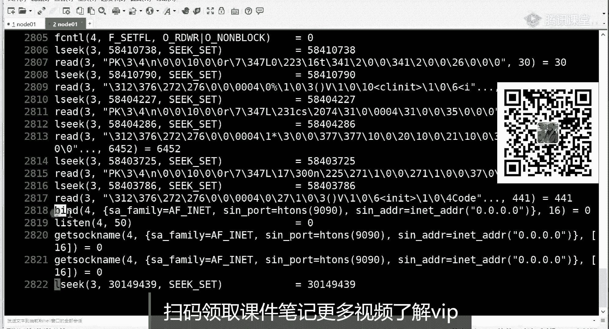
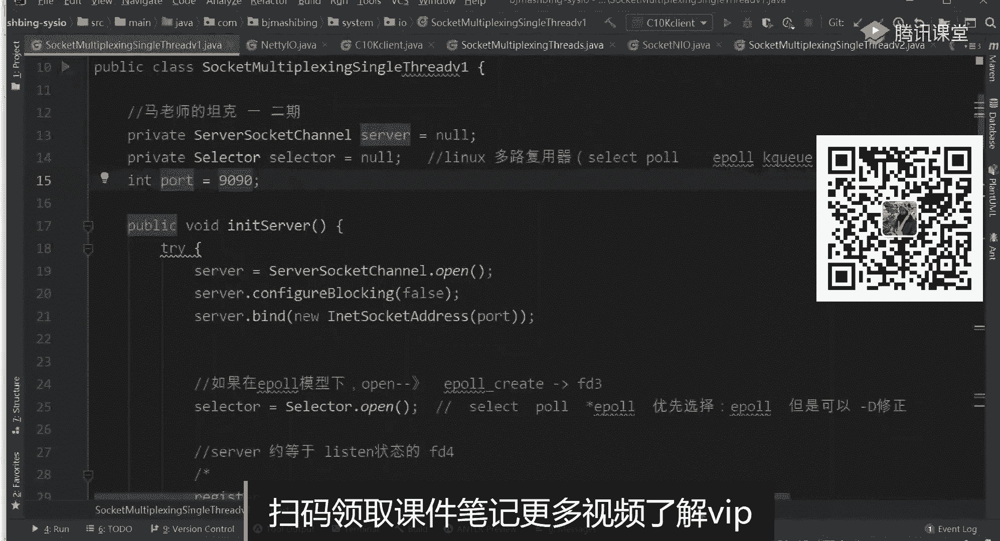
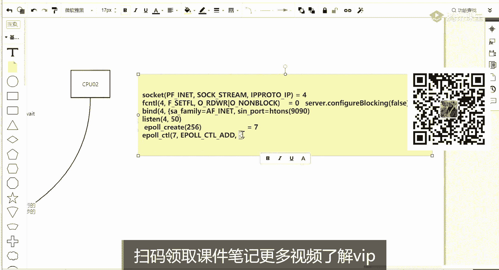

# 白嫖到马士兵教育价值23980的MCA架构师课程一次让你学够！ - P61：6 Eventloopgroup、pipeline、han - Java视频学堂 - BV1Hy4y1t7Bo

你先把这个epo这个学完整学明白了。关键这还不是这个还没有真正把群里面，我只是理论给你讲，到底他怎么去运作的，和大JDK的API怎么对英文的才那个那个才是重要的。

apple win是app调用还是 kernel调用，是我们的app调用。这个箭头方向吧反了。这三个是系统调用，都是提供。就刚才带你看了man进看的时候，都是内核提供我们程序调的。没关系啊。

这个理论听听个大概了。然后呢有些小问号的话，先停一停，把问号放在脑子里，放到你的疑问的列表里。然后我们先去把API过完API怎么去实现，怎么去对应的，全想明白之后，然后跑它用sp追踪它。

然后根据我们这java的代码是怎么回事。然后他的API是怎么跑的，没事给它这个看明白，好吧。

同意吗？同意咱骚66666啊，来讲这个东西。好，你来看。首先回到我们java代码当中。java当中呢，刚才说了有NIONLO当中除了有channel，然后有be bufferffer的概念。然后呢。

它还有一个概念叫做多路复云器select。这个现在我要写一个服务器端，我先在你整个左一边这个代码。现在写一个服务器端这个服务器端呢，然后呢我还是那句话，主要你是server端，你要绑定端口号啊。

该做的事情做这个在这啊在这就是schan open得到了server server呢然后给它制成非主色。

然后呢server点绑定绑定到我们的9090这是绑定900该该有这个listen这个list就已经有了。list之后，然后再往下走，注意这种select，它就是select点op。

但是这时注意了lect点op的时候，这个行为你虽然在java当中所谓得到的一个se。但是这个java当中lect是我操作系统到到底到底是哪个多路复用器呢？它可能是你的select，可能是你的po。

可能是你的Epo，也有可能是你这个unixing当中的Q。嗯。我没了我把电脑走完，你就知道多久掉一次一port位了。那么得到了一个select依据形式，然后这几个我都会给你往下捋捋一下。

因为这些东西其实底层也知怎么回事的，只不过它他们肯定有差异。但是这个一套AP怎么实现的，我都给你列举。那么通俗来说，select open如果供在一po的模式情况下。

就约等于掉了我们一po create在那核里边开辟了一个空间。这就能理解同学一就是在的时候，这没有没有任何效果。他顶多在java里边进程里边开辟的一个空间。

未来你要存所有的ID未来调时候就给那核传就可以了。但是如果是易的话，那这个这个这行open的话，其实在那核里边开一个空间的就这么一个异而已。

那么代码继续往走刚是个上得了个serv listen一个监听比那这时候他reg注册注册到哪去了，注册到了这个注册的时候注意听有有差异有差异因为你不器你很多了。

你也不是经那个只是说就就知道NL这跟单词的这个这个这个小伙伴那和个和个。slect和po是一种多路复印器。Epo是多是一种多路复音器。那reger到这个slect的时候，如果seide po的话。

其实就是把这个listen的文件面符放在你jajava这个进程的空间里边了。并没有做任何的操作。因为刚才说这个open的时候，如果是在s po的话，其实就扎紧那边开屏空间。

未来攒单的那边服以被你调s来到后的时候，能一口气传给那块。那现在其实就是开始攒先攒了一个离森。但是如果是易po的话。

其实按理来说就应该把这个list森的文件面符传递到我刚才你open在那核可瑞的那个空间里去了。听我来说个一。就在不同的多路数据模件下，同一套接口，其实里层的忙的事不一样，但是趋于趋于结果。

最后最后都要做做那个那个那个状态便利的一件事情。那前面就是准备就in serverer方法里要做的事情。那回到star方向，一旦调起的话，你ser跑完上面跑完跑完之后注意看服务器已经启动了。

那这时候注意注意看啊，where to死循环。啊，所死循环每一次循环每一次循还做一件什么事情？没有执行eleCTL吗？添加进去不是CPL吗？艾特就往里添加嘛，对不对？先往下看先往下看。

上面这两个先不用管，往下走到这步，在循循环里边我多做了一件事情啊，再做一个循环wellwell里边做一件什么事，select select。哎，那slect这多西复文器开始调s，调select的时候。

注意它有返回值。那其实在JJDK的语语义当中，就是多路器查询一下有没有哪些曾经reger注册过的IO可以读写了，有几个是不是大于0。能理白什么意思吧？就是这个它的这是它的JDK的语义。

但是这时候其实JDK的语义，它是叫GDM虚拟机，最终是如何和我们的这个物理操作性内核挂挂上钩的。因为多了分印器又分为两大类spo和Epo。所以这个s的过程又分为两件事情。如果你是在slash后的时候。

其实slashslash就约等于调了slash或者调了po，把你在java里边注册的那个reger那刚才那那些文件面符作为参数传递给那个。这是一类。

但是如果你是这个这这个DVM启动的时候选择的是Epo的话，那这一行代码其实约等于掉了weightit。能该到同学来说个一。对吧这就是我说为什么一old wait约等于曾经的slect或po标用。

是吧这就这能ge到的点了。哎，那么当如果大于零的时候，当大于0的，就side返问结果说哎，无论调了side po，它阻塞一会给你返回了，还是掉了wa，然后那边最终给给那个有可能阻塞就能立刻给你返回了。

哎，有大于零有有有那么几个了。啊，你可以设置超时间，当大于0。有了几个之后，那么再往下走，在这个这步slect点点s key就是最终返回那个你不是告诉我几个了吗？那几个是谁。

然后他拿到之后在他身上得到迭代器，也是re。那这时候开始逐一便利你的每一个IO这个这个过程是要逐一便利你的每一个IO的。那么拿出一个IO拿这个K之后。

然后这时候看判断你从英了里你你关注的它事件是什么事件，他有可能这个是一个listen的，你可以接收它，有可能是某一个你建立连接的客户端，你可以读取的，这时候就可能会有不同的处理方式的。

但是在这里面非常重要。但是在在这里面非常重要啊。因为你要想成一件事情，就是如果是一个leaing的accessible或者是一个可读的readable。那么尤其在accessible的时候。

我们先说这个啊这个是最最最最重要的。就是你你是leasing的状态的文件面符那个那个server它有人建立连接了。那这时候在处理的时候，其实你要处理哪些事情。

我们跟您去看啊ac handleler把它可以传进去了。你要做一件事情，就是在他身上拿到曾经那个serv channel。后第一个接收这个想都不用想。因为别人来了嘛，你就是同步的IO模型。

你一定在程序里面自己去接收这个客户端，并且呢再给它制成一个非注册最重要的是你要把个客户端还要再做一件什事g个谓多器里。但是完就刚才是er注册现在客客户端注册。那客户端注册的时候。

其实跟server是一样的。如果底层是或模型。它其实就在DVM里边那个空间里边存一下这个FD这个客户端，以被未来你再调时候，能把它从用户空间传递给传递给内。但是如果是模型的话。

其实这个时候又类似于调一个艾进我们个的客户端内核里去。就是多路分析不一样，它的实际践逻辑可能不一样。啊，这个到现在能在代码逻辑上知道javaNL包中的sl代码编写逻辑了。你现在在看这个编这个代码逻辑。

是不是就不是说等于被动的别人嚼完喂给你的。你是在在这种审视的角度，我已经知道底层IO模型是啥了。你这到底怎么去把它实现出来的，我一定要弄明白这件事情，这感觉是不是出来了？😡。

大家都是在学习改两种学习方式是不是不一样？Yeah。实际的nty也是这么用嘛，1令I就是这么去。没有区别没有区别。而且它其实复杂了一点，它里边有一个现能值这么一个概念，我给你演示一下。🤧或头能分享的？

好好听啊，后边可以分享。哎，这个是从这这个代码当中，就是你为什么要去写无缘无故？就是有人说过啊，说其实用javaBO代码好写，你要用java的NIO去管理网络IO通讯的时候，代码写的好复杂。

又得干这事儿，又得干那事儿，你还得干这事。其实它停留在什么呀？就是不了解多复用这个IO演那个过程，只是停留在我要拧着头皮去学API好像这么写，好像这么写，开始死记硬背这个API。但是其实你要扭过来。

先学IO模型啊，把多多分器的模型学明白之后，才能做电研试。嗯，我给你最终吧，就是。我们再再来看一个东西啊。因为最后其实这两天你也发现了，用那个st追踪的话，反而更容易理解这件事情。

用哪种多路复文器是根据操作系统不同实现的吗？我刚才一再强调，像linux有兰po一po。像unix的话，它有kiQ，就类似于我们的epo，像windows有IO完成端口，有这个这个还有它的s。

而且slash是属于p标准的po标准就任何操作系统基本都支持slash这个系统标用。这种多路分印器。嗯。然后我们看一下啊，这有一个单线程的版本的，就是socket登录复印器，单线程那个版本的。

这个其实都是我前天嘛，还是周几周二的时候，还是我忘了周几了，讲正好VIP课讲完。里边的一点点。啊，这个就是我。它这个代码you select open，这个就是我刚才那个代码，然后今天做口是9090。

这里面用了slect，然后呢，代码当中会有一个。嗯。1那个是。小啲爸你好。这样给他去了。然后到这selectselect之后，然后我这是不是零了，就没有没有组没有没有这个没有一个。比如我50毫秒。

就直接再再让它循环一次，就一直在这阻塞的，就一直等到它这个所有代标当中最少有一个I有实件了，就可以就可以返回了，直接让让让代码在这阻塞啊，就并没有并没有让他去。有一个超时的概念。

我为了是把性标用帮帮你们追一遍，看他是不是这么去跑的，跟我那图得对得上，这是目的，向下走都没问题。应该不得。好，我们先跑一遍吧。怎么去怎么去做呢？down了C。第。然后再去要追踪了strs杠什么呀。

是不是FF所有现程杠Oout输出文件开头，然后追踪的是我们扎了这个程序，然后后边加了这个字典码是。好。cllan为什么要重新注册？cllan不叫做重新注册。cllan不是重新注册，注意看张图啊。

你cllan就是开始开辟空间，空间是空的，只有第一个有leaen，先把listson放进去了，完件没法符。当你得得到客户端，客户端第一次被except被得到的时候，他要第一次放进去，它不叫重新注册。

它只会注册一次。

走把这边跑起来。跑起来之后，然后我们来追踪了。能这个我在做什么事情，能能听懂吗？这个不需要重新讲啊。😡，看刚才那个大程序已经跑起来了，这个就是主线程，而且我那个里边也没有使用多线程。

就是11641这个out。那么1641里边做了哪些事情？VIout点1641。其实你只要在把这步走完，注意听啊，我想教你们学习方法，在座的所有同学，如果你这节课好好听，把我现在所有操作的事情以后。

你也这么去学习的话，你才能真的理解这个知是一件怎么回事。比如像现在我其实我也怀疑啊，他到底是怎么怎么执行。但是只要我把系统调用给它捋清楚了啊，你这个代码就就是这么跑，比说打开它。这里面我搜什么东西。

搜1个9090这个登录号。在成立当中，我是sber第一件事情肯定要建立监听，他他肯定是围绕我们90有办的，办的时候绑定谁绑定个4上4上肯定要绑绑定9090，且4上一定要开启监听。

上面一定会有一个scket的是要得到4，这个事儿我都不掩示了。这就是我画图上面说的前三部曲，无论哪种L模型必走的。

这个能盖造下来说个一。Yeah。

嗯。对吧这个有了之后，那跟着我代码所维逻辑走的话，那这个时候其实你有离的话，你要把它放到哪去，要放到我们Epo的一个空间里。那epo空间是不是一定会有一个epo create。

那Epo create在哪？我们来往下走一走啊，或者你直接搜，先记住他这是2899哈。😊。

以后。C。2872行，这是不是一个Epocurate得到了一个7。对吧得到了一个77有了之后，然后我们找是不是有一个EpoC条，中就就就就看看这看这啊。E口C条在7里边添加了，只添加了一个5。

除了有5的外，它应该还有一个4。但是因为咱们还有一个4。Yeah。是不去了。我再搜一遍整本啊，它是开辟两个吗？一个是。4。只有这一个我再看我再我再我再看一眼啊，这有一个，刚才不是他往里添加的是。

5、并6天4。半的。4到909年。切。我把原始的行像找到吧。socket，然后点儿。行。Yeah。等于4。小俊好，是2642号。IPV6得到了一个4。

咱们做笔记吧。平き？就是用户空间里面掉了第一掉了这么一个指令。

得到了一个文件描符4，然后再。还关闭了关闭的话，代表这个不对啊，这个这个这个四又被关闭了。4往下走。这还有个4啊，这个是IPV4的是内行。

是2802行，掉了这样一个，得到了一个4文件描4。往下看啊，除了得到它之后，是不是有一个Fc控制，然后看这个单词什么意思。

是不是非堵塞了？跟着我思路走啊，能看懂吧？这个前面客户是不是说过一个非组色，而且这个上面这一行，然后它然后这个非组色什么意思？这个非组色约等于我们GDK代码当中是不是有这么一个配置？

就是在so的时候，你是不是设置过？

他约等于什么？就就等于他。什么意思？是不是控制我们是listen，它是一个这个com blocking堵塞吗？fis不堵塞okK吧，接着往下走。

登了它之后，就是2805行往下走。哎，到这是不是要绑绑定和listen了？然后在这块的话，我就把它复制出来，后边不不复制了太长了。

根据程序的线性执行，在一颗线程里边下一步执行的话就开始办的绑定9090了。这在我JDK代码当中，其实就是在做办的绑定我那个炮的9090是不是对应上了，听我同学来说波一。

绑定完之后开始离升，开启了监定状态。

嗯。这个5十是啥？昨天一直有人问啊，这个其实在我VIP课里已经讲过了，这个50叫做backclo。

再搜一下什么是白浪。好，那再往下走，有了监听之后，往下走，它的易碰壳位以置。

哎，直行到28702的时候，ele create得到了一个7。

这个七直行到7的时候，执行到7，你你就执行到这啊，你跟我左边这个图比一比。是不是set绑定listen，然后呢epo create，然后得到了一个7，这个7是把指向这个空间了，这个空间是不是有了。

跟我代码这个图跟我代码，这个代码这用逻逻辑是不是一模一样？

有了它之后，然后再往下epo，再往下是epoCTL。但是这一步为什么添的是一个5，先不用管他们先看啊，把它啊就在这了。

他做了一个pa应该啊他是做了一个pa应该。这是在epoC调里边的7里边是不是开始做艾特添加了？添加的时候是不是添加了一个5，这个数值我说了，你不用管它这个数值你不用管它是不是添加了一个5。

这个五是怎么来的。但是我们上面是绑定listen的是不是4，这个四和这个5上面它应该做了一个。

绑定的一个pad的一个绑定的。五和6一个绑定。Yeah。看返回我。好的，第二。搜的是等号，后边有一个5。这是200多行，不是2600，在这儿open。healthy net interface这一个。

就这样。你整理。net65，然后得到了一个5，这是控制5，然后怎么找到它和我前面那个四是一个关关系。那是。这还clolo5了，clos4。四也被关闭了，然后再往下。我去看一眼这个文件描符，稍等。嗯。

GPS我们当现的进程是1640，对不对？啊。それよ。四是我们监听的，看有我吧，我说他是一个pad，它是一个对接的。这个五是和这个四是有对接的，就是他俩是绑定应该是绑定在一一起的才对啊。

5和665和6去绑定一个管道56，然后在7里边，刚才在7里边，我们只是添加了哦，我知怎么回事，我这道怎么回事了。

sorry算，这只添加了5，这个五是谁，先不管了，这个五是添加了这个一个管道，这个管道是要获取一个。县城那核一个通信的，这个先不用买，后边一定会有一个不不不着急，我带你看啊易炮。

少少跟了CTL后边一定会在7里边点星4。也定有这样的一个调用。看这了吧，只不过行数多了点，刚才2800个行，其实其实到这行这行才对，在epoCTL里边一定会在7里边epo艾4。

那个五追追追错了，五五不是啊，你就即便追了一个5，他后边是不是也依然是在后续当中做了一个在七里添加添加四四是谁？四是不是就是我们那个监听，这就对了。5不用管的551个pa是一个管道啊。

这是不是一定会把4天进去？没错，哎，源码这是会创建一个pad，的确会创建一个那这这这个到这步能看出来设微一就这样很很重要，就最终是要把4天进去。

天去之后，然后再往下走。嗯，把它添进去吧，然后再往下走的话。往下走到2906行来了，重点来了。

开始一波胃痛。啊，中间这些乱七八糟东西不用管它，做减法全部丢掉。最终我们梳理出来的，像paP那个也给它删掉。

是不是当我一个程序启动的时候，我把它梳理一下，公作左边图梳理一下，开始我程序启动的时候，是不是得到了一个4，并把四设成非主色，并把四绑定到登口号上，并把四接定起来。然后呢。

我是不是得到了一个7的一个个文描并里把进去之是是开始阻那是什么是不是就是我们首先跟图对上的话，就是程序肯定完成切三步得到7得到了一个空间。

然后呢并把这个这个7里边添加我们这个监接的文文件描那到我们个的时候开始给你讲，注意看我说这里面open了得到了如果是的话，这等于得到了一个空间。然后呢在注册的时候，其实注册了CL那调的候其实约等于调。

我是没有设置time out，没有设儿那过期时间的啊，没有设置时间，所以他一直一直会在这阻塞。就代码其实刚才。你要明白java代码，你能写出这么多来。

且现在你知道java代码的执行逻辑也应该是这么一个逻辑。其实你也看到了java代码底层是真的这样去执行的。而且你相应的这个代码的这个底层这个调用，你还能给它切出来，已经已经到位在这了。到这儿现在不懵了。

能听懂同学来设个一。

很清楚吧啊就是从开始学理论啊，学到GDK的使用，到最终它的这个这个应用。

嗯，往下走啊，咱们还得看客户端是不是还得注册进去，这是2906哈，这是一个位子紫色了，我把它关掉。😊，用tel这种动态追踪的方式，outt点1641。动态追踪的方式赶紧走。那么是不是动态追踪的话。

这文件刚才就组合在这就就就到这儿。那么因为前面是没有人和他建立连接，对不对？那如果我一建立连接，代表着这个epo wait epo wait在做一件什么事情。

其实epport wait就在等这个空间有没有东西，我可以去走。但是目前来说是没有这些东西。

因为没有人建立连接，也没有人发来数据。连第一个客户端都没有的，是这样的，是这样的一个状态。

那这时候如果我标击和这边建了一个连接，连接进来之后，那这边wa可能就是因为有连这个这个你想建了连接嘛，肯定会产生一个事件，这个挪过来，然后wa了才会有返回值。

一步位的就有返回，返回的时候就可以执行ac，对不对？哎，那这时候我们来做一个演示，连接一下NC local host。

9090能能听懂我想做一件啥事的来12波一。好，走先看啊。第一个这边是不是新的客户端，53687进来。那一个连接过来的话，一定会造成连接建立连接这个事件，这个事件一定会被谁捕获。

被epo wait来捕货。我们找上面刚才那个一po wait。就是开始我跳的时候，十行往下走走走，到一po位的这T加4，然后到这时候开始阻塞了。阻塞之后，然后看我找连接进来之后，谁产生事件了。

是不是产生了一个Epo in的事件，就是输入端的一个事件，这个这个in一po in既可以是建的连接，也可以是这个数据到达。那是哪个文件描符呢？是不是4号文件面符，四是谁？四是不是我们监监听那个文件描符。

看这张图。

是不是四就是我们监听的，你是不是刚把4先进进去，一位的时候，是不是在这个wat返回的地表里边，是不是收到了4有一个事件，这个事件是不是就是in？

对吧那么进到进到这个in之后，再往下走，那你有这个事件了，那下边我们代码要做件什么事情，是不是要接收这个从四上就要接收这个in的事件，就接就叫accept这个这个4。所以你代码往下走。

它就一定会有一个accept。是不是会except在4上去接收一个新的客户端，得到了文件名从8。

看懂了吧？就代码执行往下走的话，那这时候要接收接收得到一个文件描8，我把这个相应的没用的给它删掉啊。得到8之后，你现在告诉我，如果excel得到了一个8了，在我们这个多数器的在代码中得到了一个文件门8。

得到了一个客户端，下周应该执行什么东西？😊。

下面应该做一件什么事情，把八给添进去，对不对？所以这时候往下走。你就一定会看到一个。这是我屏幕打印的，也现在打完了EpoCTL在7里听见吗？刚才我有人问，那，如果新的连接怎么贴进去的。

代码是不是这么往下走的？

龙是不是又把八听到七里去了？那这行你要真正的明白，当这行执行完之后，请问。请问七的空间里有啥回答？没错，有四有8。

能学到这儿就很聪明了。所以这时候在epo位的时候，为他在为了谁为在7里边为他那个4个8，到底未来谁会有事件，谁有了光能就返回了。所以下面继续执行epo位。

e wait一 wait随着有新到达的就添进去，然后接着一 wait，随着新到达就添进一 wait。那中间ee wait有了结果之后，到下次e wait之间。

就是你所有的接收和所有的数据处理的这个这个这个这个时间线。那在这儿也可以得出一个结论，在这个wa和这个wa之间，如果隔得很久，十年执行了时间代码才到这个。

